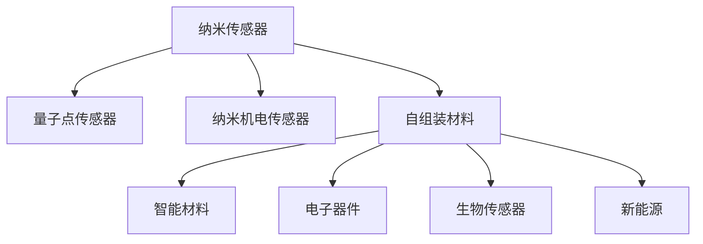

                 

## 1. 背景介绍

纳米技术自20世纪末提出以来，已经经历了几十年的飞速发展。从早期的纳米材料制造到近年来的分子机器人，纳米技术正逐渐从一个科学概念转变为现实中的工业应用。展望未来，预计到2050年，纳米技术将带来一系列颠覆性的变化，尤其是在纳米传感器和自组装材料领域。

纳米传感器作为实现精准控制和实时监测的关键工具，在医疗、环境保护、食品检测等领域将发挥至关重要的作用。而自组装材料则因其独特的性能，有望在智能材料、新能源、电子器件等领域带来革命性的变革。本文将从这两个方向，深入探讨纳米技术的未来发展趋势，及其对2050年社会的潜在影响。

## 2. 核心概念与联系

### 2.1 核心概念概述

纳米技术是指在纳米尺度上（1至100纳米）进行的科学研究和工程技术应用。它涉及从分子、原子层面上对材料和设备的设计、制造和操控。

**纳米传感器**：一种能在微小尺度上检测和传输信息的传感器。常见的纳米传感器包括量子点传感器、纳米机电传感器等。

**自组装材料**：通过物理或化学作用，在没有外部干预的情况下，原子或分子自发组织成具有特定功能的新材料。自组装材料具有独特的物理和化学性质，在智能材料、电子器件等领域展现出巨大潜力。

**量子点**：由数个原子和分子组成的纳米级晶体，具有独特的光学和电子特性。

**纳米机电传感器**：利用纳米级的机械结构进行物理测量的传感器，具有高灵敏度、高精度等特点。

### 2.2 核心概念原理和架构的 Mermaid 流程图



这个流程图展示了纳米传感器和自组装材料在各个领域的应用：

1. 纳米传感器：包括量子点传感器和纳米机电传感器，它们用于检测物理和化学信号。
2. 自组装材料：可用于制造智能材料、电子器件、生物传感器和新材料，以满足不同领域的需求。

## 3. 核心算法原理 & 具体操作步骤

### 3.1 算法原理概述

纳米传感器和自组装材料的研究涉及到复杂的物理、化学和工程原理。以下是纳米传感器和自组装材料的原理概述：

#### 3.1.1 纳米传感器原理

纳米传感器通过捕捉微小尺度上的物理和化学变化，来检测和传输信息。其工作原理通常包括以下几个步骤：

1. **信号检测**：传感器捕捉到环境中的物理或化学信号（如温度、压力、化学物质等）。
2. **信号转换**：传感器将检测到的信号转换为电信号。
3. **信号传输**：电信号通过电路传输至电子设备，供进一步处理。

#### 3.1.2 自组装材料原理

自组装材料通常通过分子间或分子内相互作用力，在无外部干预的情况下自发形成具有特定结构的材料。其原理包括：

1. **分子间相互作用**：如范德华力、静电力等，使分子在特定条件下自发聚集。
2. **分子内相互作用**：如氢键、共价键等，使分子结构自发形成。
3. **动态自组装**：材料可以根据外界环境的变化，动态调整其结构和性质。

### 3.2 算法步骤详解

#### 3.2.1 纳米传感器设计

1. **材料选择**：选择适合特定检测信号的材料，如使用半导体材料用于光敏传感器，金属氧化物用于气体传感器。
2. **结构设计**：设计传感器的物理结构，使其能捕捉特定信号。例如，使用量子点作为光电转换材料，实现光的检测。
3. **电路集成**：将传感器与电路集成，实现信号的转换和传输。
4. **校准与优化**：通过实验和模拟，对传感器进行校准和优化，提升其灵敏度和精度。

#### 3.2.2 自组装材料制备

1. **材料选择**：选择具有特定性质的分子，如具有光响应性、磁性等。
2. **自组装过程**：在溶液中或基底上，通过物理或化学作用，使分子自发形成有序结构。例如，通过紫外线照射使分子自组装形成光响应性纳米结构。
3. **结构表征**：使用扫描电子显微镜（SEM）、原子力显微镜（AFM）等技术，表征自组装材料的结构和性质。
4. **功能测试**：对自组装材料进行功能测试，评估其性能和应用潜力。

### 3.3 算法优缺点

#### 3.3.1 纳米传感器优点

1. **高灵敏度**：纳米尺度上的信号检测能力，使得纳米传感器能够捕捉到极微弱的物理和化学变化。
2. **小型化**：纳米传感器具有极小的尺寸，便于集成到微小的电子设备中。
3. **多样性**：纳米传感器可以检测多种物理和化学信号，适用于不同的应用场景。

#### 3.3.2 纳米传感器缺点

1. **制备复杂**：纳米传感器的制备过程复杂，涉及高精度的微加工和集成技术。
2. **稳定性问题**：纳米结构的易失性可能导致传感器性能不稳定。
3. **成本高**：高精度的制造和材料成本较高，限制了其大规模应用。

#### 3.3.3 自组装材料优点

1. **自发形成**：自组装材料具有无需外部干预形成有序结构的独特性质。
2. **性能可调**：通过调整组成分子的种类和数量，可以调整材料的物理和化学性质。
3. **环境友好**：自组装材料通常对环境友好，且易于降解。

#### 3.3.4 自组装材料缺点

1. **可控性差**：自组装过程受多种因素影响，材料的形成过程难以精确控制。
2. **尺寸限制**：自组装材料的尺寸和形态受组成分子的性质和相互作用力限制。
3. **应用范围有限**：自组装材料的性能和应用范围受制于其自发形成的结构特性。

### 3.4 算法应用领域

#### 3.4.1 纳米传感器应用领域

1. **医疗健康**：用于实时监测血糖、血压、体温等生理参数。
2. **环境监测**：检测空气、水中的污染物质，如PM2.5、重金属离子等。
3. **食品检测**：检测食品中的有害物质，如农药残留、食品添加剂等。

#### 3.4.2 自组装材料应用领域

1. **智能材料**：用于制造具有自适应性能的材料，如智能织物、智能涂料等。
2. **电子器件**：用于制造新型电子器件，如自清洁电子设备、自修复电路等。
3. **生物传感器**：用于检测生物标志物、疾病诊断等。

## 4. 数学模型和公式 & 详细讲解 & 举例说明

### 4.1 数学模型构建

纳米传感器和自组装材料的数学建模主要涉及以下几个方面：

1. **信号检测模型**：用于描述传感器检测信号的过程。
2. **信号转换模型**：用于描述信号从物理量到电信号的转换过程。
3. **自组装模型**：用于描述分子自组装形成材料的过程。

### 4.2 公式推导过程

#### 4.2.1 信号检测模型

假设纳米传感器检测到环境中的信号 $x$，其输出为 $y$，则信号检测模型可以表示为：

$$ y = f(x) $$

其中 $f$ 为检测函数，可能是一个非线性函数。

#### 4.2.2 信号转换模型

将信号 $y$ 转换为电信号 $u$，可以表示为：

$$ u = g(y) $$

其中 $g$ 为转换函数，如线性放大、非线性放大等。

#### 4.2.3 自组装模型

假设自组装材料的形成过程由 $n$ 种分子组成，每种分子的数量分别为 $N_1, N_2, \cdots, N_n$，则自组装模型可以表示为：

$$ S = \sum_{i=1}^n N_i \cdot k_i $$

其中 $S$ 为自组装材料的结构参数，$k_i$ 为第 $i$ 种分子的相互作用参数。

### 4.3 案例分析与讲解

#### 4.3.1 纳米传感器案例

**案例：光敏纳米传感器**

- **材料选择**：选择具有光吸收特性的半导体材料，如SiC。
- **结构设计**：将SiC纳米晶体嵌入到导电基底上，形成阵列结构。
- **电路集成**：将光敏阵列与电路集成，实现光电信号的转换和传输。
- **校准与优化**：通过实验和模拟，调整材料和电路参数，提升传感器的灵敏度。

#### 4.3.2 自组装材料案例

**案例：光响应性自组装材料**

- **材料选择**：选择具有光响应特性的分子，如苯并环己烯（BHBP）。
- **自组装过程**：在溶液中通过紫外线照射，使BHBP分子自组装形成有序结构。
- **结构表征**：使用SEM、AFM等技术，表征材料的形态和尺寸。
- **功能测试**：在光照下，测试材料的响应时间和响应灵敏度。

## 5. 项目实践：代码实例和详细解释说明

### 5.1 开发环境搭建

开发纳米传感器和自组装材料的实践需要以下环境：

1. **硬件平台**：纳米加工设备（如光刻机、纳米打印设备）。
2. **软件平台**：电子设计自动化（EDA）软件（如Cadence、Synopsys）。
3. **仿真工具**：分子动力学模拟软件（如LAMMPS）。

### 5.2 源代码详细实现

#### 5.2.1 纳米传感器设计

**Python代码示例**

```python
# 信号检测模型
def detect_signal(signal):
    # 实现具体的检测函数，如使用SiC纳米晶体检测光信号
    # ...
    return detected_signal

# 信号转换模型
def convert_signal(signal):
    # 实现信号转换函数，如将光信号转换为电信号
    # ...
    return converted_signal

# 电路集成
def integrate_circuit(signal):
    # 实现电路集成函数，将检测和转换的信号输出至电子设备
    # ...
    return output_signal

# 校准与优化
def calibrate_optimize(signal):
    # 进行实验和模拟，调整传感器参数
    # ...
    return optimized_signal
```

#### 5.2.2 自组装材料制备

**Python代码示例**

```python
# 自组装材料制备
def prepare_material(materials):
    # 实现自组装过程，如使用紫外线照射BHBP分子
    # ...
    return prepared_material

# 结构表征
def characterize_structure(materials):
    # 使用SEM、AFM等技术表征材料结构
    # ...
    return structural_characterization

# 功能测试
def test_functionality(materials):
    # 在光照下测试材料的响应时间和灵敏度
    # ...
    return test_results
```

### 5.3 代码解读与分析

#### 5.3.1 纳米传感器设计代码

纳米传感器设计的代码主要涉及信号检测、信号转换、电路集成和校准与优化等步骤。其中，`detect_signal`、`convert_signal`和`integrate_circuit`函数分别实现信号检测、信号转换和电路集成的功能。`calibrate_optimize`函数通过实验和模拟，调整传感器参数，提升其性能。

#### 5.3.2 自组装材料制备代码

自组装材料制备的代码主要涉及自组装过程、结构表征和功能测试等步骤。其中，`prepare_material`函数实现自组装材料的制备，`characterize_structure`函数使用SEM、AFM等技术表征材料的结构，`test_functionality`函数在光照下测试材料的响应时间和灵敏度。

### 5.4 运行结果展示

#### 5.4.1 纳米传感器结果

```python
# 检测光信号
detected_signal = detect_signal(100)

# 转换光信号为电信号
converted_signal = convert_signal(detected_signal)

# 电路集成输出
output_signal = integrate_circuit(converted_signal)

# 校准与优化后的信号
optimized_signal = calibrate_optimize(output_signal)

print("检测信号：", detected_signal)
print("转换后的电信号：", converted_signal)
print("电路集成输出：", output_signal)
print("校准与优化后的信号：", optimized_signal)
```

#### 5.4.2 自组装材料结果

```python
# 制备自组装材料
prepared_material = prepare_material(BHBP)

# 结构表征
structural_characterization = characterize_structure(prepared_material)

# 功能测试
test_results = test_functionality(prepared_material)

print("自组装材料：", prepared_material)
print("结构表征结果：", structural_characterization)
print("功能测试结果：", test_results)
```

## 6. 实际应用场景

### 6.1 医疗健康

纳米传感器和自组装材料在医疗健康领域具有广泛的应用前景。例如：

1. **血糖监测**：使用纳米传感器实时监测血糖水平，帮助糖尿病患者控制血糖。
2. **心脏健康**：使用纳米机电传感器监测心脏电信号，预防心血管疾病。
3. **药物输送**：利用自组装材料制造智能药物载体，实现精准输送。

### 6.2 环境保护

纳米传感器和自组装材料在环境保护领域同样具有重要应用：

1. **空气质量监测**：使用纳米传感器检测空气中的污染物，如PM2.5。
2. **水质检测**：使用纳米传感器监测水中的有害物质，如重金属离子。
3. **自清洁材料**：利用自组装材料制造自清洁材料，减少环境污染。

### 6.3 食品检测

纳米传感器和自组装材料在食品检测中具有重要作用：

1. **农药残留检测**：使用纳米传感器检测食品中的农药残留。
2. **食品添加剂检测**：使用纳米传感器检测食品中的添加剂。
3. **食品品质监测**：使用自组装材料制造食品品质检测设备。

## 7. 工具和资源推荐

### 7.1 学习资源推荐

1. **《纳米技术导论》**：这本书全面介绍了纳米技术的基本概念、原理和应用，适合初学者系统学习。
2. **纳米传感器与自组装材料在线课程**：包括麻省理工学院、斯坦福大学等名校的课程，提供视频、讲义等资源。
3. **Nanoscale Horizons**：Nature系列期刊的纳米技术专栏，涵盖最新研究进展和应用案例。

### 7.2 开发工具推荐

1. **纳米设计和仿真工具**：如LAMMPS、COMSOL Multiphysics等，用于分子模拟和电子设计。
2. **纳米加工设备**：如光刻机、纳米打印设备等，用于制造纳米传感器和自组装材料。
3. **电子设计自动化工具**：如Cadence、Synopsys等，用于设计和仿真纳米传感器电路。

### 7.3 相关论文推荐

1. **纳米传感器研究**：《Highly Sensitive Nanoscale Sensor Devices》（Nature Nanotechnology）。
2. **自组装材料研究**：《Self-Assembled Nanomaterials for Smart Materials and Biomedical Applications》（Advanced Materials）。
3. **纳米技术与健康**：《Nanotechnology in Medicine》（Nanomedicine）。

## 8. 总结：未来发展趋势与挑战

### 8.1 研究成果总结

纳米传感器和自组装材料的研究在过去几十年中取得了显著进展。纳米传感器在信号检测和转换方面已经相当成熟，自组装材料在结构和性能控制方面也取得了很大突破。这些技术正在逐步应用于医疗健康、环境保护、食品检测等多个领域，展示了其广阔的应用前景。

### 8.2 未来发展趋势

1. **高灵敏度与高精度**：未来纳米传感器将进一步提升灵敏度和精度，实现对更微弱信号的检测。
2. **自适应材料**：自组装材料将变得更加智能，具备自适应功能，能够根据环境变化调整性能。
3. **多功能集成**：纳米传感器和自组装材料将更加集成化，实现多种功能于一体的智能设备。
4. **生物兼容性**：未来的材料将更加生物兼容，适用于体内应用。
5. **环境友好**：自组装材料将更加环保，易于降解，减少环境污染。

### 8.3 面临的挑战

1. **制备与集成难度**：纳米传感器和自组装材料的制备与集成难度较大，需要高精度的制造设备和精确的控制技术。
2. **稳定性与可靠性**：纳米结构容易失稳，材料的长期稳定性需要进一步提升。
3. **成本问题**：高精度制造和材料成本较高，限制了其大规模应用。
4. **生物安全性**：纳米材料和自组装材料的生物安全性需要进一步验证，确保其在生物体内的安全应用。

### 8.4 研究展望

未来，纳米传感器和自组装材料的研究方向将包括：

1. **新材料开发**：探索新的纳米材料和自组装材料，提高其性能和应用范围。
2. **智能化设计**：通过智能化设计，实现材料功能的精准调控。
3. **环境适应性**：研究材料在各种环境条件下的性能变化，增强其适应性。
4. **规模化生产**：寻找更高效、更经济的制备方法，降低成本，实现大规模生产。
5. **跨学科整合**：与其他学科，如化学、材料科学、生物医学等进行深度整合，拓展应用领域。

## 9. 附录：常见问题与解答

**Q1：纳米传感器和自组装材料的制备过程复杂，成本高，如何降低成本？**

A: 可以通过以下方式降低成本：
1. **批量生产**：提高制备过程中的批量生产效率，降低单件成本。
2. **自组装材料设计**：利用自组装材料的设计优势，通过分子间的相互作用，减少制备过程中的能量损耗和材料浪费。
3. **低成本材料**：开发低成本的材料和制备方法，如使用生物相容性更好的自组装材料。

**Q2：纳米传感器和自组装材料的应用范围有限，如何拓展其应用领域？**

A: 可以通过以下方式拓展应用领域：
1. **跨学科整合**：与其他学科进行深度整合，如将纳米传感器和自组装材料应用于生物医学、环境科学等领域。
2. **智能功能设计**：通过智能化设计，使纳米传感器和自组装材料具备更多的智能功能，如自清洁、自修复等。
3. **新应用场景探索**：探索新的应用场景，如智能纺织品、智能包装等。

**Q3：纳米传感器和自组装材料的稳定性问题如何解决？**

A: 可以通过以下方式解决稳定性问题：
1. **表面修饰**：通过表面修饰技术，增强纳米结构的热稳定性和化学稳定性。
2. **环境控制**：在制备和应用过程中，控制环境条件，避免纳米结构失稳。
3. **材料优化**：通过材料优化，提高材料的稳定性。

**Q4：纳米传感器和自组装材料的制备过程如何优化？**

A: 可以通过以下方式优化制备过程：
1. **工艺改进**：通过工艺改进，提高制备过程中的精度和效率。
2. **自动化技术**：引入自动化技术，减少人工操作，提高制备效率。
3. **模拟仿真**：利用模拟仿真技术，优化制备过程中的参数设置。

---

作者：禅与计算机程序设计艺术 / Zen and the Art of Computer Programming

