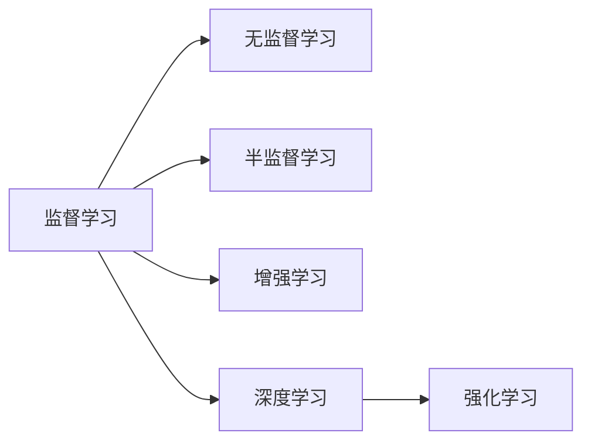

                 

# 机器学习算法在知识发现中的运用

## 1. 背景介绍

在快速发展的信息时代，数据量呈指数级增长，知识发现已成为推动科学创新和社会进步的重要手段。机器学习作为人工智能领域的重要分支，提供了一套高效、自动化的数据分析工具，在知识发现中展现出巨大的潜力和应用前景。本文将深入探讨机器学习算法在知识发现中的运用，帮助读者理解其核心原理和实际应用。

### 1.1 问题由来

知识发现（Knowledge Discovery）通常涉及从大量数据中提取有用信息和知识的过程。这一过程包括数据收集、数据清洗、特征选择、模型建立和结果分析等环节。随着数据规模和复杂性的不断提升，传统的人工数据分析方法已无法满足现代需求，机器学习技术应运而生。

机器学习算法通过对数据集进行训练，构建模型并预测未知数据，从而揭示数据中的潜在知识。这一方法在商业、金融、医疗、科学等领域得到广泛应用，帮助人们从海量数据中发现规律、预测趋势、优化决策，并推动技术创新。

### 1.2 问题核心关键点

机器学习在知识发现中的核心关键点在于其自适应学习能力，能够自动从数据中学习规律，并进行泛化推广。这一过程涉及到以下核心问题：

1. **数据预处理**：包括数据清洗、特征工程等步骤，提升数据质量和可用性。
2. **模型选择与优化**：选择适当的机器学习算法，并通过调参和模型优化提高性能。
3. **结果解释与验证**：将模型输出转化为可解释的知识，并通过验证确保结果的可靠性。

## 2. 核心概念与联系

### 2.1 核心概念概述

为更好地理解机器学习算法在知识发现中的应用，本节将介绍几个密切相关的核心概念：

- **监督学习（Supervised Learning）**：使用已标注数据训练模型，进行预测或分类。常用算法包括线性回归、逻辑回归、决策树、支持向量机等。
- **无监督学习（Unsupervised Learning）**：使用未标注数据训练模型，发现数据中的潜在结构和规律。常用算法包括聚类、降维、关联规则学习等。
- **半监督学习（Semi-supervised Learning）**：结合少量标注数据和大量未标注数据，提升模型的泛化能力。常用算法包括自编码器、半监督分类器等。
- **增强学习（Reinforcement Learning）**：通过与环境的交互，学习最优策略以达成特定目标。常用算法包括Q-learning、策略梯度等。
- **深度学习（Deep Learning）**：使用多层神经网络进行特征提取和模式识别。常用算法包括卷积神经网络（CNN）、循环神经网络（RNN）、变分自编码器（VAE）等。
- **强化学习（Reinforcement Learning）**：通过与环境的交互，学习最优策略以达成特定目标。常用算法包括Q-learning、策略梯度等。

这些概念之间的逻辑关系可以通过以下Mermaid流程图来展示：



这个流程图展示了大语言模型的核心概念及其之间的关系：

1. 机器学习算法包括监督学习、无监督学习、半监督学习和深度学习等，这些算法共同构成了机器学习的基本框架。
2. 监督学习和无监督学习是基础，分别用于处理标注数据和未标注数据。
3. 半监督学习结合了监督学习和无监督学习的优点，适用于数据标注成本高的情况。
4. 深度学习通过多层神经网络进行特征提取，适合处理复杂的数据结构和模式识别任务。
5. 强化学习通过与环境的交互学习最优策略，适用于需要决策优化的问题。

## 3. 核心算法原理 & 具体操作步骤

### 3.1 算法原理概述

机器学习算法在知识发现中的原理是通过对数据集进行训练，构建模型并预测未知数据，从而揭示数据中的潜在知识。具体来说，机器学习算法包括数据预处理、模型选择与训练、模型评估与验证等步骤。

1. **数据预处理**：包括数据清洗、特征工程等步骤，提升数据质量和可用性。
2. **模型选择与训练**：选择适当的机器学习算法，并通过调参和模型优化提高性能。
3. **模型评估与验证**：将模型输出转化为可解释的知识，并通过验证确保结果的可靠性。

### 3.2 算法步骤详解

机器学习算法在知识发现中的具体操作步骤如下：

**Step 1: 数据收集与预处理**
- 收集相关领域的数据集，包括结构化数据（如数据库、电子表格）和非结构化数据（如文本、图片）。
- 对数据进行清洗、去重、填充缺失值等预处理操作，确保数据质量。
- 进行特征工程，选择合适的特征表示，提升数据可用性。

**Step 2: 模型选择与训练**
- 根据任务需求选择合适的机器学习算法，如线性回归、决策树、神经网络等。
- 使用训练集对模型进行训练，调整超参数（如学习率、正则化参数等）进行模型优化。
- 使用验证集评估模型性能，避免过拟合。

**Step 3: 模型评估与验证**
- 使用测试集评估模型泛化能力，确保模型在不同数据集上的稳定性和可靠性。
- 将模型输出转化为可解释的知识，如分类结果、回归预测等。
- 进行误差分析，识别模型预测中的错误类型和原因。

### 3.3 算法优缺点

机器学习算法在知识发现中的应用具有以下优点：

1. **自动发现规律**：机器学习算法能够自动从数据中学习规律，无需人工干预。
2. **高效处理大规模数据**：机器学习算法能够处理大规模数据集，提升数据分析效率。
3. **提升决策质量**：通过数据驱动的方式，机器学习算法能够提升决策质量，减少人为偏差。

同时，这些算法也存在一定的局限性：

1. **数据依赖性强**：机器学习算法的效果很大程度上依赖于数据的质量和数量。
2. **模型黑盒问题**：某些机器学习算法（如深度学习）存在模型黑盒问题，难以解释其内部工作机制。
3. **数据泄露风险**：模型训练过程中可能存在数据泄露，影响模型泛化能力。
4. **超参数调参复杂**：不同机器学习算法有不同的超参数，调参过程复杂且易产生过拟合。

### 3.4 算法应用领域

机器学习算法在知识发现中已广泛应用于多个领域，例如：

- **金融领域**：用于信用评分、股票预测、欺诈检测等任务。
- **医疗领域**：用于疾病诊断、治疗方案推荐、基因分析等任务。
- **零售领域**：用于顾客行为分析、产品推荐、库存管理等任务。
- **社交网络**：用于用户关系分析、情感分析、社交趋势预测等任务。
- **交通领域**：用于交通流量预测、事故风险评估、路径规划等任务。
- **能源领域**：用于能源需求预测、智能电网管理、风电预测等任务。

## 4. 数学模型和公式 & 详细讲解 & 举例说明

### 4.1 数学模型构建

机器学习算法在知识发现中的数学模型构建涉及多个步骤：

1. **数据集表示**：将数据集表示为特征向量和标签向量。
2. **损失函数定义**：定义模型预测与真实标签之间的误差。
3. **优化目标构建**：构建优化目标函数，如交叉熵、均方误差等。
4. **求解优化问题**：使用梯度下降等优化算法求解优化问题。

### 4.2 公式推导过程

以线性回归为例，其数学模型构建如下：

**目标函数**：
$$
L(\theta) = \frac{1}{2m} \sum_{i=1}^m ||y_i - \theta^T x_i||^2
$$
其中 $y_i$ 为真实标签，$x_i$ 为特征向量，$\theta$ 为模型参数。

**目标函数最小化**：
$$
\theta = \mathop{\arg\min}_{\theta} L(\theta)
$$

**求解过程**：
1. 计算梯度 $\nabla_{\theta} L(\theta)$。
2. 使用梯度下降更新模型参数 $\theta$。
3. 重复上述过程直至收敛。

### 4.3 案例分析与讲解

**案例一：线性回归**
- 问题：预测房价。
- 数据：收集房屋面积、房间数量、地理位置等特征。
- 模型：使用线性回归模型，构建房屋价格预测模型。
- 结果：通过训练模型，预测新房屋的价格，并对比实际房价，评估模型性能。

**案例二：决策树**
- 问题：顾客流失预测。
- 数据：收集顾客行为、历史购买记录、年龄等特征。
- 模型：使用决策树算法，构建流失预测模型。
- 结果：通过模型训练，预测新顾客的流失概率，并采取相应的挽留措施。

## 5. 项目实践：代码实例和详细解释说明

### 5.1 开发环境搭建

在进行机器学习算法实践前，我们需要准备好开发环境。以下是使用Python进行Scikit-learn开发的环境配置流程：

1. 安装Anaconda：从官网下载并安装Anaconda，用于创建独立的Python环境。

2. 创建并激活虚拟环境：
```bash
conda create -n sklearn-env python=3.8 
conda activate sklearn-env
```

3. 安装Scikit-learn：使用pip安装Scikit-learn库。
```bash
pip install scikit-learn
```

4. 安装各类工具包：
```bash
pip install numpy pandas scikit-learn matplotlib tqdm jupyter notebook ipython
```

完成上述步骤后，即可在`sklearn-env`环境中开始机器学习算法的实践。

### 5.2 源代码详细实现

下面我们以线性回归为例，给出使用Scikit-learn库进行数据集构建和模型训练的Python代码实现。

```python
from sklearn.model_selection import train_test_split
from sklearn.linear_model import LinearRegression
from sklearn.metrics import mean_squared_error
import numpy as np

# 构建数据集
X = np.array([[1, 2], [3, 4], [5, 6], [7, 8]])
y = np.array([2, 4, 6, 8])
X_train, X_test, y_train, y_test = train_test_split(X, y, test_size=0.3, random_state=42)

# 模型训练与评估
model = LinearRegression()
model.fit(X_train, y_train)
y_pred = model.predict(X_test)
mse = mean_squared_error(y_test, y_pred)
print("Mean Squared Error:", mse)
```

### 5.3 代码解读与分析

让我们再详细解读一下关键代码的实现细节：

**数据构建**
- `X`和`y`分别表示特征向量和标签向量。
- 使用`train_test_split`函数将数据集划分为训练集和测试集。

**模型训练**
- 使用`LinearRegression`类创建线性回归模型。
- 使用`fit`函数对训练集进行模型训练。

**模型评估**
- 使用`predict`函数对测试集进行预测。
- 使用`mean_squared_error`函数计算均方误差，评估模型性能。

**输出结果**
- 打印均方误差，了解模型预测的准确性。

## 6. 实际应用场景

### 6.1 智能推荐系统

机器学习算法在智能推荐系统中的应用非常广泛。智能推荐系统通过分析用户的历史行为数据，推荐用户可能感兴趣的商品、内容、服务等。例如，电子商务平台可以根据用户浏览、购买记录，推荐相似商品；流媒体平台可以根据用户观看历史，推荐相关视频内容。

**技术实现**
- 收集用户行为数据，如浏览记录、购买记录、评分等。
- 对数据进行清洗、特征工程等预处理操作。
- 使用协同过滤、内容推荐、深度学习等算法构建推荐模型。
- 在测试集上评估模型性能，进行模型优化。

**实际应用**
- 电商平台：推荐用户可能感兴趣的商品。
- 流媒体平台：推荐用户可能喜欢的视频内容。
- 新闻平台：推荐用户可能感兴趣的新闻文章。

### 6.2 金融风险管理

机器学习算法在金融风险管理中的应用也非常重要。通过分析历史交易数据，预测未来交易风险，帮助金融机构制定更有效的风险控制策略。例如，信用评分模型可以根据用户的历史贷款记录，预测其信用风险；股票预测模型可以根据历史股价和市场数据，预测股票未来走势。

**技术实现**
- 收集历史交易数据，如贷款记录、交易记录、市场数据等。
- 对数据进行清洗、特征工程等预处理操作。
- 使用线性回归、逻辑回归、深度学习等算法构建风险预测模型。
- 在测试集上评估模型性能，进行模型优化。

**实际应用**
- 银行：预测贷款申请者的信用风险，控制贷款违约率。
- 证券公司：预测股票市场走势，优化投资组合。
- 保险公司：评估投保风险，制定合理的保险策略。

### 6.3 医疗健康管理

机器学习算法在医疗健康管理中的应用逐渐增多。通过分析患者的病历数据，预测疾病风险，辅助医生制定治疗方案。例如，疾病诊断模型可以根据患者的历史病历，预测其患某种疾病的概率；治疗方案推荐模型可以根据患者症状和历史治疗记录，推荐合适的治疗方案。

**技术实现**
- 收集患者病历数据，如诊断记录、治疗记录、症状等。
- 对数据进行清洗、特征工程等预处理操作。
- 使用决策树、随机森林、深度学习等算法构建疾病预测和治疗方案推荐模型。
- 在测试集上评估模型性能，进行模型优化。

**实际应用**
- 医院：预测患者患某种疾病的概率，制定治疗方案。
- 诊所：评估患者症状，推荐合适的检查项目。
- 远程医疗：通过患者历史数据，辅助医生远程诊断和治疗。

## 7. 工具和资源推荐

### 7.1 学习资源推荐

为了帮助开发者系统掌握机器学习算法在知识发现中的应用，这里推荐一些优质的学习资源：

1. 《机器学习实战》系列书籍：通过实战案例，详细介绍机器学习算法在实际应用中的使用方法和技巧。
2. 《深度学习》课程：斯坦福大学开设的深度学习课程，讲解深度学习算法和框架的实现。
3. 《Python机器学习》书籍：介绍Python机器学习库scikit-learn、TensorFlow等的使用方法。
4. Kaggle竞赛平台：提供大量数据集和机器学习竞赛，练习和提升机器学习技能。
5. Coursera和edX平台：提供多门机器学习相关课程，涵盖理论基础和实践应用。

通过对这些资源的学习实践，相信你一定能够快速掌握机器学习算法在知识发现中的应用，并用于解决实际问题。

### 7.2 开发工具推荐

高效的开发离不开优秀的工具支持。以下是几款用于机器学习算法开发的常用工具：

1. Jupyter Notebook：开源的交互式开发环境，支持Python和R语言，方便代码调试和数据可视化。
2. TensorFlow：由Google主导开发的深度学习框架，生产部署方便，适合大规模工程应用。
3. PyTorch：基于Python的开源深度学习框架，灵活动态的计算图，适合快速迭代研究。
4. Weights & Biases：模型训练的实验跟踪工具，可以记录和可视化模型训练过程中的各项指标，方便对比和调优。
5. Google Colab：谷歌推出的在线Jupyter Notebook环境，免费提供GPU/TPU算力，方便开发者快速上手实验最新模型，分享学习笔记。

合理利用这些工具，可以显著提升机器学习算法开发的效率，加快创新迭代的步伐。

### 7.3 相关论文推荐

机器学习算法在知识发现中的应用源于学界的持续研究。以下是几篇奠基性的相关论文，推荐阅读：

1. 《Deep Learning》书籍：深度学习领域的经典之作，介绍深度学习算法的理论和实现。
2. 《TensorFlow: A System for Large-Scale Machine Learning》论文：介绍TensorFlow框架的架构和实现。
3. 《AdaBoost: A New Learning Algorithm》论文：提出AdaBoost算法，提升分类器的泛化能力。
4. 《Large-Scale Parallel Algorithms for SVMs》论文：介绍支持向量机（SVM）在大规模数据上的优化算法。
5. 《Deep Belief Networks》论文：介绍深度信念网络（DBN），探索深度神经网络的结构和训练方法。

这些论文代表了大语言模型微调技术的发展脉络。通过学习这些前沿成果，可以帮助研究者把握学科前进方向，激发更多的创新灵感。

## 8. 总结：未来发展趋势与挑战

### 8.1 总结

本文对机器学习算法在知识发现中的应用进行了全面系统的介绍。首先阐述了机器学习算法的背景和意义，明确了其在数据预处理、模型训练、结果评估等环节的核心作用。其次，从原理到实践，详细讲解了机器学习算法的核心步骤，给出了机器学习算法在知识发现中的具体实现。同时，本文还广泛探讨了机器学习算法在智能推荐、金融风险管理、医疗健康管理等多个领域的应用前景，展示了其广阔的应用范围。此外，本文精选了机器学习算法的各类学习资源，力求为读者提供全方位的技术指引。

通过本文的系统梳理，可以看到，机器学习算法在知识发现中的应用具有巨大潜力。这些算法能够自动从数据中学习规律，提升决策质量和分析效率，在众多领域展现出卓越的应用效果。未来，随着数据规模和复杂性的不断提升，机器学习算法必将在更多领域得到应用，为社会进步和技术创新提供重要支持。

### 8.2 未来发展趋势

展望未来，机器学习算法在知识发现中的应用将呈现以下几个发展趋势：

1. **算法自动化**：随着机器学习算法的发展，越来越多的算法能够自动进行特征工程和模型优化，减少人工干预。
2. **数据融合**：机器学习算法能够处理多种数据类型，如结构化数据、非结构化数据、时序数据等，实现多源数据融合。
3. **模型集成**：通过模型集成技术，将多种机器学习算法组合起来，提升整体性能和泛化能力。
4. **自适应学习**：机器学习算法能够根据数据分布和任务需求，自动调整算法参数和模型结构，实现更灵活的适应性。
5. **深度学习**：深度学习算法在知识发现中发挥着越来越重要的作用，能够处理复杂的数据结构和模式识别任务。
6. **增强学习**：增强学习算法在决策优化和智能控制中的应用逐渐增多，能够通过与环境的交互，提升智能系统的决策能力。

以上趋势凸显了机器学习算法在知识发现中的巨大潜力和应用前景。这些方向的探索发展，必将进一步提升机器学习算法的性能和应用范围，为知识发现和智能系统的构建带来新的突破。

### 8.3 面临的挑战

尽管机器学习算法在知识发现中取得了显著成果，但在迈向更加智能化、普适化应用的过程中，仍面临诸多挑战：

1. **数据质量和多样性**：机器学习算法的效果很大程度上依赖于数据的质量和多样性。如何在保证数据质量的同时，处理多种数据类型，是一个重要的挑战。
2. **模型复杂性**：深度学习等算法具有较高的模型复杂性，需要大量的计算资源和优化算法。如何在保证性能的同时，降低模型复杂度，是一个重要的研究方向。
3. **模型解释性**：某些机器学习算法（如深度学习）存在模型黑盒问题，难以解释其内部工作机制。如何提高模型解释性，增强用户信任，是一个重要的研究方向。
4. **隐私和安全**：机器学习算法在数据驱动的决策过程中，涉及隐私和安全问题。如何保护用户隐私，确保数据安全，是一个重要的挑战。
5. **数据泄露风险**：模型训练过程中可能存在数据泄露，影响模型泛化能力。如何避免数据泄露，提升模型泛化能力，是一个重要的研究方向。
6. **超参数调参**：机器学习算法具有较多的超参数，调参过程复杂且易产生过拟合。如何简化超参数调参过程，提高模型稳定性，是一个重要的研究方向。

### 8.4 研究展望

面对机器学习算法在知识发现中面临的挑战，未来的研究需要在以下几个方面寻求新的突破：

1. **自动化算法开发**：探索自动化算法开发技术，减少人工干预，提高算法开发效率。
2. **多源数据融合**：研究多源数据融合技术，提升数据质量和多样性，实现更全面、准确的知识发现。
3. **模型解释性**：探索模型解释性技术，提高模型透明性和可解释性，增强用户信任。
4. **隐私保护**：研究隐私保护技术，保护用户隐私，确保数据安全。
5. **数据泄露防护**：研究数据泄露防护技术，避免数据泄露，提升模型泛化能力。
6. **超参数优化**：研究超参数优化技术，简化超参数调参过程，提高模型稳定性。

这些研究方向将推动机器学习算法在知识发现中的应用不断深化，为知识发现和智能系统的构建提供重要支持。面向未来，机器学习算法将在更多领域得到应用，为社会进步和技术创新提供新的动力。

## 9. 附录：常见问题与解答

**Q1：机器学习算法是否适用于所有知识发现任务？**

A: 机器学习算法在绝大多数知识发现任务中都能取得不错的效果，但某些特定领域（如符号逻辑、非线性建模等）可能需要结合领域知识和专家经验，才能获得更好的结果。

**Q2：如何选择适当的机器学习算法？**

A: 选择适当的机器学习算法应根据任务需求和数据特点进行综合考虑。例如，对于回归问题，可以选择线性回归、决策树等算法；对于分类问题，可以选择逻辑回归、支持向量机等算法。

**Q3：数据预处理的重要性体现在哪里？**

A: 数据预处理在机器学习算法中非常重要，能够提升数据质量和可用性。例如，数据清洗、特征工程等操作能够去除噪声和冗余信息，提升模型性能。

**Q4：机器学习算法在实际应用中需要注意哪些问题？**

A: 在实际应用中，需要注意以下几个问题：
1. 数据质量和多样性：保证数据质量，处理多种数据类型。
2. 模型复杂性：避免过度复杂的模型，防止过拟合。
3. 模型解释性：提高模型透明性和可解释性，增强用户信任。
4. 隐私和安全：保护用户隐私，确保数据安全。
5. 数据泄露风险：避免数据泄露，提升模型泛化能力。
6. 超参数调参：简化超参数调参过程，提高模型稳定性。

通过合理处理这些问题，可以最大限度地发挥机器学习算法的优势，实现高效的知识发现和智能决策。

**Q5：机器学习算法在实际应用中如何优化？**

A: 机器学习算法在实际应用中，可以通过以下方式进行优化：
1. 数据增强：通过数据增强技术，提升数据多样性和泛化能力。
2. 正则化：使用L2正则、Dropout等正则化技术，防止过拟合。
3. 模型集成：通过模型集成技术，提升整体性能和泛化能力。
4. 超参数调优：使用网格搜索、随机搜索等方法，寻找最优超参数组合。
5. 自动化算法开发：探索自动化算法开发技术，提高算法开发效率。

这些优化措施可以显著提升机器学习算法的性能，确保在实际应用中取得最佳效果。

---

作者：禅与计算机程序设计艺术 / Zen and the Art of Computer Programming

