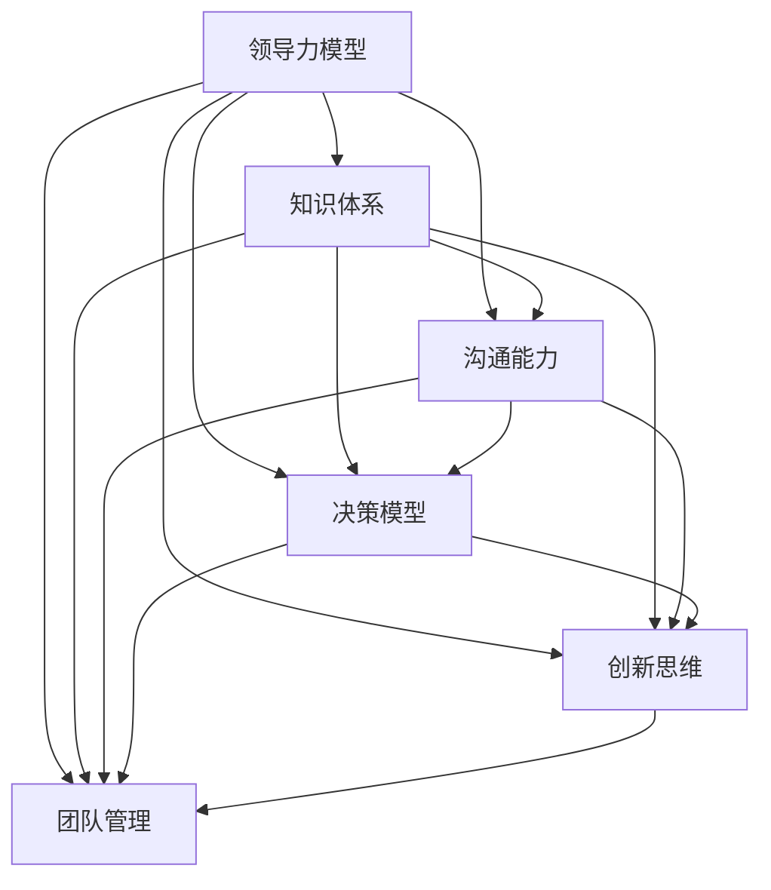

                 

# 构建个人领导力体系的方法论

## 1. 背景介绍

### 1.1 问题由来
在数字化、信息化时代，个人领导力的构建已成为企业和组织发展的重要因素之一。领导者不仅要具备专业知识，还需具备人际交往、决策制定等综合能力。然而，如何系统化地构建个人领导力体系，已成为摆在企业和个人面前的难题。本文旨在通过系统的方法论，帮助领导者高效地构建个人领导力体系，从而在复杂多变的商业环境中脱颖而出。

### 1.2 问题核心关键点
构建个人领导力体系的核心关键点包括：
- **知识管理**：构建系统化的知识体系，使个人知识结构更加完善。
- **人际沟通**：培养高效的人际沟通能力，提升影响力与协作能力。
- **决策制定**：建立科学的决策模型，确保决策的准确性与及时性。
- **创新思维**：培养创新思维能力，保持竞争力与创新性。
- **团队管理**：掌握团队管理技巧，实现团队的高效协作与激励。

### 1.3 问题研究意义
构建个人领导力体系，对于企业和个人的长期发展具有重要意义：

- **促进企业成长**：高效的领导力有助于企业制定科学战略，提高运营效率。
- **提升个人价值**：通过系统化的领导力构建，个人可实现快速成长，获得更多职业机会。
- **增强市场竞争力**：良好的领导力能提升企业在市场中的竞争地位，吸引优秀人才。
- **实现个人梦想**：构建个人领导力体系，有助于个人实现职业理想与人生目标。

## 2. 核心概念与联系

### 2.1 核心概念概述

构建个人领导力体系涉及多个核心概念，这些概念间存在紧密联系。

- **领导力模型(Ladership Model)**：指领导者需具备的多维能力体系，包括战略视野、决策能力、团队管理等。
- **知识体系(Knowledge System)**：指领导者所掌握的专业知识与通用知识的结构化体系。
- **沟通能力(Communication Skills)**：指领导者与人交流沟通的能力，包括语言表达、非语言沟通等。
- **决策模型(Decision Model)**：指领导者进行决策的方法与工具，如数据驱动决策、系统化思维等。
- **创新思维(Innovation Mindset)**：指领导者推动创新、持续改进的能力与思维方式。
- **团队管理(Team Management)**：指领导者管理团队、激励成员的能力，包括目标设定、绩效评估等。

这些概念相互关联，形成一个有机整体，共同构建起领导力的核心框架。

### 2.2 核心概念原理和架构的 Mermaid 流程图



## 3. 核心算法原理 & 具体操作步骤

### 3.1 算法原理概述

构建个人领导力体系遵循系统化、结构化的原则，通过以下步骤实现：

1. **评估现状**：使用科学工具评估当前领导力的水平，识别出短板与改进点。
2. **制定目标**：根据评估结果，设定具体、可行的领导力提升目标。
3. **知识学习**：通过系统化学习与培训，补充专业知识与通用知识。
4. **技能提升**：通过实战训练与模拟演练，提升沟通、决策等核心技能。
5. **创新实践**：引入创新思维，解决实际问题，推动组织创新发展。
6. **团队管理**：掌握团队管理技巧，实现团队协作与高效执行。

### 3.2 算法步骤详解

#### 3.2.1 领导力评估
领导力评估是构建体系的第一步。使用标准化评估工具，如领导力问卷、360度反馈等，全面评估领导者当前在知识、沟通、决策、创新与团队管理方面的表现。

#### 3.2.2 目标设定
根据评估结果，设定具体的领导力提升目标，如提高战略思维能力、提升团队管理技巧等。目标应具有明确性、可衡量性、可达性、相关性、时限性（SMART原则）。

#### 3.2.3 知识学习
通过在线课程、书籍阅读、工作坊等多种形式，系统学习领导力相关的理论知识。重点学习管理学、心理学、沟通技巧、创新方法等核心内容。

#### 3.2.4 技能提升
在实际工作中，进行模拟场景练习与实战演练，提升沟通、决策、创新等核心技能。例如，在团队会议上实践高效沟通技巧，或在复杂项目中锻炼系统化决策能力。

#### 3.2.5 创新实践
通过引入创新思维，推动组织内的新项目、新技术实施。如组织创新工作坊、设立创新激励机制，激发团队成员的创新潜力。

#### 3.2.6 团队管理
掌握团队管理的基础理论和方法，如目标设定、绩效评估、激励机制等。引入现代管理工具，如OKR、KPI等，提升团队绩效。

### 3.3 算法优缺点

构建个人领导力体系的优点包括：
- **系统化**：通过科学评估与目标设定，构建系统的领导力提升框架。
- **针对性**：针对个人短板与提升目标，进行有针对性的培训与实践。
- **持续改进**：建立持续改进机制，不断更新与完善领导力体系。

但该方法也存在一定局限性：
- **时间成本**：系统化的构建与提升需要较长时间，短期内效果不明显。
- **资源投入**：需要投入大量培训资源与实战机会，初期成本较高。
- **应用难度**：需结合实际工作场景，灵活应用所学知识与技能。

### 3.4 算法应用领域

个人领导力体系的构建，不仅适用于企业高管，也适用于各层级管理人员与团队负责人。以下是在不同应用领域的具体应用：

- **企业高管**：构建全面的战略视野、创新能力与团队管理技巧。
- **中层管理者**：提升系统化思维、决策能力与团队协作技巧。
- **团队负责人**：加强沟通技巧、绩效管理与激励机制。
- **新入职员工**：通过系统的培训，建立基本的领导力框架。

## 4. 数学模型和公式 & 详细讲解 & 举例说明

### 4.1 数学模型构建

构建个人领导力体系涉及多个数学模型，以下以系统化评估为例进行阐述。

假设领导力评估包括五个维度，每个维度分为多个子维度，评分范围为0-5分，总计30个评分项。构建领导力评估模型如下：

设 $X = \{x_1, x_2, \ldots, x_{30}\}$ 为30个评分项，$y$ 为领导力总分。构建领导力评估模型：

$$
y = \sum_{i=1}^{30} w_i x_i
$$

其中 $w_i$ 为第 $i$ 个评分项的权重，可根据实际应用场景进行调整。

### 4.2 公式推导过程

领导力评估模型推导过程如下：

1. **数据收集**：收集30个评分项的原始评分数据。
2. **权重设定**：根据专家意见或实际应用需求，设定各评分项的权重 $w_i$。
3. **计算总分**：将各评分项乘以权重，并求和，得到领导力总分 $y$。

### 4.3 案例分析与讲解

假设某企业高管领导力评估的原始数据如下：

| 评分项 | 评分 |
| --- | --- |
| 战略思维 | 4.5 |
| 创新能力 | 4.0 |
| 团队协作 | 4.2 |
| 绩效管理 | 3.8 |
| 激励机制 | 4.1 |
| ... | ... |

若设定各评分项权重如下：

| 评分项 | 权重 |
| --- | --- |
| 战略思维 | 0.2 |
| 创新能力 | 0.2 |
| 团队协作 | 0.2 |
| 绩效管理 | 0.2 |
| 激励机制 | 0.2 |
| ... | ... |

则计算该高管领导力总分为：

$$
y = 0.2 \times 4.5 + 0.2 \times 4.0 + 0.2 \times 4.2 + 0.2 \times 3.8 + 0.2 \times 4.1 = 4.08
$$

### 5. 项目实践：代码实例和详细解释说明

#### 5.1 开发环境搭建

构建个人领导力体系涉及大量数据处理与模型计算，需使用Python进行开发。以下是环境配置流程：

1. 安装Anaconda：从官网下载并安装Anaconda，用于创建独立的Python环境。
2. 创建并激活虚拟环境：
```bash
conda create -n leadership_env python=3.8 
conda activate leadership_env
```
3. 安装所需库：
```bash
conda install pandas numpy scikit-learn matplotlib
```

完成以上步骤后，即可在`leadership_env`环境中开始领导力体系构建的开发。

#### 5.2 源代码详细实现

以下是一个领导力评估模型的Python代码实现：

```python
import pandas as pd
import numpy as np

# 读取评分数据
data = pd.read_csv('leadership_scores.csv')

# 设置评分项与权重
score_items = ['strategic_thinking', 'innovation', 'team_cohesion', 'performance_management', 'motivation']
weights = [0.2, 0.2, 0.2, 0.2, 0.2]

# 计算总分
leadership_score = (data[score_items] * weights).sum()

print('Leadership Score:', leadership_score)
```

#### 5.3 代码解读与分析

领导力评估模型的代码实现主要包含以下几个步骤：

1. **数据加载**：使用Pandas库读取领导力评分数据。
2. **评分项与权重设定**：定义各评分项及其权重，方便后续计算。
3. **总分计算**：将各评分项乘以权重，并求和，得到领导力总分。

## 6. 实际应用场景

### 6.1 企业高管
在企业高管层面，构建个人领导力体系具有重要意义。通过科学评估与目标设定，结合系统化培训与实战演练，可全面提升高管在战略视野、创新能力、团队管理等方面的综合素质。

例如，某大型制造企业通过领导力体系构建，成功推动了企业战略转型，实现了数字化、智能化发展。高管们通过系统化培训，掌握了数据分析、人工智能等前沿技术，提升了企业的创新能力和市场竞争力。

### 6.2 中层管理者
中层管理者作为企业运营的核心力量，其领导力水平直接影响团队绩效与企业发展。通过系统化构建与提升，中层管理者可提升系统化思维与决策能力，实现团队的高效协作与绩效提升。

例如，某IT公司通过中层管理者的领导力体系构建，优化了项目管理流程，缩短了项目周期，提高了团队工作效率。中层管理者通过学习项目管理专业知识与实战演练，提升了问题解决能力与团队协作技巧。

### 6.3 团队负责人
团队负责人需具备良好的沟通能力与团队管理技巧，以确保团队的高效执行与成员满意度。通过构建个人领导力体系，团队负责人可提升沟通技巧、绩效管理与激励机制，实现团队的持续发展。

例如，某在线教育公司通过团队负责人的领导力体系构建，提升了团队士气与凝聚力，实现了业务的快速增长。团队负责人通过系统化培训，掌握了沟通技巧与激励机制，提升了团队的执行力和成员满意度。

### 6.4 新入职员工
对于新入职员工，通过系统的领导力培训，可帮助其快速适应企业文化，提升职业素质。领导力体系的构建，有助于新员工了解公司的价值观与发展方向，增强归属感与使命感。

例如，某创业公司通过新入职员工的领导力培训，实现了团队文化的快速融合与新员工的快速成长。新员工通过系统的领导力培训，掌握了公司文化与领导力框架，实现了个人与组织的协同发展。

## 7. 工具和资源推荐

### 7.1 学习资源推荐

为了帮助领导者系统掌握领导力体系的构建方法，以下是一些优质的学习资源：

1. **《领导力管理》书籍**：介绍领导力体系的全面构建方法，包括评估、培训、实战演练等。
2. **《创新思维》课程**：介绍创新思维的培养方法，提升领导者的创新能力。
3. **《系统化决策》课程**：介绍系统化决策模型与工具，提升领导者的决策能力。
4. **《管理学》课程**：介绍管理学基础理论与方法，提升领导者的综合管理能力。
5. **《团队管理》课程**：介绍团队管理技巧与工具，提升领导者的团队协作能力。

通过这些学习资源，领导者可以系统化地构建个人领导力体系，实现持续成长与提升。

### 7.2 开发工具推荐

高效的开发离不开优秀的工具支持。以下是几款用于领导力体系构建开发的常用工具：

1. **Jupyter Notebook**：开源的交互式编程环境，便于快速迭代与实验。
2. **Google Colab**：谷歌提供的云端Jupyter Notebook环境，免费提供GPU/TPU算力，便于大规模实验。
3. **Tableau**：数据可视化工具，便于领导力数据的展示与分析。
4. **Kaggle**：数据竞赛平台，可获取大量高质量的领导力数据。
5. **Pymynt**：领导力数据分析工具，便于对领导力数据进行系统化处理。

合理利用这些工具，可以显著提升领导力体系的开发效率，加快创新迭代的步伐。

### 7.3 相关论文推荐

领导力体系的构建涉及多个领域的研究，以下是几篇奠基性的相关论文，推荐阅读：

1. **《领导力评估模型》论文**：介绍领导力评估的数学模型与方法。
2. **《系统化决策模型》论文**：介绍系统化决策的方法与工具。
3. **《创新思维与创新方法》论文**：介绍创新思维的培养方法与创新工具。
4. **《团队管理理论与实践》论文**：介绍团队管理的理论与实践方法。
5. **《领导力体系构建》论文**：介绍领导力体系构建的框架与方法。

这些论文代表领导力体系构建技术的发展脉络。通过学习这些前沿成果，可以帮助领导者把握学科前进方向，激发更多的创新灵感。

## 8. 总结：未来发展趋势与挑战

### 8.1 总结

本文对构建个人领导力体系的方法论进行了全面系统的介绍。首先阐述了领导力体系构建的背景与意义，明确了领导力构建的多个核心要素。其次，从原理到实践，详细讲解了领导力评估、目标设定、知识学习、技能提升、创新实践、团队管理等关键步骤，给出了领导力体系构建的完整代码实例。同时，本文还探讨了领导力体系在不同行业领域的应用前景，展示了其广泛的适用性。

通过本文的系统梳理，可以看到，构建个人领导力体系是系统化、结构化地提升领导力的重要手段。通过评估现状、设定目标、学习知识、提升技能、推动创新与优化管理，领导者可全面提升自身能力，在复杂多变的商业环境中脱颖而出。未来，伴随领导力体系的不断优化与实践，必将在构建人机协同的智能时代中扮演越来越重要的角色。

### 8.2 未来发展趋势

展望未来，领导力体系的构建将呈现以下几个发展趋势：

1. **数据驱动**：通过大数据与AI技术，提升领导力评估的科学性与准确性。
2. **多模态融合**：结合视觉、语音等多模态数据，提升领导力评估的全面性。
3. **持续学习**：建立持续改进机制，实现领导力体系的动态更新与优化。
4. **个性化培训**：根据个人特点与需求，定制化培训方案，提升培训效果。
5. **跨文化适应**：结合不同文化背景，设计跨文化的领导力培训体系。
6. **全球化应用**：推动领导力体系在全球范围内的应用与普及。

以上趋势凸显了领导力体系的广泛应用前景。这些方向的探索发展，必将进一步提升领导力的科学性与有效性，为构建人机协同的智能时代提供重要支撑。

### 8.3 面临的挑战

尽管领导力体系的构建已取得显著成效，但在迈向更加智能化、普适化应用的过程中，仍面临诸多挑战：

1. **数据获取难度**：获取高质量的领导力数据，尤其是大规模、多维度数据，难度较大。数据的不全面性与不准确性，将影响评估结果。
2. **技术要求高**：需要具备较高的数据处理与分析能力，才能有效利用数据提升领导力评估的科学性。
3. **文化差异**：领导力体系在不同文化背景下的适用性，仍需深入研究。
4. **应用复杂性**：领导力体系的应用需要结合实际工作场景，灵活应用所学知识与技能。
5. **资源投入高**：领导力体系的构建与提升，需要大量的时间与资金投入。

正视这些挑战，积极应对并寻求突破，是领导力体系构建迈向成熟的必由之路。通过不断优化数据获取、技术手段、文化适应与应用策略，必能实现领导力体系的全面推广与应用。

### 8.4 研究展望

面对领导力体系构建所面临的挑战，未来的研究需要在以下几个方面寻求新的突破：

1. **数据自动化获取**：利用自动化数据采集工具，提升领导力数据的获取效率与质量。
2. **多模态融合技术**：结合视觉、语音等多模态数据，提升领导力评估的全面性与准确性。
3. **跨文化适应模型**：引入跨文化适应模型，设计不同文化背景下的领导力培训体系。
4. **持续学习机制**：建立持续改进与更新机制，实现领导力体系的动态优化与提升。
5. **个性化培训算法**：开发个性化培训算法，根据个人特点与需求，定制化培训方案。
6. **智能评估工具**：利用AI技术，提升领导力评估的自动化水平与科学性。

这些研究方向将引领领导力体系构建技术迈向更高的台阶，为构建安全、可靠、可解释、可控的智能系统铺平道路。面向未来，领导力体系的研究需要与其他人工智能技术进行更深入的融合，如知识表示、因果推理、强化学习等，多路径协同发力，共同推动领导力体系的应用与发展。

## 9. 附录：常见问题与解答

**Q1：如何评估当前领导力的水平？**

A: 通过标准化评估工具，如领导力问卷、360度反馈等，全面评估领导者当前在知识、沟通、决策、创新与团队管理方面的表现。可以使用系统化评估模型，对评分数据进行计算与分析，得到领导力总分的具体数值。

**Q2：构建领导力体系需要多少时间？**

A: 领导力体系的构建与提升是一个长期过程，一般需要数月到数年的时间。初期需投入大量时间进行评估与目标设定，后续需不断进行培训与实战演练，才能实现领导力的全面提升。

**Q3：如何保持领导力体系的持续改进？**

A: 建立持续改进机制，定期进行领导力评估与目标更新。利用数据驱动技术，结合实际工作场景，不断优化与完善领导力体系。

**Q4：领导力体系的应用难度大吗？**

A: 领导力体系的应用需要结合实际工作场景，灵活应用所学知识与技能。初期可能存在一定应用难度，但通过实战演练与持续改进，可逐步掌握领导力体系的应用技巧。

**Q5：领导力体系构建的成本高吗？**

A: 领导力体系的构建需要投入一定的时间与资金，初期成本较高。但长期来看，通过系统化的培训与实战演练，可显著提升领导力水平，带来更大的经济效益。

通过以上系统化的介绍与详细讲解，相信你已对构建个人领导力体系的方法论有了更深入的理解。掌握领导力体系的构建方法，不仅有助于提升个人的职业素质与发展潜力，还能推动企业的持续成长与创新发展。相信在未来的数字化、信息化时代，领导力体系的构建必将成为企业和个人发展的关键要素。

---

作者：禅与计算机程序设计艺术 / Zen and the Art of Computer Programming

