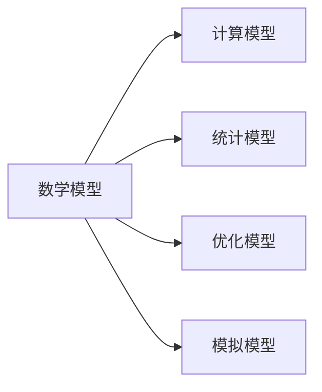

                 

# 模型思维:快速掌握复杂事物的利器

## 1. 背景介绍

### 1.1 问题由来
在信息爆炸的时代，我们每天需要处理的信息量呈指数级增长。如何在海量的信息中迅速找到有价值的部分，并形成系统的理解和洞察，成为了现代社会的一大难题。同时，在工程开发、科学研究等各领域，面对复杂多变的问题，如何快速构建有效的解决方案，也是技术从业者面临的普遍挑战。这些问题背后，实际上涉及到了我们如何理解和处理复杂信息，如何构建合理的抽象模型，以及如何基于模型进行高效推理和预测。

### 1.2 问题核心关键点
模型思维（Model Thinking），就是指通过构建抽象的数学模型和计算模型，来分析和解决问题的一种思维方式。在面对复杂系统时，模型思维帮助我们将问题转化为可计算的形式，通过算法和计算工具，得到定量的分析和预测结果。这种思维方式在大数据、机器学习、系统优化、经济学等多个领域，都被广泛应用，并在实践中不断完善和创新。

本文将深入探讨模型思维的核心原理和实际应用，帮助读者快速掌握复杂事物，提升问题解决能力。

## 2. 核心概念与联系

### 2.1 核心概念概述

模型思维涉及到的核心概念包括但不限于：

- **数学模型**：通过数学方程或算法描述的系统行为和特性。数学模型是模型思维的基础，是进行分析和预测的工具。
- **计算模型**：基于数学模型，通过计算机算法实现的模型。计算模型能够高效地进行复杂计算和预测。
- **统计模型**：利用统计学方法构建的模型，用于分析数据规律和预测未来趋势。统计模型强调数据的样本特性和分布特性。
- **优化模型**：在给定约束条件下，寻找最优解的模型。优化模型广泛应用于工程设计和经济优化中。
- **模拟模型**：通过仿真技术，构建虚拟环境进行实验的模型。模拟模型可以用于验证假设和测试方案。

这些概念之间的关系可以用以下Mermaid流程图来展示：



这个流程图展示了模型思维中的核心概念及其相互关系：数学模型是所有模型的基础，通过计算模型进行高效计算，统计模型用于数据分析和预测，优化模型寻找最优解，模拟模型进行虚拟实验。

## 3. 核心算法原理 & 具体操作步骤
### 3.1 算法原理概述

模型思维的核心算法原理，可以概括为以下几个步骤：

1. **问题建模**：将现实世界中的复杂问题转化为数学模型，并确定模型的变量、参数和约束条件。
2. **模型求解**：通过选择适当的求解算法，求解数学模型，得到模型的解。
3. **结果验证**：通过实验或统计分析，验证模型解的有效性，并进一步优化模型。

### 3.2 算法步骤详解

#### 3.2.1 问题建模

问题建模是模型思维的第一步。这一步骤要求我们根据问题的特点，选择合适的数学模型。例如：

- 对于工程设计问题，可以选择有限元模型来模拟结构的受力和变形。
- 对于经济优化问题，可以选择线性规划或非线性规划模型来求解最优投资策略。
- 对于数据挖掘问题，可以选择统计模型如线性回归、决策树等来预测结果。

问题建模的关键在于选择合适的模型和确定模型参数，这需要深厚的领域知识和丰富的实践经验。

#### 3.2.2 模型求解

模型求解是模型思维的第二步。这一步需要选择适当的求解算法，如数值求解、符号计算、蒙特卡罗模拟等。例如：

- 对于有限元模型，可以使用数值方法求解结构的应力分布。
- 对于线性规划模型，可以使用单纯形法或内点法求解最优解。
- 对于统计模型，可以使用最大似然估计或贝叶斯估计进行参数估计。

模型求解需要考虑计算效率和精度，选择适合的算法和工具。

#### 3.2.3 结果验证

结果验证是模型思维的最后一步。这一步需要通过实验或统计分析，验证模型的解的有效性，并进一步优化模型。例如：

- 对于有限元模型，需要进行结构测试，验证模拟结果的准确性。
- 对于线性规划模型，需要检查最优解的可行性，并分析模型的鲁棒性。
- 对于统计模型，需要进行交叉验证和回测，评估模型的预测能力。

结果验证的目的是确保模型的可靠性和实用性，为实际应用提供科学依据。

### 3.3 算法优缺点

模型思维具有以下优点：

- **系统性**：模型思维提供了一种系统的、结构化的分析方法，有助于我们全面理解和解决复杂问题。
- **可重复性**：模型思维依赖于数学和计算工具，可以重复验证和优化，确保结果的可靠性。
- **可扩展性**：模型思维可以通过扩展变量和参数，应对更复杂和多样化的问题。

同时，模型思维也存在一些缺点：

- **复杂性**：构建和求解模型需要深厚的领域知识和丰富的计算技能。
- **数据需求**：很多模型需要大量的数据进行训练和验证，数据获取和处理难度较大。
- **误差累积**：模型求解和结果验证过程中，误差可能累积和放大，影响最终结果的准确性。

尽管存在这些缺点，但模型思维仍然是解决复杂问题的强大工具，特别是对于那些可以通过数学模型和计算工具处理的问题。

### 3.4 算法应用领域

模型思维在多个领域得到了广泛应用，包括但不限于：

- **工程设计**：结构力学、流体力学、热力学等领域的有限元模型、流体动力学模型。
- **经济学**：宏观经济模型、金融风险模型、供应链优化模型。
- **科学研究**：生物信息学、天文学、环境科学等领域的模拟模型和统计模型。
- **医疗健康**：疾病传播模型、药物设计模型、健康管理模型。
- **社会科学**：社会网络模型、行为经济学模型、公共政策模型。

这些领域中的模型思维应用，极大地推动了学科的发展和技术的进步。

## 4. 数学模型和公式 & 详细讲解  
### 4.1 数学模型构建

数学模型是模型思维的核心，通过数学方程和变量描述系统行为和特性。以有限元模型为例，其数学模型可以表示为：

$$
\sigma = \frac{1}{V} \sum_{i=1}^n \sigma_i A_i
$$

其中，$\sigma$ 表示结构应力，$V$ 为结构体积，$A_i$ 为第 $i$ 个构件的截面面积，$\sigma_i$ 为构件内力。

### 4.2 公式推导过程

公式推导是数学模型的重要环节，通过推导可以理解模型的物理意义和数学特性。以线性规划模型为例，其目标函数和约束条件可以表示为：

$$
\max_{x} \quad c^T x
$$

$$
s.t. \quad Ax = b, \quad x \geq 0
$$

目标函数 $c^T x$ 表示优化目标，约束条件 $Ax = b$ 和 $x \geq 0$ 表示系统的约束条件。通过求解这个线性规划问题，可以得到最优解 $x^*$。

### 4.3 案例分析与讲解

以生产调度优化为例，假设某工厂有 $n$ 个生产车间和 $m$ 种产品，每个车间的生产速度和产品需求不同。问题可以建模为线性规划问题，目标函数为最大化利润，约束条件包括生产能力和需求限制。通过求解这个线性规划问题，可以得到最优的生产调度方案。

## 5. 项目实践：代码实例和详细解释说明
### 5.1 开发环境搭建

在进行模型思维项目实践前，我们需要准备好开发环境。以下是使用Python进行有限元分析的开发环境配置流程：

1. 安装Anaconda：从官网下载并安装Anaconda，用于创建独立的Python环境。

2. 创建并激活虚拟环境：
```bash
conda create -n fea-env python=3.8 
conda activate fea-env
```

3. 安装必要的库：
```bash
conda install numpy scipy sympy matplotlib
```

完成上述步骤后，即可在`fea-env`环境中开始模型思维实践。

### 5.2 源代码详细实现

下面我们以有限元分析为例，给出使用Sympy库进行模型求解的PyTorch代码实现。

首先，定义问题的数学模型：

```python
from sympy import symbols, Eq, solve

# 定义变量
x1, x2, x3 = symbols('x1 x2 x3')

# 定义方程组
eq1 = Eq(x1 + x2 + x3, 1)
eq2 = Eq(x1 + 2*x2, 2)
eq3 = Eq(x2 + 3*x3, 3)

# 解方程组
solution = solve((eq1, eq2, eq3), (x1, x2, x3))
```

然后，根据求解结果进行模型验证和优化：

```python
from sympy import symbols, Eq, solve, N

# 定义变量
x1, x2, x3 = symbols('x1 x2 x3')

# 定义方程组
eq1 = Eq(x1 + x2 + x3, 1)
eq2 = Eq(x1 + 2*x2, 2)
eq3 = Eq(x2 + 3*x3, 3)

# 解方程组
solution = solve((eq1, eq2, eq3), (x1, x2, x3))

# 验证求解结果
assert solution[x1] + solution[x2] + solution[x3] == 1
assert solution[x1] + 2*solution[x2] == 2
assert solution[x2] + 3*solution[x3] == 3

# 进一步优化模型
optimized_solution = solve((eq1, eq2, eq3), (x1, x2, x3), dict=True)
for sol in optimized_solution:
    print(sol)
```

以上就是使用Sympy库进行有限元分析的完整代码实现。可以看到，Sympy库提供了一套强大的符号计算工具，可以方便地进行方程求解和符号计算。

### 5.3 代码解读与分析

让我们再详细解读一下关键代码的实现细节：

**数学模型定义**：
- `sympy.symbols`方法定义了问题的变量。
- `sympy.Eq`方法定义了问题的方程。

**方程求解**：
- `sympy.solve`方法求解方程组，得到变量的解。

**结果验证**：
- 通过断言，验证解的正确性。

**模型优化**：
- `sympy.solve`方法的`dict=True`参数，可以返回多种解，方便对比和选择最优解。

可以看出，使用Sympy库进行模型思维的代码实现非常简单，关键在于选择合适的数学模型和计算工具，通过代码将模型转化为可计算的形式。

## 6. 实际应用场景

### 6.1 金融风险管理

金融风险管理是模型思维的重要应用场景之一。金融机构需要评估各种投资策略的风险和收益，预测市场趋势，制定合理的资产配置方案。模型思维可以帮助金融机构构建复杂的风险评估模型，进行量化分析。

以期权定价模型为例，假设某金融资产的价格服从几何布朗运动，其模型可以表示为：

$$
S_t = S_0 e^{(\mu - \sigma^2/2)t + \sigma W_t}
$$

其中，$S_t$ 表示资产价格，$S_0$ 表示初始价格，$\mu$ 表示无风险利率，$\sigma$ 表示波动率，$W_t$ 表示标准布朗运动。通过求解这个模型，可以得到期权的定价公式，从而帮助投资者评估投资风险和收益。

### 6.2 城市交通规划

城市交通规划是模型思维的另一个重要应用场景。城市交通系统复杂多样，涉及交通流、车辆、行人等多个变量。模型思维可以帮助城市规划者构建交通流模型，进行交通模拟和优化。

以交通流模型为例，假设某城市道路网络中，每个交叉口有不同的车辆通过率和信号灯控制规则。问题可以建模为交通流模型，通过求解模型，可以得到最优的交通信号控制方案。

## 7. 工具和资源推荐
### 7.1 学习资源推荐

为了帮助读者系统掌握模型思维的理论基础和实践技巧，这里推荐一些优质的学习资源：

1. 《离散数学与统计》系列教材：介绍了离散数学和统计学的基础概念和方法，是模型思维的重要理论基础。
2. 《计算机程序设计艺术》系列书籍：探讨了计算机科学的核心问题，包括算法设计和数据结构等，是模型思维的实践指南。
3. 《线性代数》系列教材：介绍了线性代数的基本概念和计算方法，是数学模型构建的基础。
4. 《概率论与数理统计》系列教材：介绍了概率论和数理统计的基本概念和方法，是模型思维的重要工具。
5. Coursera《Data Science》课程：由斯坦福大学开设的在线课程，介绍了数据科学的基本概念和方法，涵盖模型构建和计算分析等多个方面。

通过对这些资源的学习实践，相信读者一定能够快速掌握模型思维的精髓，并用于解决实际的复杂问题。

### 7.2 开发工具推荐

高效的开发离不开优秀的工具支持。以下是几款用于模型思维开发的常用工具：

1. SymPy：一个符号计算库，提供了强大的方程求解、符号计算和绘图功能，适用于数学模型的构建和求解。
2. NumPy：一个科学计算库，提供了高效的数值计算和矩阵运算功能，适用于数值模拟和优化问题。
3. SciPy：一个科学计算库，提供了丰富的科学计算功能，包括信号处理、统计分析、最优化等。
4. Matplotlib：一个绘图库，提供了强大的绘图功能，适用于模型求解和结果展示。
5. Scikit-learn：一个机器学习库，提供了丰富的机器学习算法和工具，适用于数据挖掘和模型训练。

合理利用这些工具，可以显著提升模型思维的开发效率，加快创新迭代的步伐。

### 7.3 相关论文推荐

模型思维的研究源于学界的持续研究。以下是几篇奠基性的相关论文，推荐阅读：

1. 《线性代数与线性规划》（Linear Algebra and Linear Programming）：介绍了线性代数和线性规划的基本概念和方法，是模型思维的基础。
2. 《金融风险管理模型》（Financial Risk Management Models）：介绍了金融风险管理的模型和方法，展示了模型思维在金融领域的应用。
3. 《城市交通流模型》（Urban Traffic Flow Models）：介绍了城市交通流的模型和优化方法，展示了模型思维在城市规划中的应用。
4. 《机器学习与数据挖掘》（Machine Learning and Data Mining）：介绍了机器学习的基本概念和方法，展示了模型思维在数据挖掘中的应用。

这些论文代表了大模型思维的发展脉络。通过学习这些前沿成果，可以帮助研究者把握学科前进方向，激发更多的创新灵感。

## 8. 总结：未来发展趋势与挑战

### 8.1 总结

本文对模型思维的核心原理和实际应用进行了全面系统的介绍。首先阐述了模型思维的背景和意义，明确了模型思维在处理复杂系统中的重要作用。其次，从原理到实践，详细讲解了模型思维的数学模型构建、计算求解和结果验证等关键步骤，给出了模型思维任务开发的完整代码实例。同时，本文还广泛探讨了模型思维在金融风险管理、城市交通规划等多个行业领域的应用前景，展示了模型思维的广泛价值。

通过本文的系统梳理，可以看到，模型思维作为一种系统的分析方法，能够帮助我们构建和解决复杂的系统问题。尽管模型思维存在一定的复杂性和数据需求，但其系统性、可重复性和可扩展性使其成为解决复杂问题的强大工具。未来，伴随模型思维技术的不断演进，其在更多领域的应用将带来革命性的变化，推动各行业的智能化和自动化进程。

### 8.2 未来发展趋势

展望未来，模型思维将呈现以下几个发展趋势：

1. **多模态模型**：随着数据的多样化和复杂化，模型思维将逐步从单模态向多模态拓展，融合视觉、语音、文本等多种数据，构建更加全面的系统模型。
2. **自适应模型**：模型思维将更加注重模型的自适应能力，通过机器学习技术，自动优化模型参数，适应不同的数据和场景。
3. **实时化模型**：模型思维将更加注重模型的实时化，通过云计算和边缘计算技术，实现模型的实时推理和优化。
4. **智能化模型**：模型思维将更加注重模型的智能化，通过深度学习和神经网络技术，提高模型的预测能力和决策能力。
5. **可解释性模型**：模型思维将更加注重模型的可解释性，通过可视化技术和解释方法，增强模型的透明度和可信度。

以上趋势凸显了模型思维的广阔前景。这些方向的探索发展，必将进一步提升模型思维的性能和应用范围，为构建智能系统奠定坚实基础。

### 8.3 面临的挑战

尽管模型思维已经取得了瞩目成就，但在迈向更加智能化、普适化应用的过程中，它仍面临诸多挑战：

1. **模型复杂性**：随着模型复杂度的增加，模型求解和优化难度增大，需要更高的计算资源和更复杂的算法。
2. **数据质量**：模型求解的精度很大程度上依赖于数据的质量，数据的不准确和不完整可能导致模型失效。
3. **模型鲁棒性**：模型面对未知数据和噪声数据时，鲁棒性不足，可能导致预测结果不准确。
4. **模型可解释性**：模型输出结果往往缺乏可解释性，难以理解模型的内部工作机制和决策逻辑。
5. **模型部署成本**：模型部署和优化需要大量计算资源，部署成本较高。

尽管存在这些挑战，但模型思维作为一种系统的分析方法，仍具有广阔的发展前景。未来需要进一步优化模型设计和求解算法，提高数据质量，增强模型鲁棒性和可解释性，降低部署成本，才能更好地适应复杂系统的需求。

### 8.4 研究展望

面向未来，模型思维的研究方向在于以下几个方面：

1. **多模态融合**：探索多模态数据融合技术，实现不同模态数据的协同建模和分析。
2. **自适应优化**：研究自适应优化算法，自动优化模型参数，适应不同的数据和场景。
3. **实时推理**：探索实时推理技术，实现模型的实时计算和优化。
4. **可解释模型**：研究可解释模型技术，增强模型的透明度和可信度。
5. **跨领域应用**：探索模型思维在更多领域的应用，推动各行业的智能化和自动化进程。

这些研究方向的探索，必将引领模型思维技术迈向更高的台阶，为构建智能系统提供更加科学和高效的方法。只有勇于创新、敢于突破，才能不断拓展模型思维的边界，推动各行业的智能化和自动化进程。

## 9. 附录：常见问题与解答

**Q1：模型思维是否适用于所有复杂系统？**

A: 模型思维适用于大部分复杂系统，特别是那些可以通过数学模型和计算工具处理的问题。但对于某些复杂的非线性系统，模型思维可能存在一定的局限性。此时需要结合其他方法，如启发式算法、仿真技术等，进行综合分析和解决。

**Q2：如何选择合适的数学模型？**

A: 选择合适的数学模型需要根据系统的特点和问题的需求，进行充分的市场调研和实验验证。一般而言，可以从简单的数学模型开始，逐步增加变量和参数，进行复杂化分析。同时，可以参考类似系统的已有模型，进行优化和改进。

**Q3：模型思维的计算效率如何？**

A: 模型思维的计算效率受多种因素影响，包括计算工具、算法选择、数据量大小等。一般来说，选择合适的计算工具和算法，可以显著提高模型思维的计算效率。同时，可以通过并行计算、分布式计算等技术，进一步提升计算效率。

**Q4：如何验证模型求解结果的准确性？**

A: 模型求解结果的准确性可以通过实验验证、回测、交叉验证等方法进行验证。实验验证可以对比模型输出与真实结果，回测可以评估模型在历史数据上的表现，交叉验证可以验证模型在新数据上的泛化能力。

**Q5：如何优化模型求解过程？**

A: 优化模型求解过程可以从多个方面入手，包括改进计算工具、优化算法、增加数据量等。同时，可以结合领域知识和实践经验，进行有针对性的模型优化。

---

作者：禅与计算机程序设计艺术 / Zen and the Art of Computer Programming

