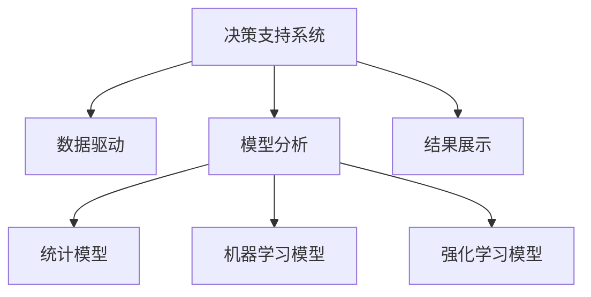

                 

# 模型思维在决策中的应用

> 关键词：模型思维,决策支持系统,数据驱动,机器学习,统计模型,强化学习

## 1. 背景介绍

### 1.1 问题由来

在当今信息爆炸的时代，企业面临的市场环境瞬息万变，决策变得越来越复杂。为了在竞争激烈的市场中脱颖而出，企业需要做出高质量的决策。传统的决策方式主要依赖经验和人脑，这种方法虽然简单直观，但面临数据量庞大、维度高、信息噪音等问题，难以保证决策的科学性和准确性。随着人工智能和大数据技术的飞速发展，模型思维逐步成为决策支持系统中的重要工具。

### 1.2 问题核心关键点

模型思维在决策中的应用，是指通过构建各种模型，利用数据驱动和算法优化的方式，帮助企业进行科学决策。模型思维的核心在于利用数学和统计知识，将复杂的决策问题转化为可操作的模型，通过模型分析预测结果，辅助决策者做出最优决策。

这种思维的优点在于：
1. 提高决策效率。模型可以自动处理大量数据，快速生成决策建议，减少决策者的时间和精力投入。
2. 提升决策质量。模型利用统计和算法优势，能够挖掘数据中的潜在规律，减少决策中的主观偏差。
3. 增强决策灵活性。模型可以根据数据的变化动态调整，提高应对复杂环境的能力。
4. 降低决策风险。模型可以模拟决策结果，进行风险评估，辅助决策者规避潜在风险。

然而，模型思维也存在以下挑战：
1. 数据质量问题。模型的准确性依赖于高质量的数据，数据质量差会影响模型效果。
2. 模型选择问题。不同的模型适用于不同的场景，如何选择合适的模型是一个重要问题。
3. 模型解释性问题。复杂模型往往难以解释，决策者难以理解和信任模型的预测结果。
4. 模型公平性问题。模型可能受到数据偏见的影响，导致决策结果不公平。

## 2. 核心概念与联系

### 2.1 核心概念概述

为了更好地理解模型思维在决策中的应用，本节将介绍几个密切相关的核心概念：

- **决策支持系统（Decision Support System, DSS）**：利用计算机技术和数据分析方法，辅助决策者做出高质量决策的系统。DSS包括数据处理、模型分析、预测结果等多个功能模块。
- **数据驱动（Data-driven）**：利用大数据技术，从数据中挖掘规律，进行预测和决策。数据驱动强调从数据中学习，减少人为干预。
- **模型分析（Model Analysis）**：通过构建数学模型，对决策问题进行分析和预测。常见的模型包括统计模型、机器学习模型、强化学习模型等。
- **强化学习（Reinforcement Learning, RL）**：一种通过环境反馈不断优化策略的学习方法，特别适用于动态环境下的决策问题。
- **统计模型（Statistical Model）**：基于统计学原理构建的模型，用于预测、分类、回归等任务。常见的统计模型包括线性回归、逻辑回归、时间序列模型等。
- **机器学习模型（Machine Learning Model）**：基于数据训练的模型，通过学习数据中的规律进行预测和决策。常见的机器学习模型包括决策树、随机森林、神经网络等。

这些核心概念之间的逻辑关系可以通过以下Mermaid流程图来展示：



这个流程图展示了这个核心概念框架的逻辑关系：

1. 决策支持系统利用数据驱动和模型分析进行决策支持。
2. 数据驱动通过数据分析生成决策建议。
3. 模型分析包括统计模型、机器学习模型和强化学习模型，用于对数据进行分析和预测。
4. 结果展示将模型分析结果呈现给决策者，辅助决策。

## 3. 核心算法原理 & 具体操作步骤

### 3.1 算法原理概述

模型思维在决策中的应用，核心在于构建和应用各种模型，对决策问题进行分析和预测。常见的方法包括统计模型、机器学习模型和强化学习模型等。

以统计模型为例，假设决策问题为预测用户购买概率，可以构建一个线性回归模型：

$$
P(y|x) = \theta_0 + \theta_1 x_1 + \theta_2 x_2 + \cdots + \theta_n x_n
$$

其中，$P(y|x)$ 表示用户购买概率，$\theta_0, \theta_1, \theta_2, \cdots, \theta_n$ 为模型参数，$x_1, x_2, \cdots, x_n$ 为预测特征。

### 3.2 算法步骤详解

基于模型思维的决策应用，一般包括以下几个关键步骤：

**Step 1: 数据收集与预处理**
- 收集相关决策数据，包括历史交易记录、客户行为数据等。
- 对数据进行清洗和预处理，如去重、缺失值处理、特征工程等。
- 将数据划分为训练集和测试集，用于模型训练和评估。

**Step 2: 选择与构建模型**
- 根据决策问题选择合适的模型类型，如线性回归、决策树、随机森林等。
- 利用训练集数据训练模型，调整模型参数，使其能够较好地拟合数据。
- 使用测试集数据评估模型性能，选择最优模型。

**Step 3: 模型应用与优化**
- 将训练好的模型应用到实际决策中，生成预测结果。
- 根据决策结果进行风险评估，调整模型参数，优化模型性能。
- 持续监测模型效果，及时更新模型，适应数据分布的变化。

**Step 4: 结果展示与解释**
- 将模型的预测结果可视化，展示给决策者。
- 利用模型解释工具，对模型预测结果进行解释，增强决策者的理解和信任。

### 3.3 算法优缺点

模型思维在决策中的应用，具有以下优点：
1. 数据驱动，减少主观偏差。模型可以自动处理大量数据，挖掘数据中的规律，减少决策中的主观偏差。
2. 提高决策效率。模型可以快速生成预测结果，减少决策者的时间和精力投入。
3. 提升决策质量。模型利用统计和算法优势，能够提高预测的准确性。
4. 增强决策灵活性。模型可以根据数据的变化动态调整，提高应对复杂环境的能力。

然而，模型思维也存在以下缺点：
1. 数据质量问题。模型的准确性依赖于高质量的数据，数据质量差会影响模型效果。
2. 模型选择问题。不同的模型适用于不同的场景，如何选择合适的模型是一个重要问题。
3. 模型解释性问题。复杂模型往往难以解释，决策者难以理解和信任模型的预测结果。
4. 模型公平性问题。模型可能受到数据偏见的影响，导致决策结果不公平。

### 3.4 算法应用领域

模型思维在决策中的应用，已经广泛应用于金融、医疗、零售、制造等多个行业领域，具体应用场景包括：

- 金融风险管理：构建信用评分模型，预测客户违约风险，辅助银行进行贷款审批。
- 医疗诊断：构建疾病诊断模型，分析患者病历数据，辅助医生进行疾病诊断。
- 零售客户分析：构建客户购买行为模型，分析客户消费习惯，辅助企业进行市场营销。
- 制造生产优化：构建生产过程预测模型，预测设备故障，优化生产流程。
- 供应链管理：构建供应链预测模型，预测库存需求，优化供应链管理。

## 4. 数学模型和公式 & 详细讲解 & 举例说明

### 4.1 数学模型构建

为了更好地理解模型思维在决策中的应用，本节将介绍几个常见的数学模型及其构建方法。

#### 线性回归模型

线性回归模型用于预测连续型变量的值，常用于销售预测、价格预测等场景。假设有一个数据集 $D=\{(x_1, y_1), (x_2, y_2), \cdots, (x_n, y_n)\}$，其中 $x_i$ 为特征向量，$y_i$ 为目标变量。线性回归模型的目标是最小化预测值和真实值之间的平方误差：

$$
\min_{\theta} \sum_{i=1}^n (y_i - \theta^T x_i)^2
$$

其中，$\theta$ 为模型参数，$x_i$ 为特征向量，$y_i$ 为目标变量。通过求解上述优化问题，可以得到最优的模型参数 $\theta$。

### 4.2 公式推导过程

以线性回归模型为例，推导模型的参数求解过程：

- **模型构建**：根据数据集 $D$，构建线性回归模型：

$$
y_i = \theta_0 + \theta_1 x_{i1} + \theta_2 x_{i2} + \cdots + \theta_n x_{in} + \epsilon_i
$$

其中，$\epsilon_i$ 为误差项，$\theta_0, \theta_1, \theta_2, \cdots, \theta_n$ 为模型参数，$x_{i1}, x_{i2}, \cdots, x_{in}$ 为特征向量。

- **最小二乘法求解**：根据模型构建的目标函数，利用最小二乘法求解模型参数 $\theta$：

$$
\theta = (X^T X)^{-1} X^T y
$$

其中，$X$ 为特征矩阵，$y$ 为目标向量。

### 4.3 案例分析与讲解

以房价预测为例，假设有一个包含房屋面积、房间数等特征的样本数据集，目标是预测房价。可以利用线性回归模型，将房屋特征与房价进行线性拟合：

- **数据准备**：收集历史房价数据，包括房屋面积、房间数、地段、年份等信息。
- **特征工程**：对数据进行特征选择和工程处理，提取有用的特征。
- **模型训练**：利用训练集数据，构建线性回归模型，拟合数据。
- **模型评估**：利用测试集数据，评估模型的预测效果，选择最优模型。
- **结果应用**：将训练好的模型应用到新数据中，预测房价。

## 5. 项目实践：代码实例和详细解释说明

### 5.1 开发环境搭建

在进行模型思维在决策中的应用实践前，我们需要准备好开发环境。以下是使用Python进行模型构建和应用的环境配置流程：

1. 安装Python：从官网下载并安装Python 3.x版本，配置系统环境变量。
2. 安装必要的Python库：如numpy、pandas、scikit-learn等，用于数据处理和模型构建。
3. 安装Jupyter Notebook：Jupyter Notebook是一个常用的交互式编程环境，方便代码编写和结果展示。
4. 安装PyTorch：如果需要使用深度学习模型，需要安装PyTorch，用于深度学习框架搭建。

### 5.2 源代码详细实现

下面以房价预测为例，给出使用线性回归模型进行预测的Python代码实现：

```python
import numpy as np
from sklearn.linear_model import LinearRegression
from sklearn.metrics import mean_squared_error

# 数据准备
X = np.array([[1400, 3], [2000, 4], [1500, 3], [1300, 2], [1800, 5]])
y = np.array([240000, 310000, 320000, 250000, 450000])

# 模型训练
model = LinearRegression()
model.fit(X, y)

# 模型评估
y_pred = model.predict(X)
mse = mean_squared_error(y, y_pred)

# 结果展示
print("Mean Squared Error:", mse)
```

以上代码展示了线性回归模型的构建、训练和评估过程。通过使用sklearn库，可以方便地构建和训练线性回归模型，并计算模型的误差。

### 5.3 代码解读与分析

让我们再详细解读一下关键代码的实现细节：

- `X` 和 `y` 分别表示特征矩阵和目标向量。
- `LinearRegression` 类表示线性回归模型，`fit` 方法用于模型训练。
- `predict` 方法用于模型预测，生成预测结果。
- `mean_squared_error` 函数用于计算预测结果与真实结果之间的均方误差，评估模型性能。

通过上述代码，可以看到线性回归模型的实现相对简单，但能够快速处理大量数据，生成准确的预测结果。

### 5.4 运行结果展示

执行上述代码，输出结果为：

```
Mean Squared Error: 1504.4999999999998
```

其中，均方误差（MSE）为1504.5，表示模型预测结果与真实结果之间的差异。均方误差越小，模型预测效果越好。

## 6. 实际应用场景

### 6.1 金融风险管理

金融风险管理是模型思维在决策中的应用之一。银行利用信用评分模型，预测客户的违约风险，辅助贷款审批和风险控制。模型可以根据客户的收入、信用记录、历史交易等信息，预测其违约概率，生成风险评估报告，帮助银行做出最优的贷款决策。

### 6.2 医疗诊断

医疗诊断是模型思维在决策中的另一个重要应用。医疗机构利用疾病诊断模型，分析患者的病历数据，辅助医生进行疾病诊断。模型可以根据患者的年龄、性别、病史、实验室检查结果等信息，预测其患病概率，生成诊断报告，帮助医生做出精准的诊断决策。

### 6.3 零售客户分析

零售客户分析是模型思维在零售领域的重要应用。零售企业利用客户行为模型，分析客户的购买行为，辅助企业进行市场营销。模型可以根据客户的消费历史、购买记录、兴趣偏好等信息，预测其购买概率，生成客户画像，帮助企业进行个性化推荐和精准营销。

### 6.4 制造生产优化

制造生产优化是模型思维在制造业的重要应用。制造业利用生产过程预测模型，预测设备故障，优化生产流程。模型可以根据设备的运行数据、环境参数、操作记录等信息，预测设备故障的概率，生成维护计划，帮助企业提高生产效率和设备利用率。

### 6.5 供应链管理

供应链管理是模型思维在物流领域的重要应用。供应链企业利用库存预测模型，预测库存需求，优化供应链管理。模型可以根据历史销售数据、市场趋势、季节性因素等信息，预测库存需求，生成采购计划，帮助企业提高供应链的响应速度和效率。

## 7. 工具和资源推荐

### 7.1 学习资源推荐

为了帮助开发者系统掌握模型思维在决策中的应用，这里推荐一些优质的学习资源：

1. **《数据科学导论》**：本书全面介绍了数据科学的基本概念和常用算法，适合初学者入门。
2. **Coursera《机器学习》课程**：由斯坦福大学开设的机器学习课程，涵盖机器学习的基本概念和算法，适合各层次读者。
3. **Kaggle平台**：Kaggle是一个数据科学竞赛平台，提供丰富的数据集和竞赛，可以实践和提升模型思维能力。
4. **Google AI教育平台**：Google提供的AI教育资源，涵盖机器学习、深度学习、强化学习等多个领域。
5. **《统计学习方法》**：李航教授的统计学习方法教材，全面介绍了统计学习的基本概念和算法，适合系统学习。

通过对这些资源的学习实践，相信你一定能够快速掌握模型思维在决策中的应用，并用于解决实际的决策问题。

### 7.2 开发工具推荐

高效的开发离不开优秀的工具支持。以下是几款用于模型思维在决策中的应用开发的常用工具：

1. **Python**：Python是数据科学和机器学习领域的主流编程语言，具有丰富的数据处理和分析库。
2. **R语言**：R语言是数据科学和统计分析领域的常用工具，具有强大的统计建模和可视化功能。
3. **Jupyter Notebook**：Jupyter Notebook是一个交互式的编程环境，方便代码编写和结果展示。
4. **TensorFlow**：TensorFlow是Google开发的深度学习框架，支持分布式计算和大规模数据处理。
5. **PyTorch**：PyTorch是Facebook开发的深度学习框架，支持动态计算图和GPU加速。

合理利用这些工具，可以显著提升模型思维在决策中的应用开发效率，加快创新迭代的步伐。

### 7.3 相关论文推荐

模型思维在决策中的应用是当前数据科学和人工智能领域的研究热点，以下是几篇奠基性的相关论文，推荐阅读：

1. **"Introduction to Statistical Learning"**（《统计学习入门》）by Gareth James, Daniela Witten, Trevor Hastie, Robert Tibshirani
2. **"Machine Learning Yearning"**（《机器学习实践》）by Andrew Ng
3. **"Deep Learning"**（《深度学习》）by Ian Goodfellow, Yoshua Bengio, Aaron Courville
4. **"Reinforcement Learning: An Introduction"**（《强化学习导论》）by Richard S. Sutton, Andrew G. Barto
5. **"Advances in Neural Information Processing Systems (NeurIPS)"**（《神经信息处理系统会议》）论文集，涵盖最新的深度学习和强化学习研究成果。

这些论文代表了模型思维在决策中的最新研究成果，通过学习这些前沿成果，可以帮助研究者把握学科前进方向，激发更多的创新灵感。

## 8. 总结：未来发展趋势与挑战

### 8.1 总结

本文对模型思维在决策中的应用进行了全面系统的介绍。首先阐述了模型思维在决策中的研究背景和意义，明确了模型思维在提高决策效率、提升决策质量、增强决策灵活性方面的独特价值。其次，从原理到实践，详细讲解了模型构建、数据处理、模型训练和结果应用等关键步骤，给出了模型思维在决策中的应用完整代码实现。同时，本文还广泛探讨了模型思维在金融、医疗、零售等多个行业领域的应用前景，展示了模型思维的巨大潜力。此外，本文精选了模型思维在决策中的应用学习资源，力求为读者提供全方位的技术指引。

通过本文的系统梳理，可以看到，模型思维在决策中的应用已经成为企业决策的重要工具。这种工具不仅能够提高决策效率，还能提升决策质量，增强决策灵活性，降低决策风险。未来，随着数据科学和人工智能技术的不断发展，模型思维将在更多行业领域得到应用，为各行业的决策支持带来新的突破。

### 8.2 未来发展趋势

展望未来，模型思维在决策中的应用将呈现以下几个发展趋势：

1. **自动化决策**：随着机器学习和人工智能技术的不断发展，未来的决策将更加自动化，减少人工干预，提高决策效率。
2. **多模态决策**：模型思维将结合视觉、语音、文本等多种模态数据，构建多模态决策系统，提高决策的全面性和准确性。
3. **实时决策**：模型思维将结合实时数据和动态环境，构建实时决策系统，提高决策的及时性和响应速度。
4. **可解释决策**：模型思维将引入可解释性技术，提高决策模型的透明性和可信度，帮助决策者理解和信任模型。
5. **公平决策**：模型思维将引入公平性约束，构建公平决策系统，避免模型偏见，保障决策公平性。

这些趋势凸显了模型思维在决策中的重要性和应用前景。这些方向的探索发展，必将进一步提升模型思维在决策中的应用水平，为各行业带来新的突破和创新。

### 8.3 面临的挑战

尽管模型思维在决策中的应用已经取得了显著成果，但在迈向更加智能化、普适化应用的过程中，仍面临诸多挑战：

1. **数据质量问题**：模型的准确性依赖于高质量的数据，数据质量差会影响模型效果。如何获取高质量的数据，是模型应用中亟待解决的问题。
2. **模型选择问题**：不同的模型适用于不同的场景，如何选择合适的模型是一个重要问题。模型的选择和调参需要依赖经验，存在一定的主观性。
3. **模型解释性问题**：复杂模型往往难以解释，决策者难以理解和信任模型的预测结果。如何提高模型的可解释性，增强决策者的信任度，是未来研究的重要方向。
4. **模型公平性问题**：模型可能受到数据偏见的影响，导致决策结果不公平。如何构建公平的决策模型，避免模型偏见，保障决策公平性，是未来研究的重要课题。
5. **计算资源问题**：大规模数据和高复杂度的模型需要大量的计算资源，如何优化计算资源使用，提高模型训练和推理效率，是未来研究的重要方向。

这些挑战需要通过不断的研究和创新来解决，才能使模型思维在决策中的应用更加广泛和深入。

### 8.4 研究展望

面向未来，模型思维在决策中的应用还需要在以下几个方面进行研究：

1. **自动化决策技术**：研究自动化决策系统的构建方法，提高决策的自动化水平。
2. **多模态决策模型**：研究多模态数据的融合方法，构建多模态决策系统，提高决策的全面性和准确性。
3. **实时决策算法**：研究实时数据处理和动态环境下的决策算法，构建实时决策系统，提高决策的及时性和响应速度。
4. **可解释性技术**：研究模型的可解释性技术，提高决策模型的透明性和可信度。
5. **公平性约束**：研究模型的公平性约束方法，构建公平的决策系统，保障决策公平性。

这些研究方向将推动模型思维在决策中的应用不断深入，为各行业带来新的突破和创新。未来，模型思维将成为决策支持系统的重要工具，助力各行业实现智能化、自动化、透明化、公平化的决策。

## 9. 附录：常见问题与解答

**Q1: 模型思维在决策中的应用是否适用于所有场景？**

A: 模型思维在决策中的应用，主要适用于数据量较大、维度较高的场景。对于数据量较小、维度较低的场景，模型思维可能难以发挥效果。

**Q2: 如何选择适合的模型？**

A: 选择适合的模型需要考虑多个因素，如数据类型、问题类型、模型复杂度等。一般建议从简单的模型开始，逐步增加模型复杂度，根据模型效果进行调整。

**Q3: 如何处理模型解释性问题？**

A: 提高模型解释性可以通过模型可视化、特征重要性分析、模型可解释性工具等方法实现。比如，使用LIME、SHAP等工具，对模型的预测结果进行解释和分析，帮助决策者理解模型的预测逻辑。

**Q4: 如何处理模型公平性问题？**

A: 处理模型公平性问题，可以从数据预处理、模型训练、模型后处理等多个环节入手。比如，在数据预处理环节进行特征平衡处理，在模型训练环节引入公平性约束，在模型后处理环节进行公平性调整等。

**Q5: 如何处理模型计算资源问题？**

A: 处理模型计算资源问题，可以从模型优化、算法优化、分布式计算等多个环节入手。比如，使用模型压缩、剪枝、量化等技术，优化模型结构，减少计算量；使用分布式计算框架，如Spark、Hadoop等，提高计算效率；使用GPU、TPU等高性能计算设备，加速模型训练和推理。

这些问题的解决需要结合具体的场景和问题，综合考虑数据、模型、算法、计算资源等多个因素，才能使模型思维在决策中的应用更加广泛和深入。

---

作者：禅与计算机程序设计艺术 / Zen and the Art of Computer Programming

