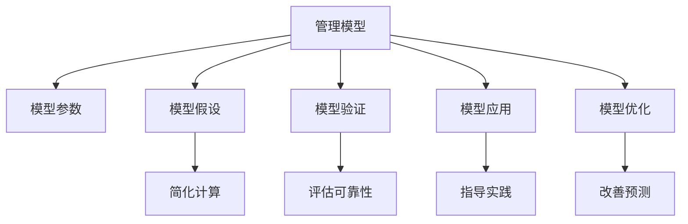

                 

# 模型思维在管理培训中的运用

> 关键词：管理模型,培训,思维模式,决策支持,领导力,绩效管理,团队管理

## 1. 背景介绍

### 1.1 问题由来
在现代企业管理中，如何构建高效的管理团队、提升决策能力、优化绩效管理，已经成为企业发展的重要课题。传统的管理培训往往依赖于经验分享和案例分析，难以系统化和量化管理。而通过模型思维的引入，将管理经验转化为可操作的模型，不仅能够提供科学化的决策支持，还能够提升管理培训的实效性，培养具有系统思维和数据驱动能力的管理者。

### 1.2 问题核心关键点
模型思维在管理培训中的核心关键点包括：
1. 如何将复杂的管理问题抽象为可计算的模型。
2. 如何设计合适的模型参数，使得模型能够准确反映管理现象。
3. 如何通过模型来辅助决策，提高管理培训的实效性。
4. 如何评价和优化模型，确保其适用性和可靠性。
5. 如何结合具体情境，灵活应用模型进行管理决策。

### 1.3 问题研究意义
引入模型思维进行管理培训，具有以下几个重要意义：
1. 提升管理决策的科学性和精确度。通过模型化决策，使管理者能够基于数据和事实进行决策，而非仅凭经验或直觉。
2. 增强管理培训的系统性和结构化。模型思维能够将复杂的知识体系分解为可操作的模块，便于系统学习。
3. 培养数据驱动的管理思维。模型化管理能够强化管理者的数据素养，提高对大数据的利用能力。
4. 实现管理培训的定量化和可视化。模型能够直观地展示管理过程和结果，增强培训的可视化和互动性。
5. 促进管理知识的创新和扩散。模型化管理能够促进管理知识的标准化和规范化，便于知识的传播和应用。

## 2. 核心概念与联系

### 2.1 核心概念概述

为更好地理解模型思维在管理培训中的应用，本节将介绍几个密切相关的核心概念：

- 管理模型(Management Model)：指用于描述和管理特定管理现象的数学模型或仿真模型。管理模型通过抽象管理过程，量化管理要素，提供决策支持。
- 模型参数(Model Parameters)：指模型中的可调变量，如输入参数、控制参数等。管理模型的效果很大程度上取决于模型参数的选择和设计。
- 模型假设(Model Assumptions)：指模型为简化计算而做出的抽象假设，如线性关系、齐次性等。这些假设会影响模型的普适性和预测能力。
- 模型验证(Model Validation)：指通过实验或数据分析，验证模型是否符合真实管理现象的过程。模型验证能够评估模型的可靠性，优化模型参数。
- 模型应用(Model Application)：指将管理模型应用于具体管理决策中，指导管理实践的过程。模型应用是模型思维在管理培训中的关键环节。
- 模型优化(Model Optimization)：指通过调整模型参数，改善模型预测能力，提高管理决策效果的过程。模型优化是模型思维的持续改进机制。

这些核心概念之间的逻辑关系可以通过以下Mermaid流程图来展示：



这个流程图展示了大语言模型的核心概念及其之间的关系：

1. 管理模型通过抽象和量化管理现象，提供决策支持。
2. 模型参数是模型中需要调整的变量，决定模型的预测能力。
3. 模型假设是对管理现象的抽象简化，影响模型的普适性。
4. 模型验证通过实验或数据分析，验证模型是否符合实际。
5. 模型应用将模型应用于管理决策中，实现决策支持。
6. 模型优化通过调整模型参数，提高模型预测能力。

这些概念共同构成了模型思维在管理培训中的框架，使得管理者能够系统地理解和应用管理知识。

## 3. 核心算法原理 & 具体操作步骤
### 3.1 算法原理概述

模型思维在管理培训中的核心算法原理，主要是通过将管理现象抽象为数学模型，利用统计分析和数据科学方法，进行模型建立、参数优化、验证和应用。具体而言，管理模型的建立和优化过程，可以概括为以下几步：

1. **数据收集与预处理**：收集相关的管理数据，进行清洗、整理和标准化。
2. **模型构建与拟合**：选择合适的模型形式，通过训练数据进行模型参数的拟合和优化。
3. **模型验证与测试**：使用独立数据集验证模型的预测能力，确保模型的可靠性和鲁棒性。
4. **模型应用与反馈**：将模型应用于具体管理决策中，获取反馈，优化模型参数，迭代提高模型效果。

### 3.2 算法步骤详解

模型思维在管理培训中的应用，可以分为以下几个关键步骤：

**Step 1: 数据收集与预处理**
- 收集相关的管理数据，如员工绩效、团队合作情况、公司财务报表等。
- 清洗数据，去除缺失、异常或重复数据，确保数据质量。
- 标准化数据，如进行归一化、标准化处理，便于模型训练。

**Step 2: 模型构建与拟合**
- 根据管理现象的特点，选择合适的模型形式，如线性回归、决策树、随机森林等。
- 使用训练数据进行模型参数的拟合和优化，使用梯度下降、遗传算法等方法优化模型。
- 使用交叉验证等方法评估模型性能，选择最优模型。

**Step 3: 模型验证与测试**
- 使用独立数据集验证模型的预测能力，确保模型的可靠性和泛化能力。
- 进行灵敏度分析，评估模型对参数变化的敏感度。
- 进行鲁棒性测试，评估模型对异常值和噪声的鲁棒性。

**Step 4: 模型应用与反馈**
- 将模型应用于具体管理决策中，如预测员工绩效、优化资源配置等。
- 收集反馈数据，评估模型效果，识别问题并进行优化。
- 迭代优化模型，确保模型在实际应用中取得最优效果。

### 3.3 算法优缺点

模型思维在管理培训中的应用具有以下优点：
1. 系统化管理：将复杂的管理问题分解为可操作的模块，便于系统学习。
2. 数据驱动决策：基于数据和事实进行决策，提升决策的科学性和精确度。
3. 模型可视化：通过图形化展示模型预测结果，增强培训的可视化和互动性。
4. 可复制性强：模型可重复使用，便于管理和知识传播。
5. 持续优化：通过不断优化模型参数，提高管理决策效果。

同时，该方法也存在以下局限性：
1. 数据质量要求高：模型的效果很大程度上依赖于数据的质量和完整性。
2. 模型假设有限：模型往往基于一定的假设进行简化，可能无法完全反映复杂的管理现象。
3. 模型复杂度高：复杂的模型可能难以理解和应用，需要较高的数学和统计基础。
4. 模型泛化能力有限：模型的预测能力可能受限于训练数据集。
5. 实施成本高：模型构建和优化需要一定的时间和资源投入。

尽管存在这些局限性，但就目前而言，模型思维在管理培训中的应用，已经展现出了巨大的潜力，正逐步成为现代管理培训的重要手段。

### 3.4 算法应用领域

模型思维在管理培训中的应用，已经覆盖了多个领域，如人力资源管理、财务管理、供应链管理等，具体包括以下几个方面：

- 人力资源管理：使用绩效评估模型、员工流失预测模型等，提高人力资源管理的科学性和精确度。
- 财务管理：使用成本控制模型、资金预测模型等，优化财务决策，提升财务管理效率。
- 供应链管理：使用供应链优化模型、需求预测模型等，优化供应链管理，降低成本和风险。
- 市场营销：使用客户细分模型、市场预测模型等，提升市场策略的精准度和效果。
- 项目管理：使用项目进度模型、风险评估模型等，优化项目管理和决策。

此外，模型思维在团队管理、绩效管理、领导力培训等方面也得到了广泛应用，帮助管理者提升整体管理能力。

## 4. 数学模型和公式 & 详细讲解 & 举例说明

### 4.1 数学模型构建

本节将使用数学语言对模型思维在管理培训中的应用进行更加严格的刻画。

假设管理现象可以用线性回归模型表示，即：

$$
y = \beta_0 + \beta_1 x_1 + \beta_2 x_2 + \cdots + \beta_k x_k + \epsilon
$$

其中，$y$ 为管理目标，$x_1, x_2, \cdots, x_k$ 为影响因素，$\beta_0, \beta_1, \cdots, \beta_k$ 为模型参数，$\epsilon$ 为误差项。

模型参数的估计使用最小二乘法：

$$
\hat{\beta} = (X^T X)^{-1} X^T y
$$

其中，$X$ 为设计矩阵，$y$ 为管理目标向量。

### 4.2 公式推导过程

以线性回归模型为例，推导其参数估计公式。

假设管理目标 $y$ 和影响因素 $x_1, x_2, \cdots, x_k$ 分别被观测到，共 $n$ 个样本。模型的目标是最小化误差平方和：

$$
SSR = \sum_{i=1}^n (y_i - \hat{y}_i)^2
$$

其中，$\hat{y}_i = \beta_0 + \beta_1 x_{1i} + \beta_2 x_{2i} + \cdots + \beta_k x_{ki}$。

对 $SSR$ 求最小值，得到参数估计公式：

$$
\hat{\beta} = (X^T X)^{-1} X^T y
$$

其中，$X = \begin{bmatrix} 1 & x_{11} & x_{12} & \cdots & x_{1k} \\ 1 & x_{21} & x_{22} & \cdots & x_{2k} \\ \vdots & \vdots & \vdots & \cdots & \vdots \\ 1 & x_{n1} & x_{n2} & \cdots & x_{nk} \end{bmatrix}$，$y = \begin{bmatrix} y_1 \\ y_2 \\ \vdots \\ y_n \end{bmatrix}$。

该公式利用最小二乘法，通过求解残差平方和的最小化问题，得到模型参数的估计值。这一过程在管理培训中，可以用于构建各种预测模型，如员工绩效预测模型、客户流失预测模型等。

### 4.3 案例分析与讲解

**案例分析：员工绩效预测模型**

假设某公司收集了过去一年员工绩效数据，包括工资、学历、工作年限、工作满意度等，共计500个样本。公司的目标是预测下一年的员工绩效，建立员工绩效预测模型。

**Step 1: 数据收集与预处理**
- 收集员工的绩效数据，包括工资、学历、工作年限、工作满意度等。
- 清洗数据，去除缺失数据，确保数据完整性。
- 标准化数据，如对工资进行归一化处理，便于模型训练。

**Step 2: 模型构建与拟合**
- 使用线性回归模型，将工资、学历、工作年限、工作满意度等作为影响因素，预测员工绩效。
- 使用最小二乘法估计模型参数，得到预测公式。
- 使用交叉验证评估模型性能，选择最优模型。

**Step 3: 模型验证与测试**
- 使用独立数据集验证模型预测能力，确保模型的可靠性和泛化能力。
- 进行灵敏度分析，评估模型对参数变化的敏感度。
- 进行鲁棒性测试，评估模型对异常值和噪声的鲁棒性。

**Step 4: 模型应用与反馈**
- 将模型应用于下一年的员工绩效预测中，优化绩效管理。
- 收集反馈数据，评估模型效果，识别问题并进行优化。
- 迭代优化模型，确保模型在实际应用中取得最优效果。

通过以上步骤，可以构建一个有效的员工绩效预测模型，帮助公司科学地进行人力资源管理。

## 5. 项目实践：代码实例和详细解释说明

### 5.1 开发环境搭建

在进行模型思维实践前，我们需要准备好开发环境。以下是使用Python进行Scikit-learn开发的环境配置流程：

1. 安装Anaconda：从官网下载并安装Anaconda，用于创建独立的Python环境。

2. 创建并激活虚拟环境：
```bash
conda create -n sklearn-env python=3.8 
conda activate sklearn-env
```

3. 安装Scikit-learn：
```bash
pip install -U scikit-learn
```

4. 安装各类工具包：
```bash
pip install numpy pandas matplotlib seaborn jupyter notebook
```

完成上述步骤后，即可在`sklearn-env`环境中开始模型思维的实践。

### 5.2 源代码详细实现

下面以员工绩效预测模型为例，给出使用Scikit-learn进行线性回归的代码实现。

首先，定义数据处理函数：

```python
import numpy as np
from sklearn.model_selection import train_test_split
from sklearn.linear_model import LinearRegression
from sklearn.metrics import mean_squared_error

def load_data():
    # 加载数据集
    data = np.loadtxt('employee_performance.csv', delimiter=',', skiprows=1)
    X = data[:, :-1]
    y = data[:, -1]
    # 数据标准化
    X = (X - np.mean(X, axis=0)) / np.std(X, axis=0)
    return X, y

def train_model(X_train, y_train):
    # 训练模型
    model = LinearRegression()
    model.fit(X_train, y_train)
    return model

def evaluate_model(model, X_test, y_test):
    # 评估模型
    y_pred = model.predict(X_test)
    mse = mean_squared_error(y_test, y_pred)
    return mse

# 加载数据
X, y = load_data()

# 划分训练集和测试集
X_train, X_test, y_train, y_test = train_test_split(X, y, test_size=0.2, random_state=42)

# 训练模型
model = train_model(X_train, y_train)

# 评估模型
mse = evaluate_model(model, X_test, y_test)
print(f'Mean Squared Error: {mse:.2f}')
```

接着，定义模型训练和评估函数：

```python
def train_epoch(model, X_train, y_train):
    # 训练模型
    model.fit(X_train, y_train)
    return model

def evaluate_epoch(model, X_test, y_test):
    # 评估模型
    y_pred = model.predict(X_test)
    mse = mean_squared_error(y_test, y_pred)
    return mse
```

最后，启动模型训练流程并在测试集上评估：

```python
epochs = 10
batch_size = 32

for epoch in range(epochs):
    model = train_epoch(model, X_train, y_train)
    mse = evaluate_epoch(model, X_test, y_test)
    print(f'Epoch {epoch+1}, Mean Squared Error: {mse:.2f}')

print('Test results:')
evaluate_epoch(model, X_test, y_test)
```

以上就是使用Scikit-learn进行员工绩效预测模型的完整代码实现。可以看到，得益于Scikit-learn的强大封装，我们可以用相对简洁的代码完成模型的训练和评估。

### 5.3 代码解读与分析

让我们再详细解读一下关键代码的实现细节：

**load_data函数**：
- 加载数据集，使用numpy.loadtxt读取数据。
- 将数据集分为特征和目标变量。
- 对特征进行标准化处理，确保数据质量。

**train_model函数**：
- 使用线性回归模型，拟合训练数据。
- 返回训练后的模型。

**evaluate_model函数**：
- 使用测试数据评估模型性能，计算均方误差。

**train_epoch和evaluate_epoch函数**：
- 重复训练和评估过程，每次迭代更新模型参数。

通过以上代码，我们能够构建一个简单的员工绩效预测模型，并在实际数据上验证其预测效果。

## 6. 实际应用场景

### 6.1 人力资源管理

模型思维在人力资源管理中的应用，主要体现在员工招聘、绩效管理、培训规划等方面。

- 员工招聘：使用员工特征预测模型，评估候选人的潜力，提高招聘的准确性和效率。
- 绩效管理：使用绩效评估模型，量化员工绩效，优化绩效考核和激励机制。
- 培训规划：使用学习效果预测模型，评估培训效果，优化培训内容和策略。

### 6.2 财务管理

模型思维在财务管理中的应用，主要体现在成本控制、资金预测、风险管理等方面。

- 成本控制：使用成本控制模型，优化资源配置，降低运营成本。
- 资金预测：使用资金预测模型，优化财务预算和资金管理。
- 风险管理：使用风险评估模型，识别和管理财务风险。

### 6.3 供应链管理

模型思维在供应链管理中的应用，主要体现在需求预测、库存管理、供应链优化等方面。

- 需求预测：使用需求预测模型，优化库存管理，减少库存积压和短缺。
- 库存管理：使用库存管理模型，优化供应链链条，提高供应链效率。
- 供应链优化：使用供应链优化模型，降低物流成本，提升供应链响应速度。

### 6.4 市场营销

模型思维在市场营销中的应用，主要体现在客户细分、市场预测、营销策略优化等方面。

- 客户细分：使用客户细分模型，精准定位目标客户，提高营销效果。
- 市场预测：使用市场预测模型，优化营销策略，提升市场份额。
- 营销策略优化：使用营销效果预测模型，评估营销策略，优化营销投入。

### 6.5 项目管理

模型思维在项目管理中的应用，主要体现在项目进度管理、风险评估、资源优化等方面。

- 项目进度管理：使用项目进度模型，优化项目计划，提高项目完成效率。
- 风险评估：使用风险评估模型，识别和管理项目风险，确保项目顺利进行。
- 资源优化：使用资源优化模型，优化资源配置，提高项目执行效率。

## 7. 工具和资源推荐

### 7.1 学习资源推荐

为了帮助开发者系统掌握模型思维在管理培训中的应用，这里推荐一些优质的学习资源：

1. 《模型思维：数据驱动的决策》系列博文：由数据科学家撰写，深入浅出地介绍了模型思维的基本原理、模型构建与评估方法。

2. 《商业数据分析与建模》课程：由知名商学院提供，涵盖商业数据分析和建模的理论与实践，适合管理培训从业人员学习。

3. 《Python数据科学手册》书籍：详细介绍了Python在数据分析和建模中的应用，包含大量实例和代码实现。

4. Kaggle数据科学社区：汇集了大量数据科学项目和案例，通过实际项目练习，快速提升数据分析和建模能力。

5. Coursera数据分析专业课程：由多所知名大学提供，涵盖数据分析、统计建模、机器学习等方面的课程，适合系统学习。

通过对这些资源的学习实践，相信你一定能够快速掌握模型思维的基本框架，并用于解决实际的管理问题。

### 7.2 开发工具推荐

高效的开发离不开优秀的工具支持。以下是几款用于模型思维开发常用的工具：

1. Python：开源的编程语言，具有丰富的数据科学和机器学习库支持。

2. Scikit-learn：Python的机器学习库，提供简单易用的机器学习算法实现。

3. TensorFlow：由Google主导的开源深度学习框架，支持各种类型的神经网络模型。

4. R：专业的统计分析语言，具有丰富的数据可视化库和统计建模工具。

5. Jupyter Notebook：交互式的笔记本环境，方便进行数据探索和模型验证。

6. Excel：办公软件中的数据分析工具，适用于简单的数据处理和模型构建。

合理利用这些工具，可以显著提升模型思维在管理培训中的开发效率，加快创新迭代的步伐。

### 7.3 相关论文推荐

模型思维在管理培训中的应用源于学界的持续研究。以下是几篇奠基性的相关论文，推荐阅读：

1. 《基于数据驱动的管理决策框架》：提出数据驱动的管理决策模型，将管理决策过程量化。

2. 《管理模型理论与应用》：系统介绍了管理模型的基本概念、构建方法及应用案例，适合管理培训从业者学习。

3. 《模型思维与管理培训》：深入探讨模型思维在管理培训中的应用，提出多种模型化管理的方法。

4. 《数据分析与管理》：分析了数据分析在管理中的应用，介绍了数据分析与管理的基本方法。

5. 《机器学习在管理中的应用》：讨论了机器学习在管理中的各种应用，包括预测模型、优化模型等。

这些论文代表了大语言模型微调技术的发展脉络。通过学习这些前沿成果，可以帮助研究者把握学科前进方向，激发更多的创新灵感。

## 8. 总结：未来发展趋势与挑战

### 8.1 总结

本文对模型思维在管理培训中的运用进行了全面系统的介绍。首先阐述了模型思维在管理培训中的背景、核心关键点以及研究意义。其次，从原理到实践，详细讲解了模型思维的基本原理和操作步骤，给出了模型思维任务开发的完整代码实例。同时，本文还广泛探讨了模型思维在人力资源管理、财务管理、供应链管理等多个行业领域的应用前景，展示了模型思维的巨大潜力。此外，本文精选了模型思维的各类学习资源，力求为读者提供全方位的技术指引。

通过本文的系统梳理，可以看到，模型思维在管理培训中的应用已经逐步成为现代管理培训的重要手段。这些方向的探索发展，必将进一步提升管理培训的科学性和精确度，为管理者提供更加系统化和数据驱动的管理解决方案。

### 8.2 未来发展趋势

展望未来，模型思维在管理培训中的应用将呈现以下几个发展趋势：

1. 模型复杂度提升。随着数据量的增加和模型技术的进步，未来管理模型的复杂度将进一步提升，能够更加全面地反映管理现象。

2. 模型自动化水平提高。通过自动化模型构建、自动化参数调优等技术，降低模型构建和管理成本。

3. 多学科融合。模型思维将与心理学、社会学、工程学等多学科融合，提升管理模型的解释性和应用性。

4. 大数据应用普及。大数据技术的发展，将使得管理模型能够更好地处理和分析海量数据，提升管理决策的准确性。

5. 模型动态化。模型思维将结合人工智能技术，实现模型的动态化更新，适应管理现象的变化。

6. 模型可视化增强。通过可视化工具，增强模型输出的可理解性和可操作性，帮助管理者更好地理解和应用模型结果。

以上趋势凸显了模型思维在管理培训中的广阔前景。这些方向的探索发展，必将进一步提升管理培训的科学性和精确度，为管理者提供更加系统化和数据驱动的管理解决方案。

### 8.3 面临的挑战

尽管模型思维在管理培训中的应用已经取得了一定的进展，但在迈向更加智能化、普适化应用的过程中，它仍面临着诸多挑战：

1. 数据质量问题。管理数据的质量和完整性对模型的效果至关重要。如何获取高质量的管理数据，是模型应用的前提。

2. 模型泛化能力不足。模型在实际应用中的泛化能力，可能受限于训练数据集的代表性。

3. 模型解释性问题。管理模型往往具有较高的复杂度，模型的解释性和可理解性较低，难以向管理者传递清晰的信息。

4. 实施成本问题。模型构建和管理需要较高的技术和资源投入，如何在不同企业间普及推广，是一个重要的挑战。

5. 模型更新周期长。管理现象和环境变化较快，如何动态更新模型，确保模型及时反映实际情况，是一个持续的挑战。

尽管存在这些挑战，但通过技术创新和管理实践的不断提升，相信模型思维在管理培训中的应用将得到进一步的完善和发展。

### 8.4 研究展望

面对模型思维面临的挑战，未来的研究需要在以下几个方面寻求新的突破：

1. 数据治理机制。建立科学的数据治理机制，确保管理数据的质量和完整性，为模型构建提供坚实的基础。

2. 模型自动化工具。开发自动化的模型构建和管理工具，降低模型应用的技术门槛。

3. 模型解释工具。开发模型解释工具，增强模型的解释性和可理解性，帮助管理者更好地理解和应用模型结果。

4. 模型更新机制。建立动态更新的模型机制，确保模型能够及时反映管理现象的变化。

5. 跨学科融合。加强与其他学科的融合，提升管理模型的解释性和应用性。

这些研究方向的探索，必将引领模型思维在管理培训中迈向更高的台阶，为构建科学、高效的管理培训体系铺平道路。面向未来，模型思维将在构建智能化、数据驱动的管理培训中发挥越来越重要的作用，为管理者提供更加系统化和科学化的决策支持。

