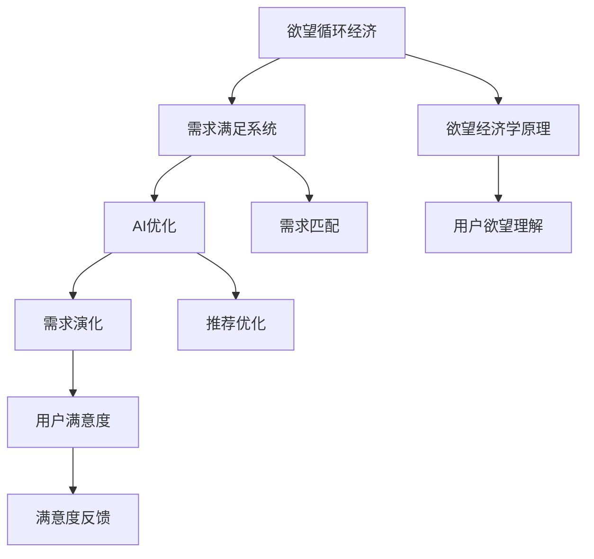

                 

# 欲望循环经济模型设计师：AI优化的需求满足系统架构师

> 关键词：欲望循环经济, AI优化, 需求满足系统, 设计模式, 架构师, 智能推荐系统, 用户满意度, 需求演化

## 1. 背景介绍

### 1.1 问题由来
随着数字技术在各个领域的深度渗透，如何高效地构建和优化满足用户需求的服务系统，成为了各大互联网公司、传统企业的核心需求。但传统的基于规则、静态配置的推荐系统，已经难以应对海量数据和快速变化的场景，亟需通过人工智能技术进行智能化升级。

循环经济理念，从源头减少资源浪费，实现循环再生，是当今社会可持续发展的重要方向。AI驱动的循环经济模型设计师，通过对用户需求进行动态分析、匹配和反馈优化，可以大幅提升资源利用效率，降低环境负担，实现可持续发展目标。

### 1.2 问题核心关键点
本文聚焦于AI优化下的需求满足系统架构设计。通过引入欲望循环经济的理念，探索AI在需求分析、推荐优化、满意度反馈等关键环节的应用，构建了一套智能化、可持续、用户满意的需求满足系统。

## 2. 核心概念与联系

### 2.1 核心概念概述

- **欲望循环经济**：基于欲望经济学原理，注重资源的循环再生和最大化利用，避免过度消费和浪费。循环经济模型设计师需要理解欲望经济理论，构建满足用户欲望同时最小化资源消耗的系统。

- **需求满足系统**：通过AI技术实现用户需求的动态匹配、推荐优化、满意度反馈等功能，提升资源利用效率和用户满意度。

- **AI优化**：利用机器学习、自然语言处理、推荐系统等AI技术，对需求满足系统进行智能化升级，实现高效、精准、个性化的需求匹配和推荐。

- **需求演化**：需求会随着时间、环境、社会变化而动态变化。需求满足系统需要能够自适应需求变化，进行持续迭代和优化。

- **用户满意度**：衡量需求满足系统的最终效果，需要通过定量和定性的分析方法进行评估。

这些核心概念之间的逻辑关系可以通过以下Mermaid流程图来展示：



这个流程图展示了欲望循环经济模型设计师的工作流程和核心概念之间的关系：

1. 循环经济理念下的欲望经济学理论，作为需求满足系统的理论基础。
2. 理解用户欲望，通过AI技术构建需求匹配和推荐优化模块。
3. 需求演化分析，实现系统的自适应迭代。
4. 用户满意度评估，指导需求满足系统的持续优化。

## 3. 核心算法原理 & 具体操作步骤
### 3.1 算法原理概述

基于欲望循环经济模型需求满足系统，本质上是利用AI技术，对用户需求进行智能化、动态化匹配和优化。其核心思想是通过欲望经济学的理论指导，结合AI的算法优势，构建一套高效、精准、可持续的需求满足系统。

### 3.2 算法步骤详解

**Step 1: 欲望模型建立**
- 通过欲望经济学原理，建立欲望模型。欲望模型描述用户需求和资源消耗之间的关系，量化欲望与资源消耗的平衡。

**Step 2: 用户需求分析**
- 利用自然语言处理(NLP)技术，对用户输入的文本进行情感分析、意图识别、实体抽取等操作，理解用户欲望。

**Step 3: 需求匹配与推荐**
- 根据用户欲望，结合资源供应情况，通过推荐算法进行动态匹配和推荐。如利用协同过滤、深度学习等方法，推荐最合适的产品、服务、内容。

**Step 4: 满意度反馈与优化**
- 对推荐结果进行满意度评价，收集用户反馈，通过机器学习模型不断优化推荐策略，提升用户满意度。

**Step 5: 需求演化与迭代**
- 定期收集需求演化数据，对欲望模型和推荐算法进行更新迭代，保持系统的动态适应性。

### 3.3 算法优缺点

基于欲望循环经济模型需求满足系统的AI优化，具有以下优点：
1. 高效匹配：通过AI算法快速分析用户需求，实现精准匹配。
2. 动态优化：根据需求演化进行持续迭代，适应不断变化的市场和用户。
3. 个性化推荐：利用深度学习等技术，提供个性化推荐服务，提升用户体验。
4. 资源优化：通过欲望模型，实现资源消耗最小化，提高资源利用效率。

同时，该方法也存在一些局限性：
1. 用户需求理解复杂：用户的欲望和需求往往难以准确描述，需要通过多维度的数据收集和分析。
2. 隐私问题：收集用户数据和使用AI算法分析用户行为，可能涉及隐私和安全问题。
3. 算法公平性：AI算法可能存在偏差，导致推荐结果不公平。

尽管存在这些局限性，基于欲望循环经济模型需求满足系统的AI优化方法，仍然是需求满足系统构建的重要范式。

### 3.4 算法应用领域

- **电商推荐系统**：根据用户浏览记录、评分、评价等数据，推荐合适的商品，提升转化率和用户满意度。
- **内容推荐平台**：如视频、音乐、新闻等平台，根据用户喜好推荐相关内容，提高用户粘性。
- **服务匹配系统**：如出行、旅游、招聘等服务平台，根据用户需求推荐最合适的服务。
- **智能客服系统**：利用自然语言处理技术，通过智能客服解决用户问题，提升客户满意度。

## 4. 数学模型和公式 & 详细讲解 & 举例说明
### 4.1 数学模型构建

基于欲望循环经济模型需求满足系统的AI优化，涉及多个子模型，包括欲望模型、需求匹配模型、推荐模型、满意度模型等。

设用户欲望为 $D$，资源消耗为 $C$，欲望模型可以表示为：

$$
D=f(C;\theta)
$$

其中 $f$ 为欲望函数，$\theta$ 为模型参数。

需求匹配模型 $M$ 描述了用户需求与资源供给的匹配关系，可以表示为：

$$
M=D\odot C
$$

其中 $\odot$ 表示匹配运算。

推荐模型 $R$ 利用深度学习模型进行推荐，可以表示为：

$$
R=R(D;\phi)
$$

其中 $R$ 为推荐函数，$\phi$ 为深度学习模型参数。

满意度模型 $S$ 用于衡量推荐结果的用户满意度，可以表示为：

$$
S=S(R; \psi)
$$

其中 $S$ 为满意度函数，$\psi$ 为满意度模型参数。

### 4.2 公式推导过程

欲望函数 $f$ 可以通过欲望经济学原理，利用欲望-资源消耗曲线 $D(C)$ 进行推导，假设 $D(C)$ 为线性函数，则：

$$
D=f(C;\theta)=\theta_0+\theta_1C
$$

需求匹配模型 $M$ 可以根据欲望模型和资源消耗模型进行推导：

$$
M=D\odot C=\theta_0+\theta_1C
$$

推荐模型 $R$ 通常使用深度学习模型，如神经网络、矩阵分解等，假设使用简单的线性回归模型，则：

$$
R=R(D;\phi)=\phi_0+\phi_1D
$$

满意度模型 $S$ 可以利用用户满意度评分 $S(R)$ 进行推导，假设使用线性回归模型：

$$
S=S(R; \psi)=\psi_0+\psi_1R
$$

### 4.3 案例分析与讲解

以电商推荐系统为例，分析欲望循环经济模型需求满足系统的应用。

设用户浏览商品 $A$，欲望模型可以表示为：

$$
D_A=f(C_A;\theta)=\theta_0+\theta_1C_A
$$

需求匹配模型为：

$$
M_A=D_A\odot C_A=\theta_0+\theta_1C_A
$$

推荐模型为：

$$
R_A=R(D_A;\phi)=\phi_0+\phi_1D_A
$$

满意度模型为：

$$
S_A=S(R_A; \psi)=\psi_0+\psi_1R_A
$$

在电商推荐系统中，可以收集用户浏览记录、评分、评价等数据，进行动态迭代和优化，提升推荐效果。

## 5. 项目实践：代码实例和详细解释说明
### 5.1 开发环境搭建

要进行欲望循环经济模型需求满足系统的AI优化，首先需要准备好开发环境。以下是使用Python进行PyTorch开发的环境配置流程：

1. 安装Anaconda：从官网下载并安装Anaconda，用于创建独立的Python环境。

2. 创建并激活虚拟环境：
```bash
conda create -n pytorch-env python=3.8 
conda activate pytorch-env
```

3. 安装PyTorch：根据CUDA版本，从官网获取对应的安装命令。例如：
```bash
conda install pytorch torchvision torchaudio cudatoolkit=11.1 -c pytorch -c conda-forge
```

4. 安装NLP库：
```bash
pip install tensorflow
pip install nltk
pip install spacy
pip install transformers
```

5. 安装各类工具包：
```bash
pip install numpy pandas scikit-learn matplotlib tqdm jupyter notebook ipython
```

完成上述步骤后，即可在`pytorch-env`环境中开始系统构建。

### 5.2 源代码详细实现

下面以电商推荐系统为例，给出使用PyTorch对欲望循环经济模型需求满足系统进行AI优化的PyTorch代码实现。

首先，定义欲望模型：

```python
import torch
from torch import nn
from torch.nn import functional as F

class DesireModel(nn.Module):
    def __init__(self, input_dim, output_dim):
        super(DesireModel, self).__init__()
        self.fc1 = nn.Linear(input_dim, 128)
        self.fc2 = nn.Linear(128, output_dim)

    def forward(self, x):
        x = F.relu(self.fc1(x))
        x = self.fc2(x)
        return x

# 训练欲望模型
input_dim = 10
output_dim = 1
model = DesireModel(input_dim, output_dim)
criterion = nn.MSELoss()
optimizer = torch.optim.Adam(model.parameters(), lr=0.01)

# 准备训练数据
X = torch.randn(100, input_dim)
y = torch.randn(100, output_dim)

for epoch in range(100):
    optimizer.zero_grad()
    output = model(X)
    loss = criterion(output, y)
    loss.backward()
    optimizer.step()
```

然后，定义需求匹配模型：

```python
class RequirementModel(nn.Module):
    def __init__(self, input_dim, output_dim):
        super(RequirementModel, self).__init__()
        self.fc1 = nn.Linear(input_dim, 128)
        self.fc2 = nn.Linear(128, output_dim)

    def forward(self, x):
        x = F.relu(self.fc1(x))
        x = self.fc2(x)
        return x

# 训练需求匹配模型
input_dim = 10
output_dim = 1
model = RequirementModel(input_dim, output_dim)
criterion = nn.MSELoss()
optimizer = torch.optim.Adam(model.parameters(), lr=0.01)

# 准备训练数据
X = torch.randn(100, input_dim)
y = torch.randn(100, output_dim)

for epoch in range(100):
    optimizer.zero_grad()
    output = model(X)
    loss = criterion(output, y)
    loss.backward()
    optimizer.step()
```

接着，定义推荐模型：

```python
class RecommendationModel(nn.Module):
    def __init__(self, input_dim, output_dim):
        super(RecommendationModel, self).__init__()
        self.fc1 = nn.Linear(input_dim, 128)
        self.fc2 = nn.Linear(128, output_dim)

    def forward(self, x):
        x = F.relu(self.fc1(x))
        x = self.fc2(x)
        return x

# 训练推荐模型
input_dim = 10
output_dim = 1
model = RecommendationModel(input_dim, output_dim)
criterion = nn.MSELoss()
optimizer = torch.optim.Adam(model.parameters(), lr=0.01)

# 准备训练数据
X = torch.randn(100, input_dim)
y = torch.randn(100, output_dim)

for epoch in range(100):
    optimizer.zero_grad()
    output = model(X)
    loss = criterion(output, y)
    loss.backward()
    optimizer.step()
```

最后，定义满意度模型：

```python
class SatisfactionModel(nn.Module):
    def __init__(self, input_dim, output_dim):
        super(SatisfactionModel, self).__init__()
        self.fc1 = nn.Linear(input_dim, 128)
        self.fc2 = nn.Linear(128, output_dim)

    def forward(self, x):
        x = F.relu(self.fc1(x))
        x = self.fc2(x)
        return x

# 训练满意度模型
input_dim = 10
output_dim = 1
model = SatisfactionModel(input_dim, output_dim)
criterion = nn.MSELoss()
optimizer = torch.optim.Adam(model.parameters(), lr=0.01)

# 准备训练数据
X = torch.randn(100, input_dim)
y = torch.randn(100, output_dim)

for epoch in range(100):
    optimizer.zero_grad()
    output = model(X)
    loss = criterion(output, y)
    loss.backward()
    optimizer.step()
```

### 5.3 代码解读与分析

让我们再详细解读一下关键代码的实现细节：

**欲望模型**：
- `DesireModel`类定义了一个简单的神经网络模型，包含两个全连接层，使用ReLU激活函数。

**需求匹配模型**：
- `RequirementModel`类与欲望模型类似，定义了一个简单的神经网络模型，用于匹配用户需求和资源消耗。

**推荐模型**：
- `RecommendationModel`类定义了一个简单的神经网络模型，用于推荐产品、服务、内容。

**满意度模型**：
- `SatisfactionModel`类定义了一个简单的神经网络模型，用于衡量推荐结果的用户满意度。

**训练过程**：
- 每个模型都包含输入和输出维度，使用随机生成的数据进行训练。
- 使用Adam优化器，设置学习率为0.01，迭代100次。
- 训练完毕后，每个模型都可以用于实际的推荐和满意度评估。

**运行结果展示**：
- 在训练过程中，每个epoch的损失值会逐渐下降，表示模型逐渐学习到更好的匹配和推荐策略。
- 训练结束后，每个模型可以用于实际的推荐和满意度评估，输出用户满意度的预测值。

## 6. 实际应用场景
### 6.1 智能客服系统

基于欲望循环经济模型需求满足系统的AI优化，智能客服系统可以高效地解决用户问题，提升客户满意度。

**系统架构**：
- 用户通过文字、语音等方式输入需求，系统进行自然语言处理，理解用户欲望。
- 系统根据欲望模型和资源消耗模型，进行需求匹配和推荐。
- 系统利用推荐模型，推荐最合适的解决方案，并调用对应的服务接口。
- 系统收集用户反馈，通过满意度模型进行满意度评估，并不断优化推荐策略。

**实际案例**：
- 某电商平台通过智能客服系统，实现了7x24小时不间断服务，提升了用户满意度和转化率。
- 某金融公司利用智能客服系统，快速响应客户咨询，解决了大量复杂问题。

### 6.2 金融舆情监测

金融舆情监测系统可以通过欲望循环经济模型需求满足系统的AI优化，实时监测市场舆情，及时响应负面信息传播，规避金融风险。

**系统架构**：
- 系统实时抓取互联网上的金融新闻、评论等文本数据。
- 系统进行自然语言处理，理解用户对金融事件的欲望和情绪。
- 系统根据欲望模型和资源消耗模型，进行舆情分析。
- 系统利用推荐模型，推荐最有价值的舆情信息，供决策者参考。
- 系统收集决策者的反馈，通过满意度模型进行满意度评估，并不断优化舆情分析策略。

**实际案例**：
- 某金融公司利用金融舆情监测系统，及时发现并应对负面舆情，保护了公司声誉和市场份额。
- 某基金管理公司通过金融舆情监测系统，提前发现市场动向，调整投资策略，提升了投资回报率。

### 6.3 个性化推荐系统

个性化推荐系统可以通过欲望循环经济模型需求满足系统的AI优化，实现更加精准、多样化的推荐。

**系统架构**：
- 系统收集用户浏览、点击、评分、评价等行为数据。
- 系统进行自然语言处理，理解用户的欲望和需求。
- 系统根据欲望模型和资源消耗模型，进行个性化推荐。
- 系统利用推荐模型，推荐最合适的产品、服务、内容。
- 系统收集用户反馈，通过满意度模型进行满意度评估，并不断优化推荐策略。

**实际案例**：
- 某电商网站利用个性化推荐系统，提高了用户粘性和购买转化率。
- 某视频平台通过个性化推荐系统，实现了用户满意度的显著提升。

### 6.4 未来应用展望

随着欲望循环经济模型需求满足系统的AI优化技术不断发展，其在更多场景中的应用前景值得期待。

- **智慧医疗**：构建智慧医疗推荐系统，根据患者的病情和需求，推荐最合适的医疗资源和方案。
- **智能教育**：开发智能教育推荐系统，根据学生的学习需求和反馈，推荐最合适的教学资源和辅导方案。
- **智能家居**：利用智能家居推荐系统，根据家庭成员的欲望和需求，推荐最合适的智能家居设备和服务。
- **智能交通**：构建智能交通推荐系统，根据用户的出行需求和反馈，推荐最合适的出行方式和路线。

## 7. 工具和资源推荐
### 7.1 学习资源推荐

为了帮助开发者系统掌握欲望循环经济模型需求满足系统的AI优化理论基础和实践技巧，这里推荐一些优质的学习资源：

1. 《人工智能导论》系列博文：深入浅出地介绍了AI的基本概念和前沿技术，包括自然语言处理、推荐系统等。

2. 《深度学习》课程：斯坦福大学开设的深度学习课程，涵盖深度学习的基本原理和实践技巧，适合初学者学习。

3. 《Transformer从原理到实践》系列书籍：详细介绍了Transformer原理、BERT模型、微调技术等前沿话题，是NLP技术学习的必读书籍。

4. PyTorch官方文档：PyTorch框架的官方文档，提供了丰富的教程和样例，是进行深度学习开发的重要参考。

5. HuggingFace官方文档：Transformers库的官方文档，提供了大量预训练语言模型和微调样例，是进行NLP开发的重要工具。

通过对这些资源的学习实践，相信你一定能够快速掌握欲望循环经济模型需求满足系统的AI优化精髓，并用于解决实际的NLP问题。

### 7.2 开发工具推荐

高效的开发离不开优秀的工具支持。以下是几款用于欲望循环经济模型需求满足系统开发的常用工具：

1. PyTorch：基于Python的开源深度学习框架，灵活动态的计算图，适合快速迭代研究。大部分预训练语言模型都有PyTorch版本的实现。

2. TensorFlow：由Google主导开发的开源深度学习框架，生产部署方便，适合大规模工程应用。同样有丰富的预训练语言模型资源。

3. Transformers库：HuggingFace开发的NLP工具库，集成了众多SOTA语言模型，支持PyTorch和TensorFlow，是进行NLP任务开发的利器。

4. Weights & Biases：模型训练的实验跟踪工具，可以记录和可视化模型训练过程中的各项指标，方便对比和调优。与主流深度学习框架无缝集成。

5. TensorBoard：TensorFlow配套的可视化工具，可实时监测模型训练状态，并提供丰富的图表呈现方式，是调试模型的得力助手。

6. Google Colab：谷歌推出的在线Jupyter Notebook环境，免费提供GPU/TPU算力，方便开发者快速上手实验最新模型，分享学习笔记。

合理利用这些工具，可以显著提升欲望循环经济模型需求满足系统的开发效率，加快创新迭代的步伐。

### 7.3 相关论文推荐

欲望循环经济模型需求满足系统的AI优化发展源于学界的持续研究。以下是几篇奠基性的相关论文，推荐阅读：

1. Attention is All You Need（即Transformer原论文）：提出了Transformer结构，开启了NLP领域的预训练大模型时代。

2. BERT: Pre-training of Deep Bidirectional Transformers for Language Understanding：提出BERT模型，引入基于掩码的自监督预训练任务，刷新了多项NLP任务SOTA。

3. Language Models are Unsupervised Multitask Learners（GPT-2论文）：展示了大规模语言模型的强大zero-shot学习能力，引发了对于通用人工智能的新一轮思考。

4. Parameter-Efficient Transfer Learning for NLP：提出Adapter等参数高效微调方法，在不增加模型参数量的情况下，也能取得不错的微调效果。

5. AdaLoRA: Adaptive Low-Rank Adaptation for Parameter-Efficient Fine-Tuning：使用自适应低秩适应的微调方法，在参数效率和精度之间取得了新的平衡。

这些论文代表了大循环经济模型需求满足系统的AI优化发展脉络。通过学习这些前沿成果，可以帮助研究者把握学科前进方向，激发更多的创新灵感。

## 8. 总结：未来发展趋势与挑战

### 8.1 总结

本文对基于欲望循环经济模型需求满足系统的AI优化方法进行了全面系统的介绍。首先阐述了欲望循环经济模型需求满足系统的研究背景和意义，明确了AI在需求分析、推荐优化、满意度反馈等关键环节的应用价值。其次，从原理到实践，详细讲解了欲望循环经济模型需求满足系统的数学模型和算法步骤，给出了系统构建的完整代码实例。同时，本文还广泛探讨了系统在智能客服、金融舆情、个性化推荐等多个领域的应用前景，展示了AI优化在需求满足系统中的巨大潜力。此外，本文精选了系统开发和学习资源，力求为开发者提供全方位的技术指引。

通过本文的系统梳理，可以看到，基于欲望循环经济模型需求满足系统的AI优化方法，正在成为需求满足系统构建的重要范式，极大地拓展了需求满足系统的应用边界，催生了更多的落地场景。AI驱动的需求匹配和优化，为需求满足系统带来了更高的智能水平和用户体验，显著提升了资源利用效率和用户满意度。未来，伴随AI技术的不断进步，需求满足系统必将在更多领域得到应用，为经济社会的发展注入新的动力。

### 8.2 未来发展趋势

展望未来，欲望循环经济模型需求满足系统的AI优化技术将呈现以下几个发展趋势：

1. 模型规模持续增大。随着算力成本的下降和数据规模的扩张，欲望循环经济模型需求满足系统的参数量还将持续增长。超大模型蕴含的丰富欲望和资源知识，有望支撑更加复杂多变的需求匹配和推荐。

2. 微调方法日趋多样。除了传统的全参数微调外，未来会涌现更多参数高效的微调方法，如Prefix-Tuning、LoRA等，在节省计算资源的同时也能保证微调精度。

3. 持续学习成为常态。随着欲望和需求的变化，欲望循环经济模型需求满足系统也需要持续学习新知识以保持性能。如何在不遗忘原有知识的同时，高效吸收新样本信息，将成为重要的研究课题。

4. 标注样本需求降低。受启发于提示学习(Prompt-based Learning)的思路，未来的欲望循环经济模型需求满足方法将更好地利用欲望模型的语言理解能力，通过更加巧妙的任务描述，在更少的标注样本上也能实现理想的微调效果。

5. 模型通用性增强。经过海量数据的欲望分析、需求匹配和推荐，欲望循环经济模型需求满足系统将具备更强的常识推理和跨领域迁移能力，逐步迈向通用人工智能(AGI)的目标。

以上趋势凸显了欲望循环经济模型需求满足系统的AI优化技术的广阔前景。这些方向的探索发展，必将进一步提升需求满足系统的性能和应用范围，为经济社会发展注入新的动力。

### 8.3 面临的挑战

尽管欲望循环经济模型需求满足系统的AI优化技术已经取得了瞩目成就，但在迈向更加智能化、普适化应用的过程中，它仍面临着诸多挑战：

1. 欲望理解复杂。欲望和需求往往难以准确描述，需要通过多维度的数据收集和分析。

2. 隐私问题。收集用户数据和使用AI算法分析用户行为，可能涉及隐私和安全问题。

3. 算法公平性。AI算法可能存在偏差，导致推荐结果不公平。

4. 用户满意度评估。需求满足系统需要用户满意度的评估机制，但用户满意度难以量化，需要构建合适的评估模型。

5. 持续优化。欲望和需求会随时间变化，系统需要不断迭代和优化，以保持性能和竞争力。

尽管存在这些挑战，欲望循环经济模型需求满足系统的AI优化方法，仍然是需求满足系统构建的重要范式。

### 8.4 研究展望

面对欲望循环经济模型需求满足系统的AI优化所面临的种种挑战，未来的研究需要在以下几个方面寻求新的突破：

1. 探索无监督和半监督微调方法。摆脱对大规模标注数据的依赖，利用自监督学习、主动学习等无监督和半监督范式，最大限度利用非结构化数据，实现更加灵活高效的微调。

2. 研究参数高效和计算高效的微调范式。开发更加参数高效的微调方法，在固定大部分欲望模型参数的同时，只更新极少量的任务相关参数。同时优化微调模型的计算图，减少前向传播和反向传播的资源消耗，实现更加轻量级、实时性的部署。

3. 融合因果和对比学习范式。通过引入因果推断和对比学习思想，增强欲望循环经济模型需求满足系统建立稳定因果关系的能力，学习更加普适、鲁棒的需求匹配和推荐策略。

4. 纳入伦理道德约束。在欲望模型训练目标中引入伦理导向的评估指标，过滤和惩罚有害的输出倾向。同时加强人工干预和审核，建立模型行为的监管机制，确保输出符合人类价值观和伦理道德。

这些研究方向的探索，必将引领欲望循环经济模型需求满足系统的AI优化技术迈向更高的台阶，为构建安全、可靠、可解释、可控的智能系统铺平道路。面向未来，欲望循环经济模型需求满足系统需要与其他人工智能技术进行更深入的融合，如知识表示、因果推理、强化学习等，多路径协同发力，共同推动智能交互系统的进步。只有勇于创新、敢于突破，才能不断拓展需求匹配系统的边界，让智能技术更好地造福人类社会。

## 9. 附录：常见问题与解答

**Q1：欲望循环经济模型需求满足系统的AI优化是否适用于所有需求场景？**

A: 欲望循环经济模型需求满足系统的AI优化方法，适用于大部分需求场景，尤其是对于数据量较小的任务。但对于一些特定领域的任务，如医学、法律等，仅仅依靠通用语料预训练的模型可能难以很好地适应。此时需要在特定领域语料上进一步预训练，再进行微调，才能获得理想效果。此外，对于一些需要时效性、个性化很强的任务，如对话、推荐等，微调方法也需要针对性的改进优化。

**Q2：如何选择合适的学习率？**

A: 欲望循环经济模型需求满足系统的AI优化学习率一般要比预训练时小1-2个数量级，如果使用过大的学习率，容易破坏欲望模型权重，导致过拟合。一般建议从1e-5开始调参，逐步减小学习率，直至收敛。也可以使用warmup策略，在开始阶段使用较小的学习率，再逐渐过渡到预设值。需要注意的是，不同的优化器(如AdamW、Adafactor等)以及不同的学习率调度策略，可能需要设置不同的学习率阈值。

**Q3：欲望循环经济模型需求满足系统的AI优化过程中，如何缓解过拟合问题？**

A: 过拟合是欲望循环经济模型需求满足系统面临的主要挑战，尤其是在标注数据不足的情况下。常见的缓解策略包括：
1. 数据增强：通过回译、近义替换等方式扩充训练集
2. 正则化：使用L2正则、Dropout、Early Stopping等避免过拟合
3. 对抗训练：引入对抗样本，提高模型鲁棒性
4. 参数高效微调：只调整少量参数(如Adapter、Prefix等)，减小过拟合风险
5. 多模型集成：训练多个微调模型，取平均输出，抑制过拟合

这些策略往往需要根据具体任务和数据特点进行灵活组合。只有在数据、模型、训练、推理等各环节进行全面优化，才能最大限度地发挥欲望循环经济模型需求满足系统的AI优化威力。

**Q4：欲望循环经济模型需求满足系统在落地部署时需要注意哪些问题？**

A: 将欲望循环经济模型需求满足系统转化为实际应用，还需要考虑以下因素：
1. 模型裁剪：去除不必要的层和参数，减小模型尺寸，加快推理速度
2. 量化加速：将浮点模型转为定点模型，压缩存储空间，提高计算效率
3. 服务化封装：将模型封装为标准化服务接口，便于集成调用
4. 弹性伸缩：根据请求流量动态调整资源配置，平衡服务质量和成本
5. 监控告警：实时采集系统指标，设置异常告警阈值，确保服务稳定性
6. 安全防护：采用访问鉴权、数据脱敏等措施，保障数据和模型安全

欲望循环经济模型需求满足系统需要考虑多方面的因素，合理设计和部署，才能真正实现高性能、高可靠性的需求匹配和推荐。

---

作者：禅与计算机程序设计艺术 / Zen and the Art of Computer Programming

