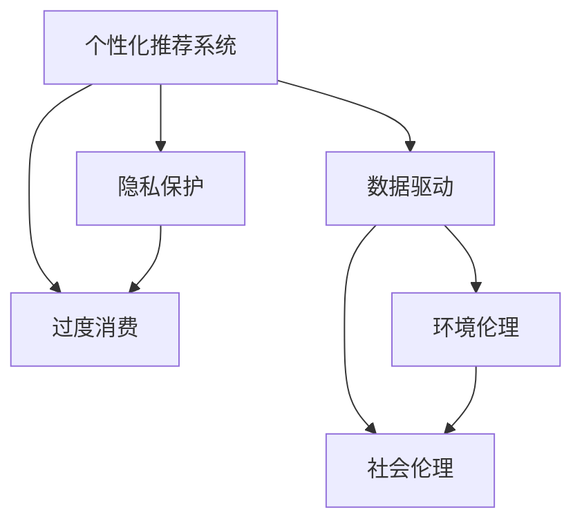

                 

# 欲望的可持续性：AI时代的消费伦理

> 关键词：人工智能,消费伦理,数据驱动,个性化推荐,隐私保护,可持续发展

## 1. 背景介绍

### 1.1 问题由来

随着人工智能技术的迅猛发展，我们正步入一个由数据驱动的时代。算法在个性化推荐、精准营销、智能客服等领域的应用，极大地提升了消费者的购物体验，也重塑了消费行为模式。但在这个过程中，也伴随着诸多伦理问题。

一方面，AI推荐算法通过精准分析用户行为和偏好，推送个性化商品，满足了消费者的需求，带来了便利。但另一方面，这种个性化的背后，是大量数据收集、分析和利用，引发了隐私保护和数据安全等伦理风险。

更重要的是，这种基于数据的个性化推荐，有时甚至可能引发"欲望的无限膨胀"，导致过度消费、过度生产，对环境和社会的可持续性构成威胁。如何在享受技术红利的同时，保持消费行为的可持续性，成为我们必须面对的重大课题。

### 1.2 问题核心关键点

为深入理解AI时代消费伦理的本质，我们将从以下几个核心关键点进行讨论：

1. **数据驱动的个性化推荐**：个性化推荐系统的设计理念、实现方式及其对消费者行为的影响。
2. **隐私保护**：AI推荐系统中用户数据的收集、处理和利用，以及如何保护用户隐私。
3. **欲望的可持续性**：算法驱动的个性化推荐如何影响消费行为，导致环境和社会问题。
4. **可持续发展**：如何在享受技术红利的同时，保持消费行为的可持续性。

这些关键点构成了本文的主要研究框架，旨在通过深入剖析AI推荐系统的伦理问题，提出解决方案，引导我们走向更加可持续的消费模式。

## 2. 核心概念与联系

### 2.1 核心概念概述

为更好地理解AI时代消费伦理，本节将介绍几个密切相关的核心概念：

1. **个性化推荐系统**：通过分析用户行为、偏好，推送个性化商品，提升购物体验的AI系统。常见推荐算法包括协同过滤、基于内容的推荐、深度学习推荐等。

2. **数据隐私**：指在数据收集、存储、处理和传输过程中，如何保护用户个人信息，避免数据泄露和滥用。

3. **过度消费**：指消费者受个性化推荐的影响，频繁购买商品，超出了自身需求和财务能力的消费行为。

4. **环境伦理**：指在消费过程中，如何平衡经济利益和环境保护的关系，实现可持续发展。

5. **社会伦理**：指在消费过程中，如何保障消费者权益，避免算法偏见，确保社会公平正义。

这些概念之间的逻辑关系可以通过以下Mermaid流程图来展示：



这个流程图展示了个性化推荐系统与数据隐私、过度消费、环境伦理、社会伦理之间的关联：

- 个性化推荐系统通过数据驱动，依赖用户数据进行分析推荐，直接影响了消费者的消费行为。
- 用户数据的收集和利用涉及隐私保护，保护用户隐私是推荐系统的基础伦理要求。
- 数据驱动的个性化推荐可能引发过度消费，影响环境的可持续性。
- 保护用户隐私和避免过度消费，有助于实现社会伦理的平衡。

这些概念共同构成了AI时代消费伦理的研究框架，帮助我们系统地思考和应对个性化推荐系统带来的伦理挑战。

## 3. 核心算法原理 & 具体操作步骤
### 3.1 算法原理概述

个性化推荐系统基于用户的过往行为和偏好，通过机器学习算法预测用户可能感兴趣的商品，并推送给用户。其主要算法包括协同过滤、基于内容的推荐、深度学习推荐等。

协同过滤算法通过分析用户行为，找到相似用户，并根据相似用户的偏好推荐商品。基于内容的推荐则根据商品的特征，找到与用户偏好匹配的商品。深度学习推荐通过构建复杂的神经网络模型，学习用户行为和商品特征的关联，实现更精准的推荐。

### 3.2 算法步骤详解

个性化推荐系统的实现步骤包括数据收集、用户建模、推荐算法训练和推荐结果生成等。

1. **数据收集**：收集用户的浏览历史、购买记录、评分数据等行为数据，形成用户行为序列。

2. **用户建模**：使用统计学或机器学习算法，将用户行为序列转化为用户特征向量。

3. **推荐算法训练**：使用训练数据集，训练推荐算法模型。常见的训练方式包括监督学习和无监督学习。

4. **推荐结果生成**：使用训练好的推荐模型，对新用户输入的行为序列进行预测，生成推荐结果。

### 3.3 算法优缺点

个性化推荐系统具有以下优点：

1. 提升购物体验：通过精准分析用户行为和偏好，推荐符合用户需求的商品，提升了购物体验。

2. 增加用户粘性：推荐系统能够持续推送个性化商品，增加用户停留时间，提升用户粘性。

3. 提高转化率：个性化推荐能够显著提升用户的购买意愿，提高销售转化率。

但个性化推荐系统也存在一些缺点：

1. 依赖用户数据：推荐系统的精度和效果依赖于用户数据的丰富程度和质量。

2. 数据隐私风险：用户数据的收集和利用涉及隐私保护问题，需严格控制数据收集和使用范围。

3. 算法偏见：推荐算法可能受到训练数据偏见的影响，导致推荐结果的不公平性。

4. 过度消费风险：个性化推荐可能引发用户过度消费，影响环境和社会可持续性。

### 3.4 算法应用领域

个性化推荐系统在电商、社交媒体、在线视频、智能客服等多个领域得到了广泛应用，具体包括：

1. **电商推荐**：通过分析用户浏览记录和购买历史，推荐相关商品，提升用户购物体验。

2. **社交媒体推荐**：根据用户的兴趣和行为，推荐文章、视频、图片等内容，增加用户粘性。

3. **在线视频推荐**：分析用户观看记录和评分数据，推荐符合用户兴趣的视频内容。

4. **智能客服推荐**：根据用户的问题记录，推荐相关解决方案，提升用户满意度。

## 4. 数学模型和公式 & 详细讲解 & 举例说明
### 4.1 数学模型构建

个性化推荐系统通常基于矩阵分解、协同过滤、深度学习等算法进行建模。

1. **协同过滤算法**：将用户行为矩阵和商品特征矩阵分解为低秩矩阵，通过求解近似矩阵的乘积，实现推荐。

2. **基于内容的推荐算法**：通过构建用户-商品特征矩阵，使用分类算法（如KNN、逻辑回归等）进行推荐。

3. **深度学习推荐算法**：使用神经网络模型，通过多层次特征提取，实现对用户行为和商品特征的深度学习。

### 4.2 公式推导过程

以协同过滤算法为例，假设用户行为矩阵为 $U$，商品特征矩阵为 $V$，用户-商品评分矩阵为 $R$。协同过滤的目标是通过矩阵分解，找到近似矩阵 $\hat{U}$ 和 $\hat{V}$，使得 $\hat{U}\hat{V}^T \approx R$。

设用户 $u$ 对商品 $i$ 的评分预测为 $p_{ui}$，则预测公式为：

$$
p_{ui} = \hat{u}_i\hat{v}_u^T
$$

其中 $\hat{u}_i$ 和 $\hat{v}_u$ 分别为矩阵 $\hat{U}$ 和 $\hat{V}$ 的第 $i$ 行和第 $u$ 列。

### 4.3 案例分析与讲解

以Netflix推荐系统为例，Netflix使用协同过滤算法推荐电影，具体步骤如下：

1. 收集用户观看历史和评分数据，形成用户行为矩阵 $U$ 和商品特征矩阵 $V$。

2. 对用户行为矩阵 $U$ 和商品特征矩阵 $V$ 进行奇异值分解，得到近似矩阵 $\hat{U}$ 和 $\hat{V}$。

3. 使用近似矩阵进行用户行为预测，推荐用户可能感兴趣的电影。

Netflix的成功案例展示了协同过滤算法的强大应用潜力，但也揭示了推荐系统对用户数据的依赖和隐私保护的挑战。

## 5. 项目实践：代码实例和详细解释说明
### 5.1 开发环境搭建

在进行个性化推荐系统开发前，我们需要准备好开发环境。以下是使用Python进行TensorFlow开发的环境配置流程：

1. 安装Anaconda：从官网下载并安装Anaconda，用于创建独立的Python环境。

2. 创建并激活虚拟环境：
```bash
conda create -n tf-env python=3.8 
conda activate tf-env
```

3. 安装TensorFlow：根据CUDA版本，从官网获取对应的安装命令。例如：
```bash
conda install tensorflow
```

4. 安装TensorBoard：
```bash
pip install tensorboard
```

5. 安装各类工具包：
```bash
pip install numpy pandas scikit-learn matplotlib tqdm jupyter notebook ipython
```

完成上述步骤后，即可在`tf-env`环境中开始推荐系统开发。

### 5.2 源代码详细实现

下面我们以协同过滤算法为例，给出使用TensorFlow实现的电影推荐系统的PyTorch代码实现。

首先，定义数据处理函数：

```python
import tensorflow as tf
from tensorflow.keras.layers import Input, Embedding, Flatten, Dot, Dense

def data_processing(train_data, test_data):
    train_u, train_i, train_r = train_data[:, 0], train_data[:, 1], train_data[:, 2]
    test_u, test_i, test_r = test_data[:, 0], test_data[:, 1], test_data[:, 2]
    
    train_u = tf.keras.layers.Input(shape=())
    train_i = tf.keras.layers.Input(shape=())
    train_r = tf.keras.layers.Input(shape=())
    
    test_u = tf.keras.layers.Input(shape=())
    test_i = tf.keras.layers.Input(shape=())
    test_r = tf.keras.layers.Input(shape=())
    
    return train_u, train_i, train_r, test_u, test_i, test_r
```

然后，定义推荐模型：

```python
def recommendation_model(train_u, train_i, train_r, test_u, test_i, test_r):
    user_matrix = tf.keras.layers.Embedding(input_dim=num_users, output_dim=128, mask_zero=True)(train_u)
    item_matrix = tf.keras.layers.Embedding(input_dim=num_items, output_dim=128, mask_zero=True)(train_i)
    user_item_dot = Dot(axes=1)([user_matrix, item_matrix])
    
    user_matrix_test = tf.keras.layers.Embedding(input_dim=num_users, output_dim=128, mask_zero=True)(test_u)
    item_matrix_test = tf.keras.layers.Embedding(input_dim=num_items, output_dim=128, mask_zero=True)(test_i)
    user_item_dot_test = Dot(axes=1)([user_matrix_test, item_matrix_test])
    
    user_r = tf.keras.layers.Dense(1)(train_r)
    user_r_test = tf.keras.layers.Dense(1)(tf.keras.layers.Multiply([user_item_dot_test, user_r]))
    
    return user_r_test
```

接着，定义损失函数和优化器：

```python
model = recommendation_model(train_u, train_i, train_r, test_u, test_i, test_r)
loss = tf.keras.losses.MeanSquaredError()
optimizer = tf.keras.optimizers.Adam(learning_rate=0.01)
```

最后，启动训练流程并在测试集上评估：

```python
epochs = 10
batch_size = 128

for epoch in range(epochs):
    model.compile(optimizer=optimizer, loss=loss)
    model.fit([train_u, train_i], train_r, epochs=1, batch_size=batch_size, validation_data=([test_u, test_i], test_r))
    
    test_loss = model.evaluate([test_u, test_i], test_r)
    print(f'Epoch {epoch+1}, test loss: {test_loss:.4f}')
```

以上就是使用TensorFlow实现的电影推荐系统的完整代码实现。可以看到，使用TensorFlow框架，推荐系统的实现变得更加简洁高效。

### 5.3 代码解读与分析

让我们再详细解读一下关键代码的实现细节：

**data_processing函数**：
- 将训练和测试数据拆分为用户、商品、评分三个维度。
- 对每个维度进行标准化处理，去除无效数据。

**recommendation_model函数**：
- 使用Embedding层将用户和商品特征映射为低维向量。
- 通过Dot层计算用户-商品向量的点积，得到评分预测结果。
- 使用Dense层对评分进行线性回归，输出预测评分。

**训练和评估函数**：
- 使用TensorFlow的编译器将模型编译为可训练状态。
- 在训练过程中，使用Adam优化器进行参数更新，最小化均方误差损失。
- 在每个epoch结束时，使用测试集评估模型性能，输出测试损失。

以上代码展示了协同过滤算法的实现流程，也体现了推荐系统开发的一般步骤。

## 6. 实际应用场景
### 6.1 电商推荐

在电商平台上，个性化推荐系统能够根据用户的浏览和购买行为，推荐符合其兴趣的商品，显著提升用户的购物体验和转化率。例如，Amazon、淘宝等电商巨头都采用了推荐系统来提高销售业绩。

通过推荐系统，电商能够实现以下效果：

1. 个性化推荐：根据用户历史行为，推荐个性化商品，提升用户满意度。
2. 提高转化率：推荐系统通过精准分析用户行为，增加购买意愿，提升销售转化率。
3. 增加用户粘性：推荐系统通过持续推荐个性化商品，增加用户停留时间，提高用户粘性。

### 6.2 社交媒体推荐

社交媒体平台通过个性化推荐系统，推荐用户感兴趣的内容，增加用户活跃度和平台粘性。例如，Facebook、Instagram等社交平台都采用了推荐系统来优化用户体验。

推荐系统在社交媒体上的具体应用包括：

1. 新闻推荐：根据用户的兴趣和行为，推荐相关新闻文章，增加用户阅读量。
2. 视频推荐：分析用户观看记录和评分数据，推荐符合用户兴趣的视频内容。
3. 朋友推荐：通过分析用户的朋友关系和兴趣，推荐相关朋友，扩大社交圈。

### 6.3 在线视频推荐

在线视频平台通过个性化推荐系统，推荐用户感兴趣的视频内容，提升用户观看体验和留存率。例如，Netflix、YouTube等视频平台都采用了推荐系统来优化内容分发。

推荐系统在视频平台上的具体应用包括：

1. 电影推荐：根据用户的观看记录和评分数据，推荐符合用户兴趣的电影。
2. 电视剧推荐：分析用户观看记录和评分数据，推荐符合用户兴趣的电视剧。
3. 视频内容个性化：通过推荐系统，实现视频内容的个性化推荐，提升用户观看体验。

### 6.4 未来应用展望

随着个性化推荐系统技术的不断进步，其在更多领域的应用前景将更加广阔。

1. **医疗健康**：推荐系统可以用于推荐个性化医疗方案，帮助用户选择适合的诊疗方案。例如，通过分析用户病历和健康数据，推荐合适的医生和治疗方案。

2. **金融投资**：推荐系统可以用于推荐个性化的投资方案，帮助用户选择适合的投资产品。例如，通过分析用户风险偏好和历史交易数据，推荐合适的股票、基金等投资产品。

3. **智能家居**：推荐系统可以用于推荐个性化的智能家居设备，提升用户的生活体验。例如，通过分析用户的居住习惯和需求，推荐合适的智能家电和家居设备。

4. **教育培训**：推荐系统可以用于推荐个性化的学习内容，帮助用户选择适合的学习资源。例如，通过分析用户的学习历史和兴趣，推荐合适的课程、教材等学习资源。

5. **智能交通**：推荐系统可以用于推荐个性化的出行方案，帮助用户选择适合的出行路线。例如，通过分析用户的出行习惯和偏好，推荐合适的出行路线和交通工具。

## 7. 工具和资源推荐
### 7.1 学习资源推荐

为了帮助开发者系统掌握个性化推荐系统的理论基础和实践技巧，这里推荐一些优质的学习资源：

1. **《推荐系统实践》系列书籍**：深入浅出地介绍了推荐系统的理论基础和实际应用，适合初学者和进阶开发者阅读。

2. **Coursera《推荐系统》课程**：由斯坦福大学开设的推荐系统课程，提供理论讲解和实际案例，帮助你全面掌握推荐系统。

3. **Kaggle推荐系统竞赛**：参加Kaggle推荐系统竞赛，实践推荐算法的优化和模型评估，提升你的实战能力。

4. **Google TensorFlow官方文档**：TensorFlow官方文档提供了丰富的推荐系统样例代码和教程，是学习和实践推荐系统的必备资料。

5. **推荐系统论文集**：收集了推荐系统领域的经典论文，涵盖了协同过滤、深度学习、混合推荐等多个方向，适合深入研究。

通过对这些资源的学习实践，相信你一定能够快速掌握个性化推荐系统的精髓，并用于解决实际的推荐问题。

### 7.2 开发工具推荐

高效的开发离不开优秀的工具支持。以下是几款用于推荐系统开发的常用工具：

1. **TensorFlow**：由Google主导开发的深度学习框架，生产部署方便，适合大规模工程应用。支持推荐系统的多轮训练和优化。

2. **PyTorch**：基于Python的开源深度学习框架，灵活动态的计算图，适合快速迭代研究。

3. **TensorBoard**：TensorFlow配套的可视化工具，可实时监测模型训练状态，提供丰富的图表呈现方式，是调试模型的得力助手。

4. **Scikit-learn**：Python机器学习库，提供多种推荐算法和评估指标，适合快速搭建推荐系统。

5. **Jupyter Notebook**：免费的Jupyter Notebook环境，支持代码和文档的混合编写，适合实时调试和共享。

合理利用这些工具，可以显著提升推荐系统的开发效率，加快创新迭代的步伐。

### 7.3 相关论文推荐

推荐系统技术的发展源于学界的持续研究。以下是几篇奠基性的相关论文，推荐阅读：

1. **《推荐系统基础》**：Paweł Bruszyński, Wojciech Okoniewski - 介绍了推荐系统的基本概念和算法，适合入门学习。

2. **《协同过滤算法》**：Peter K. ing Han, Micheline Kamber - 深入介绍了协同过滤算法的原理和实现，是推荐系统研究的经典文献。

3. **《深度学习推荐系统》**：Jun Yu, Yu Zhu - 介绍了深度学习在推荐系统中的应用，展示了深度学习算法的高效性和潜力。

4. **《个性化推荐系统》**：Dawen Li - 介绍了个性化推荐系统的设计理念和实现方法，适合研究开发参考。

这些论文代表了个性化推荐系统的发展脉络。通过学习这些前沿成果，可以帮助研究者把握学科前进方向，激发更多的创新灵感。

## 8. 总结：未来发展趋势与挑战
### 8.1 总结

本文对个性化推荐系统的设计和实现进行了全面系统的介绍。首先阐述了个性化推荐系统的设计理念和应用场景，明确了其对消费者行为的影响。其次，从原理到实践，详细讲解了推荐系统的数学模型和关键步骤，给出了推荐系统开发的完整代码实例。同时，本文还广泛探讨了推荐系统在电商、社交媒体、在线视频等多个领域的应用前景，展示了其广泛的应用潜力。

通过本文的系统梳理，可以看到，个性化推荐系统在电商、社交媒体、在线视频等领域得到了广泛应用，提升了用户体验和平台粘性。但同时，推荐系统也引发了诸多伦理问题，如用户隐私、过度消费、环境可持续性等。如何在享受技术红利的同时，保持消费行为的可持续性，成为我们必须面对的重大课题。

### 8.2 未来发展趋势

展望未来，个性化推荐系统的技术发展将呈现以下几个趋势：

1. **数据驱动的个性化推荐**：推荐系统将继续依赖数据驱动，通过分析用户行为和偏好，实现更精准的推荐。

2. **推荐算法的优化**：推荐算法将不断优化，引入更多特征和维度，提升推荐精度和效果。

3. **推荐系统的普及**：推荐系统将在更多领域得到应用，如医疗健康、金融投资、智能家居等，成为各类应用的重要组件。

4. **推荐系统的集成**：推荐系统将与自然语言处理、知识图谱等技术进行集成，实现多模态信息的融合，提升推荐系统的智能化水平。

5. **推荐系统的可持续发展**：推荐系统将在设计上引入更多伦理和可持续性考虑，避免过度消费、隐私泄露等问题。

这些趋势展示了个性化推荐系统的广阔前景，预示着其在未来将发挥更大的作用。

### 8.3 面临的挑战

尽管个性化推荐系统取得了显著进展，但在迈向更加智能化、普适化应用的过程中，它仍面临诸多挑战：

1. **用户隐私问题**：推荐系统依赖大量的用户数据，如何保护用户隐私，避免数据泄露和滥用，是重要的伦理问题。

2. **过度消费风险**：个性化推荐可能导致用户过度消费，影响环境和社会可持续性，需加强控制和管理。

3. **推荐算法的偏见**：推荐算法可能受到训练数据偏见的影响，导致推荐结果的不公平性，需加强算法公平性研究。

4. **推荐系统的鲁棒性**：推荐系统面对新数据和变化环境时，可能出现推荐精度下降的问题，需加强鲁棒性研究。

5. **推荐系统的可解释性**：推荐系统通常被视为"黑盒"系统，如何赋予其更强的可解释性，提供清晰的决策依据，是重要的研究课题。

6. **推荐系统的安全性**：推荐系统可能受到恶意攻击和滥用，需加强系统安全性和防护措施。

这些挑战需要我们在技术、伦理、社会等多方面进行全面考虑，才能实现个性化推荐系统的可持续发展。

### 8.4 研究展望

未来，推荐系统的研究需要在以下几个方面寻求新的突破：

1. **无监督和半监督推荐算法**：探索无需大量标注数据的推荐算法，利用无监督和半监督学习，提升推荐系统的效率和效果。

2. **推荐系统的公平性**：研究如何消除推荐算法中的偏见，提升推荐系统的公平性和公正性，确保推荐结果的公正性。

3. **推荐系统的可持续性**：在推荐系统设计中引入更多环境和社会可持续性考虑，避免过度消费和环境破坏，实现绿色推荐。

4. **推荐系统的可解释性**：研究如何赋予推荐系统更强的可解释性，提供清晰的决策依据，增强用户的信任和接受度。

5. **推荐系统的安全性**：研究如何加强推荐系统的安全性，避免恶意攻击和滥用，确保系统的可靠性和稳定性。

这些研究方向的探索，必将引领个性化推荐系统走向更高的台阶，为构建更加智能、公平、可持续的推荐系统提供新的思路和方法。

## 9. 附录：常见问题与解答

**Q1：个性化推荐系统如何处理用户数据？**

A: 个性化推荐系统通常通过以下步骤处理用户数据：

1. **数据收集**：收集用户的浏览记录、购买历史、评分数据等行为数据。

2. **数据清洗**：对数据进行去重、去噪、缺失值填补等预处理，确保数据质量。

3. **特征提取**：将用户行为数据转换为特征向量，使用向量表示用户行为和商品特征。

4. **推荐模型训练**：使用特征向量训练推荐模型，生成推荐结果。

**Q2：个性化推荐系统如何避免过度消费？**

A: 个性化推荐系统可以通过以下方法避免过度消费：

1. **设定推荐上限**：根据用户消费能力和行为，设定推荐商品的购买上限，避免过度推荐。

2. **引入时间控制**：在推荐算法中加入时间控制，避免在短时间内频繁推荐相同商品。

3. **推荐内容多样化**：推荐多样化商品，避免过度推荐同一类商品。

4. **推荐算法优化**：优化推荐算法，引入更多因素，如用户兴趣偏好、财务能力等，确保推荐内容合理。

**Q3：个性化推荐系统如何保护用户隐私？**

A: 个性化推荐系统可以通过以下方法保护用户隐私：

1. **数据匿名化**：对用户数据进行匿名化处理，去除敏感信息，确保数据安全。

2. **差分隐私**：在推荐模型中加入差分隐私机制，确保用户数据不泄露。

3. **数据最小化**：仅收集必要的数据，减少数据泄露风险。

4. **用户控制**：允许用户控制其数据使用，确保用户知情权和选择权。

**Q4：个性化推荐系统在电商推荐中如何提高用户满意度？**

A: 个性化推荐系统可以通过以下方法提高用户满意度：

1. **精准推荐**：根据用户历史行为和偏好，精准推荐符合用户需求的商品，提升购物体验。

2. **个性化界面**：根据用户行为和偏好，调整界面布局，提供个性化的购物体验。

3. **推荐多样性**：推荐多样化的商品，避免单一推荐，提升用户体验。

4. **推荐动态更新**：根据用户反馈和行为变化，动态更新推荐策略，提升推荐精度。

**Q5：个性化推荐系统在社交媒体推荐中如何增加用户粘性？**

A: 个性化推荐系统可以通过以下方法增加用户粘性：

1. **内容推荐**：根据用户兴趣和行为，推荐相关内容，增加用户阅读量和参与度。

2. **社交推荐**：推荐相关朋友和群体，扩大社交圈，增加用户互动和粘性。

3. **活动推荐**：推荐相关活动和话题，增加用户参与度和粘性。

4. **界面优化**：优化界面设计和交互方式，提升用户体验，增加用户粘性。

这些问题的解答展示了个性化推荐系统在实际应用中的优化方法和伦理考量，希望能帮助你更好地理解和应用个性化推荐系统。

---

作者：禅与计算机程序设计艺术 / Zen and the Art of Computer Programming

