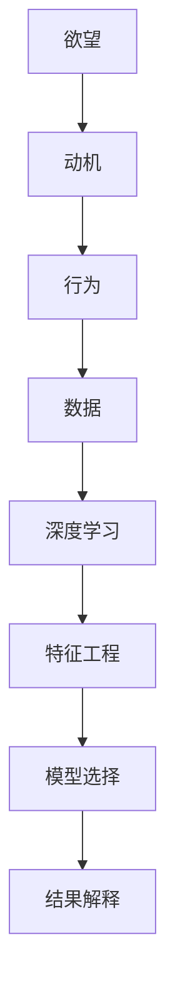

                 

# 欲望的量化：AI分析人类动机

## 1. 背景介绍

### 1.1 问题由来
人类欲望是一个复杂而深奥的主题，其背后驱动着个人行为和社会发展。在心理学、社会学、经济学等多个领域，研究者试图理解欲望的机制和规律，但始终难以触及其本质。人工智能（AI）技术的兴起为研究欲望提供了新的视角和方法，尤其是深度学习和数据科学的发展，使得量化分析成为可能。

本文旨在探讨如何使用AI技术，尤其是深度学习，来量化分析人类动机，揭示欲望的本质和规律，进而指导决策和行动。

### 1.2 问题核心关键点
量化分析欲望的核心关键点包括：
- **数据采集**：如何高效、准确地获取反映人类欲望的数据。
- **模型选择**：选择适合描述和预测欲望的深度学习模型。
- **特征工程**：从原始数据中提取和构造关键特征。
- **结果解释**：如何解释模型输出的结果，并将其应用于实际决策中。

这些关键点共同构成了欲望量化分析的技术框架，有助于构建更加精准、可靠的欲望分析模型。

### 1.3 问题研究意义
欲望的量化分析具有重要意义：
- **理解动机**：通过数据驱动的方法，揭示人类行为的深层次动机，为行为预测和干预提供科学依据。
- **优化决策**：在企业管理、政策制定等场景中，通过量化分析指导决策，提升效率和效果。
- **推动创新**：激发新理论和模型的开发，推动心理学、社会学、经济学等学科的创新。

本文将深入探讨这些关键点，并展示如何将AI技术应用于欲望量化分析中，以期为相关研究提供参考。

## 2. 核心概念与联系

### 2.1 核心概念概述

欲望量化分析涉及多个核心概念：

- **欲望（Desire）**：个人或群体追求某种目标的驱动力。
- **动机（Motivation）**：驱动行为的内在动力，受欲望影响。
- **行为（Behavior）**：个体或群体在特定情境下的具体行动。
- **数据（Data）**：反映欲望和动机的各种信息，包括行为数据、生理数据、环境数据等。
- **深度学习（Deep Learning）**：一种基于神经网络的学习方法，擅长处理大规模数据和高维特征。
- **特征工程（Feature Engineering）**：从原始数据中提取和构造关键特征，提高模型预测准确性。
- **模型选择（Model Selection）**：选择适合描述和预测欲望的深度学习模型。
- **结果解释（Interpretation）**：解释模型输出的结果，并将其应用于实际决策中。

这些概念之间的逻辑关系可以通过以下Mermaid流程图来展示：



这个流程图展示了欲望、动机、行为、数据、深度学习、特征工程、模型选择和结果解释之间的联系，以及它们如何共同构成欲望量化分析的技术框架。

## 3. 核心算法原理 & 具体操作步骤

### 3.1 算法原理概述

欲望的量化分析主要基于深度学习技术，通过构建和训练神经网络模型，对欲望进行预测和分析。其核心原理包括：

- **数据采集**：从各种来源获取反映欲望和动机的数据，如行为数据、生理数据、环境数据等。
- **特征工程**：从原始数据中提取和构造关键特征，如时间戳、行为频率、环境特征等。
- **模型选择**：选择合适的深度学习模型，如循环神经网络（RNN）、卷积神经网络（CNN）、长短时记忆网络（LSTM）等，对欲望进行建模和预测。
- **结果解释**：通过模型输出结果，分析个体或群体的欲望和动机，指导决策和行动。

### 3.2 算法步骤详解

欲望量化分析的主要步骤如下：

**Step 1: 数据采集**

- **行为数据**：收集个体的行为数据，如购买记录、搜索历史、点击行为等。
- **生理数据**：收集个体的生理数据，如心率、血压、体温等。
- **环境数据**：收集个体所处环境的数据，如天气、时间、地点等。

**Step 2: 特征工程**

- **数据预处理**：对原始数据进行清洗、归一化和标准化处理。
- **特征提取**：从行为、生理和环境数据中提取关键特征，如行为频率、时间分布、地点信息等。
- **特征构造**：构造新的特征，如行为序列、生理变化趋势、环境特征组合等。

**Step 3: 模型选择**

- **选择合适的模型**：根据任务特点选择合适的深度学习模型，如RNN、CNN、LSTM等。
- **设置模型参数**：确定模型的超参数，如学习率、批量大小、迭代轮数等。
- **模型训练**：使用训练集数据对模型进行训练，优化模型参数。

**Step 4: 结果解释**

- **模型评估**：使用验证集和测试集评估模型性能，如准确率、召回率、F1分数等。
- **结果解释**：解释模型输出结果，分析个体或群体的欲望和动机。
- **应用决策**：根据分析结果，指导实际决策和行动。

### 3.3 算法优缺点

欲望量化分析具有以下优点：

- **高维度数据处理**：深度学习擅长处理高维数据和复杂特征，能够捕捉数据中的非线性关系。
- **自适应能力**：深度学习模型具有较强的自适应能力，能够适应数据分布的变化。
- **广泛应用场景**：欲望量化分析适用于多个领域，如消费者行为预测、金融市场分析、智能推荐系统等。

同时，该方法也存在一些局限性：

- **数据依赖性**：模型性能高度依赖于数据质量，数据偏差可能导致模型偏差。
- **解释性不足**：深度学习模型的决策过程复杂，难以解释和调试。
- **计算资源需求高**：训练深度学习模型需要大量的计算资源和时间。
- **过度拟合风险**：模型可能过度拟合训练数据，导致泛化能力下降。

### 3.4 算法应用领域

欲望量化分析在多个领域具有广泛应用，如：

- **消费者行为预测**：预测消费者购买行为、产品偏好等，指导企业制定营销策略。
- **金融市场分析**：分析投资者的投资行为、情绪变化，预测市场趋势。
- **智能推荐系统**：根据用户行为和偏好，推荐个性化的产品和服务。
- **广告效果评估**：评估广告投放的效果，优化广告投放策略。
- **健康管理**：分析用户的健康行为，提供个性化的健康建议。

## 4. 数学模型和公式 & 详细讲解 & 举例说明

### 4.1 数学模型构建

欲望量化分析的数学模型可以建模为：

$$
\hat{D} = f(X; \theta)
$$

其中，$D$表示欲望，$X$表示数据集，$\theta$表示模型参数。模型的目标是最小化预测误差，即：

$$
\min_{\theta} \mathcal{L}(\hat{D}, D)
$$

其中，$\mathcal{L}$为损失函数，通常使用均方误差（MSE）或交叉熵（CE）等。

### 4.2 公式推导过程

以均方误差损失函数为例，其公式推导如下：

$$
\mathcal{L}(\hat{D}, D) = \frac{1}{N} \sum_{i=1}^N (D_i - \hat{D}_i)^2
$$

其中，$N$为样本数量，$D_i$和$\hat{D}_i$分别为第$i$个样本的真实欲望值和预测欲望值。

模型的前向传播过程为：

$$
\hat{D} = \mathcal{F}(X; \theta)
$$

其中，$\mathcal{F}$为模型前向传播函数，$\theta$为模型参数。

模型的反向传播过程为：

$$
\frac{\partial \mathcal{L}}{\partial \theta} = \frac{1}{N} \sum_{i=1}^N -2(D_i - \hat{D}_i) \frac{\partial \hat{D}_i}{\partial \theta}
$$

其中，$\frac{\partial \hat{D}_i}{\partial \theta}$为模型输出关于模型参数的偏导数。

### 4.3 案例分析与讲解

以消费者行为预测为例，我们可以使用RNN模型进行训练。具体步骤如下：

1. **数据采集**：收集消费者的购买记录、搜索历史、点击行为等。
2. **特征工程**：提取行为频率、时间分布、地点信息等特征。
3. **模型选择**：使用LSTM模型进行训练。
4. **结果解释**：分析预测结果，指导企业制定营销策略。

## 5. 项目实践：代码实例和详细解释说明

### 5.1 开发环境搭建

在项目实践前，我们需要准备好开发环境。以下是使用Python进行TensorFlow开发的环境配置流程：

1. 安装Anaconda：从官网下载并安装Anaconda，用于创建独立的Python环境。
2. 创建并激活虚拟环境：
```bash
conda create -n tensorflow-env python=3.8 
conda activate tensorflow-env
```
3. 安装TensorFlow：根据CUDA版本，从官网获取对应的安装命令。例如：
```bash
conda install tensorflow tensorflow-gpu==2.8 -c tf-nightly -c conda-forge
```
4. 安装各类工具包：
```bash
pip install numpy pandas scikit-learn matplotlib tqdm jupyter notebook ipython
```
完成上述步骤后，即可在`tensorflow-env`环境中开始项目实践。

### 5.2 源代码详细实现

以下是一个使用TensorFlow实现消费者行为预测的代码实现：

```python
import tensorflow as tf
import numpy as np
from tensorflow.keras.layers import LSTM, Dense
from tensorflow.keras.models import Sequential
from sklearn.model_selection import train_test_split

# 数据加载
def load_data():
    # 读取数据
    data = np.loadtxt('data.csv', delimiter=',')
    # 分割数据
    X = data[:, :-1]
    y = data[:, -1]
    # 分割训练集和测试集
    X_train, X_test, y_train, y_test = train_test_split(X, y, test_size=0.2)
    return X_train, X_test, y_train, y_test

# 模型构建
def build_model(input_shape):
    model = Sequential()
    model.add(LSTM(64, return_sequences=True, input_shape=input_shape))
    model.add(LSTM(32))
    model.add(Dense(1))
    model.compile(optimizer='adam', loss='mse')
    return model

# 模型训练
def train_model(model, X_train, y_train):
    model.fit(X_train, y_train, epochs=10, batch_size=32, validation_split=0.2)

# 结果评估
def evaluate_model(model, X_test, y_test):
    loss = model.evaluate(X_test, y_test)
    print(f'Test loss: {loss:.4f}')

# 测试数据
X_train, X_test, y_train, y_test = load_data()

# 构建模型
input_shape = (X_train.shape[1],)
model = build_model(input_shape)

# 训练模型
train_model(model, X_train, y_train)

# 评估模型
evaluate_model(model, X_test, y_test)
```

### 5.3 代码解读与分析

让我们再详细解读一下关键代码的实现细节：

**load_data函数**：
- 从数据文件中加载数据，并将其分割为特征集和标签集。
- 使用train_test_split将数据集分为训练集和测试集，保留20%作为验证集。

**build_model函数**：
- 定义模型结构，使用LSTM作为特征提取层，Dense层进行分类。
- 设置优化器和损失函数，编译模型。

**train_model函数**：
- 使用训练集数据训练模型，设定迭代轮数和批次大小。
- 在验证集上评估模型性能，防止过拟合。

**evaluate_model函数**：
- 使用测试集数据评估模型性能，输出损失值。

**测试数据**：
- 从数据文件中加载数据，构建模型，并训练和评估模型。

可以看到，TensorFlow提供了丰富的API，使得模型构建和训练变得简洁高效。开发者可以更多地关注模型设计、特征工程和结果解释等高层逻辑。

当然，工业级的系统实现还需考虑更多因素，如模型的保存和部署、超参数的自动搜索、更灵活的任务适配层等。但核心的欲望量化分析流程基本与此类似。

## 6. 实际应用场景

### 6.1 智能推荐系统

基于欲望量化分析的智能推荐系统，可以实时分析用户的行为和偏好，推荐个性化的产品和服务。

在技术实现上，可以收集用户的历史浏览、购买、评价等行为数据，提取和构造关键特征，如行为频率、时间分布、兴趣标签等。在训练过程中，使用LSTM等深度学习模型对这些特征进行建模和预测，最终输出推荐结果。该系统能够根据用户的行为变化，动态调整推荐策略，提高推荐效果和用户满意度。

### 6.2 金融市场分析

欲望量化分析在金融市场分析中也有广泛应用。通过分析投资者的行为数据，如交易记录、情绪分析等，可以预测市场趋势，指导投资决策。

具体而言，可以收集投资者的交易记录、社交媒体情绪分析、新闻事件等信息，提取和构造关键特征，如交易频率、情绪波动、事件影响力等。在训练过程中，使用RNN等深度学习模型对这些特征进行建模和预测，最终输出市场趋势预测结果。该系统能够实时监测市场动态，及时调整投资策略，降低风险。

### 6.3 健康管理

欲望量化分析在健康管理中也有重要应用。通过分析个体的健康行为，如饮食、运动、睡眠等，可以提供个性化的健康建议，改善生活质量。

在技术实现上，可以收集个体的健康数据，如饮食记录、运动轨迹、睡眠质量等，提取和构造关键特征，如饮食结构、运动强度、睡眠质量等。在训练过程中，使用LSTM等深度学习模型对这些特征进行建模和预测，最终输出健康建议。该系统能够根据个体的健康数据，提供个性化的健康建议，改善生活质量。

### 6.4 未来应用展望

随着欲望量化分析技术的不断发展，未来的应用场景将更加广泛，如：

- **智慧城市治理**：通过分析市民的行为数据，优化城市管理和公共服务。
- **智能家居系统**：通过分析用户的行为数据，提供个性化的家居服务。
- **社会舆情分析**：通过分析公众的情感和行为数据，预测社会舆情变化。

## 7. 工具和资源推荐

### 7.1 学习资源推荐

为了帮助开发者系统掌握欲望量化分析的理论基础和实践技巧，这里推荐一些优质的学习资源：

1. 《深度学习》系列书籍：由Ian Goodfellow等人撰写，全面介绍深度学习的基本概念和算法。
2. TensorFlow官方文档：TensorFlow的官方文档，提供详细的API介绍和代码示例。
3. Kaggle平台：Kaggle上有大量的数据分析和机器学习竞赛，可以学习实际应用案例。
4. Coursera课程：Coursera提供的数据科学和机器学习课程，涵盖多个领域的实际应用。
5. 《Python深度学习》书籍：Francois Chollet等人撰写，全面介绍TensorFlow和Keras的使用方法。

通过对这些资源的学习实践，相信你一定能够快速掌握欲望量化分析的精髓，并用于解决实际的欲望分析问题。

### 7.2 开发工具推荐

高效的开发离不开优秀的工具支持。以下是几款用于欲望量化分析开发的常用工具：

1. Python：Python是一种高层次、易于学习的编程语言，适用于数据分析和机器学习任务。
2. TensorFlow：由Google主导开发的开源深度学习框架，生产部署方便，适合大规模工程应用。
3. PyTorch：由Facebook主导开发的开源深度学习框架，灵活动态，适用于研究型任务。
4. Weights & Biases：模型训练的实验跟踪工具，可以记录和可视化模型训练过程中的各项指标，方便对比和调优。
5. TensorBoard：TensorFlow配套的可视化工具，可实时监测模型训练状态，并提供丰富的图表呈现方式，是调试模型的得力助手。
6. Jupyter Notebook：Jupyter Notebook是一种交互式编程环境，支持Python和TensorFlow的交互式开发。

合理利用这些工具，可以显著提升欲望量化分析的开发效率，加快创新迭代的步伐。

### 7.3 相关论文推荐

欲望量化分析的发展源于学界的持续研究。以下是几篇奠基性的相关论文，推荐阅读：

1. "A Few Useful Things to Know About Deep Learning" by Ian Goodfellow：深度学习入门指南，涵盖基本概念和算法。
2. "Long Short-Term Memory" by Hochreiter和Schmidhuber：LSTM模型的提出，为时间序列分析提供重要工具。
3. "The Elements of Statistical Learning" by Hastie等人：机器学习基础书籍，涵盖经典算法和理论。
4. "Feature Engineering for Deep Learning" by Provost：特征工程在深度学习中的应用。
5. "Interpretable Machine Learning" by Molnar：可解释性机器学习书籍，提供模型解释和调试方法。

这些论文代表了大欲望量化分析的发展脉络。通过学习这些前沿成果，可以帮助研究者把握学科前进方向，激发更多的创新灵感。

## 8. 总结：未来发展趋势与挑战

### 8.1 总结

本文对欲望量化分析的深度学习技术进行了全面系统的介绍。首先阐述了欲望量化分析的研究背景和意义，明确了欲望量化分析的框架和技术细节。其次，从原理到实践，详细讲解了深度学习在欲望量化分析中的关键步骤，给出了欲望量化分析的完整代码实例。同时，本文还广泛探讨了欲望量化分析在多个行业领域的应用前景，展示了欲望量化分析的巨大潜力。

通过本文的系统梳理，可以看到，欲望量化分析正成为人工智能技术的重要应用方向，极大地拓展了数据分析和机器学习的应用边界，推动了多个领域的创新。未来，伴随深度学习技术的持续演进，欲望量化分析将不断深化和扩展，为人工智能技术带来更多新的突破。

### 8.2 未来发展趋势

欲望量化分析的未来发展趋势包括：

1. **多模态融合**：结合视觉、听觉、触觉等多种模态数据，提供更加全面和精准的欲望分析。
2. **因果推理**：引入因果推断方法，分析因果关系，提供更加可靠的欲望预测。
3. **联邦学习**：通过分布式训练，保护隐私和数据安全，提升模型泛化能力。
4. **动态调整**：引入在线学习和增量学习，动态调整模型参数，适应数据分布的变化。
5. **可解释性**：引入可解释性技术，提高模型的透明性，帮助用户理解模型决策过程。
6. **模型压缩**：使用模型压缩技术，减少计算资源消耗，提高推理效率。

这些趋势凸显了欲望量化分析技术的广阔前景。这些方向的探索发展，必将进一步提升欲望量化分析的性能和应用范围，为人类认知智能的进化带来深远影响。

### 8.3 面临的挑战

尽管欲望量化分析技术已经取得了瞩目成就，但在迈向更加智能化、普适化应用的过程中，它仍面临着诸多挑战：

1. **数据依赖性**：模型性能高度依赖于数据质量，数据偏差可能导致模型偏差。
2. **解释性不足**：深度学习模型的决策过程复杂，难以解释和调试。
3. **计算资源需求高**：训练深度学习模型需要大量的计算资源和时间。
4. **过度拟合风险**：模型可能过度拟合训练数据，导致泛化能力下降。
5. **隐私和伦理**：欲望量化分析涉及敏感信息，如何保护用户隐私和伦理安全是一个重要问题。

### 8.4 研究展望

面对欲望量化分析所面临的种种挑战，未来的研究需要在以下几个方面寻求新的突破：

1. **数据增强**：引入数据增强技术，扩充数据集，提高模型的泛化能力。
2. **模型优化**：开发更加高效和轻量化的模型，提升推理速度和计算效率。
3. **因果分析**：引入因果分析方法，提升模型的解释性和透明性。
4. **联邦学习**：结合联邦学习技术，保护隐私和数据安全。
5. **隐私保护**：引入差分隐私和联邦学习技术，保护用户隐私。
6. **伦理审查**：建立模型审查机制，确保模型符合伦理和道德规范。

这些研究方向的探索，必将引领欲望量化分析技术迈向更高的台阶，为构建更加智能和安全的欲望量化分析系统铺平道路。面向未来，欲望量化分析技术还需要与其他人工智能技术进行更深入的融合，如知识表示、因果推理、强化学习等，多路径协同发力，共同推动欲望量化分析技术的进步。只有勇于创新、敢于突破，才能不断拓展欲望量化分析技术的边界，让人工智能技术更好地服务于人类社会。

## 9. 附录：常见问题与解答

**Q1: 欲望量化分析的主要步骤是什么？**

A: 欲望量化分析的主要步骤包括：数据采集、特征工程、模型选择、模型训练和结果解释。

**Q2: 如何使用深度学习进行欲望量化分析？**

A: 使用深度学习进行欲望量化分析，主要通过构建和训练神经网络模型，对欲望进行预测和分析。关键步骤包括数据采集、特征工程、模型选择和结果解释。

**Q3: 如何避免欲望量化分析中的过拟合问题？**

A: 避免欲望量化分析中的过拟合问题，主要通过数据增强、正则化、模型选择和结果解释等技术手段，如L2正则化、Dropout、Early Stopping等，防止模型过度适应训练数据。

**Q4: 如何解释欲望量化分析模型的输出结果？**

A: 解释欲望量化分析模型的输出结果，主要通过可视化、特征分析、因果推理等方法，帮助理解模型的决策过程和预测结果。

**Q5: 欲望量化分析在实际应用中需要注意哪些问题？**

A: 欲望量化分析在实际应用中需要注意数据依赖性、解释性不足、计算资源需求高、过度拟合风险和隐私保护等问题。

---

作者：禅与计算机程序设计艺术 / Zen and the Art of Computer Programming

