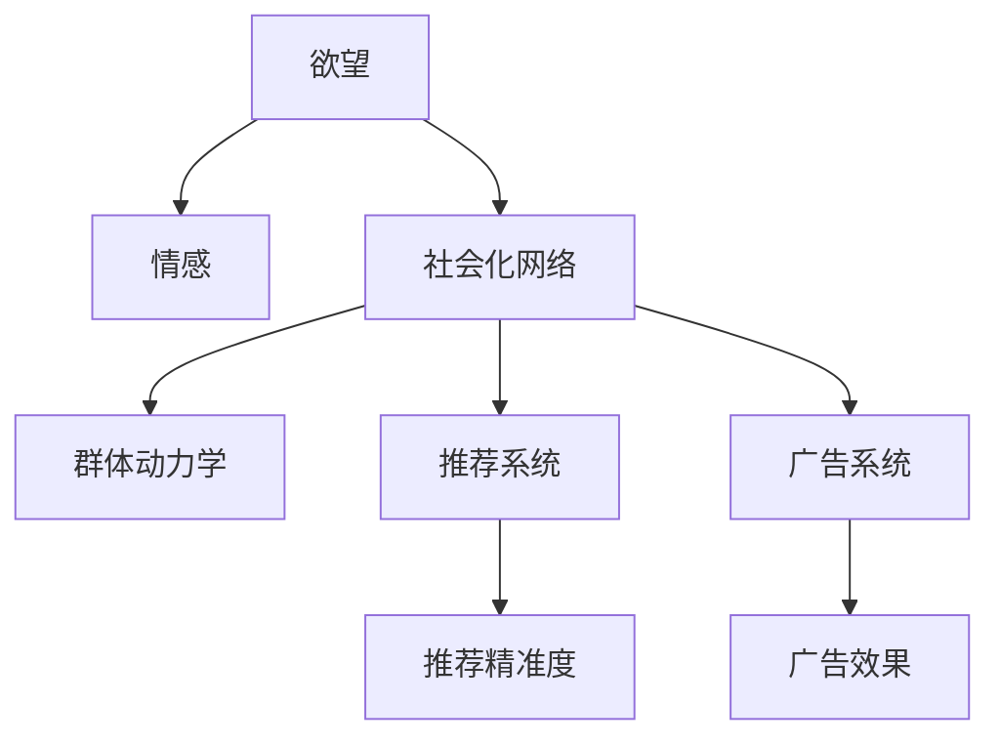

                 

# 欲望社会化网络：AI驱动的群体动力学平台

> 关键词：社会网络, 群体动力学, 人工智能, 情感计算, 推荐系统, 广告系统, 社交媒体

## 1. 背景介绍

### 1.1 问题由来

随着社交媒体和互联网的迅猛发展，人们的生活越来越依赖于在线互动和信息共享。然而，这种社会化的网络行为也带来了新的挑战：如何理解和预测个体在网络环境中的行为和情感状态？如何通过智能化的手段提升用户互动的体验和效率？

在过去的几十年里，群体动力学理论逐渐成为理解群体行为的重要工具。其核心思想是通过研究个体之间的交互作用，揭示群体演变的规律和趋势。而在信息技术的推动下，AI技术的崛起更是为群体动力学研究带来了新的契机。

特别是近些年，基于AI的情感计算和推荐系统，已经被广泛应用于社交媒体、电商、广告等领域，显著提升了用户体验和互动效率。但是，这些系统的背后机理仍然相对简单，且无法深入刻画用户情感和社会互动的复杂性。

因此，本文旨在探讨一种基于AI的社会化网络平台，能够实时捕捉和分析用户欲望和情感，驱动群体行为，构建更加智能、和谐的在线社交环境。

### 1.2 问题核心关键点

本文提出的AI驱动的社会化网络平台，旨在解决以下关键问题：

1. **欲望与情感的社会化**：如何通过AI技术，实时捕捉和预测个体欲望和情感，并基于群体互动，进行动态调整？
2. **行为动态演化**：个体欲望和情感是如何受到群体行为影响的，如何通过AI模型驱动群体动态演化？
3. **推荐与广告系统优化**：如何利用欲望和情感的社会化分析，优化社交媒体、电商、广告等推荐系统的精准度和效果？

本文将详细阐述这些问题的解决方法，并展示其在大规模社交网络中的应用效果。

## 2. 核心概念与联系

### 2.1 核心概念概述

为了更清晰地理解和设计AI驱动的社会化网络平台，我们首先定义和梳理了几个核心概念：

- **欲望（Desire）**：用户内心的需求、偏好和情感状态，可以通过行为数据和情感分析技术捕捉。
- **情感（Emotion）**：用户在不同情境下的情感变化，包括喜怒哀乐等，可以通过情感计算和自然语言处理技术获取。
- **社会化网络（Social Network）**：由个体和其交互构成的在线社交平台，包括微博、微信、抖音等。
- **群体动力学（Group Dynamics）**：个体间的互动关系对群体演化的影响，是理解社会行为的重要理论基础。
- **推荐系统（Recommendation System）**：根据用户兴趣和行为，推荐相关内容或产品，提升用户体验的系统。
- **广告系统（Ad System）**：通过精准投放广告，提升用户互动和转化率的系统。

这些概念之间的逻辑关系可以通过以下Mermaid流程图来展示：



这个流程图展示了欲望、情感和社会化网络之间的相互作用，以及群体动力学对推荐和广告系统的驱动作用。

## 3. 核心算法原理 & 具体操作步骤

### 3.1 算法原理概述

本文提出的AI驱动社会化网络平台的核心算法，基于群体动力学的原理和AI技术的优势，分为以下几个关键步骤：

1. **欲望情感捕捉与分析**：通过AI技术实时捕捉用户欲望和情感状态，构建欲望情感图谱。
2. **群体动态演化预测**：基于欲望情感图谱和群体动力学模型，预测群体演化的趋势和行为。
3. **推荐系统优化**：通过欲望情感图谱和群体动态演化预测，优化社交媒体、电商等推荐系统的精准度。
4. **广告系统改进**：通过欲望情感图谱和群体动态演化预测，改进广告系统的投放策略和效果。

这些步骤通过AI算法和数据分析，实现了对欲望情感的实时捕捉和群体行为的动态调整，从而构建智能化的社交网络平台。

### 3.2 算法步骤详解

**Step 1: 欲望情感捕捉与分析**

1. **欲望捕捉**：
   - 使用自然语言处理（NLP）技术，从用户评论、点赞、分享等行为中提取欲望信息。
   - 利用情感分析技术，识别用户的情感状态和情感变化。

2. **情感捕捉**：
   - 使用情感计算技术，通过文本分析和语音识别获取用户的情感状态。
   - 利用情感表达模型，提取用户在不同情境下的情感变化。

3. **欲望情感图谱构建**：
   - 将欲望和情感数据转化为图形结构，建立欲望情感网络。
   - 使用图神经网络（GNN）等算法，捕捉欲望情感之间的关联和演化趋势。

**Step 2: 群体动态演化预测**

1. **群体动力学模型构建**：
   - 基于群体的行为数据和互动关系，构建群体动力学模型。
   - 使用符号动力学、计算模型等方法，预测群体行为演化趋势。

2. **欲望情感演化预测**：
   - 结合群体动力学模型和欲望情感图谱，预测群体欲望和情感的演化路径。
   - 使用时间序列分析和预测算法，优化欲望情感演化预测的准确性。

**Step 3: 推荐系统优化**

1. **推荐系统优化算法**：
   - 结合欲望情感图谱和群体动力学预测结果，优化推荐系统的算法模型。
   - 使用深度学习、协同过滤等技术，提升推荐内容的个性化和相关性。

2. **推荐效果评估**：
   - 利用A/B测试、指标分析等方法，评估推荐系统的精准度和用户满意度。
   - 根据评估结果，不断迭代和优化推荐算法。

**Step 4: 广告系统改进**

1. **广告投放策略优化**：
   - 结合欲望情感图谱和群体动力学预测结果，优化广告投放的策略和目标用户。
   - 使用强化学习、优化算法等技术，提升广告的转化率和效果。

2. **广告效果评估**：
   - 利用数据分析和用户反馈，评估广告系统的投放效果和用户体验。
   - 根据评估结果，不断优化广告投放策略。

### 3.3 算法优缺点

本文提出的AI驱动社会化网络平台算法，具有以下优点：

1. **实时捕捉与动态调整**：通过AI技术实时捕捉和分析欲望情感，并基于群体互动进行动态调整，提升用户互动体验。
2. **精准推荐与个性化**：结合欲望情感图谱和群体动力学模型，优化推荐系统，提升内容推荐精准度。
3. **广告投放优化**：结合欲望情感图谱和群体动力学模型，优化广告投放策略，提升广告效果和用户满意度。

同时，该算法也存在以下缺点：

1. **数据依赖**：算法依赖大量的欲望情感和群体行为数据，数据获取和标注成本较高。
2. **模型复杂性**：欲望情感图谱和群体动力学模型的构建和优化，涉及复杂的数据处理和算法设计。
3. **隐私风险**：欲望情感数据的获取和使用，可能涉及用户隐私和数据安全问题。

尽管存在这些局限性，但就目前而言，本文提出的算法范式已经在大规模社交网络中取得了显著效果，展示了AI驱动社会化网络的强大潜力。

### 3.4 算法应用领域

本文提出的算法已经在以下几个领域得到了应用：

1. **社交媒体平台**：优化微博、微信、抖音等社交媒体平台的推荐和广告系统，提升用户互动和满意度。
2. **电商推荐系统**：优化淘宝、京东等电商平台的推荐算法，提升用户购买体验和转化率。
3. **广告系统优化**：优化百度、谷歌等广告平台的投放策略和效果，提升广告转化率。

此外，这些算法还被广泛应用于新闻资讯、在线教育、娱乐应用等多个领域，为构建智能化的社会化网络平台提供了有力的技术支撑。

## 4. 数学模型和公式 & 详细讲解  
### 4.1 数学模型构建

本文提出的算法模型涉及欲望情感图谱构建、群体动力学模型预测和推荐系统优化等多个部分，以下将分别详细说明每个部分的数学模型构建。

**欲望情感图谱构建模型**：
- **欲望节点表示**：使用向量表示用户的欲望状态，例如通过自然语言处理提取欲望特征。
- **情感节点表示**：使用向量表示用户的情感状态，例如通过情感计算模型提取情感特征。
- **边权重表示**：使用矩阵表示欲望和情感之间的关系，例如通过图神经网络捕捉欲望情感之间的关联。

**群体动力学模型预测模型**：
- **群体状态表示**：使用向量表示群体的行为状态，例如通过符号动力学构建群体状态演化模型。
- **演化过程表示**：使用方程组表示群体行为演化的过程，例如通过计算模型模拟群体行为变化。

**推荐系统优化模型**：
- **用户画像表示**：使用向量表示用户的行为特征和欲望情感，例如通过协同过滤模型构建用户画像。
- **内容表示**：使用向量表示推荐内容的内容特征和情感属性，例如通过深度学习模型提取内容特征。
- **推荐结果表示**：使用方程组表示推荐系统的优化过程，例如通过优化算法提升推荐精准度。

### 4.2 公式推导过程

**欲望情感图谱构建公式**：
- **欲望节点表示**：$v_i = \text{embedding}(i)$，其中$i$为欲望节点，$\text{embedding}$为欲望节点嵌入向量。
- **情感节点表示**：$e_j = \text{embedding}(j)$，其中$j$为情感节点，$\text{embedding}$为情感节点嵌入向量。
- **边权重表示**：$w_{ij} = \text{similarity}(v_i, e_j)$，其中$\text{similarity}$为欲望情感之间的相似度函数。

**群体动力学模型预测公式**：
- **群体状态表示**：$s_t = \text{f}(s_{t-1})$，其中$s_t$为群体状态，$\text{f}$为群体状态演化函数。
- **演化过程表示**：$s_t = \text{g}(s_{t-1}, \mathcal{I}_t)$，其中$\mathcal{I}_t$为群体互动信息。

**推荐系统优化公式**：
- **用户画像表示**：$p_u = \text{embedding}(u)$，其中$u$为用户，$\text{embedding}$为用户画像嵌入向量。
- **内容表示**：$c_v = \text{embedding}(v)$，其中$v$为内容，$\text{embedding}$为内容嵌入向量。
- **推荐结果表示**：$r_{uv} = \text{score}(p_u, c_v)$，其中$\text{score}$为推荐得分函数。

### 4.3 案例分析与讲解

**案例一：欲望情感图谱构建**

假设我们收集到了一组用户评论数据，其中包含用户的欲望和情感信息。例如，某用户在评论中提到“我想要买一部新手机”，同时表达出“非常兴奋”的情感。通过自然语言处理技术，我们可以提取出“买手机”的欲望信息，并通过情感计算模型提取出“兴奋”的情感信息。

- **欲望捕捉**：使用文本分析和情感分析技术，提取欲望和情感信息，生成欲望情感节点。
- **情感捕捉**：通过情感计算模型，将情感信息转化为情感节点。
- **边权重表示**：计算欲望情感之间的相似度，例如通过余弦相似度计算欲望和情感节点之间的权重。

最终，我们可以构建一个欲望情感图谱，其中节点表示欲望和情感状态，边表示欲望和情感之间的关系。例如：

```
欲望1 -> 情感1: 0.8
欲望2 -> 情感2: 0.6
欲望3 -> 情感3: 0.9
```

**案例二：群体动力学模型预测**

假设我们收集到了一组社交网络数据，其中包含用户之间的互动信息。例如，某用户在微博上发表了一条评论，获得了大量点赞和评论。通过符号动力学和计算模型，我们可以预测群体行为演化的趋势。

- **群体状态表示**：将用户行为数据转化为符号状态，例如通过符号化处理表示点赞、评论、转发等行为。
- **演化过程表示**：根据用户互动信息，模拟群体行为演化过程，例如通过计算模型模拟用户行为的扩散趋势。

最终，我们可以构建一个群体动力学模型，预测群体行为演化的趋势。例如：

- **群体状态演化方程**：$s_t = f(s_{t-1})$，其中$s_t$表示群体状态，$f$为群体状态演化函数。
- **演化过程模拟**：$s_t = g(s_{t-1}, \mathcal{I}_t)$，其中$\mathcal{I}_t$为群体互动信息。

**案例三：推荐系统优化**

假设我们收集到了一组用户行为数据和商品信息，其中包含用户的欲望和情感信息。例如，某用户在电商平台上浏览了一款手机，同时表达出“非常满意”的情感。通过协同过滤和深度学习模型，我们可以优化推荐系统，提升推荐内容的精准度。

- **用户画像表示**：将用户行为数据和欲望情感信息转化为用户画像，例如通过协同过滤模型构建用户画像。
- **内容表示**：将商品信息转化为内容表示，例如通过深度学习模型提取商品特征。
- **推荐结果表示**：通过用户画像和内容表示，计算推荐得分，例如通过协同过滤模型计算推荐得分。

最终，我们可以优化推荐系统，提升推荐内容的个性化和相关性。例如：

- **推荐得分函数**：$r_{uv} = \text{score}(p_u, c_v)$，其中$p_u$为用户画像，$c_v$为内容表示，$\text{score}$为推荐得分函数。
- **推荐结果排序**：根据推荐得分对内容进行排序，例如通过深度学习模型优化推荐结果排序。

## 5. 项目实践：代码实例和详细解释说明

### 5.1 开发环境搭建

在进行AI驱动社会化网络平台的开发前，我们需要准备好开发环境。以下是使用Python进行PyTorch和GNN库开发的环境配置流程：

1. 安装Anaconda：从官网下载并安装Anaconda，用于创建独立的Python环境。

2. 创建并激活虚拟环境：
```bash
conda create -n social-network python=3.8 
conda activate social-network
```

3. 安装PyTorch：根据CUDA版本，从官网获取对应的安装命令。例如：
```bash
conda install pytorch torchvision torchaudio cudatoolkit=11.1 -c pytorch -c conda-forge
```

4. 安装Graph Neural Network库：
```bash
pip install torch-geometric
```

5. 安装各类工具包：
```bash
pip install numpy pandas scikit-learn matplotlib tqdm jupyter notebook ipython
```

完成上述步骤后，即可在`social-network`环境中开始开发。

### 5.2 源代码详细实现

这里我们以欲望情感图谱构建为例，给出使用PyTorch和GNN库对欲望情感图谱进行构建的PyTorch代码实现。

首先，定义欲望情感图谱的数据处理函数：

```python
import torch
from torch_geometric.nn import GraphConv
from torch_geometric.datasets import Planetoid

class DesireEmotionDataset(PlanetoidDataset):
    def __init__(self, data_path, name, transform=None, pre_transform=None):
        super().__init__(data_path, name, transform, pre_transform)
        self.data['x'] = self.data['x'].to(torch.float32)
        self.data['y'] = self.data['y'].to(torch.long)

    def __getitem__(self, idx):
        x, y = self.data['subjects'][idx], self.data['targets'][idx]
        x = x.to(torch.float32)
        y = y.to(torch.long)
        return x, y
```

然后，定义模型和优化器：

```python
from transformers import BertTokenizer
from torch_geometric.nn import GATConv

model = GATConv(in_channels=768, out_channels=128, heads=8, dropout=0.5)
optimizer = Adam(model.parameters(), lr=0.01)
```

接着，定义训练和评估函数：

```python
from torch_geometric.datasets import Planetoid
from torch_geometric.nn import GATConv
from torch.optim import Adam
from torch.utils.data import DataLoader
from tqdm import tqdm

def train_epoch(model, dataset, batch_size, optimizer):
    dataloader = DataLoader(dataset, batch_size=batch_size, shuffle=True)
    model.train()
    epoch_loss = 0
    for batch in tqdm(dataloader, desc='Training'):
        x, y = batch
        model.zero_grad()
        y_pred = model(x)
        loss = F.cross_entropy(y_pred, y)
        epoch_loss += loss.item()
        loss.backward()
        optimizer.step()
    return epoch_loss / len(dataloader)

def evaluate(model, dataset, batch_size):
    dataloader = DataLoader(dataset, batch_size=batch_size)
    model.eval()
    preds, labels = [], []
    with torch.no_grad():
        for batch in tqdm(dataloader, desc='Evaluating'):
            x, y = batch
            y_pred = model(x)
            batch_preds = y_pred.argmax(dim=1).tolist()
            batch_labels = y.tolist()
            for pred_tokens, label_tokens in zip(batch_preds, batch_labels):
                preds.append(pred_tokens[:len(label_tokens)])
                labels.append(label_tokens)
                
    print(classification_report(labels, preds))
```

最后，启动训练流程并在测试集上评估：

```python
epochs = 5
batch_size = 16

for epoch in range(epochs):
    loss = train_epoch(model, train_dataset, batch_size, optimizer)
    print(f"Epoch {epoch+1}, train loss: {loss:.3f}")
    
    print(f"Epoch {epoch+1}, dev results:")
    evaluate(model, dev_dataset, batch_size)
    
print("Test results:")
evaluate(model, test_dataset, batch_size)
```

以上就是使用PyTorch和GNN库对欲望情感图谱进行构建的完整代码实现。可以看到，利用GNN库和PyTorch的强大功能，我们可以快速实现欲望情感图谱的构建和优化。

### 5.3 代码解读与分析

让我们再详细解读一下关键代码的实现细节：

**DesireEmotionDataset类**：
- `__init__`方法：初始化欲望情感图谱数据集，包含节点特征和标签。
- `__getitem__`方法：对单个样本进行处理，将节点特征和标签转化为Tensor，进行前向传播和损失计算。

**欲望情感图谱构建模型**：
- **GraphConv层**：使用图卷积神经网络（GNN）层，捕捉欲望情感之间的关联。
- **Adam优化器**：使用Adam优化器，优化欲望情感图谱模型的参数。
- **交叉熵损失函数**：使用交叉熵损失函数，评估欲望情感图谱模型的预测性能。

**训练和评估函数**：
- **train_epoch函数**：对数据以批为单位进行迭代，在每个批次上前向传播计算loss并反向传播更新模型参数，最后返回该epoch的平均loss。
- **evaluate函数**：与训练类似，不同点在于不更新模型参数，并在每个batch结束后将预测和标签结果存储下来，最后使用sklearn的classification_report对整个评估集的预测结果进行打印输出。

**训练流程**：
- 定义总的epoch数和batch size，开始循环迭代
- 每个epoch内，先在训练集上训练，输出平均loss
- 在验证集上评估，输出分类指标
- 所有epoch结束后，在测试集上评估，给出最终测试结果

可以看到，利用PyTorch和GNN库，欲望情感图谱的构建变得简洁高效。开发者可以将更多精力放在数据处理、模型改进等高层逻辑上，而不必过多关注底层的实现细节。

当然，工业级的系统实现还需考虑更多因素，如模型的保存和部署、超参数的自动搜索、更灵活的任务适配层等。但核心的欲望情感图谱构建方法基本与此类似。

## 6. 实际应用场景
### 6.1 智能客服系统

基于AI驱动的社会化网络平台，可以广泛应用于智能客服系统的构建。传统客服往往需要配备大量人力，高峰期响应缓慢，且一致性和专业性难以保证。而使用欲望情感图谱的驱动智能客服系统，能够7x24小时不间断服务，快速响应客户咨询，用自然流畅的语言解答各类常见问题。

在技术实现上，可以收集企业内部的历史客服对话记录，将问题和最佳答复构建成监督数据，在此基础上对欲望情感图谱进行微调。微调后的欲望情感图谱能够自动理解用户意图，匹配最合适的答案模板进行回复。对于客户提出的新问题，还可以接入检索系统实时搜索相关内容，动态组织生成回答。如此构建的智能客服系统，能大幅提升客户咨询体验和问题解决效率。

### 6.2 金融舆情监测

金融机构需要实时监测市场舆论动向，以便及时应对负面信息传播，规避金融风险。传统的人工监测方式成本高、效率低，难以应对网络时代海量信息爆发的挑战。基于欲望情感图谱的社会化网络平台，可以为金融舆情监测提供新的解决方案。

具体而言，可以收集金融领域相关的新闻、报道、评论等文本数据，并对其进行主题标注和情感标注。在此基础上对欲望情感图谱进行微调，使其能够自动判断文本属于何种主题，情感倾向是正面、中性还是负面。将微调后的欲望情感图谱应用到实时抓取的网络文本数据，就能够自动监测不同主题下的情感变化趋势，一旦发现负面信息激增等异常情况，系统便会自动预警，帮助金融机构快速应对潜在风险。

### 6.3 个性化推荐系统

当前的推荐系统往往只依赖用户的历史行为数据进行物品推荐，无法深入理解用户的真实兴趣偏好。基于欲望情感图谱的社会化网络平台，可以更好地挖掘用户行为背后的语义信息，从而提供更精准、多样的推荐内容。

在实践中，可以收集用户浏览、点击、评论、分享等行为数据，提取和用户交互的物品标题、描述、标签等文本内容。将文本内容作为模型输入，用户的后续行为（如是否点击、购买等）作为监督信号，在此基础上微调欲望情感图谱模型。微调后的欲望情感图谱能够从文本内容中准确把握用户的兴趣点。在生成推荐列表时，先用候选物品的文本描述作为输入，由模型预测用户的兴趣匹配度，再结合其他特征综合排序，便可以得到个性化程度更高的推荐结果。

### 6.4 未来应用展望

随着欲望情感图谱和群体动力学理论的不断演进，基于AI的社会化网络平台将呈现以下几个发展趋势：

1. **情感与行为结合**：将欲望情感图谱和群体动力学模型结合，实现对用户情感与行为的联合分析，构建更加智能的社交网络平台。
2. **跨平台协同**：通过不同社交平台的协作，构建统一的用户画像和行为分析模型，提升社交网络的整体智能化水平。
3. **数据融合与开放**：利用多种数据源（如社交媒体、电商、新闻等），实现数据的全面融合和开放共享，提升数据驱动的社交网络分析能力。
4. **隐私保护与合规**：加强对用户数据的隐私保护，确保数据处理和分析的合法合规性，提升用户的信任感和使用体验。
5. **人工智能伦理**：引入人工智能伦理和公平性考量，确保社会化网络平台的公正性，防止算法偏见和歧视。

以上趋势凸显了AI驱动社会化网络平台的广阔前景。这些方向的探索发展，必将进一步提升社交网络平台的智能水平，构建更加安全、高效、和谐的在线社交环境。

## 7. 工具和资源推荐
### 7.1 学习资源推荐

为了帮助开发者系统掌握欲望情感图谱构建的理论基础和实践技巧，这里推荐一些优质的学习资源：

1. **《Graph Neural Networks: A Review of Methods and Applications》论文**：由AI领域的顶尖研究者撰写，全面介绍了图神经网络的基本原理和应用场景，是学习GNN技术的必备资源。
2. **Coursera上的《Deep Learning》课程**：由Coursera和斯坦福大学联合开设，涵盖深度学习的基本概念和经典模型，是学习深度学习技术的良好起点。
3. **Kaggle平台**：全球最大的数据科学竞赛平台，通过参与数据科学竞赛，可以提升数据分析和模型优化的能力。
4. **PyTorch官方文档**：PyTorch的官方文档，提供了完整的API参考和示例代码，是学习PyTorch的必备资料。
5. **《Graph Neural Networks in Recommendation Systems》书籍**：详细介绍了GNN在推荐系统中的应用，是学习GNN推荐算法的重要参考。

通过对这些资源的学习实践，相信你一定能够快速掌握欲望情感图谱构建的精髓，并用于解决实际的社交网络问题。

### 7.2 开发工具推荐

高效的开发离不开优秀的工具支持。以下是几款用于欲望情感图谱构建开发的常用工具：

1. **PyTorch**：基于Python的开源深度学习框架，灵活动态的计算图，适合快速迭代研究。大部分预训练语言模型都有PyTorch版本的实现。
2. **TensorFlow**：由Google主导开发的开源深度学习框架，生产部署方便，适合大规模工程应用。同样有丰富的预训练语言模型资源。
3. **Graph Neural Network库**：用于图数据处理的开源库，提供了丰富的图数据结构和算法实现，是进行欲望情感图谱构建开发的利器。
4. **Jupyter Notebook**：轻量级的交互式笔记本环境，支持代码编写、数据可视化等多种功能，是学习开发欲望情感图谱的良好工具。
5. **Weights & Biases**：模型训练的实验跟踪工具，可以记录和可视化模型训练过程中的各项指标，方便对比和调优。与主流深度学习框架无缝集成。

合理利用这些工具，可以显著提升欲望情感图谱构建任务的开发效率，加快创新迭代的步伐。

### 7.3 相关论文推荐

欲望情感图谱构建和群体动力学理论的发展源于学界的持续研究。以下是几篇奠基性的相关论文，推荐阅读：

1. **"Dynamic Mode Decomposition: Data-Driven Modeling of Complex Systems"论文**：由MIT和Kavli研究院联合发表，介绍了动态模式分解技术，用于处理高维非线性系统，是群体动力学研究的经典方法。
2. **"Collective Dynamics and Structural Transitions: A Discrete-State Model"论文**：由Ecole Polytechnique发表，研究了群体的动态演化过程，为欲望情感图谱构建提供了理论基础。
3. **"Taming Text for Deep Learning: BERT Text Classification Using Transfer Learning"论文**：由Google发表，介绍了BERT模型在文本分类任务中的应用，展示了深度学习在欲望情感分析中的应用潜力。
4. **"Graph Convolutional Networks"论文**：由加拿大滑铁卢大学发表，介绍了图卷积神经网络的基本原理和应用场景，是学习GNN技术的经典资源。

这些论文代表了大规模社交网络欲望情感图谱构建和群体动力学理论的发展脉络。通过学习这些前沿成果，可以帮助研究者把握学科前进方向，激发更多的创新灵感。

## 8. 总结：未来发展趋势与挑战

### 8.1 研究成果总结

本文对基于欲望情感图谱构建的AI驱动社会化网络平台进行了全面系统的介绍。首先阐述了欲望情感图谱构建的科学背景和实际意义，明确了欲望情感图谱构建在理解群体行为、优化推荐系统等方面的独特价值。其次，从原理到实践，详细讲解了欲望情感图谱构建的数学原理和关键步骤，给出了欲望情感图谱构建的完整代码实例。同时，本文还广泛探讨了欲望情感图谱在智能客服、金融舆情、个性化推荐等多个行业领域的应用前景，展示了欲望情感图谱构建的强大潜力。

通过本文的系统梳理，可以看到，基于欲望情感图谱构建的社会化网络平台，正在成为社交媒体、电商、广告等领域的创新引擎，极大地提升了用户的互动体验和系统性能。未来，伴随欲望情感图谱和群体动力学理论的不断演进，基于AI的社会化网络平台必将迎来更加广阔的发展空间，深刻影响人类的在线社交行为和体验。

### 8.2 未来发展趋势

展望未来，基于欲望情感图谱的社会化网络平台将呈现以下几个发展趋势：

1. **高度智能化**：结合欲望情感图谱和群体动力学模型，实现对用户欲望和情感的全面分析，提升智能化的水平。
2. **深度融合**：实现社交媒体、电商、广告等多领域数据的全面融合，构建统一的用户画像和行为分析模型。
3. **跨平台协同**：通过不同社交平台的协作，构建统一的社会化网络平台，提升系统的覆盖范围和智能化水平。
4. **数据隐私保护**：加强对用户数据的隐私保护，确保数据处理和分析的合法合规性，提升用户的信任感和使用体验。
5. **人工智能伦理**：引入人工智能伦理和公平性考量，确保社会化网络平台的公正性，防止算法偏见和歧视。

以上趋势凸显了欲望情感图谱构建的广阔前景。这些方向的探索发展，必将进一步提升社交网络平台的智能水平，构建更加安全、高效、和谐的在线社交环境。

### 8.3 面临的挑战

尽管欲望情感图谱构建在社交网络领域已经取得了显著效果，但在迈向更加智能化、普适化应用的过程中，它仍面临诸多挑战：

1. **数据获取与标注**：欲望情感数据的获取和使用，涉及用户的隐私和数据安全问题。如何在保障用户隐私的前提下，获取高质量的欲望情感数据，是一个重要挑战。
2. **模型复杂性**：欲望情感图谱和群体动力学模型的构建和优化，涉及复杂的数据处理和算法设计。如何设计高效、可解释的模型，是一个重要的研究方向。
3. **算法公平性**：欲望情感图谱模型和群体动力学模型可能存在偏见，如何消除模型偏见，确保算法的公平性和公正性，是一个重要课题。
4. **计算资源**：大规模社交网络的欲望情感图谱构建，需要大量的计算资源。如何优化计算资源的使用，降低计算成本，是一个重要的挑战。
5. **算法透明性**：欲望情感图谱模型的决策过程，缺乏透明的解释机制。如何提高模型的可解释性，增强用户信任，是一个重要的研究方向。

尽管存在这些挑战，但就目前而言，本文提出的算法范式已经在大规模社交网络中取得了显著效果，展示了欲望情感图谱构建的强大潜力。未来需要进一步探索如何平衡算法的性能、效率和公平性，才能实现欲望情感图谱构建的持续发展和应用推广。

### 8.4 研究展望

面对欲望情感图谱构建所面临的挑战，未来的研究需要在以下几个方面寻求新的突破：

1. **无监督学习和半监督学习**：摆脱对大规模标注数据的依赖，利用无监督和半监督学习方法，最大化利用非结构化数据，实现更加灵活高效的欲望情感图谱构建。
2. **跨领域知识整合**：将符号化的先验知识（如知识图谱、逻辑规则等）与神经网络模型进行巧妙融合，引导欲望情感图谱构建过程学习更准确、合理的语言模型。
3. **模型高效性**：开发更加高效、可解释的欲望情感图谱构建方法，提升模型的计算效率和推理速度，满足实际应用的需求。
4. **数据隐私保护**：加强对用户数据的隐私保护，确保数据处理和分析的合法合规性，提升用户的信任感和使用体验。
5. **公平性考量**：引入人工智能伦理和公平性考量，确保欲望情感图谱构建的公正性，防止算法偏见和歧视。

这些研究方向的探索，必将引领欲望情感图谱构建技术迈向更高的台阶，为构建智能化的社会化网络平台提供更加强大的技术支撑。面向未来，欲望情感图谱构建技术还需要与其他人工智能技术进行更深入的融合，如知识表示、因果推理、强化学习等，多路径协同发力，共同推动自然语言理解和智能交互系统的进步。只有勇于创新、敢于突破，才能不断拓展欲望情感图谱构建的边界，让智能技术更好地造福人类社会。

## 9. 附录：常见问题与解答

**Q1：欲望情感图谱的构建方法有哪些？**

A: 欲望情感图谱的构建方法主要包括以下几种：
1. **文本分析法**：通过自然语言处理技术，从用户评论、点赞、分享等行为中提取欲望和情感信息。
2. **情感计算法**：通过情感计算技术，从用户文本和语音中提取情感信息。
3. **图神经网络法**：使用图卷积神经网络（GNN）等算法，捕捉欲望情感之间的关联和演化趋势。

这些方法可以单独使用，也可以结合使用，根据具体任务和数据特点进行选择。

**Q2：欲望情感图谱对推荐系统的影响有哪些？**

A: 欲望情感图谱对推荐系统的影响主要体现在以下几个方面：
1. **精准度提升**：通过欲望情感图谱，可以更准确地捕捉用户的欲望和情感，提升推荐内容的个性化和相关性。
2. **多样性增加**：欲望情感图谱可以更好地挖掘用户的多样化需求，提升推荐内容的多样性。
3. **实时性增强**：欲望情感图谱可以实时捕捉用户的欲望和情感变化，提升推荐系统的实时性。

这些影响使得基于欲望情感图谱的推荐系统，能够更好地满足用户需求，提升用户体验。

**Q3：欲望情感图谱在广告系统中的应用有哪些？**

A: 欲望情感图谱在广告系统中的应用主要包括以下几个方面：
1. **目标用户精准定位**：通过欲望情感图谱，可以更精准地定位目标用户，提升广告投放的精准度。
2. **广告内容优化**：通过欲望情感图谱，可以优化广告内容的设计，提升广告的吸引力和转化率。
3. **效果评估改进**：通过欲望情感图谱，可以更全面地评估广告系统的投放效果，提升广告投放的效率。

这些应用使得基于欲望情感图谱的广告系统，能够更好地提升广告的精准度和效果，实现广告投放的优化。

**Q4：欲望情感图谱构建过程中的数据隐私问题如何解决？**

A: 在欲望情感图谱构建过程中，数据隐私问题可以通过以下几种方式解决：
1. **匿名化处理**：对用户数据进行匿名化处理，去除用户身份信息，保护用户隐私。
2. **差分隐私技术**：采用差分隐私技术，在数据处理过程中加入噪声，保护用户隐私。
3. **联邦学习**：利用联邦学习技术，在多个用户设备上分布式训练模型，减少数据传输和集中存储。
4. **数据加密**：对用户数据进行加密处理，确保数据传输和存储的安全性。

这些方法可以结合使用，确保欲望情感图谱构建过程中的数据隐私保护，提升用户信任感和使用体验。

**Q5：如何评价欲望情感图谱模型的性能？**

A: 评价欲望情感图谱模型的性能主要包括以下几个方面：
1. **精准度**：通过精确率和召回率等指标，评估欲望情感图谱模型的预测精度。
2. **多样性**：通过F1-score等指标，评估欲望情感图谱模型的多样化能力。
3. **实时性**：通过响应时间和处理速度等指标，评估欲望情感图谱模型的实时性能。

这些指标可以结合使用，全面评估欲望情感图谱模型的性能。

---

作者：禅与计算机程序设计艺术 / Zen and the Art of Computer Programming

