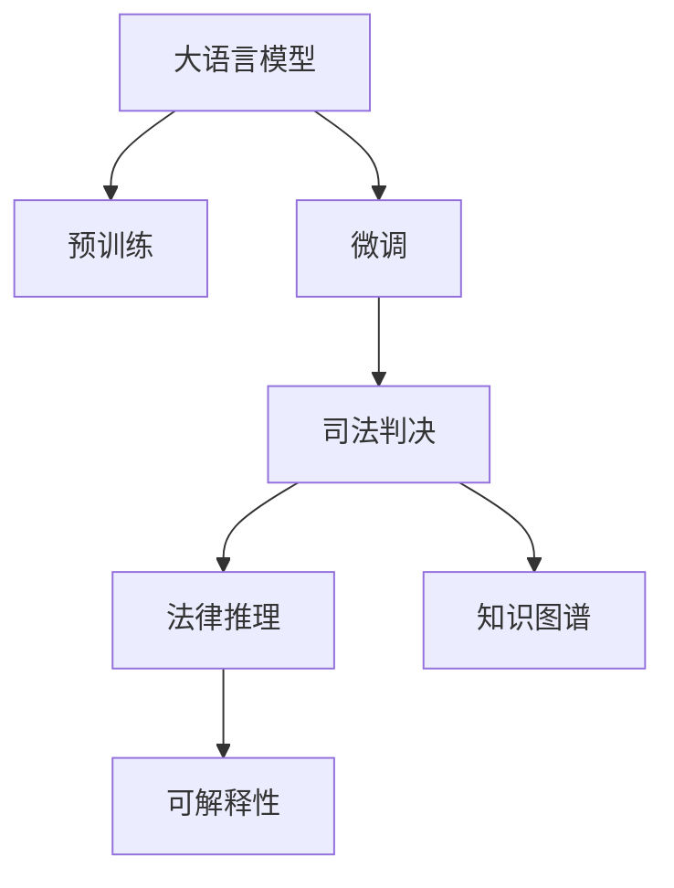

                 

# 法律推理：LLM 协助司法决策

> 关键词：法律推理,LLM,自然语言处理,NLP,司法判决,人工智能,深度学习,法律知识图谱,知识图谱

## 1. 背景介绍

### 1.1 问题由来
随着人工智能(AI)技术的不断进步，尤其是深度学习模型在自然语言处理(NLP)领域的突破，大语言模型(LLM)在处理自然语言文本方面展现了卓越的潜力。在司法领域，法官和律师在处理案件时，常常需要从海量法律文献和案例中筛选、比对、归纳，提取有价值的信息，这一过程费时费力。

LLM通过预训练和微调，可以快速理解自然语言文本，并基于已有法律知识提供高效的支持。例如，LLM可以用于智能推荐相关案例，快速查找法条，生成法律摘要，甚至辅助法官撰写判决书，显著提高司法效率，降低司法成本。

### 1.2 问题核心关键点
在司法领域应用LLM，需关注以下关键点：

1. **数据获取与标注**：LLM的训练需要大量法律数据，包括判例、法条、法律解释等。如何高效获取和标注这些数据，是司法领域应用LLM的基础。

2. **知识表示与融合**：LLM需要融合法律知识库，如法律条文、判例、法理等，以形成全面且准确的法律知识图谱。

3. **推理能力构建**：LLM不仅要理解文本，还要具备逻辑推理能力，能够从多个角度分析和综合案件事实，给出合法的法律推断。

4. **公平性与伦理考量**：LLM在司法决策中的应用应确保公平性，避免偏差，且需符合伦理规范。

5. **可解释性**：司法决策要求结果具有高度可解释性，法官和律师能够理解LLM提供的辅助决策依据。

### 1.3 问题研究意义
LLM在司法领域的应用具有重要意义：

1. **提升司法效率**：LLM可以辅助法官快速检索法律资料、类比分析案件，显著缩短案件审理周期。

2. **降低司法成本**：通过自动化处理部分简单法律事务，LLM可以减少人力资源投入，降低司法成本。

3. **辅助法律学习与研究**：LLM可以提供法律文本分析、法律问题解答，辅助法律从业者学习与研究。

4. **提高判决质量**：LLM能够帮助法官全面、准确地理解和运用法律知识，辅助做出更为公正的判决。

5. **促进司法透明与可问责**：LLM的决策过程可记录和回溯，促进司法透明，便于问责监督。

## 2. 核心概念与联系

### 2.1 核心概念概述

为更好地理解LLM在司法领域的应用，本节将介绍几个核心概念：

- **大语言模型(LLM)**：以Transformer等架构为基础，经过大规模无标签文本预训练，具备强大语言理解和生成能力的大规模语言模型。

- **预训练与微调**：通过大规模无标签文本预训练，构建通用语言模型，然后在特定领域或任务上进行微调，以适应特定应用需求。

- **法律推理**：在司法决策中，法官或律师通过逻辑推理，结合法律知识，得出判决的过程。

- **知识图谱**：利用图结构表示实体及其关系，构建法律知识图谱，提供法律信息的结构化表示。

- **司法判决**：法官根据法律知识库和案件事实，通过推理得出最终判决的过程。

- **可解释性**：法官或律师能够理解和解释LLM在司法决策过程中提供的信息和推断。

这些核心概念之间的逻辑关系可以通过以下Mermaid流程图来展示：



这个流程图展示了LLM在司法领域的应用框架：

1. 大语言模型通过预训练获得基础能力。
2. 微调使其适应司法领域的特定任务。
3. 微调后的模型用于司法判决，并执行法律推理。
4. 推理结果需具备可解释性。

## 3. 核心算法原理 & 具体操作步骤
### 3.1 算法原理概述

LLM在司法领域的应用，本质上是通过预训练和微调，构建一个能理解和推理法律文本的智能系统。其核心思想是：

- **预训练**：在大规模无标签法律文本上，利用自监督任务训练通用语言模型，使其学习到法律语言和结构的一般特征。

- **微调**：在特定法律场景或任务上，通过少量标注数据对预训练模型进行有监督训练，使其具备针对该场景或任务的推理能力。

### 3.2 算法步骤详解

以下是基于监督学习的LLM在司法判决中的应用步骤：

1. **数据准备**：
   - **数据收集**：收集法律案例、法律条文、司法解释、法律评论等。
   - **数据清洗与标注**：去除噪声数据，对数据进行标准化处理，为司法判决任务准备标注数据。

2. **模型选择与配置**：
   - **模型选择**：选择已有的法律领域的预训练模型，如法律领域的BERT、RoBERTa等。
   - **模型配置**：根据任务需求，选择合适的模型架构和超参数，如模型层数、隐藏尺寸、学习率等。

3. **知识融合与图谱构建**：
   - **法律知识提取**：从法律文本中提取实体、关系、事件等信息，构建法律知识图谱。
   - **图谱嵌入**：利用向量表示法，将法律实体和关系映射到低维空间，用于后续推理。

4. **微调训练**：
   - **模型加载与预训练**：加载预训练模型，并在特定司法任务上微调。
   - **损失函数设计**：设计损失函数，如交叉熵损失，用于衡量模型输出与真实标签的差异。
   - **优化算法选择**：选择如Adam、SGD等优化算法，设置合适的学习率和正则化参数。
   - **模型训练**：对模型进行有监督训练，更新参数以最小化损失函数。

5. **评估与部署**：
   - **模型评估**：在验证集上评估模型性能，如准确率、F1分数等。
   - **模型部署**：将微调后的模型部署到司法系统中，进行实际判决辅助。

### 3.3 算法优缺点

基于监督学习的LLM在司法领域的应用具有以下优点：

1. **效率提升**：通过自动化处理法律文本，显著缩短司法过程，提升司法效率。
2. **成本降低**：减少对人力资源的依赖，降低司法成本。
3. **知识共享**：构建法律知识图谱，实现法律知识的共享和传播。
4. **推理严谨**：基于法律知识和逻辑推理，提高判决的准确性和公正性。

但同时也存在一些局限性：

1. **数据依赖**：微调效果依赖于法律数据的质量和数量，获取高质量标注数据的成本较高。
2. **知识偏差**：预训练模型可能存在偏见，微调后的模型也可能继承这些偏见。
3. **解释性不足**：LLM的推理过程复杂，法官和律师难以完全理解其内部工作机制。
4. **伦理风险**：LLM在司法决策中的应用，需确保其决策过程和结果符合伦理规范。

### 3.4 算法应用领域

基于LLM的司法决策应用，已在多个司法场景中得到了初步应用，例如：

1. **案件相似度匹配**：通过相似度匹配算法，推荐与当前案件相似的先例，辅助法官快速了解已有判决。
2. **法律问题解答**：根据用户提问，提供相关的法律解释和指导，辅助律师研究和准备。
3. **判决书生成**：自动生成判决书的关键部分，如案件事实、判决理由等，减轻法官的文书工作。
4. **法律风险评估**：通过案例分析，评估案件的法律风险和胜诉概率，提供决策建议。
5. **法律文本摘要**：自动提取案件要点，生成简洁的法律文本摘要，便于快速理解。

这些应用不仅提高了司法系统的效率和公正性，还为法律从业者提供了强大的辅助工具。

## 4. 数学模型和公式 & 详细讲解  
### 4.1 数学模型构建

在本节中，我们将使用数学语言对基于LLM的司法判决模型进行更严谨的刻画。

记LLM为$f_\theta(x)$，其中$x$为输入的司法文本，$\theta$为模型参数。假设司法判决任务的训练集为$D=\{(x_i,y_i)\}_{i=1}^N$，$y_i$为法官判决结果。

定义模型在输入$x_i$上的损失函数为$\ell(f_\theta(x_i),y_i)$，则在数据集$D$上的经验风险为：

$$
\mathcal{L}(\theta) = \frac{1}{N} \sum_{i=1}^N \ell(f_\theta(x_i),y_i)
$$

微调的优化目标是最小化经验风险，即找到最优参数：

$$
\theta^* = \mathop{\arg\min}_{\theta} \mathcal{L}(\theta)
$$

在实践中，我们通常使用基于梯度的优化算法（如SGD、Adam等）来近似求解上述最优化问题。设$\eta$为学习率，$\lambda$为正则化系数，则参数的更新公式为：

$$
\theta \leftarrow \theta - \eta \nabla_{\theta}\mathcal{L}(\theta) - \eta\lambda\theta
$$

其中$\nabla_{\theta}\mathcal{L}(\theta)$为损失函数对参数$\theta$的梯度，可通过反向传播算法高效计算。

### 4.2 公式推导过程

以下我们以二分类司法判决为例，推导交叉熵损失函数及其梯度的计算公式。

假设法官在输入$x$的判决为$y$，真实标签$y_i \in \{0,1\}$。则二分类交叉熵损失函数定义为：

$$
\ell(f_\theta(x),y) = -[y\log f_\theta(x)+(1-y)\log (1-f_\theta(x))]
$$

将其代入经验风险公式，得：

$$
\mathcal{L}(\theta) = -\frac{1}{N}\sum_{i=1}^N [y_i\log f_\theta(x_i)+(1-y_i)\log(1-f_\theta(x_i))]
$$

根据链式法则，损失函数对参数$\theta_k$的梯度为：

$$
\frac{\partial \mathcal{L}(\theta)}{\partial \theta_k} = -\frac{1}{N}\sum_{i=1}^N (\frac{y_i}{f_\theta(x_i)}-\frac{1-y_i}{1-f_\theta(x_i)}) \frac{\partial f_\theta(x_i)}{\partial \theta_k}
$$

其中$\frac{\partial f_\theta(x_i)}{\partial \theta_k}$可进一步递归展开，利用自动微分技术完成计算。

在得到损失函数的梯度后，即可带入参数更新公式，完成模型的迭代优化。重复上述过程直至收敛，最终得到适应司法判决任务的最优模型参数$\theta^*$。

## 5. 项目实践：代码实例和详细解释说明
### 5.1 开发环境搭建

在进行司法判决LLM应用实践前，我们需要准备好开发环境。以下是使用Python进行PyTorch开发的环境配置流程：

1. 安装Anaconda：从官网下载并安装Anaconda，用于创建独立的Python环境。

2. 创建并激活虚拟环境：
```bash
conda create -n llm-env python=3.8 
conda activate llm-env
```

3. 安装PyTorch：根据CUDA版本，从官网获取对应的安装命令。例如：
```bash
conda install pytorch torchvision torchaudio cudatoolkit=11.1 -c pytorch -c conda-forge
```

4. 安装Transformers库：
```bash
pip install transformers
```

5. 安装各类工具包：
```bash
pip install numpy pandas scikit-learn matplotlib tqdm jupyter notebook ipython
```

完成上述步骤后，即可在`llm-env`环境中开始LLM的司法判决应用开发。

### 5.2 源代码详细实现

下面我们以二分类司法判决任务为例，给出使用Transformers库对BERT模型进行司法判决任务微调的PyTorch代码实现。

首先，定义司法判决任务的数据处理函数：

```python
from transformers import BertTokenizer
from torch.utils.data import Dataset
import torch

class JudgmentDataset(Dataset):
    def __init__(self, texts, labels, tokenizer, max_len=128):
        self.texts = texts
        self.labels = labels
        self.tokenizer = tokenizer
        self.max_len = max_len
        
    def __len__(self):
        return len(self.texts)
    
    def __getitem__(self, item):
        text = self.texts[item]
        label = self.labels[item]
        
        encoding = self.tokenizer(text, return_tensors='pt', max_length=self.max_len, padding='max_length', truncation=True)
        input_ids = encoding['input_ids'][0]
        attention_mask = encoding['attention_mask'][0]
        
        # 对token-wise的标签进行编码
        encoded_labels = [int(label)] * len(input_ids)
        labels = torch.tensor(encoded_labels, dtype=torch.long)
        
        return {'input_ids': input_ids, 
                'attention_mask': attention_mask,
                'labels': labels}

# 标签与id的映射
label2id = {'判决结果正确': 0, '判决结果错误': 1}
id2label = {v: k for k, v in label2id.items()}

# 创建dataset
tokenizer = BertTokenizer.from_pretrained('bert-base-cased')

train_dataset = JudgmentDataset(train_texts, train_labels, tokenizer)
dev_dataset = JudgmentDataset(dev_texts, dev_labels, tokenizer)
test_dataset = JudgmentDataset(test_texts, test_labels, tokenizer)
```

然后，定义模型和优化器：

```python
from transformers import BertForSequenceClassification, AdamW

model = BertForSequenceClassification.from_pretrained('bert-base-cased', num_labels=len(label2id))

optimizer = AdamW(model.parameters(), lr=2e-5)
```

接着，定义训练和评估函数：

```python
from torch.utils.data import DataLoader
from tqdm import tqdm
from sklearn.metrics import classification_report

device = torch.device('cuda') if torch.cuda.is_available() else torch.device('cpu')
model.to(device)

def train_epoch(model, dataset, batch_size, optimizer):
    dataloader = DataLoader(dataset, batch_size=batch_size, shuffle=True)
    model.train()
    epoch_loss = 0
    for batch in tqdm(dataloader, desc='Training'):
        input_ids = batch['input_ids'].to(device)
        attention_mask = batch['attention_mask'].to(device)
        labels = batch['labels'].to(device)
        model.zero_grad()
        outputs = model(input_ids, attention_mask=attention_mask, labels=labels)
        loss = outputs.loss
        epoch_loss += loss.item()
        loss.backward()
        optimizer.step()
    return epoch_loss / len(dataloader)

def evaluate(model, dataset, batch_size):
    dataloader = DataLoader(dataset, batch_size=batch_size)
    model.eval()
    preds, labels = [], []
    with torch.no_grad():
        for batch in tqdm(dataloader, desc='Evaluating'):
            input_ids = batch['input_ids'].to(device)
            attention_mask = batch['attention_mask'].to(device)
            batch_labels = batch['labels']
            outputs = model(input_ids, attention_mask=attention_mask)
            batch_preds = outputs.logits.argmax(dim=1).to('cpu').tolist()
            batch_labels = batch_labels.to('cpu').tolist()
            for pred, label in zip(batch_preds, batch_labels):
                preds.append(pred)
                labels.append(label)
                
    print(classification_report(labels, preds))
```

最后，启动训练流程并在测试集上评估：

```python
epochs = 5
batch_size = 16

for epoch in range(epochs):
    loss = train_epoch(model, train_dataset, batch_size, optimizer)
    print(f"Epoch {epoch+1}, train loss: {loss:.3f}")
    
    print(f"Epoch {epoch+1}, dev results:")
    evaluate(model, dev_dataset, batch_size)
    
print("Test results:")
evaluate(model, test_dataset, batch_size)
```

以上就是使用PyTorch对BERT进行司法判决任务微调的完整代码实现。可以看到，得益于Transformers库的强大封装，我们可以用相对简洁的代码完成BERT模型的加载和微调。

### 5.3 代码解读与分析

让我们再详细解读一下关键代码的实现细节：

**JudgmentDataset类**：
- `__init__`方法：初始化文本、标签、分词器等关键组件。
- `__len__`方法：返回数据集的样本数量。
- `__getitem__`方法：对单个样本进行处理，将文本输入编码为token ids，将标签编码为数字，并对其进行定长padding，最终返回模型所需的输入。

**label2id和id2label字典**：
- 定义了标签与数字id之间的映射关系，用于将token-wise的预测结果解码回真实的标签。

**训练和评估函数**：
- 使用PyTorch的DataLoader对数据集进行批次化加载，供模型训练和推理使用。
- 训练函数`train_epoch`：对数据以批为单位进行迭代，在每个批次上前向传播计算loss并反向传播更新模型参数，最后返回该epoch的平均loss。
- 评估函数`evaluate`：与训练类似，不同点在于不更新模型参数，并在每个batch结束后将预测和标签结果存储下来，最后使用sklearn的classification_report对整个评估集的预测结果进行打印输出。

**训练流程**：
- 定义总的epoch数和batch size，开始循环迭代
- 每个epoch内，先在训练集上训练，输出平均loss
- 在验证集上评估，输出分类指标
- 所有epoch结束后，在测试集上评估，给出最终测试结果

可以看到，PyTorch配合Transformers库使得BERT微调的代码实现变得简洁高效。开发者可以将更多精力放在数据处理、模型改进等高层逻辑上，而不必过多关注底层的实现细节。

当然，工业级的系统实现还需考虑更多因素，如模型的保存和部署、超参数的自动搜索、更灵活的任务适配层等。但核心的微调范式基本与此类似。

## 6. 实际应用场景
### 6.1 智能法院系统

智能法院系统是LLM在司法领域应用的典型代表。通过构建智能法院系统，法官可以高效处理案件，快速检索相关法律资料，辅助法官撰写判决书，显著提高司法效率和公正性。

在技术实现上，可以收集法院历史判例和法律条文，将文本标注为判决结果正确或不正确，在此基础上对预训练模型进行微调。微调后的模型可以用于案件相似度匹配，推荐相关案例，辅助法官了解已有判决，减少判案时间。同时，模型还可以自动生成判决书的关键部分，减轻法官的文书工作负担。

### 6.2 法律知识图谱

构建法律知识图谱，将法律条文、判例、法理等实体和关系映射到低维空间，可以帮助LLM更好地理解和推理法律文本。法律知识图谱的构建过程包括以下步骤：

1. **实体抽取**：从法律文本中提取实体，如人名、地名、机构名等。
2. **关系提取**：提取实体之间的关系，如依据、参考、注释等。
3. **知识融合**：将抽取的实体和关系融合到知识图谱中，构建实体-关系图。
4. **知识嵌入**：使用向量表示法，将实体和关系映射到低维空间，用于后续推理。

构建的法律知识图谱可以作为LLM的先验知识，提升其推理能力和判决准确性。

### 6.3 风险评估与决策支持

LLM可以用于司法判决的风险评估和决策支持，通过案例分析，评估案件的法律风险和胜诉概率，提供决策建议。具体流程如下：

1. **案例筛选**：从历史判例中筛选与当前案件相似的案例。
2. **风险评估**：利用LLM对相似案例进行分析，评估其胜诉概率。
3. **决策建议**：根据风险评估结果，提供决策建议，如选择诉讼策略、调整诉讼方案等。

这不仅能帮助律师在案件准备阶段做出更科学的决策，还能提升案件胜诉率，降低法律风险。

### 6.4 未来应用展望

随着LLM在司法领域的应用不断深入，未来其应用前景广阔，包括但不限于以下方向：

1. **智能辅助系统**：构建更为智能的司法决策辅助系统，提供从案件分析到判决书撰写的一体化解决方案。
2. **跨域知识迁移**：实现法律领域与其他领域的知识迁移，构建更为通用的人工智能系统。
3. **自动问答系统**：构建自动问答系统，回答法律从业者的常见问题，提升法律学习效率。
4. **司法监督系统**：构建司法监督系统，监控法官的判决过程，确保司法公正透明。
5. **智能合约**：将LLM用于智能合约的编写和审核，提升合同处理效率。

这些应用方向将进一步推动司法领域的数字化转型，提升司法系统的效率和公正性，助力社会公平正义。

## 7. 工具和资源推荐
### 7.1 学习资源推荐

为了帮助开发者系统掌握LLM在司法领域的应用，这里推荐一些优质的学习资源：

1. **《司法人工智能》系列博文**：由大模型技术专家撰写，深入浅出地介绍了司法领域应用LLM的基本概念和前沿技术。

2. **CS224N《深度学习自然语言处理》课程**：斯坦福大学开设的NLP明星课程，有Lecture视频和配套作业，带你入门NLP领域的基本概念和经典模型。

3. **《Natural Language Processing with Transformers》书籍**：Transformers库的作者所著，全面介绍了如何使用Transformers库进行NLP任务开发，包括司法判决在内的诸多范式。

4. **CLUE开源项目**：中文语言理解测评基准，涵盖大量不同类型的中文NLP数据集，并提供了基于微调的baseline模型，助力中文司法判决技术发展。

通过对这些资源的学习实践，相信你一定能够快速掌握LLM在司法领域的应用方法，并用于解决实际的司法问题。

### 7.2 开发工具推荐

高效的开发离不开优秀的工具支持。以下是几款用于LLM司法判决开发的常用工具：

1. **PyTorch**：基于Python的开源深度学习框架，灵活动态的计算图，适合快速迭代研究。大部分预训练语言模型都有PyTorch版本的实现。

2. **TensorFlow**：由Google主导开发的开源深度学习框架，生产部署方便，适合大规模工程应用。同样有丰富的预训练语言模型资源。

3. **Transformers库**：HuggingFace开发的NLP工具库，集成了众多SOTA语言模型，支持PyTorch和TensorFlow，是进行司法判决微调任务开发的利器。

4. **Weights & Biases**：模型训练的实验跟踪工具，可以记录和可视化模型训练过程中的各项指标，方便对比和调优。与主流深度学习框架无缝集成。

5. **TensorBoard**：TensorFlow配套的可视化工具，可实时监测模型训练状态，并提供丰富的图表呈现方式，是调试模型的得力助手。

6. **Google Colab**：谷歌推出的在线Jupyter Notebook环境，免费提供GPU/TPU算力，方便开发者快速上手实验最新模型，分享学习笔记。

合理利用这些工具，可以显著提升LLM司法判决任务的开发效率，加快创新迭代的步伐。

### 7.3 相关论文推荐

LLM在司法领域的应用源于学界的持续研究。以下是几篇奠基性的相关论文，推荐阅读：

1. **Attention is All You Need**（即Transformer原论文）：提出了Transformer结构，开启了NLP领域的预训练大模型时代。

2. **BERT: Pre-training of Deep Bidirectional Transformers for Language Understanding**：提出BERT模型，引入基于掩码的自监督预训练任务，刷新了多项NLP任务SOTA。

3. **Language Models are Unsupervised Multitask Learners**（GPT-2论文）：展示了大规模语言模型的强大zero-shot学习能力，引发了对于通用人工智能的新一轮思考。

4. **Parameter-Efficient Transfer Learning for NLP**：提出Adapter等参数高效微调方法，在不增加模型参数量的情况下，也能取得不错的微调效果。

5. **Fine-tune BERT for Legal Reasoning**：提出基于BERT的司法判决微调方法，通过融合法律知识库，提升判决准确性。

6. **Knowledge-Driven Pre-training for Legal Reasoning**：利用法律知识图谱进行预训练，提升司法判决模型的推理能力。

这些论文代表了大语言模型司法判决技术的发展脉络。通过学习这些前沿成果，可以帮助研究者把握学科前进方向，激发更多的创新灵感。

## 8. 总结：未来发展趋势与挑战
### 8.1 总结

本文对基于LLM的司法判决模型进行了全面系统的介绍。首先阐述了LLM在司法领域的应用背景和意义，明确了LLM的推理能力在司法决策中的独特价值。其次，从原理到实践，详细讲解了司法判决任务的数学模型和关键步骤，给出了司法判决任务开发的完整代码实例。同时，本文还广泛探讨了LLM在智能法院、法律知识图谱、风险评估等多个司法场景中的应用前景，展示了LLM的巨大潜力。此外，本文精选了司法判决任务的各类学习资源，力求为读者提供全方位的技术指引。

通过本文的系统梳理，可以看到，基于LLM的司法判决模型正在成为司法领域的重要工具，极大地提升了司法系统的效率和公正性。LLM通过理解法律文本，推理出判决结果，显著减轻了法官的工作负担，提升了司法效率。未来，伴随LLM的不断发展和应用，司法决策将更为智能化、高效化，为社会的公正和进步提供新的动力。

### 8.2 未来发展趋势

展望未来，LLM在司法领域的应用将呈现以下几个发展趋势：

1. **智能决策系统**：构建更为智能的司法决策系统，提供从案件分析到判决书撰写的一体化解决方案，提升司法系统的效率和公正性。

2. **跨域知识迁移**：实现法律领域与其他领域的知识迁移，构建更为通用的人工智能系统。

3. **自动问答系统**：构建自动问答系统，回答法律从业者的常见问题，提升法律学习效率。

4. **司法监督系统**：构建司法监督系统，监控法官的判决过程，确保司法公正透明。

5. **智能合约**：将LLM用于智能合约的编写和审核，提升合同处理效率。

6. **多模态融合**：将文本、语音、视频等多模态数据融合，构建更为全面、精准的司法推理系统。

这些趋势将进一步推动司法领域的数字化转型，提升司法系统的效率和公正性，助力社会公平正义。

### 8.3 面临的挑战

尽管LLM在司法领域的应用前景广阔，但在迈向更加智能化、普适化应用的过程中，它仍面临诸多挑战：

1. **数据获取与标注**：司法领域的数据获取和标注成本较高，高质量标注数据的获取仍是一个难题。

2. **知识偏差**：预训练模型可能存在偏见，微调后的模型也可能继承这些偏见，需确保模型的公平性。

3. **推理能力不足**：LLM的推理能力仍需提升，尤其在复杂多变的司法场景中，模型的决策能力需进一步增强。

4. **可解释性不足**：LLM的推理过程复杂，法官和律师难以完全理解其内部工作机制，需提升可解释性。

5. **伦理与安全风险**：LLM在司法决策中的应用需确保其决策过程和结果符合伦理规范，避免误导性输出。

6. **模型鲁棒性**：模型在面对域外数据时，泛化性能往往大打折扣，需提升模型的鲁棒性。

这些挑战亟需技术界和法律界的协同努力，共同探索解决之道，确保LLM在司法领域的应用安全、可靠、公正。

### 8.4 研究展望

面对LLM司法判决模型面临的挑战，未来的研究需要在以下几个方面寻求新的突破：

1. **无监督和半监督微调方法**：探索无监督和半监督微调方法，摆脱对大规模标注数据的依赖，最大限度利用非结构化数据。

2. **知识图谱与知识融合**：构建更为全面、精准的法律知识图谱，实现法律知识的自动化抽取与融合，提升司法推理能力。

3. **参数高效与计算高效的微调范式**：开发更加参数高效的微调方法，在固定大部分预训练参数的同时，只更新极少量的任务相关参数，提升微调效率。

4. **因果推理与逻辑推理**：引入因果推理和逻辑推理，增强LLM的决策过程的逻辑性和合理性。

5. **伦理与安全约束**：在模型训练目标中引入伦理导向的评估指标，过滤和惩罚有偏见、有害的输出倾向，确保模型输出的安全性。

6. **多模态司法推理**：将文本、语音、视频等多模态数据融合，构建更为全面、精准的司法推理系统。

这些研究方向的探索，必将引领LLM在司法领域的应用进入新的高度，为司法决策提供更为智能化、高效化的解决方案。

## 9. 附录：常见问题与解答

**Q1：LLM在司法判决中的应用是否会影响法官的独立性？**

A: LLM作为司法决策的辅助工具，其作用在于提升法官的决策效率和准确性，而非替代法官的独立判断。法官在作出最终判决时，仍需综合考虑LLM提供的辅助信息和自身的专业判断，确保判决的公正性和合理性。

**Q2：如何确保LLM的司法判决结果具有可解释性？**

A: 可解释性是司法决策的重要考量，LLM在司法领域的应用需确保其决策过程和结果具有高度可解释性。可以通过以下方法实现：
1. **透明度**：记录LLM的推理过程，提供详细的输出解释。
2. **模型透明性**：使用可解释性较强的模型架构，如LIME、SHAP等，解释模型的决策依据。
3. **法官参与**：法官参与模型的训练和调试过程，确保模型的决策逻辑与司法实践相符。

**Q3：LLM在司法判决中的应用是否存在伦理风险？**

A: LLM在司法判决中的应用需确保其决策过程和结果符合伦理规范。为避免可能的伦理风险，可以采取以下措施：
1. **伦理审查**：引入伦理审查机制，对模型的决策过程和结果进行监督。
2. **透明性**：公开模型的训练数据和推理过程，接受社会监督。
3. **责任归属**：明确法官和LLM在司法决策中的责任归属，确保法官对最终判决承担责任。

**Q4：LLM在司法判决中的应用是否需要考虑数据隐私？**

A: LLM在司法判决中的应用需严格遵守数据隐私保护规定，确保司法数据的保密性和安全性。可以通过以下方法实现：
1. **数据匿名化**：对司法数据进行匿名化处理，防止个人隐私泄露。
2. **数据访问控制**：对司法数据的访问进行严格控制，确保只有授权人员才能访问和使用数据。
3. **数据加密**：对司法数据进行加密存储和传输，防止数据被非法获取和篡改。

**Q5：LLM在司法判决中的应用是否会加剧司法不公？**

A: LLM在司法判决中的应用需确保其决策过程和结果的公正性，避免可能的司法不公现象。可以通过以下方法实现：
1. **公平性测试**：对LLM进行公平性测试，确保其在不同群体和情况下的表现一致。
2. **偏见消除**：使用偏差消除技术，如重新加权、重新采样等，消除模型中的偏见。
3. **透明度**：公开LLM的决策过程和结果，接受社会监督。

这些措施将有助于确保LLM在司法判决中的应用安全、可靠、公正，真正服务于司法正义。

**Q6：LLM在司法判决中的应用是否需要考虑数据多样性？**

A: 是的，LLM在司法判决中的应用需考虑数据多样性，确保模型能够在多种场景下表现一致。可以通过以下方法实现：
1. **多源数据融合**：结合不同来源和类型的司法数据，构建多样化、全面的训练集。
2. **异质性测试**：在异质性数据集上测试LLM的性能，确保其鲁棒性和泛化能力。
3. **领域适配**：根据不同司法场景，设计合适的任务适配层，提升模型的领域适配能力。

**Q7：LLM在司法判决中的应用是否需要考虑数据的时效性？**

A: 是的，LLM在司法判决中的应用需考虑数据的时效性，确保模型能够及时更新司法知识库，反映最新的司法实践和法规变化。可以通过以下方法实现：
1. **实时数据更新**：定期更新司法知识库，确保数据的时效性。
2. **动态知识融合**：在司法判决过程中，动态融合最新的法律知识和判决案例，提升LLM的推理能力。
3. **历史数据维护**：维护历史司法数据，供LLM进行模型更新和改进。

这些措施将有助于确保LLM在司法判决中的应用与时俱进，提升司法决策的准确性和公正性。

---

作者：禅与计算机程序设计艺术 / Zen and the Art of Computer Programming

