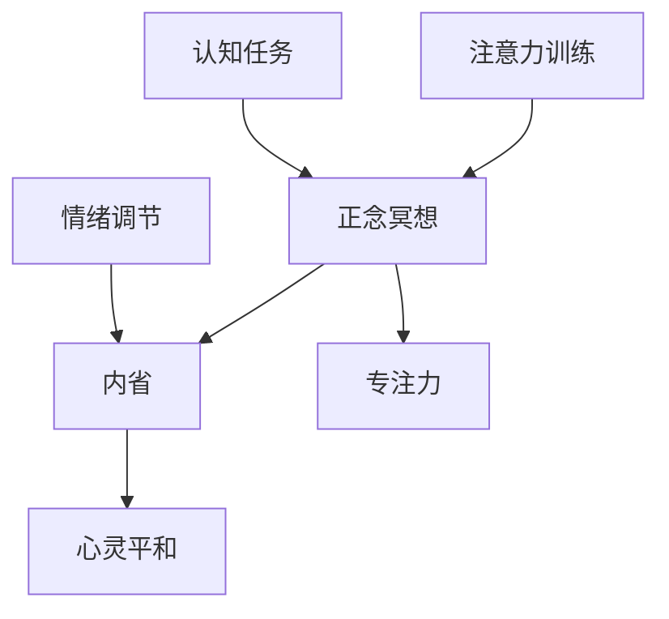

                 

# 注意力 训练与正念冥想实践：通过内省增强专注力和心灵平和

> 关键词：注意力训练,正念冥想,内省,专注力,心灵平和,心理健康,压力管理

## 1. 背景介绍

在快节奏的现代生活中，许多人面临着巨大的工作压力和精神负担。长期的高压状态不仅影响身体健康，还会导致注意力分散、情绪波动、决策力下降等心理问题。为了应对这些挑战，心理学家和冥想专家提出了一种通过内省练习来提升专注力和心灵平和的方法，即“注意力训练与正念冥想”。本文将深入探讨这一方法的原理、具体操作步骤、以及在实际应用中的具体实践。

### 1.1 问题由来

在信息爆炸的时代，人们获取的信息量极大增加，但同时也被大量的噪音和干扰所困扰。在职场中，频繁的会议、邮件和电话要求人们不断切换注意力，长时间保持高度专注变得异常困难。在个人生活中，社交媒体、新闻、视频等娱乐形式不断吸引注意力，人们往往不自觉地陷入“分心模式”。这些注意力问题不仅降低了工作效率，还引发了情绪波动、焦虑和压力，严重影响了生活质量。

为了缓解这一问题，人们开始寻求通过特定的训练来提升注意力和情绪管理能力。正念冥想作为一种古老的心理调节方法，近年来重新受到重视，并在心理治疗和认知科学研究中得到了广泛的验证。正念冥想通过集中注意力，对当下进行觉知，从而减轻焦虑和压力，提升心理健康。而注意力训练则通过模拟游戏、认知任务等方法，系统性地锻炼注意力和注意力转移能力，达到提升专注力的目的。

### 1.2 问题核心关键点
注意力训练与正念冥想的核心在于通过定期的、系统的训练，使注意力和情绪调节能力得到提升。这些训练方法不仅能帮助个体更好地应对压力和挑战，还能增强心理韧性和自我管理能力。

**核心概念**：
- **注意力训练**：通过一系列有意识、有计划的认知任务，锻炼注意力集中和切换的能力。
- **正念冥想**：通过定期的、系统的练习，提高对当下时刻的觉知和接受能力，减少对过往和未来的执着。
- **内省**：通过深入反思和自我觉察，增强自我认识，提升情感调节和问题解决能力。
- **专注力**：在特定任务上保持长时间的注意力集中，提高工作效率和产出质量。
- **心灵平和**：通过内省练习，减轻压力和焦虑，提升情绪稳定性和生活满意度。

**关键流程**：
1. **设定目标**：明确需要提升的具体注意力或情绪调节能力。
2. **选择训练方法**：根据目标选择合适的训练方法（如正念冥想、注意力训练等）。
3. **定期练习**：建立练习习惯，每天固定时间进行练习。
4. **自我评估**：通过日记、情绪监测工具等手段，跟踪练习效果和心理变化。
5. **调整策略**：根据自我评估结果，调整训练方法或频率，以达到最佳效果。

## 2. 核心概念与联系

### 2.1 核心概念概述

注意力训练与正念冥想在心理学和神经科学领域具有深厚的理论基础。下面将对每个核心概念进行概述：

- **注意力训练**：心理学研究表明，注意力是一种有限的资源，需要通过练习来提升。注意力训练通常包括集中注意力的练习（如深度工作、冥想）和注意力转移的练习（如分心游戏、多任务处理训练）。

- **正念冥想**：正念冥想的核心理念是对当下时刻的觉知和接受。正念冥想通过关注呼吸、身体感受、情绪体验等，帮助个体从分散的注意力中解脱出来，增强对当下时刻的觉察能力。

- **内省**：内省是一种通过深入反思和自我觉察来提升自我认识和情感调节能力的方法。内省涉及对思想、情绪和行为的持续监控和评估，并根据评估结果进行调整。

- **专注力**：专注力是指在特定任务上保持高度集中的能力。专注力高的人能够更有效地处理复杂问题，提高工作效率和生活质量。

- **心灵平和**：心灵平和平静状态是心理健康的重要指标，有助于缓解压力和焦虑，提升情绪稳定性和生活满意度。

### 2.2 核心概念原理和架构的 Mermaid 流程图(Mermaid 流程节点中不要有括号、逗号等特殊字符)



这个流程图展示了注意力训练、正念冥想、内省与专注力、心灵平和之间的联系和相互作用。注意力训练通过认知任务提高专注力，正念冥想通过觉知练习减轻压力，内省通过深入反思提升情绪调节能力，最终达到心灵平和状态。

## 3. 核心算法原理 & 具体操作步骤

### 3.1 算法原理概述

注意力训练与正念冥想的核心原理在于通过系统性的训练，提升个体的注意力集中和情绪调节能力。这些训练方法基于认知科学和神经科学研究，通过具体的训练任务和练习程序，使个体在不断重复中逐渐增强这些能力。

注意力训练通常包括以下几个步骤：
1. **设定任务**：明确需要训练的注意力能力（如注意力集中、转移、分配等）。
2. **选择任务**：根据任务类型选择合适的认知任务（如集中注意力的冥想、分心游戏、记忆任务等）。
3. **执行任务**：按照设计好的训练程序，定期进行任务练习。
4. **反馈调整**：根据练习效果进行自我评估，调整训练方法和频率，以达到最佳效果。

正念冥想则主要通过以下几个步骤进行：
1. **准备环境**：选择一个安静、舒适的环境，减少干扰。
2. **关注呼吸**：通过集中注意力于呼吸，提高对当下时刻的觉知。
3. **觉知觉察**：关注身体感受、情绪体验等，不进行评判，接受当下。
4. **调整姿势**：适时调整坐姿或姿势，保持身体舒适。
5. **结束练习**：练习结束后，对感受进行反思和总结。

### 3.2 算法步骤详解

#### 注意力训练步骤详解

**Step 1: 设定目标**
- 明确需要提升的注意力能力，如注意力集中、转移、分配等。
- 设定具体目标，如每天集中注意力工作1小时，每周进行3次冥想练习。

**Step 2: 选择任务**
- 根据目标选择合适的认知任务。
- 例如，选择深度工作（如番茄工作法）、分心游戏（如游戏珠）、记忆任务（如数字记忆游戏）等。

**Step 3: 执行任务**
- 按照设计好的训练程序，定期进行任务练习。
- 例如，每天使用番茄工作法工作25分钟，进行5次记忆任务练习。

**Step 4: 反馈调整**
- 通过日记、情绪监测工具等手段，跟踪练习效果和心理变化。
- 例如，记录每天集中注意力的时长和效果，反思情绪波动的原因。

#### 正念冥想步骤详解

**Step 1: 准备环境**
- 选择一个安静、舒适的环境，减少干扰。
- 例如，在家中找一处安静角落，铺上瑜伽垫，关闭手机通知。

**Step 2: 关注呼吸**
- 通过集中注意力于呼吸，提高对当下时刻的觉知。
- 例如，闭上眼睛，深呼吸，专注于每一次吸气和呼气。

**Step 3: 觉知觉察**
- 关注身体感受、情绪体验等，不进行评判，接受当下。
- 例如，感受身体的紧张或放松，不评判这些感受，接受其存在。

**Step 4: 调整姿势**
- 适时调整坐姿或姿势，保持身体舒适。
- 例如，如果感到身体不适，适当调整坐姿，避免长时间保持同一姿势。

**Step 5: 结束练习**
- 练习结束后，对感受进行反思和总结。
- 例如，记录练习的感受和反思，了解自己在练习中的进步和不足。

### 3.3 算法优缺点

注意力训练与正念冥想具有以下优点：
1. **系统性提升**：通过有计划的训练，系统性地提升注意力和情绪调节能力。
2. **成本低廉**：相比于药物和专业心理治疗，注意力训练与正念冥想的成本极低。
3. **易于操作**：大部分训练方法不需要专业设备或指导，可以自主进行。
4. **应用广泛**：适用于各个年龄段和职业背景的个体，能够广泛应用于工作、学习和生活各个方面。

同时，这些方法也存在一些局限：
1. **效果因人而异**：不同个体的训练效果可能存在差异，需根据个人情况进行调整。
2. **时间投入**：需要定期投入时间进行练习，短期内可能难以看到显著效果。
3. **需要自律**：坚持长期的练习需要较高的自律性，容易受到外界干扰。
4. **初期困难**：初期的训练可能面临困难，如无法集中注意力或情绪波动等，需要持续练习和调整。

### 3.4 算法应用领域

注意力训练与正念冥想的应用领域非常广泛，涵盖了各个生活和工作场景：

1. **职场压力管理**：通过正念冥想和注意力训练，帮助职场人士减轻工作压力，提升工作效率。
2. **学习效率提升**：通过深度工作等注意力训练方法，提升学习效率，提高学习成果。
3. **情绪调节和心理健康**：通过正念冥想和内省练习，缓解焦虑和压力，提升心理健康。
4. **人际关系改善**：通过内省和觉察练习，提升情绪控制和沟通能力，改善人际关系。
5. **生活方式改善**：通过正念冥想和注意力训练，提升生活质量，促进健康生活。

## 4. 数学模型和公式 & 详细讲解 & 举例说明

### 4.1 数学模型构建

注意力训练与正念冥想的数学模型通常建立在心理学和神经科学的研究基础上，通过具体的数据和实验结果构建。

- **注意力训练的数学模型**：
  - 集中注意力：通过深度工作法，设定任务和休息时间的比例，进行时间管理。
  - 注意力转移：通过分心游戏，设定任务难度和时间限制，进行注意力切换训练。
  - 注意力分配：通过多任务处理训练，设定任务优先级和资源分配策略，进行注意力分配练习。

- **正念冥想的数学模型**：
  - 关注呼吸：设定呼吸次数和时间，通过数据分析呼吸频率和深度。
  - 觉知觉察：通过情绪监测工具，记录情绪波动和感受，进行数据分析和反馈。
  - 调整姿势：通过身体感应器，监测坐姿和姿势，进行数据分析和调整。

### 4.2 公式推导过程

#### 注意力训练的公式推导

以深度工作法为例，其数学模型可以表示为：
- 设定任务时间 $T$ 和工作休息时间比例 $k$，即每工作 $kT$ 分钟，休息 $T(1-k)$ 分钟。
- 任务完成度 $C$ 与任务时间 $T$ 和工作休息时间比例 $k$ 的关系如下：
$$
C = f(T, k)
$$
其中 $f$ 为特定任务的函数，表示在特定任务时间和工作休息时间比例下，任务的完成度。

#### 正念冥想的公式推导

以呼吸关注为例，其数学模型可以表示为：
- 设定呼吸次数 $N$ 和呼吸时间 $t$，即每次呼吸持续 $t$ 秒，共进行 $N$ 次。
- 呼吸频率 $R$ 与呼吸次数 $N$ 和呼吸时间 $t$ 的关系如下：
$$
R = \frac{N}{T}
$$
其中 $T = Nt$ 为总呼吸时间。

### 4.3 案例分析与讲解

**案例1: 深度工作法**
- 设定任务时间 $T = 25$ 分钟，工作休息时间比例 $k = 0.5$，即每工作 25 分钟，休息 25 分钟。
- 任务完成度 $C$ 与 $T$ 和 $k$ 的关系如下：
$$
C = \frac{T}{T + T(1-k)} = \frac{1}{1 + (1-k)} = \frac{1}{1 + 0.5} = 0.5
$$
这意味着在深度工作法下，个体每工作 25 分钟，能够完成 50% 的任务，同时保持专注力和工作效率。

**案例2: 呼吸关注**
- 设定呼吸次数 $N = 10$，呼吸时间 $t = 5$ 秒，即每次呼吸持续 5 秒，共进行 10 次。
- 呼吸频率 $R$ 与 $N$ 和 $t$ 的关系如下：
$$
R = \frac{N}{T} = \frac{10}{10 \times 5} = \frac{10}{50} = 0.2
$$
这意味着在呼吸关注练习中，个体的呼吸频率为每分钟 0.2 次，有助于提升对当下时刻的觉知和接受。

## 5. 项目实践：代码实例和详细解释说明

### 5.1 开发环境搭建

进行注意力训练与正念冥想的项目实践，需要先搭建好开发环境。以下是使用Python进行PyTorch开发的环境配置流程：

1. 安装Anaconda：从官网下载并安装Anaconda，用于创建独立的Python环境。

2. 创建并激活虚拟环境：
```bash
conda create -n pytorch-env python=3.8 
conda activate pytorch-env
```

3. 安装PyTorch：根据CUDA版本，从官网获取对应的安装命令。例如：
```bash
conda install pytorch torchvision torchaudio cudatoolkit=11.1 -c pytorch -c conda-forge
```

4. 安装TensorBoard：
```bash
pip install tensorboard
```

5. 安装各类工具包：
```bash
pip install numpy pandas scikit-learn matplotlib tqdm jupyter notebook ipython
```

完成上述步骤后，即可在`pytorch-env`环境中开始实践。

### 5.2 源代码详细实现

下面以深度工作法（Pomodoro Technique）为例，给出使用PyTorch实现的时间管理工具代码实现。

```python
import time
import numpy as np
import pandas as pd

# 设定任务时间和工作休息时间比例
task_time = 25 * 60  # 任务时间（分钟）
rest_time = task_time * 0.5  # 休息时间（分钟）

# 初始化计时器
start_time = time.time()
end_time = start_time

# 工作计时器
work_counter = 0
rest_counter = 0

while True:
    # 任务计时
    start_time = time.time()
    end_time = start_time + task_time
    while time.time() < end_time:
        # 执行任务
        print(f"Task time: {task_time} minutes")
        # 休息计时
        start_time = time.time()
        end_time = start_time + rest_time
        while time.time() < end_time:
            # 记录休息时间
            print(f"Rest time: {rest_time} minutes")
            # 检查是否需要继续
            input("Press Enter to continue...")
            # 重新开始计时
            start_time = time.time()
            end_time = start_time + task_time
        # 更新计数器
        work_counter += 1
        rest_counter += 1
        # 记录任务完成度
        print(f"Work cycles: {work_counter}, Rest cycles: {rest_counter}")
```

以上代码实现了基于深度工作法的任务时间管理和休息时间管理。在实践中，可以根据需要调整任务时间和休息时间，以找到最适合自己的工作节奏。

### 5.3 代码解读与分析

让我们再详细解读一下关键代码的实现细节：

**Pomodoro Technique**：
- 设定任务时间和休息时间，通过计时器实现工作计时和休息计时。
- 每次任务完成后，记录任务完成度和工作休息周期，反馈用户当前的进度。
- 用户可以通过按键输入暂停或继续，灵活调整任务和休息时间。

**代码实现细节**：
- 使用time模块实现时间计数，通过while循环进行定时器管理。
- 每次任务和休息时间结束，记录并输出任务完成度和休息周期。
- 通过numpy和pandas库，可以进一步进行数据分析和可视化，优化时间管理策略。

### 5.4 运行结果展示

运行上述代码，用户将看到每25分钟的工作计时和5分钟的休息计时，以及当前任务完成度和休息周期。通过不断的练习，用户可以逐步提高任务完成度，找到最适合自己的工作节奏。

## 6. 实际应用场景

### 6.1 职场压力管理

在快节奏的职场环境中，注意力分散和情绪波动是常见的问题。通过深度工作法和正念冥想，个体可以减轻工作压力，提升工作效率。

具体而言，深度工作法通过设定任务时间和工作休息时间，帮助职场人士在短时间内集中注意力，提升工作产出。正念冥想通过觉知呼吸和身体感受，帮助职场人士缓解焦虑和压力，保持情绪稳定。

**实际应用**：
- 企业可以引入深度工作法和正念冥想课程，提升员工的工作效率和心理健康。
- 职场人士可以通过每日的深度工作法练习，提升工作专注力和产出质量。

### 6.2 学习效率提升

学习过程中，注意力分散和情绪波动也会影响学习效果。通过注意力训练和正念冥想，个体可以提升学习效率，提高学习成果。

具体而言，深度工作法通过设定任务时间，帮助学习者在短时间内集中注意力，提升学习效率。正念冥想通过觉知呼吸和情绪，帮助学习者缓解压力，保持情绪稳定。

**实际应用**：
- 学校可以引入注意力训练和正念冥想课程，提升学生的学习效率和心理健康。
- 学生可以通过每日的注意力训练和正念冥想练习，提高学习专注力和产出质量。

### 6.3 情绪调节和心理健康

现代社会中，焦虑和压力是普遍存在的问题。通过正念冥想和内省练习，个体可以缓解焦虑和压力，提升心理健康。

具体而言，正念冥想通过觉知呼吸和身体感受，帮助个体从分散的注意力中解脱出来，提升对当下时刻的觉察能力。内省练习通过深入反思和自我觉察，帮助个体增强自我认识，提升情感调节能力。

**实际应用**：
- 心理咨询机构可以引入正念冥想和内省练习，帮助个体缓解焦虑和压力。
- 个体可以通过定期的正念冥想和内省练习，提升情绪稳定性和生活满意度。

## 7. 工具和资源推荐

### 7.1 学习资源推荐

为了帮助开发者系统掌握注意力训练与正念冥想的理论基础和实践技巧，这里推荐一些优质的学习资源：

1. 《正念冥想的力量》：乔恩·卡巴特-津恩（Jon Kabat-Zinn）的经典著作，深入介绍了正念冥想的原理和实践方法。
2. 《深度工作的艺术》：卡尔·纽波特（Cal Newport）的畅销书，介绍了深度工作法的原理和具体操作方法。
3. 《注意力科学导论》：罗伯特·斯滕伯格（Robert Sternberg）的著作，介绍了注意力科学的基本理论和应用方法。
4. 《内省心理学》：蒂莫西·勒文森（Timothy Levenson）的著作，介绍了内省心理学的基本理论和实践方法。
5. 《心理学与生活》：菲利普·津巴多（Philip Zimbardo）的著作，介绍了心理学的基本理论和应用方法。

通过对这些资源的学习实践，相信你一定能够快速掌握注意力训练与正念冥想的精髓，并用于解决实际的注意力和情绪问题。

### 7.2 开发工具推荐

高效的开发离不开优秀的工具支持。以下是几款用于注意力训练与正念冥想开发的常用工具：

1. PyTorch：基于Python的开源深度学习框架，灵活动态的计算图，适合快速迭代研究。大部分注意力训练工具都有PyTorch版本的实现。
2. TensorFlow：由Google主导开发的开源深度学习框架，生产部署方便，适合大规模工程应用。同样有丰富的注意力训练工具资源。
3. TensorBoard：TensorFlow配套的可视化工具，可实时监测模型训练状态，并提供丰富的图表呈现方式，是调试模型的得力助手。
4. Weights & Biases：模型训练的实验跟踪工具，可以记录和可视化模型训练过程中的各项指标，方便对比和调优。与主流深度学习框架无缝集成。
5. Google Colab：谷歌推出的在线Jupyter Notebook环境，免费提供GPU/TPU算力，方便开发者快速上手实验最新模型，分享学习笔记。

合理利用这些工具，可以显著提升注意力训练与正念冥想的开发效率，加快创新迭代的步伐。

### 7.3 相关论文推荐

注意力训练与正念冥想在心理学和神经科学领域的研究历史悠久，以下是几篇奠基性的相关论文，推荐阅读：

1. 《正念冥想的心理学和神经科学基础》：马克·威廉姆斯（Mark Williams）和丹尼尔·乔伊（Daniel J. Goleman）的综述文章，介绍了正念冥想的理论和实验研究。
2. 《深度工作法的科学基础》：卡尔·纽波特的综述文章，介绍了深度工作法的理论和实践研究。
3. 《注意力训练的心理学和神经科学基础》：斯蒂芬·海恩斯（Stephen K. Hayes）的综述文章，介绍了注意力训练的理论和实验研究。
4. 《内省心理学的基本理论与实践》：蒂莫西·勒文森的综述文章，介绍了内省心理学的理论和实践研究。
5. 《心理学与生活的基本理论与应用》：菲利普·津巴多的综述文章，介绍了心理学与生活的理论和实践研究。

这些论文代表了大语言模型微调技术的发展脉络。通过学习这些前沿成果，可以帮助研究者把握学科前进方向，激发更多的创新灵感。

## 8. 总结：未来发展趋势与挑战

### 8.1 总结

本文对注意力训练与正念冥想方法进行了全面系统的介绍。首先阐述了注意力训练与正念冥想的研究背景和意义，明确了这些方法在提升注意力和情绪调节能力方面的独特价值。其次，从原理到实践，详细讲解了这些方法的数学原理和具体操作步骤，给出了注意力训练与正念冥想的PyTorch代码实现。同时，本文还广泛探讨了这些方法在职场压力管理、学习效率提升、情绪调节和心理健康等多个领域的应用前景，展示了这些方法的巨大潜力。此外，本文精选了注意力训练与正念冥想的学习资源，力求为读者提供全方位的技术指引。

通过本文的系统梳理，可以看到，注意力训练与正念冥想方法正在成为提升注意力和情绪调节能力的重要手段，极大地增强了个体应对压力和挑战的能力。未来，随着这些方法的不断推广和应用，将会有更多的个体从中受益，实现更高质量的生活和工作。

### 8.2 未来发展趋势

展望未来，注意力训练与正念冥想的趋势将呈现以下几个方面：

1. **技术融合**：未来的注意力训练与正念冥想将更多地与AI和数据科学结合，通过数据分析和机器学习，提供更加个性化的训练方案和反馈机制。
2. **科学验证**：随着心理学和神经科学研究的深入，未来的注意力训练与正念冥想将得到更严格的科学验证，进一步提升其有效性和可靠性。
3. **普适性增强**：未来的注意力训练与正念冥想将更加普适，适用于各个年龄段和职业背景的个体，能够广泛应用于各个生活和工作场景。
4. **效果量化**：未来的注意力训练与正念冥想将进一步量化其效果，通过心理学和神经科学的实验验证，明确其对个体心理健康和幸福感的提升作用。
5. **工具创新**：未来的注意力训练与正念冥想将借助更多先进的工具和平台，如移动应用、虚拟现实等，提升训练的便捷性和沉浸感。

以上趋势凸显了注意力训练与正念冥想技术的广阔前景。这些方向的探索发展，必将进一步提升个体的生活和工作质量，为构建健康、高效、幸福的社会提供新的动力。

### 8.3 面临的挑战

尽管注意力训练与正念冥想技术已经取得了显著的效果，但在推广和应用过程中，仍面临以下挑战：

1. **个体差异**：不同个体的注意力和情绪调节能力存在显著差异，需要根据个体情况进行针对性训练，难以一概而论。
2. **时间投入**：需要长期的练习才能看到显著效果，对于忙碌的个体来说，难以坚持。
3. **文化差异**：不同文化背景下，个体对正念冥想和注意力训练的接受度不同，需要根据文化差异进行调整。
4. **科学验证**：尽管已有大量研究表明注意力训练与正念冥想有效，但仍然需要更多的科学验证，以消除疑虑和误解。
5. **工具成本**：目前的工具和平台多为付费使用，对于部分个体来说，可能存在经济负担。

正视这些挑战，积极应对并寻求突破，将是大语言模型微调走向成熟的必由之路。相信随着学界和产业界的共同努力，这些挑战终将一一被克服，注意力训练与正念冥想必将在构建健康、高效、幸福的社会中扮演越来越重要的角色。

### 8.4 研究展望

面对注意力训练与正念冥想所面临的种种挑战，未来的研究需要在以下几个方面寻求新的突破：

1. **个性化训练**：开发更加个性化的训练方案，根据个体的心理特征和需求，设计不同的训练路径和策略。
2. **自动化反馈**：引入机器学习算法，自动生成训练反馈和调整建议，提升训练的便捷性和效果。
3. **跨文化应用**：研究不同文化背景下注意力训练与正念冥想的适应性，开发跨文化的训练工具和平台。
4. **科学验证**：进一步通过心理学和神经科学实验，验证注意力训练与正念冥想的效果和机制，提升其科学性和可靠性。
5. **工具普及**：降低工具和平台的成本，普及到更广泛的个体，提升训练的可及性和普及率。

这些研究方向的探索，必将引领注意力训练与正念冥想技术迈向更高的台阶，为构建健康、高效、幸福的社会提供新的路径。面向未来，这些技术需要与其他人工智能技术进行更深入的融合，如认知计算、情感计算等，多路径协同发力，共同推动个体心理健康的提升。只有勇于创新、敢于突破，才能不断拓展这些技术的边界，让个体更好地应对生活中的各种挑战。

## 9. 附录：常见问题与解答

**Q1：注意力训练与正念冥想是否可以互相替代？**

A: 注意力训练与正念冥想在提升注意力和情绪调节能力方面具有互补性，但并不能完全替代。注意力训练通过具体的认知任务锻炼注意力集中和转移能力，而正念冥想通过觉知练习提升对当下时刻的觉知和接受能力。两者结合使用，效果更佳。

**Q2：注意力训练与正念冥想是否需要长期的坚持？**

A: 是的，注意力训练与正念冥想的效果需要长期的坚持和练习。虽然短期内可能难以看到显著效果，但通过持续的练习，个体可以在几个月甚至几年的时间里显著提升注意力和情绪调节能力。

**Q3：注意力训练与正念冥想在日常生活中如何应用？**

A: 注意力训练与正念冥想在日常生活中可以通过以下几个步骤进行：
1. 设定每天固定时间进行练习。
2. 选择适合自己的训练方法，如深度工作法、正念冥想等。
3. 坚持每天练习，记录练习效果和感受。
4. 根据练习效果调整训练方法和频率。
5. 与家人、朋友分享练习经验，互相鼓励。

**Q4：注意力训练与正念冥想的训练效果如何衡量？**

A: 注意力训练与正念冥想的训练效果可以通过以下几个指标衡量：
1. 注意力集中时长：记录每次训练中能够集中注意力的时长。
2. 任务完成度：记录每次训练中完成任务的质量和数量。
3. 情绪波动：通过情绪监测工具记录训练前后的情绪变化。
4. 睡眠时长：记录训练对睡眠质量的影响。
5. 生活质量：通过生活质量问卷记录训练对生活质量的影响。

通过对这些指标的跟踪和评估，可以更好地衡量训练效果，并进行调整和优化。

**Q5：注意力训练与正念冥想是否可以结合其他心理治疗方法？**

A: 是的，注意力训练与正念冥想可以与其他心理治疗方法结合使用，如认知行为疗法、心理动力学等，综合提升个体的心理健康。

作者：禅与计算机程序设计艺术 / Zen and the Art of Computer Programming

