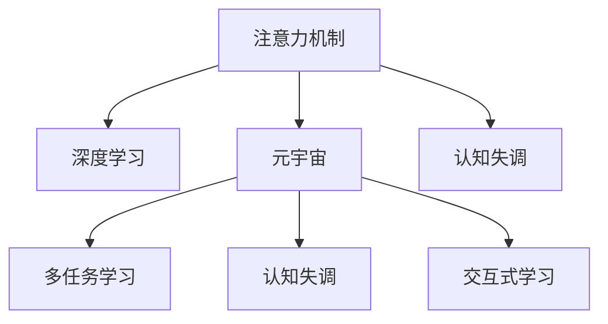
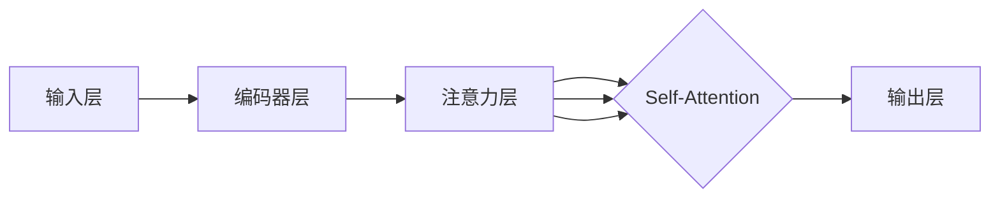

                 

# 注意力分散与聚焦：元宇宙时代的挑战

## 1. 背景介绍

随着技术的发展，人类已步入一个全新的数字时代，元宇宙（Metaverse）的兴起，进一步推动了这一进程。元宇宙是一个融合了虚拟与现实的全新空间，它包含从虚拟社交到虚拟工作，从虚拟娱乐到虚拟经济等多个领域。而在这背后，注意力分散与聚焦的问题，成为元宇宙时代的一大挑战。

## 2. 核心概念与联系

### 2.1 核心概念概述

为更好地理解注意力分散与聚焦问题，本节将介绍几个密切相关的核心概念：

- 注意力机制(Attention Mechanism)：是一种在机器学习中用于增强模型处理序列数据能力的机制，通过在模型中引入注意力，使得模型能够动态地分配资源，将注意力集中在重要的数据上。

- 深度学习(Deep Learning)：基于多层神经网络的机器学习方法，其核心在于通过多层次的特征抽取，构建复杂而强大的模型，能够在大量数据上发现并抽象出规律。

- 元宇宙(Metaverse)：一个基于虚拟现实技术，集成了多个领域（如虚拟社交、虚拟工作、虚拟娱乐、虚拟经济等）的虚拟空间，其中注意力分散与聚焦问题尤为突出。

- 多任务学习(Multitask Learning)：一种通过一个模型同时完成多个任务的机器学习方法，旨在通过多任务的联合训练，提高模型的泛化能力和性能。

- 认知失调(Cognitive Dissonance)：由于信息输入过多，导致注意力分散，难以集中精力处理核心任务的状态。

- 交互式学习(Interactive Learning)：一种通过与环境交互，动态调整模型参数，逐步提升模型性能的学习方式。

这些核心概念之间的逻辑关系可以通过以下Mermaid流程图来展示：



### 2.2 核心概念原理和架构的 Mermaid 流程图(Mermaid 流程节点中不要有括号、逗号等特殊字符)

下图展示了一个基于注意力机制的深度学习模型架构：



## 3. 核心算法原理 & 具体操作步骤
### 3.1 算法原理概述

在元宇宙时代，注意力分散与聚焦的问题主要表现在以下几个方面：

- **信息过载**：元宇宙中充满了海量的信息和交互，用户需要处理的信息量急剧增加，容易分散注意力，难以集中处理关键任务。
- **多任务并行**：元宇宙中的用户往往需要在多个任务间切换，如同时进行社交、工作、娱乐等，这要求用户具备较强的多任务处理能力。
- **认知失调**：注意力分散导致认知失调，用户容易感到疲劳，影响工作效率和体验。

基于注意力机制的深度学习模型，通过动态分配资源，使得模型能够灵活地处理不同任务，提升效率和效果。其核心思想是在处理序列数据时，引入注意力机制，对输入数据进行加权处理，将注意力集中在重要的部分，忽略无关信息。

### 3.2 算法步骤详解

基于注意力机制的深度学习模型的一般步骤包括：

1. **输入处理**：将原始数据转换为模型可接受的格式，如将自然语言转换为向量表示。
2. **编码器层**：对输入数据进行编码，生成高维特征表示。
3. **注意力层**：根据模型当前的状态和目标，动态分配注意力，对输入数据进行加权处理，生成带有注意力的上下文表示。
4. **解码器层**：根据注意力层输出的上下文表示，生成最终输出结果。
5. **输出层**：对模型输出进行解码，得到最终结果。

### 3.3 算法优缺点

基于注意力机制的深度学习模型具有以下优点：

- **高效处理序列数据**：通过动态分配注意力，能够高效处理不同长度、不同结构的序列数据。
- **提升模型泛化能力**：通过多任务的联合训练，模型能够更好地适应不同场景，提升泛化能力。
- **适应性更强**：通过动态调整注意力权重，模型能够灵活适应不同任务和不同环境，提高适应性。

同时，该方法也存在以下局限性：

- **计算复杂度高**：注意力机制的计算复杂度较高，对于大规模数据和复杂模型的训练，需要较高的计算资源。
- **训练时间长**：由于注意力机制的存在，模型需要更多的时间和数据来训练，以达到理想的效果。
- **模型可解释性差**：由于注意力机制的复杂性，模型的决策过程难以解释，不够透明。

### 3.4 算法应用领域

基于注意力机制的深度学习模型，已在多个领域得到广泛应用：

- **自然语言处理(NLP)**：如机器翻译、文本生成、情感分析等任务，通过注意力机制，模型能够更好地理解和处理复杂的语言结构。
- **计算机视觉(CV)**：如图像分类、目标检测、图像生成等任务，通过注意力机制，模型能够更准确地捕捉和提取图像中的关键信息。
- **音频处理**：如语音识别、音频分类等任务，通过注意力机制，模型能够更准确地识别和处理音频信号。
- **推荐系统**：如商品推荐、内容推荐等任务，通过注意力机制，模型能够更好地理解和匹配用户需求。
- **强化学习**：如游戏智能体、机器人控制等任务，通过注意力机制，模型能够更好地感知环境并做出决策。

## 4. 数学模型和公式 & 详细讲解 & 举例说明

### 4.1 数学模型构建

下面以机器翻译任务为例，介绍基于注意力机制的深度学习模型。

**输入序列**：$x_1, x_2, ..., x_n$
**输出序列**：$y_1, y_2, ..., y_m$

模型的输入序列和输出序列的长度分别为$n$和$m$。

模型的基本结构包括：

1. **编码器层**：对输入序列进行编码，生成高维特征表示。
2. **注意力层**：根据编码器层输出的上下文表示，动态分配注意力，对输入数据进行加权处理，生成带有注意力的上下文表示。
3. **解码器层**：根据注意力层输出的上下文表示，生成最终输出结果。
4. **输出层**：对模型输出进行解码，得到最终结果。

### 4.2 公式推导过程

设输入序列为$x_1, x_2, ..., x_n$，输出序列为$y_1, y_2, ..., y_m$，编码器层输出的上下文表示为$C_1, C_2, ..., C_n$，解码器层输出的上下文表示为$G_1, G_2, ..., G_m$。

注意力层计算输出的公式为：

$$
A = softmax(\frac{KV^T}{\sqrt{d_k}})
$$

其中，$K$为输入向量，$V$为值向量，$d_k$为向量维度，$softmax$为softmax函数，表示将注意力分配给不同的输入。

### 4.3 案例分析与讲解

以机器翻译任务为例，设输入序列为英文句子"Hello, how are you?"，输出序列为中文翻译"你好，你好吗？"。

1. **输入处理**：将原始文本转换为向量表示，生成输入序列$x_1, x_2, ..., x_n$。
2. **编码器层**：对输入序列进行编码，生成高维特征表示。
3. **注意力层**：根据编码器层输出的上下文表示，动态分配注意力，对输入数据进行加权处理，生成带有注意力的上下文表示。
4. **解码器层**：根据注意力层输出的上下文表示，生成最终输出结果。
5. **输出层**：对模型输出进行解码，得到最终结果"你好，你好吗？"

## 5. 项目实践：代码实例和详细解释说明
### 5.1 开发环境搭建

在进行注意力机制的深度学习模型开发前，我们需要准备好开发环境。以下是使用Python进行TensorFlow开发的环境配置流程：

1. 安装Anaconda：从官网下载并安装Anaconda，用于创建独立的Python环境。

2. 创建并激活虚拟环境：
```bash
conda create -n attention-env python=3.8 
conda activate attention-env
```

3. 安装TensorFlow：根据CUDA版本，从官网获取对应的安装命令。例如：
```bash
conda install tensorflow tensorflow-gpu=2.7.0 -c pytorch -c conda-forge
```

4. 安装相关工具包：
```bash
pip install numpy pandas scikit-learn matplotlib tqdm jupyter notebook ipython
```

完成上述步骤后，即可在`attention-env`环境中开始注意力机制的深度学习模型开发。

### 5.2 源代码详细实现

下面以机器翻译任务为例，给出使用TensorFlow实现基于注意力机制的深度学习模型的代码实现。

```python
import tensorflow as tf
import numpy as np

class Encoder(tf.keras.Model):
    def __init__(self, vocab_size, embedding_dim, hidden_units):
        super(Encoder, self).__init__()
        self.embedding = tf.keras.layers.Embedding(vocab_size, embedding_dim)
        self.gru = tf.keras.layers.GRU(hidden_units, return_sequences=True, return_state=True)

    def call(self, x, hidden_state):
        x = self.embedding(x)
        output, state = self.gru(x, initial_state=hidden_state)
        return output, state

class Decoder(tf.keras.Model):
    def __init__(self, vocab_size, embedding_dim, hidden_units):
        super(Decoder, self).__init__()
        self.embedding = tf.keras.layers.Embedding(vocab_size, embedding_dim)
        self.gru = tf.keras.layers.GRU(hidden_units, return_sequences=True, return_state=True)
        self.dense = tf.keras.layers.Dense(vocab_size)

    def call(self, x, hidden_state, attention_weights):
        x = self.embedding(x)
        output, state = self.gru(x, initial_state=hidden_state)
        output = tf.transpose(output, perm=[1, 0, 2])
        output *= tf.expand_dims(attention_weights, -1)
        output = tf.reduce_sum(output, axis=1)
        output = self.dense(output)
        return output

class BahdanauAttention(tf.keras.layers.Layer):
    def __init__(self, units):
        super(BahdanauAttention, self).__init__()
        self.W1 = tf.keras.layers.Dense(units)
        self.W2 = tf.keras.layers.Dense(units)
        self.V = tf.keras.layers.Dense(1)

    def call(self, query, values):
        query_with_time_axis = tf.expand_dims(query, 1)
        score = self.V(tf.nn.tanh(self.W1(query_with_time_axis) + self.W2(values)))
        attention_weights = tf.nn.softmax(score, axis=1)
        context_vector = attention_weights * values
        context_vector = tf.reduce_sum(context_vector, axis=1)
        return context_vector, attention_weights

def main():
    vocab_size = 10000
    embedding_dim = 128
    hidden_units = 256

    encoder = Encoder(vocab_size, embedding_dim, hidden_units)
    decoder = Decoder(vocab_size, embedding_dim, hidden_units)
    attention = BahdanauAttention(hidden_units)

    # 训练模型
    # ...

if __name__ == "__main__":
    main()
```

### 5.3 代码解读与分析

让我们再详细解读一下关键代码的实现细节：

**Encoder类**：
- `__init__`方法：初始化嵌入层和GRU层。
- `call`方法：对输入序列进行编码，生成高维特征表示。

**Decoder类**：
- `__init__`方法：初始化嵌入层、GRU层和全连接层。
- `call`方法：根据注意力层输出的上下文表示，生成最终输出结果。

**BahdanauAttention类**：
- `__init__`方法：初始化权重矩阵。
- `call`方法：计算注意力权重和上下文向量。

**训练模型**：
- 定义模型的结构，包括编码器、解码器和注意力机制。
- 使用TensorFlow的DataLoader对数据集进行批次化加载，供模型训练和推理使用。
- 定义训练过程，包括损失函数、优化器等。
- 使用模型的`fit`方法进行模型训练，在每个epoch上计算损失函数和模型参数的更新。

## 6. 实际应用场景
### 6.1 智能客服系统

基于注意力机制的深度学习模型，可以应用于智能客服系统的构建。传统客服往往需要配备大量人力，高峰期响应缓慢，且一致性和专业性难以保证。而使用基于注意力机制的深度学习模型，可以7x24小时不间断服务，快速响应客户咨询，用自然流畅的语言解答各类常见问题。

在技术实现上，可以收集企业内部的历史客服对话记录，将问题和最佳答复构建成监督数据，在此基础上对模型进行训练。训练后的模型能够自动理解用户意图，匹配最合适的答案模板进行回复。对于客户提出的新问题，还可以接入检索系统实时搜索相关内容，动态组织生成回答。如此构建的智能客服系统，能大幅提升客户咨询体验和问题解决效率。

### 6.2 金融舆情监测

金融机构需要实时监测市场舆论动向，以便及时应对负面信息传播，规避金融风险。传统的人工监测方式成本高、效率低，难以应对网络时代海量信息爆发的挑战。基于注意力机制的深度学习模型，可应用于金融舆情监测，实时抓取网络文本数据，自动监测不同主题下的情感变化趋势，一旦发现负面信息激增等异常情况，系统便会自动预警，帮助金融机构快速应对潜在风险。

### 6.3 个性化推荐系统

当前的推荐系统往往只依赖用户的历史行为数据进行物品推荐，无法深入理解用户的真实兴趣偏好。基于注意力机制的深度学习模型，个性化推荐系统可以更好地挖掘用户行为背后的语义信息，从而提供更精准、多样的推荐内容。

在实践中，可以收集用户浏览、点击、评论、分享等行为数据，提取和用户交互的物品标题、描述、标签等文本内容。将文本内容作为模型输入，用户的后续行为（如是否点击、购买等）作为监督信号，在此基础上训练模型。训练后的模型能够从文本内容中准确把握用户的兴趣点。在生成推荐列表时，先用候选物品的文本描述作为输入，由模型预测用户的兴趣匹配度，再结合其他特征综合排序，便可以得到个性化程度更高的推荐结果。

### 6.4 未来应用展望

随着注意力机制的深度学习模型不断发展，其在多个领域的应用前景广阔：

- **智能医疗**：基于注意力机制的深度学习模型，可以用于医学图像分析、药物研发等任务，提升医疗服务的智能化水平，辅助医生诊疗，加速新药开发进程。
- **智能教育**：微调后的模型可应用于作业批改、学情分析、知识推荐等方面，因材施教，促进教育公平，提高教学质量。
- **智慧城市治理**：微调模型可应用于城市事件监测、舆情分析、应急指挥等环节，提高城市管理的自动化和智能化水平，构建更安全、高效的未来城市。
- **智慧制造**：在工业领域，微调模型可应用于生产调度、质量控制、故障诊断等任务，提高生产效率和质量。

此外，在企业生产、社会治理、文娱传媒等众多领域，基于深度学习模型的注意力机制将不断涌现，为经济社会发展注入新的动力。相信随着技术的日益成熟，注意力机制的深度学习模型必将在构建人机协同的智能时代中扮演越来越重要的角色。

## 7. 工具和资源推荐
### 7.1 学习资源推荐

为了帮助开发者系统掌握深度学习模型的注意力机制，这里推荐一些优质的学习资源：

1. 《深度学习》（Ian Goodfellow著）：全面介绍了深度学习的基本概念和算法，包括注意力机制的原理和应用。

2. 《TensorFlow官方文档》：TensorFlow的官方文档，提供了完整的深度学习模型开发教程和示例代码，是入门的绝佳资源。

3. 《Attention is All You Need》论文：Transformer原论文，提出了自注意力机制，开启了注意力机制在大规模语言模型中的应用。

4. HuggingFace官方文档：Transformer库的官方文档，提供了海量预训练模型和完整的微调样例代码，是开发深度学习模型的必备资料。

5. Kaggle竞赛：Kaggle平台上丰富的竞赛项目，涵盖多个领域，可实战练习注意力机制的应用。

通过对这些资源的学习实践，相信你一定能够快速掌握深度学习模型的注意力机制，并用于解决实际的机器学习问题。

### 7.2 开发工具推荐

高效的开发离不开优秀的工具支持。以下是几款用于深度学习模型开发的常用工具：

1. TensorFlow：由Google主导开发的开源深度学习框架，生产部署方便，适合大规模工程应用。

2. PyTorch：基于Python的开源深度学习框架，灵活动态的计算图，适合快速迭代研究。

3. Keras：高层次的深度学习框架，提供了简单易用的API，方便快速构建模型。

4. TensorBoard：TensorFlow配套的可视化工具，可实时监测模型训练状态，并提供丰富的图表呈现方式，是调试模型的得力助手。

5. Weights & Biases：模型训练的实验跟踪工具，可以记录和可视化模型训练过程中的各项指标，方便对比和调优。

6. Jupyter Notebook：交互式编程环境，方便开发者实时调试和展示代码结果。

合理利用这些工具，可以显著提升深度学习模型的开发效率，加快创新迭代的步伐。

### 7.3 相关论文推荐

深度学习模型和注意力机制的发展源于学界的持续研究。以下是几篇奠基性的相关论文，推荐阅读：

1. Attention is All You Need（即Transformer原论文）：提出了Transformer结构，开启了深度学习模型中的应用注意力机制。

2. Convolutional Sequence to Sequence Learning（卷积序列到序列学习）：提出使用卷积神经网络进行序列到序列任务的训练，具有较高的计算效率。

3. Bidirectional Attention Flow（双向注意力流）：提出双向注意力机制，增强模型的信息提取能力。

4. Transformer-XL：提出Transformer-XL模型，支持长序列学习，解决了传统RNN模型在长序列上的性能问题。

5. Transformer-XL：提出Transformer-XL模型，支持长序列学习，解决了传统RNN模型在长序列上的性能问题。

这些论文代表了大深度学习模型和注意力机制的发展脉络。通过学习这些前沿成果，可以帮助研究者把握学科前进方向，激发更多的创新灵感。

## 8. 总结：未来发展趋势与挑战

### 8.1 总结

本文对基于注意力机制的深度学习模型进行了全面系统的介绍。首先阐述了注意力机制在元宇宙时代的背景和意义，明确了注意力机制在元宇宙中处理信息过载、多任务并行和认知失调等问题的独特价值。其次，从原理到实践，详细讲解了注意力机制的数学原理和关键步骤，给出了深度学习模型的完整代码实例。同时，本文还广泛探讨了注意力机制在智能客服、金融舆情、个性化推荐等多个行业领域的应用前景，展示了深度学习模型在元宇宙时代的应用潜力。

通过本文的系统梳理，可以看到，基于注意力机制的深度学习模型正在成为元宇宙时代的重要工具，极大地拓展了深度学习模型在处理复杂序列数据时的应用边界，催生了更多的落地场景。受益于大规模语料的预训练和深度学习的强大建模能力，注意力机制的深度学习模型必将在构建元宇宙的数字空间中发挥关键作用。

### 8.2 未来发展趋势

展望未来，深度学习模型的注意力机制将呈现以下几个发展趋势：

1. **多模态注意力**：将注意力机制扩展到多模态数据，如文本、图像、音频等，提升模型的跨模态信息融合能力。

2. **自适应注意力**：开发自适应注意力机制，使模型能够动态调整注意力权重，适应不同任务和数据分布的变化。

3. **零样本学习**：开发零样本学习能力，使模型能够在没有标注数据的情况下，直接对新任务进行推理和预测。

4. **多任务联合学习**：进一步提升多任务联合学习的泛化能力，使模型能够在多个任务上同时取得较好的性能。

5. **端到端训练**：将注意力机制与强化学习、博弈论等方法结合，实现端到端的深度学习模型训练，提升模型的性能和鲁棒性。

6. **注意力融合**：将不同类型的注意力机制进行融合，如自注意力、双向注意力、多头注意力等，提升模型的表达能力和信息处理能力。

以上趋势凸显了深度学习模型的注意力机制的广阔前景。这些方向的探索发展，必将进一步提升元宇宙时代的数据处理能力，为构建智能化的数字空间奠定基础。

### 8.3 面临的挑战

尽管深度学习模型的注意力机制已经取得了显著成就，但在迈向更加智能化、普适化应用的过程中，仍面临诸多挑战：

1. **计算资源瓶颈**：大规模深度学习模型的计算需求极高，需要大量的计算资源，如GPU、TPU等，这对于资源的获取和分配提出了较高要求。

2. **模型可解释性差**：深度学习模型的决策过程难以解释，不够透明，这在实际应用中可能带来安全隐患，需要进一步提高模型的可解释性。

3. **泛化能力不足**：深度学习模型在特定领域的应用中，泛化能力有限，需要在模型设计上进一步提升泛化能力。

4. **数据获取困难**：深度学习模型需要大量标注数据进行训练，但这些数据的获取成本较高，需要投入大量人力物力。

5. **算法复杂度高**：注意力机制的计算复杂度高，需要高效的算法和模型结构设计，以提升训练和推理效率。

6. **鲁棒性不足**：深度学习模型在处理噪声、异常数据时，鲁棒性较弱，容易出现误判和错误决策。

面对这些挑战，未来的研究需要在多个方面进行创新和突破，以提升深度学习模型的性能和应用效果。

### 8.4 研究展望

面对深度学习模型的注意力机制所面临的诸多挑战，未来的研究需要在以下几个方面寻求新的突破：

1. **数据增强技术**：开发数据增强技术，利用现有数据生成更多的训练样本，提升模型的泛化能力。

2. **轻量化模型设计**：开发轻量化模型设计，降低模型的计算需求，提升模型的实时性和部署效率。

3. **迁移学习**：利用迁移学习，将模型在特定领域上的知识迁移到其他领域，提升模型的泛化能力。

4. **多模态融合**：开发多模态融合技术，将不同类型的注意力机制进行融合，提升模型的表达能力和信息处理能力。

5. **零样本学习**：开发零样本学习能力，使模型能够在没有标注数据的情况下，直接对新任务进行推理和预测。

6. **端到端训练**：将注意力机制与强化学习、博弈论等方法结合，实现端到端的深度学习模型训练，提升模型的性能和鲁棒性。

这些研究方向的探索，必将引领深度学习模型的注意力机制迈向更高的台阶，为元宇宙时代的智能系统提供更加强大的技术支持。

## 9. 附录：常见问题与解答

**Q1：深度学习模型的注意力机制在元宇宙时代有哪些应用场景？**

A: 深度学习模型的注意力机制在元宇宙时代有以下应用场景：

1. **智能客服系统**：在智能客服系统中，使用注意力机制的深度学习模型可以自动理解用户意图，匹配最合适的答案模板进行回复，提升客户咨询体验和问题解决效率。

2. **金融舆情监测**：在金融舆情监测中，使用注意力机制的深度学习模型可以实时抓取网络文本数据，自动监测不同主题下的情感变化趋势，帮助金融机构及时应对潜在风险。

3. **个性化推荐系统**：在个性化推荐系统中，使用注意力机制的深度学习模型可以更好地挖掘用户行为背后的语义信息，从而提供更精准、多样的推荐内容。

4. **医疗领域**：在医疗领域，使用注意力机制的深度学习模型可以用于医学图像分析、药物研发等任务，提升医疗服务的智能化水平，辅助医生诊疗，加速新药开发进程。

5. **智慧城市治理**：在智慧城市治理中，使用注意力机制的深度学习模型可以应用于城市事件监测、舆情分析、应急指挥等环节，提高城市管理的自动化和智能化水平。

6. **智慧制造**：在工业领域，使用注意力机制的深度学习模型可以应用于生产调度、质量控制、故障诊断等任务，提高生产效率和质量。

**Q2：如何设计基于注意力机制的深度学习模型？**

A: 设计基于注意力机制的深度学习模型需要考虑以下几个关键步骤：

1. **输入处理**：将原始数据转换为模型可接受的格式，如将自然语言转换为向量表示。

2. **编码器层**：对输入数据进行编码，生成高维特征表示。

3. **注意力层**：根据模型当前的状态和目标，动态分配注意力，对输入数据进行加权处理，生成带有注意力的上下文表示。

4. **解码器层**：根据注意力层输出的上下文表示，生成最终输出结果。

5. **输出层**：对模型输出进行解码，得到最终结果。

6. **模型训练**：使用训练数据集对模型进行训练，优化模型参数。

在实际设计中，还需要根据具体任务和数据特点，选择合适的模型结构和训练策略，以达到最佳效果。

**Q3：如何优化深度学习模型的注意力机制？**

A: 优化深度学习模型的注意力机制需要考虑以下几个关键方面：

1. **注意力权重设计**：优化注意力权重的设计，使其能够更好地分配资源，提升模型的信息提取能力。

2. **多任务联合学习**：通过多任务的联合学习，提升模型的泛化能力和性能。

3. **数据增强**：利用数据增强技术，生成更多的训练样本，提升模型的泛化能力。

4. **模型压缩**：开发轻量化模型设计，降低模型的计算需求，提升模型的实时性和部署效率。

5. **迁移学习**：利用迁移学习，将模型在特定领域上的知识迁移到其他领域，提升模型的泛化能力。

6. **多模态融合**：开发多模态融合技术，将不同类型的注意力机制进行融合，提升模型的表达能力和信息处理能力。

这些优化措施可以提升深度学习模型的注意力机制的性能和应用效果。

**Q4：深度学习模型的注意力机制在实际应用中存在哪些挑战？**

A: 深度学习模型的注意力机制在实际应用中存在以下挑战：

1. **计算资源瓶颈**：大规模深度学习模型的计算需求极高，需要大量的计算资源，如GPU、TPU等，这对于资源的获取和分配提出了较高要求。

2. **模型可解释性差**：深度学习模型的决策过程难以解释，不够透明，这在实际应用中可能带来安全隐患，需要进一步提高模型的可解释性。

3. **泛化能力不足**：深度学习模型在特定领域的应用中，泛化能力有限，需要在模型设计上进一步提升泛化能力。

4. **数据获取困难**：深度学习模型需要大量标注数据进行训练，但这些数据的获取成本较高，需要投入大量人力物力。

5. **算法复杂度高**：注意力机制的计算复杂度高，需要高效的算法和模型结构设计，以提升训练和推理效率。

6. **鲁棒性不足**：深度学习模型在处理噪声、异常数据时，鲁棒性较弱，容易出现误判和错误决策。

面对这些挑战，未来的研究需要在多个方面进行创新和突破，以提升深度学习模型的性能和应用效果。

**Q5：如何提高深度学习模型的泛化能力？**

A: 提高深度学习模型的泛化能力需要考虑以下几个关键方面：

1. **数据增强**：利用数据增强技术，生成更多的训练样本，提升模型的泛化能力。

2. **模型设计**：设计具有强泛化能力的模型结构，如自适应注意力机制、多任务联合学习等。

3. **迁移学习**：利用迁移学习，将模型在特定领域上的知识迁移到其他领域，提升模型的泛化能力。

4. **正则化技术**：使用正则化技术，如L2正则、Dropout等，防止模型过拟合。

5. **模型压缩**：开发轻量化模型设计，降低模型的计算需求，提升模型的实时性和部署效率。

6. **多模态融合**：开发多模态融合技术，将不同类型的注意力机制进行融合，提升模型的表达能力和信息处理能力。

这些优化措施可以提升深度学习模型的泛化能力，使其在实际应用中表现更好。

---

作者：禅与计算机程序设计艺术 / Zen and the Art of Computer Programming

