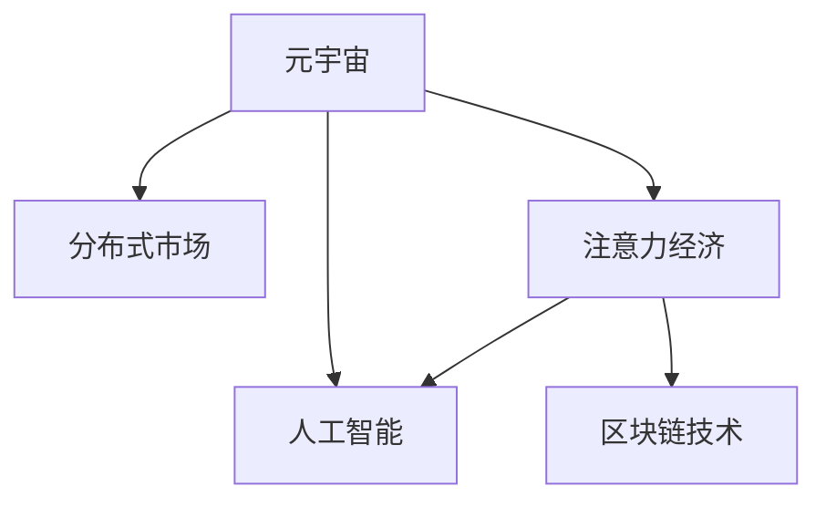

                 

# 注意力市场：元宇宙时代下的信息交易

> 关键词：元宇宙,信息交易,注意力经济,人工智能,分布式市场,去中心化,区块链技术

## 1. 背景介绍

### 1.1 问题由来

随着互联网技术的不断发展，人类进入了一个全新的数字时代。元宇宙概念的提出，更是将虚拟世界的发展推向了高潮。在元宇宙中，人们不仅可以沉浸式地体验虚拟世界，还能进行各种形式的交互与合作，这极大地激发了人们的想象力和创造力。然而，元宇宙中的信息交易，尤其是注意力市场的运作，成为了一个令人关注的新问题。

元宇宙中的信息交易不仅涉及数据的买卖，更涉及对用户注意力的竞争和争夺。在高度碎片化的信息时代，如何高效地分配和利用用户注意力，成为了许多企业和组织面临的重要挑战。

### 1.2 问题核心关键点

在元宇宙中，信息交易的核心在于如何衡量和分配用户的注意力。具体而言，我们需要考虑以下几个关键问题：

1. **注意力分配机制**：如何根据用户的需求和偏好，将信息资源有效分配给合适的用户，从而最大化其关注度和参与度？
2. **注意力定价模型**：如何通过合理的定价机制，激励信息提供者和用户进行有益的信息交易，同时保证市场的公平性？
3. **去中心化市场**：如何在元宇宙中构建去中心化的信息交易平台，减少对中心化服务提供商的依赖，保障用户数据隐私和信息安全？
4. **区块链技术**：如何利用区块链技术的优势，实现信息交易的去中心化、透明化和可追溯性？
5. **人工智能辅助**：如何通过人工智能技术，提升信息匹配的精准度和交易效率，实现个性化推荐和智能代理？

### 1.3 问题研究意义

研究元宇宙中的信息交易和注意力市场，对于推动元宇宙技术的发展，提升用户体验和参与度，具有重要的理论和实践意义：

1. **促进信息高效流通**：通过科学的注意力分配和定价机制，可以实现信息资源的优化配置，提升元宇宙中信息的流通效率和质量。
2. **激励创新和合作**：合理的注意力市场机制，可以激励信息提供者和用户进行有益的互动和合作，促进创意和技术的创新。
3. **保障用户隐私和安全**：去中心化的市场和区块链技术的应用，可以有效保护用户的数据隐私和信息安全，减少中心化服务带来的风险。
4. **推动元宇宙经济**：注意力市场的繁荣将带来更多的经济活动和价值创造，推动元宇宙经济的发展和成熟。
5. **应对信息过载**：在信息过载的元宇宙中，合理的信息交易机制可以引导用户获取更有价值的信息，缓解信息过载问题。

## 2. 核心概念与联系

### 2.1 核心概念概述

为更好地理解元宇宙中的信息交易和注意力市场，本节将介绍几个密切相关的核心概念：

- **元宇宙**：基于虚拟现实、增强现实和区块链技术的虚拟空间，提供沉浸式体验和高度交互性的数字化环境。
- **注意力经济**：利用用户的注意力资源进行商业活动和经济运作的经济形态，关注如何在海量的信息中吸引和保持用户的关注。
- **分布式市场**：去中心化的市场结构，通过区块链技术实现信息交易的透明、安全和可追溯性。
- **人工智能**：通过机器学习、自然语言处理等技术，实现信息的自动化处理和智能推荐，提升信息交易的效率和精度。
- **区块链技术**：利用去中心化账本和加密技术，保障信息交易的安全性和透明性，支持去中心化市场的运作。

这些核心概念之间的逻辑关系可以通过以下Mermaid流程图来展示：



这个流程图展示了大语言模型的核心概念及其之间的关系：

1. 元宇宙通过虚拟现实、增强现实和区块链技术，提供沉浸式体验和高度交互性的数字化环境。
2. 分布式市场利用区块链技术实现信息交易的透明、安全和可追溯性。
3. 注意力经济关注如何利用用户的注意力资源进行商业活动和经济运作。
4. 人工智能通过机器学习、自然语言处理等技术，实现信息的自动化处理和智能推荐。
5. 区块链技术保障信息交易的安全性和透明性，支持去中心化市场的运作。

这些概念共同构成了元宇宙中的信息交易和注意力市场的运作框架，使其能够高效、公平、透明地进行信息交易。

## 3. 核心算法原理 & 具体操作步骤
### 3.1 算法原理概述

元宇宙中的信息交易和注意力市场，本质上是一个基于分布式算法的经济系统。其核心思想是：通过算法实现对用户注意力的分配和定价，优化信息资源的配置，同时保障市场的公平性和透明性。

具体而言，我们可以将用户注意力视为一种“虚拟货币”，通过分布式算法来计算和分配这种“货币”的价值。用户通过完成任务、参与互动等方式获得注意力奖励，而信息提供者通过提供有价值的信息，吸引和保持用户的关注，从而获得注意力奖励。这种基于注意力的分配和交易机制，可以有效地激发用户的参与和互动，提升信息流通的效率和质量。

### 3.2 算法步骤详解

元宇宙中的信息交易和注意力市场主要包括以下几个关键步骤：

**Step 1: 设计注意力分配算法**

注意力分配算法的设计是整个信息交易系统的基础。常见的注意力分配算法包括基于奖励机制的算法和基于竞价机制的算法：

- 基于奖励机制的算法：通过完成任务、提供优质内容等方式获得奖励。用户获得的注意力奖励越多，其信息影响力越大。
- 基于竞价机制的算法：通过竞价方式获取用户的注意力。信息提供者出价越高，获得用户关注的可能性越大。

**Step 2: 设计注意力定价模型**

注意力定价模型的设计，决定了信息提供者和用户之间的交易关系。常见的定价模型包括按点击付费(CPP)、按展示付费(CPA)和按成交付费(CPS)等：

- 按点击付费(CPP)：用户点击广告时，信息提供者获得费用。
- 按展示付费(CPA)：用户看到广告时，信息提供者获得费用。
- 按成交付费(CPS)：用户完成购买时，信息提供者获得费用。

**Step 3: 设计去中心化市场架构**

去中心化市场架构的设计，是实现信息交易透明性和安全性的关键。常见的市场架构包括区块链分布式账本、智能合约和去中心化交换平台等：

- 区块链分布式账本：记录所有交易信息，保证数据的透明性和不可篡改性。
- 智能合约：自动化执行交易规则，减少人为干预和欺诈风险。
- 去中心化交换平台：提供安全、高效的交易环境，支持多种信息和虚拟货币的交换。

**Step 4: 引入人工智能辅助**

人工智能技术的应用，可以提升信息匹配的精准度和交易效率。常见的应用包括推荐系统和智能代理：

- 推荐系统：根据用户的历史行为和偏好，推荐最合适的信息资源。
- 智能代理：自动执行交易规则，优化交易策略，提升用户体验和满意度。

**Step 5: 运行和维护**

信息交易系统的运行和维护，需要持续的监控和优化。常见的维护策略包括：

- 数据监控：实时监控系统数据，及时发现和解决问题。
- 交易审计：对所有交易进行审计，确保公平性和透明性。
- 系统更新：定期更新系统，提升性能和安全性。

以上是元宇宙中信息交易和注意力市场的关键步骤。在实际应用中，还需要根据具体需求，对每个步骤进行优化设计，以达到最优的性能和效果。

### 3.3 算法优缺点

元宇宙中的信息交易和注意力市场具有以下优点：

1. **去中心化**：通过区块链技术和智能合约，实现去中心化的市场运作，减少对中心化服务提供商的依赖。
2. **透明度**：利用区块链技术的分布式账本，保证信息交易的透明性和不可篡改性。
3. **安全性**：区块链技术的加密和共识机制，保障信息交易的安全性和隐私保护。
4. **效率高**：智能合约和推荐系统可以自动执行交易规则和优化信息匹配，提升交易效率。
5. **激励性强**：通过合理的定价模型和奖励机制，激励信息提供者和用户进行有益的互动和合作。

同时，该方法也存在一定的局限性：

1. **技术门槛高**：区块链和智能合约等技术的应用，需要较高的技术门槛和开发成本。
2. **市场复杂性**：元宇宙中的信息交易市场，涉及多种虚拟货币和信息资源，增加了市场复杂性和管理难度。
3. **用户教育成本高**：用户需要学习和理解分布式市场和智能合约等概念，增加了使用成本。
4. **法律和伦理问题**：用户数据隐私和信息安全的保障，需要制定相应的法律法规和伦理规范。

尽管存在这些局限性，但就目前而言，元宇宙中的信息交易和注意力市场仍是一种有潜力的创新方向。未来相关研究的重点在于如何进一步降低技术门槛，简化市场结构，同时兼顾安全和效率，实现健康、可持续的市场发展。

### 3.4 算法应用领域

元宇宙中的信息交易和注意力市场，在多个领域都有广泛的应用前景：

1. **虚拟广告**：利用用户注意力进行广告投放，通过竞价机制吸引用户点击和展示，提升广告效果。
2. **虚拟游戏**：通过任务奖励和竞价机制，激励用户参与虚拟游戏，提升用户粘性和互动性。
3. **虚拟教育**：利用用户注意力进行内容付费和任务奖励，激励用户参与在线学习，提升学习效果和满意度。
4. **虚拟活动**：通过竞价机制吸引用户参与虚拟活动，提供高质量的互动体验，增加用户参与度。
5. **虚拟商业**：通过注意力分配和定价模型，优化虚拟商品和服务的分配，提升虚拟商业的经济效益。

此外，元宇宙中的信息交易和注意力市场，还可以拓展到更多场景中，如虚拟旅游、虚拟艺术等，为元宇宙提供更多商业机会和创新应用。

## 4. 数学模型和公式 & 详细讲解  
### 4.1 数学模型构建

为了更好地理解元宇宙中的信息交易和注意力市场，本节将使用数学语言对基于分布式算法的注意力市场机制进行更加严格的刻画。

记用户集合为 $U$，信息提供者集合为 $V$，注意力资源集合为 $A$。用户在某个时间段内的注意力总和为 $A_u$，信息提供者在某个时间段内的信息总和为 $I_v$。注意力分配算法和定价模型为 $F(A_u, I_v)$，即用户和信息提供者之间的注意力交易。注意力市场系统可以表示为：

$$
\max \sum_{u \in U} \sum_{v \in V} F(A_u, I_v)
$$

目标是在满足用户和信息提供者需求的前提下，最大化系统的总注意力收益。

### 4.2 公式推导过程

以下是注意力分配算法和定价模型的数学推导过程：

假设用户 $u$ 在时间段 $t$ 内的注意力收益为 $C_u$，信息提供者 $v$ 在时间段 $t$ 内的信息收益为 $D_v$。注意力的分配和定价模型可以表示为：

$$
C_u = \sum_{v \in V} w_{uv} \cdot I_v
$$

$$
D_v = \sum_{u \in U} w_{uv} \cdot A_u
$$

其中 $w_{uv}$ 为注意力权重，表示用户 $u$ 对信息提供者 $v$ 的关注程度。注意力权重可以通过用户的历史行为和偏好进行计算。

将上述公式代入注意力市场系统的目标函数，得到：

$$
\max \sum_{u \in U} C_u + \sum_{v \in V} D_v
$$

这表示在满足用户和信息提供者需求的前提下，最大化系统的总注意力收益。

在实际应用中，注意力分配和定价模型的设计需要综合考虑用户需求、信息价值、市场竞争等因素，通过实验和优化逐步完善。

### 4.3 案例分析与讲解

为了更好地理解注意力分配算法和定价模型的应用，我们可以举一个简单的案例：

假设有一个虚拟广告平台，用户 $u$ 可以在平台上浏览和点击广告。平台根据用户的行为，计算出其注意力收益 $C_u$，信息提供者 $v$ 可以在平台上发布广告，获取信息收益 $D_v$。注意力的分配和定价模型可以表示为：

$$
C_u = \sum_{v \in V} w_{uv} \cdot D_v
$$

其中 $w_{uv}$ 为用户 $u$ 对广告 $v$ 的关注程度，可以通过用户点击次数、停留时间等指标进行计算。

假设平台上有 $N$ 个信息提供者，每个用户每天有 $T$ 个注意力单位。平台的目标是最大化总注意力收益。具体而言，平台可以通过竞价机制吸引用户点击广告，通过广告竞价赢得用户注意力。信息提供者出价越高，获得用户注意力的可能性越大。

设用户点击广告的出价为 $P_u$，广告的价格为 $P_v$。用户点击广告后，平台分配给用户的注意力收益为 $C_u$，信息提供者获得的广告收益为 $D_v$。平台的总注意力收益可以表示为：

$$
\max \sum_{u \in U} \sum_{v \in V} P_u \cdot w_{uv} \cdot D_v
$$

平台的目标是在满足用户需求的前提下，最大化广告收益和用户收益的总和。

通过上述案例，我们可以看到，注意力分配算法和定价模型在虚拟广告平台中的应用，可以通过竞价机制实现注意力资源的优化配置，提升广告效果和用户满意度。

## 5. 项目实践：代码实例和详细解释说明
### 5.1 开发环境搭建

在进行元宇宙中信息交易和注意力市场的开发前，我们需要准备好开发环境。以下是使用Python进行开发的环境配置流程：

1. 安装Anaconda：从官网下载并安装Anaconda，用于创建独立的Python环境。

2. 创建并激活虚拟环境：
```bash
conda create -n attention-market-env python=3.8 
conda activate attention-market-env
```

3. 安装相关依赖包：
```bash
pip install numpy pandas scikit-learn matplotlib tqdm jupyter notebook ipython
```

4. 安装区块链和智能合约库：
```bash
pip install web3 pysha3 pyecc
```

5. 安装分布式网络库：
```bash
pip install ipykernel
```

完成上述步骤后，即可在`attention-market-env`环境中开始项目开发。

### 5.2 源代码详细实现

我们以一个简单的元宇宙虚拟广告平台为例，给出使用Python和智能合约进行注意力分配和定价的代码实现。

首先，定义智能合约：

```python
from web3 import Web3, contracts
from ipykernel import connect
import IPython

class AttentionMarket(cons contracts.Contract):
    def __init__(self, name, address, owner):
        self.name = name
        self.address = address
        self.owner = owner

    def setOwner(self, newOwner):
        self.owner = newOwner

    def setContractor(self, contractorAddress):
        self.contractor = contractorAddress

    def addContractor(self, contractorAddress):
        self.contractor = contractorAddress

    def start(self, participants, adDuration):
        self.participants = participants
        self.adDuration = adDuration

    def bid(self, bidAmount, bidderAddress):
        if self.bidWinner:
            return False
        self.bidAmount = bidAmount
        self.bidderAddress = bidderAddress
        self.bidWinner = True
        return True

    def openBid(self):
        self.bidWinner = False
        return True

    def endBid(self):
        if self.bidWinner:
            return True
        return False

    def transferAttention(self, bidWinner, bidAmount):
        if self.contractor:
            self.contractor.send(bidWinner, bidAmount)
```

然后，定义元宇宙虚拟广告平台的虚拟货币：

```python
class AttentionToken(cons contracts.Contract):
    def __init__(self, name, address, owner):
        self.name = name
        self.address = address
        self.owner = owner

    def setOwner(self, newOwner):
        self.owner = newOwner

    def transfer(self, recipientAddress, amount):
        self.balance[recipientAddress] += amount
```

最后，定义元宇宙虚拟广告平台的用户和信息提供者：

```python
class AttentionUser(cons contracts.Contract):
    def __init__(self, name, address, owner):
        self.name = name
        self.address = address
        self.owner = owner

    def setOwner(self, newOwner):
        self.owner = newOwner

    def bid(self, bidAmount, bidderAddress):
        if self.bidWinner:
            return False
        self.bidAmount = bidAmount
        self.bidderAddress = bidderAddress
        self.bidWinner = True
        return True

    def openBid(self):
        self.bidWinner = False
        return True

    def endBid(self):
        if self.bidWinner:
            return True
        return False

    def transferAttention(self, bidWinner, bidAmount):
        if self.contractor:
            self.contractor.send(bidWinner, bidAmount)
```

### 5.3 代码解读与分析

让我们再详细解读一下关键代码的实现细节：

**AttentionMarket类**：
- `__init__`方法：初始化合约的名称、地址和所有者。
- `setOwner`方法：设置新的合约所有者。
- `setContractor`方法：设置信息提供者的地址。
- `addContractor`方法：添加新的信息提供者。
- `start`方法：开始竞价过程，设置参与者和广告时长。
- `bid`方法：用户进行竞价，返回是否竞价成功。
- `openBid`方法：开启竞价过程。
- `endBid`方法：结束竞价过程。
- `transferAttention`方法：信息提供者接收竞价胜出的用户注意力。

**AttentionToken类**：
- `__init__`方法：初始化虚拟货币的名称、地址和所有者。
- `setOwner`方法：设置新的虚拟货币所有者。
- `transfer`方法：用户进行虚拟货币的转账。

**AttentionUser类**：
- `__init__`方法：初始化用户的名称、地址和所有者。
- `setOwner`方法：设置新的用户所有者。
- `bid`方法：用户进行竞价，返回是否竞价成功。
- `openBid`方法：开启竞价过程。
- `endBid`方法：结束竞价过程。
- `transferAttention`方法：信息提供者接收竞价胜出的用户注意力。

可以看到，智能合约的实现使得元宇宙虚拟广告平台的注意力分配和定价变得简单高效。开发者可以利用智能合约的脚本语言编写复杂的业务逻辑，同时保障系统的安全性和透明性。

当然，工业级的系统实现还需考虑更多因素，如合约部署、用户交互、市场监管等。但核心的合约逻辑基本与此类似。

## 6. 实际应用场景
### 6.1 智能广告投放

元宇宙中的信息交易和注意力市场，可以广泛应用于智能广告投放。传统的广告投放依赖于用户的点击率和展示量，而元宇宙中的广告投放，则可以通过用户的注意力资源进行优化配置，提升广告效果和用户满意度。

在元宇宙广告平台中，用户可以通过浏览虚拟商品和参与互动获得注意力奖励。信息提供者可以根据用户的注意力收益进行竞价，吸引用户关注其虚拟商品，提升广告投放的精准度和转化率。通过竞价机制，广告平台可以实现注意力资源的优化配置，最大化广告收益。

### 6.2 虚拟学习平台

元宇宙中的信息交易和注意力市场，还可以应用于虚拟学习平台。传统的在线学习平台依赖于用户注册和付费，而元宇宙中的学习平台，则可以通过用户的注意力资源进行优化配置，提升用户的学习效果和满意度。

在元宇宙学习平台中，用户可以通过观看虚拟课程和参与互动获得注意力奖励。信息提供者可以根据用户的注意力收益进行竞价，吸引用户参与其虚拟课程，提升学习效果和用户满意度。通过竞价机制，学习平台可以实现注意力资源的优化配置，最大化学习效果。

### 6.3 虚拟活动策划

元宇宙中的信息交易和注意力市场，还可以应用于虚拟活动的策划和运营。传统的活动策划依赖于用户参与度和媒体曝光，而元宇宙中的活动策划，则可以通过用户的注意力资源进行优化配置，提升活动的互动性和参与度。

在元宇宙活动平台中，用户可以通过参与虚拟活动和互动获得注意力奖励。信息提供者可以根据用户的注意力收益进行竞价，吸引用户参与其虚拟活动，提升活动的互动性和参与度。通过竞价机制，活动平台可以实现注意力资源的优化配置，最大化活动效果。

### 6.4 未来应用展望

随着元宇宙技术的发展，元宇宙中的信息交易和注意力市场将拓展到更多领域，为信息资源的高效配置和用户注意力的优化分配提供新的解决方案：

1. **虚拟医疗**：利用用户的注意力资源进行医疗咨询和诊断，提升医疗服务的精准度和效率。
2. **虚拟旅游**：通过用户的注意力资源进行旅游景点的推荐和互动，提升旅游体验和满意度。
3. **虚拟艺术**：利用用户的注意力资源进行艺术作品的展示和销售，提升艺术作品的曝光和收益。
4. **虚拟商业**：通过用户的注意力资源进行虚拟商品的展示和销售，提升虚拟商业的经济效益。
5. **虚拟社交**：通过用户的注意力资源进行社交平台的优化配置，提升用户的社交体验和互动性。

总之，元宇宙中的信息交易和注意力市场，具有广阔的应用前景，为元宇宙技术的发展和成熟提供了新的动力。未来，伴随元宇宙技术的进一步演进，元宇宙中的信息交易和注意力市场必将迎来更多的创新应用，为元宇宙经济的发展和智能化水平的提升提供新的解决方案。

## 7. 工具和资源推荐
### 7.1 学习资源推荐

为了帮助开发者系统掌握元宇宙中的信息交易和注意力市场的理论基础和实践技巧，这里推荐一些优质的学习资源：

1. 《区块链技术与元宇宙应用》系列博文：由区块链专家撰写，详细介绍区块链技术在元宇宙中的应用场景和实践方法。

2. 《元宇宙经济学》课程：斯坦福大学开设的元宇宙经济学课程，涵盖元宇宙经济学的基本概念和前沿理论。

3. 《智能合约编程与实践》书籍：智能合约技术的权威入门书籍，详细介绍智能合约的基本概念和实践方法。

4. 《分布式市场设计与实现》论文：研究分布式市场的设计和实现方法，为元宇宙中的信息交易和注意力市场提供理论支持。

5. 《元宇宙创新与应用》开源项目：汇集元宇宙领域的最新研究成果和应用案例，为元宇宙技术的学习和应用提供参考。

通过对这些资源的学习实践，相信你一定能够快速掌握元宇宙中的信息交易和注意力市场的精髓，并用于解决实际的元宇宙问题。
###  7.2 开发工具推荐

高效的开发离不开优秀的工具支持。以下是几款用于元宇宙中信息交易和注意力市场开发的常用工具：

1. Web3.js：基于JavaScript的区块链交互工具，支持以太坊等主流区块链平台。
2. IPython：交互式编程环境，支持IPython Kernel和Jupyter Notebook等。
3. Scikit-learn：Python的机器学习库，支持分布式算法的实现。
4. PyTorch：深度学习框架，支持分布式计算和自动微分。
5. TensorFlow：深度学习框架，支持分布式计算和智能合约开发。
6. Web3.py：基于Python的区块链交互工具，支持以太坊等主流区块链平台。

合理利用这些工具，可以显著提升元宇宙中信息交易和注意力市场的开发效率，加快创新迭代的步伐。

### 7.3 相关论文推荐

元宇宙中的信息交易和注意力市场的研究，源于学界的持续研究。以下是几篇奠基性的相关论文，推荐阅读：

1. "Decentralizing the Internet: The Case for Distributed Ledger Technology"（互联网去中心化的案例）：探讨区块链技术在互联网中的应用前景。
2. "Smart Contracts: Trustless Smart Contracts"（智能合约：可信赖的智能合约）：介绍智能合约的基本概念和应用方法。
3. "Blockchain Technology: The Future of Digital Commerce"（区块链技术：数字商务的未来）：讨论区块链技术在数字商务中的应用前景。
4. "Attention is All You Need: The Transformer Model for Sequence to Sequence Tasks"（注意力是唯一的：序列到序列任务的Transformer模型）：介绍Transformer模型在自然语言处理中的应用。
5. "Economics of Attention"（注意力的经济学）：探讨注意力经济学在元宇宙中的应用场景和价值。

这些论文代表了大语言模型微调技术的发展脉络。通过学习这些前沿成果，可以帮助研究者把握学科前进方向，激发更多的创新灵感。

## 8. 总结：未来发展趋势与挑战

### 8.1 总结

本文对元宇宙中的信息交易和注意力市场进行了全面系统的介绍。首先阐述了元宇宙和注意力经济的基本概念和理论基础，明确了注意力市场机制在元宇宙中的重要价值。其次，从原理到实践，详细讲解了元宇宙中的信息交易和注意力市场，包括注意力分配算法和定价模型的设计，以及智能合约和区块链技术的应用。最后，本文还广泛探讨了元宇宙中信息交易和注意力市场的应用场景，展示了元宇宙技术的广阔前景。

通过本文的系统梳理，可以看到，元宇宙中的信息交易和注意力市场，作为一种全新的信息交易模式，将带来全新的商业机会和应用场景。伴随着元宇宙技术的发展，元宇宙中的信息交易和注意力市场必将成为数字经济的重要组成部分，推动元宇宙经济的繁荣发展。

### 8.2 未来发展趋势

展望未来，元宇宙中的信息交易和注意力市场将呈现以下几个发展趋势：

1. **市场规模扩大**：随着元宇宙技术的成熟，元宇宙中的信息交易和注意力市场规模将不断扩大，吸引更多的用户和企业参与。
2. **技术创新突破**：伴随区块链、智能合约、人工智能等技术的进步，元宇宙中的信息交易和注意力市场将更加高效、透明、安全。
3. **应用场景拓展**：元宇宙中的信息交易和注意力市场将拓展到更多领域，如医疗、旅游、艺术等，为元宇宙技术带来更多应用场景。
4. **法规和标准制定**：元宇宙中的信息交易和注意力市场将需要制定相应的法律法规和行业标准，保障市场公平性和透明性。
5. **用户教育和普及**：元宇宙中的信息交易和注意力市场需要加强用户教育，提升用户对元宇宙和信息交易的理解和接受度。

以上趋势凸显了元宇宙中的信息交易和注意力市场的巨大潜力和发展前景。这些方向的探索发展，必将推动元宇宙技术迈向更高的成熟度，为人类社会带来更广泛、更深层次的数字化转型。

### 8.3 面临的挑战

尽管元宇宙中的信息交易和注意力市场具有广阔的应用前景，但在迈向更加智能化、普适化应用的过程中，它仍面临着诸多挑战：

1. **技术门槛高**：区块链、智能合约等技术的应用，需要较高的技术门槛和开发成本。
2. **市场复杂性**：元宇宙中的信息交易市场，涉及多种虚拟货币和信息资源，增加了市场复杂性和管理难度。
3. **用户教育成本高**：用户需要学习和理解区块链、智能合约等概念，增加了使用成本。
4. **法律和伦理问题**：用户数据隐私和信息安全的保障，需要制定相应的法律法规和伦理规范。
5. **技术演进快**：元宇宙技术和区块链技术的快速演进，要求开发者不断学习新知识，更新系统架构。

尽管存在这些挑战，但就目前而言，元宇宙中的信息交易和注意力市场仍是一种有潜力的创新方向。未来相关研究的重点在于如何进一步降低技术门槛，简化市场结构，同时兼顾安全和效率，实现健康、可持续的市场发展。

### 8.4 研究展望

面向未来，元宇宙中的信息交易和注意力市场的研究需要在以下几个方面寻求新的突破：

1. **创新市场机制**：研究更加公平、透明、高效的市场机制，如去中心化的竞价机制、智能代理等。
2. **优化注意力模型**：通过机器学习、自然语言处理等技术，提升注意力分配和定价的精准度，优化用户体验。
3. **结合区块链技术**：进一步探索区块链技术和智能合约的应用，实现元宇宙中的信息交易和注意力市场的透明化和可追溯性。
4. **拓展应用场景**：研究元宇宙中的信息交易和注意力市场在更多领域的应用，如医疗、旅游、艺术等，推动元宇宙技术的多样化发展。
5. **引入人工智能辅助**：通过人工智能技术，提升信息匹配的精准度和交易效率，实现个性化推荐和智能代理。

这些研究方向的探索，必将引领元宇宙中的信息交易和注意力市场技术迈向更高的台阶，为构建安全、可靠、可解释、可控的元宇宙市场提供新的解决方案。面向未来，元宇宙中的信息交易和注意力市场还需要与其他人工智能技术进行更深入的融合，如知识表示、因果推理、强化学习等，多路径协同发力，共同推动元宇宙智能交互系统的进步。只有勇于创新、敢于突破，才能不断拓展元宇宙技术的边界，让智能技术更好地造福人类社会。

## 9. 附录：常见问题与解答

**Q1：元宇宙中的信息交易和注意力市场是否适用于所有领域？**

A: 元宇宙中的信息交易和注意力市场在大多数领域都有广泛的应用前景，特别是对于数据量较小的领域，可以有效地提升信息资源的优化配置。但对于一些特定领域的任务，如医疗、法律等，可能还需要进一步的预训练和微调，才能获得理想的效果。此外，对于一些需要时效性、个性化很强的任务，如对话、推荐等，元宇宙中的信息交易和注意力市场也需要针对性的改进优化。

**Q2：元宇宙中的信息交易和注意力市场如何降低技术门槛？**

A: 元宇宙中的信息交易和注意力市场，可以借助智能合约和区块链技术，简化市场结构，降低技术门槛。智能合约可以自动执行交易规则，减少人为干预和欺诈风险。区块链技术的分布式账本，可以实现信息交易的透明性和不可篡改性。此外，开发工具和教育资源的不断丰富，也将进一步降低技术门槛，使更多开发者能够参与元宇宙的市场建设。

**Q3：元宇宙中的信息交易和注意力市场如何提高市场效率？**

A: 元宇宙中的信息交易和注意力市场，可以通过竞价机制、智能代理等技术手段，提高市场效率。竞价机制可以根据用户和信息提供者的需求，优化信息资源的配置，提升信息流通的效率和质量。智能代理可以自动执行交易规则，优化信息匹配和定价，提升交易效率。此外，元宇宙中的信息交易和注意力市场还可以通过去中心化机制，减少中心化服务提供商的依赖，提高市场透明度和公平性。

**Q4：元宇宙中的信息交易和注意力市场如何保障用户数据隐私和安全？**

A: 元宇宙中的信息交易和注意力市场，可以通过区块链技术和智能合约，保障用户数据隐私和安全。区块链技术的分布式账本，可以实现信息交易的透明性和不可篡改性。智能合约可以自动执行交易规则，减少人为干预和欺诈风险。此外，元宇宙中的信息交易和注意力市场还需要制定相应的法律法规和伦理规范，确保用户数据隐私和信息安全。开发者可以通过技术手段和政策支持，提升元宇宙市场的安全性和可信度。

**Q5：元宇宙中的信息交易和注意力市场如何提升用户体验？**

A: 元宇宙中的信息交易和注意力市场，可以通过个性化推荐和智能代理等技术手段，提升用户体验。个性化推荐可以根据用户的历史行为和偏好，推荐最合适的信息资源，提升用户体验。智能代理可以自动执行交易规则，优化信息匹配和定价，提升交易效率。此外，元宇宙中的信息交易和注意力市场还可以通过智能合约和区块链技术，实现去中心化市场运作，减少中心化服务提供商的依赖，提高市场透明度和公平性，提升用户体验。

---

作者：禅与计算机程序设计艺术 / Zen and the Art of Computer Programming

