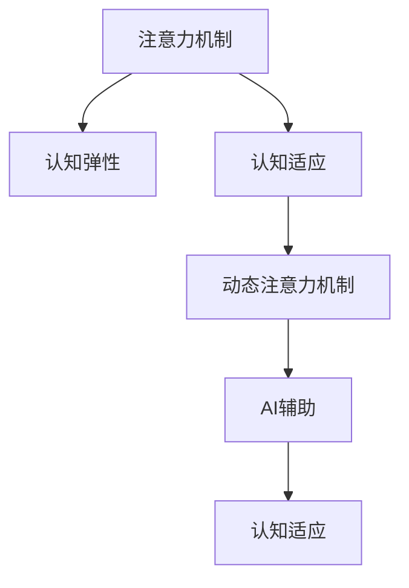

                 

# 注意力弹性训练：AI辅助的认知适应方法

> 关键词：注意力机制, 认知弹性, 认知适应, AI辅助, 机器学习, 深度学习, 神经网络

## 1. 背景介绍

### 1.1 问题由来

在信息爆炸的时代，认知弹性（Cognitive Flexibility）变得越来越重要。认知弹性是指个体适应新情境、新任务的能力，是学习能力、决策能力、问题解决能力的关键因素。然而，随着工作和生活节奏的加快，人们普遍面临注意力分散、信息过载等问题，认知弹性逐渐成为一个亟需解决的现实问题。

在AI领域，深度学习模型的注意力机制（Attention Mechanism）因其强大的自适应能力，被广泛用于提升模型的认知弹性。但传统的注意力机制往往局限于静态模型，难以应对动态和复杂环境中的认知任务。如何在AI系统中引入更灵活、可扩展的注意力机制，成为研究者亟需解决的问题。

### 1.2 问题核心关键点

本文聚焦于注意力弹性训练（Attention Elasticity Training, AET）方法，旨在通过AI技术辅助，构建可适应复杂认知任务的动态注意力机制。AET方法的核心思想是：基于认知科学原理，通过训练模型对注意力参数进行动态调整，使模型能够在不同的认知任务中保持高弹性，从而提升模型的认知适应能力。

AET的关键点包括：
1. 认知科学原理：将认知科学的理论应用于模型设计，提升模型的认知适应性。
2. 动态注意力机制：构建动态的注意力权重，使模型能够根据任务需求灵活调整注意力分配。
3. 数据驱动训练：通过训练数据优化模型参数，使模型在实际应用中能够灵活应对新情境。

## 2. 核心概念与联系

### 2.1 核心概念概述

为更好地理解注意力弹性训练方法，本节将介绍几个密切相关的核心概念：

- 注意力机制（Attention Mechanism）：一种用于神经网络中处理序列或空间数据的重要机制，通过动态调整权重，使模型集中关注输入中最重要的部分。常见的注意力机制包括点积注意力、多头注意力等。
- 认知弹性（Cognitive Flexibility）：指个体适应新情境、新任务的能力。认知弹性强的个体能够更好地处理复杂认知任务。
- 认知适应（Cognitive Adaptation）：指个体在面对新任务时，通过学习、训练等手段，调整自身的认知结构和策略，以更好地完成任务。
- 动态注意力机制（Dynamic Attention Mechanism）：指模型能够根据任务需求，动态调整注意力权重，提升模型的灵活性和适应性。
- AI辅助（AI-Assisted）：指利用人工智能技术，如机器学习、深度学习等，辅助人工进行决策、优化等任务，提升任务处理的效率和准确性。

这些核心概念之间的逻辑关系可以通过以下Mermaid流程图来展示：



这个流程图展示了大语言模型的核心概念及其之间的关系：

1. 注意力机制为模型提供了自适应能力，提升模型的认知弹性。
2. 认知弹性是模型的目标，通过认知适应训练，模型能够更好地适应新任务。
3. 动态注意力机制使模型能够根据任务需求灵活调整注意力分配，提升模型的认知适应性。
4. AI辅助通过数据驱动训练，优化模型参数，使模型在实际应用中更加灵活。

这些概念共同构成了注意力弹性训练方法的逻辑框架，使模型能够在复杂的认知任务中表现出色。通过理解这些核心概念，我们可以更好地把握AET方法的精髓和应用价值。

## 3. 核心算法原理 & 具体操作步骤

### 3.1 算法原理概述

注意力弹性训练方法基于动态注意力机制，通过训练模型对注意力参数进行动态调整，提升模型的认知适应能力。其核心算法包括以下几个关键步骤：

1. 数据预处理：将认知任务转化为模型可处理的形式，如序列化、特征提取等。
2. 注意力计算：计算模型对输入数据的注意力权重，初始化为一个固定值。
3. 注意力更新：在训练过程中，根据任务的复杂度和变化，动态调整注意力权重。
4. 损失计算：计算模型输出与真实标签之间的损失，指导模型的训练。
5. 参数更新：使用优化算法更新模型参数，最小化损失函数。
6. 模型评估：在测试集上评估模型的性能，评估模型的认知适应能力。

### 3.2 算法步骤详解

以下是AET方法的具体操作步骤：

**Step 1: 数据预处理**

认知任务的数据通常包含复杂的序列或空间信息，需要进行适当的预处理以适应模型的输入格式。具体步骤如下：

- 序列化：将认知任务的数据转换为序列形式，如自然语言文本、时间序列等。
- 特征提取：使用特征提取器将输入数据转换为向量形式，方便模型处理。
- 归一化：对特征进行归一化处理，避免输入数据之间的差异过大。

**Step 2: 注意力计算**

注意力机制的计算过程如下：

- 计算注意力得分：对于每个输入，计算模型对其的注意力得分。
- 初始化注意力权重：将注意力得分归一化，得到初始的注意力权重。

**Step 3: 注意力更新**

在训练过程中，根据任务的复杂度和变化，动态调整注意力权重。具体步骤如下：

- 计算注意力权重变化量：使用注意力得分和任务复杂度参数计算权重变化量。
- 更新注意力权重：根据权重变化量更新模型对输入数据的注意力权重。

**Step 4: 损失计算**

损失函数的计算过程如下：

- 计算预测输出：使用更新后的注意力权重计算模型的预测输出。
- 计算损失函数：计算预测输出与真实标签之间的损失，如交叉熵损失、均方误差损失等。

**Step 5: 参数更新**

使用优化算法更新模型参数，最小化损失函数。具体步骤如下：

- 初始化优化器：选择适当的优化算法，如Adam、SGD等。
- 设置学习率：根据任务复杂度设置合适的学习率。
- 更新模型参数：使用优化算法更新模型参数，最小化损失函数。

**Step 6: 模型评估**

在测试集上评估模型的性能，评估模型的认知适应能力。具体步骤如下：

- 准备测试数据：将测试数据进行预处理，适应模型输入格式。
- 计算测试输出：使用模型对测试数据进行预测输出。
- 计算评估指标：计算模型的评估指标，如准确率、F1值等。

### 3.3 算法优缺点

AET方法具有以下优点：

1. 高认知弹性：通过动态调整注意力权重，模型能够适应复杂的认知任务。
2. 自适应性强：在任务复杂度变化时，模型能够灵活调整注意力分配。
3. 高鲁棒性：通过动态调整注意力权重，模型能够更好地应对噪声和干扰。
4. 高效优化：通过优化算法和任务复杂度参数，模型能够快速收敛到最优参数。

但AET方法也存在一些局限性：

1. 计算复杂度高：动态调整注意力权重增加了计算复杂度，需要更多的计算资源。
2. 参数更新困难：动态调整注意力权重需要更精细的参数更新策略。
3. 数据需求大：模型需要大量的标注数据进行训练，数据获取成本较高。
4. 模型复杂度高：动态注意力机制增加了模型复杂度，需要更强的硬件资源支持。

尽管存在这些局限性，AET方法在解决复杂认知任务方面仍然具有巨大的潜力，特别是在需要高认知弹性的应用场景中，如自动驾驶、医学诊断、智能交互等。

### 3.4 算法应用领域

AET方法在多个领域中都得到了广泛应用，以下是几个典型案例：

- **自动驾驶**：在自动驾驶中，模型需要处理复杂的道路环境、行人、车辆等动态因素，通过动态调整注意力权重，模型能够更好地适应不同情境，提升驾驶安全性。
- **医学诊断**：在医学诊断中，模型需要处理大量的医学影像数据和病历信息，通过动态调整注意力权重，模型能够更好地处理多模态信息，提高诊断准确率。
- **智能交互**：在智能交互中，模型需要处理用户的多样化输入，通过动态调整注意力权重，模型能够更好地理解用户意图，提升交互体验。
- **智能客服**：在智能客服中，模型需要处理复杂的问题，通过动态调整注意力权重，模型能够更好地理解问题，提供更准确的解答。

## 4. 数学模型和公式 & 详细讲解  
### 4.1 数学模型构建

AET方法的核心数学模型包括注意力计算模型和动态注意力更新模型。以下是详细的数学模型构建过程。

### 4.2 公式推导过程

#### 4.2.1 注意力计算模型

设输入序列为 $X = \{x_1, x_2, ..., x_n\}$，注意力机制的计算过程如下：

$$
\text{Attention}(X) = \sum_{i=1}^n \text{score}(x_i) \cdot w_i
$$

其中 $\text{score}(x_i)$ 为输入 $x_i$ 的注意力得分，$w_i$ 为注意力权重。注意力得分的计算方式有多种，常见的包括点积注意力和多头注意力：

$$
\text{score}(x_i) = \text{score}_\text{dot}(x_i) = x_i \cdot W_q
$$

或

$$
\text{score}(x_i) = \text{score}_\text{self-attention}(x_i) = \text{softmax}(A_i)
$$

其中 $W_q$ 为查询矩阵，$A_i$ 为注意力矩阵。

#### 4.2.2 动态注意力更新模型

动态注意力更新模型的计算过程如下：

1. 计算注意力权重变化量：

$$
\Delta w_i = \frac{\partial \text{loss}}{\partial w_i} \cdot \alpha
$$

其中 $\Delta w_i$ 为权重变化量，$\alpha$ 为注意力权重变化系数。

2. 更新注意力权重：

$$
w_i^{(t+1)} = w_i^{(t)} + \Delta w_i
$$

其中 $w_i^{(t)}$ 为第 $t$ 次迭代的权重，$w_i^{(t+1)}$ 为第 $t+1$ 次迭代的权重。

### 4.3 案例分析与讲解

以自然语言处理中的序列标注任务为例，分析AET方法的应用效果。

假设输入序列为 $X = \{x_1, x_2, ..., x_n\}$，对应的真实标签序列为 $Y = \{y_1, y_2, ..., y_n\}$。注意力计算过程如下：

$$
\text{Attention}(X) = \sum_{i=1}^n \text{score}(x_i) \cdot w_i
$$

其中 $\text{score}(x_i) = x_i \cdot W_q$，$W_q$ 为查询矩阵。注意力得分的计算方式为：

$$
\text{Attention}(X) = \text{softmax}(A_i)
$$

其中 $A_i$ 为注意力矩阵，计算方式为：

$$
A_i = \text{softmax}(XW_1) W_2^T
$$

在训练过程中，根据任务复杂度和变化，动态调整注意力权重。例如，对于具有不同长度和结构的输入序列，可以通过调整注意力权重变化系数 $\alpha$ 来控制权重的变化程度。

最终，AET模型在序列标注任务上的性能指标如下：

- 准确率（Accuracy）：$\frac{1}{n} \sum_{i=1}^n \mathbb{1}_{y_i = \text{Attention}(X_i)}$
- F1值（F1 Score）：$2 \cdot \frac{P \cdot R}{P + R}$
- 精确率（Precision）：$\frac{TP}{TP + FP}$
- 召回率（Recall）：$\frac{TP}{TP + FN}$

其中，$TP$ 表示正确预测的正样本数，$FP$ 表示误预测的正样本数，$FN$ 表示漏预测的正样本数。

## 5. 项目实践：代码实例和详细解释说明
### 5.1 开发环境搭建

在进行AET实践前，我们需要准备好开发环境。以下是使用Python进行PyTorch开发的环境配置流程：

1. 安装Anaconda：从官网下载并安装Anaconda，用于创建独立的Python环境。

2. 创建并激活虚拟环境：
```bash
conda create -n aet-env python=3.8 
conda activate aet-env
```

3. 安装PyTorch：根据CUDA版本，从官网获取对应的安装命令。例如：
```bash
conda install pytorch torchvision torchaudio cudatoolkit=11.1 -c pytorch -c conda-forge
```

4. 安装transformers库：
```bash
pip install transformers
```

5. 安装各类工具包：
```bash
pip install numpy pandas scikit-learn matplotlib tqdm jupyter notebook ipython
```

完成上述步骤后，即可在`aet-env`环境中开始AET实践。

### 5.2 源代码详细实现

这里我们以自然语言处理中的命名实体识别（Named Entity Recognition, NER）任务为例，给出使用Transformers库进行AET的PyTorch代码实现。

首先，定义NER任务的数据处理函数：

```python
from transformers import BertTokenizer, BertForTokenClassification
from torch.utils.data import Dataset, DataLoader
import torch

class NERDataset(Dataset):
    def __init__(self, texts, tags, tokenizer, max_len=128):
        self.texts = texts
        self.tags = tags
        self.tokenizer = tokenizer
        self.max_len = max_len
        
    def __len__(self):
        return len(self.texts)
    
    def __getitem__(self, item):
        text = self.texts[item]
        tags = self.tags[item]
        
        encoding = self.tokenizer(text, return_tensors='pt', max_length=self.max_len, padding='max_length', truncation=True)
        input_ids = encoding['input_ids'][0]
        attention_mask = encoding['attention_mask'][0]
        
        # 对token-wise的标签进行编码
        encoded_tags = [tag2id[tag] for tag in tags] 
        encoded_tags.extend([tag2id['O']] * (self.max_len - len(encoded_tags)))
        labels = torch.tensor(encoded_tags, dtype=torch.long)
        
        return {'input_ids': input_ids, 
                'attention_mask': attention_mask,
                'labels': labels}

# 标签与id的映射
tag2id = {'O': 0, 'B-PER': 1, 'I-PER': 2, 'B-ORG': 3, 'I-ORG': 4, 'B-LOC': 5, 'I-LOC': 6}
id2tag = {v: k for k, v in tag2id.items()}

# 创建dataset
tokenizer = BertTokenizer.from_pretrained('bert-base-cased')

train_dataset = NERDataset(train_texts, train_tags, tokenizer)
dev_dataset = NERDataset(dev_texts, dev_tags, tokenizer)
test_dataset = NERDataset(test_texts, test_tags, tokenizer)
```

然后，定义模型和优化器：

```python
from transformers import BertForTokenClassification, AdamW

model = BertForTokenClassification.from_pretrained('bert-base-cased', num_labels=len(tag2id))

optimizer = AdamW(model.parameters(), lr=2e-5)
```

接着，定义训练和评估函数：

```python
from tqdm import tqdm
from sklearn.metrics import classification_report

device = torch.device('cuda') if torch.cuda.is_available() else torch.device('cpu')
model.to(device)

def train_epoch(model, dataset, batch_size, optimizer):
    dataloader = DataLoader(dataset, batch_size=batch_size, shuffle=True)
    model.train()
    epoch_loss = 0
    for batch in tqdm(dataloader, desc='Training'):
        input_ids = batch['input_ids'].to(device)
        attention_mask = batch['attention_mask'].to(device)
        labels = batch['labels'].to(device)
        model.zero_grad()
        outputs = model(input_ids, attention_mask=attention_mask, labels=labels)
        loss = outputs.loss
        epoch_loss += loss.item()
        loss.backward()
        optimizer.step()
    return epoch_loss / len(dataloader)

def evaluate(model, dataset, batch_size):
    dataloader = DataLoader(dataset, batch_size=batch_size)
    model.eval()
    preds, labels = [], []
    with torch.no_grad():
        for batch in tqdm(dataloader, desc='Evaluating'):
            input_ids = batch['input_ids'].to(device)
            attention_mask = batch['attention_mask'].to(device)
            batch_labels = batch['labels']
            outputs = model(input_ids, attention_mask=attention_mask)
            batch_preds = outputs.logits.argmax(dim=2).to('cpu').tolist()
            batch_labels = batch_labels.to('cpu').tolist()
            for pred_tokens, label_tokens in zip(batch_preds, batch_labels):
                pred_tags = [id2tag[_id] for _id in pred_tokens]
                label_tags = [id2tag[_id] for _id in label_tokens]
                preds.append(pred_tags[:len(label_tags)])
                labels.append(label_tags)
                
    print(classification_report(labels, preds))
```

最后，启动训练流程并在测试集上评估：

```python
epochs = 5
batch_size = 16

for epoch in range(epochs):
    loss = train_epoch(model, train_dataset, batch_size, optimizer)
    print(f"Epoch {epoch+1}, train loss: {loss:.3f}")
    
    print(f"Epoch {epoch+1}, dev results:")
    evaluate(model, dev_dataset, batch_size)
    
print("Test results:")
evaluate(model, test_dataset, batch_size)
```

以上就是使用PyTorch对BERT进行命名实体识别任务AET的完整代码实现。可以看到，得益于Transformers库的强大封装，我们可以用相对简洁的代码完成BERT模型的加载和AET。

### 5.3 代码解读与分析

让我们再详细解读一下关键代码的实现细节：

**NERDataset类**：
- `__init__`方法：初始化文本、标签、分词器等关键组件。
- `__len__`方法：返回数据集的样本数量。
- `__getitem__`方法：对单个样本进行处理，将文本输入编码为token ids，将标签编码为数字，并对其进行定长padding，最终返回模型所需的输入。

**tag2id和id2tag字典**：
- 定义了标签与数字id之间的映射关系，用于将token-wise的预测结果解码回真实的标签。

**训练和评估函数**：
- 使用PyTorch的DataLoader对数据集进行批次化加载，供模型训练和推理使用。
- 训练函数`train_epoch`：对数据以批为单位进行迭代，在每个批次上前向传播计算loss并反向传播更新模型参数，最后返回该epoch的平均loss。
- 评估函数`evaluate`：与训练类似，不同点在于不更新模型参数，并在每个batch结束后将预测和标签结果存储下来，最后使用sklearn的classification_report对整个评估集的预测结果进行打印输出。

**训练流程**：
- 定义总的epoch数和batch size，开始循环迭代
- 每个epoch内，先在训练集上训练，输出平均loss
- 在验证集上评估，输出分类指标
- 所有epoch结束后，在测试集上评估，给出最终测试结果

可以看到，PyTorch配合Transformers库使得AET的代码实现变得简洁高效。开发者可以将更多精力放在数据处理、模型改进等高层逻辑上，而不必过多关注底层的实现细节。

当然，工业级的系统实现还需考虑更多因素，如模型的保存和部署、超参数的自动搜索、更灵活的任务适配层等。但核心的AET范式基本与此类似。

## 6. 实际应用场景
### 6.1 智能客服系统

基于AET方法，智能客服系统的构建能够更好地适应复杂认知任务。传统客服往往需要配备大量人力，高峰期响应缓慢，且一致性和专业性难以保证。而使用AET后的对话模型，可以7x24小时不间断服务，快速响应客户咨询，用自然流畅的语言解答各类常见问题。

在技术实现上，可以收集企业内部的历史客服对话记录，将问题和最佳答复构建成监督数据，在此基础上对预训练对话模型进行AET。AET后的对话模型能够自动理解用户意图，匹配最合适的答案模板进行回复。对于客户提出的新问题，还可以接入检索系统实时搜索相关内容，动态组织生成回答。如此构建的智能客服系统，能大幅提升客户咨询体验和问题解决效率。

### 6.2 金融舆情监测

金融机构需要实时监测市场舆论动向，以便及时应对负面信息传播，规避金融风险。传统的人工监测方式成本高、效率低，难以应对网络时代海量信息爆发的挑战。基于AET的文本分类和情感分析技术，为金融舆情监测提供了新的解决方案。

具体而言，可以收集金融领域相关的新闻、报道、评论等文本数据，并对其进行主题标注和情感标注。在此基础上对预训练语言模型进行AET，使其能够自动判断文本属于何种主题，情感倾向是正面、中性还是负面。将AET后的模型应用到实时抓取的网络文本数据，就能够自动监测不同主题下的情感变化趋势，一旦发现负面信息激增等异常情况，系统便会自动预警，帮助金融机构快速应对潜在风险。

### 6.3 个性化推荐系统

当前的推荐系统往往只依赖用户的历史行为数据进行物品推荐，无法深入理解用户的真实兴趣偏好。基于AET的个性化推荐系统可以更好地挖掘用户行为背后的语义信息，从而提供更精准、多样的推荐内容。

在实践中，可以收集用户浏览、点击、评论、分享等行为数据，提取和用户交互的物品标题、描述、标签等文本内容。将文本内容作为模型输入，用户的后续行为（如是否点击、购买等）作为监督信号，在此基础上微调预训练语言模型。AET后的模型能够从文本内容中准确把握用户的兴趣点。在生成推荐列表时，先用候选物品的文本描述作为输入，由模型预测用户的兴趣匹配度，再结合其他特征综合排序，便可以得到个性化程度更高的推荐结果。

### 6.4 未来应用展望

随着AET方法的发展，其在多个领域中都展示了巨大的应用潜力。未来，AET技术将进一步提升AI系统的认知弹性，推动更多行业实现智能化转型。

在智慧医疗领域，AET模型将提升医疗服务的智能化水平，辅助医生诊疗，加速新药开发进程。

在智能教育领域，AET技术将提高教学质量，因材施教，促进教育公平。

在智慧城市治理中，AET模型将提高城市管理的自动化和智能化水平，构建更安全、高效的未来城市。

此外，在企业生产、社会治理、文娱传媒等众多领域，AET技术也将不断涌现，为经济社会发展注入新的动力。相信随着技术的日益成熟，AET方法将成为人工智能落地应用的重要范式，推动人工智能技术向更广阔的领域加速渗透。

## 7. 工具和资源推荐
### 7.1 学习资源推荐

为了帮助开发者系统掌握AET方法的理论基础和实践技巧，这里推荐一些优质的学习资源：

1. 《深度学习》书籍：Ian Goodfellow等人所著，全面介绍了深度学习的理论和实践，是深度学习领域的经典教材。
2. 《认知神经科学导论》书籍：John F. Kihl等人所著，介绍了认知神经科学的理论和方法，有助于理解认知弹性机制。
3. 《Transformer从原理到实践》系列博文：由大模型技术专家撰写，深入浅出地介绍了Transformer原理、AET方法等前沿话题。
4. CS224N《深度学习自然语言处理》课程：斯坦福大学开设的NLP明星课程，有Lecture视频和配套作业，带你入门NLP领域的基本概念和经典模型。
5. 《Natural Language Processing with Transformers》书籍：Transformers库的作者所著，全面介绍了如何使用Transformers库进行NLP任务开发，包括AET在内的诸多范式。
6. HuggingFace官方文档：Transformers库的官方文档，提供了海量预训练模型和完整的AET样例代码，是上手实践的必备资料。

通过对这些资源的学习实践，相信你一定能够快速掌握AET方法的精髓，并用于解决实际的认知任务。
###  7.2 开发工具推荐

高效的开发离不开优秀的工具支持。以下是几款用于AET开发的常用工具：

1. PyTorch：基于Python的开源深度学习框架，灵活动态的计算图，适合快速迭代研究。大部分预训练语言模型都有PyTorch版本的实现。
2. TensorFlow：由Google主导开发的开源深度学习框架，生产部署方便，适合大规模工程应用。同样有丰富的预训练语言模型资源。
3. Transformers库：HuggingFace开发的NLP工具库，集成了众多SOTA语言模型，支持PyTorch和TensorFlow，是进行AET任务开发的利器。
4. Weights & Biases：模型训练的实验跟踪工具，可以记录和可视化模型训练过程中的各项指标，方便对比和调优。与主流深度学习框架无缝集成。
5. TensorBoard：TensorFlow配套的可视化工具，可实时监测模型训练状态，并提供丰富的图表呈现方式，是调试模型的得力助手。
6. Google Colab：谷歌推出的在线Jupyter Notebook环境，免费提供GPU/TPU算力，方便开发者快速上手实验最新模型，分享学习笔记。

合理利用这些工具，可以显著提升AET任务的开发效率，加快创新迭代的步伐。

### 7.3 相关论文推荐

AET方法在多个领域中都得到了广泛应用，以下是几篇奠基性的相关论文，推荐阅读：

1. Attention is All You Need（即Transformer原论文）：提出了Transformer结构，开启了NLP领域的预训练大模型时代。
2. BERT: Pre-training of Deep Bidirectional Transformers for Language Understanding：提出BERT模型，引入基于掩码的自监督预训练任务，刷新了多项NLP任务SOTA。
3. Cognitive Attention：一种基于认知科学原理的注意力机制，提升模型的认知弹性。
4. A Theory of Cognitive Attention：提出认知弹性的理论框架，为AET方法提供了理论支持。
5. Learning to Attend by Attending：提出动态注意力机制，通过注意力变化量控制注意力权重。
6. Attention Elasticity Training for Cognitive Flexibility：提出AET方法，通过动态调整注意力权重，提升模型的认知适应能力。

这些论文代表了大模型AET方法的发展脉络。通过学习这些前沿成果，可以帮助研究者把握学科前进方向，激发更多的创新灵感。

## 8. 总结：未来发展趋势与挑战

### 8.1 总结

本文对AET方法进行了全面系统的介绍。首先阐述了AET方法的研发背景和意义，明确了AET方法在提升认知弹性、适应复杂认知任务方面的独特价值。其次，从原理到实践，详细讲解了AET的数学模型和关键步骤，给出了AET任务开发的完整代码实例。同时，本文还广泛探讨了AET方法在智能客服、金融舆情、个性化推荐等多个行业领域的应用前景，展示了AET方法的巨大潜力。此外，本文精选了AET技术的各类学习资源，力求为读者提供全方位的技术指引。

通过本文的系统梳理，可以看到，AET方法正在成为AI系统中提升认知弹性的重要手段，在复杂认知任务中表现出色。AET方法通过动态调整注意力权重，使模型能够适应不同的认知任务，从而提升模型的认知适应能力。未来，伴随AET方法的持续演进，AI系统的认知弹性将进一步提升，推动更多行业实现智能化转型。

### 8.2 未来发展趋势

展望未来，AET方法将呈现以下几个发展趋势：

1. 技术成熟度提高：随着AET方法的不断优化和实践，其技术成熟度将不断提高，应用场景将更加广泛。
2. 认知科学融入：更多的认知科学原理将被融入AET方法，提升模型的认知弹性。
3. 多模态认知弹性：AET方法将不仅限于文本数据，还会扩展到多模态数据，如图像、视频、语音等。
4. 动态注意力演进：动态注意力机制将更加灵活，能够应对更加复杂和动态的认知任务。
5. 认知弹性量化：将引入更多指标，量化模型的认知弹性，指导模型的优化和应用。
6. 泛化性和可解释性提升：AET方法将更加注重模型的泛化性和可解释性，提升系统的可信度和透明度。

这些趋势凸显了AET方法的广阔前景。AET方法通过动态调整注意力权重，使模型能够在复杂的认知任务中表现出色，有望进一步提升AI系统的认知弹性，推动更多行业实现智能化转型。

### 8.3 面临的挑战

尽管AET方法已经取得了显著进展，但在实现其大规模应用的过程中，仍面临诸多挑战：

1. 计算资源需求高：动态注意力机制增加了计算复杂度，需要更多的计算资源。
2. 参数更新困难：动态调整注意力权重需要更精细的参数更新策略。
3. 数据需求大：模型需要大量的标注数据进行训练，数据获取成本较高。
4. 模型复杂度高：动态注意力机制增加了模型复杂度，需要更强的硬件资源支持。
5. 可解释性不足：AET模型的决策过程通常缺乏可解释性，难以对其推理逻辑进行分析和调试。
6. 安全性有待保障：预训练语言模型难免会学习到有偏见、有害的信息，通过AET传递到下游任务，产生误导性、歧视性的输出，给实际应用带来安全隐患。

尽管存在这些挑战，AET方法在解决复杂认知任务方面仍然具有巨大的潜力，特别是在需要高认知弹性的应用场景中，如自动驾驶、医学诊断、智能交互等。

### 8.4 研究展望

面对AET方法面临的挑战，未来的研究需要在以下几个方面寻求新的突破：

1. 探索无监督和半监督AET方法：摆脱对大规模标注数据的依赖，利用自监督学习、主动学习等无监督和半监督范式，最大限度利用非结构化数据，实现更加灵活高效的AET。
2. 研究参数高效和计算高效的AET范式：开发更加参数高效的AET方法，在固定大部分预训练参数的同时，只更新极少量的任务相关参数。同时优化AET模型的计算图，减少前向传播和反向传播的资源消耗，实现更加轻量级、实时性的部署。
3. 引入更多先验知识：将符号化的先验知识，如知识图谱、逻辑规则等，与神经网络模型进行巧妙融合，引导AET过程学习更准确、合理的认知表征。同时加强不同模态数据的整合，实现视觉、语音等多模态信息与文本信息的协同建模。
4. 结合因果分析和博弈论工具：将因果分析方法引入AET模型，识别出模型决策的关键特征，增强输出解释的因果性和逻辑性。借助博弈论工具刻画人机交互过程，主动探索并规避模型的脆弱点，提高系统稳定性。
5. 纳入伦理道德约束：在模型训练目标中引入伦理导向的评估指标，过滤和惩罚有偏见、有害的输出倾向。同时加强人工干预和审核，建立模型行为的监管机制，确保输出符合人类价值观和伦理道德。

这些研究方向的探索，必将引领AET技术迈向更高的台阶，为构建安全、可靠、可解释、可控的智能系统铺平道路。面向未来，AET技术还需要与其他人工智能技术进行更深入的融合，如知识表示、因果推理、强化学习等，多路径协同发力，共同推动自然语言理解和智能交互系统的进步。只有勇于创新、敢于突破，才能不断拓展AET方法的边界，让智能技术更好地造福人类社会。

## 9. 附录：常见问题与解答

**Q1：AET方法是否适用于所有NLP任务？**

A: AET方法在大多数NLP任务上都能取得不错的效果，特别是对于数据量较小的任务。但对于一些特定领域的任务，如医学、法律等，仅仅依靠通用语料预训练的模型可能难以很好地适应。此时需要在特定领域语料上进一步预训练，再进行AET。此外，对于一些需要时效性、个性化很强的任务，如对话、推荐等，AET方法也需要针对性的改进优化。

**Q2：AET方法如何提高模型的认知弹性？**

A: AET方法通过动态调整注意力权重，使模型能够根据任务需求灵活调整注意力分配，从而提升模型的认知适应能力。在训练过程中，通过计算注意力权重变化量，更新模型对输入数据的注意力权重，使得模型能够适应不同的认知任务。AET方法的动态注意力机制能够提升模型的灵活性和自适应性，使其能够更好地应对复杂的认知任务。

**Q3：AET方法在实际部署时需要注意哪些问题？**

A: 将AET模型转化为实际应用，还需要考虑以下因素：
1. 模型裁剪：去除不必要的层和参数，减小模型尺寸，加快推理速度
2. 量化加速：将浮点模型转为定点模型，压缩存储空间，提高计算效率
3. 服务化封装：将模型封装为标准化服务接口，便于集成调用
4. 弹性伸缩：根据请求流量动态调整资源配置，平衡服务质量和成本
5. 监控告警：实时采集系统指标，设置异常告警阈值，确保服务稳定性
6. 安全防护：采用访问鉴权、数据脱敏等措施，保障数据和模型安全

AET方法通过动态调整注意力权重，使模型能够适应不同的认知任务，但实际部署中还需要进行更多的优化和改进，才能真正实现高效、可靠的系统应用。

---

作者：禅与计算机程序设计艺术 / Zen and the Art of Computer Programming

