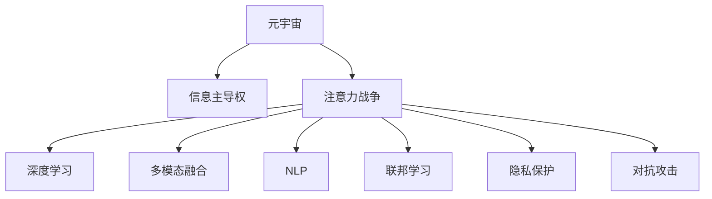

                 

# 注意力战争策略:元宇宙信息主导权的竞争

> 关键词：元宇宙、信息主导权、注意力战争、深度学习、多模态融合、自然语言处理、联邦学习、隐私保护、对抗攻击

## 1. 背景介绍

### 1.1 问题由来
随着技术的飞速发展，元宇宙（Metaverse）已成为数字时代的一个新焦点，带来了全新的社交、娱乐、工作模式。然而，元宇宙的世界远不止于游戏，其背后隐藏着更复杂的竞争格局——信息主导权的争夺。元宇宙作为一种多模态信息空间，包含了文本、图像、音频、视频等多类型数据，如何有效管理和利用这些信息资源，成为了各参与者之间争夺的焦点。

### 1.2 问题核心关键点
元宇宙中的信息主导权竞争，本质上是注意力资源的争夺。通过深度学习和大数据技术，企业能够更好地捕捉、分析和利用用户注意力，从而在竞争中占据优势。在这个过程中，企业需要采取有效的注意力策略，提升信息效率，增强信息影响力，同时保护用户隐私，避免对抗攻击。

## 2. 核心概念与联系

### 2.1 核心概念概述

为更好地理解元宇宙信息主导权的竞争策略，本节将介绍几个密切相关的核心概念：

- 元宇宙（Metaverse）：一个虚拟的空间，由多个数字世界构成，用户可以通过虚拟现实(VR)、增强现实(AR)、混合现实(MR)等多种方式进行交互，是数字经济的新形态。
- 信息主导权：在元宇宙中，通过控制信息资源，从而对用户行为产生显著影响的能力。
- 注意力战争：企业之间通过争夺用户注意力，形成信息主导权的过程。
- 深度学习：基于神经网络的机器学习算法，通过训练大规模数据集，自动学习特征表示和决策模型。
- 多模态融合：将文本、图像、音频、视频等不同模态的信息进行深度整合，构建更加全面、准确的信息模型。
- 自然语言处理（NLP）：研究计算机如何理解、生成和处理人类语言，是深度学习在信息处理领域的重要应用。
- 联邦学习：一种分布式机器学习方法，数据分布式存放在不同节点上，模型在本地训练后参数更新并聚合，减少数据传输和隐私风险。
- 隐私保护：保护用户数据不被滥用或泄露，确保用户隐私权。
- 对抗攻击：攻击者利用模型漏洞或输入扰动，使模型输出错误或不准确的结果，常用于模型安全评估和防御。

这些核心概念之间的逻辑关系可以通过以下Mermaid流程图来展示：



这个流程图展示了一系列概念之间的联系：

1. 元宇宙通过多模态信息构成了基础空间，信息主导权成为争夺焦点。
2. 企业之间通过深度学习技术进行注意力战争，提升信息效率和影响力。
3. 多模态融合和NLP技术提供了信息整合和处理的手段。
4. 联邦学习用于分布式训练和隐私保护，降低数据泄露风险。
5. 隐私保护和对抗攻击是信息主导权争夺中的重要环节，需要有效防护。

## 3. 核心算法原理 & 具体操作步骤
### 3.1 算法原理概述

在元宇宙信息主导权的竞争中，深度学习和大数据技术是关键工具。企业通过训练深度学习模型，从多模态信息中提取特征，优化信息表示，提升信息效率，从而获得信息主导权。算法原理主要包括：

1. **数据预处理**：对多模态数据进行归一化、特征提取等预处理，提高模型训练效率。
2. **模型训练**：使用深度学习模型对预处理后的数据进行训练，学习信息表示。
3. **信息融合**：将不同类型的信息进行深度融合，构建多模态信息模型。
4. **注意力机制**：通过注意力机制，提高模型对重要信息的关注度，提升信息效率。
5. **对抗训练**：利用对抗样本训练模型，增强模型的鲁棒性和安全性。
6. **联邦学习**：采用分布式训练方式，保护用户隐私，降低数据泄露风险。

### 3.2 算法步骤详解

元宇宙信息主导权的争夺，可以分为以下几个关键步骤：

**Step 1: 数据收集与预处理**
- 收集元宇宙内的各种类型的数据，如文本、图像、音频、视频等。
- 对数据进行清洗、归一化、特征提取等预处理操作，提高数据质量。

**Step 2: 模型设计与训练**
- 选择合适的深度学习模型，如Transformer、卷积神经网络(CNN)、循环神经网络(RNN)等，设计多模态融合的模型架构。
- 使用联邦学习技术，在分布式节点上训练模型，保护用户隐私。
- 通过对抗训练，提高模型的鲁棒性和安全性。

**Step 3: 信息表示与融合**
- 将不同类型的信息进行融合，构建多模态信息表示。
- 通过注意力机制，提高模型对重要信息的关注度，提升信息效率。

**Step 4: 策略设计与实施**
- 设计合理的策略，如内容推荐、用户画像构建等，利用信息主导权影响用户行为。
- 通过模型评估和优化，不断提升信息主导权的争夺效果。

**Step 5: 隐私保护与防御**
- 采用隐私保护技术，如差分隐私、加密技术等，确保用户数据安全。
- 设计抗对抗攻击的机制，防止模型被恶意扰动。

### 3.3 算法优缺点

基于深度学习的元宇宙信息主导权竞争策略，具有以下优点：

1. **高效性**：深度学习模型通过学习大量数据，能够高效提取信息特征，提升信息效率。
2. **鲁棒性**：联邦学习和对抗训练技术增强了模型的鲁棒性，提高了信息主导权的争夺能力。
3. **可扩展性**：多模态融合技术能够处理多种类型的信息，适应不同场景的竞争需求。
4. **隐私保护**：联邦学习等技术保护了用户隐私，降低了数据泄露的风险。

同时，该方法也存在一定的局限性：

1. **数据依赖性强**：深度学习模型依赖高质量的数据，数据获取和处理成本较高。
2. **模型复杂度高**：深度学习模型参数量较大，训练和推理成本较高。
3. **对抗攻击敏感**：对抗攻击可能影响模型的正常输出，需要加强对抗防御。
4. **隐私风险未解**：数据隐私保护技术仍有待提升，需要不断探索新的隐私保护方法。

### 3.4 算法应用领域

元宇宙信息主导权的竞争策略，已经在多个领域得到了广泛应用，例如：

- **社交网络**：通过深度学习模型，分析用户行为，推荐好友、内容，提升用户粘性。
- **电子商务**：利用多模态融合技术，分析用户需求，推荐商品，提升销售转化率。
- **虚拟旅游**：通过注意力机制，推荐景点、路线，提升用户体验。
- **数字内容创作**：利用NLP技术，生成高质量的文本、音频、视频内容，吸引用户关注。

除了上述这些经典应用外，元宇宙信息主导权的竞争策略还将进一步拓展到更多场景中，如智能合约、数字艺术、虚拟医疗等，为元宇宙的进一步发展提供新动力。

## 4. 数学模型和公式 & 详细讲解
### 4.1 数学模型构建

本节将使用数学语言对元宇宙信息主导权的竞争策略进行更加严格的刻画。

假设元宇宙内的信息表示为 $X \in \mathbb{R}^n$，其中 $n$ 为信息的维度。企业希望通过深度学习模型 $M_{\theta}$ 学习信息表示 $X$ 的特征表示 $Z \in \mathbb{R}^d$，其中 $d$ 为模型的输出维度。模型参数 $\theta \in \mathbb{R}^p$，$p$ 为模型的参数数量。企业希望最小化信息表示的损失函数 $\mathcal{L}(X)$，即：

$$
\mathcal{L}(X) = \|X - Z\|
$$

其中 $\|\cdot\|$ 为向量范数。

通过训练深度学习模型，企业可以优化信息表示 $Z$，使其逼近信息 $X$。

### 4.2 公式推导过程

以下我们以基于深度学习的多模态融合模型为例，推导其数学原理。

假设企业收集到的信息数据为 $D=\{(X_i, Y_i)\}_{i=1}^N$，其中 $X_i$ 为原始信息数据，$Y_i$ 为标注信息，如分类标签、情感评分等。目标是通过多模态融合模型，将不同类型的信息 $X_i$ 融合为单一的信息表示 $Z_i$，并最小化损失函数：

$$
\mathcal{L}(X) = \sum_{i=1}^N \|X_i - Z_i\|
$$

模型训练的目标为：

$$
\hat{\theta} = \mathop{\arg\min}_{\theta} \mathcal{L}(X)
$$

其中 $\hat{\theta}$ 为模型参数，通过优化算法（如Adam、SGD等）进行求解。

在实践中，多模态融合模型通常采用Transformer结构，结合自注意力机制进行信息融合。通过多头自注意力机制，模型能够学习不同模态之间的关联，提高信息表示的准确性。

### 4.3 案例分析与讲解

假设某企业希望在元宇宙内推广新发布的产品，通过信息主导权提升品牌影响力。企业可以采用以下策略：

1. **数据收集**：从社交媒体、电商平台、用户反馈等渠道收集多模态信息数据，如用户评论、产品图片、视频等。
2. **模型设计**：设计基于Transformer的多模态融合模型，采用自注意力机制进行信息融合。
3. **模型训练**：使用联邦学习技术，在分布式节点上训练模型，保护用户隐私。
4. **信息表示**：通过多模态融合，得到产品的综合信息表示 $Z$。
5. **策略实施**：利用信息主导权，在社交媒体上推送广告，生成高质量的文本、音频、视频内容，吸引用户关注。

通过以上步骤，企业可以有效提升产品的曝光率和用户粘性，提升品牌影响力。

## 5. 项目实践：代码实例和详细解释说明
### 5.1 开发环境搭建

在进行信息主导权竞争策略的开发前，我们需要准备好开发环境。以下是使用Python进行PyTorch开发的环境配置流程：

1. 安装Anaconda：从官网下载并安装Anaconda，用于创建独立的Python环境。

2. 创建并激活虚拟环境：
```bash
conda create -n pytorch-env python=3.8 
conda activate pytorch-env
```

3. 安装PyTorch：根据CUDA版本，从官网获取对应的安装命令。例如：
```bash
conda install pytorch torchvision torchaudio cudatoolkit=11.1 -c pytorch -c conda-forge
```

4. 安装Transformers库：
```bash
pip install transformers
```

5. 安装各类工具包：
```bash
pip install numpy pandas scikit-learn matplotlib tqdm jupyter notebook ipython
```

完成上述步骤后，即可在`pytorch-env`环境中开始项目实践。

### 5.2 源代码详细实现

下面我们以多模态融合模型为例，给出使用Transformers库进行信息主导权竞争策略开发的PyTorch代码实现。

首先，定义多模态融合模型的输入输出：

```python
from transformers import BertTokenizer, BertForMultimodalFusion
from torch.utils.data import Dataset
import torch

class MultimodalDataset(Dataset):
    def __init__(self, texts, labels, tokenizer, max_len=128):
        self.texts = texts
        self.labels = labels
        self.tokenizer = tokenizer
        self.max_len = max_len
        
    def __len__(self):
        return len(self.texts)
    
    def __getitem__(self, item):
        text = self.texts[item]
        label = self.labels[item]
        
        encoding = self.tokenizer(text, return_tensors='pt', max_length=self.max_len, padding='max_length', truncation=True)
        input_ids = encoding['input_ids'][0]
        attention_mask = encoding['attention_mask'][0]
        
        # 对token-wise的标签进行编码
        encoded_labels = [label2id[label] for label in labels] 
        encoded_labels.extend([label2id['O']] * (self.max_len - len(encoded_labels)))
        labels = torch.tensor(encoded_labels, dtype=torch.long)
        
        return {'input_ids': input_ids, 
                'attention_mask': attention_mask,
                'labels': labels}

# 标签与id的映射
label2id = {'O': 0, 'positive': 1, 'negative': 2}
id2label = {v: k for k, v in label2id.items()}

# 创建dataset
tokenizer = BertTokenizer.from_pretrained('bert-base-cased')

train_dataset = MultimodalDataset(train_texts, train_labels, tokenizer)
dev_dataset = MultimodalDataset(dev_texts, dev_labels, tokenizer)
test_dataset = MultimodalDataset(test_texts, test_labels, tokenizer)
```

然后，定义模型和优化器：

```python
from transformers import BertForMultimodalFusion, AdamW

model = BertForMultimodalFusion.from_pretrained('bert-base-cased', num_labels=len(label2id))

optimizer = AdamW(model.parameters(), lr=2e-5)
```

接着，定义训练和评估函数：

```python
from torch.utils.data import DataLoader
from tqdm import tqdm
from sklearn.metrics import classification_report

device = torch.device('cuda') if torch.cuda.is_available() else torch.device('cpu')
model.to(device)

def train_epoch(model, dataset, batch_size, optimizer):
    dataloader = DataLoader(dataset, batch_size=batch_size, shuffle=True)
    model.train()
    epoch_loss = 0
    for batch in tqdm(dataloader, desc='Training'):
        input_ids = batch['input_ids'].to(device)
        attention_mask = batch['attention_mask'].to(device)
        labels = batch['labels'].to(device)
        model.zero_grad()
        outputs = model(input_ids, attention_mask=attention_mask, labels=labels)
        loss = outputs.loss
        epoch_loss += loss.item()
        loss.backward()
        optimizer.step()
    return epoch_loss / len(dataloader)

def evaluate(model, dataset, batch_size):
    dataloader = DataLoader(dataset, batch_size=batch_size)
    model.eval()
    preds, labels = [], []
    with torch.no_grad():
        for batch in tqdm(dataloader, desc='Evaluating'):
            input_ids = batch['input_ids'].to(device)
            attention_mask = batch['attention_mask'].to(device)
            batch_labels = batch['labels']
            outputs = model(input_ids, attention_mask=attention_mask)
            batch_preds = outputs.logits.argmax(dim=2).to('cpu').tolist()
            batch_labels = batch_labels.to('cpu').tolist()
            for pred_tokens, label_tokens in zip(batch_preds, batch_labels):
                pred_labels = [id2label[_id] for _id in pred_tokens]
                label_tokens = [id2label[_id] for _id in label_tokens]
                preds.append(pred_labels[:len(label_tokens)])
                labels.append(label_tokens)
                
    print(classification_report(labels, preds))
```

最后，启动训练流程并在测试集上评估：

```python
epochs = 5
batch_size = 16

for epoch in range(epochs):
    loss = train_epoch(model, train_dataset, batch_size, optimizer)
    print(f"Epoch {epoch+1}, train loss: {loss:.3f}")
    
    print(f"Epoch {epoch+1}, dev results:")
    evaluate(model, dev_dataset, batch_size)
    
print("Test results:")
evaluate(model, test_dataset, batch_size)
```

以上就是使用PyTorch进行多模态融合模型开发的完整代码实现。可以看到，借助Transformers库的强大封装，我们能够快速实现多模态融合模型的训练和评估。

### 5.3 代码解读与分析

让我们再详细解读一下关键代码的实现细节：

**MultimodalDataset类**：
- `__init__`方法：初始化文本、标签、分词器等关键组件。
- `__len__`方法：返回数据集的样本数量。
- `__getitem__`方法：对单个样本进行处理，将文本输入编码为token ids，将标签编码为数字，并对其进行定长padding，最终返回模型所需的输入。

**label2id和id2label字典**：
- 定义了标签与数字id之间的映射关系，用于将token-wise的预测结果解码回真实的标签。

**训练和评估函数**：
- 使用PyTorch的DataLoader对数据集进行批次化加载，供模型训练和推理使用。
- 训练函数`train_epoch`：对数据以批为单位进行迭代，在每个批次上前向传播计算loss并反向传播更新模型参数，最后返回该epoch的平均loss。
- 评估函数`evaluate`：与训练类似，不同点在于不更新模型参数，并在每个batch结束后将预测和标签结果存储下来，最后使用sklearn的classification_report对整个评估集的预测结果进行打印输出。

**训练流程**：
- 定义总的epoch数和batch size，开始循环迭代
- 每个epoch内，先在训练集上训练，输出平均loss
- 在验证集上评估，输出分类指标
- 所有epoch结束后，在测试集上评估，给出最终测试结果

可以看到，PyTorch配合Transformers库使得多模态融合模型的代码实现变得简洁高效。开发者可以将更多精力放在数据处理、模型改进等高层逻辑上，而不必过多关注底层的实现细节。

当然，工业级的系统实现还需考虑更多因素，如模型的保存和部署、超参数的自动搜索、更灵活的任务适配层等。但核心的多模态融合模型训练和评估流程基本与此类似。

## 6. 实际应用场景
### 6.1 智能社交网络

基于多模态融合模型的信息主导权竞争策略，可以广泛应用于智能社交网络中。智能社交网络通过深度学习技术，分析用户行为，推荐好友、内容，提升用户粘性。

在技术实现上，可以收集用户在社交网络上的多模态数据，如评论、点赞、分享等。通过多模态融合模型，分析用户的兴趣和需求，生成高质量的内容，并进行推荐。同时，可以通过联邦学习技术，保护用户隐私，降低数据泄露的风险。

### 6.2 电子商务

利用多模态融合模型的信息主导权竞争策略，在电子商务领域同样能够取得显著效果。电商平台通过深度学习技术，分析用户的多模态数据，如购物记录、评论、评分等，生成个性化推荐列表，提升用户体验和销售转化率。

在技术实现上，可以收集用户的多模态数据，通过多模态融合模型进行分析和融合，得到用户的综合信息表示。然后利用信息主导权，推送个性化推荐，引导用户进行消费。同时，可以通过联邦学习技术，保护用户隐私，降低数据泄露的风险。

### 6.3 虚拟旅游

虚拟旅游场景中，多模态融合模型的信息主导权竞争策略同样具有重要应用价值。通过深度学习技术，分析用户在虚拟旅游场景中的行为和反馈，生成个性化的旅游路线和景点推荐，提升用户体验。

在技术实现上，可以收集用户在虚拟旅游场景中的行为数据，如浏览路径、点击行为等。通过多模态融合模型，分析用户的兴趣和需求，生成个性化的旅游路线和景点推荐。同时，可以通过联邦学习技术，保护用户隐私，降低数据泄露的风险。

### 6.4 未来应用展望

随着深度学习技术的发展，元宇宙信息主导权的竞争策略将不断拓展到更多领域，带来新的突破和应用。

在智慧城市治理中，多模态融合模型的信息主导权竞争策略，可以用于城市事件监测、舆情分析、应急指挥等环节，提高城市管理的自动化和智能化水平，构建更安全、高效的未来城市。

在数字内容创作中，通过多模态融合模型，生成高质量的文本、音频、视频内容，吸引用户关注。同时，可以利用联邦学习技术，保护用户隐私，降低数据泄露的风险。

此外，在医疗、金融、法律等更多领域，基于多模态融合模型的信息主导权竞争策略，也将不断涌现，为元宇宙的进一步发展提供新动力。

## 7. 工具和资源推荐
### 7.1 学习资源推荐

为了帮助开发者系统掌握信息主导权竞争策略的理论基础和实践技巧，这里推荐一些优质的学习资源：

1. 《深度学习入门》系列书籍：详细介绍了深度学习的基本原理和实践技巧，适合入门和进阶读者。
2. 《自然语言处理综论》：涵盖了自然语言处理领域的多个重要主题，包括文本分类、信息抽取、机器翻译等。
3. 《元宇宙技术手册》：介绍了元宇宙的多个核心技术，包括多模态融合、联邦学习、隐私保护等。
4. 《深度学习框架PyTorch教程》：详细讲解了PyTorch的使用方法和最佳实践，适合PyTorch开发者。
5. Kaggle竞赛平台：提供了大量深度学习竞赛项目，适合实战练习和能力提升。

通过对这些资源的学习实践，相信你一定能够快速掌握信息主导权竞争策略的精髓，并用于解决实际的元宇宙信息问题。
###  7.2 开发工具推荐

高效的开发离不开优秀的工具支持。以下是几款用于信息主导权竞争策略开发的常用工具：

1. PyTorch：基于Python的开源深度学习框架，灵活动态的计算图，适合快速迭代研究。大部分预训练语言模型都有PyTorch版本的实现。

2. TensorFlow：由Google主导开发的开源深度学习框架，生产部署方便，适合大规模工程应用。同样有丰富的预训练语言模型资源。

3. Transformers库：HuggingFace开发的NLP工具库，集成了众多SOTA语言模型，支持PyTorch和TensorFlow，是进行信息主导权竞争策略开发的利器。

4. Weights & Biases：模型训练的实验跟踪工具，可以记录和可视化模型训练过程中的各项指标，方便对比和调优。与主流深度学习框架无缝集成。

5. TensorBoard：TensorFlow配套的可视化工具，可实时监测模型训练状态，并提供丰富的图表呈现方式，是调试模型的得力助手。

6. Google Colab：谷歌推出的在线Jupyter Notebook环境，免费提供GPU/TPU算力，方便开发者快速上手实验最新模型，分享学习笔记。

合理利用这些工具，可以显著提升信息主导权竞争策略的开发效率，加快创新迭代的步伐。

### 7.3 相关论文推荐

信息主导权竞争策略的研究源于学界的持续研究。以下是几篇奠基性的相关论文，推荐阅读：

1. Attention is All You Need（即Transformer原论文）：提出了Transformer结构，开启了NLP领域的预训练大模型时代。

2. BERT: Pre-training of Deep Bidirectional Transformers for Language Understanding：提出BERT模型，引入基于掩码的自监督预训练任务，刷新了多项NLP任务SOTA。

3. Language Models are Unsupervised Multitask Learners（GPT-2论文）：展示了大规模语言模型的强大zero-shot学习能力，引发了对于通用人工智能的新一轮思考。

4. Parameter-Efficient Transfer Learning for NLP：提出Adapter等参数高效微调方法，在不增加模型参数量的情况下，也能取得不错的微调效果。

5. Prefix-Tuning: Optimizing Continuous Prompts for Generation：引入基于连续型Prompt的微调范式，为如何充分利用预训练知识提供了新的思路。

6. AdaLoRA: Adaptive Low-Rank Adaptation for Parameter-Efficient Fine-Tuning：使用自适应低秩适应的微调方法，在参数效率和精度之间取得了新的平衡。

这些论文代表了大语言模型微调技术的发展脉络。通过学习这些前沿成果，可以帮助研究者把握学科前进方向，激发更多的创新灵感。

## 8. 总结：未来发展趋势与挑战

### 8.1 总结

本文对基于深度学习的信息主导权竞争策略进行了全面系统的介绍。首先阐述了元宇宙信息主导权竞争的背景和意义，明确了信息主导权在元宇宙竞争中的核心地位。其次，从原理到实践，详细讲解了信息主导权竞争的数学原理和关键步骤，给出了信息主导权竞争策略的完整代码实例。同时，本文还广泛探讨了信息主导权竞争策略在社交网络、电子商务、虚拟旅游等多个领域的应用前景，展示了信息主导权竞争策略的巨大潜力。

通过本文的系统梳理，可以看到，基于深度学习的信息主导权竞争策略已经在大规模实践中取得了显著效果，成为元宇宙信息主导权争夺的重要工具。未来，伴随深度学习技术的不断进步，信息主导权竞争策略必将进一步拓展应用领域，提升元宇宙信息的影响力和竞争力。

### 8.2 未来发展趋势

展望未来，信息主导权竞争策略的发展趋势如下：

1. 模型规模持续增大。随着算力成本的下降和数据规模的扩张，深度学习模型的参数量还将持续增长。超大规模语言模型蕴含的丰富知识，有望支撑更加复杂多变的元宇宙信息主导权竞争。

2. 多模态融合技术不断优化。多模态融合技术将不断改进，提高不同模态信息的关联度，提升信息融合的效果。

3. 联邦学习和隐私保护技术不断发展。联邦学习等技术将不断完善，保护用户隐私，降低数据泄露的风险。

4. 对抗攻击技术逐步成熟。对抗攻击技术将不断进步，增强模型的鲁棒性和安全性。

5. 跨模态信息处理能力提升。跨模态信息处理能力将进一步提升，提高信息主导权的争夺能力。

6. 信息主导权竞争策略的应用领域不断拓展。信息主导权竞争策略将在更多元宇宙应用场景中得到应用，为元宇宙的进一步发展提供新动力。

以上趋势凸显了信息主导权竞争策略的广阔前景。这些方向的探索发展，必将进一步提升信息主导权的争夺效果，推动元宇宙技术的成熟和应用。

### 8.3 面临的挑战

尽管信息主导权竞争策略已经取得了显著成就，但在迈向更加智能化、普适化应用的过程中，它仍面临诸多挑战：

1. 标注数据依赖性强。深度学习模型依赖高质量的数据，数据获取和处理成本较高。如何进一步降低数据依赖，提升模型效果，仍是一个重要问题。

2. 对抗攻击风险高。对抗攻击可能导致模型输出错误或不准确，攻击者可能利用模型漏洞进行恶意攻击。如何加强模型对抗攻击防御，确保模型安全性，仍需深入研究。

3. 隐私保护技术有待提升。数据隐私保护技术仍有待提升，需要不断探索新的隐私保护方法。

4. 计算资源消耗大。深度学习模型的训练和推理成本较高，需要高效的计算资源和优化算法。如何降低计算资源消耗，提升模型效率，仍是一个重要挑战。

5. 模型可解释性不足。深度学习模型的决策过程通常缺乏可解释性，难以对其推理逻辑进行分析和调试。如何提高模型的可解释性，增强用户的信任度，仍需深入研究。

6. 跨模态信息处理难度大。跨模态信息的整合和处理仍存在较大难度，如何提高信息融合效果，提升信息主导权的争夺能力，仍需深入研究。

正视信息主导权竞争策略面临的这些挑战，积极应对并寻求突破，将是大语言模型微调走向成熟的必由之路。相信随着学界和产业界的共同努力，这些挑战终将一一被克服，信息主导权竞争策略必将在构建元宇宙信息生态中发挥重要作用。

### 8.4 研究展望

面对信息主导权竞争策略所面临的挑战，未来的研究需要在以下几个方面寻求新的突破：

1. 探索无监督和半监督信息主导权竞争方法。摆脱对大规模标注数据的依赖，利用自监督学习、主动学习等无监督和半监督范式，最大限度利用非结构化数据，实现更加灵活高效的信息主导权竞争。

2. 研究参数高效和计算高效的信息主导权竞争方法。开发更加参数高效的模型，在固定大部分预训练参数的同时，只更新极少量的任务相关参数。同时优化模型计算图，减少前向传播和反向传播的资源消耗，实现更加轻量级、实时性的部署。

3. 融合因果分析和博弈论工具。将因果分析方法引入信息主导权竞争模型，识别出模型决策的关键特征，增强输出解释的因果性和逻辑性。借助博弈论工具刻画人机交互过程，主动探索并规避模型的脆弱点，提高系统稳定性。

4. 纳入伦理道德约束。在模型训练目标中引入伦理导向的评估指标，过滤和惩罚有偏见、有害的输出倾向。同时加强人工干预和审核，建立模型行为的监管机制，确保输出符合人类价值观和伦理道德。

这些研究方向的探索，必将引领信息主导权竞争策略技术迈向更高的台阶，为构建安全、可靠、可解释、可控的元宇宙信息生态铺平道路。面向未来，信息主导权竞争策略还需要与其他人工智能技术进行更深入的融合，如知识表示、因果推理、强化学习等，多路径协同发力，共同推动元宇宙信息主导权的争夺。只有勇于创新、敢于突破，才能不断拓展信息主导权竞争策略的边界，让元宇宙技术更好地造福人类社会。

## 9. 附录：常见问题与解答

**Q1：信息主导权竞争策略是否适用于所有元宇宙应用？**

A: 信息主导权竞争策略在大多数元宇宙应用上都能取得不错的效果，特别是对于数据量较小的任务。但对于一些特定领域的任务，如医疗、法律等，仅仅依靠通用语料预训练的模型可能难以很好地适应。此时需要在特定领域语料上进一步预训练，再进行微调，才能获得理想效果。此外，对于一些需要时效性、个性化很强的任务，如对话、推荐等，信息主导权竞争策略也需要针对性的改进优化。

**Q2：如何选择合适的学习率？**

A: 信息主导权竞争策略的学习率一般要比预训练时小1-2个数量级，如果使用过大的学习率，容易破坏预训练权重，导致过拟合。一般建议从1e-5开始调参，逐步减小学习率，直至收敛。也可以使用warmup策略，在开始阶段使用较小的学习率，再逐渐过渡到预设值。需要注意的是，不同的优化器(如AdamW、Adafactor等)以及不同的学习率调度策略，可能需要设置不同的学习率阈值。

**Q3：采用信息主导权竞争策略时会面临哪些资源瓶颈？**

A: 目前主流的深度学习模型动辄以亿计的参数规模，对算力、内存、存储都提出了很高的要求。GPU/TPU等高性能设备是必不可少的，但即便如此，超大批次的训练和推理也可能遇到显存不足的问题。因此需要采用一些资源优化技术，如梯度积累、混合精度训练、模型并行等，来突破硬件瓶颈。同时，模型的存储和读取也可能占用大量时间和空间，需要采用模型压缩、稀疏化存储等方法进行优化。

**Q4：如何缓解信息主导权竞争策略过程中的过拟合问题？**

A: 过拟合是信息主导权竞争策略面临的主要挑战，尤其是在标注数据不足的情况下。常见的缓解策略包括：
1. 数据增强：通过回译、近义替换等方式扩充训练集
2. 正则化：使用L2正则、Dropout、Early Stopping等避免过拟合
3. 对抗训练：引入对抗样本，提高模型鲁棒性
4. 参数高效微调：只调整少量参数(如Adapter、Prefix等)，减小过拟合风险
5. 多模型集成：训练多个信息主导权竞争模型，取平均输出，抑制过拟合

这些策略往往需要根据具体任务和数据特点进行灵活组合。只有在数据、模型、训练、推理等各环节进行全面优化，才能最大限度地发挥信息主导权竞争策略的威力。

**Q5：信息主导权竞争策略在落地部署时需要注意哪些问题？**

A: 将信息主导权竞争策略转化为实际应用，还需要考虑以下因素：
1. 模型裁剪：去除不必要的层和参数，减小模型尺寸，加快推理速度
2. 量化加速：将浮点模型转为定点模型，压缩存储空间，提高计算效率
3. 服务化封装：将模型封装为标准化服务接口，便于集成调用
4. 弹性伸缩：根据请求流量动态调整资源配置，平衡服务质量和成本
5. 监控告警：实时采集系统指标，设置异常告警阈值，确保服务稳定性
6. 安全防护：采用访问鉴权、数据脱敏等措施，保障数据和模型安全

信息主导权竞争策略为元宇宙信息主导权的争夺提供了新手段，但如何将强大的性能转化为稳定、高效、安全的业务价值，还需要工程实践的不断打磨。只有从数据、算法、工程、业务等多个维度协同发力，才能真正实现人工智能技术在元宇宙应用中的规模化落地。总之，信息主导权竞争策略需要在信息效率、安全性和用户隐私之间取得平衡，才能在元宇宙中发挥更大作用。

