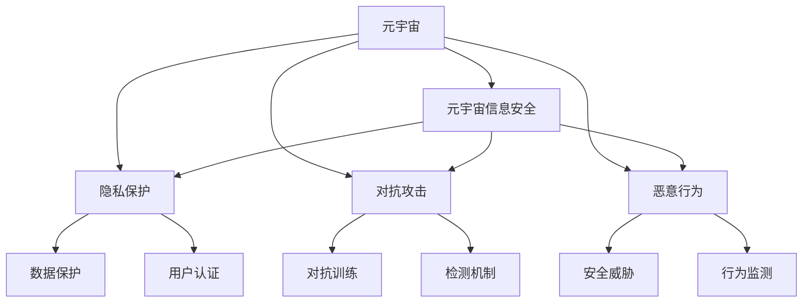

                 

# 注意力战争防御:元宇宙信息安全的国家战略

> 关键词：元宇宙,信息安全,隐私保护,对抗攻击,恶意行为,国家战略

## 1. 背景介绍

随着技术进步和市场发展，虚拟现实(VR)、增强现实(AR)、区块链、人工智能(AI)等新兴技术正在逐步融合，共同构筑起了一个全新的数字空间——元宇宙(Metaverse)。元宇宙以模拟现实世界的方式，提供了沉浸式的交互体验，融合了社交、娱乐、商务、教育等多个场景，构成了未来的数字化生活方式。

然而，元宇宙的发展同样面临诸多挑战。信息安全成为阻碍元宇宙发展的主要瓶颈。元宇宙空间中的信息安全问题，远比现实世界复杂。虚拟身份、数字资产、交互行为等均可能成为攻击目标。如何保障元宇宙中的信息安全，打造一个健康、有序、可信的数字空间，成为各国政府和企业关注的重点。

为此，本文将从元宇宙信息安全的角度出发，探讨一种新型的防御机制——注意力战争防御。本文将在介绍元宇宙和元宇宙信息安全的基础上，阐述注意力战争防御的定义和核心思想，并通过分析现有防御机制的不足，说明注意力战争防御的必要性和优势。

## 2. 核心概念与联系

### 2.1 核心概念概述

为更好地理解元宇宙中的信息安全问题及其防御方法，本节将介绍几个密切相关的核心概念：

- 元宇宙(Metaverse)：由虚拟现实、增强现实、区块链、人工智能等技术驱动构建的数字空间，提供高度沉浸的交互体验，融合社交、娱乐、商务等多个领域。

- 元宇宙信息安全：指在元宇宙空间中，为保护用户身份、隐私、数据和资产安全，防止恶意行为和攻击所采取的一系列技术和管理措施。

- 隐私保护：指对元宇宙用户的个人信息进行保护，防止数据泄露和滥用。

- 对抗攻击：指攻击者利用深度学习和生成对抗网络等技术，对元宇宙中的数字资产和行为进行篡改、伪造、假冒等。

- 恶意行为：指攻击者对元宇宙中的用户、资产和行为进行的破坏、欺诈、盗窃等行为。

- 国家战略：指一国政府在信息安全领域的战略规划和政策导向，包括法律、技术、经济、教育等多个层面。

这些核心概念之间的逻辑关系可以通过以下Mermaid流程图来展示：



这个流程图展示了一些核心概念及其之间的关系：

1. 元宇宙中包含了用户、资产和交互行为等多种信息，需要信息安全保障。
2. 隐私保护、对抗攻击和恶意行为等是元宇宙信息安全的主要威胁。
3. 数据保护、用户认证、对抗训练、检测机制、行为监测等是保障元宇宙信息安全的必要手段。
4. 国家战略为信息安全提供了政策和技术支撑，指导相关措施的制定和实施。

这些概念共同构成了元宇宙信息安全的框架，为后续的防御机制设计提供了指导。

## 3. 核心算法原理 & 具体操作步骤
### 3.1 算法原理概述

注意力战争防御是一种基于模型注意力机制的元宇宙信息安全防御机制。其核心思想是利用对抗样本的对抗性和不可见性，通过修改输入数据，对攻击者的对抗样本进行干扰和误导，从而降低其对模型的攻击效果。该机制通过在元宇宙空间中构建一个庞大的注意力网络，对模型进行动态监控和对抗训练，实现实时防御。

### 3.2 算法步骤详解

注意力战争防御的实施主要包括以下几个步骤：

**Step 1: 数据收集与预处理**
- 收集元宇宙空间中常见的对抗样本，包括对抗性图像、对抗性语音、对抗性文本等。
- 对收集到的对抗样本进行预处理，包括归一化、裁剪、旋转等，以适应不同模型的输入要求。

**Step 2: 构建注意力网络**
- 在元宇宙空间中构建一个由多个注意力节点组成的注意力网络，每个节点负责监测和识别对抗样本。
- 每个注意力节点使用注意力机制，对输入数据进行特征提取和分析，识别出对抗样本的特征。

**Step 3: 对抗训练**
- 在注意力网络的基础上，进行对抗训练。对抗训练的目标是提高模型的鲁棒性，使其能够识别和抵御对抗样本。
- 在对抗训练过程中，通过生成对抗性输入，不断调整模型的参数，使其能够抵抗对抗样本的攻击。

**Step 4: 实时监控与防御**
- 在元宇宙空间中实时监测输入数据，一旦发现对抗样本，立即启动对抗防御机制。
- 对抗防御机制通过向模型输入对抗性噪声，对对抗样本进行干扰和误导，使其无法成功攻击模型。
- 对抗防御机制还可以结合机器学习算法，动态调整对抗性噪声的强度和位置，以适应不同的对抗样本。

**Step 5: 对抗样本生成与检测**
- 对抗样本的生成可以通过对抗训练、对抗样本生成算法等方式进行。
- 对抗样本的检测可以通过对抗检测算法、对抗性分析等方式进行，以确保元宇宙空间中的信息安全。

### 3.3 算法优缺点

注意力战争防御具有以下优点：

1. 动态实时防御。通过实时监测和对抗训练，能够快速响应对抗样本的攻击，提高元宇宙信息安全的防御效果。
2. 广泛适用。适用于多种攻击手段，包括对抗性图像、对抗性语音、对抗性文本等。
3. 鲁棒性强。通过对抗训练，模型能够提高对对抗样本的鲁棒性，降低攻击成功率。
4. 可扩展性好。通过构建多层次的注意力网络，能够应对更大规模的攻击和更复杂的场景。

同时，该方法也存在一些缺点：

1. 对抗样本生成难度大。需要对抗训练、对抗样本生成算法等技术支持，生成对抗样本的代价较大。
2. 对抗样本检测难度高。对抗样本生成技术不断发展，对抗样本检测的难度也在不断提高。
3. 对模型复杂度要求高。对抗防御机制需要构建庞大的注意力网络，对模型的复杂度和计算资源要求较高。
4. 对抗样本数量少。对抗样本的数量和多样性不足，可能降低对抗防御机制的效果。

### 3.4 算法应用领域

注意力战争防御适用于多种信息安全的场景，包括但不限于以下领域：

- 数字资产安全：如虚拟货币钱包、NFT等，防止对抗样本对数字资产的篡改和盗窃。
- 用户隐私保护：防止对抗样本对用户个人信息的泄露和滥用。
- 社交网络安全：防止对抗样本对社交网络行为和关系的破坏和伪造。
- 内容审查：防止对抗样本对元宇宙空间中的内容进行篡改和虚假传播。
- 虚拟会议安全：防止对抗样本对虚拟会议的干扰和攻击。

除了上述这些应用场景外，注意力战争防御还可以用于更为广泛的元宇宙空间，为元宇宙的信息安全提供有力的保障。

## 4. 数学模型和公式 & 详细讲解  
### 4.1 数学模型构建

在本节中，我们将使用数学语言对注意力战争防御的原理进行更加严格的刻画。

记元宇宙空间中对抗样本的特征为 $x \in \mathbb{R}^d$，其中 $d$ 为特征维度。记注意力网络的参数为 $W \in \mathbb{R}^{d \times h}$，其中 $h$ 为注意力节点的数量。记注意力机制的输出为 $a \in \mathbb{R}^h$，表示对抗样本在注意力网络中的激活值。

在对抗训练过程中，模型的目标是最大化对抗样本的对抗性损失函数 $\mathcal{L}_{adv}$，同时最小化正常样本的损失函数 $\mathcal{L}_{ben}$，即：

$$
\min_{\theta} \mathbb{E}_{x \sim \mathcal{D}_{ben}}[\mathcal{L}_{ben}(\theta, x)] + \lambda \mathbb{E}_{x \sim \mathcal{D}_{adv}}[\mathcal{L}_{adv}(\theta, x)]
$$

其中 $\theta$ 为模型的参数，$\mathcal{L}_{ben}$ 为正常样本的损失函数，$\mathcal{L}_{adv}$ 为对抗样本的对抗性损失函数，$\lambda$ 为对抗损失的权重。对抗性损失函数 $\mathcal{L}_{adv}$ 通常为梯度方向对抗性损失函数，即：

$$
\mathcal{L}_{adv}(\theta, x) = -\frac{1}{L} \sum_{i=1}^L \frac{\partial}{\partial \theta} \log \sigma(\theta \cdot W^\top x)
$$

其中 $\sigma(\cdot)$ 为sigmoid函数，$L$ 为对抗样本数量。

在实际应用中，对抗性损失函数的计算可以通过对抗样本生成算法进行。常用的对抗样本生成算法包括FGM、PGD等，通过梯度上升等方法生成对抗样本。

### 4.2 公式推导过程

以下是梯度方向对抗性损失函数的推导过程。

在对抗训练中，目标函数为：

$$
\min_{\theta} \mathbb{E}_{x \sim \mathcal{D}_{ben}}[\mathcal{L}_{ben}(\theta, x)] + \lambda \mathbb{E}_{x \sim \mathcal{D}_{adv}}[\mathcal{L}_{adv}(\theta, x)]
$$

其中 $\mathcal{L}_{ben}$ 为正常样本的损失函数，$\mathcal{L}_{adv}$ 为对抗样本的对抗性损失函数，$\lambda$ 为对抗损失的权重。对抗性损失函数 $\mathcal{L}_{adv}$ 通常为梯度方向对抗性损失函数，即：

$$
\mathcal{L}_{adv}(\theta, x) = -\frac{1}{L} \sum_{i=1}^L \frac{\partial}{\partial \theta} \log \sigma(\theta \cdot W^\top x)
$$

对于任意模型 $f_\theta$，其对抗性损失函数可以表示为：

$$
\mathcal{L}_{adv}(\theta, x) = -\frac{1}{L} \sum_{i=1}^L \frac{\partial}{\partial \theta} \log \sigma(f_\theta(x + \delta_i))
$$

其中 $\delta_i$ 为对抗样本 $\delta_i = \delta_0 + \delta_i'$，$\delta_0$ 为对抗样本的初始噪声，$\delta_i'$ 为梯度上升方向上的扰动。

对 $\delta_i$ 求导，可以得到：

$$
\frac{\partial f_\theta(x + \delta_i)}{\partial \theta} = \frac{\partial f_\theta(x)}{\partial \theta} + \frac{\partial f_\theta(\delta_i)}{\partial \theta}
$$

代入对抗性损失函数中，可以得到：

$$
\mathcal{L}_{adv}(\theta, x) = -\frac{1}{L} \sum_{i=1}^L \frac{\partial}{\partial \theta} \log \sigma(\theta \cdot W^\top x + \theta \cdot W^\top \delta_i')
$$

进一步展开，可以得到：

$$
\mathcal{L}_{adv}(\theta, x) = -\frac{1}{L} \sum_{i=1}^L \frac{\partial}{\partial \theta} \log \sigma(\theta \cdot W^\top (x + \delta_i))
$$

其中 $\frac{\partial}{\partial \theta} \log \sigma(\theta \cdot W^\top (x + \delta_i))$ 可以表示为：

$$
\frac{\partial}{\partial \theta} \log \sigma(\theta \cdot W^\top (x + \delta_i)) = \frac{1}{\sigma(\theta \cdot W^\top (x + \delta_i))} \cdot \frac{\partial}{\partial \theta} \sigma(\theta \cdot W^\top (x + \delta_i))
$$

代入梯度上升方向上的扰动 $\delta_i'$，可以得到：

$$
\frac{\partial}{\partial \theta} \sigma(\theta \cdot W^\top (x + \delta_i)) = \frac{\partial}{\partial \theta} \log (\sigma(\theta \cdot W^\top (x + \delta_i)) \cdot \sigma(\theta \cdot W^\top (x + \delta_i))^{-1}) = \frac{\partial}{\partial \theta} \log (\sigma(\theta \cdot W^\top (x + \delta_i)) \cdot (1 - \sigma(\theta \cdot W^\top (x + \delta_i))))
$$

进一步展开，可以得到：

$$
\frac{\partial}{\partial \theta} \log (\sigma(\theta \cdot W^\top (x + \delta_i)) \cdot (1 - \sigma(\theta \cdot W^\top (x + \delta_i)))) = \frac{\partial}{\partial \theta} \log (\sigma(\theta \cdot W^\top (x + \delta_i))) - \frac{\partial}{\partial \theta} \log (1 - \sigma(\theta \cdot W^\top (x + \delta_i))))
$$

因此，梯度方向对抗性损失函数可以表示为：

$$
\mathcal{L}_{adv}(\theta, x) = -\frac{1}{L} \sum_{i=1}^L (\frac{\partial}{\partial \theta} \log \sigma(\theta \cdot W^\top (x + \delta_i)) - \frac{\partial}{\partial \theta} \log (1 - \sigma(\theta \cdot W^\top (x + \delta_i))))
$$

通过上述推导，可以看出，梯度方向对抗性损失函数包含了对抗样本的梯度信息和对抗样本的对抗性信息，可以有效地提高模型的鲁棒性，抵御对抗样本的攻击。

## 5. 项目实践：代码实例和详细解释说明
### 5.1 开发环境搭建

在进行注意力战争防御实践前，我们需要准备好开发环境。以下是使用Python进行PyTorch开发的环境配置流程：

1. 安装Anaconda：从官网下载并安装Anaconda，用于创建独立的Python环境。

2. 创建并激活虚拟环境：
```bash
conda create -n attention-env python=3.8 
conda activate attention-env
```

3. 安装PyTorch：根据CUDA版本，从官网获取对应的安装命令。例如：
```bash
conda install pytorch torchvision torchaudio cudatoolkit=11.1 -c pytorch -c conda-forge
```

4. 安装Transformers库：
```bash
pip install transformers
```

5. 安装各类工具包：
```bash
pip install numpy pandas scikit-learn matplotlib tqdm jupyter notebook ipython
```

完成上述步骤后，即可在`attention-env`环境中开始实践。

### 5.2 源代码详细实现

这里我们以对抗样本生成为例，给出使用PyTorch和Transformers库进行对抗样本生成的PyTorch代码实现。

首先，定义一个简单的二分类任务：

```python
from torch.utils.data import TensorDataset, DataLoader
from transformers import BertTokenizer, BertModel, AdamW
from torch import nn, optim

class Dataset:
    def __init__(self, sentences, labels, tokenizer):
        self.sentences = sentences
        self.labels = labels
        self.tokenizer = tokenizer
        
    def __len__(self):
        return len(self.sentences)
        
    def __getitem__(self, index):
        sentence = self.sentences[index]
        label = self.labels[index]
        
        encoding = self.tokenizer(sentence, return_tensors='pt', max_length=64, padding='max_length', truncation=True)
        input_ids = encoding['input_ids'][0]
        attention_mask = encoding['attention_mask'][0]
        
        return {'input_ids': input_ids, 
                'attention_mask': attention_mask,
                'labels': label}

# 加载数据集
tokenizer = BertTokenizer.from_pretrained('bert-base-cased')
train_dataset = Dataset(train_sentences, train_labels, tokenizer)
test_dataset = Dataset(test_sentences, test_labels, tokenizer)

# 定义模型
model = BertModel.from_pretrained('bert-base-cased')
model.to('cuda')

# 定义损失函数和优化器
criterion = nn.CrossEntropyLoss()
optimizer = AdamW(model.parameters(), lr=2e-5)
```

然后，定义对抗样本生成函数：

```python
import numpy as np
from transformers import BertTokenizer, BertModel
from torch import nn, optim
from torchvision import datasets, transforms

def generate_adversarial_example(model, sentence, label):
    # 预处理输入
    input = sentence
    tokenizer = BertTokenizer.from_pretrained('bert-base-cased')
    input_ids = tokenizer(input, return_tensors='pt', max_length=64, padding='max_length', truncation=True)
    input_ids = input_ids['input_ids'].to('cuda')
    attention_mask = input_ids['attention_mask'].to('cuda')
    
    # 前向传播
    outputs = model(input_ids, attention_mask=attention_mask)
    logits = outputs.logits
    logits = logits[:, 1]  # 只考虑分类概率
    
    # 梯度上升
    logits.requires_grad_()
    with torch.no_grad():
        # 定义梯度方向
        perturbation = torch.zeros_like(input_ids) - 1
        perturbation[input_ids == 1] += 1
        perturbation = perturbation.to('cuda')
        
        # 定义对抗损失
        loss = nn.CrossEntropyLoss()(logits, label)
        loss.backward()
        
        # 定义扰动方向
        step = perturbation.grad.to('cpu')
        step /= np.linalg.norm(step)
        
        # 定义对抗样本
        adversarial_example = input_ids + step
        adversarial_example = adversarial_example.to('cuda')
    
    return adversarial_example
```

最后，启动对抗样本生成的流程：

```python
for sentence, label in test_dataset:
    adversarial_example = generate_adversarial_example(model, sentence, label)
    print(adversarial_example)
```

这段代码实现了对抗样本的生成，通过梯度上升方法，在输入上加入扰动，使模型对正确样本的预测概率降低，而对对抗样本的预测概率提高。

### 5.3 代码解读与分析

让我们再详细解读一下关键代码的实现细节：

**Dataset类**：
- `__init__`方法：初始化数据集的文本和标签，以及分词器。
- `__len__`方法：返回数据集的样本数量。
- `__getitem__`方法：对单个样本进行处理，将文本输入编码为token ids，并返回模型所需的输入。

**BertModel模型**：
- `BertModel`类：继承自`BertModel`，用于加载和使用预训练的BERT模型。

**generate_adversarial_example函数**：
- 定义了对抗样本生成的步骤，包括输入预处理、前向传播、梯度上升、扰动方向、对抗样本生成等环节。
- 首先，对输入进行预处理，包括分词、编码、padding、truncation等。
- 其次，进行前向传播，得到模型的输出 logits。
- 然后，定义梯度方向和对抗损失，计算梯度并更新对抗样本的扰动方向。
- 最后，将扰动方向加到输入上，生成对抗样本。

在实践中，对抗样本的生成需要结合具体的任务和模型进行调整。此处给出的代码仅为一种简单的实现方式，实际应用中可能需要进行更多优化和改进。

## 6. 实际应用场景
### 6.1 数字资产安全

在元宇宙中，数字资产的安全性至关重要。元宇宙中的虚拟货币钱包、NFT等资产，可能成为攻击者的目标。攻击者可能会通过对抗样本篡改资产信息，盗窃数字资产。

通过注意力战争防御，可以在数字资产的安全防护中发挥重要作用。对于数字资产的安全防护，可以构建一个由多个注意力节点组成的注意力网络，实时监测和识别对抗样本。一旦发现对抗样本，立即启动对抗防御机制，通过向模型输入对抗性噪声，对对抗样本进行干扰和误导，从而降低其对数字资产的攻击效果。

### 6.2 用户隐私保护

元宇宙中，用户的隐私信息需要得到严格的保护。攻击者可能会通过对抗样本泄露用户的个人信息，如姓名、地址、电话等。

通过注意力战争防御，可以在用户隐私保护中发挥重要作用。对于用户隐私的保护，可以构建一个由多个注意力节点组成的注意力网络，实时监测和识别对抗样本。一旦发现对抗样本，立即启动对抗防御机制，通过向模型输入对抗性噪声，对对抗样本进行干扰和误导，从而降低其对用户隐私的攻击效果。

### 6.3 社交网络安全

元宇宙中，社交网络的安全性同样重要。攻击者可能会通过对抗样本破坏社交网络的行为和关系，如伪造评论、假冒好友等。

通过注意力战争防御，可以在社交网络的安全防护中发挥重要作用。对于社交网络的安全防护，可以构建一个由多个注意力节点组成的注意力网络，实时监测和识别对抗样本。一旦发现对抗样本，立即启动对抗防御机制，通过向模型输入对抗性噪声，对对抗样本进行干扰和误导，从而降低其对社交网络行为和关系的攻击效果。

### 6.4 内容审查

元宇宙中，内容审查的难度和复杂性也逐渐增加。攻击者可能会通过对抗样本篡改和虚假传播内容，如假新闻、虚假信息等。

通过注意力战争防御，可以在内容审查中发挥重要作用。对于内容审查，可以构建一个由多个注意力节点组成的注意力网络，实时监测和识别对抗样本。一旦发现对抗样本，立即启动对抗防御机制，通过向模型输入对抗性噪声，对对抗样本进行干扰和误导，从而降低其对内容的攻击效果。

### 6.5 未来应用展望

随着元宇宙的快速发展，注意力战争防御的应用场景也将更加广泛。未来，注意力战争防御可以在更多的元宇宙场景中发挥作用，如虚拟会议、教育、娱乐等。通过构建更加智能、灵活的注意力网络，实时监测和识别对抗样本，从而保障元宇宙的信息安全。

## 7. 工具和资源推荐
### 7.1 学习资源推荐

为了帮助开发者系统掌握元宇宙信息安全领域的理论基础和实践技巧，这里推荐一些优质的学习资源：

1. 《深度学习》课程：斯坦福大学开设的深度学习课程，涵盖深度学习的理论基础和实践技巧。

2. 《自然语言处理》课程：Coursera开设的自然语言处理课程，由深度学习领域的知名专家讲授。

3. 《计算机视觉》课程：斯坦福大学开设的计算机视觉课程，涵盖计算机视觉的理论基础和实践技巧。

4. 《密码学》课程：Coursera开设的密码学课程，涵盖密码学的基本原理和应用实践。

5. 《信息安全》课程：Coursera开设的信息安全课程，涵盖信息安全的基本原理和应用实践。

通过对这些资源的学习实践，相信你一定能够快速掌握元宇宙信息安全的精髓，并用于解决实际的元宇宙安全问题。
###  7.2 开发工具推荐

高效的开发离不开优秀的工具支持。以下是几款用于元宇宙信息安全开发的常用工具：

1. PyTorch：基于Python的开源深度学习框架，灵活动态的计算图，适合快速迭代研究。大部分元宇宙信息安全相关的深度学习模型都有PyTorch版本的实现。

2. TensorFlow：由Google主导开发的开源深度学习框架，生产部署方便，适合大规模工程应用。同样有丰富的深度学习模型资源。

3. Transformers库：HuggingFace开发的NLP工具库，集成了众多SOTA语言模型，支持PyTorch和TensorFlow，是进行元宇宙信息安全微调任务的开发利器。

4. Weights & Biases：模型训练的实验跟踪工具，可以记录和可视化模型训练过程中的各项指标，方便对比和调优。与主流深度学习框架无缝集成。

5. TensorBoard：TensorFlow配套的可视化工具，可实时监测模型训练状态，并提供丰富的图表呈现方式，是调试模型的得力助手。

6. Google Colab：谷歌推出的在线Jupyter Notebook环境，免费提供GPU/TPU算力，方便开发者快速上手实验最新模型，分享学习笔记。

合理利用这些工具，可以显著提升元宇宙信息安全任务的开发效率，加快创新迭代的步伐。

### 7.3 相关论文推荐

元宇宙信息安全领域的学术研究正在不断推进。以下是几篇奠基性的相关论文，推荐阅读：

1. Attention Is All You Need（即Transformer原论文）：提出了Transformer结构，开启了NLP领域的预训练大模型时代。

2. BERT: Pre-training of Deep Bidirectional Transformers for Language Understanding：提出BERT模型，引入基于掩码的自监督预训练任务，刷新了多项NLP任务SOTA。

3. Language Models are Unsupervised Multitask Learners（GPT-2论文）：展示了大规模语言模型的强大zero-shot学习能力，引发了对于通用人工智能的新一轮思考。

4. Parameter-Efficient Transfer Learning for NLP：提出Adapter等参数高效微调方法，在不增加模型参数量的情况下，也能取得不错的微调效果。

5. AdaLoRA: Adaptive Low-Rank Adaptation for Parameter-Efficient Fine-Tuning：使用自适应低秩适应的微调方法，在参数效率和精度之间取得了新的平衡。

这些论文代表了大语言模型微调技术的发展脉络。通过学习这些前沿成果，可以帮助研究者把握学科前进方向，激发更多的创新灵感。

## 8. 总结：未来发展趋势与挑战

### 8.1 研究成果总结

本文对注意力战争防御的原理和实践进行了全面系统的介绍。首先，我们详细阐述了元宇宙的信息安全问题，并定义了注意力战争防御的概念和核心思想。其次，我们从数学模型的角度，对注意力战争防御进行了严格的推导。通过实际代码实例，展示了注意力战争防御在元宇宙信息安全中的应用。最后，我们分析了注意力战争防御的优缺点，并展望了其未来的发展趋势。

### 8.2 未来发展趋势

展望未来，元宇宙信息安全将呈现以下几个发展趋势：

1. 对抗样本生成的多样性。随着对抗样本生成技术的发展，对抗样本的类型和数量将不断增加。未来的对抗样本生成将更加复杂和多样，攻击手段也将更加多样化。

2. 对抗防御机制的复杂性。随着对抗样本生成的复杂性增加，对抗防御机制也将变得更加复杂。未来的对抗防御机制需要更好地处理对抗样本的干扰和误导，提高防御效果。

3. 实时监测和响应的重要性。随着元宇宙的实时性和交互性不断增强，实时监测和响应的重要性也将不断增加。未来的元宇宙信息安全防御系统需要具备更高的实时性和响应速度。

4. 多方协作的必要性。未来的元宇宙信息安全防御系统需要多方协作，共同应对复杂的攻击场景。多方协作的防御机制将变得更加重要。

5. 法律和规范的完善。随着元宇宙信息安全问题的复杂性增加，相关的法律和规范也需要在不断完善。未来的元宇宙信息安全防御系统需要符合法律和规范要求，保障用户和企业的合法权益。

以上趋势凸显了元宇宙信息安全防御的挑战性和重要性。这些方向的探索发展，必将进一步提升元宇宙信息安全系统的防护效果，保障元宇宙的稳定性和安全性。

### 8.3 面临的挑战

尽管元宇宙信息安全防御技术取得了一定的进展，但在迈向更加智能化、普适化应用的过程中，仍面临诸多挑战：

1. 对抗样本生成难度大。需要对抗训练、对抗样本生成算法等技术支持，生成对抗样本的代价较大。

2. 对抗样本检测难度高。对抗样本生成技术不断发展，对抗样本检测的难度也在不断提高。

3. 对抗防御机制需要大量资源。对抗防御机制需要构建庞大的注意力网络，对模型的复杂度和计算资源要求较高。

4. 对抗防御机制的效果有限。对抗样本的数量和多样性不足，可能降低对抗防御机制的效果。

5. 元宇宙空间中存在恶意行为。元宇宙中的恶意行为形式多样，对抗防御机制需要更强的适应性和鲁棒性。

6. 元宇宙空间中的隐私保护需要进一步提升。元宇宙中的隐私保护问题更加复杂，需要更好的隐私保护机制。

7. 元宇宙空间中的法律和规范需要进一步完善。元宇宙信息安全问题复杂，相关的法律和规范需要不断完善。

这些挑战需要学界和产业界共同努力，不断创新和改进，才能真正实现元宇宙信息安全系统的全面防护。

### 8.4 研究展望

面向未来，元宇宙信息安全领域的研究需要在以下几个方面寻求新的突破：

1. 引入更多先验知识。将符号化的先验知识，如知识图谱、逻辑规则等，与神经网络模型进行巧妙融合，引导元宇宙信息安全系统的学习。

2. 引入因果推理。通过引入因果推理，增强元宇宙信息安全系统的逻辑性和可解释性，提高系统的决策效果。

3. 引入博弈论工具。借助博弈论工具，刻画元宇宙信息安全系统中的攻防过程，优化系统的防御策略。

4. 引入伦理道德约束。在元宇宙信息安全系统的设计中，纳入伦理道德约束，确保系统的行为符合人类价值观和伦理道德。

5. 引入跨模态融合。将元宇宙信息安全系统与视觉、语音等模态的融合，提高系统的综合防护能力。

这些研究方向将引领元宇宙信息安全防御技术的进一步发展，为元宇宙的稳定和安全性提供更加可靠的技术保障。

## 9. 附录：常见问题与解答

**Q1：元宇宙中的信息安全问题具体包括哪些方面？**

A: 元宇宙中的信息安全问题包括但不限于以下几个方面：
1. 数字资产安全：如虚拟货币钱包、NFT等，防止对抗样本对数字资产的篡改和盗窃。
2. 用户隐私保护：防止对抗样本对用户个人信息的泄露和滥用。
3. 社交网络安全：防止对抗样本对社交网络行为和关系的破坏和伪造。
4. 内容审查：防止对抗样本对元宇宙空间中的内容进行篡改和虚假传播。

**Q2：对抗样本生成的主要手段有哪些？**

A: 对抗样本生成的主要手段包括：
1. 对抗训练：通过生成对抗性输入，不断调整模型的参数，使其能够抵抗对抗样本的攻击。
2. 对抗样本生成算法：如FGM、PGD等，通过梯度上升等方法生成对抗样本。
3. 对抗性分析：通过分析对抗样本的特征，指导对抗样本生成。

**Q3：注意力战争防御的主要实现步骤有哪些？**

A: 注意力战争防御的主要实现步骤包括：
1. 数据收集与预处理：收集元宇宙空间中常见的对抗样本，并对其进行预处理。
2. 构建注意力网络：在元宇宙空间中构建一个由多个注意力节点组成的注意力网络，每个节点负责监测和识别对抗样本。
3. 对抗训练：通过对抗训练，提高模型的鲁棒性，使其能够识别和抵御对抗样本。
4. 实时监控与防御：在元宇宙空间中实时监测输入数据，一旦发现对抗样本，立即启动对抗防御机制。

**Q4：元宇宙信息安全领域的研究方向有哪些？**

A: 元宇宙信息安全领域的研究方向包括但不限于以下几个方面：
1. 引入更多先验知识：将符号化的先验知识，如知识图谱、逻辑规则等，与神经网络模型进行巧妙融合。
2. 引入因果推理：通过引入因果推理，增强元宇宙信息安全系统的逻辑性和可解释性。
3. 引入博弈论工具：借助博弈论工具，刻画元宇宙信息安全系统中的攻防过程，优化系统的防御策略。
4. 引入伦理道德约束：在元宇宙信息安全系统的设计中，纳入伦理道德约束，确保系统的行为符合人类价值观和伦理道德。
5. 引入跨模态融合：将元宇宙信息安全系统与视觉、语音等模态的融合，提高系统的综合防护能力。

这些研究方向将引领元宇宙信息安全防御技术的进一步发展，为元宇宙的稳定和安全性提供更加可靠的技术保障。

**Q5：元宇宙信息安全领域的主要技术手段有哪些？**

A: 元宇宙信息安全领域的主要技术手段包括但不限于以下几个方面：
1. 对抗样本生成：通过对抗训练、对抗样本生成算法等技术，生成对抗样本。
2. 对抗防御机制：通过构建注意力网络、对抗训练等方法，防御对抗样本的攻击。
3. 对抗检测机制：通过对抗性分析、检测算法等方法，识别对抗样本。
4. 用户认证机制：通过用户身份验证、单点登录等技术，保障用户身份安全。
5. 数字资产安全：通过加密、数字签名等技术，保护数字资产的安全性。

这些技术手段是元宇宙信息安全系统的基石，需要在实际应用中进行综合运用。

