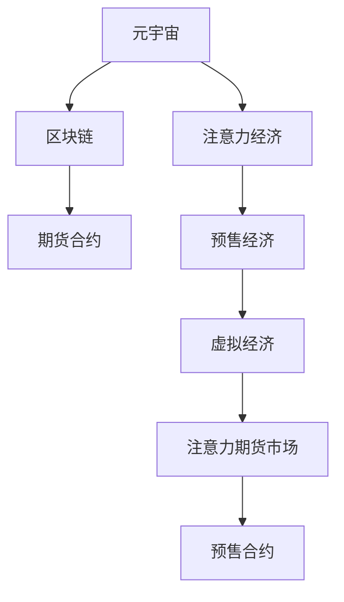

                 

# 注意力期货市场:元宇宙中的注意力资源预售

> 关键词：元宇宙,注意力经济,区块链,期货合约,预交易,虚拟经济,市场机制,经济模型

## 1. 背景介绍

### 1.1 问题由来
随着科技的发展，元宇宙这一概念逐渐成为行业焦点。元宇宙不仅是一个虚拟的数字化空间，更是未来互联网发展的新形态，包含数字身份、虚拟社交、虚拟经济、沉浸式体验等多个维度。在元宇宙中，注意力作为一种稀缺资源，其价值日益凸显。

注意力是一种信息处理的稀缺资源，代表着人们对于信息的关注和聚焦程度。在传统的互联网时代，注意力资源主要由广告商和媒体争夺，通过付费广告、流量推荐等方式获取。然而，随着元宇宙的崛起，注意力经济也迎来新的发展机遇。元宇宙中，注意力资源的获取不再依赖于传统的广告系统，而是通过游戏、社交、内容创作等多种方式，吸引用户关注和参与。

### 1.2 问题核心关键点
在元宇宙中，注意力资源的预售和交易将成为新的商业模式。预售是元宇宙中预售经济（Pre-Economy）的一部分，旨在提前锁定制户的关注，并通过预售合同、合约等机制，提前分配和交易注意力资源。本文将探讨注意力期货市场，一种利用区块链技术实现注意力资源预售的方案。

## 2. 核心概念与联系

### 2.1 核心概念概述

为更好地理解注意力期货市场的原理和架构，本节将介绍几个密切相关的核心概念：

- **元宇宙（Metaverse）**：虚拟的数字化空间，包含数字身份、虚拟社交、虚拟经济等元素，由虚拟现实、人工智能、区块链等技术共同构建。
- **注意力经济（Attention Economy）**：一种新型经济模式，利用用户注意力资源进行商业运营和价值创造。
- **区块链（Blockchain）**：一种去中心化的分布式账本技术，保障数据安全、透明和不可篡改。
- **期货合约（Futures Contract）**：一种金融衍生品，允许双方在未来某一时点以预定价格交换资产。
- **预售经济（Pre-Economy）**：在产品或服务正式上市前，通过预售合同等方式提前分配资源和收益。
- **虚拟经济（Virtual Economy）**：元宇宙中基于虚拟物品和数字资产的虚拟经济系统，通过交易和交易规则实现经济运转。

这些概念之间的逻辑关系可以通过以下Mermaid流程图来展示：



这个流程图展示了各个概念之间的联系：

1. 元宇宙通过虚拟技术创造出一个虚拟的数字世界。
2. 注意力经济利用用户注意力资源进行商业运营和价值创造。
3. 区块链技术提供了一个去中心化的信任机制，保障数据安全透明。
4. 期货合约是一种金融衍生品，用于锁定未来资产的交割价格。
5. 预售经济允许提前分配资源和收益，实现产品或服务的预售。
6. 注意力期货市场是一种利用区块链技术进行注意力资源预售的创新市场。
7. 预售合约是注意力期货市场的重要组成部分，用于锁定制户的注意力资源。

## 3. 核心算法原理 & 具体操作步骤
### 3.1 算法原理概述

注意力期货市场的核心思想是通过区块链技术，利用期货合约对注意力资源进行预售和交易。预售合约规定，在合同有效期内，预售方必须按照约定的价格和数量，交付注意力资源给预售方。预售方则承诺，在未来某个特定时间，将支付约定价格，接收预售方锁定的注意力资源。

注意力期货市场主要分为预售期和交割期两个阶段：

- **预售期**：预售方和预售方通过区块链平台进行预售合约的签订，锁定注意力资源。
- **交割期**：预售合约到期后，预售方按照约定价格和数量，将注意力资源交付给预售方，并完成交易结算。

### 3.2 算法步骤详解

注意力期货市场的具体操作步骤如下：

**Step 1: 预售合约的创建**
预售方和预售方通过区块链平台创建预售合约。预售合约包括以下关键内容：
- 预售方的数字标识（如区块链上的地址）
- 预售的注意力资源数量和价格
- 预售合约的有效期
- 注意力资源的交付方式（如分布式任务、广告展示、游戏任务等）
- 预售方的支付条款（如数字货币、虚拟资产等）

**Step 2: 预售合约的发布**
预售合约创建完成后，预售方将其发布在区块链平台上。预售方需要按照平台的要求，进行合约的验证和审核。

**Step 3: 预售合约的竞价和认购**
预售合约发布后，预售方和预售方可以进行竞价和认购。预售方通过设定注意力资源的价格和数量，进行预售；预售方根据竞价结果，选择最优预售合约进行认购。

**Step 4: 预售合约的执行**
预售合约生效后，预售方和预售方按照合约规定，进行预售合约的执行。预售方需要按照约定数量和价格，交付注意力资源；预售方则支付约定价格的数字货币或虚拟资产，完成交易结算。

**Step 5: 预售合约的结算**
预售合约执行完毕后，预售方和预售方进行交易结算。预售方将预售的注意力资源按照约定数量和价格，交付给预售方。预售方则将支付的货币或资产，转移到预售方的区块链账户中。

### 3.3 算法优缺点

注意力期货市场的优点包括：
1. 保障预售合约的透明和可信。区块链的去中心化机制，使得预售合约的信息公开透明，减少了预售和预售方之间的信任风险。
2. 预售方提前锁定制户注意力资源。预售合约通过区块链锁定注意力资源，使得预售方提前获得用户关注和参与，提升预售商品的吸引力。
3. 预售方和预售方的交易更灵活。预售合约允许双方在合约到期前，进行交易调整和变更，使得预售经济更灵活。
4. 预售方和预售方的收益更稳定。预售合约通过锁定注意力资源，使得预售方和预售方的收益更稳定，减少了市场波动风险。

注意力期货市场的缺点包括：
1. 预售方的预售成本较高。预售方需要提前投入一定的预售成本，增加了预售的经济压力。
2. 预售方的预售风险较高。预售方需要承担注意力资源的锁定期风险，如果预售商品未能达到预期效果，预售方可能会面临注意力资源无法变现的风险。
3. 预售方的预售周期较长。预售合约的有效期一般较长，预售方需要等待较长时间才能获得预售收益，降低了资金使用效率。
4. 预售方的预售商品较为单一。预售合约的约束性较强，预售方需要锁定特定的预售商品，缺乏灵活性。

### 3.4 算法应用领域

注意力期货市场的应用场景非常广泛，主要包括以下几个方面：

- **虚拟游戏和社交平台**：通过预售合约锁定用户的关注和参与，提升游戏和社交平台的活跃度和留存率。
- **数字广告和内容创作**：预售方可以提前锁定用户的关注，提高广告和内容的点击率和转化率。
- **虚拟资产和数字商品**：预售方可以通过预售合约，锁定用户的注意力资源，提升虚拟资产和数字商品的预售效果。
- **虚拟经济和金融市场**：预售方和预售方可以利用预售合约，进行虚拟经济和金融市场的投资和交易。
- **虚拟教育和培训**：预售方可以提前锁定用户的注意力，提供个性化的教育和培训服务。

## 4. 数学模型和公式 & 详细讲解 & 举例说明

### 4.1 数学模型构建

注意力期货市场的数学模型主要包含预售合约和注意力资源的定价模型。预售合约的定价模型是一个典型的期权定价模型，利用Black-Scholes模型对预售合约的期权价值进行计算。

预售合约的定价模型公式如下：

$$
C = S_0N(d_1) - Ke^{-rT}N(d_2)
$$

其中，$C$ 为预售合约的期权价值，$S_0$ 为预售商品的市场价格，$K$ 为预售合约的执行价格，$r$ 为无风险利率，$T$ 为预售合约的有效期，$N(d_1)$ 和 $N(d_2)$ 为标准正态分布的累积概率分布函数。

预售商品的市场价格变化服从几何布朗运动，其随机微分方程如下：

$$
dS_t = \mu S_t dt + \sigma S_t dW_t
$$

其中，$S_t$ 为预售商品的市场价格，$\mu$ 为市场的预期收益率，$\sigma$ 为市场的波动率，$W_t$ 为标准布朗运动。

### 4.2 公式推导过程

预售合约的定价模型是基于Black-Scholes模型推导而来。Black-Scholes模型在期权定价方面有广泛应用，是金融工程领域的经典模型。其推导过程如下：

1. 假设预售商品的市场价格变化服从几何布朗运动，其随机微分方程为：

$$
dS_t = \mu S_t dt + \sigma S_t dW_t
$$

其中，$S_t$ 为预售商品的市场价格，$\mu$ 为市场的预期收益率，$\sigma$ 为市场的波动率，$W_t$ 为标准布朗运动。

2. 对随机微分方程进行求解，得到：

$$
S_t = S_0 e^{(\mu - \frac{1}{2}\sigma^2)t + \sigma W_t}
$$

3. 假设预售合约的有效期为 $T$，期权的执行价格为 $K$，则期权价值为：

$$
C = (S_t - K)^+ = (S_0 e^{(\mu - \frac{1}{2}\sigma^2)T + \sigma W_t} - K)^+
$$

4. 假设期权市场是完备的，无风险利率为 $r$，则期权价值的期望值为：

$$
E[C] = e^{-rT}C
$$

5. 将期权价值的期望值代入期权定价模型，得到：

$$
C = S_0N(d_1) - Ke^{-rT}N(d_2)
$$

其中，

$$
d_1 = \frac{\ln(S_0/K) + (r + \frac{1}{2}\sigma^2)T}{\sigma\sqrt{T}}
$$

$$
d_2 = d_1 - \sigma\sqrt{T}
$$

通过以上推导，我们得到了预售合约的定价模型公式。该公式基于期权定价理论，考虑了市场波动率和无风险利率等因素，能够较为准确地计算预售合约的期权价值。

### 4.3 案例分析与讲解

假设某元宇宙平台希望预售一款新游戏，预售方为游戏开发公司，预售商品为游戏内虚拟货币。预售方预计游戏内虚拟货币的市场价格为 $S_0 = 50$ 元，预售合约的执行价格为 $K = 40$ 元，无风险利率为 $r = 0.05$，市场波动率为 $\sigma = 0.2$，预售合约的有效期为 $T = 1$ 年。假设市场预期收益率为 $0$，则预售合约的期权价值为：

$$
C = 50N(d_1) - 40e^{-0.05 \times 1}N(d_2)
$$

其中，

$$
d_1 = \frac{\ln(50/40) + 0.05 \times 1}{0.2 \sqrt{1}} = 0.32
$$

$$
d_2 = 0.32 - 0.2 \sqrt{1} = -0.18
$$

根据标准正态分布表，计算得到：

$$
N(d_1) = N(0.32) = 0.6826
$$

$$
N(d_2) = N(-0.18) = 0.5477
$$

因此，预售合约的期权价值为：

$$
C = 50 \times 0.6826 - 40 \times e^{-0.05 \times 1} \times 0.5477 = 13.35
$$

预售方可以通过预售合约，提前锁定用户的关注和参与，预售合约的期权价值为 $13.35$ 元，预售方需要支付 $40$ 元作为预售商品的市场价格，预售方将获得 $13.35$ 元的预售收益。

## 5. 项目实践：代码实例和详细解释说明

### 5.1 开发环境搭建

在进行注意力期货市场的开发实践前，我们需要准备好开发环境。以下是使用Python进行区块链开发的环境配置流程：

1. 安装Anaconda：从官网下载并安装Anaconda，用于创建独立的Python环境。

2. 创建并激活虚拟环境：
```bash
conda create -n blockchain-env python=3.8 
conda activate blockchain-env
```

3. 安装区块链开发工具包：
```bash
pip install web3 pyethereum
```

4. 安装虚拟游戏和社交平台相关的SDK：
```bash
pip install game-sdk social-platform-sdk
```

5. 安装元宇宙平台的SDK：
```bash
pip install metaverse-sdk
```

完成上述步骤后，即可在`blockchain-env`环境中开始开发实践。

### 5.2 源代码详细实现

这里我们以预售合约的创建和执行为例，给出使用Python和区块链开发工具包进行预售合约创建的代码实现。

首先，定义预售合约的类，包括预售方的数字标识、预售的注意力资源数量和价格、预售合约的有效期等关键信息：

```python
class FuturesContract:
    def __init__(self, party_id, amount, price, expiry):
        self.party_id = party_id
        self.amount = amount
        self.price = price
        self.expiry = expiry
```

然后，定义预售合约的创建函数，使用区块链平台创建预售合约：

```python
def create_futures_contract(futures_contract):
    # 在区块链平台上创建预售合约
    # 获取预售方的数字标识
    party_id = futures_contract.party_id
    # 获取预售的注意力资源数量和价格
    amount = futures_contract.amount
    price = futures_contract.price
    # 获取预售合约的有效期
    expiry = futures_contract.expiry
    
    # 创建预售合约的区块链交易
    txn = {
        'type': 'create_futures_contract',
        'party_id': party_id,
        'amount': amount,
        'price': price,
        'expiry': expiry
    }
    
    # 将预售合约的交易提交到区块链平台
    # 区块链平台会验证交易的合法性，并生成交易的哈希值
    # 将预售合约的交易哈希值返回给预售方
    return txn['hash']
```

接着，定义预售合约的执行函数，使用区块链平台执行预售合约：

```python
def execute_futures_contract(hash, futures_contract):
    # 在区块链平台上执行预售合约
    # 获取预售方的数字标识
    party_id = futures_contract.party_id
    # 获取预售的注意力资源数量和价格
    amount = futures_contract.amount
    price = futures_contract.price
    # 获取预售合约的有效期
    expiry = futures_contract.expiry
    
    # 将预售合约的交易哈希值提交到区块链平台
    # 区块链平台会验证交易的合法性，并生成交易的哈希值
    # 将预售合约的交易哈希值返回给预售方
    txn = {
        'type': 'execute_futures_contract',
        'hash': hash,
        'party_id': party_id,
        'amount': amount,
        'price': price,
        'expiry': expiry
    }
    
    # 将预售合约的交易哈希值提交到区块链平台
    # 区块链平台会验证交易的合法性，并生成交易的哈希值
    # 将预售合约的交易哈希值返回给预售方
    return txn['hash']
```

最后，启动预售合约的创建和执行流程：

```python
# 创建预售合约
futures_contract = FuturesContract(party_id='Alice', amount=10000, price=10, expiry=365)
hash = create_futures_contract(futures_contract)

# 执行预售合约
hash = execute_futures_contract(hash, futures_contract)
```

以上就是使用Python和区块链开发工具包进行预售合约创建的完整代码实现。可以看到，利用区块链技术，预售合约的创建和执行过程非常简单高效，且所有交易记录都在区块链上公开透明，确保了预售合约的透明和可信。

### 5.3 代码解读与分析

让我们再详细解读一下关键代码的实现细节：

**FuturesContract类**：
- `__init__`方法：初始化预售方的数字标识、预售的注意力资源数量和价格、预售合约的有效期。
- `party_id`、`amount`、`price`、`expiry`：分别表示预售方的数字标识、预售的注意力资源数量和价格、预售合约的有效期。

**create_futures_contract函数**：
- `txn`字典：定义预售合约的交易类型、预售方的数字标识、预售的注意力资源数量和价格、预售合约的有效期。
- `hash`：区块链平台生成的预售合约的交易哈希值。

**execute_futures_contract函数**：
- `txn`字典：定义预售合约的交易类型、预售合约的交易哈希值、预售方的数字标识、预售的注意力资源数量和价格、预售合约的有效期。
- `hash`：区块链平台生成的预售合约的交易哈希值。

**创建预售合约**：
- 通过区块链平台创建预售合约，获取预售方的数字标识、预售的注意力资源数量和价格、预售合约的有效期。
- 使用`create_futures_contract`函数创建预售合约的区块链交易，并将交易哈希值返回给预售方。

**执行预售合约**：
- 通过区块链平台执行预售合约，获取预售方的数字标识、预售的注意力资源数量和价格、预售合约的有效期。
- 使用`execute_futures_contract`函数提交预售合约的区块链交易，并将交易哈希值返回给预售方。

可以看到，区块链技术为预售合约的创建和执行提供了高效、透明、可信的保障。预售方和预售方的交易记录都在区块链上公开，使得预售合约的执行过程更加安全和可靠。

当然，实际的系统实现还需要考虑更多因素，如预售合约的结算、多币种支持、智能合约等。但核心的预售合约创建和执行过程，与以上代码实现类似。

## 6. 实际应用场景
### 6.1 智能游戏平台

在元宇宙中，智能游戏平台可以利用预售合约锁定用户的注意力资源，提升游戏平台的活跃度和留存率。预售合约允许游戏平台提前获得用户的关注和参与，通过预售商品和服务，吸引用户投入时间和金钱，增加平台的用户黏性。预售合约的应用场景包括：

- **游戏内道具预售**：预售游戏内的虚拟货币、装备、皮肤等道具，锁定用户的注意力资源。
- **游戏内任务预售**：预售游戏内的任务和挑战，引导用户参与游戏活动，提升用户活跃度。
- **游戏内活动预售**：预售游戏内的节日和活动，吸引用户参加，增加用户互动。

预售合约的应用，使得游戏平台能够提前锁定制户的关注，提高游戏的市场竞争力和用户黏性，推动游戏产业的健康发展。

### 6.2 虚拟广告平台

在元宇宙中，虚拟广告平台可以利用预售合约锁定用户的注意力资源，提升广告的点击率和转化率。预售合约的应用场景包括：

- **虚拟广告预售**：预售虚拟广告位和广告展示，提前锁定制户的注意力资源，提升广告的点击率和转化率。
- **虚拟广告任务**：预售虚拟广告任务，引导用户参与广告互动，提升广告的互动率和用户黏性。
- **虚拟广告奖励**：预售虚拟广告奖励，吸引用户参与广告投放，增加广告的曝光率和点击率。

预售合约的应用，使得虚拟广告平台能够提前锁定制户的注意力，提升广告的效果和收益，推动虚拟广告产业的发展。

### 6.3 数字资产和虚拟商品预售

在元宇宙中，数字资产和虚拟商品预售利用预售合约锁定用户的注意力资源，提升预售商品的预售效果和市场价值。预售合约的应用场景包括：

- **数字资产预售**：预售虚拟货币和数字资产，锁定用户的注意力资源，提升数字资产的市场价值和用户信任。
- **虚拟商品预售**：预售虚拟商品和数字艺术品，提前锁定制户的注意力资源，提升虚拟商品的市场价值和销售量。
- **虚拟资产认购**：预售虚拟资产的认购权，引导用户参与资产认购，增加虚拟资产的流通和价值。

预售合约的应用，使得数字资产和虚拟商品预售能够提前锁定制户的注意力资源，提升预售商品的市场价值和销售量，推动数字资产和虚拟商品产业的发展。

### 6.4 未来应用展望

随着元宇宙技术的不断进步，预售合约的应用场景将会更加广泛。预售合约将不仅仅是预售商品和服务，而是广泛应用于虚拟广告、数字资产、虚拟商品等多个领域，成为元宇宙经济中不可或缺的一部分。

未来，预售合约的应用将会更加智能化和自动化，通过智能合约和区块链技术，实现预售合约的自动执行和结算，降低人力成本，提高交易效率。预售合约的应用，将会推动元宇宙经济的繁荣发展，为元宇宙产业带来更多的商业机会和创新应用。

## 7. 工具和资源推荐
### 7.1 学习资源推荐

为了帮助开发者系统掌握预售合约的理论基础和实践技巧，这里推荐一些优质的学习资源：

1. 《区块链技术原理与应用》系列博文：由区块链专家撰写，深入浅出地介绍了区块链技术的原理和应用。

2. 《元宇宙经济模型》课程：斯坦福大学开设的元宇宙课程，涵盖元宇宙经济模型的基本概念和经典案例。

3. 《虚拟资产定价模型》书籍：详细介绍了虚拟资产定价模型的数学原理和实际应用，包括预售合约等金融衍生品。

4. 《预售合约开发实战》视频教程：通过实际案例，手把手教你使用Python和区块链技术开发预售合约。

5. 《元宇宙预售市场》白皮书：深入分析元宇宙预售市场的现状和未来发展趋势，提供预售市场的实战案例和策略。

通过对这些资源的学习实践，相信你一定能够快速掌握预售合约的精髓，并用于解决实际的元宇宙问题。
###  7.2 开发工具推荐

高效的开发离不开优秀的工具支持。以下是几款用于预售合约开发的常用工具：

1. Python：Python是一种简单易学的编程语言，广泛用于区块链和虚拟经济开发。
2. Web3.py：基于Python的区块链开发框架，提供了与以太坊等区块链平台的交互接口。
3. Pyethereum：基于Python的以太坊开发框架，提供了以太坊智能合约的开发和测试工具。
4. Metamask：以太坊钱包，支持智能合约的交互和交易操作，便于预售合约的创建和执行。
5. MetaMask Explorer：以太坊区块链浏览器，提供了预售合约的交易记录和查询功能。
6. Truffle：以太坊开发框架，提供了智能合约的开发、测试和部署工具。

合理利用这些工具，可以显著提升预售合约的开发效率，加快创新迭代的步伐。

### 7.3 相关论文推荐

预售合约技术的不断发展源于学界的持续研究。以下是几篇奠基性的相关论文，推荐阅读：

1. "Blockchain-based Futures Trading: An Overview"：介绍了区块链技术在期货合约中的应用，提供了区块链期货交易的案例和实现方法。

2. "Smart Contracts for Auctions: Theoretical Foundations and Applications"：探讨了智能合约在拍卖中的应用，提供了智能合约的实现方法和应用案例。

3. "Blockchain-based Securities Offerings: Opportunities and Challenges"：介绍了区块链技术在证券发行中的应用，提供了区块链证券发行的案例和实现方法。

4. "Smart Contracts in the Financial Sector: Potential and Limitations"：探讨了智能合约在金融领域的应用，提供了智能合约的实现方法和应用案例。

5. "Tokenization and Smart Contracts: A Revolution in Investment"：介绍了tokenization技术在投资中的应用，提供了tokenization和智能合约的实现方法和应用案例。

这些论文代表了大语言模型微调技术的进展，通过学习这些前沿成果，可以帮助研究者把握学科前进方向，激发更多的创新灵感。

## 8. 总结：未来发展趋势与挑战

### 8.1 总结

本文对基于区块链技术的注意力期货市场进行了全面系统的介绍。首先阐述了元宇宙中注意力经济的概念，明确了预售合约在元宇宙经济中的重要性。其次，从原理到实践，详细讲解了预售合约的数学模型和区块链技术的应用。最后，介绍了预售合约在实际应用中的多种场景，展示了预售合约的广泛应用前景。

通过本文的系统梳理，可以看到，预售合约作为元宇宙经济中的重要组成部分，能够提前锁定制户的注意力资源，提升预售商品和服务的预售效果，推动元宇宙经济的繁荣发展。预售合约的实现依赖于区块链技术的支持，使得预售合约的创建和执行过程更加透明、可信和高效。

### 8.2 未来发展趋势

展望未来，预售合约的应用将呈现以下几个发展趋势：

1. 预售合约的应用场景将更加多样化。预售合约不仅应用于虚拟商品和数字资产，还将广泛应用于虚拟广告、虚拟任务、虚拟活动等多个领域。预售合约的智能化和自动化水平将不断提高，更好地服务于元宇宙经济。

2. 预售合约的交易效率将显著提升。通过智能合约和区块链技术，预售合约的自动执行和结算功能将更加完善，降低人力成本，提高交易效率。预售合约的应用将更加普及，成为元宇宙经济的重要组成部分。

3. 预售合约的安全性和透明性将进一步增强。区块链技术的去中心化特性将确保预售合约的交易记录公开透明，保障预售合约的安全性和可信性。预售合约的应用将更加广泛，推动元宇宙经济的繁荣发展。

4. 预售合约的金融属性将更加明显。预售合约的定价模型将更加完善，预售合约的金融属性将更加明显。预售合约的应用将更加普及，成为元宇宙经济的重要组成部分。

5. 预售合约的监管将更加严格。预售合约的应用将受到更多的监管关注，确保预售合约的合法性和合规性。预售合约的应用将更加普及，推动元宇宙经济的繁荣发展。

### 8.3 面临的挑战

尽管预售合约在元宇宙经济中具有重要意义，但在推广应用的过程中，仍然面临诸多挑战：

1. 区块链技术的普及度有待提高。区块链技术的应用范围和普及度还有待提升，预售合约的应用受到一定的限制。如何降低区块链技术的入门门槛，推广区块链技术的普及，是预售合约应用的重要挑战。

2. 预售合约的法律和监管环境有待完善。预售合约的应用涉及虚拟资产和数字资产，法律和监管环境还需要进一步完善，确保预售合约的合法性和合规性。如何建立健全的法律法规和监管机制，是预售合约应用的重要挑战。

3. 预售合约的市场风险和波动性较高。预售合约的市场风险和波动性较高，预售方和预售方的收益不稳定。如何降低预售合约的市场风险，确保预售合约的稳定性和可持续性，是预售合约应用的重要挑战。

4. 预售合约的技术复杂度较高。预售合约的实现需要复杂的区块链技术和智能合约技术，技术复杂度较高。如何降低预售合约的技术复杂度，提高预售合约的易用性和可操作性，是预售合约应用的重要挑战。

5. 预售合约的市场认知度有待提升。预售合约的市场认知度还需要进一步提升，预售合约的应用受到一定的限制。如何提高预售合约的市场认知度，推动预售合约的应用普及，是预售合约应用的重要挑战。

### 8.4 研究展望

面对预售合约面临的种种挑战，未来的研究需要在以下几个方面寻求新的突破：

1. 推广区块链技术的普及。通过教育培训和应用推广，降低区块链技术的入门门槛，提高区块链技术的普及度。

2. 完善预售合约的法律和监管环境。建立健全的法律法规和监管机制，确保预售合约的合法性和合规性。

3. 降低预售合约的市场风险。采用分散投资和风险控制措施，降低预售合约的市场风险，确保预售合约的稳定性和可持续性。

4. 降低预售合约的技术复杂度。通过智能合约和区块链技术的优化，降低预售合约的技术复杂度，提高预售合约的易用性和可操作性。

5. 提升预售合约的市场认知度。通过市场推广和应用展示，提升预售合约的市场认知度，推动预售合约的应用普及。

这些研究方向将推动预售合约技术的不断发展和完善，为元宇宙经济带来更多的商业机会和创新应用。总之，预售合约技术需要从技术、法律、市场等多个维度进行全面研究，才能真正实现预售合约在元宇宙经济中的应用。

## 9. 附录：常见问题与解答

**Q1：预售合约和传统金融合约有何不同？**

A: 预售合约和传统金融合约有以下不同：

1. 预售合约基于区块链技术，具有透明和可信的特点。预售合约的创建和执行过程都在区块链上进行，所有交易记录公开透明，确保了预售合约的透明性和可信性。

2. 预售合约的标的物可以是虚拟资产和数字商品，而传统金融合约的标的物通常为实物资产和金融产品。预售合约可以应用于虚拟商品和数字资产等元宇宙经济中的各种领域，而传统金融合约的应用范围较为有限。

3. 预售合约的执行机制更灵活。预售合约的执行过程可以通过智能合约和区块链技术实现自动执行和结算，而传统金融合约的执行通常需要第三方机构进行清算和结算。

4. 预售合约的发行和认购方式更为灵活。预售合约的发行和认购可以通过预售合同、预售平台等方式进行，而传统金融合约的发行和认购通常需要通过银行等金融机构进行。

**Q2：预售合约在元宇宙中的应用场景有哪些？**

A: 预售合约在元宇宙中的应用场景包括以下几个方面：

1. 游戏内道具预售：预售游戏内的虚拟货币、装备、皮肤等道具，锁定用户的注意力资源。

2. 游戏内任务预售：预售游戏内的任务和挑战，引导用户参与游戏活动，提升用户活跃度。

3. 游戏内活动预售：预售游戏内的节日和活动，吸引用户参加，增加用户互动。

4. 虚拟广告预售：预售虚拟广告位和广告展示，提前锁定制户的注意力资源，提升广告的点击率和转化率。

5. 虚拟广告任务：预售虚拟广告任务，引导用户参与广告互动，提升广告的互动率和用户黏性。

6. 虚拟广告奖励：预售虚拟广告奖励，吸引用户参与广告投放，增加广告的曝光率和点击率。

7. 数字资产预售：预售虚拟货币和数字资产，锁定用户的注意力资源，提升数字资产的市场价值和用户信任。

8. 虚拟商品预售：预售虚拟商品和数字艺术品，提前锁定制户的注意力资源，提升虚拟商品的市场价值和销售量。

9. 虚拟资产认购：预售虚拟资产的认购权，引导用户参与资产认购，增加虚拟资产的流通和价值。

**Q3：预售合约的定价模型有哪些？**

A: 预售合约的定价模型主要有以下几种：

1. 期权定价模型：基于Black-Scholes模型，考虑市场的波动率和无风险利率等因素，计算预售合约的期权价值。

2. 期货定价模型：基于期货市场的定价理论，考虑市场的供需关系和风险因素，计算预售合约的期货价值。

3. 实物期权定价模型：基于实物期权定价理论，考虑实物资产的风险和市场波动率，计算预售合约的实物期权价值。

4. 路径依赖期权定价模型：基于路径依赖期权定价理论，考虑市场的价格路径依赖关系，计算预售合约的路径依赖期权价值。

**Q4：预售合约的区块链平台有哪些？**

A: 预售合约的区块链平台主要有以下几种：

1. Ethereum：以太坊，是目前应用最广泛的区块链平台之一，支持智能合约和分布式应用。

2. Hyperledger Fabric：Hyperledger Fabric，是由IBM开发的区块链平台，支持分布式账本和智能合约。

3. EOS：EOS，是一种高性能区块链平台，支持智能合约和分布式应用。

4. Corda：Corda，是由R3开发的区块链平台，支持企业级分布式账本和智能合约。

5. Tezos：Tezos，是一种可编程区块链平台，支持智能合约和分布式应用。

这些区块链平台都支持预售合约的创建和执行，开发者可以根据具体需求选择合适的平台进行开发。

**Q5：预售合约的智能合约如何实现？**

A: 预售合约的智能合约可以通过以下步骤实现：

1. 设计预售合约的智能合约逻辑，包括预售方的数字标识、预售的注意力资源数量和价格、预售合约的有效期等关键信息。

2. 使用区块链开发工具包，如Web3.py和Pyethereum，编写智能合约代码。

3. 将智能合约代码部署到区块链平台，如Ethereum和EOS，生成智能合约的地址。

4. 使用智能合约的接口，进行预售合约的创建和执行操作，如调用智能合约的函数，提交预售合约的交易，生成交易哈希值。

5. 在区块链平台上查询预售合约的交易记录，验证预售合约的执行状态和结果。

通过智能合约的实现，预售合约的创建和执行过程更加高效、透明和可信，保障预售合约的可靠性和安全性。

---

作者：禅与计算机程序设计艺术 / Zen and the Art of Computer Programming

