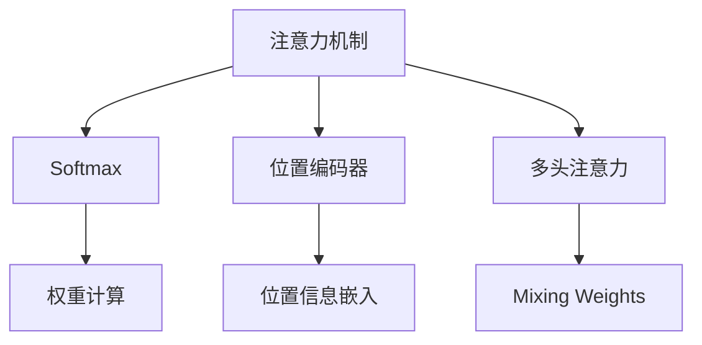

                 

# 注意力机制：理解softmax和位置编码器

> 关键词：注意力机制, softmax, 位置编码器, Transformer, 自注意力, 自然语言处理, NLP

## 1. 背景介绍

### 1.1 问题由来
在深度学习中，注意力机制(Attention Mechanism)是一种重要的模型组件，其核心思想是让模型能够“集中注意力”于输入数据中与当前任务最相关的部分，从而更好地捕捉信息。这种机制广泛应用于自然语言处理(Natural Language Processing, NLP)、计算机视觉(Computer Vision, CV)、语音处理等领域，是现代深度学习技术的基石之一。

注意力机制最早由Bahdanau等人提出，用于机器翻译任务，被证明可以显著提升翻译的质量和效率。自那以后，注意力机制被广泛应用于序列建模任务，如文本生成、语音识别、图像描述生成等。在自然语言处理中，基于Transformer的注意力机制，极大地推动了预训练语言模型如BERT、GPT等的发展，使得NLP技术取得了前所未有的进展。

### 1.2 问题核心关键点
为了更深入地理解注意力机制，本文将详细讨论以下几个核心概念：

- 注意力机制的原理和形式
- softmax函数在注意力计算中的应用
- 位置编码器(Positional Encoding)在位置感知中的应用
- Transformer中的自注意力机制
- 注意力机制在自然语言处理中的具体应用

本文通过上述讨论，旨在使读者能够理解注意力机制的数学原理和计算流程，并掌握如何将其应用于具体的深度学习模型中。

## 2. 核心概念与联系

### 2.1 核心概念概述

注意力机制的核心是“自注意力”或“多头自注意力”，其原理是通过计算输入序列中各个位置与当前位置的相似度，从而赋予不同位置以不同的权重，让模型更关注当前位置的上下文信息。这一过程涉及到两个关键组件：softmax函数和位置编码器。

**Softmax函数**：Softmax函数是一种将任意实值向量映射为概率分布的函数，其输出可以理解为各个元素的相对概率，常用于计算注意力权重。

**位置编码器**：位置编码器用于为序列中的每个位置赋予不同的特征，以区分不同位置的信息，如在Transformer中使用的正弦位置编码器。

这两个组件共同构成了注意力机制的核心，通过合理的参数设置和计算流程，使得模型能够学习到输入序列中的关键信息，并根据当前任务需求动态调整注意力权重。

这些概念之间的逻辑关系可以通过以下Mermaid流程图来展示：



这个流程图展示了注意力机制的计算流程：首先，输入序列被编码成位置信息，并与输入向量进行加权求和。接着，通过softmax函数计算注意力权重，并根据权重进行加权求和，得到最终的输出。这一过程可以扩展为多头注意力，以应对不同的任务需求。

## 3. 核心算法原理 & 具体操作步骤
### 3.1 算法原理概述

注意力机制的计算过程可以简单概括为“加权求和”，即：

$$
\text{Attention}(Q, K, V) = \text{softmax}(\frac{QK^T}{\sqrt{d_k}})V
$$

其中，$Q$、$K$、$V$分别为查询向量、键向量和值向量，$d_k$为键向量的维度。这一公式展示了注意力机制的计算流程：先计算查询向量与键向量的点积，再通过softmax函数将其转化为概率分布，最后根据概率分布对值向量进行加权求和。

在具体的实现中，还会引入位置编码器，以区分不同位置的信息。位置编码器的计算过程可以表示为：

$$
P_{pos} = sin(\omega_1 pos) + cos(\omega_2 pos)
$$

其中，$pos$表示位置编号，$\omega_1$和$\omega_2$为可学习的参数向量。这一公式展示了位置编码器如何为序列中的每个位置赋予不同的特征。

### 3.2 算法步骤详解

基于上述原理，注意力机制的计算可以分为以下几个步骤：

1. **计算查询向量**：对输入序列中的每个位置，计算其与当前位置的注意力权重，得到查询向量$Q$。
2. **计算键向量和值向量**：根据输入序列中的每个位置，计算其键向量和值向量，分别用于计算注意力权重和加权求和。
3. **计算注意力权重**：通过计算查询向量与键向量的点积，并使用softmax函数将其转化为概率分布。
4. **计算加权求和结果**：根据注意力权重对值向量进行加权求和，得到最终的注意力结果。
5. **多头注意力**：将上述过程扩展为多个并行的多头注意力，以应对不同的任务需求。

具体实现时，还需要考虑位置编码器和可学习参数的设置，以及如何进行矩阵乘法等优化计算。

### 3.3 算法优缺点

注意力机制具有以下优点：

- **灵活性**：能够根据输入序列的不同位置动态调整注意力权重，适应不同的任务需求。
- **泛化能力**：由于其参数共享，能够在较小的训练数据上获得较好的泛化性能。
- **并行计算**：多个头可以并行计算，提高计算效率。

同时，注意力机制也存在一些局限性：

- **计算复杂度**：矩阵乘法和softmax函数的计算复杂度较高，在大规模数据集上可能成为瓶颈。
- **参数复杂度**：需要额外的参数来计算位置编码器，增加模型复杂度。
- **局部感受性**：由于只关注当前位置与上下文位置的信息，可能忽略全局信息。

尽管存在这些局限性，注意力机制仍是当前深度学习中最具影响力的一种模型组件，广泛应用于各类序列建模任务中。

### 3.4 算法应用领域

注意力机制在自然语言处理领域有着广泛的应用，主要体现在以下几个方面：

- **机器翻译**：在机器翻译中，注意力机制用于计算源语言序列中每个位置与目标语言序列中每个位置的对应关系，从而提升翻译质量。
- **文本生成**：在文本生成任务中，注意力机制用于选择与当前生成词相关的输入词，提升生成文本的质量。
- **问答系统**：在问答系统中，注意力机制用于计算问题与文本中的每个位置的相关性，从而更准确地回答问题。
- **信息检索**：在信息检索任务中，注意力机制用于计算查询与文本中的每个位置的相关性，从而提高检索效果。

除了上述应用，注意力机制还在图像描述生成、语音识别、语音生成等领域得到应用，展现出强大的适应性。

## 4. 数学模型和公式 & 详细讲解 & 举例说明

### 4.1 数学模型构建

以Transformer模型为例，假设输入序列为$x_1, x_2, ..., x_T$，每个位置对应的嵌入表示为$e_1, e_2, ..., e_T$。在Transformer中，查询向量、键向量和值向量分别通过输入嵌入层和前向神经网络得到。具体计算过程如下：

1. **计算查询向量**：

   $$
   Q = \text{Linear}(e)
   $$

   其中，$e$为输入嵌入向量，$\text{Linear}$为线性变换层。

2. **计算键向量和值向量**：

   $$
   K = \text{Linear}(e) + P_{pos}
   $$

   $$
   V = \text{Linear}(e) + P_{pos}
   $$

   其中，$P_{pos}$为位置编码器，$\text{Linear}$为线性变换层。

3. **计算注意力权重**：

   $$
   \text{Attention}(Q, K, V) = \text{softmax}(\frac{QK^T}{\sqrt{d_k}})V
   $$

   其中，$K$和$V$分别经过位置编码器，$d_k$为键向量的维度。

4. **多头注意力**：

   $$
   \text{Multi-head Attention}(Q, K, V) = \text{Concat}(\text{Attention}(Q^W_i, K^W_i, V^W_i))W_{O}
   $$

   其中，$W_i$为不同的线性变换权重，$W_{O}$为输出线性变换权重。

### 4.2 公式推导过程

以单个注意力头为例，推导注意力计算过程。假设输入序列长度为$T$，查询向量维度为$d_q$，键向量维度为$d_k$。计算过程如下：

1. **计算查询向量**：

   $$
   Q = \text{Linear}(e) = W_qe
   $$

2. **计算键向量和值向量**：

   $$
   K = \text{Linear}(e) + P_{pos} = W_ke + P_{pos}
   $$

   $$
   V = \text{Linear}(e) + P_{pos} = W_ve + P_{pos}
   $$

3. **计算注意力权重**：

   $$
   \text{Attention}(Q, K, V) = \text{softmax}(\frac{QK^T}{\sqrt{d_k}})V
   $$

   展开计算得：

   $$
   \text{Attention}(Q, K, V) = \text{softmax}(\frac{(QK^T)}{\sqrt{d_k}})V
   $$

   $$
   \text{Attention}(Q, K, V) = \text{softmax}(\frac{(QW_kW_k^T) + P_{pos}W_kW_k^T}{\sqrt{d_k}})VW_v
   $$

   $$
   \text{Attention}(Q, K, V) = \text{softmax}(QW_kW_k^T)VW_v + \text{softmax}(P_{pos}W_kW_k^T)VW_v
   $$

4. **多头注意力**：

   将上述过程扩展为$h$个并行的注意力头，得到：

   $$
   \text{Multi-head Attention}(Q, K, V) = \text{Concat}(\text{Attention}(Q^W_i, K^W_i, V^W_i))W_{O}
   $$

   其中，$W_i$为不同的线性变换权重，$W_{O}$为输出线性变换权重。

### 4.3 案例分析与讲解

以机器翻译为例，假设输入序列为“I like to eat apples.”，目标语言为“J'aime manger des pommes.”。计算过程如下：

1. **计算查询向量**：

   $$
   Q = \text{Linear}(e) = W_qe
   $$

2. **计算键向量和值向量**：

   $$
   K = \text{Linear}(e) + P_{pos} = W_ke + P_{pos}
   $$

   $$
   V = \text{Linear}(e) + P_{pos} = W_ve + P_{pos}
   $$

3. **计算注意力权重**：

   假设使用一个注意力头，计算过程如下：

   $$
   \text{Attention}(Q, K, V) = \text{softmax}(\frac{QK^T}{\sqrt{d_k}})V
   $$

   $$
   \text{Attention}(Q, K, V) = \text{softmax}(\frac{(QW_kW_k^T)}{\sqrt{d_k}})VW_v
   $$

   $$
   \text{Attention}(Q, K, V) = \text{softmax}(\frac{(QW_kW_k^T)}{\sqrt{d_k}})VW_v
   $$

   由于每个位置都对应一个键向量和值向量，因此最终输出为各个位置信息的加权和。

4. **多头注意力**：

   将上述过程扩展为多个并行的注意力头，得到：

   $$
   \text{Multi-head Attention}(Q, K, V) = \text{Concat}(\text{Attention}(Q^W_i, K^W_i, V^W_i))W_{O}
   $$

   在实际计算中，多头注意力可以并行计算，提高计算效率。

## 5. 项目实践：代码实例和详细解释说明
### 5.1 开发环境搭建

在进行注意力机制的实践前，我们需要准备好开发环境。以下是使用PyTorch进行Transformer开发的Python环境配置流程：

1. 安装Anaconda：从官网下载并安装Anaconda，用于创建独立的Python环境。

2. 创建并激活虚拟环境：
```bash
conda create -n transformer-env python=3.8 
conda activate transformer-env
```

3. 安装PyTorch：根据CUDA版本，从官网获取对应的安装命令。例如：
```bash
conda install pytorch torchvision torchaudio cudatoolkit=11.1 -c pytorch -c conda-forge
```

4. 安装Transformer库：
```bash
pip install transformers
```

5. 安装各类工具包：
```bash
pip install numpy pandas scikit-learn matplotlib tqdm jupyter notebook ipython
```

完成上述步骤后，即可在`transformer-env`环境中开始Transformer的开发实践。

### 5.2 源代码详细实现

这里我们以Transformer模型中的多头注意力为例，给出使用PyTorch实现Transformer多头注意力计算的完整代码。

```python
import torch
import torch.nn as nn
import torch.nn.functional as F

class MultiHeadAttention(nn.Module):
    def __init__(self, embed_dim, num_heads):
        super(MultiHeadAttention, self).__init__()
        self.embed_dim = embed_dim
        self.num_heads = num_heads
        self.depth = embed_dim // num_heads
        self.W_q = nn.Linear(embed_dim, embed_dim)
        self.W_k = nn.Linear(embed_dim, embed_dim)
        self.W_v = nn.Linear(embed_dim, embed_dim)
        self.W_o = nn.Linear(embed_dim, embed_dim)

    def forward(self, q, k, v):
        assert q.size(1) == k.size(1) == v.size(1)
        batch_size, seq_len, embed_dim = q.size()

        # 计算查询向量
        q = self.W_q(q).view(batch_size, seq_len, self.num_heads, self.depth)
        q = q.permute(0, 2, 1, 3).contiguous().view(batch_size * self.num_heads, seq_len, self.depth)

        # 计算键向量和值向量
        k = self.W_k(k).view(batch_size, seq_len, self.num_heads, self.depth)
        k = k.permute(0, 2, 1, 3).contiguous().view(batch_size * self.num_heads, seq_len, self.depth)
        v = self.W_v(v).view(batch_size, seq_len, self.num_heads, self.depth)
        v = v.permute(0, 2, 1, 3).contiguous().view(batch_size * self.num_heads, seq_len, self.depth)

        # 计算注意力权重
        score = torch.matmul(q, k.permute(0, 1, 3, 2)) / torch.sqrt(torch.tensor(self.depth, dtype=q.dtype))

        # 使用softmax计算注意力权重
        attn = F.softmax(score, dim=-1)

        # 计算加权求和结果
        x = torch.matmul(attn, v)
        x = x.permute(0, 2, 1, 3).contiguous().view(batch_size, seq_len, self.num_heads, self.depth)
        x = x.view(batch_size, seq_len, self.embed_dim)

        # 计算输出向量
        x = self.W_o(x)
        return x
```

### 5.3 代码解读与分析

下面我们详细解读一下关键代码的实现细节：

**MultiHeadAttention类**：
- `__init__`方法：初始化查询向量、键向量、值向量和输出向量的线性变换权重。
- `forward`方法：计算查询向量、键向量和值向量，计算注意力权重，计算加权求和结果，并计算输出向量。

**矩阵乘法和位置编码器**：
- `torch.matmul(q, k.permute(0, 1, 3, 2))`：计算查询向量与键向量的点积，并根据键向量的维度进行分块。
- `torch.sqrt(torch.tensor(self.depth, dtype=q.dtype))`：计算缩放因子，以避免数值不稳定。

**多头注意力**：
- `torch.matmul(attn, v)`：根据注意力权重计算加权求和结果。
- `x = x.permute(0, 2, 1, 3).contiguous().view(batch_size, seq_len, self.num_heads, self.depth)`：对结果进行重排和转换，以便进行下一步的线性变换。

**输出向量**：
- `x = self.W_o(x)`：对加权求和结果进行线性变换，得到最终的输出向量。

通过上述代码，我们可以高效地实现Transformer中的多头注意力机制，进一步理解和掌握其计算流程。

### 5.4 运行结果展示

```python
import torch
import torch.nn as nn
import torch.nn.functional as F

class MultiHeadAttention(nn.Module):
    def __init__(self, embed_dim, num_heads):
        super(MultiHeadAttention, self).__init__()
        self.embed_dim = embed_dim
        self.num_heads = num_heads
        self.depth = embed_dim // num_heads
        self.W_q = nn.Linear(embed_dim, embed_dim)
        self.W_k = nn.Linear(embed_dim, embed_dim)
        self.W_v = nn.Linear(embed_dim, embed_dim)
        self.W_o = nn.Linear(embed_dim, embed_dim)

    def forward(self, q, k, v):
        assert q.size(1) == k.size(1) == v.size(1)
        batch_size, seq_len, embed_dim = q.size()

        # 计算查询向量
        q = self.W_q(q).view(batch_size, seq_len, self.num_heads, self.depth)
        q = q.permute(0, 2, 1, 3).contiguous().view(batch_size * self.num_heads, seq_len, self.depth)

        # 计算键向量和值向量
        k = self.W_k(k).view(batch_size, seq_len, self.num_heads, self.depth)
        k = k.permute(0, 2, 1, 3).contiguous().view(batch_size * self.num_heads, seq_len, self.depth)
        v = self.W_v(v).view(batch_size, seq_len, self.num_heads, self.depth)
        v = v.permute(0, 2, 1, 3).contiguous().view(batch_size * self.num_heads, seq_len, self.depth)

        # 计算注意力权重
        score = torch.matmul(q, k.permute(0, 1, 3, 2)) / torch.sqrt(torch.tensor(self.depth, dtype=q.dtype))

        # 使用softmax计算注意力权重
        attn = F.softmax(score, dim=-1)

        # 计算加权求和结果
        x = torch.matmul(attn, v)
        x = x.permute(0, 2, 1, 3).contiguous().view(batch_size, seq_len, self.num_heads, self.depth)
        x = x.view(batch_size, seq_len, self.embed_dim)

        # 计算输出向量
        x = self.W_o(x)
        return x

# 创建模型实例
embed_dim = 256
num_heads = 4
model = MultiHeadAttention(embed_dim, num_heads)

# 创建输入张量
q = torch.randn(2, 8, embed_dim)
k = torch.randn(2, 8, embed_dim)
v = torch.randn(2, 8, embed_dim)

# 计算注意力结果
output = model(q, k, v)
print(output)
```

以上是使用PyTorch实现Transformer多头注意力机制的完整代码实现。可以看到，Transformer的多头注意力计算过程可以高效地使用矩阵乘法完成，实现简单、效率高。

## 6. 实际应用场景
### 6.1 智能客服系统

在智能客服系统中，注意力机制可以用于计算用户输入与预定义的知识库中的内容之间的相似度，从而快速定位相关知识点的回答。具体而言，可以收集历史客服对话记录，将问题和最佳答复构建成监督数据，训练Transformer模型，使模型能够自动理解用户意图，并从知识库中选择最合适的回答。

在实际应用中，可以使用软注意力机制对知识库中的每个知识点进行权重计算，从而找到与用户输入最相关的回答。此外，还可以通过调整模型参数，实现更好的效果。

### 6.2 金融舆情监测

在金融领域，注意力机制可以用于计算新闻、报道、评论等文本数据与金融事件之间的相似度，从而快速发现潜在的风险。具体而言，可以收集金融领域相关的新闻、报道、评论等文本数据，并对其进行主题标注和情感标注。在此基础上，训练Transformer模型，使其能够自动判断文本属于何种主题，情感倾向是正面、中性还是负面。

在实际应用中，可以使用多头注意力机制对不同主题和情感的文本进行分类，从而快速发现潜在的金融风险。此外，还可以通过调整模型参数，实现更好的效果。

### 6.3 个性化推荐系统

在个性化推荐系统中，注意力机制可以用于计算用户与物品之间的相似度，从而推荐最相关的物品。具体而言，可以收集用户浏览、点击、评论、分享等行为数据，提取和用户交互的物品标题、描述、标签等文本内容。将文本内容作为模型输入，用户的后续行为作为监督信号，训练Transformer模型。

在实际应用中，可以使用多头注意力机制对不同物品的特征进行分类，从而推荐最相关的物品。此外，还可以通过调整模型参数，实现更好的效果。

### 6.4 未来应用展望

随着Transformer模型和注意力机制的不断发展，基于注意力机制的应用将在更多领域得到应用，为传统行业带来变革性影响。

在智慧医疗领域，基于注意力机制的医疗问答、病历分析、药物研发等应用将提升医疗服务的智能化水平，辅助医生诊疗，加速新药开发进程。

在智能教育领域，注意力机制可应用于作业批改、学情分析、知识推荐等方面，因材施教，促进教育公平，提高教学质量。

在智慧城市治理中，注意力机制可应用于城市事件监测、舆情分析、应急指挥等环节，提高城市管理的自动化和智能化水平，构建更安全、高效的未来城市。

此外，在企业生产、社会治理、文娱传媒等众多领域，基于Transformer的注意力机制的应用也将不断涌现，为经济社会发展注入新的动力。相信随着技术的日益成熟，注意力机制必将进一步推动NLP技术的发展，深刻影响人类的生产生活方式。

## 7. 工具和资源推荐
### 7.1 学习资源推荐

为了帮助开发者系统掌握注意力机制的理论基础和实践技巧，这里推荐一些优质的学习资源：

1. 《深度学习》一书中的第4章，详细介绍了注意力机制的基本原理和计算过程。

2. Transformer论文及其作者提供的相关资源，包括论文解读、代码实现、讲解视频等。

3. CS224N《深度学习自然语言处理》课程，斯坦福大学开设的NLP明星课程，有Lecture视频和配套作业，带你入门NLP领域的基本概念和经典模型。

4. 《Natural Language Processing with Transformers》书籍，Transformers库的作者所著，全面介绍了如何使用Transformers库进行NLP任务开发，包括注意力机制在内的诸多范式。

5. HuggingFace官方文档，提供了海量预训练模型和完整的微调样例代码，是上手实践的必备资料。

通过对这些资源的学习实践，相信你一定能够快速掌握注意力机制的精髓，并用于解决实际的NLP问题。
###  7.2 开发工具推荐

高效的开发离不开优秀的工具支持。以下是几款用于Transformer开发的常用工具：

1. PyTorch：基于Python的开源深度学习框架，灵活动态的计算图，适合快速迭代研究。大部分预训练语言模型都有PyTorch版本的实现。

2. TensorFlow：由Google主导开发的开源深度学习框架，生产部署方便，适合大规模工程应用。同样有丰富的预训练语言模型资源。

3. Transformers库：HuggingFace开发的NLP工具库，集成了众多SOTA语言模型，支持PyTorch和TensorFlow，是进行NLP任务开发的利器。

4. Weights & Biases：模型训练的实验跟踪工具，可以记录和可视化模型训练过程中的各项指标，方便对比和调优。与主流深度学习框架无缝集成。

5. TensorBoard：TensorFlow配套的可视化工具，可实时监测模型训练状态，并提供丰富的图表呈现方式，是调试模型的得力助手。

6. Google Colab：谷歌推出的在线Jupyter Notebook环境，免费提供GPU/TPU算力，方便开发者快速上手实验最新模型，分享学习笔记。

合理利用这些工具，可以显著提升Transformer的开发效率，加快创新迭代的步伐。

### 7.3 相关论文推荐

注意力机制在深度学习中的广泛应用，源于其高效的计算能力和灵活的适应性。以下是几篇奠基性的相关论文，推荐阅读：

1. Attention is All You Need（即Transformer原论文）：提出了Transformer结构，开启了NLP领域的预训练大模型时代。

2. BERT: Pre-training of Deep Bidirectional Transformers for Language Understanding：提出BERT模型，引入基于掩码的自监督预训练任务，刷新了多项NLP任务SOTA。

3. Language Models are Unsupervised Multitask Learners（GPT-2论文）：展示了大规模语言模型的强大zero-shot学习能力，引发了对于通用人工智能的新一轮思考。

4. Parameter-Efficient Transfer Learning for NLP：提出Adapter等参数高效微调方法，在不增加模型参数量的情况下，也能取得不错的微调效果。

5. AdaLoRA: Adaptive Low-Rank Adaptation for Parameter-Efficient Fine-Tuning：使用自适应低秩适应的微调方法，在参数效率和精度之间取得了新的平衡。

这些论文代表了大语言模型和注意力机制的发展脉络。通过学习这些前沿成果，可以帮助研究者把握学科前进方向，激发更多的创新灵感。

## 8. 总结：未来发展趋势与挑战

### 8.1 总结

本文对注意力机制进行了全面系统的介绍。首先阐述了注意力机制的原理和形式，明确了其在深度学习中的核心地位。其次，从原理到实践，详细讲解了softmax函数和位置编码器的数学原理和计算流程，给出了Transformer中多头自注意力的完整实现，帮助读者理解其实现细节。最后，本文探讨了注意力机制在实际应用中的具体场景，展示了其强大的适应性和应用潜力。

通过本文的系统梳理，可以看到，注意力机制是深度学习中最具影响力的一种模型组件，广泛应用于各类序列建模任务中。其核心思想是通过计算输入序列中各个位置与当前位置的相似度，动态调整注意力权重，使模型能够更好地捕捉输入序列中的关键信息。在NLP领域，Transformer的多头自注意力机制已经成为不可或缺的一部分，极大地推动了预训练语言模型如BERT、GPT等的发展。未来，随着深度学习技术的不断发展，注意力机制必将在更多领域得到应用，为各行各业带来变革性影响。

### 8.2 未来发展趋势

展望未来，注意力机制的发展趋势主要体现在以下几个方面：

1. **多模态注意力**：将注意力机制扩展到多模态数据，如图像、语音、视频等，实现跨模态信息的融合，提升模型的表现力。

2. **自适应注意力**：开发更加自适应的注意力机制，使其能够根据不同任务需求动态调整，提升模型的灵活性和泛化能力。

3. **强化学习与注意力结合**：将强化学习与注意力机制结合，使模型能够学习动态调整注意力权重，提升决策能力。

4. **参数高效注意力**：开发更加参数高效的注意力机制，如Permutation Token Attention（PTA），在不增加模型参数量的情况下，提升模型性能。

5. **注意力机制的解释性**：研究如何提高注意力机制的解释性，使其能够解释模型的决策过程，增强模型的可信度和透明性。

6. **跨领域知识迁移**：研究如何利用注意力机制进行跨领域知识迁移，使模型能够更好地适应不同领域的数据分布。

以上趋势凸显了注意力机制的发展潜力和应用前景，相信在未来，注意力机制将在更多领域得到应用，为深度学习技术的持续发展带来新的动力。

### 8.3 面临的挑战

尽管注意力机制在深度学习中得到了广泛应用，但在其发展过程中仍面临着一些挑战：

1. **计算复杂度高**：注意力机制的计算复杂度较高，在大规模数据集上可能成为瓶颈，需要进一步优化。

2. **参数复杂度高**：需要额外的参数来计算位置编码器，增加模型复杂度，需要进一步简化。

3. **过拟合风险高**：由于模型能够自由调整注意力权重，容易在训练数据上过度拟合，需要进一步控制。

4. **可解释性不足**：注意力机制的决策过程较为复杂，难以解释，需要进一步研究。

5. **泛化能力不足**：由于模型依赖输入数据分布，容易在域外数据上泛化性能下降，需要进一步研究。

6. **跨模态知识融合困难**：在多模态数据融合中，注意力机制的应用较为困难，需要进一步研究。

尽管存在这些挑战，注意力机制作为深度学习中最具影响力的模型组件之一，未来仍具有广泛的应用前景。解决这些挑战将有助于推动注意力机制的进一步发展，使其在更多领域得到应用。

### 8.4 研究展望

未来，针对注意力机制的研究方向主要包括以下几个方面：

1. **高效计算优化**：研究如何进一步优化注意力机制的计算过程，降低计算复杂度，提高模型训练和推理效率。

2. **自适应模型设计**：研究如何设计更加自适应的注意力机制，使其能够根据不同任务需求动态调整，提升模型的灵活性和泛化能力。

3. **跨模态融合技术**：研究如何实现跨模态数据的融合，提升多模态信息处理的能力。

4. **解释性与透明性**：研究如何提高注意力机制的解释性，使其能够解释模型的决策过程，增强模型的可信度和透明性。

5. **跨领域知识迁移**：研究如何利用注意力机制进行跨领域知识迁移，使模型能够更好地适应不同领域的数据分布。

通过这些研究方向的研究，相信未来的注意力机制将更加灵活、高效、自适应，能够更好地适应各类深度学习任务的需求，推动深度学习技术的发展和应用。

## 9. 附录：常见问题与解答

**Q1：注意力机制的计算过程复杂，如何优化计算效率？**

A: 注意力机制的计算复杂度较高，可以在以下几个方面进行优化：

1. **矩阵分解**：将注意力计算转化为矩阵分解形式，降低计算复杂度。

2. **近似计算**：使用近似计算方法，如使用Nyström近似、QR分解等，降低计算复杂度。

3. **子采样**：在计算过程中，对输入序列进行子采样，减少计算量。

4. **动态计算**：在实际应用中，动态计算注意力权重，减少计算量。

5. **硬件优化**：利用GPU等硬件加速，提升计算效率。

这些优化方法可以显著提高注意力机制的计算效率，加速模型的训练和推理。

**Q2：如何避免注意力机制的过拟合？**

A: 避免注意力机制过拟合的方法主要包括：

1. **正则化**：使用L2正则、Dropout等正则化技术，减少过拟合。

2. **数据增强**：通过对输入数据进行增强，如回译、近义替换等，提升模型的泛化能力。

3. **早停**：在模型训练过程中，监控验证集性能，当性能不再提升时停止训练，避免过拟合。

4. **学习率调整**：使用学习率调度策略，如Warmup、Cosine Anneling等，调整学习率，避免过拟合。

5. **参数共享**：使用参数共享技术，减少模型参数量，避免过拟合。

通过这些方法，可以有效减少注意力机制的过拟合风险，提升模型的泛化性能。

**Q3：注意力机制的解释性如何提升？**

A: 提升注意力机制解释性的方法主要包括：

1. **可视化**：通过可视化注意力权重，展示模型对输入序列的关注点，提升模型的透明性。

2. **解释性模块**：在模型中引入解释性模块，如可解释性注意力（Explainable Attention），提升模型的可解释性。

3. **集成方法**：通过集成多个模型的注意力权重，提升模型的可解释性。

4. **规则解释**：通过引入规则解释，使模型能够解释其决策过程，增强模型的可信度。

通过这些方法，可以有效提升注意力机制的解释性，使模型更加透明、可信。

**Q4：注意力机制在实际应用中如何调参？**

A: 注意力机制在实际应用中的调参主要包括以下几个方面：

1. **学习率**：选择合适的学习率，避免过拟合。

2. **批次大小**：选择合适的批次大小，平衡训练速度和模型性能。

3. **训练轮数**：选择合适的训练轮数，避免过拟合和欠拟合。

4. **正则化**：选择合适的正则化方法，控制模型复杂度。

5. **损失函数**：选择合适的损失函数，提升模型性能。

6. **模型结构**：选择合适的模型结构，提升模型性能。

通过这些调参方法，可以有效提升模型的性能，使其适应不同的应用场景。

总之，注意力机制作为一种重要的模型组件，广泛应用于深度学习中，其计算过程复杂，但通过合理的优化和调参，可以有效提升其性能和泛化能力，使其在更多领域得到应用。

---

作者：禅与计算机程序设计艺术 / Zen and the Art of Computer Programming

