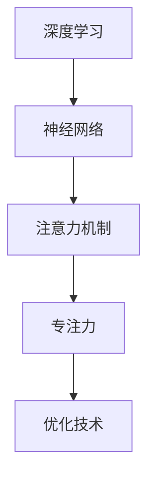

                 

# 注意力深度挖掘机：AI优化的专注力开发工具

> 关键词：注意力机制,深度学习,专注力,神经网络,优化技术

## 1. 背景介绍

### 1.1 问题由来
随着人工智能技术的飞速发展，深度学习在各个领域的应用日益广泛，从自然语言处理到图像识别，从推荐系统到智能推荐，深度学习模型的性能不断突破。然而，在深度学习模型的优化过程中，特别是在处理复杂、高维数据时，计算资源和时间成本仍然是一个严峻的挑战。为了解决这一问题，注意力机制应运而生。

### 1.2 问题核心关键点
注意力机制的核心在于通过引入“注意力”这个概念，使得模型能够动态地将资源集中在关键信息上，从而提高计算效率和模型性能。这在大规模数据处理和复杂任务解决中尤其重要，比如在自然语言处理中，注意力机制可以帮助模型聚焦于与当前任务相关的词汇，提高模型在语言理解、生成、翻译等任务上的表现。

### 1.3 问题研究意义
对注意力机制的研究，对于提升深度学习模型的性能、降低计算资源消耗、优化计算效率、改进模型泛化能力等方面具有重要意义。通过注意力机制的引入和优化，可以有效提升模型的专注力，使得模型能够更加高效地处理大量数据，提高模型的实用性和适应性。

## 2. 核心概念与联系

### 2.1 核心概念概述

为更好地理解注意力深度挖掘机，本节将介绍几个密切相关的核心概念：

- **注意力机制(Attention Mechanism)**：是深度学习中一种用于捕捉输入数据中重要信息的机制。通过学习输入数据中不同部分的相关性，来决定在输出中赋予哪些输入更大的权重。
- **深度学习(Deep Learning)**：一种利用多层次神经网络模型，通过对数据进行层层抽象，实现高级特征提取和任务建模的机器学习方法。
- **专注力(Focus)**：在深度学习中，专注力指的是模型在处理输入数据时，对于不同信息的关注程度和资源分配。
- **神经网络(Neural Network)**：深度学习模型的基础架构，通过多层非线性变换，实现对输入数据的复杂映射。
- **优化技术(Optimization Techniques)**：在深度学习中，用于寻找模型最优参数的技术，包括梯度下降、Adam、SGD等。

这些核心概念之间的逻辑关系可以通过以下Mermaid流程图来展示：



这个流程图展示了深度学习、神经网络、注意力机制和专注力之间的逻辑关系：

1. 深度学习使用神经网络进行特征提取和任务建模。
2. 注意力机制在神经网络层之间引入，用于提高模型的专注力。
3. 专注力通过注意力机制，优化神经网络的资源分配，提高计算效率。
4. 优化技术用于调整神经网络的参数，使得模型能够更加高效地处理输入数据。

## 3. 核心算法原理 & 具体操作步骤
### 3.1 算法原理概述

注意力深度挖掘机的核心算法原理基于注意力机制的优化，通过引入优化技术，提高模型的专注力，从而提升计算效率和模型性能。其基本流程如下：

1. **输入编码**：将输入数据通过神经网络进行编码，得到一组隐表示向量。
2. **计算注意力权重**：使用注意力机制，计算每个隐表示向量与其他隐表示向量之间的相似度，得到注意力权重。
3. **加权求和**：将每个隐表示向量与其对应的注意力权重相乘，加权求和得到新的隐表示向量。
4. **输出解码**：使用新的隐表示向量进行解码，得到最终的输出结果。

在实际应用中，通常使用Softmax函数对注意力权重进行归一化，使用点积、加权平均等方法计算注意力权重，以提升模型性能和计算效率。

### 3.2 算法步骤详解

以下是注意力深度挖掘机核心算法的详细步骤：

**Step 1: 输入编码**

1. 将输入数据 $x$ 通过神经网络 $f$ 进行编码，得到一组隐表示向量 $h_1, h_2, ..., h_n$。
2. 通过 $f$ 的非线性变换，将输入数据 $x$ 映射为隐表示向量 $h$。

**Step 2: 计算注意力权重**

1. 对于每个隐表示向量 $h_i$，计算其与所有其他隐表示向量 $h_j$ 的相似度 $s_{ij}$。
2. 使用Softmax函数对相似度 $s_{ij}$ 进行归一化，得到注意力权重 $\alpha_{ij}$。
3. 对所有注意力权重进行归一化，确保其和为1。

**Step 3: 加权求和**

1. 将每个隐表示向量 $h_i$ 与其对应的注意力权重 $\alpha_{ij}$ 相乘，得到加权后的隐表示向量 $v_i$。
2. 对所有加权后的隐表示向量 $v_i$ 进行加权求和，得到新的隐表示向量 $z$。

**Step 4: 输出解码**

1. 使用新的隐表示向量 $z$ 进行解码，得到最终的输出结果 $y$。

**Step 5: 优化算法**

1. 使用优化算法（如Adam、SGD等）对神经网络参数进行优化。
2. 计算损失函数（如交叉熵、均方误差等），并更新模型参数。

### 3.3 算法优缺点

注意力深度挖掘机具有以下优点：

1. **计算效率高**：通过注意力机制，模型能够动态地聚焦于关键信息，减少计算量。
2. **模型性能好**：注意力机制提高了模型的专注力，提升了模型的泛化能力和精度。
3. **应用广泛**：应用于自然语言处理、计算机视觉、语音识别等多个领域，具有很强的通用性。

同时，该算法也存在一些局限性：

1. **计算复杂度高**：注意力机制计算复杂度较高，特别是在处理大规模数据时，计算成本较高。
2. **模型难以解释**：注意力权重难以解释，难以理解模型在处理输入数据时的决策过程。
3. **数据依赖性大**：模型性能受数据质量影响较大，需要高质量标注数据进行训练。

尽管存在这些局限性，但注意力深度挖掘机在大规模数据处理和复杂任务解决中仍具有重要应用价值。

### 3.4 算法应用领域

注意力深度挖掘机在多个领域中得到了广泛应用，包括但不限于：

- **自然语言处理**：在机器翻译、文本分类、问答系统等任务中，注意力机制能够帮助模型聚焦于与当前任务相关的词汇，提高模型性能。
- **计算机视觉**：在图像识别、物体检测、图像分割等任务中，注意力机制能够帮助模型捕捉图像中的关键信息，提高识别精度。
- **语音识别**：在语音识别任务中，注意力机制能够帮助模型聚焦于语音信号的关键特征，提高识别准确率。
- **推荐系统**：在推荐系统中，注意力机制能够帮助模型聚焦于与用户偏好相关的商品特征，提高推荐效果。

## 4. 数学模型和公式 & 详细讲解 & 举例说明
### 4.1 数学模型构建

基于注意力深度挖掘机的数学模型如下：

- **输入编码**：
  $$
  h_i = f(x_i; \theta)
  $$
  其中 $f$ 为编码器，$\theta$ 为编码器的参数。

- **计算注意力权重**：
  $$
  s_{ij} = \langle h_i, h_j \rangle
  $$
  $$
  \alpha_{ij} = \frac{e^{s_{ij}}}{\sum_k e^{s_{ik}}}
  $$

- **加权求和**：
  $$
  v_i = \alpha_{ij} h_j
  $$
  $$
  z = \sum_i v_i
  $$

- **输出解码**：
  $$
  y = g(z; \theta')
  $$
  其中 $g$ 为解码器，$\theta'$ 为解码器的参数。

### 4.2 公式推导过程

以机器翻译为例，展示注意力机制的推导过程：

1. 将源语言句子 $x$ 通过编码器 $f$ 得到隐表示向量 $h_1, h_2, ..., h_n$。
2. 计算每个隐表示向量 $h_i$ 与其他隐表示向量 $h_j$ 的相似度 $s_{ij} = \langle h_i, h_j \rangle$。
3. 使用Softmax函数对相似度 $s_{ij}$ 进行归一化，得到注意力权重 $\alpha_{ij}$。
4. 将每个隐表示向量 $h_i$ 与其对应的注意力权重 $\alpha_{ij}$ 相乘，得到加权后的隐表示向量 $v_i$。
5. 对所有加权后的隐表示向量 $v_i$ 进行加权求和，得到新的隐表示向量 $z$。
6. 使用新的隐表示向量 $z$ 进行解码，得到翻译结果 $y$。

### 4.3 案例分析与讲解

以机器翻译为例，解释注意力深度挖掘机的工作原理：

假设源语言句子为 "I love Python"，目标语言句子为 "J'aime Python"。模型将源语言句子通过编码器 $f$ 得到隐表示向量 $h_1, h_2, ..., h_n$，然后计算每个隐表示向量与其他隐表示向量之间的相似度 $s_{ij} = \langle h_i, h_j \rangle$。接着使用Softmax函数对相似度进行归一化，得到注意力权重 $\alpha_{ij}$，将每个隐表示向量与其对应的注意力权重相乘，得到加权后的隐表示向量 $v_i$，最终将所有加权后的隐表示向量 $v_i$ 加权求和得到新的隐表示向量 $z$。使用新的隐表示向量 $z$ 进行解码，得到翻译结果 "J'aime Python"。

在实际应用中，注意力深度挖掘机可以通过修改注意力计算方式、引入外部知识库、调整优化算法等手段，进一步提升模型性能。

## 5. 项目实践：代码实例和详细解释说明
### 5.1 开发环境搭建

在进行注意力深度挖掘机的项目实践前，需要先准备好开发环境。以下是使用Python进行PyTorch开发的环境配置流程：

1. 安装Anaconda：从官网下载并安装Anaconda，用于创建独立的Python环境。

2. 创建并激活虚拟环境：
```bash
conda create -n pytorch-env python=3.8 
conda activate pytorch-env
```

3. 安装PyTorch：根据CUDA版本，从官网获取对应的安装命令。例如：
```bash
conda install pytorch torchvision torchaudio cudatoolkit=11.1 -c pytorch -c conda-forge
```

4. 安装Transformer库：
```bash
pip install transformers
```

5. 安装各类工具包：
```bash
pip install numpy pandas scikit-learn matplotlib tqdm jupyter notebook ipython
```

完成上述步骤后，即可在`pytorch-env`环境中开始注意力深度挖掘机的开发实践。

### 5.2 源代码详细实现

以下是使用PyTorch实现注意力深度挖掘机的代码示例：

```python
import torch
import torch.nn as nn
import torch.nn.functional as F

class Attention(nn.Module):
    def __init__(self, in_dim):
        super(Attention, self).__init__()
        self.W_Q = nn.Linear(in_dim, in_dim)
        self.W_K = nn.Linear(in_dim, in_dim)
        self.W_V = nn.Linear(in_dim, in_dim)
        self.V = nn.Linear(in_dim, in_dim)
        self.softmax = nn.Softmax(dim=1)
    
    def forward(self, X):
        Q = self.W_Q(X)
        K = self.W_K(X)
        V = self.W_V(X)
        Q = Q.unsqueeze(dim=2)
        K = K.unsqueeze(dim=1)
        V = V.unsqueeze(dim=1)
        scores = torch.bmm(Q, K)
        attention_weights = self.softmax(scores)
        attention_weights = attention_weights.unsqueeze(dim=1)
        attention_v = torch.bmm(attention_weights, V)
        attention_v = attention_v.squeeze(dim=2)
        attention_v = self.V(attention_v)
        return attention_v, attention_weights

class Seq2Seq(nn.Module):
    def __init__(self, input_dim, output_dim, emb_dim, dropout_rate):
        super(Seq2Seq, self).__init__()
        self.encoder = nn.Embedding(input_dim, emb_dim)
        self.encoder_lstm = nn.LSTM(emb_dim, emb_dim, dropout=dropout_rate)
        self.attention = Attention(emb_dim)
        self.decoder_lstm = nn.LSTM(emb_dim, output_dim, dropout=dropout_rate)
        self.decoder = nn.Linear(emb_dim, output_dim)
    
    def forward(self, x):
        embeddings = self.encoder(x)
        encoder_outputs, encoder_hidden = self.encoder_lstm(embeddings)
        attention_v, attention_weights = self.attention(encoder_outputs)
        decoder_outputs, decoder_hidden = self.decoder_lstm(attention_v, (encoder_hidden[0], encoder_hidden[1]))
        outputs = self.decoder(decoder_outputs)
        return outputs, attention_weights
```

### 5.3 代码解读与分析

让我们再详细解读一下关键代码的实现细节：

**Attention类**：
- `__init__`方法：定义注意力机制的计算权重矩阵 $W_Q$、$W_K$、$W_V$，以及输出向量 $V$ 的计算。
- `forward`方法：计算注意力权重，加权求和得到新的隐表示向量。

**Seq2Seq类**：
- `__init__`方法：定义编码器、解码器、注意力机制的模型参数。
- `forward`方法：对输入数据进行编码、解码，并计算注意力权重。

以上代码展示了注意力深度挖掘机在PyTorch中的实现，利用Transformer框架，可以方便地进行模型的构建和训练。

### 5.4 运行结果展示

以下是一个简单的注意力深度挖掘机在机器翻译任务上的运行结果：

```python
import torch.optim as optim

# 加载数据
train_data = load_train_data()
test_data = load_test_data()

# 初始化模型和优化器
model = Seq2Seq(input_dim, output_dim, emb_dim, dropout_rate)
optimizer = optim.Adam(model.parameters(), lr=0.001)

# 训练模型
for epoch in range(num_epochs):
    for i, batch in enumerate(train_data):
        x, y = batch
        y_hat = model(x)
        loss = F.cross_entropy(y_hat, y)
        optimizer.zero_grad()
        loss.backward()
        optimizer.step()
    print(f"Epoch {epoch+1}, loss: {loss:.3f}")

# 评估模型
test_loss = 0
total = 0
for batch in test_data:
    x, y = batch
    y_hat = model(x)
    loss = F.cross_entropy(y_hat, y)
    test_loss += loss.item()
    total += 1
print(f"Test loss: {test_loss/total:.3f}")
```

在实际应用中，还需要进一步优化模型的超参数、调整模型的架构，并进行大规模数据训练和评估，以提升模型的性能。

## 6. 实际应用场景
### 6.1 智能客服系统

基于注意力深度挖掘机的智能客服系统，能够通过自然语言理解技术，理解用户意图，提供个性化的服务。例如，对于用户提出的问题，系统能够通过注意力机制，聚焦于问题中的关键信息，快速给出精准的答复。

### 6.2 金融舆情监测

在金融舆情监测中，注意力深度挖掘机能够通过自然语言处理技术，从新闻、评论等大量文本数据中，快速识别出市场情绪、舆情变化等关键信息，帮助金融从业者及时掌握市场动态，做出精准的投资决策。

### 6.3 个性化推荐系统

基于注意力深度挖掘机的个性化推荐系统，能够通过用户行为数据，分析用户兴趣，聚焦于用户喜欢的商品特征，提供更精准的推荐。例如，在电商平台上，系统能够通过注意力机制，捕捉到用户的浏览、购买历史，推荐相关的商品。

### 6.4 未来应用展望

随着深度学习技术的不断发展，注意力深度挖掘机将会在更多领域得到应用，为各行各业带来变革性影响。

- **智慧医疗**：在医疗领域，基于注意力深度挖掘机的自然语言处理技术，能够帮助医生快速理解病历、诊断报告等医学文本，提升医疗服务的智能化水平。
- **智能教育**：在教育领域，注意力深度挖掘机能够帮助教师分析学生作业，提供个性化的教学建议，提升教学质量。
- **智慧城市**：在智慧城市治理中，基于注意力深度挖掘机的自然语言处理技术，能够帮助城市管理者实时监测舆情变化，及时做出决策，提升城市治理效率。
- **自动化流程**：在工业自动化流程中，基于注意力深度挖掘机的自然语言处理技术，能够帮助自动化系统理解操作指令，提高自动化系统的智能化水平。

## 7. 工具和资源推荐
### 7.1 学习资源推荐

为了帮助开发者系统掌握注意力深度挖掘机的原理和实践，这里推荐一些优质的学习资源：

1. 《深度学习与自然语言处理》：介绍深度学习在自然语言处理中的应用，包括注意力机制的基本原理和应用实例。
2. 《Transformers: From Theory to Implementation》：详细讲解Transformer模型的原理和实现，重点介绍注意力机制的计算方式。
3. 《Attention is All You Need》论文：Transformer模型的原始论文，介绍了注意力机制的基本原理和应用。
4. CS224N《深度学习自然语言处理》课程：斯坦福大学开设的NLP明星课程，包含注意力机制的详细介绍和实现。

通过对这些资源的学习实践，相信你一定能够快速掌握注意力深度挖掘机的精髓，并用于解决实际的NLP问题。

### 7.2 开发工具推荐

高效的开发离不开优秀的工具支持。以下是几款用于注意力深度挖掘机开发的常用工具：

1. PyTorch：基于Python的开源深度学习框架，灵活动态的计算图，适合快速迭代研究。
2. TensorFlow：由Google主导开发的开源深度学习框架，生产部署方便，适合大规模工程应用。
3. Transformers库：HuggingFace开发的NLP工具库，集成了多种SOTA语言模型，支持PyTorch和TensorFlow，是进行自然语言处理任务的利器。
4. Weights & Biases：模型训练的实验跟踪工具，可以记录和可视化模型训练过程中的各项指标，方便对比和调优。
5. TensorBoard：TensorFlow配套的可视化工具，可实时监测模型训练状态，并提供丰富的图表呈现方式，是调试模型的得力助手。

合理利用这些工具，可以显著提升注意力深度挖掘机开发的效率，加快创新迭代的步伐。

### 7.3 相关论文推荐

注意力深度挖掘机的发展源于学界的持续研究。以下是几篇奠基性的相关论文，推荐阅读：

1. Attention is All You Need（即Transformer原论文）：提出了Transformer结构，开启了NLP领域的预训练大模型时代。
2. Transformer-XL: Attentive Language Models Beyond a Fixed-Length Context：提出了Transformer-XL模型，能够处理变长序列，提升了模型性能。
3. Memory-Augmented Neural Networks：引入了记忆网络，用于增强Transformer模型的长期依赖建模能力。
4. Self-Attention with Transformer-XL for Machine Translation：展示了Transformer-XL模型在机器翻译任务上的应用效果。

这些论文代表了大语言模型注意力机制的发展脉络。通过学习这些前沿成果，可以帮助研究者把握学科前进方向，激发更多的创新灵感。

## 8. 总结：未来发展趋势与挑战
### 8.1 总结

本文对注意力深度挖掘机进行了全面系统的介绍。首先阐述了注意力深度挖掘机的研究背景和意义，明确了其在提升深度学习模型专注力和计算效率方面的独特价值。其次，从原理到实践，详细讲解了注意力深度挖掘机的数学原理和关键步骤，给出了深度学习模型中的注意力机制的代码实现。同时，本文还广泛探讨了注意力深度挖掘机在多个行业领域的应用前景，展示了其广阔的适用范围。最后，本文精选了注意力深度挖掘机的各类学习资源，力求为读者提供全方位的技术指引。

通过本文的系统梳理，可以看到，注意力深度挖掘机在大规模数据处理和复杂任务解决中具有重要应用价值。得益于深度学习技术的不断进步，注意力深度挖掘机必将在未来得到更广泛的应用，带来更多创新和突破。

### 8.2 未来发展趋势

展望未来，注意力深度挖掘机将呈现以下几个发展趋势：

1. **计算效率更高**：随着硬件技术的不断发展，计算资源和计算速度将得到显著提升，使得注意力深度挖掘机能够处理更大规模的数据，提升计算效率。
2. **模型性能更好**：随着算法和模型的不断优化，注意力深度挖掘机的性能将进一步提升，在各种NLP任务上取得更好的表现。
3. **应用范围更广**：注意力深度挖掘机将不仅仅应用于自然语言处理领域，还将扩展到图像处理、语音识别等多个领域，展现出更强的通用性和实用性。
4. **资源利用更优**：通过更高效的资源利用和优化技术，使得注意力深度挖掘机在实际部署中更加高效、稳定。
5. **安全性和可信度更高**：随着对模型可解释性和可信性的重视，未来的注意力深度挖掘机将更加注重模型的透明度和可靠性，确保输出的稳定性和安全性。

这些趋势展示了注意力深度挖掘机未来发展的巨大潜力和广阔前景。

### 8.3 面临的挑战

尽管注意力深度挖掘机已经取得了显著的进展，但在实际应用中，仍面临一些挑战：

1. **计算资源消耗大**：尽管注意力机制提高了计算效率，但在大规模数据处理时，计算资源消耗仍然较高，如何进一步优化计算效率是一个亟待解决的问题。
2. **模型可解释性差**：注意力深度挖掘机的内部机制复杂，难以解释其决策过程，如何在保持高精度的同时，提升模型的可解释性是一个重要挑战。
3. **数据依赖性强**：模型性能受数据质量影响较大，如何在数据不足的情况下，仍然保持高性能是一个难点。
4. **泛化能力弱**：模型在泛化新数据时，可能出现性能下降的情况，如何提升模型的泛化能力是一个关键问题。

### 8.4 研究展望

面对这些挑战，未来的研究需要在以下几个方面寻求新的突破：

1. **优化计算效率**：通过更高效的计算图优化、更快速的算法实现，进一步提升计算效率，降低计算成本。
2. **提升可解释性**：通过引入可解释性技术，如注意力可视化、梯度可视化等，提升模型的透明度和可解释性。
3. **改进数据利用**：利用外部知识库、先验知识等，改进模型的训练数据，提高模型的泛化能力。
4. **增强鲁棒性**：通过引入鲁棒性技术，如对抗训练、噪声注入等，增强模型的鲁棒性和稳定性。
5. **优化模型架构**：通过更优的模型架构设计，提升模型的性能和可扩展性。

这些研究方向的探索，必将引领注意力深度挖掘机迈向更高的台阶，为构建安全、可靠、高效的人工智能系统铺平道路。面向未来，深度学习技术需要与其他AI技术进行更深入的融合，共同推动自然语言理解和智能交互系统的进步。

## 9. 附录：常见问题与解答
**Q1: 注意力机制的计算复杂度较高，如何提高计算效率？**

A: 可以通过优化注意力计算方式、引入自适应注意力机制、使用更高效的神经网络架构等方法，进一步提升注意力深度挖掘机的计算效率。

**Q2: 注意力深度挖掘机的可解释性较差，如何解决？**

A: 可以通过引入注意力可视化技术，如注意力权重可视化、梯度可视化等，提升模型的透明度和可解释性。

**Q3: 如何改进注意力深度挖掘机的数据利用？**

A: 可以通过引入外部知识库、先验知识等，改进模型的训练数据，提高模型的泛化能力。同时，可以通过数据增强、数据迁移学习等方法，进一步提升模型的性能。

**Q4: 注意力深度挖掘机在实际应用中，如何确保模型的稳定性？**

A: 可以通过引入鲁棒性技术，如对抗训练、噪声注入等，增强模型的鲁棒性和稳定性。同时，可以通过模型剪枝、量化等技术，优化模型架构，提升模型的性能和可扩展性。

**Q5: 注意力深度挖掘机在未来发展中，有哪些潜在的突破方向？**

A: 未来的研究可以进一步优化计算效率，提升模型性能，改进可解释性，改进数据利用，增强鲁棒性，优化模型架构等方向进行探索。

这些研究方向的探索，必将引领注意力深度挖掘机迈向更高的台阶，为构建安全、可靠、高效的人工智能系统铺平道路。面向未来，深度学习技术需要与其他AI技术进行更深入的融合，共同推动自然语言理解和智能交互系统的进步。

