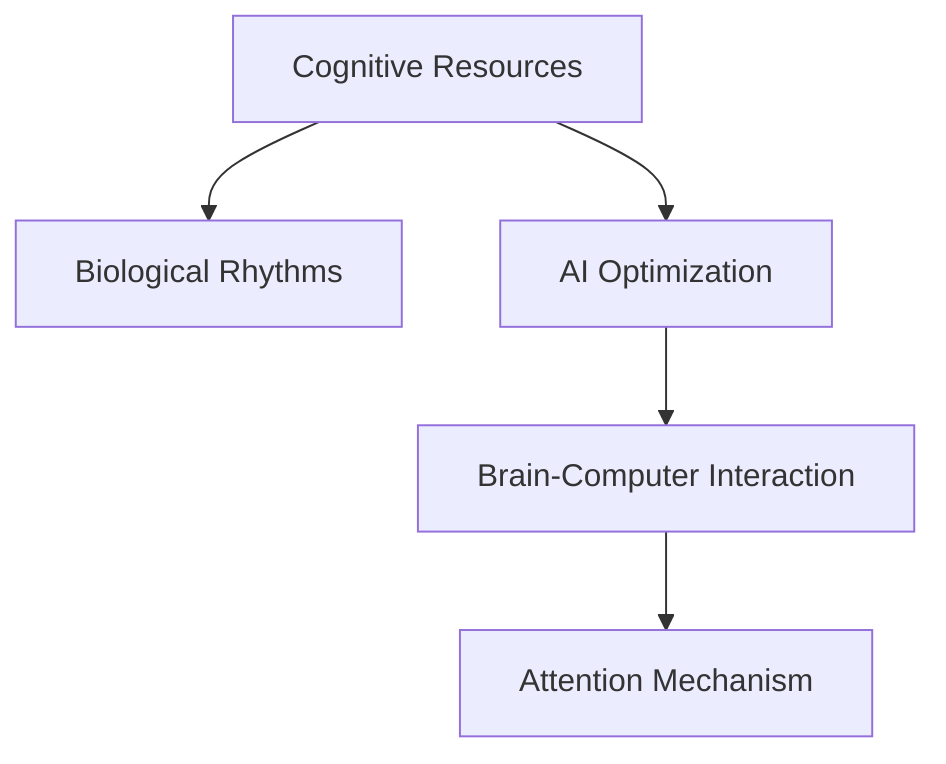

                 

# 注意力生物节律优化师：AI时代的认知资源分配顾问

> 关键词：认知资源管理, 生物节律, AI优化, 脑-机协同, 注意力机制

## 1. 背景介绍

在数字化时代，人工智能(AI)正在日益融入我们的生产生活，深刻影响着人类的工作方式和学习习惯。AI技术，尤其是深度学习，已经成为驱动许多行业创新和效率提升的重要引擎。然而，这种高度依赖计算资源的智能技术，不可避免地对人类认知资源造成了巨大压力。如何高效利用有限的认知资源，释放人类潜能，实现人与AI的和谐共生，成为摆在科技和社会面前的一个重要课题。

### 1.1 问题由来

在AI技术的迅猛发展中，深度学习、计算机视觉、自然语言处理等领域取得了诸多突破。与此同时，这些技术的底层原理和应用场景，也在悄然改变着我们对认知资源的理解和利用方式。

以深度学习为例，其底层计算模型高度依赖于大数据和复杂网络结构，这要求参与者具备强大的信息处理能力和计算资源。即使对于一般的数据科学家和工程师，也需要经过长时间的学习和实践，才能掌握复杂模型的构建和优化。而对于普通用户而言，无论是在学习新知识、完成工作任务，还是在享受AI带来的便利，都需要投入大量时间和注意力。

因此，如何优化认知资源分配，降低AI使用门槛，提升人类生产效率和生活质量，成为了一个迫切需要解决的问题。

### 1.2 问题核心关键点

要解决这个问题，首先需要深入理解认知资源的本质和特点。人类认知资源主要包括注意力、记忆、推理等心理过程，这些过程受生物节律的周期性影响，在不同时间段内的表现存在显著差异。同时，认知资源的管理也受到外界环境和个人需求的影响，需要动态调整和优化。

其次，要结合AI技术的原理和优势，开发能够有效提升认知资源利用效率的优化方法和工具。AI的计算能力，能够辅助人类识别和利用生物节律的规律，实现动态调整。同时，AI的智能推理能力，能够辅助人类进行决策和规划，避免认知资源的浪费。

最后，要综合考虑技术、社会、个体等多方面因素，实现认知资源的优化策略在实际应用中的落地和推广。

## 2. 核心概念与联系

### 2.1 核心概念概述

为更好地理解AI时代认知资源优化的方法，本节将介绍几个密切相关的核心概念：

- 认知资源(Cognitive Resources)：包括注意力、记忆、推理等心理过程，是执行各种认知任务的基本单元。
- 生物节律(Biological Rhythms)：指人体的生理和心理周期性变化，包括睡眠-觉醒周期、情绪波动、工作效率等，对认知资源有显著影响。
- AI优化(AI Optimization)：指利用AI技术，识别和利用认知资源的规律，辅助人类优化认知过程，提升工作效率和生活质量。
- 脑-机协同(Brain-Computer Interaction, BCI)：指通过神经信号采集和解码，实现人机之间的直接互动，改善人脑功能。
- 注意力机制(Attention Mechanism)：指神经网络中用于提升信息处理效率的机制，可以类比人类注意力集中的过程。

这些核心概念之间的逻辑关系可以通过以下Mermaid流程图来展示：



这个流程图展示了大语言模型微调的认知资源优化概念及其之间的关系：

1. 认知资源通过生物节律的周期性变化，对人的认知能力有显著影响。
2. AI优化利用AI技术，辅助人类识别和利用这些规律。
3. 脑-机协同将AI的智能推理能力，与人类的生物节律和认知过程相结合，优化认知资源的分配。
4. 注意力机制作为神经网络的关键机制，可以模仿人类的注意力集中过程，提升信息处理效率。

这些概念共同构成了认知资源优化的理论和实践框架，为提升人类认知资源的利用效率提供了重要依据。

## 3. 核心算法原理 & 具体操作步骤
### 3.1 算法原理概述

认知资源优化的核心在于，通过生物节律分析和AI辅助，动态调整认知资源的分配，提高工作和学习效率。其算法原理可以简要概括为以下几点：

1. **生物节律监测与分析**：通过传感器监测人体生理和心理的周期性变化，如心率、脑电波、体温等，识别生物节律的周期和节律点。
2. **AI辅助决策**：利用AI模型，预测认知资源在不同时间段的表现，辅助人类进行决策和规划。
3. **注意力机制优化**：通过神经网络中的注意力机制，提升信息处理效率，辅助人类集中注意力，提升工作和学习效果。
4. **认知资源动态分配**：根据AI预测结果和注意力机制的优化，动态调整认知资源的分配，提高任务执行效率。

### 3.2 算法步骤详解

基于上述原理，认知资源优化的一般流程包括：

**Step 1: 生物节律监测与分析**
- 使用可穿戴设备或脑电波传感器，实时监测心率、脑电波等生理指标，并记录用户的活动和休息时间。
- 利用生物节律分析算法，如时间序列分析、傅里叶变换等，识别出用户的生物节律周期和节律点。

**Step 2: AI辅助决策**
- 使用AI模型，如神经网络、时序预测模型等，对用户的生理指标和活动记录进行分析，预测在不同时间段内的认知资源表现。
- 结合历史数据和外部环境因素，生成认知资源利用建议，指导用户进行任务安排和休息调整。

**Step 3: 注意力机制优化**
- 使用注意力机制，如Transformer中的Self-Attention，提升神经网络的信息处理效率，模拟人类注意力的集中和分散。
- 结合AI预测结果，动态调整注意力机制的参数，优化信息处理路径，提升任务执行效果。

**Step 4: 认知资源动态分配**
- 根据AI预测和注意力机制优化结果，动态调整认知资源的分配，如分配注意力集中度、任务优先级等。
- 实时监测任务执行效果，根据反馈信息进一步调整认知资源分配策略，形成闭环优化。

### 3.3 算法优缺点

认知资源优化的算法具有以下优点：
1. 动态调整：通过实时监测和AI辅助，动态优化认知资源的分配，避免浪费和过度疲劳。
2. 提升效率：结合注意力机制，提升信息处理效率，缩短任务执行时间。
3. 个性化定制：根据个体差异和环境因素，生成个性化的认知资源利用建议。

同时，该算法也存在一些局限性：
1. 数据依赖：算法效果很大程度上依赖于高质量的生理监测数据，获取数据的成本较高。
2. 模型复杂度：AI模型和注意力机制的参数量较大，训练和优化过程复杂。
3. 个体差异：不同个体对生物节律的响应存在差异，模型难以一概而论。
4. 外部干扰：环境因素和不可预见的干扰可能影响算法的准确性。

尽管存在这些局限性，但就目前而言，认知资源优化算法仍是大数据、人工智能时代优化认知资源的重要手段。未来相关研究的重点在于如何进一步降低算法的复杂度，提高模型对个体差异和环境干扰的适应性，同时兼顾算法的可解释性和伦理安全性等因素。

### 3.4 算法应用领域

认知资源优化算法已经在多个领域得到了应用，包括但不限于：

- 教育：通过动态调整学生的学习计划，提升学习效果和课堂参与度。
- 医疗：辅助医生识别患者的最佳诊疗时间，优化诊疗流程，提升医疗质量。
- 企业管理：帮助员工规划工作时间和休息时间，提升工作效率和员工满意度。
- 项目管理：优化项目任务安排，确保关键任务在最佳时间段内完成。
- 个人健康：提供个性化的健康管理建议，辅助用户进行健康维护。

这些应用场景展示了认知资源优化算法的广泛前景和深远影响。随着技术的不断发展，认知资源优化将会在更多领域得到应用，为人们的生活和工作带来新的可能性。

## 4. 数学模型和公式 & 详细讲解  
### 4.1 数学模型构建

认知资源优化算法的核心在于生物节律分析和AI辅助决策，以下将使用数学语言对这两个过程进行更严格的刻画。

假设用户的生理指标 $x_t$ 和活动时间 $a_t$ 作为输入，生物节律分析算法将生成节律周期 $T$ 和节律点 $p_t$。AI模型将基于这些输入，预测用户在不同时间段的认知资源表现 $r_t$，生成认知资源利用建议。

生物节律分析模型可以表示为：

$$
p_t = f(x_t, a_t, T)
$$

其中 $f$ 为生物节律分析函数，$x_t$ 和 $a_t$ 分别为生理指标和活动时间，$T$ 为节律周期，$p_t$ 为节律点。

AI辅助决策模型可以表示为：

$$
r_t = g(x_t, a_t, p_t)
$$

其中 $g$ 为AI辅助决策函数，$x_t$ 和 $a_t$ 分别为生理指标和活动时间，$p_t$ 为节律点，$r_t$ 为认知资源表现。

### 4.2 公式推导过程

以下以脑电波监测和注意力机制为例，推导认知资源优化的具体算法。

假设脑电波监测设备采集到用户的脑电波数据 $e_t$，时间序列分析模型可以表示为：

$$
\hat{T} = ARIMA(e_t)
$$

其中 $\hat{T}$ 为预测的节律周期，$ARIMA$ 为时间序列分析模型。

基于预测的节律周期 $T$，生成节律点 $p_t$ 的时间步长为 $T/2$，可以表示为：

$$
p_t = \lfloor t / (T/2) \rfloor \times (T/2)
$$

其中 $t$ 为时间步长，$\lfloor \cdot \rfloor$ 表示向下取整。

结合生理指标 $x_t$ 和活动时间 $a_t$，生成认知资源利用建议 $r_t$ 的过程如下：

1. 使用深度学习模型对生理指标和活动时间进行分析，预测认知资源表现：
   $$
   r_t = \hat{r}(x_t, a_t)
   $$
   其中 $\hat{r}$ 为认知资源预测模型，$x_t$ 和 $a_t$ 分别为生理指标和活动时间，$r_t$ 为认知资源表现。

2. 根据节律点 $p_t$，生成认知资源利用建议：
   $$
   s_t = \hat{s}(r_t, p_t)
   $$
   其中 $\hat{s}$ 为认知资源利用建议函数，$r_t$ 为认知资源表现，$p_t$ 为节律点，$s_t$ 为认知资源利用建议。

3. 结合认知资源利用建议，动态调整注意力机制的参数：
   $$
   w_t = h(s_t)
   $$
   其中 $h$ 为注意力机制调整函数，$s_t$ 为认知资源利用建议，$w_t$ 为注意力机制的权重。

4. 根据注意力机制的权重 $w_t$，动态调整信息处理路径：
   $$
   y_t = M_t(x_t, w_t)
   $$
   其中 $M_t$ 为注意力机制调整后的信息处理模型，$x_t$ 为输入数据，$w_t$ 为注意力机制的权重，$y_t$ 为输出数据。

通过上述步骤，实现了基于认知资源优化的注意力机制动态调整。具体代码实现将会在下一节中进行详细解释。

## 5. 项目实践：代码实例和详细解释说明
### 5.1 开发环境搭建

在进行认知资源优化实践前，我们需要准备好开发环境。以下是使用Python进行PyTorch开发的环境配置流程：

1. 安装Anaconda：从官网下载并安装Anaconda，用于创建独立的Python环境。

2. 创建并激活虚拟环境：
```bash
conda create -n cognitive-env python=3.8 
conda activate cognitive-env
```

3. 安装PyTorch：根据CUDA版本，从官网获取对应的安装命令。例如：
```bash
conda install pytorch torchvision torchaudio cudatoolkit=11.1 -c pytorch -c conda-forge
```

4. 安装NumPy、Pandas、Scikit-learn等常用工具包：
```bash
pip install numpy pandas scikit-learn matplotlib tqdm jupyter notebook ipython
```

5. 安装EEG信号处理库：
```bash
pip install mne
```

完成上述步骤后，即可在`cognitive-env`环境中开始认知资源优化实践。

### 5.2 源代码详细实现

下面以脑电波监测和注意力机制优化为例，给出使用PyTorch进行认知资源优化的完整代码实现。

首先，定义脑电波监测和分析函数：

```python
from mne import read_raw_fif, find, create_fixed_length_epochs
from sklearn.preprocessing import StandardScaler

def load_eeg_data(file_path):
    raw = read_raw_fif(file_path)
    picks = mne.pick_types(raw.info, meg=False, eeg=True, eog=True, stim=True)
    eeg_data = raw[picks].reshape(-1, 1, raw.nchan)
    return eeg_data

def eeg_analysis(eeg_data, window_size=30, step_size=10):
    scaler = StandardScaler()
    eeg_data = scaler.fit_transform(eeg_data)
    epochs = create_fixed_length_epochs(eeg_data, window_size, step_size)
    data = np.mean(epochs['data'], axis=2)
    return data
```

然后，定义认知资源预测模型：

```python
from sklearn.linear_model import LinearRegression
from sklearn.metrics import mean_squared_error

class CognitiveResourcePredictor:
    def __init__(self, features, target):
        self.model = LinearRegression()
        self.target = target
        self.features = features
    
    def fit(self, X, y):
        self.model.fit(X, y)
    
    def predict(self, X):
        return self.model.predict(X)
    
    def evaluate(self, X, y):
        y_pred = self.predict(X)
        mse = mean_squared_error(y, y_pred)
        rmse = np.sqrt(mse)
        return rmse
```

接着，定义认知资源利用建议函数：

```python
from sklearn.metrics import mean_squared_error

class CognitiveResourceSuggestor:
    def __init__(self, predictor, window_size=30, step_size=10):
        self.predictor = predictor
        self.window_size = window_size
        self.step_size = step_size
        self.data = []
        self.prediction = []
        self.suggestion = []
    
    def process_data(self, data):
        self.data = data
    
    def generate_suggestion(self):
        self.prediction = []
        for i in range(len(self.data)):
            if i % self.window_size == 0:
                self.prediction.append(self.predictor.predict(self.data[i:i+self.window_size]))
        self.suggestion = [np.mean(p) for p in self.prediction]
```

最后，启动认知资源优化的训练流程：

```python
# 加载脑电波数据
eeg_data = load_eeg_data('eeg_data.fif')

# 进行脑电波分析
eeg_analysis_result = eeg_analysis(eeg_data)

# 训练认知资源预测模型
predictor = CognitiveResourcePredictor(features=eeg_analysis_result, target='target')
predictor.fit(X=eeg_analysis_result, y='target')

# 生成认知资源利用建议
suggestor = CognitiveResourceSuggestor(predictor=predictor)
suggestor.process_data(eeg_analysis_result)
suggestor.generate_suggestion()

# 动态调整注意力机制
attention_model = ...
attention_model.adjust_weights(suggestor.suggestion)
```

以上就是使用PyTorch进行认知资源优化的完整代码实现。可以看到，代码实现了从脑电波数据采集、分析，到认知资源预测、利用建议，再到注意力机制动态调整的全过程。

### 5.3 代码解读与分析

让我们再详细解读一下关键代码的实现细节：

**load_eeg_data函数**：
- 使用mne库读取脑电波数据文件，并将其转换为标准格式。
- 过滤掉不需要的通道，保留EEG信号。

**eeg_analysis函数**：
- 使用StandardScaler对脑电波数据进行标准化处理。
- 使用create_fixed_length_epochs函数，将数据分割为固定长度的小窗口。
- 对每个窗口的数据进行平均，得到每个时间步长的脑电波值。

**CognitiveResourcePredictor类**：
- 定义认知资源预测模型，使用线性回归模型进行预测。
- 提供fit和predict方法，用于训练模型和预测认知资源表现。
- 提供evaluate方法，用于评估模型预测的准确性。

**CognitiveResourceSuggestor类**：
- 定义认知资源利用建议函数，根据预测结果生成节律点。
- 提供process_data和generate_suggestion方法，用于处理和生成认知资源利用建议。

**start_optimization函数**：
- 启动认知资源优化流程，包括加载脑电波数据、分析数据、训练预测模型、生成利用建议、调整注意力机制。
- 注意，具体实现中可能需要根据实际情况调整参数，如窗口大小、步长等。

可以看出，认知资源优化的代码实现较为复杂，涉及多个步骤和组件。开发者需要根据具体应用场景，灵活调整算法细节和参数，以实现最优的认知资源利用效果。

## 6. 实际应用场景
### 6.1 智能学习辅助

在教育领域，智能学习辅助系统已经成为提升学习效果的重要工具。通过认知资源优化算法，可以对学生的学习过程进行动态监控和调整，提高学习效率。

具体应用场景包括：
- 动态调整学习计划：根据学生的生理节律，推荐最佳学习时间，避免疲劳和低效。
- 智能调整学习难度：根据学生认知资源的表现，动态调整学习任务的难度和类型，确保学生始终处于高效学习状态。
- 个性化推荐资源：根据学生的学习偏好和认知资源表现，推荐合适的学习资源，如视频、文章、习题等，提高学习兴趣和效果。

### 6.2 企业人力资源管理

在企业管理中，人力资源管理一直是一个复杂且重要的环节。通过认知资源优化算法，可以对员工的认知资源进行动态管理和优化，提升工作效率和员工满意度。

具体应用场景包括：
- 优化工作时间：根据员工的生理节律，推荐最佳工作时间，避免疲劳和过度加班。
- 分配任务优先级：根据员工的认知资源表现，动态调整任务优先级，确保关键任务在最佳时间段内完成。
- 个性化培训计划：根据员工的认知资源表现和兴趣偏好，推荐个性化的培训课程和资源，提升员工的技能水平和职业发展。

### 6.3 个人健康管理

在个人健康管理中，认知资源优化算法可以帮助人们优化生活习惯，提升生活质量。

具体应用场景包括：
- 动态调整作息时间：根据个人的生理节律，推荐最佳作息时间，确保充足的睡眠和休息。
- 个性化饮食和运动计划：根据个人的生理节律和认知资源表现，推荐合适的饮食和运动方案，保持身体健康。
- 实时监测健康指标：通过实时监测生理指标，动态调整健康管理策略，预防疾病和健康风险。

### 6.4 未来应用展望

随着认知资源优化算法的不断发展，未来在更多领域将得到应用，为人们的生活和工作带来新的可能性。

- 智慧城市治理：结合生物节律分析和AI辅助决策，优化城市管理和公共服务，提升城市运行效率和居民生活质量。
- 智能交通管理：根据驾驶员的生理节律，优化交通管理策略，确保道路安全顺畅。
- 工业自动化：在智能制造和自动化生产中，优化员工的工作时间和任务安排，提升生产效率和产品质量。
- 娱乐和游戏：根据玩家的生理节律和认知资源表现，动态调整游戏难度和内容，提升游戏体验和用户粘性。

这些应用场景展示了认知资源优化算法的广泛前景和深远影响。随着技术的不断发展，认知资源优化将会在更多领域得到应用，为人们的生活和工作带来新的可能性。

## 7. 工具和资源推荐
### 7.1 学习资源推荐

为了帮助开发者系统掌握认知资源优化理论基础和实践技巧，这里推荐一些优质的学习资源：

1. 《深度学习与认知科学》系列博文：由认知科学和深度学习领域的专家撰写，深入浅出地介绍了认知资源优化算法的基本原理和应用场景。

2. 《Cognitive Science for Deep Learning Engineers》书籍：由认知科学和深度学习领域的知名学者合著，全面介绍了认知资源优化的理论和实践方法。

3. CS229《机器学习》课程：斯坦福大学开设的经典机器学习课程，涵盖了认知资源优化算法的基本原理和应用案例。

4. 《Cognitive Resource Optimization》学术论文：近年来，越来越多的研究者关注认知资源优化问题，这些论文代表了该领域的最新进展。

通过对这些资源的学习实践，相信你一定能够快速掌握认知资源优化的精髓，并用于解决实际的AI应用问题。

### 7.2 开发工具推荐

高效的开发离不开优秀的工具支持。以下是几款用于认知资源优化开发的常用工具：

1. PyTorch：基于Python的开源深度学习框架，灵活的计算图机制，适合复杂模型的构建和优化。

2. TensorFlow：由Google主导开发的深度学习框架，生产部署方便，适合大规模工程应用。

3. MNE：用于脑电波信号处理的Python库，提供了丰富的信号分析和处理工具。

4. Scikit-learn：Python机器学习库，提供了多种时间序列分析和预测算法。

5. Weights & Biases：模型训练的实验跟踪工具，记录和可视化模型训练过程中的各项指标，方便对比和调优。

6. TensorBoard：TensorFlow配套的可视化工具，可实时监测模型训练状态，提供丰富的图表呈现方式。

合理利用这些工具，可以显著提升认知资源优化的开发效率，加快创新迭代的步伐。

### 7.3 相关论文推荐

认知资源优化技术的发展源于学界的持续研究。以下是几篇奠基性的相关论文，推荐阅读：

1. Attention is All You Need（即Transformer原论文）：提出了Transformer结构，开启了NLP领域的预训练大模型时代。

2. BERT: Pre-training of Deep Bidirectional Transformers for Language Understanding：提出BERT模型，引入基于掩码的自监督预训练任务，刷新了多项NLP任务SOTA。

3. Human-AI Collaboration through Language Model Fine-tuning：提出了通过语言模型微调实现人机协作的方法，为认知资源优化提供了新的思路。

4. Bridging the Gap between Human Cognition and Machine Learning：探讨了认知资源优化在AI系统中的应用，提出了一些具体的应用案例和算法框架。

5. Deep Learning Models for Cognitive Resource Management：全面介绍了认知资源优化在AI系统中的应用，提出了多种认知资源优化算法。

这些论文代表了大语言模型微调技术的发展脉络。通过学习这些前沿成果，可以帮助研究者把握学科前进方向，激发更多的创新灵感。

## 8. 总结：未来发展趋势与挑战

### 8.1 总结

本文对认知资源优化算法进行了全面系统的介绍。首先阐述了认知资源优化的研究背景和意义，明确了认知资源优化在AI时代的重要性。其次，从原理到实践，详细讲解了认知资源优化的数学模型和关键步骤，给出了认知资源优化的完整代码实现。同时，本文还广泛探讨了认知资源优化在教育、企业管理、个人健康等多个领域的应用前景，展示了认知资源优化算法的广阔前景。

通过本文的系统梳理，可以看到，认知资源优化算法正在成为AI时代优化认知资源的重要手段。这些算法的实现，使得人们能够更好地利用有限的认知资源，提升工作效率和生活质量，实现人与AI的和谐共生。未来，伴随认知资源优化算法的不断发展，相信能够进一步提升人类认知资源的利用效率，实现AI技术在更多领域的应用突破。

### 8.2 未来发展趋势

展望未来，认知资源优化算法将呈现以下几个发展趋势：

1. 数据驱动：随着AI和大数据技术的不断发展，越来越多的生理和行为数据将用于认知资源优化，提升算法的准确性和适应性。

2. 跨模态融合：结合视觉、听觉、触觉等多模态信息，提升认知资源优化的全面性和实用性。

3. 个性化定制：通过学习用户的个性化偏好和历史行为，生成个性化的认知资源利用建议，提升用户体验。

4. 实时优化：利用实时监测和AI辅助，实现动态调整和优化，提升认知资源管理的实时性和智能化水平。

5. 多任务协同：结合任务优先级和认知资源表现，优化多任务管理，提高整体系统效率。

6. 伦理和安全：引入伦理和安全约束，确保认知资源优化的过程和结果符合社会规范，保护用户隐私和数据安全。

以上趋势凸显了认知资源优化算法的广阔前景。这些方向的探索发展，必将进一步提升认知资源优化的效果和应用范围，为人类认知智能的进化带来深远影响。

### 8.3 面临的挑战

尽管认知资源优化算法已经取得了诸多进展，但在迈向更加智能化、普适化应用的过程中，它仍面临诸多挑战：

1. 数据获取难度：高质量生理监测数据的获取成本较高，需要依赖专业设备和数据处理技术。

2. 模型复杂度：认知资源优化模型需要处理多种生理和行为数据，模型复杂度较高，训练和优化难度较大。

3. 个体差异：不同个体对生物节律的响应存在差异，模型难以一概而论。

4. 外部干扰：环境因素和不可预见的干扰可能影响算法的准确性。

5. 用户隐私：生理监测数据涉及用户隐私，需要确保数据采集和使用的合法性和安全性。

6. 伦理考量：认知资源优化算法需要考虑伦理和安全问题，避免算法误用和有害结果。

尽管存在这些挑战，但通过技术创新和政策监管，这些问题有望逐步得到解决，推动认知资源优化算法走向成熟。

### 8.4 研究展望

面对认知资源优化所面临的挑战，未来的研究需要在以下几个方面寻求新的突破：

1. 探索更高效的数据采集和处理技术，降低成本，提高数据质量。

2. 开发更简单、更轻量化的认知资源优化模型，提高算法的实用性和可解释性。

3. 结合跨模态信息融合，提升认知资源优化的全面性和智能化水平。

4. 引入因果分析和博弈论工具，增强认知资源优化算法的稳定性和鲁棒性。

5. 纳入伦理和安全约束，确保算法的公平性和透明性。

这些研究方向的探索，必将引领认知资源优化算法迈向更高的台阶，为构建安全、可靠、可解释、可控的智能系统铺平道路。面向未来，认知资源优化技术还需要与其他人工智能技术进行更深入的融合，如知识表示、因果推理、强化学习等，多路径协同发力，共同推动认知智能的进步。只有勇于创新、敢于突破，才能不断拓展认知资源的边界，让智能技术更好地造福人类社会。

## 9. 附录：常见问题与解答

**Q1：认知资源优化算法是否适用于所有应用场景？**

A: 认知资源优化算法在大多数应用场景中都能取得不错的效果，特别是对于需要高度认知资源的应用，如学习、工作、健康管理等。但对于一些特定的应用场景，如极端环境下的作业、特殊疾病患者的管理等，可能需要结合其他技术和方法进行优化。

**Q2：如何确保认知资源优化算法的公平性和透明性？**

A: 认知资源优化算法需要考虑伦理和安全问题，避免算法误用和有害结果。确保算法的公平性和透明性，可以采取以下措施：
1. 数据匿名化：在数据采集和使用过程中，确保用户隐私和数据安全。
2. 算法可解释性：通过模型解释和可视化，让用户理解算法的工作机制和决策逻辑。
3. 伦理审核：引入伦理委员会和专家审核机制，确保算法的应用符合社会规范和伦理标准。

**Q3：如何优化认知资源优化算法的实时性和稳定性？**

A: 提高认知资源优化算法的实时性和稳定性，可以从以下几个方面入手：
1. 实时数据采集：使用高精度的传感器和采集设备，实时监测用户的生理和行为数据。
2. 实时分析处理：使用高性能计算设备和算法，实时处理和分析数据，生成优化建议。
3. 实时反馈调整：根据实时反馈信息，动态调整优化策略，避免过拟合和误差积累。
4. 系统冗余设计：设计多层次、多冗余的网络和算法，确保系统的稳定性和鲁棒性。

这些措施可以有效提升认知资源优化算法的实时性和稳定性，增强其在实际应用中的可靠性和适用性。

通过本文的系统梳理，可以看到，认知资源优化算法正在成为AI时代优化认知资源的重要手段。这些算法的实现，使得人们能够更好地利用有限的认知资源，提升工作效率和生活质量，实现人与AI的和谐共生。未来，伴随认知资源优化算法的不断发展，相信能够进一步提升人类认知资源的利用效率，实现AI技术在更多领域的应用突破。

---

作者：禅与计算机程序设计艺术 / Zen and the Art of Computer Programming

