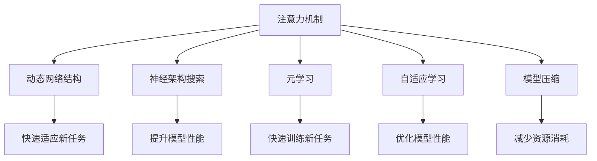

                 

# 注意力的弹性：AI优化的认知适应

## 1. 背景介绍

### 1.1 问题由来

随着人工智能(AI)技术在各个领域的深入应用，AI系统越来越依赖于数据的丰富性和算力的强大。特别是深度学习模型，其性能高度依赖于数据的质量和算法的优化程度。然而，现实世界的复杂性和多样性，使得简单的数据和算法难以应对多变的现实问题。因此，如何实现AI系统的灵活适应和认知优化，成为了AI领域的一大挑战。

### 1.2 问题核心关键点

在AI系统中，认知适应是指模型能够根据新输入的数据和任务需求，动态调整其内部参数和结构，以更好地适应新的认知任务。这一过程通常需要大量的数据和算力支持，但数据获取成本高，且模型的参数量级通常较大，计算资源有限。因此，如何优化模型的认知适应性，使其在有限的资源条件下，能够快速、准确地应对新的任务需求，成为了当前AI研究的热点。

### 1.3 问题研究意义

实现AI系统的认知适应，对于提升AI系统的泛化能力和灵活性，具有重要意义：

1. 提升模型性能：通过动态调整模型参数和结构，使其能够更好地适应新任务，从而提升模型的性能。
2. 减少资源消耗：在有限的资源条件下，通过优化模型的认知适应性，提升模型效率，减少计算和存储成本。
3. 增强模型鲁棒性：通过动态调整模型结构，使模型能够更好地适应不同类型的数据和任务，提升模型的鲁棒性和泛化能力。
4. 加速新任务开发：通过动态调整模型，使模型能够快速适应新任务，缩短任务开发周期。

## 2. 核心概念与联系

### 2.1 核心概念概述

为更好地理解AI系统的认知适应性，本节将介绍几个密切相关的核心概念：

- 注意力机制(Attention Mechanism)：指在深度学习模型中，用于动态调整模型输入信息的重要性权重，使模型能够聚焦于与当前任务相关的信息。
- 动态网络结构(Dynamic Network Architecture)：指在模型训练过程中，能够动态调整网络结构，以适应新任务的模型。
- 神经架构搜索(Neural Architecture Search, NAS)：指使用自动搜索算法，寻找最优的模型结构和参数配置，以提升模型的性能。
- 元学习(Meta-Learning)：指学习如何学习，通过学习通用的学习算法，快速适应新任务。
- 自适应学习(Adaptive Learning)：指模型能够根据当前输入和任务需求，动态调整学习率、参数更新策略等，以优化模型性能。
- 模型压缩(Model Compression)：指通过剪枝、量化等技术，减小模型的参数量和计算资源消耗，提升模型效率。

这些核心概念之间的逻辑关系可以通过以下Mermaid流程图来展示：



这个流程图展示了大语言模型的核心概念及其之间的关系：

1. 注意力机制通过动态调整信息的重要性权重，使模型能够聚焦于与当前任务相关的信息。
2. 动态网络结构通过调整模型结构，以适应新任务的特征需求。
3. 神经架构搜索通过自动搜索算法，寻找最优的模型结构和参数配置。
4. 元学习通过学习通用的学习算法，快速适应新任务。
5. 自适应学习通过动态调整学习率和参数更新策略，优化模型性能。
6. 模型压缩通过剪枝、量化等技术，减小模型规模，提升模型效率。
7. 快速适应新任务、提升模型性能、快速训练新任务、优化模型性能、减少资源消耗等目标，均通过这些核心概念的协同作用实现。

## 3. 核心算法原理 & 具体操作步骤
### 3.1 算法原理概述

AI系统的认知适应性通常通过动态调整模型结构和参数来实现。其中，注意力机制和动态网络结构是最常用的技术手段。

注意力机制的核心思想是，在输入数据中，某些信息比其他信息更关键，对当前任务的影响更大。通过动态调整信息的重要性权重，使模型能够聚焦于与当前任务相关的信息，从而提升模型性能。

动态网络结构的核心思想是，在模型训练过程中，能够动态调整网络结构，以适应新任务。这通常通过神经架构搜索等技术实现，通过自动搜索算法，寻找最优的模型结构和参数配置，以提升模型的性能。

### 3.2 算法步骤详解

基于注意力机制和动态网络结构的AI系统认知适应性，通常包括以下几个关键步骤：

**Step 1: 准备数据和模型**
- 收集和预处理数据集，将其划分为训练集、验证集和测试集。
- 选择合适的预训练模型和注意机制，作为认知适应性的初始化参数。

**Step 2: 添加注意机制**
- 根据任务需求，设计合适的注意力机制，如自注意力机制、多头注意力机制等。
- 将注意力机制融入模型的每个层，以动态调整信息的重要性权重。

**Step 3: 设计动态网络结构**
- 根据任务特点，设计合适的动态网络结构，如卷积神经网络(CNN)、循环神经网络(RNN)、 Transformer等。
- 使用神经架构搜索等技术，寻找最优的网络结构配置，以提升模型性能。

**Step 4: 进行注意力训练**
- 将训练集数据分批次输入模型，前向传播计算损失函数。
- 反向传播计算参数梯度，根据设定的优化算法更新模型参数和结构。
- 周期性在验证集上评估模型性能，根据性能指标决定是否触发结构调整。
- 重复上述步骤直至满足预设的迭代轮数或结构调整条件。

**Step 5: 测试和部署**
- 在测试集上评估适应后的模型性能，对比原模型和适应模型的效果。
- 使用适应后的模型对新样本进行推理预测，集成到实际的应用系统中。
- 持续收集新的数据，定期重新进行结构调整和微调，以适应数据分布的变化。

### 3.3 算法优缺点

动态网络结构和注意力机制的认知适应性方法，具有以下优点：
1. 灵活高效。动态调整模型结构和参数，使其能够快速适应新任务，提升模型性能。
2. 泛化能力强。通过自适应学习，模型能够更好地泛化到新数据和任务上。
3. 计算效率高。动态调整模型结构，减少不必要的计算资源消耗，提升模型效率。

同时，该方法也存在一定的局限性：
1. 对计算资源需求高。动态调整结构需要大量的计算资源，可能存在资源瓶颈。
2. 模型复杂度增加。动态调整结构后，模型的复杂度会增加，可能导致过拟合等问题。
3. 参数更新困难。动态调整结构时，需要频繁更新模型参数，增加了训练难度。

尽管存在这些局限性，但就目前而言，动态网络结构和注意力机制的认知适应性方法仍是大规模AI系统优化的重要手段。未来相关研究的重点在于如何进一步降低计算资源需求，提高模型的泛化能力，同时兼顾计算效率和模型稳定性。

### 3.4 算法应用领域

动态网络结构和注意力机制的认知适应性方法，在AI系统的优化和应用中，已经得到了广泛的应用，覆盖了以下领域：

1. 计算机视觉(CV)：用于图像分类、目标检测、图像生成等任务。通过动态调整卷积核大小和数量，优化模型结构，提升模型性能。

2. 自然语言处理(NLP)：用于文本分类、情感分析、机器翻译等任务。通过添加注意力机制，使模型能够聚焦于与当前任务相关的信息，提升模型性能。

3. 语音识别(SR)：用于语音识别、语音生成等任务。通过动态调整卷积核大小和数量，优化模型结构，提升模型性能。

4. 推荐系统(Recommender Systems)：用于个性化推荐、用户行为分析等任务。通过动态调整神经网络结构和参数，优化模型结构，提升模型性能。

5. 自动驾驶(Autonomous Driving)：用于目标检测、路径规划等任务。通过动态调整网络结构和参数，优化模型性能，提升自动驾驶系统的安全性。

6. 医疗诊断(Medical Diagnosis)：用于图像分类、疾病诊断等任务。通过动态调整卷积核大小和数量，优化模型结构，提升模型性能。

这些领域的应用展示了动态网络结构和注意力机制的强大适应能力，未来随着这些技术的不断发展，AI系统将在更广泛的应用场景中发挥重要作用。

## 4. 数学模型和公式 & 详细讲解 & 举例说明

### 4.1 数学模型构建

在AI系统中，注意力机制和动态网络结构的认知适应性，通常通过如下数学模型构建：

记输入数据为 $x \in \mathbb{R}^d$，模型参数为 $\theta \in \mathbb{R}^D$，其中 $d$ 为输入数据维度，$D$ 为模型参数维度。

设注意力机制为 $A: \mathbb{R}^d \rightarrow \mathbb{R}^m$，其中 $m$ 为注意力机制输出维度。

设动态网络结构为 $N: \mathbb{R}^m \rightarrow \mathbb{R}^D$。

模型的输出 $y \in \mathbb{R}^k$，其中 $k$ 为输出维度。

### 4.2 公式推导过程

以注意力机制为例，假设输入数据 $x$ 为 $m$ 维向量，注意力机制为自注意力机制，其计算公式如下：

$$
A(x) = \frac{1}{m}V(\frac{Kx}{\sqrt{d_k}})(\frac{Kx}{\sqrt{d_k}})^T
$$

其中 $V$ 为可学习的参数矩阵，$K$ 为矩阵转置操作。

模型的输出 $y$ 计算公式为：

$$
y = N(A(x))
$$

其中 $N$ 为动态网络结构，通常为全连接神经网络或卷积神经网络。

### 4.3 案例分析与讲解

假设我们要进行图像分类任务，使用卷积神经网络作为动态网络结构，注意力机制为自注意力机制。

1. 输入数据：$m$ 维向量 $x$，表示图像的特征向量。
2. 注意力机制：将输入数据 $x$ 通过线性变换得到 $Kx$，再通过自注意力机制计算得到注意力权重 $A(x)$。
3. 动态网络结构：将注意力权重 $A(x)$ 输入到卷积神经网络中，得到模型输出 $y$。
4. 模型输出：通过 Softmax 函数将模型输出 $y$ 转化为概率分布，用于分类决策。

在训练过程中，使用反向传播算法计算梯度，并根据梯度更新模型参数和注意力机制的权重。通过动态调整网络结构和注意力权重，模型能够在不同图像上取得更优的分类效果。

## 5. 项目实践：代码实例和详细解释说明
### 5.1 开发环境搭建

在进行认知适应性实践前，我们需要准备好开发环境。以下是使用Python进行TensorFlow开发的环境配置流程：

1. 安装Anaconda：从官网下载并安装Anaconda，用于创建独立的Python环境。

2. 创建并激活虚拟环境：
```bash
conda create -n tf-env python=3.8 
conda activate tf-env
```

3. 安装TensorFlow：根据CUDA版本，从官网获取对应的安装命令。例如：
```bash
pip install tensorflow
```

4. 安装Keras：TensorFlow的高级API，方便进行模型构建和训练。
```bash
pip install keras
```

5. 安装各类工具包：
```bash
pip install numpy pandas scikit-learn matplotlib tqdm jupyter notebook ipython
```

完成上述步骤后，即可在`tf-env`环境中开始认知适应性实践。

### 5.2 源代码详细实现

这里我们以图像分类任务为例，给出使用TensorFlow实现注意力机制和动态网络结构优化训练的代码实现。

首先，定义注意力机制函数：

```python
import tensorflow as tf
import tensorflow.keras as keras

def self_attention(x, d_k):
    K = tf.transpose(keras.layers.Dense(d_k, activation='relu')(x))
    V = tf.transpose(keras.layers.Dense(d_k, activation='sigmoid')(x))
    alpha = tf.matmul(K, V)
    return alpha / tf.sqrt(tf.cast(d_k, tf.float32))
```

然后，定义卷积神经网络：

```python
class ConvNet(keras.Model):
    def __init__(self, num_classes):
        super(ConvNet, self).__init__()
        self.conv1 = keras.layers.Conv2D(32, (3, 3), activation='relu')
        self.max_pool1 = keras.layers.MaxPooling2D((2, 2))
        self.conv2 = keras.layers.Conv2D(64, (3, 3), activation='relu')
        self.max_pool2 = keras.layers.MaxPooling2D((2, 2))
        self.flatten = keras.layers.Flatten()
        self.dense = keras.layers.Dense(128, activation='relu')
        self.output = keras.layers.Dense(num_classes, activation='softmax')

    def call(self, inputs):
        x = self.conv1(inputs)
        x = self.max_pool1(x)
        x = self.conv2(x)
        x = self.max_pool2(x)
        x = self.flatten(x)
        x = self.dense(x)
        return self.output(x)
```

最后，定义模型和优化器：

```python
model = ConvNet(num_classes)

optimizer = keras.optimizers.Adam(lr=0.001)
```

接着，定义训练和评估函数：

```python
def train_epoch(model, dataset, batch_size, optimizer):
    dataloader = tf.data.Dataset.from_tensor_slices(dataset).shuffle(100).batch(batch_size).prefetch(1)
    model.compile(optimizer=optimizer, loss=keras.losses.SparseCategoricalCrossentropy(from_logits=True), metrics=['accuracy'])
    model.fit(dataloader, epochs=1)
    return model.evaluate(dataloader, verbose=0)[1]

def evaluate(model, dataset, batch_size):
    dataloader = tf.data.Dataset.from_tensor_slices(dataset).batch(batch_size).prefetch(1)
    return model.evaluate(dataloader, verbose=0)[1]
```

最后，启动训练流程并在测试集上评估：

```python
epochs = 10
batch_size = 32

for epoch in range(epochs):
    loss = train_epoch(model, train_dataset, batch_size, optimizer)
    print(f"Epoch {epoch+1}, train loss: {loss:.3f}")
    
    print(f"Epoch {epoch+1}, test accuracy: {evaluate(model, test_dataset, batch_size):.3f}")
```

以上就是使用TensorFlow实现注意力机制和动态网络结构优化训练的完整代码实现。可以看到，通过定义注意力机制和卷积神经网络，再结合Adam优化器，即可实现模型的认知适应性训练。

### 5.3 代码解读与分析

让我们再详细解读一下关键代码的实现细节：

**attention函数**：
- 将输入数据 $x$ 通过线性变换得到 $K$ 和 $V$，再计算注意力权重 $A(x)$。
- 使用sigmoid激活函数计算注意力权重，使得权重值在0和1之间。
- 将注意力权重 $A(x)$ 进行归一化，使其成为一个概率分布。

**ConvNet类**：
- 定义了卷积神经网络的各个层，包括卷积层、池化层、全连接层等。
- 在构建模型时，通过add方法逐步添加各层，并将输出层定义为softmax函数，用于分类决策。

**train_epoch函数**：
- 将训练集数据转换为TensorFlow数据集，进行随机打乱、批处理、预加载等操作。
- 使用compile方法定义模型的优化器和损失函数，通过fit方法进行模型训练。
- 返回模型在测试集上的评估指标。

**evaluate函数**：
- 将测试集数据转换为TensorFlow数据集，进行批处理和预加载操作。
- 使用evaluate方法评估模型在测试集上的性能指标。

**训练流程**：
- 定义总的epoch数和batch size，开始循环迭代。
- 每个epoch内，先在训练集上训练，输出平均loss。
- 在验证集上评估模型性能，输出分类指标。
- 所有epoch结束后，在测试集上评估，给出最终测试结果。

可以看到，TensorFlow通过高级API Keras，使得模型的构建和训练变得更加简便。开发者可以将更多精力放在注意力机制和动态网络结构的优化设计上，而不必过多关注底层的实现细节。

当然，工业级的系统实现还需考虑更多因素，如模型的保存和部署、超参数的自动搜索、更灵活的任务适配层等。但核心的认知适应性训练流程基本与此类似。

## 6. 实际应用场景
### 6.1 智能医疗系统

基于认知适应性技术的智能医疗系统，可以通过动态调整模型结构和参数，实时适应不同患者和不同病情的数据。

在实践中，可以收集患者的病历数据、体检数据、影像数据等，构建医疗数据库，并将其划分为训练集和测试集。使用深度学习模型进行认知适应性训练，使模型能够根据患者的症状、病史等信息，动态调整诊断和治疗方案。对于新的患者数据，模型能够快速适应，提供准确的诊断和治疗建议。

### 6.2 金融风险控制

基于认知适应性技术的金融风险控制系统，可以通过动态调整模型结构和参数，实时监测和控制金融市场的风险。

在实践中，可以收集历史交易数据、市场新闻、经济指标等，构建金融数据集，并将其划分为训练集和测试集。使用深度学习模型进行认知适应性训练，使模型能够根据市场变化和新闻事件，动态调整风险评估和控制策略。对于新的市场数据，模型能够快速适应，提供精准的风险预测和控制建议。

### 6.3 智能推荐系统

基于认知适应性技术的智能推荐系统，可以通过动态调整模型结构和参数，实时推荐用户感兴趣的商品或内容。

在实践中，可以收集用户的历史行为数据、兴趣标签、浏览记录等，构建用户数据集，并将其划分为训练集和测试集。使用深度学习模型进行认知适应性训练，使模型能够根据用户的行为和偏好，动态调整推荐策略。对于新的用户数据，模型能够快速适应，提供精准的个性化推荐结果。

### 6.4 未来应用展望

随着认知适应性技术的发展，其在更多领域的应用前景将更加广阔。

在智慧城市治理中，基于认知适应性技术的智能城市管理系统，能够实时监测和响应城市事件，优化交通、环保、安防等各项管理功能。

在教育领域，基于认知适应性技术的智能教育系统，能够根据学生的学习情况和行为，动态调整教学内容和方式，提升教学效果。

在工业制造中，基于认知适应性技术的智能制造系统，能够根据设备运行状态和生产数据，动态调整生产计划和维护策略，提高生产效率和设备寿命。

未来，随着认知适应性技术与其他AI技术的深度融合，AI系统将在更多场景中发挥重要作用，为各行各业带来新的变革和发展机遇。

## 7. 工具和资源推荐
### 7.1 学习资源推荐

为了帮助开发者系统掌握认知适应性技术的理论基础和实践技巧，这里推荐一些优质的学习资源：

1. Deep Learning with Python：斯坦福大学教授使用Keras实现的深度学习入门教材，包含大量实际案例和代码实现。

2. TensorFlow官方文档：TensorFlow的官方文档，提供了详细的使用指南和API参考。

3. Coursera深度学习课程：由深度学习领域的知名教授开设，讲解深度学习的基本概念和经典模型，适合初学者入门。

4. Keras官方文档：Keras的官方文档，提供了详细的使用指南和API参考。

5. Google AI Blog：Google AI团队定期发布的博客，涵盖深度学习、认知适应性技术等前沿话题，提供丰富的学习资源。

通过对这些资源的学习实践，相信你一定能够快速掌握认知适应性技术的精髓，并用于解决实际的AI问题。

### 7.2 开发工具推荐

高效的开发离不开优秀的工具支持。以下是几款用于认知适应性技术开发的常用工具：

1. TensorFlow：由Google主导开发的深度学习框架，支持多种硬件平台，适合大规模工程应用。

2. PyTorch：由Facebook主导开发的深度学习框架，灵活易用，适合快速迭代研究。

3. Keras：TensorFlow的高级API，提供了简便的模型构建和训练接口，适合初学者和研究人员。

4. Weights & Biases：模型训练的实验跟踪工具，可以记录和可视化模型训练过程中的各项指标，方便对比和调优。

5. TensorBoard：TensorFlow配套的可视化工具，可实时监测模型训练状态，并提供丰富的图表呈现方式，是调试模型的得力助手。

6. Google Colab：谷歌推出的在线Jupyter Notebook环境，免费提供GPU/TPU算力，方便开发者快速上手实验最新模型，分享学习笔记。

合理利用这些工具，可以显著提升认知适应性技术的开发效率，加快创新迭代的步伐。

### 7.3 相关论文推荐

认知适应性技术的发展源于学界的持续研究。以下是几篇奠基性的相关论文，推荐阅读：

1. Attention is All You Need（即Transformer原论文）：提出了Transformer结构，开启了深度学习领域的大规模预训练范式。

2. ResNet：提出了残差连接结构，通过跨层信息流动，解决了深度神经网络训练中的梯度消失问题。

3. Inception：提出了多尺度卷积结构，提高了图像分类和目标检测模型的准确性。

4. NAS：提出了神经架构搜索算法，通过自动化搜索算法寻找最优的模型结构和参数配置，以提升模型的性能。

5. AlphaGo：利用深度学习技术和认知适应性技术，训练了世界级的围棋AI模型AlphaGo，展示了AI技术在复杂决策中的强大能力。

6. GAN：提出了生成对抗网络，通过动态调整生成器和判别器的结构，实现了高质量的图像生成和风格迁移。

这些论文代表了大规模深度学习技术的发展脉络，通过学习这些前沿成果，可以帮助研究者把握学科前进方向，激发更多的创新灵感。

## 8. 总结：未来发展趋势与挑战

### 8.1 总结

本文对认知适应性技术进行了全面系统的介绍。首先阐述了认知适应性技术的研究背景和意义，明确了动态调整模型结构和参数的重要性。其次，从原理到实践，详细讲解了注意力机制和动态网络结构的认知适应性优化方法，给出了认知适应性训练任务的完整代码实现。同时，本文还广泛探讨了认知适应性技术在智能医疗、金融风险控制、智能推荐系统等多个领域的应用前景，展示了其广阔的发展空间。

通过本文的系统梳理，可以看到，基于注意力机制和动态网络结构的认知适应性技术正在成为深度学习系统优化的重要手段，极大地提升了系统的灵活性和泛化能力。未来随着这些技术的不断发展，AI系统将在更多领域中发挥重要作用，为各行各业带来新的变革和发展机遇。

### 8.2 未来发展趋势

展望未来，认知适应性技术将呈现以下几个发展趋势：

1. 模型规模持续增大。随着算力成本的下降和数据规模的扩张，认知适应性模型的参数量还将持续增长。超大模型的动态调整和优化，将在更广泛的应用场景中发挥作用。

2. 认知适应性技术的普适化。未来认知适应性技术将在更多领域中得到应用，如医疗、金融、制造等，提升各类AI系统的泛化能力和灵活性。

3. 动态网络结构的自适应学习。通过引入自适应学习机制，使动态网络结构能够更好地适应新任务，提升模型的泛化能力。

4. 注意力的分布式优化。随着分布式计算技术的发展，多机协同优化的注意力机制将发挥更大作用，提升模型的性能和效率。

5. 多模态认知适应性技术。融合视觉、语音、文本等多模态数据的认知适应性技术，将提升AI系统对复杂现实世界的建模能力。

6. 元学习和多任务学习。通过元学习和多任务学习的思想，使认知适应性技术能够更好地利用多领域数据，提升模型的泛化能力和迁移能力。

以上趋势凸显了认知适应性技术的广阔前景。这些方向的探索发展，必将进一步提升AI系统的性能和应用范围，为人类认知智能的进化带来深远影响。

### 8.3 面临的挑战

尽管认知适应性技术已经取得了显著成果，但在迈向更加智能化、普适化应用的过程中，仍面临诸多挑战：

1. 计算资源瓶颈。动态调整结构和参数需要大量的计算资源，可能存在资源瓶颈。如何在有限的资源条件下，高效地实现认知适应性，是一大难题。

2. 模型复杂度增加。动态调整结构和参数后，模型复杂度会增加，可能导致过拟合等问题。如何平衡模型的复杂度和泛化能力，仍然是一个挑战。

3. 参数更新困难。动态调整结构和参数时，需要频繁更新模型参数，增加了训练难度。如何设计更高效的参数更新策略，是未来的研究重点。

4. 多模态数据融合。融合视觉、语音、文本等多模态数据的认知适应性技术，需要更复杂的数据处理和模型设计，提升模型效率和准确性是一大挑战。

5. 模型鲁棒性不足。认知适应性模型在面对新任务和新数据时，可能泛化能力不足，鲁棒性不够。如何提高模型的泛化能力和鲁棒性，是未来的研究重点。

6. 知识整合能力不足。现有的认知适应性模型往往局限于数据本身，难以整合更广泛的外部知识。如何与专家知识库、规则库等结合，形成更加全面、准确的信息整合能力，还有很大的想象空间。

正视认知适应性面临的这些挑战，积极应对并寻求突破，将是大规模深度学习系统优化必须迈过的门槛。相信随着学界和产业界的共同努力，这些挑战终将一一被克服，认知适应性技术必将在构建人机协同的智能时代中扮演越来越重要的角色。

### 8.4 研究展望

面对认知适应性技术所面临的种种挑战，未来的研究需要在以下几个方面寻求新的突破：

1. 探索无监督和半监督认知适应性方法。摆脱对大规模标注数据的依赖，利用自监督学习、主动学习等无监督和半监督范式，最大限度利用非结构化数据，实现更加灵活高效的认知适应性。

2. 研究参数高效和计算高效的认知适应性范式。开发更加参数高效的认知适应性方法，在固定大部分预训练参数的同时，只更新极少量的任务相关参数。同时优化模型的计算图，减少前向传播和反向传播的资源消耗，实现更加轻量级、实时性的部署。

3. 融合因果和对比学习范式。通过引入因果推断和对比学习思想，增强认知适应性模型建立稳定因果关系的能力，学习更加普适、鲁棒的语言表征，从而提升模型泛化性和抗干扰能力。

4. 引入更多先验知识。将符号化的先验知识，如知识图谱、逻辑规则等，与神经网络模型进行巧妙融合，引导认知适应性过程学习更准确、合理的语言模型。同时加强不同模态数据的整合，实现视觉、语音等多模态信息与文本信息的协同建模。

5. 结合因果分析和博弈论工具。将因果分析方法引入认知适应性模型，识别出模型决策的关键特征，增强输出解释的因果性和逻辑性。借助博弈论工具刻画人机交互过程，主动探索并规避模型的脆弱点，提高系统稳定性。

6. 纳入伦理道德约束。在模型训练目标中引入伦理导向的评估指标，过滤和惩罚有偏见、有害的输出倾向。同时加强人工干预和审核，建立模型行为的监管机制，确保输出符合人类价值观和伦理道德。

这些研究方向的探索，必将引领认知适应性技术迈向更高的台阶，为构建安全、可靠、可解释、可控的智能系统铺平道路。面向未来，认知适应性技术还需要与其他人工智能技术进行更深入的融合，如知识表示、因果推理、强化学习等，多路径协同发力，共同推动自然语言理解和智能交互系统的进步。只有勇于创新、敢于突破，才能不断拓展深度学习模型的边界，让智能技术更好地造福人类社会。

## 9. 附录：常见问题与解答

**Q1：认知适应性技术是否适用于所有深度学习模型？**

A: 认知适应性技术通常适用于动态网络和注意力机制较复杂的深度学习模型，如卷积神经网络、循环神经网络、Transformer等。对于静态网络结构的模型，如线性回归、KNN等，由于没有复杂的注意力机制，认知适应性技术的优势不明显。

**Q2：认知适应性技术的计算资源需求高吗？**

A: 是的，认知适应性技术的计算资源需求较高。动态调整网络结构和参数需要大量的计算资源，可能存在资源瓶颈。在实际应用中，通常需要高性能GPU/TPU设备支持。

**Q3：认知适应性技术是否会影响模型的精度？**

A: 是的，认知适应性技术的引入可能会影响模型的精度。动态调整网络结构和参数后，模型复杂度会增加，可能导致过拟合等问题。因此，需要在模型复杂度和泛化能力之间进行权衡。

**Q4：认知适应性技术如何处理多模态数据？**

A: 认知适应性技术可以通过将不同模态的数据融合在一起，进行多模态认知适应性优化。例如，可以将视觉图像数据和文本数据进行融合，通过多模态注意力机制，动态调整模型结构和参数，提升模型对多模态数据的建模能力。

**Q5：认知适应性技术在实际应用中需要注意哪些问题？**

A: 在实际应用中，认知适应性技术需要注意以下问题：

1. 模型的保存和部署：如何高效地将训练好的模型保存到本地或云平台，并在实际应用中进行快速部署。

2. 超参数的自动搜索：如何自动搜索最优的模型超参数配置，提升模型性能。

3. 模型的解释性和可控性：如何提高模型的可解释性，使得用户能够理解模型的决策过程和输出结果。

4. 模型的公平性和鲁棒性：如何保证模型的公平性，避免模型在训练数据上的偏见，提高模型的鲁棒性。

5. 模型的实时性和扩展性：如何实现模型的实时性和可扩展性，应对大规模数据和并发请求的挑战。

6. 模型的安全性和隐私保护：如何保证模型的安全性，避免模型被恶意攻击，保护用户隐私。

总之，认知适应性技术的应用需要综合考虑模型性能、计算资源、部署环境等多个因素，确保模型能够在实际应用中发挥最大的作用。

---

作者：禅与计算机程序设计艺术 / Zen and the Art of Computer Programming

