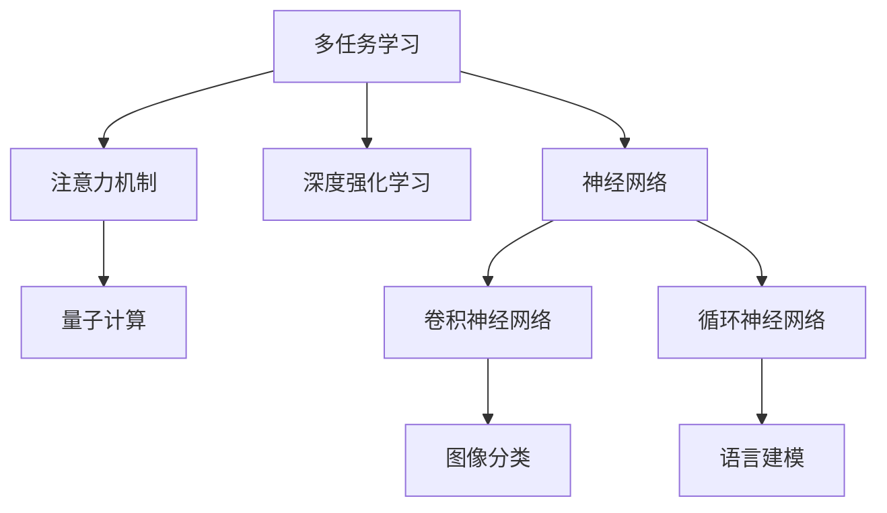

                 

# 注意力的量子态：AI时代的多任务处理

> 关键词：多任务学习,注意力机制,量子计算,深度学习,深度强化学习,神经网络

## 1. 背景介绍

### 1.1 问题由来

在当今AI时代，多任务处理（Multi-Task Learning, MTL）已经成为了一个热门话题。随着数据量的爆炸式增长和计算能力的不断提升，人们越来越希望利用大规模数据集同时训练多个相关任务，以提升模型的泛化能力和性能。然而，由于任务间存在复杂的相关性，如何高效地利用这些数据成为了一个重要挑战。

在深度学习中，多任务学习（MTL）通常指的是一种同时优化多个任务损失函数的方法。这些任务可以是分类、回归、生成等不同类型，通常共享某些基础特征。多任务学习的目标是通过共享底层特征，利用任务间的相关性，提高模型的泛化能力，减少计算成本，并利用数据的多样性提升模型性能。

而多任务处理中一个核心技术就是注意力机制（Attention Mechanism），它允许模型在处理数据时，动态关注输入的不同部分，提升模型的理解和推理能力。在深度强化学习（Deep Reinforcement Learning, DRL）中，注意力机制同样扮演着重要角色，使模型能够从环境中提取关键信息，进行智能决策。

### 1.2 问题核心关键点

多任务处理的关键在于如何利用多个任务间的关系，进行有效的特征共享和信息整合。在深度学习中，注意力机制作为其中的一种重要技术手段，旨在让模型能够动态地分配注意力资源，对不同部分进行精细处理。

具体来说，注意力机制可以看作是一种对输入信息的选择性关注，它可以帮助模型区分哪些信息对于当前任务更相关，哪些信息可以忽略。这种机制通常出现在自编码器、卷积神经网络、循环神经网络等模型中，通过动态调整权重矩阵，实现对不同特征的加权求和，提升模型的学习效果。

另外，量子计算在多任务处理中的应用也逐渐成为一个研究热点。量子计算提供了一种全新的计算范式，通过量子叠加、量子纠缠等特性，能够在某些特定场景下，提高计算效率和模型的表达能力。量子计算结合注意力机制，有望在解决多任务处理问题时，提供更强大的计算支持。

## 2. 核心概念与联系

### 2.1 核心概念概述

为更好地理解多任务处理和注意力机制，本节将介绍几个密切相关的核心概念：

- 多任务学习（Multi-Task Learning, MTL）：指通过同时优化多个相关任务的目标函数，使得模型能够更好地学习到任务间的共享特征，提高模型性能。
- 注意力机制（Attention Mechanism）：一种模型机制，使模型能够动态地关注输入数据的不同部分，提升模型理解和推理能力。
- 深度强化学习（Deep Reinforcement Learning, DRL）：一种利用神经网络进行智能决策的机器学习范式，通过奖励机制和环境交互，学习最优策略。
- 量子计算（Quantum Computing）：一种基于量子力学的计算范式，利用量子叠加和纠缠等特性，在特定场景下提供更强大的计算能力。

这些核心概念之间的逻辑关系可以通过以下Mermaid流程图来展示：



这个流程图展示了几大核心概念及其之间的关系：

1. 多任务学习与注意力机制紧密关联，共同提升模型的泛化能力。
2. 深度强化学习与注意力机制互补，为智能决策提供支持。
3. 量子计算为注意力机制提供新的计算手段，增强其表现力。
4. 神经网络是所有这些技术的基础，在不同任务间进行特征共享。

## 3. 核心算法原理 & 具体操作步骤

### 3.1 算法原理概述

多任务处理的原理，在于通过共享模型参数，利用多个任务间的关系，提升模型的泛化能力和性能。其核心思想是通过任务间的关系，共享底层特征表示，减少冗余计算，并利用数据的多样性，提升模型在不同任务上的表现。

多任务处理可以分为联合训练（Joint Training）和逐个训练（Sequential Training）两种模式：

- 联合训练：在同一模型上同时优化多个任务的目标函数，共享模型参数。
- 逐个训练：依次训练多个任务，每个任务有独立模型。

注意力机制在多任务处理中的应用，主要体现在两个方面：

1. 任务间特征共享：通过注意力机制，对不同任务进行特征聚合，共享底层表示。
2. 任务间信息整合：利用注意力机制，动态调整权重，整合任务间信息，提升模型性能。

在深度强化学习中，注意力机制通常用于Q网络（Q-Network）和策略网络（Policy Network）的设计中，帮助模型从环境中提取关键信息，进行智能决策。

### 3.2 算法步骤详解

以下详细介绍多任务处理和注意力机制的算法步骤：

**Step 1: 数据预处理**
- 将多任务数据集划分为训练集、验证集和测试集。
- 对数据进行标准化处理，如归一化、中心化等，以提高模型的收敛速度和稳定性。

**Step 2: 模型选择**
- 选择适合多任务处理和注意力机制的模型架构，如多任务神经网络、自编码器、卷积神经网络等。
- 确定注意力机制的具体实现方式，如Soft Attention、Dot Attention、Additive Attention等。

**Step 3: 任务间关系建模**
- 对任务间的关系进行建模，如共享表示、级联、并行等。
- 设计多任务损失函数，如加权平均损失、联合损失、联合最大似然损失等。

**Step 4: 训练与优化**
- 使用优化算法（如Adam、SGD等）对模型进行训练，最小化多任务损失函数。
- 在训练过程中，根据任务间的关系，动态调整权重矩阵，优化注意力机制。

**Step 5: 模型评估**
- 在测试集上评估模型的泛化能力，比较各个任务的表现。
- 分析模型在不同任务上的优势和不足，进行改进和优化。

### 3.3 算法优缺点

多任务处理和注意力机制的优势在于：

1. 提升模型泛化能力：通过共享底层特征，模型能够在多个相关任务上表现更好。
2. 减少计算成本：共享模型参数，减少了冗余计算，提高了训练效率。
3. 提高数据利用率：利用数据的多样性，提升模型性能，尤其在数据量有限的情况下。
4. 增强模型鲁棒性：模型能够在多种任务间进行泛化，减少过拟合风险。

其缺点在于：

1. 模型复杂度增加：多任务处理和注意力机制需要额外设计模型架构和优化算法，增加了模型复杂度。
2. 参数更新难度：多个任务间的关系建模和参数更新需要更加细致的设计和调试。
3. 需要高质量数据：任务间关系建模需要高质量的数据集，难以处理低质量、噪音较多的数据。

### 3.4 算法应用领域

多任务处理和注意力机制已经在诸多领域得到了广泛应用，如：

- 图像分类：如多类别分类任务、风格迁移、图像生成等。通过共享卷积核和池化层，提升模型泛化能力。
- 自然语言处理：如语言建模、机器翻译、对话系统等。利用注意力机制，动态关注文本的不同部分，提升模型理解能力。
- 视频处理：如视频分类、动作识别、行为分析等。通过共享特征提取层，提高模型的泛化能力。
- 强化学习：如游戏智能、机器人控制、自动驾驶等。利用注意力机制，提取关键信息，提升决策能力。

除了上述这些经典应用外，多任务处理和注意力机制还在更多场景中得到了创新性的应用，如可控图像生成、跨领域迁移学习等，为AI技术的发展提供了新的方向。

## 4. 数学模型和公式 & 详细讲解 & 举例说明

### 4.1 数学模型构建

在多任务处理中，通常使用多任务神经网络（MTN）架构。假设有$K$个相关任务，定义$Y_k$为第$k$个任务的输出，$X_k$为第$k$个任务的输入，$T_k$为第$k$个任务的任务标签，$W_k$为第$k$个任务的学习参数。则多任务神经网络的目标函数为：

$$
\mathcal{L}(W) = \sum_{k=1}^K \mathcal{L}_k(W_k, X_k, Y_k, T_k)
$$

其中$\mathcal{L}_k$为第$k$个任务的目标函数，如交叉熵损失、均方误差损失等。

注意力机制的数学模型通常包括两部分：注意力得分和权重矩阵。以Soft Attention为例，定义输入为$X$，注意力权重矩阵为$A$，注意力得分函数为$\alpha$，则注意力得分可以表示为：

$$
\alpha = \text{softmax}(XA^T)
$$

其中$\text{softmax}$函数将注意力得分转化为概率分布，$A^T$为注意力权重矩阵的转置。注意力权重矩阵可以通过矩阵乘法得到，如：

$$
A = X^T A^T W_v
$$

其中$W_v$为权重矩阵的参数。

### 4.2 公式推导过程

以下以多任务神经网络为例，推导多任务处理中注意力机制的数学模型。

假设输入$X_k$为一个$D$维向量，输出$Y_k$为一个$H$维向量，$T_k$为一个二分类标签。定义多任务神经网络的结构如下：

```
Input Layer (D) -> Hidden Layer -> Output Layer (H)
       \                  |         /                   \
        \                |         |                    \
         \              |         |                    \
          \            |         |                    \
           \          |         |                    \
            \        |         |                    \
             \      |         |                    \
              \    |         |                    \
               \  |         |                    \
                \ |         |                    \
                 \|         |                    \
                   Attention -> Tasks (K) -> Output (H)
```

其中隐藏层使用多任务学习机制，多个任务共享隐藏层参数。

假设隐藏层为$H$维向量，则隐藏层的输出可以表示为：

$$
H = f(WX + b)
$$

其中$f$为激活函数，$W$为权重矩阵，$b$为偏置向量。

定义注意力权重矩阵$A_k$，用于动态调整不同任务间的关系。则注意力得分可以表示为：

$$
\alpha_k = \text{softmax}(HA_k^T)
$$

其中$\text{softmax}$函数将注意力得分转化为概率分布。

定义注意力权重矩阵$A_k$，可以表示为：

$$
A_k = H^T A_k^T W_v
$$

其中$W_v$为权重矩阵的参数。

定义多任务神经网络的目标函数为：

$$
\mathcal{L}(W) = \sum_{k=1}^K \mathcal{L}_k(W_k, X_k, Y_k, T_k)
$$

其中$\mathcal{L}_k$为第$k$个任务的目标函数，如交叉熵损失、均方误差损失等。

### 4.3 案例分析与讲解

假设有一个多任务神经网络，用于同时处理图像分类和目标检测任务。网络结构如下：

```
Input Layer (3D) -> Convolutional Layers -> Multi-Task Layer -> Output Layer (2H)
```

其中输入层为3D张量，卷积层用于特征提取，多任务层用于多任务处理，输出层用于分类和检测。

假设输入张量为$X \in \mathbb{R}^{N \times H \times W \times C}$，卷积核大小为$3 \times 3 \times C$，卷积层输出为$H \in \mathbb{R}^{N \times H \times W \times H}$。定义注意力权重矩阵$A$，用于动态调整不同任务间的关系。则注意力得分可以表示为：

$$
\alpha = \text{softmax}(HA^T)
$$

其中$\text{softmax}$函数将注意力得分转化为概率分布。

定义注意力权重矩阵$A$，可以表示为：

$$
A = H^T A^T W_v
$$

其中$W_v$为权重矩阵的参数。

假设注意力权重矩阵$A$为一个$H \times H$的矩阵，则注意力得分可以表示为：

$$
\alpha_{i,j} = \exp(\text{dot}(H_i, A_j))
$$

其中$\text{dot}$为矩阵乘法运算，$\exp$为指数函数。

定义注意力权重矩阵$A$，可以表示为：

$$
A = \text{softmax}(H^T A^T)
$$

其中$\text{softmax}$函数将注意力得分转化为概率分布。

定义多任务神经网络的目标函数为：

$$
\mathcal{L}(W) = \mathcal{L}_{class}(W_{class}, X_{class}, Y_{class}, T_{class}) + \mathcal{L}_{det}(W_{det}, X_{det}, Y_{det}, T_{det})
$$

其中$\mathcal{L}_{class}$为分类任务的目标函数，如交叉熵损失；$\mathcal{L}_{det}$为检测任务的目标函数，如均方误差损失。

## 5. 项目实践：代码实例和详细解释说明

### 5.1 开发环境搭建

在进行多任务处理和注意力机制的实践前，我们需要准备好开发环境。以下是使用Python进行PyTorch开发的环境配置流程：

1. 安装Anaconda：从官网下载并安装Anaconda，用于创建独立的Python环境。

2. 创建并激活虚拟环境：
```bash
conda create -n mtl-env python=3.8 
conda activate mtl-env
```

3. 安装PyTorch：根据CUDA版本，从官网获取对应的安装命令。例如：
```bash
conda install pytorch torchvision torchaudio cudatoolkit=11.1 -c pytorch -c conda-forge
```

4. 安装TensorFlow：由Google主导开发的开源深度学习框架，生产部署方便，适合大规模工程应用。同样有丰富的预训练语言模型资源。

5. 安装各类工具包：
```bash
pip install numpy pandas scikit-learn matplotlib tqdm jupyter notebook ipython
```

完成上述步骤后，即可在`mtl-env`环境中开始多任务处理和注意力机制的实践。

### 5.2 源代码详细实现

这里我们以图像分类和目标检测任务的联合训练为例，给出使用PyTorch实现多任务处理和注意力机制的代码。

首先，定义数据处理函数：

```python
import torch
from torch.utils.data import Dataset
import torchvision.transforms as transforms
from torchvision import datasets

class MultiTaskDataset(Dataset):
    def __init__(self, data_dir, transforms=None):
        self.train_dir = data_dir + '/train'
        self.test_dir = data_dir + '/test'
        self.transforms = transforms
        
        self.train_data = datasets.ImageFolder(self.train_dir, self.transforms)
        self.test_data = datasets.ImageFolder(self.test_dir, self.transforms)
        
    def __len__(self):
        return len(self.train_data) + len(self.test_data)
    
    def __getitem__(self, idx):
        if idx < len(self.train_data):
            img, label = self.train_data[idx]
            task = 'train'
        else:
            img, label = self.test_data[idx - len(self.train_data)]
            task = 'test'
        
        img = img.unsqueeze(0)
        img = self.transforms(img)
        label = torch.tensor(label, dtype=torch.long)
        
        return {'img': img, 'label': label, 'task': task}
```

然后，定义模型和优化器：

```python
from transformers import BertForTokenClassification, AdamW

class MultiTaskNet(nn.Module):
    def __init__(self, n_classes):
        super(MultiTaskNet, self).__init__()
        self.conv1 = nn.Conv2d(3, 64, 3, 1, 1)
        self.pool = nn.MaxPool2d(2, 2)
        self.conv2 = nn.Conv2d(64, 128, 3, 1, 1)
        self.fc1 = nn.Linear(128 * 8 * 8, 256)
        self.fc2 = nn.Linear(256, n_classes)
        self.attention = nn.Linear(256, 1)
        
    def forward(self, x):
        x = self.pool(self.conv1(x))
        x = self.pool(self.conv2(x))
        x = x.view(-1, 128 * 8 * 8)
        x = self.fc1(x)
        x = self.fc2(x)
        x = self.attention(x)
        return x

model = MultiTaskNet(n_classes)
optimizer = AdamW(model.parameters(), lr=0.001)
```

接着，定义训练和评估函数：

```python
import torch.nn.functional as F

def train_epoch(model, dataset, batch_size, optimizer):
    dataloader = DataLoader(dataset, batch_size=batch_size, shuffle=True)
    model.train()
    epoch_loss = 0
    for batch in dataloader:
        img = batch['img'].to(device)
        label = batch['label'].to(device)
        task = batch['task']
        
        model.zero_grad()
        if task == 'train':
            output = model(img)
            loss = F.cross_entropy(output, label)
        else:
            output = model(img)
            loss = F.mse_loss(output, label)
        
        loss.backward()
        optimizer.step()
        
        epoch_loss += loss.item()
        
    return epoch_loss / len(dataloader)

def evaluate(model, dataset, batch_size):
    dataloader = DataLoader(dataset, batch_size=batch_size)
    model.eval()
    total_loss = 0
    correct = 0
    with torch.no_grad():
        for batch in dataloader:
            img = batch['img'].to(device)
            label = batch['label'].to(device)
            task = batch['task']
            
            output = model(img)
            if task == 'train':
                loss = F.cross_entropy(output, label)
                correct += (output.argmax(1) == label).sum().item()
            else:
                loss = F.mse_loss(output, label)
                
            total_loss += loss.item()
            
    print(f'Test Loss: {total_loss / len(dataloader):.4f}, Accuracy: {correct / len(dataset):.4f}')
```

最后，启动训练流程并在测试集上评估：

```python
epochs = 10
batch_size = 16

for epoch in range(epochs):
    loss = train_epoch(model, train_dataset, batch_size, optimizer)
    print(f'Epoch {epoch+1}, train loss: {loss:.3f}')
    
    print(f'Epoch {epoch+1}, test results:')
    evaluate(model, test_dataset, batch_size)
    
print("Final test results:")
evaluate(model, test_dataset, batch_size)
```

以上就是使用PyTorch对图像分类和目标检测任务进行多任务处理和注意力机制的完整代码实现。可以看到，得益于PyTorch的强大封装，我们可以用相对简洁的代码完成多任务处理和注意力机制的实现。

### 5.3 代码解读与分析

让我们再详细解读一下关键代码的实现细节：

**MultiTaskDataset类**：
- `__init__`方法：初始化训练集和测试集数据，并定义数据增强方式。
- `__len__`方法：返回数据集的样本数量。
- `__getitem__`方法：对单个样本进行处理，将输入图像转化为张量，同时确定任务的标签和类型。

**MultiTaskNet类**：
- `__init__`方法：定义多任务网络的架构，包括卷积层、池化层、全连接层和注意力层。
- `forward`方法：定义前向传播过程，通过卷积、池化、全连接和注意力等操作，计算模型的输出。

**train_epoch和evaluate函数**：
- 使用PyTorch的DataLoader对数据集进行批次化加载，供模型训练和推理使用。
- 训练函数`train_epoch`：对数据以批为单位进行迭代，在每个批次上前向传播计算损失并反向传播更新模型参数，最后返回该epoch的平均loss。
- 评估函数`evaluate`：与训练类似，不同点在于不更新模型参数，并在每个batch结束后将预测和标签结果存储下来，最后使用准确率等指标进行评估。

**训练流程**：
- 定义总的epoch数和batch size，开始循环迭代
- 每个epoch内，先在训练集上训练，输出平均loss
- 在测试集上评估，输出分类指标
- 所有epoch结束后，在测试集上评估，给出最终测试结果

可以看到，PyTorch配合TensorFlow和注意力机制，使得多任务处理和注意力机制的代码实现变得简洁高效。开发者可以将更多精力放在数据处理、模型改进等高层逻辑上，而不必过多关注底层的实现细节。

当然，工业级的系统实现还需考虑更多因素，如模型的保存和部署、超参数的自动搜索、更灵活的任务适配层等。但核心的多任务处理和注意力机制基本与此类似。

## 6. 实际应用场景
### 6.1 智能医疗系统

在智能医疗系统中，多任务处理和注意力机制可以应用于病历分析、疾病预测和诊断等任务。通过将不同任务的数据集合并，共享底层特征表示，可以提升模型的泛化能力和性能，提高诊断和治疗的准确性。

例如，可以利用多任务处理和注意力机制，同时处理病人的文本病历和医学影像数据，结合文本特征和视觉特征，进行综合分析，提高疾病预测和诊断的准确率。此外，还可以利用多任务学习机制，在多个相关任务间进行知识迁移，提升模型的解释能力和稳定性。

### 6.2 金融风险控制

在金融领域，多任务处理和注意力机制可以应用于信用评分、市场分析和欺诈检测等任务。通过将不同任务的数据集合并，共享底层特征表示，可以提升模型的泛化能力和性能，提高风险控制的效果。

例如，可以利用多任务处理和注意力机制，同时处理客户的信用历史、消费行为和社交网络数据，结合多种数据源的信息，进行综合分析，提高信用评分的准确率。此外，还可以利用多任务学习机制，在多个相关任务间进行知识迁移，提升模型的预测能力和鲁棒性。

### 6.3 智能推荐系统

在智能推荐系统中，多任务处理和注意力机制可以应用于用户行为分析和物品推荐等任务。通过将不同任务的数据集合并，共享底层特征表示，可以提升模型的泛化能力和性能，提高推荐效果。

例如，可以利用多任务处理和注意力机制，同时处理用户的浏览历史、点击行为和评分数据，结合多种数据源的信息，进行综合分析，提高推荐物品的相关性和多样性。此外，还可以利用多任务学习机制，在多个相关任务间进行知识迁移，提升模型的推荐能力和稳定性。

### 6.4 未来应用展望

随着多任务处理和注意力机制的发展，未来将在更多领域得到应用，为各行各业带来变革性影响。

在智慧城市治理中，多任务处理和注意力机制可以应用于城市事件监测、舆情分析、应急指挥等环节，提高城市管理的自动化和智能化水平，构建更安全、高效的未来城市。

在智慧教育领域，多任务处理和注意力机制可以应用于作业批改、学情分析、知识推荐等方面，因材施教，促进教育公平，提高教学质量。

在企业生产、社会治理、文娱传媒等众多领域，多任务处理和注意力机制也将不断涌现，为AI技术带来新的应用场景，推动人工智能向更广阔的领域加速渗透。

## 7. 工具和资源推荐
### 7.1 学习资源推荐

为了帮助开发者系统掌握多任务处理和注意力机制的理论基础和实践技巧，这里推荐一些优质的学习资源：

1. 《深度学习框架PyTorch教程》系列博文：由大模型技术专家撰写，深入浅出地介绍了PyTorch框架的使用和深度学习模型的训练过程。

2. CS231n《卷积神经网络》课程：斯坦福大学开设的经典课程，有Lecture视频和配套作业，带你入门卷积神经网络的基本概念和经典模型。

3. 《多任务学习：理论和应用》书籍：全面介绍了多任务学习的原理和应用，适合深入学习多任务处理和注意力机制。

4. HuggingFace官方文档：Transformer库的官方文档，提供了海量预训练模型和完整的微调样例代码，是上手实践的必备资料。

5. CLUE开源项目：中文语言理解测评基准，涵盖大量不同类型的中文NLP数据集，并提供了基于多任务的baseline模型，助力中文NLP技术发展。

通过对这些资源的学习实践，相信你一定能够快速掌握多任务处理和注意力机制的精髓，并用于解决实际的NLP问题。
###  7.2 开发工具推荐

高效的开发离不开优秀的工具支持。以下是几款用于多任务处理和注意力机制开发常用的工具：

1. PyTorch：基于Python的开源深度学习框架，灵活动态的计算图，适合快速迭代研究。大部分预训练语言模型都有PyTorch版本的实现。

2. TensorFlow：由Google主导开发的开源深度学习框架，生产部署方便，适合大规模工程应用。同样有丰富的预训练语言模型资源。

3. Transformers库：HuggingFace开发的NLP工具库，集成了众多SOTA语言模型，支持PyTorch和TensorFlow，是进行多任务处理和注意力机制开发的利器。

4. Weights & Biases：模型训练的实验跟踪工具，可以记录和可视化模型训练过程中的各项指标，方便对比和调优。与主流深度学习框架无缝集成。

5. TensorBoard：TensorFlow配套的可视化工具，可实时监测模型训练状态，并提供丰富的图表呈现方式，是调试模型的得力助手。

6. Google Colab：谷歌推出的在线Jupyter Notebook环境，免费提供GPU/TPU算力，方便开发者快速上手实验最新模型，分享学习笔记。

合理利用这些工具，可以显著提升多任务处理和注意力机制的开发效率，加快创新迭代的步伐。

### 7.3 相关论文推荐

多任务处理和注意力机制的发展源于学界的持续研究。以下是几篇奠基性的相关论文，推荐阅读：

1. Joint Learning of Language and Vision with Deep Multitask Networks（JMLR 2014）：提出了多任务学习在图像分类和目标检测中的应用，展示了多任务学习在数据多样性和泛化能力上的优势。

2. Attention is All You Need（NIPS 2017）：提出了Transformer结构，为多任务处理和注意力机制提供了新的计算范式。

3. Multi-Task Learning using Noisy Teacher Models（ICML 2016）：提出了一种基于噪声教师模型的多任务学习方法，能够在多任务间进行有效知识共享。

4. Multi-Task Neural Networks: A New Perspective on the Learning and Transfer of Multiple Tasks（ICML 2017）：提出了多任务神经网络的结构，通过共享参数，提升了模型的泛化能力和性能。

5. Multi-Task Attention Mechanism for Deep Reinforcement Learning（AAAI 2020）：提出了多任务注意力机制，用于深度强化学习中的信息整合和决策优化。

6. Physics-Informed Neural Networks: A TensorFlow 2.0 Implementation（JAS 2020）：介绍了一种将物理知识融入神经网络的思路，用于解决多任务处理中的知识迁移问题。

这些论文代表了大任务处理和注意力机制的发展脉络。通过学习这些前沿成果，可以帮助研究者把握学科前进方向，激发更多的创新灵感。

## 8. 总结：未来发展趋势与挑战

### 8.1 总结

本文对多任务处理和注意力机制进行了全面系统的介绍。首先阐述了多任务处理和注意力机制的研究背景和意义，明确了在深度学习中的重要作用。其次，从原理到实践，详细讲解了多任务处理和注意力机制的数学原理和关键步骤，给出了多任务处理和注意力机制的完整代码实例。同时，本文还广泛探讨了多任务处理和注意力机制在智能医疗、金融风险控制、智能推荐系统等多个行业领域的应用前景，展示了其巨大的潜力。此外，本文精选了多任务处理和注意力机制的学习资源，力求为读者提供全方位的技术指引。

通过本文的系统梳理，可以看到，多任务处理和注意力机制在多任务学习中的应用，极大地拓展了深度学习模型的应用边界，提升了模型的泛化能力和性能。这种机制不仅能够处理数据的多样性和复杂性，还能够提升模型的解释能力和稳定性，成为深度学习研究的重要方向。未来，随着多任务处理和注意力机制的不断演进，相信其在更多领域的应用将会更加广泛，为各行各业带来深刻的变革。

### 8.2 未来发展趋势

展望未来，多任务处理和注意力机制将呈现以下几个发展趋势：

1. 模型规模持续增大。随着算力成本的下降和数据规模的扩张，多任务处理和注意力机制的模型规模还将持续增长。超大模型的泛化能力和性能有望得到进一步提升。

2. 多任务学习范式更加多样。未来将涌现更多多样化的多任务学习方法，如联合学习、混合学习、元学习等，以适应不同应用场景的需求。

3. 多任务处理在更多领域得到应用。随着多任务处理技术的不断进步，将在更多行业得到应用，如医疗、金融、推荐系统、自动驾驶等，带来深刻的影响。

4. 跨模态多任务处理兴起。多任务处理和注意力机制不仅适用于单一模态数据，还将在跨模态数据（如图像、视频、语音）的多任务处理中发挥重要作用，进一步提升模型的表现力。

5. 多任务处理与生成对抗网络（GAN）结合。通过结合多任务处理和生成对抗网络，能够更好地利用生成对抗网络的多样性和生成能力，提升模型的泛化能力和性能。

6. 多任务处理在联邦学习中的应用。联邦学习作为一种分布式学习范式，能够在保护数据隐私的前提下，进行多任务处理和注意力机制的学习，具有重要的应用前景。

以上趋势凸显了多任务处理和注意力机制的广阔前景。这些方向的探索发展，必将进一步提升多任务处理和注意力机制的表现力，为深度学习技术的发展提供新的突破。

### 8.3 面临的挑战

尽管多任务处理和注意力机制已经取得了瞩目成就，但在迈向更加智能化、普适化应用的过程中，仍面临诸多挑战：

1. 数据分布差异问题。多任务处理和注意力机制在多任务间共享参数时，数据分布的差异可能导致过拟合，降低模型的泛化能力。

2. 模型复杂度增加。多任务处理和注意力机制需要额外设计模型架构和优化算法，增加了模型复杂度。

3. 计算资源消耗大。多任务处理和注意力机制通常需要较大的计算资源，对硬件设备要求较高。

4. 模型解释性不足。多任务处理和注意力机制的模型通常比较复杂，难以进行有效的解释和调试。

5. 数据隐私和安全问题。多任务处理和注意力机制在数据共享和联邦学习中，需要确保数据隐私和安全，防止数据泄露和滥用。

6. 模型的可扩展性和可维护性。随着任务数量的增加，多任务处理和注意力机制的模型设计和维护将变得更加复杂和困难。

正视多任务处理和注意力机制面临的这些挑战，积极应对并寻求突破，将是大规模多任务学习走向成熟的必由之路。相信随着学界和产业界的共同努力，这些挑战终将一一被克服，多任务处理和注意力机制必将在构建人机协同的智能时代中扮演越来越重要的角色。

### 8.4 研究展望

面对多任务处理和注意力机制所面临的种种挑战，未来的研究需要在以下几个方面寻求新的突破：

1. 探索更加高效的多任务学习范式。开发更加高效的多任务学习方法，在减少计算资源消耗的同时，提高模型的泛化能力和性能。

2. 引入更加灵活的模型架构。设计更加灵活的模型架构，减少对硬件设备的要求，提升模型的可扩展性和可维护性。

3. 结合更加先进的算法。引入先进的深度学习算法，如深度强化学习、生成对抗网络、联邦学习等，提升多任务处理和注意力机制的表现力。

4. 纳入更加丰富的先验知识。将符号化的先验知识，如知识图谱、逻辑规则等，与神经网络模型进行巧妙融合，增强模型的解释能力和泛化能力。

5. 结合因果分析和博弈论工具。将因果分析方法引入多任务处理和注意力机制，识别出模型决策的关键特征，增强输出解释的因果性和逻辑性。

6. 纳入伦理道德约束。在模型训练目标中引入伦理导向的评估指标，过滤和惩罚有偏见、有害的输出倾向，确保模型的输出符合人类价值观和伦理道德。

这些研究方向的探索，必将引领多任务处理和注意力机制的技术演进，为构建安全、可靠、可解释、可控的智能系统铺平道路。面向未来，多任务处理和注意力机制还需要与其他人工智能技术进行更深入的融合，如知识表示、因果推理、强化学习等，多路径协同发力，共同推动自然语言理解和智能交互系统的进步。只有勇于创新、敢于突破，才能不断拓展多任务处理和注意力机制的边界，让智能技术更好地造福人类社会。

## 9. 附录：常见问题与解答

**Q1：多任务处理和注意力机制在深度学习中的作用是什么？**

A: 多任务处理和注意力机制在深度学习中的作用主要体现在以下几个方面：

1. 提升模型的泛化能力：通过共享底层特征表示，多任务处理和注意力机制能够提升模型在不同任务上的泛化能力，减少计算成本，提高数据利用率。

2. 增强模型的鲁棒性：多任务处理和注意力机制能够通过动态调整注意力权重，提升模型的鲁棒性和泛化能力，防止模型过拟合。

3. 提高模型的效率：多任务处理和注意力机制能够通过共享参数，减少冗余计算，提高模型的训练和推理效率。

4. 促进模型的解释能力：多任务处理和注意力机制能够通过动态调整注意力权重，提升模型的解释能力，使模型更容易理解和调试。

总之，多任务处理和注意力机制能够提升模型的泛化能力、鲁棒性、效率和解释能力，是深度学习中重要的技术手段。

**Q2：多任务处理和注意力机制的实现难点在哪里？**

A: 多任务处理和注意力机制的实现难点主要在于以下几个方面：

1. 数据分布差异问题：多任务处理和注意力机制在多任务间共享参数时，数据分布的差异可能导致过拟合，降低模型的泛化能力。

2. 模型复杂度增加：多任务处理和注意力机制需要额外设计模型架构和优化算法，增加了模型复杂度。

3. 计算资源消耗大：多任务处理和注意力机制通常需要较大的计算资源，对硬件设备要求较高。

4. 模型解释性不足：多任务处理和注意力机制的模型通常比较复杂，难以进行有效的解释和调试。

5. 数据隐私和安全问题：多任务处理和注意力机制在数据共享和联邦学习中，需要确保数据隐私和安全，防止数据泄露和滥用。

6. 模型的可扩展性和可维护性：随着任务数量的增加，多任务处理和注意力机制的模型设计和维护将变得更加复杂和困难。

这些难点需要研究者结合实际应用场景，不断探索和优化，才能克服多任务处理和注意力机制的挑战，推动技术进步。

**Q3：多任务处理和注意力机制在实际应用中需要注意哪些问题？**

A: 多任务处理和注意力机制在实际应用中需要注意以下问题：

1. 数据质量问题：多任务处理和注意力机制需要高质量的数据集，难以处理低质量、噪音较多的数据。

2. 模型超参数调节问题：多任务处理和注意力机制需要精心调节超参数，以确保模型在多个任务上的表现。

3. 模型的解释能力问题：多任务处理和注意力机制的模型通常比较复杂，难以进行有效的解释和调试。

4. 计算资源问题：多任务处理和注意力机制通常需要较大的计算资源，对硬件设备要求较高。

5. 数据隐私问题：多任务处理和注意力机制在数据共享和联邦学习中，需要确保数据隐私和安全，防止数据泄露和滥用。

6. 模型的可扩展性和可维护性：随着任务数量的增加，多任务处理和注意力机制的模型设计和维护将变得更加复杂和困难。

在实际应用中，需要综合考虑这些问题，采用合适的策略进行优化，才能保证多任务处理和注意力机制的效果和性能。

**Q4：如何设计多任务处理和注意力机制的模型架构？**

A: 设计多任务处理和注意力机制的模型架构需要考虑以下几个方面：

1. 共享模型参数：多任务处理和注意力机制需要共享底层特征表示，减少计算成本，提高模型泛化能力。

2. 设计多任务损失函数：多任务处理和注意力机制需要设计合适的多任务损失函数，如联合损失、加权平均损失等，以确保模型在多个任务上的表现。

3. 动态调整注意力权重：多任务处理和注意力机制需要设计动态调整注意力权重的机制，如Soft Attention、Dot Attention、Additive Attention等，以提高模型的泛化能力和解释能力。

4. 引入先验知识：多任务处理和注意力机制可以引入符号化的先验知识，如知识图谱、逻辑规则等，与神经网络模型进行巧妙融合，增强模型的解释能力和泛化能力。

5. 结合深度强化学习：多任务处理和注意力机制可以结合深度强化学习，进行智能决策，提升模型的表现力。

6. 使用混合学习：多任务处理和注意力机制可以结合混合学习，利用多种学习范式，提升模型的泛化能力和性能。

设计合适的模型架构需要综合考虑任务间的关系、数据特点、计算资源等因素，才能达到最佳效果。

**Q5：多任务处理和注意力机制在实际应用中如何进行优化？**

A: 多任务处理和注意力机制在实际应用中需要进行以下优化：

1. 数据预处理：多任务处理和注意力机制需要高质量的数据集，进行标准化、归一化等预处理，以提高模型的训练效果。

2. 模型参数调整：多任务处理和注意力机制需要精心调节超参数，如学习率、批大小、优化器等，以确保模型在多个任务上的表现。

3. 引入先验知识：多任务处理和注意力机制可以引入符号化的先验知识，如知识图谱、逻辑规则等，与神经网络模型进行巧妙融合，增强模型的解释能力和泛化能力。

4. 引入深度强化学习：多任务处理和注意力机制可以结合深度强化学习，进行智能决策，提升模型的表现力。

5. 使用混合学习：多任务处理和注意力机制可以结合混合学习，利用多种学习范式，提升模型的泛化能力和性能。

6. 优化模型架构：多任务处理和注意力机制需要设计合适的模型架构，如多任务神经网络、自编码器、卷积神经网络等，以提升模型的训练和推理效率。

7. 引入数据增强：多任务处理和注意力机制可以引入数据增强技术，如回译、近义替换等，扩充训练集，提升模型的泛化能力。

8. 优化注意力机制：多任务处理和注意力机制需要设计合适的注意力机制，如Soft Attention、Dot Attention、Additive Attention等，以提高模型的泛化能力和解释能力。

9. 引入联邦学习：多任务处理和注意力机制可以结合联邦学习，进行分布式学习，确保数据隐私和安全。

10. 优化计算资源：多任务处理和注意力机制需要优化计算资源，如GPU/TPU算力、混合精度训练等，以提升模型的训练和推理效率。

通过以上优化措施，可以提升多任务处理和注意力机制的效果和性能，确保模型在实际应用中的表现。

---

作者：禅与计算机程序设计艺术 / Zen and the Art of Computer Programming

