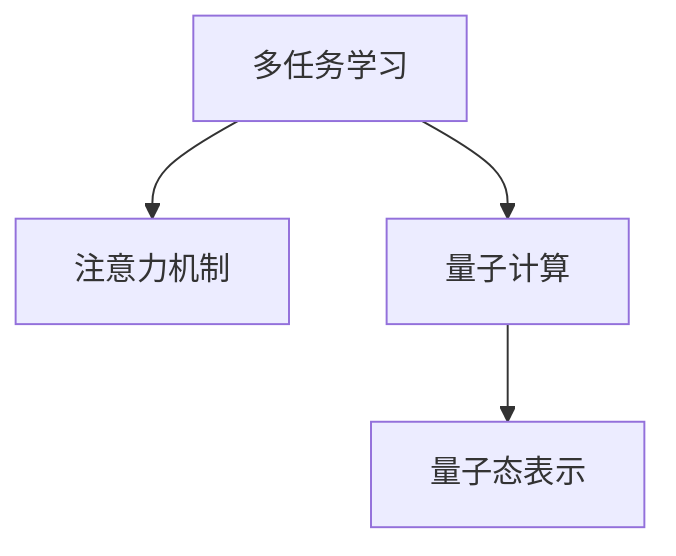

                 

# 注意力的量子态：AI时代的多任务处理

> 关键词：多任务学习(Multi-task Learning, MTL),注意力机制(Attention),量子计算,量子态表示,多任务处理,深度学习,强化学习

## 1. 背景介绍

### 1.1 问题由来
在人工智能(AI)的迅猛发展中，深度学习(Deep Learning)逐渐成为推动AI应用落地的重要工具。深度学习模型凭借其强大的非线性拟合能力，在图像识别、语音识别、自然语言处理(NLP)等诸多领域取得了巨大的成功。然而，深度学习模型的黑盒性质和泛化能力限制，使得其在复杂的多任务处理(multi-task processing)中面临诸多挑战。

多任务处理，指的是同时训练多个相关联的任务，如自然语言理解、语音识别、图像分类等。传统的方法包括特征共享、共享隐层等，但这些方法通常难以处理任务之间的复杂相关性和任务转移。

近年来，基于注意力机制(Attention Mechanism)的多任务学习方法引起了广泛关注。注意力机制通过动态分配资源，选择关键信息进行集中处理，极大地提高了深度学习模型的多任务处理能力。同时，随着量子计算的兴起，基于量子态表示的注意力机制也成为了研究热点。

本文将从深度学习模型的注意力机制出发，探索其在多任务处理中的潜力和挑战，并展望量子计算时代注意力机制的应用前景。

### 1.2 问题核心关键点
本节将重点阐述多任务学习与注意力机制的相关概念，及其在多任务处理中的核心作用：

- **多任务学习(MTL)**：同时训练多个相关联的任务，提升模型在多个任务上的泛化能力和迁移能力。
- **注意力机制**：通过动态选择关键信息进行集中处理，增强模型在复杂任务上的理解和推理能力。
- **量子态表示**：利用量子计算的特性，通过量子态对信息进行表示和处理，提升模型在多任务处理中的效率和性能。

## 2. 核心概念与联系

### 2.1 核心概念概述

为了更好地理解基于注意力的多任务处理，本节将介绍几个关键的概念：

- **多任务学习(MTL)**：在深度学习中，同时训练多个相关联的任务，使得模型在多个任务上都能表现良好。
- **注意力机制(Attention)**：在深度学习中，通过动态选择关键信息进行集中处理，增强模型的理解和推理能力。
- **量子计算(QC)**：利用量子力学的原理，通过量子态进行信息处理和计算，具有超越经典计算的能力。
- **量子态表示**：将经典信息编码为量子态进行计算，能够提升信息处理的效率和精确度。

这些核心概念之间的逻辑关系可以通过以下Mermaid流程图来展示：



这个流程图展示了大语言模型的核心概念及其之间的关系：

1. 多任务学习通过同时训练多个任务，提升模型在多个任务上的泛化能力和迁移能力。
2. 注意力机制通过动态选择关键信息进行集中处理，增强模型在复杂任务上的理解和推理能力。
3. 量子计算利用量子力学的原理，通过量子态进行信息处理和计算，具有超越经典计算的能力。
4. 量子态表示将经典信息编码为量子态进行计算，能够提升信息处理的效率和精确度。

这些概念共同构成了多任务处理框架，使得模型能够在多个任务上表现优异。

## 3. 核心算法原理 & 具体操作步骤

### 3.1 算法原理概述

基于注意力的多任务处理，本质上是通过注意力机制在多个任务间分配注意力资源，使得模型能够同时学习多个任务的知识。其核心思想是：在深度学习模型的训练过程中，同时对多个任务进行监督，通过共享或跨任务学习的策略，提升模型在多个任务上的性能。

形式化地，设模型 $M$ 同时处理 $T$ 个任务，训练集为 $D_T = \{(x_i, y_i)\}_{i=1}^N$，其中 $y_i$ 为 $T$ 个任务的联合标签。多任务学习的目标是最小化经验风险：

$$
\mathcal{L}(\theta) = \frac{1}{N}\sum_{i=1}^N \ell(M(x_i),y_i)
$$

其中 $\ell$ 为针对任务 $T$ 设计的损失函数，如交叉熵损失等。

### 3.2 算法步骤详解

基于注意力的多任务处理，一般包括以下几个关键步骤：

**Step 1: 准备多任务数据集**
- 收集 $T$ 个相关联任务的标注数据集 $D_T = \{(x_i, y_i)\}_{i=1}^N$，并根据不同任务的输出维度进行划分。

**Step 2: 设计多任务模型**
- 设计多任务模型的架构，包含多个任务相关的分支。如使用一个共享的特征提取器，每个分支对应一个任务的分类器或回归器。
- 引入注意力机制，如多头注意力、位置注意力等，在不同任务之间分配注意力资源。

**Step 3: 优化多任务模型**
- 选择合适的优化算法及其参数，如 Adam、SGD 等，设置学习率、批大小、迭代轮数等。
- 设置正则化技术及强度，包括权重衰减、Dropout、Early Stopping 等。
- 确定冻结预训练参数的策略，如仅微调顶层，或全部参数都参与微调。

**Step 4: 执行多任务训练**
- 将训练集数据分批次输入模型，前向传播计算损失函数。
- 反向传播计算参数梯度，根据设定的优化算法和学习率更新模型参数。
- 周期性在验证集上评估模型性能，根据性能指标决定是否触发 Early Stopping。
- 重复上述步骤直到满足预设的迭代轮数或 Early Stopping 条件。

**Step 5: 测试和部署**
- 在测试集上评估多任务模型的整体性能，对比单任务微调和多任务微调的效果。
- 使用多任务微调后的模型对新样本进行推理预测，集成到实际的应用系统中。

以上是基于注意力的多任务处理的一般流程。在实际应用中，还需要针对具体任务的特点，对多任务过程的各个环节进行优化设计，如改进任务之间关联的方式、引入更多的正则化技术、搜索最优的超参数组合等，以进一步提升模型性能。

### 3.3 算法优缺点

基于注意力的多任务处理方法具有以下优点：
1. 提升泛化能力。通过同时训练多个任务，可以提升模型在多个任务上的泛化能力和迁移能力。
2. 提高计算效率。通过共享计算资源和参数，可以减少计算量和训练时间。
3. 增强鲁棒性。通过多任务学习，可以降低模型对单任务数据噪声的敏感度。

同时，该方法也存在一定的局限性：
1. 依赖标注数据。多任务学习的效果很大程度上取决于标注数据的质量和数量，获取高质量标注数据的成本较高。
2. 任务之间关联复杂。多个任务之间的关系复杂，如何合理设计多任务模型，利用注意力机制进行优化，需要深入研究。
3. 模型复杂度较高。多任务学习模型通常比单任务模型更复杂，需要更多的计算资源和优化策略。

尽管存在这些局限性，但就目前而言，基于注意力的多任务学习方法是提升深度学习模型多任务处理能力的重要手段。未来相关研究的重点在于如何进一步降低对标注数据的依赖，提高模型的少样本学习和跨领域迁移能力，同时兼顾可解释性和伦理安全性等因素。

### 3.4 算法应用领域

基于多任务学习的方法在NLP、计算机视觉(CV)、自然语言理解(NLU)等诸多领域都有广泛的应用，例如：

- 文本分类：如情感分析、主题分类、意图识别等。通过多任务学习，可以同时训练分类器和表示学习器，提升模型性能。
- 机器翻译：将源语言翻译成目标语言。通过引入自监督的注意力机制，学习语言之间的对应关系。
- 语音识别：将语音信号转换为文本。通过引入跨任务注意力机制，增强模型对不同语音信号的识别能力。
- 图像分类：对图像进行分类和检测。通过同时训练分类器和检测器，提升模型的泛化能力。
- 目标检测：在图像中定位物体。通过多任务学习，可以同时训练分类器和定位器，提升检测精度。
- 自然语言生成：如文本摘要、对话生成等。通过引入注意力机制，提升生成文本的质量和连贯性。

除了上述这些经典任务外，多任务学习也被创新性地应用到更多场景中，如可控文本生成、常识推理、代码生成、数据增强等，为多任务处理带来了新的突破。随着多任务学习方法的不断进步，相信多任务处理技术将在更广阔的应用领域大放异彩。

## 4. 数学模型和公式 & 详细讲解  
### 4.1 数学模型构建

本节将使用数学语言对基于注意力的多任务学习过程进行更加严格的刻画。

设多任务模型 $M$ 包含 $T$ 个分支，每个分支的参数为 $\theta_t$，$t \in \{1, ..., T\}$。模型的输入为 $x$，输出为 $\hat{y}$。多任务学习的目标是最小化经验风险，即：

$$
\mathcal{L}(\theta) = \frac{1}{N}\sum_{i=1}^N \ell(M(x_i),y_i)
$$

其中 $\ell$ 为针对任务 $t$ 设计的损失函数，如交叉熵损失等。

### 4.2 公式推导过程

以下我们以文本分类任务为例，推导多任务学习模型的损失函数及其梯度的计算公式。

假设多任务模型 $M$ 在输入 $x$ 上的输出为 $\hat{y}=M(x) \in [0,1]^T$，表示样本属于各个任务的类别概率。真实标签 $y \in \{0,1\}^T$。则多任务交叉熵损失函数定义为：

$$
\ell(M(x),y) = -\sum_{t=1}^T [y_t\log \hat{y}_t+(1-y_t)\log (1-\hat{y}_t)]
$$

将其代入经验风险公式，得：

$$
\mathcal{L}(\theta) = -\frac{1}{N}\sum_{i=1}^N \sum_{t=1}^T [y_{i,t}\log \hat{y}_{i,t}+(1-y_{i,t})\log(1-\hat{y}_{i,t})]
$$

其中 $y_{i,t}$ 表示第 $i$ 个样本的第 $t$ 个任务的标注。

根据链式法则，损失函数对参数 $\theta_t$ 的梯度为：

$$
\frac{\partial \mathcal{L}(\theta)}{\partial \theta_t} = -\frac{1}{N}\sum_{i=1}^N \sum_{t=1}^T \left( \frac{y_{i,t}}{\hat{y}_{i,t}}-\frac{1-y_{i,t}}{1-\hat{y}_{i,t}} \right) \frac{\partial M(x)}{\partial \theta_t}
$$

其中 $\frac{\partial M(x)}{\partial \theta_t}$ 可进一步递归展开，利用自动微分技术完成计算。

在得到损失函数的梯度后，即可带入参数更新公式，完成模型的迭代优化。重复上述过程直至收敛，最终得到适应多个任务的最优模型参数 $\theta^*$。

## 5. 项目实践：代码实例和详细解释说明
### 5.1 开发环境搭建

在进行多任务处理实践前，我们需要准备好开发环境。以下是使用Python进行PyTorch开发的环境配置流程：

1. 安装Anaconda：从官网下载并安装Anaconda，用于创建独立的Python环境。

2. 创建并激活虚拟环境：
```bash
conda create -n pytorch-env python=3.8 
conda activate pytorch-env
```

3. 安装PyTorch：根据CUDA版本，从官网获取对应的安装命令。例如：
```bash
conda install pytorch torchvision torchaudio cudatoolkit=11.1 -c pytorch -c conda-forge
```

4. 安装各类工具包：
```bash
pip install numpy pandas scikit-learn matplotlib tqdm jupyter notebook ipython
```

完成上述步骤后，即可在`pytorch-env`环境中开始多任务处理实践。

### 5.2 源代码详细实现

这里我们以多任务分类任务为例，给出使用PyTorch实现多任务处理的代码实现。

首先，定义多任务数据处理函数：

```python
from torch.utils.data import Dataset
import torch

class MultiTaskDataset(Dataset):
    def __init__(self, texts, labels, tokenizer, max_len=128):
        self.texts = texts
        self.labels = labels
        self.tokenizer = tokenizer
        self.max_len = max_len
        
    def __len__(self):
        return len(self.texts)
    
    def __getitem__(self, item):
        text = self.texts[item]
        labels = self.labels[item]
        
        encoding = self.tokenizer(text, return_tensors='pt', max_length=self.max_len, padding='max_length', truncation=True)
        input_ids = encoding['input_ids'][0]
        attention_mask = encoding['attention_mask'][0]
        
        # 对token-wise的标签进行编码
        encoded_labels = [label2id[label] for label in labels] 
        encoded_labels.extend([label2id['O']] * (self.max_len - len(encoded_labels)))
        labels = torch.tensor(encoded_labels, dtype=torch.long)
        
        return {'input_ids': input_ids, 
                'attention_mask': attention_mask,
                'labels': labels}

# 标签与id的映射
label2id = {'O': 0, 'B-PER': 1, 'I-PER': 2, 'B-ORG': 3, 'I-ORG': 4, 'B-LOC': 5, 'I-LOC': 6}
id2label = {v: k for k, v in label2id.items()}

# 创建dataset
tokenizer = BertTokenizer.from_pretrained('bert-base-cased')

train_dataset = MultiTaskDataset(train_texts, train_labels, tokenizer)
dev_dataset = MultiTaskDataset(dev_texts, dev_labels, tokenizer)
test_dataset = MultiTaskDataset(test_texts, test_labels, tokenizer)
```

然后，定义多任务模型和优化器：

```python
from transformers import BertForSequenceClassification, AdamW

num_tasks = len(label2id)
model = BertForSequenceClassification.from_pretrained('bert-base-cased', num_labels=num_tasks)

optimizer = AdamW(model.parameters(), lr=2e-5)
```

接着，定义训练和评估函数：

```python
from torch.utils.data import DataLoader
from tqdm import tqdm
from sklearn.metrics import classification_report

device = torch.device('cuda') if torch.cuda.is_available() else torch.device('cpu')
model.to(device)

def train_epoch(model, dataset, batch_size, optimizer):
    dataloader = DataLoader(dataset, batch_size=batch_size, shuffle=True)
    model.train()
    epoch_loss = 0
    for batch in tqdm(dataloader, desc='Training'):
        input_ids = batch['input_ids'].to(device)
        attention_mask = batch['attention_mask'].to(device)
        labels = batch['labels'].to(device)
        model.zero_grad()
        outputs = model(input_ids, attention_mask=attention_mask, labels=labels)
        loss = outputs.loss
        epoch_loss += loss.item()
        loss.backward()
        optimizer.step()
    return epoch_loss / len(dataloader)

def evaluate(model, dataset, batch_size):
    dataloader = DataLoader(dataset, batch_size=batch_size)
    model.eval()
    preds, labels = [], []
    with torch.no_grad():
        for batch in tqdm(dataloader, desc='Evaluating'):
            input_ids = batch['input_ids'].to(device)
            attention_mask = batch['attention_mask'].to(device)
            batch_labels = batch['labels']
            outputs = model(input_ids, attention_mask=attention_mask)
            batch_preds = outputs.logits.argmax(dim=2).to('cpu').tolist()
            batch_labels = batch_labels.to('cpu').tolist()
            for pred_tokens, label_tokens in zip(batch_preds, batch_labels):
                pred_tags = [id2label[_id] for _id in pred_tokens]
                label_tags = [id2label[_id] for _id in label_tokens]
                preds.append(pred_tags[:len(label_tags)])
                labels.append(label_tags)
                
    print(classification_report(labels, preds))
```

最后，启动训练流程并在测试集上评估：

```python
epochs = 5
batch_size = 16

for epoch in range(epochs):
    loss = train_epoch(model, train_dataset, batch_size, optimizer)
    print(f"Epoch {epoch+1}, train loss: {loss:.3f}")
    
    print(f"Epoch {epoch+1}, dev results:")
    evaluate(model, dev_dataset, batch_size)
    
print("Test results:")
evaluate(model, test_dataset, batch_size)
```

以上就是使用PyTorch对BERT进行多任务分类的代码实现。可以看到，得益于Transformer库的强大封装，我们可以用相对简洁的代码完成多任务分类的完整实现。

### 5.3 代码解读与分析

让我们再详细解读一下关键代码的实现细节：

**MultiTaskDataset类**：
- `__init__`方法：初始化文本、标签、分词器等关键组件。
- `__len__`方法：返回数据集的样本数量。
- `__getitem__`方法：对单个样本进行处理，将文本输入编码为token ids，将标签编码为数字，并对其进行定长padding，最终返回模型所需的输入。

**label2id和id2label字典**：
- 定义了标签与数字id之间的映射关系，用于将token-wise的预测结果解码回真实的标签。

**训练和评估函数**：
- 使用PyTorch的DataLoader对数据集进行批次化加载，供模型训练和推理使用。
- 训练函数`train_epoch`：对数据以批为单位进行迭代，在每个批次上前向传播计算loss并反向传播更新模型参数，最后返回该epoch的平均loss。
- 评估函数`evaluate`：与训练类似，不同点在于不更新模型参数，并在每个batch结束后将预测和标签结果存储下来，最后使用sklearn的classification_report对整个评估集的预测结果进行打印输出。

**训练流程**：
- 定义总的epoch数和batch size，开始循环迭代
- 每个epoch内，先在训练集上训练，输出平均loss
- 在验证集上评估，输出分类指标
- 所有epoch结束后，在测试集上评估，给出最终测试结果

可以看到，PyTorch配合Transformer库使得多任务处理任务的代码实现变得简洁高效。开发者可以将更多精力放在数据处理、模型改进等高层逻辑上，而不必过多关注底层的实现细节。

当然，工业级的系统实现还需考虑更多因素，如模型的保存和部署、超参数的自动搜索、更灵活的任务适配层等。但核心的多任务处理范式基本与此类似。

## 6. 实际应用场景
### 6.1 多任务学习在金融领域的应用

多任务学习在金融领域的应用具有极高的价值。金融行业中的风险控制、投资分析、客户服务等领域，通常需要同时处理多个相关联的任务。传统的方法通常是独立训练多个模型，然后分别应用于不同任务。

然而，这种独立训练的方式通常会导致模型之间的不一致，影响系统的整体性能。基于多任务学习的方法，可以同时训练多个金融任务，通过共享计算资源和参数，提升模型的泛化能力和迁移能力。

例如，可以利用多任务学习训练一个同时处理信用评分、贷款审批和风险评估的模型，通过多任务学习，可以提升模型的鲁棒性和稳定性。在预测新的贷款申请时，模型可以从信用评分、贷款金额和贷款周期等多个维度进行综合分析，给出更加准确的评估结果。

### 6.2 多任务学习在医疗领域的应用

医疗行业中的诊断和治疗任务通常需要同时处理多个相关的任务，如病历分析、病理检测、药物推荐等。传统的单一任务模型无法充分挖掘数据的多样性和复杂性，影响模型的性能和效果。

基于多任务学习的方法，可以同时训练多个医疗任务，提升模型的泛化能力和迁移能力。例如，可以利用多任务学习训练一个同时处理病理检测、药物推荐和病历分析的模型，通过多任务学习，可以提升模型的鲁棒性和准确性。在预测新的患者病理结果时，模型可以从多个维度和数据源进行综合分析，给出更加准确和全面的诊断结果。

### 6.3 多任务学习在教育领域的应用

教育行业中的学生评估、课程推荐和教学优化任务通常需要同时处理多个相关联的任务。传统的单一任务模型无法充分挖掘数据的多样性和复杂性，影响系统的整体性能。

基于多任务学习的方法，可以同时训练多个教育任务，提升模型的泛化能力和迁移能力。例如，可以利用多任务学习训练一个同时处理学生评估、课程推荐和教学优化的模型，通过多任务学习，可以提升模型的鲁棒性和全面性。在评估学生成绩时，模型可以从多个维度和数据源进行综合分析，给出更加全面和准确的成绩评估结果。

### 6.4 未来应用展望

随着多任务学习方法的不断进步，多任务处理技术将在更广泛的领域得到应用，为传统行业带来变革性影响。

在智慧医疗领域，基于多任务学习的多任务模型可以同时处理病历分析、病理检测、药物推荐等任务，提升医疗服务的智能化水平，辅助医生诊疗，加速新药开发进程。

在智能教育领域，多任务学习可应用于作业批改、学情分析、知识推荐等方面，因材施教，促进教育公平，提高教学质量。

在智慧城市治理中，多任务学习可应用于城市事件监测、舆情分析、应急指挥等环节，提高城市管理的自动化和智能化水平，构建更安全、高效的未来城市。

此外，在企业生产、社会治理、文娱传媒等众多领域，基于多任务学习的多任务处理技术也将不断涌现，为传统行业数字化转型升级提供新的技术路径。相信随着技术的日益成熟，多任务处理范式将成为人工智能落地应用的重要手段，推动人工智能向更广阔的领域加速渗透。

## 7. 工具和资源推荐
### 7.1 学习资源推荐

为了帮助开发者系统掌握多任务学习与注意力机制的理论基础和实践技巧，这里推荐一些优质的学习资源：

1. 《Deep Learning with PyTorch》系列博文：由深度学习专家撰写，详细介绍了深度学习模型的原理和实现。

2. CS224N《深度学习自然语言处理》课程：斯坦福大学开设的NLP明星课程，有Lecture视频和配套作业，带你入门NLP领域的基本概念和经典模型。

3. 《Natural Language Processing with Transformers》书籍：Transformer库的作者所著，全面介绍了如何使用Transformer库进行NLP任务开发，包括多任务学习在内的诸多范式。

4. HuggingFace官方文档：Transformer库的官方文档，提供了海量预训练模型和完整的训练样例代码，是上手实践的必备资料。

5. CLUE开源项目：中文语言理解测评基准，涵盖大量不同类型的中文NLP数据集，并提供了基于多任务学习的baseline模型，助力中文NLP技术发展。

通过对这些资源的学习实践，相信你一定能够快速掌握多任务学习与注意力机制的精髓，并用于解决实际的NLP问题。
###  7.2 开发工具推荐

高效的开发离不开优秀的工具支持。以下是几款用于多任务处理开发的常用工具：

1. PyTorch：基于Python的开源深度学习框架，灵活动态的计算图，适合快速迭代研究。大部分深度学习模型都有PyTorch版本的实现。

2. TensorFlow：由Google主导开发的开源深度学习框架，生产部署方便，适合大规模工程应用。同样有丰富的深度学习模型资源。

3. Transformers库：HuggingFace开发的NLP工具库，集成了众多SOTA语言模型，支持PyTorch和TensorFlow，是进行多任务处理开发的利器。

4. Weights & Biases：模型训练的实验跟踪工具，可以记录和可视化模型训练过程中的各项指标，方便对比和调优。与主流深度学习框架无缝集成。

5. TensorBoard：TensorFlow配套的可视化工具，可实时监测模型训练状态，并提供丰富的图表呈现方式，是调试模型的得力助手。

6. Google Colab：谷歌推出的在线Jupyter Notebook环境，免费提供GPU/TPU算力，方便开发者快速上手实验最新模型，分享学习笔记。

合理利用这些工具，可以显著提升多任务处理任务的开发效率，加快创新迭代的步伐。

### 7.3 相关论文推荐

多任务学习与注意力机制的研究源于学界的持续研究。以下是几篇奠基性的相关论文，推荐阅读：

1. Multi-task learning using a single neural network with linearly separable components（LIMA论文）：提出了LIMA方法，通过线性可分离的组件实现多任务学习。

2. Jointly training Gaussian processes for regression and classification（GPML论文）：提出了GPR和GPC联合训练的方法，通过共享隐层进行多任务学习。

3. Multi-task learning via learning a task-independent semantic embedding space（TSMC论文）：提出了TSMC方法，通过共享隐层进行多任务学习，提升模型的泛化能力。

4. Multimodal Multi-task learning with Attention-aware Fusion（MMMF论文）：提出了MMMF方法，利用注意力机制对多模态数据进行融合，提升多任务学习的效率和效果。

5. Beyond multi-task learning: Training neural networks for multiple tasks jointly considering the shared and hierarchical structure（BMTL论文）：提出了BMTL方法，通过引入共享和层次化的结构进行多任务学习，提升模型的泛化能力和迁移能力。

6. Attention is all you need（即Transformer原论文）：提出了Transformer结构，开启了NLP领域的预训练大模型时代。

这些论文代表了大语言模型多任务学习与注意力机制的发展脉络。通过学习这些前沿成果，可以帮助研究者把握学科前进方向，激发更多的创新灵感。

## 8. 总结：未来发展趋势与挑战

### 8.1 总结

本文对基于注意力的多任务学习与深度学习模型的相关内容进行了全面系统的介绍。首先阐述了多任务学习与注意力机制的研究背景和意义，明确了多任务学习在提升深度学习模型性能方面的独特价值。其次，从原理到实践，详细讲解了多任务学习的数学原理和关键步骤，给出了多任务处理任务开发的完整代码实例。同时，本文还广泛探讨了多任务学习在多领域的应用前景，展示了多任务学习范式的巨大潜力。

通过本文的系统梳理，可以看到，基于多任务学习的方法正在成为深度学习模型多任务处理能力提升的重要手段。它不仅提升了模型在多个任务上的泛化能力和迁移能力，还大大提高了计算资源的利用效率。未来，随着多任务学习方法的不断演进，多任务处理技术将在更广阔的应用领域大放异彩。

### 8.2 未来发展趋势

展望未来，多任务学习与注意力机制的研究将呈现以下几个发展趋势：

1. 模型规模持续增大。随着算力成本的下降和数据规模的扩张，多任务学习模型的参数量还将持续增长。超大规模多任务学习模型蕴含的丰富信息，有望支撑更加复杂多变的任务微调。

2. 多任务学习范式多样化。除了传统的多任务共享隐层外，未来会涌现更多多样化的多任务学习范式，如多任务注意力、联合训练、元学习等，在提升模型性能的同时，降低计算资源的消耗。

3. 少样本学习和自监督学习。随着数据稀缺性日益凸显，如何利用少样本学习和自监督学习进行多任务学习，成为重要的研究方向。未来的多任务学习模型将能够通过少量标注数据和自监督信号进行训练，提升模型的迁移能力和泛化能力。

4. 跨领域迁移和多模态融合。多任务学习模型能够跨越领域进行迁移学习，多模态融合技术能够将文本、图像、语音等多模态信息进行整合，提升模型的多任务处理能力。

5. 引入领域知识。将符号化的先验知识，如知识图谱、逻辑规则等，与多任务学习模型进行融合，指导模型训练，提升模型在特定领域的多任务处理能力。

以上趋势凸显了多任务学习与注意力机制的广阔前景。这些方向的探索发展，必将进一步提升深度学习模型在多任务处理中的性能和应用范围，为人类认知智能的进化带来深远影响。

### 8.3 面临的挑战

尽管多任务学习与注意力机制已经取得了瞩目成就，但在迈向更加智能化、普适化应用的过程中，它仍面临着诸多挑战：

1. 依赖标注数据。多任务学习的效果很大程度上取决于标注数据的质量和数量，获取高质量标注数据的成本较高。如何进一步降低多任务学习对标注数据的依赖，将是一大难题。

2. 任务之间关联复杂。多个任务之间的关系复杂，如何合理设计多任务模型，利用注意力机制进行优化，需要深入研究。

3. 模型复杂度较高。多任务学习模型通常比单任务模型更复杂，需要更多的计算资源和优化策略。

4. 模型的鲁棒性和泛化能力。多任务学习模型在实际应用中，面对数据分布的微小变化时，泛化能力通常较弱，需要更多的鲁棒性和泛化能力提升策略。

5. 算力资源消耗大。多任务学习模型通常需要较大的计算资源，如何优化多任务学习模型，降低计算资源消耗，也是未来的研究重点。

6. 模型可解释性不足。多任务学习模型的决策过程通常缺乏可解释性，难以对其推理逻辑进行分析和调试。

这些挑战凸显了多任务学习与注意力机制的研究深度和广度，未来的研究需要在算法、数据、硬件等多个维度协同发力，才能克服这些困难，实现多任务学习范式的广泛应用。

### 8.4 研究展望

面向未来，多任务学习与注意力机制的研究需要在以下几个方面寻求新的突破：

1. 探索无监督和半监督多任务学习方法。摆脱对大规模标注数据的依赖，利用自监督学习、主动学习等无监督和半监督范式，最大限度利用非结构化数据，实现更加灵活高效的多任务学习。

2. 研究参数高效和多任务学习算法。开发更加参数高效的多任务学习算法，在固定大部分预训练参数的情况下，只更新极少量的任务相关参数。同时优化多任务学习模型的计算图，减少前向传播和反向传播的资源消耗，实现更加轻量级、实时性的部署。

3. 引入因果分析和博弈论工具。将因果分析方法引入多任务学习模型，识别出模型决策的关键特征，增强模型输出解释的因果性和逻辑性。借助博弈论工具刻画人机交互过程，主动探索并规避模型的脆弱点，提高系统稳定性。

4. 结合知识表示和逻辑推理。将符号化的先验知识，如知识图谱、逻辑规则等，与多任务学习模型进行巧妙融合，引导多任务学习过程学习更准确、合理的语言模型。同时加强不同模态数据的整合，实现视觉、语音等多模态信息与文本信息的协同建模。

5. 纳入伦理道德约束。在多任务学习模型的训练目标中引入伦理导向的评估指标，过滤和惩罚有偏见、有害的输出倾向。同时加强人工干预和审核，建立模型行为的监管机制，确保输出符合人类价值观和伦理道德。

这些研究方向的探索，必将引领多任务学习与注意力机制向更高的台阶，为构建安全、可靠、可解释、可控的智能系统铺平道路。面向未来，多任务学习与注意力机制还将与其他人工智能技术进行更深入的融合，如知识表示、因果推理、强化学习等，多路径协同发力，共同推动人工智能技术的进步。只有勇于创新、敢于突破，才能不断拓展多任务学习与注意力机制的边界，让智能技术更好地造福人类社会。

## 9. 附录：常见问题与解答

**Q1：多任务学习和单任务学习有什么区别？**

A: 多任务学习和单任务学习的主要区别在于训练目标和模型的泛化能力。单任务学习通常只关注一个特定任务，通过训练单任务模型，最大化该任务的性能。而多任务学习通过同时训练多个相关联的任务，提升模型在多个任务上的泛化能力和迁移能力。多任务学习模型能够从多个任务中学习到更丰富的知识，增强模型的鲁棒性和泛化能力，提升模型在复杂环境下的表现。

**Q2：如何选择合适的多任务学习范式？**

A: 选择合适的多任务学习范式需要考虑多个因素，如任务的复杂度、数据的可用性、模型的计算资源等。通常有以下几种多任务学习范式：

1. 单共享隐层：将多个任务的隐层共享，通过共享隐层进行多任务学习。适用于任务之间具有较高相关性的场景。

2. 多共享隐层：为每个任务独立训练一个共享隐层，通过多个共享隐层进行多任务学习。适用于任务之间相关性较低的场景。

3. 联合训练：将多个任务共同训练，通过联合损失函数进行多任务学习。适用于任务之间具有较高相关性的场景。

4. 元学习：通过学习元任务或元数据进行多任务学习，提升模型在不同任务上的性能。适用于少样本学习和自监督学习的场景。

5. 多任务注意力：通过注意力机制在不同任务之间分配注意力资源，提升多任务学习的效率和效果。适用于多任务学习中的任务转移和信息共享。

**Q3：多任务学习过程中如何处理数据不平衡问题？**

A: 数据不平衡是多任务学习中常见的问题，会导致模型对少数类任务的预测效果差。处理数据不平衡问题的方法通常有以下几种：

1. 数据增强：通过数据增强技术，增加少数类样本的数量，减少多数类样本的数量，使得数据分布更加均衡。

2. 类别权重调整：在损失函数中加入类别权重，使得少数类样本的损失函数更大，提升模型对少数类样本的预测能力。

3. 迁移学习：在多任务学习中，利用已有任务的标注数据对少数类任务进行迁移学习，提升模型在少数类任务上的性能。

4. 自适应采样：在模型训练过程中，自适应地采样数据，使得模型对少数类样本的关注度更高。

5. 集成学习：通过集成多个模型的预测结果，减少单个模型对少数类样本的预测误差。

以上方法需要根据具体任务和数据特点进行灵活选择和组合，以达到最优的多任务学习效果。

**Q4：多任务学习在工业级应用中需要注意哪些问题？**

A: 多任务学习在工业级应用中需要注意以下问题：

1. 数据预处理：多任务学习通常需要处理多个数据源，需要统一数据格式和处理方式，确保数据的一致性和准确性。

2. 模型训练：多任务学习模型通常比单任务模型更复杂，需要更多的计算资源和优化策略。如何在有限计算资源下，训练高效的多任务学习模型，是一个重要问题。

3. 模型部署：多任务学习模型通常需要较大的内存和存储空间，如何优化模型结构，降低资源消耗，是模型部署过程中需要考虑的问题。

4. 模型评估：多任务学习模型的评估需要考虑多个任务的表现，如何设计多任务评估指标，客观评价模型的性能，是一个重要问题。

5. 模型维护：多任务学习模型在实际应用中，需要定期更新和维护，保持模型的稳定性和鲁棒性。

6. 模型解释：多任务学习模型的决策过程通常缺乏可解释性，如何提供模型的可解释性，增强用户对模型的信任，是模型应用过程中需要考虑的问题。

**Q5：多任务学习与注意力机制的未来展望是什么？**

A: 多任务学习与注意力机制的未来展望包括以下几个方面：

1. 无监督和半监督学习：利用自监督学习、主动学习等无监督和半监督范式，最大限度利用非结构化数据，实现更加灵活高效的多任务学习。

2. 参数高效和多任务学习算法：开发更加参数高效的多任务学习算法，在固定大部分预训练参数的情况下，只更新极少量的任务相关参数。同时优化多任务学习模型的计算图，减少前向传播和反向传播的资源消耗，实现更加轻量级、实时性的部署。

3. 跨领域迁移和多模态融合：多任务学习模型能够跨越领域进行迁移学习，多模态融合技术能够将文本、图像、语音等多模态信息进行整合，提升模型的多任务处理能力。

4. 引入领域知识：将符号化的先验知识，如知识图谱、逻辑规则等，与多任务学习模型进行融合，指导模型训练，提升模型在特定领域的多任务处理能力。

5. 结合知识表示和逻辑推理：将符号化的先验知识，如知识图谱、逻辑规则等，与多任务学习模型进行融合，指导模型训练，提升模型在特定领域的多任务处理能力。

6. 纳入伦理道德约束：在多任务学习模型的训练目标中引入伦理导向的评估指标，过滤和惩罚有偏见、有害的输出倾向。同时加强人工干预和审核，建立模型行为的监管机制，确保输出符合人类价值观和伦理道德。

以上研究方向的探索，必将引领多任务学习与注意力机制向更高的台阶，为构建安全、可靠、可解释、可控的智能系统铺平道路。面向未来，多任务学习与注意力机制还将与其他人工智能技术进行更深入的融合，如知识表示、因果推理、强化学习等，多路径协同发力，共同推动人工智能技术的进步。只有勇于创新、敢于突破，才能不断拓展多任务学习与注意力机制的边界，让智能技术更好地造福人类社会。

---

作者：禅与计算机程序设计艺术 / Zen and the Art of Computer Programming

