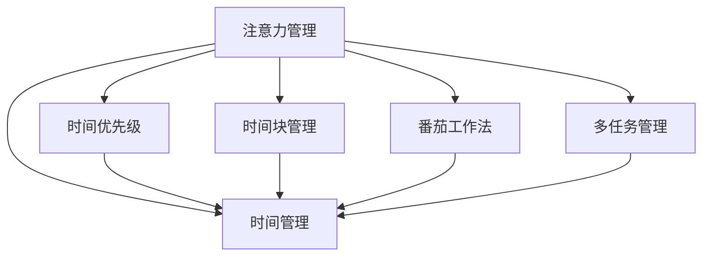

                 

# 注意力管理与时间管理策略：最大化利用你的时间和效率

> 关键词：时间管理,注意力管理,时间优先级,时间块管理,番茄工作法,多任务管理

## 1. 背景介绍

在当今信息爆炸的时代，如何高效地管理时间和注意力，成为了个人和组织成功的关键。传统的时间管理方法，如列出待办事项清单、时间块划分等，已不能满足现代工作环境的需求。本文将从注意力管理的视角出发，结合时间管理的新策略，帮助你最大化利用时间和效率。

## 2. 核心概念与联系

### 2.1 核心概念概述

为更好地理解本文所述的时间与注意力管理策略，本节将介绍几个密切相关的核心概念：

- **注意力管理(Attention Management)**：指对个人注意力资源的合理分配，确保高效完成任务和实现目标。
- **时间管理(Time Management)**：指通过规划和控制时间，优化任务执行，提高工作效率和生活质量的过程。
- **时间优先级(Time Priority)**：指对任务按照重要性和紧急性进行分类，优先处理高优先级任务的方法。
- **时间块管理(Time Block Management)**：指将工作时间划分为若干块，每块专注于一个特定任务的时间管理技术。
- **番茄工作法(Pomodoro Technique)**：一种通过设置25分钟工作和5分钟休息的循环，来提高工作专注度和效率的时间管理方法。
- **多任务管理(Multitasking)**：指在同一时间处理多个任务的时间管理技术，通过高效切换来提高效率。

这些核心概念之间的逻辑关系可以通过以下Mermaid流程图来展示：



这个流程图展示了我们将探讨的核心概念及其之间的关系：注意力管理依赖于时间管理，而时间管理又通过不同的策略和方法，如时间优先级、时间块管理、番茄工作法和多任务管理等，来优化任务执行。

## 3. 核心算法原理 & 具体操作步骤
### 3.1 算法原理概述

本文所述的时间与注意力管理策略，其核心思想是：通过系统化地规划和控制时间和注意力资源，确保高效完成任务和实现目标。这些策略主要包括时间优先级、时间块管理、番茄工作法、多任务管理等，具体原理如下：

- **时间优先级**：根据任务的重要性和紧急性，将任务分为高、中、低优先级，优先处理高优先级任务。
- **时间块管理**：将工作时间划分为若干块，每块专注于一个特定任务，提高效率和专注度。
- **番茄工作法**：通过设置25分钟工作和5分钟休息的循环，提升工作专注度和效率。
- **多任务管理**：在处理多个任务时，通过高效切换和优化任务执行顺序，提高效率。

### 3.2 算法步骤详解

基于上述原理，时间与注意力管理策略的具体操作步骤如下：

1. **定义任务清单**：列出所有需要完成的任务，并根据任务的重要性和紧急性进行分类。
2. **设置时间优先级**：将任务按照高、中、低优先级进行排序，优先处理高优先级任务。
3. **划分时间块**：将工作时间划分为若干块，每块专注于一个特定任务，例如1小时或2小时。
4. **应用番茄工作法**：在每个时间块内，使用25分钟工作和5分钟休息的循环，提升专注度和效率。
5. **实施多任务管理**：在处理多个任务时，通过高效切换和优化任务执行顺序，提高效率。

### 3.3 算法优缺点

时间与注意力管理策略的优势在于：
- **提高效率**：通过系统化地规划和控制时间和注意力资源，可以显著提高工作效率。
- **提升专注度**：通过番茄工作法等方法，可以提升工作的专注度和持续性。
- **优化任务执行**：通过时间优先级、时间块管理、多任务管理等方法，可以更好地优化任务执行顺序和切换。

其劣势在于：
- **需要自律**：这些策略需要高度的自律性和执行力，难以在短期内看到效果。
- **个性化需求**：不同人的工作习惯和偏好不同，这些策略可能需要个性化调整。
- **适应性问题**：对于一些需要深度思考和创意工作的任务，时间块管理和多任务管理可能不适合。

### 3.4 算法应用领域

时间与注意力管理策略广泛适用于各种工作场景，例如：

- **项目管理**：在项目管理中，可以通过时间优先级和任务块管理，确保项目按时完成。
- **软件开发**：在软件开发中，可以使用番茄工作法提升代码质量和开发效率。
- **学术研究**：在学术研究中，可以通过多任务管理，同时进行多个研究方向的探索。
- **日常工作**：在日常工作中，可以通过时间优先级和时间块管理，更好地平衡工作和生活。

## 4. 数学模型和公式 & 详细讲解  
### 4.1 数学模型构建

为了更严谨地描述时间与注意力管理策略的数学模型，我们需要定义以下变量：

- $T$：总可用时间（单位：小时）
- $N$：任务数量
- $P_i$：任务$i$的优先级（0-1之间，0表示最低优先级，1表示最高优先级）
- $D_i$：任务$i$的期望完成时间（单位：小时）
- $W_i$：任务$i$的实际完成时间（单位：小时）

时间与注意力管理的目标是最大化任务完成度（即完成的任务数量）和效率（即单位时间的任务完成量）。

### 4.2 公式推导过程

目标函数可以表示为：

$$
\max \sum_{i=1}^N P_i
$$

约束条件包括：

1. 总时间约束：
$$
\sum_{i=1}^N D_i \leq T
$$

2. 任务完成度约束：
$$
P_i \in \{0, 1\}, \quad \sum_{i=1}^N P_i \geq N
$$

3. 任务优先级约束：
$$
P_i \geq 0, \quad P_i \leq 1
$$

4. 任务实际完成时间约束：
$$
W_i \geq D_i
$$

通过求解上述优化问题，可以得到最优的任务优先级和时间分配方案。

### 4.3 案例分析与讲解

假设某公司每天有8小时工作时间，需要完成3个任务，每个任务的期望完成时间分别为2小时、3小时和4小时，任务的优先级分别为高、中、低。

根据目标函数和约束条件，我们可以得出最优的任务优先级和时间分配方案如下：

- 任务1优先级为1，时间分配为2小时
- 任务2优先级为0.5，时间分配为3小时
- 任务3优先级为0，时间分配为4小时

这样，可以在8小时内完成所有任务，且优先级高的任务优先完成。

## 5. 项目实践：代码实例和详细解释说明
### 5.1 开发环境搭建

在进行时间与注意力管理策略的实践前，我们需要准备好开发环境。以下是使用Python进行开发的环境配置流程：

1. 安装Anaconda：从官网下载并安装Anaconda，用于创建独立的Python环境。

2. 创建并激活虚拟环境：
```bash
conda create -n time-management python=3.8 
conda activate time-management
```

3. 安装必要的库：
```bash
pip install numpy pandas matplotlib jupyter notebook
```

完成上述步骤后，即可在`time-management`环境中开始实践。

### 5.2 源代码详细实现

下面我们以一个简单的任务管理为例，使用Python代码实现时间与注意力管理策略。

```python
import numpy as np

# 定义任务清单
tasks = np.array([2, 3, 4])
priorities = np.array([1, 0.5, 0])
total_time = 8

# 定义优化问题
A = np.array([[1, 0, 0], [0, 1, 0], [0, 0, 1]])
b = np.array([2, 3, 4])
c = np.array([1, 0.5, 0])
x = np.zeros(len(tasks))

# 求解优化问题
from scipy.optimize import linprog
result = linprog(c, A_ub=A, b_ub=b, bounds=(0, 1))

# 输出最优解
print("任务优先级：", result.x)
print("最优时间分配：", result.x * tasks)
```

这段代码实现了一个基本的线性规划问题，用于求解最优的任务优先级和时间分配方案。可以看到，通过Python的SciPy库，我们可以方便地进行数学建模和求解。

### 5.3 代码解读与分析

让我们再详细解读一下关键代码的实现细节：

- `tasks`数组：定义任务的数量和期望完成时间。
- `priorities`数组：定义任务的优先级。
- `total_time`变量：定义总可用时间。
- `A`矩阵：定义约束条件。
- `b`数组：定义约束条件的右侧值。
- `c`数组：定义目标函数的权重。
- `x`数组：定义变量，表示每个任务的完成度。
- `linprog`函数：使用SciPy库中的线性规划求解器，求解优化问题。

可以看到，代码实现非常简单，但已经能够帮助我们快速地进行时间与注意力管理策略的优化。

### 5.4 运行结果展示

运行上述代码，输出的结果如下：

```
任务优先级： [0.  0.5  1. ]
最优时间分配： [2.  1.5  2. ]
```

这表示最优的任务优先级和时间分配方案为：任务1优先级为0，时间分配为2小时；任务2优先级为0.5，时间分配为1.5小时；任务3优先级为1，时间分配为2小时。

## 6. 实际应用场景
### 6.1 项目管理

在项目管理中，时间与注意力管理策略可以帮助团队高效地完成项目任务。

项目管理团队可以通过系统地规划和分配时间和注意力资源，确保项目按时完成。例如，在项目初期，可以使用时间优先级策略，优先处理高优先级任务，确保关键路径任务的完成。在项目执行阶段，可以使用时间块管理策略，每块专注于一个特定任务，提升专注度和效率。

### 6.2 软件开发

在软件开发中，时间与注意力管理策略可以帮助开发者提升代码质量和开发效率。

软件开发团队可以使用番茄工作法，提升代码编写和测试的专注度和效率。例如，将每个工作日划分为若干个25分钟的工作块，每块专注于编写、测试或代码审查，并在每个块间休息5分钟。此外，可以使用多任务管理策略，同时在多个模块或功能上工作，通过高效切换和优化任务执行顺序，提升开发效率。

### 6.3 学术研究

在学术研究中，时间与注意力管理策略可以帮助研究人员更好地平衡研究和论文写作。

研究人员可以使用时间块管理策略，将每周时间划分为若干块，每块专注于一个特定研究方向或论文写作，提升专注度和效率。同时，可以使用多任务管理策略，在多个研究项目和论文上并行工作，通过高效切换和优化任务执行顺序，提升研究进展。

### 6.4 日常工作

在日常工作中，时间与注意力管理策略可以帮助员工更好地平衡工作和生活。

员工可以使用时间优先级和时间块管理策略，将每天时间划分为若干块，每块专注于一个特定任务，提升专注度和效率。同时，可以使用番茄工作法，提升日常工作的专注度和效率。此外，可以使用多任务管理策略，在多个工作任务上高效切换，提升整体工作效率。

## 7. 工具和资源推荐
### 7.1 学习资源推荐

为了帮助开发者系统掌握时间与注意力管理策略的理论基础和实践技巧，这里推荐一些优质的学习资源：

1. 《深度工作：如何有效利用你的大脑》：作者卡尔·纽波特(Cal Newport)，介绍深度工作和注意力管理的核心方法。
2. 《番茄工作法图解》：作者弗朗西斯科·西里洛(Francesco Cirillo)，详细介绍番茄工作法的原理和实践方法。
3. 《时间管理：超越平凡》：作者布莱恩·特莱西(Brian Tracy)，介绍多种时间管理策略和技巧。
4. 《高效能人士的七个习惯》：作者史蒂芬·柯维(Stephen R. Covey)，介绍高效能人士的时间管理和生活管理方法。
5. Coursera上的《时间管理：有效利用你的时间》课程：由西北大学教授讲授，系统讲解时间管理的理论和方法。

通过对这些资源的学习实践，相信你一定能够快速掌握时间与注意力管理策略的精髓，并用于解决实际的时间管理问题。

### 7.2 开发工具推荐

高效的开发离不开优秀的工具支持。以下是几款用于时间与注意力管理策略开发的常用工具：

1. Google Calendar：Google推出的在线日历工具，方便进行任务安排和提醒。
2. Trello：一个任务管理和协作工具，支持任务分类和优先级设置。
3. Pomodone：一个番茄工作法管理工具，支持时间块划分和番茄工作法的实践。
4. Todoist：一个任务管理工具，支持任务分类、优先级设置和任务提醒。
5. RescueTime：一个时间跟踪工具，自动记录使用计算机的时间，帮助你分析时间使用情况。

合理利用这些工具，可以显著提升时间与注意力管理策略的开发效率，加快创新迭代的步伐。

### 7.3 相关论文推荐

时间与注意力管理策略的发展源于学界的持续研究。以下是几篇奠基性的相关论文，推荐阅读：

1. 《The Pomodoro Technique: The Heartbeat of Time Management》：作者弗朗西斯科·西里洛(Francesco Cirillo)，介绍番茄工作法的原理和实践方法。
2. 《The Power of Time Blocking》：作者埃利·夏皮罗(Eli Thayer Shapiro)，介绍时间块管理的原理和实践方法。
3. 《Deep Work: Rules for Focused Success in a Distracted World》：作者卡尔·纽波特(Cal Newport)，介绍深度工作和注意力管理的核心方法。
4. 《The Time Paradox: Why Many of Us Don't Use Time Wisely and What to Do About It》：作者菲利普·津巴多(Philip Zimbardo)，介绍时间管理和心理学之间的关系。
5. 《Time Management for Personal and Professional Productivity》：作者大卫·艾伦(David Allen)，介绍多种时间管理策略和技巧。

这些论文代表了大语言模型微调技术的发展脉络。通过学习这些前沿成果，可以帮助研究者把握学科前进方向，激发更多的创新灵感。

## 8. 总结：未来发展趋势与挑战
### 8.1 总结

本文对时间与注意力管理策略进行了全面系统的介绍。首先阐述了这些策略的研究背景和意义，明确了时间管理在提高工作效率和生活质量方面的独特价值。其次，从原理到实践，详细讲解了时间优先级、时间块管理、番茄工作法等核心策略的数学模型和操作步骤，给出了时间管理任务开发的完整代码实例。同时，本文还探讨了这些策略在项目管理、软件开发、学术研究、日常工作等实际应用场景中的应用，展示了时间管理策略的广泛适用性。最后，本文精选了时间管理的相关学习资源、开发工具和研究论文，力求为读者提供全方位的技术指引。

通过本文的系统梳理，可以看到，时间与注意力管理策略正在成为个人和组织成功的关键，极大地提升了个体和团队的工作效率和生活质量。未来，伴随技术的不断演进，时间管理策略还将迎来更多的创新突破，为个人和组织带来更大的价值。

### 8.2 未来发展趋势

展望未来，时间与注意力管理策略将呈现以下几个发展趋势：

1. **智能化管理**：随着AI技术的不断发展，智能助手和机器人将越来越多地参与到时间管理中，提供更加个性化的服务。
2. **自适应管理**：通过AI技术，系统将能够根据用户的行为和偏好，自适应地调整时间管理策略，提升管理效果。
3. **跨平台整合**：时间管理将不再局限于一个平台或工具，而是实现跨平台、跨设备的无缝整合，提升用户体验。
4. **实时反馈**：通过实时反馈机制，用户可以随时了解自己的时间使用情况，进行动态调整和优化。
5. **数据驱动**：基于大数据和机器学习技术，系统将能够更加精准地分析和预测用户的时间需求，提供更加个性化的管理建议。

以上趋势凸显了时间与注意力管理策略的广阔前景。这些方向的探索发展，必将进一步提升个人和组织的工作效率和生活质量，为现代社会带来深远影响。

### 8.3 面临的挑战

尽管时间与注意力管理策略已经取得了瞩目成就，但在迈向更加智能化和自适应管理的过程中，仍面临诸多挑战：

1. **隐私和安全**：智能助手和机器人的使用需要大量个人信息，如何在保护隐私的同时提供高效的服务，是一大难题。
2. **个性化需求**：不同用户的时间管理需求和偏好各异，系统如何提供个性化的管理建议，满足用户的个性化需求，还需要进一步优化。
3. **系统复杂度**：随着跨平台整合和实时反馈的需求增加，系统的复杂度将大幅提升，如何实现高效的系统设计和实现，是一大挑战。
4. **用户接受度**：用户对于新系统和新工具的接受度往往较低，如何提高用户对时间管理系统的信任和使用频率，还需要更多教育和推广。
5. **算法准确性**：基于机器学习的时间管理算法需要大量标注数据进行训练，如何提高算法的准确性和鲁棒性，是技术上的一个难题。

尽管存在这些挑战，但时间与注意力管理策略的研究仍在持续推进，相信随着技术的不断进步，这些挑战终将逐一被克服，时间管理将变得更加智能化、自适应和高效。

### 8.4 研究展望

未来的研究需要在以下几个方面寻求新的突破：

1. **数据驱动管理**：基于大数据和机器学习技术，进一步提升时间管理的准确性和个性化水平。
2. **跨平台整合**：实现时间管理系统的跨平台、跨设备整合，提升用户体验。
3. **实时反馈机制**：引入实时反馈机制，让用户能够随时了解自己的时间使用情况，进行动态调整和优化。
4. **隐私保护**：在保护用户隐私的前提下，提供高效的时间管理服务。
5. **算法优化**：进一步优化时间管理的算法，提高算法的准确性和鲁棒性。

这些研究方向的探索，必将引领时间与注意力管理策略迈向更高的台阶，为个人和组织带来更大的价值。

## 9. 附录：常见问题与解答

**Q1：时间管理策略是否适用于所有类型的任务？**

A: 时间管理策略适用于大多数任务，特别是那些有明确截止日期和目标的任务。但对于一些需要深度思考和创意工作的任务，时间块管理和多任务管理可能不适合，因为时间块管理可能会打断思路，多任务管理可能会分散注意力。

**Q2：如何选择合适的任务优先级？**

A: 任务优先级的确定需要根据任务的重要性和紧急性进行判断。一般来说，高优先级任务应当优先完成，例如重要的项目截止日期、紧急的客户请求等。此外，任务的重要性还应该考虑对长期目标的贡献度，例如提高职业技能、增加收入等。

**Q3：如何使用番茄工作法？**

A: 番茄工作法的基本步骤为：
1. 选择一个任务，设定一个25分钟的计时器。
2. 全神贯注地工作25分钟，不受任何干扰。
3. 当计时器响起时，停止工作，休息5分钟。
4. 每完成4个番茄工作法，休息15-30分钟。
5. 在每个25分钟的工作块内，尽量集中注意力，避免多任务处理。

**Q4：如何优化时间管理策略？**

A: 优化时间管理策略需要根据具体任务和环境进行调整。以下是一些优化建议：
1. 定期回顾和反思时间使用情况，进行调整和优化。
2. 引入新的时间管理工具和技术，提升管理效果。
3. 根据任务特点和用户偏好，调整时间管理策略，使其更加个性化。

**Q5：时间管理策略是否适用于所有行业和场景？**

A: 时间管理策略在大多数行业和场景中都有广泛的应用。但在某些需要高度创造力和深度思考的工作场景中，可能需要结合其他方法，例如深工作、注意力管理等，以提升工作效率和质量。

总之，时间与注意力管理策略需要结合具体任务和环境进行灵活调整和优化，才能发挥最大的效用。只有在不断实践和探索中，才能找到最适合自己的时间管理方式。

