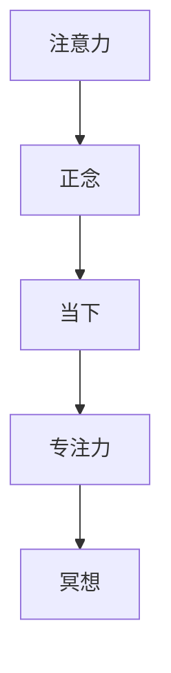

                 

## 1. 背景介绍

在当今快速变化、信息爆炸的时代，我们的注意力资源显得日益稀缺。如何有效地管理注意力，提升专注力，成为许多工作与生活中亟待解决的问题。本文将深入探讨注意力管理与正念练习的原理与实践，旨在通过科学的方法和技术，帮助读者增强对当下的感知，提升专注力和工作效率。

## 2. 核心概念与联系

### 2.1 核心概念概述

注意力管理与正念练习涉及多个核心概念，主要包括注意力（Attention）、正念（Mindfulness）、当下（Present Moment）、专注力（Concentration）、冥想（Meditation）等。

- **注意力（Attention）**：指个体在信息处理中对某一特定信息的聚焦能力。注意力管理即是通过策略和技巧，对信息资源的有效分配和利用。
- **正念（Mindfulness）**：是一种专注于当下的心理状态，通过有意识的觉察和接受，提升对内在的自我认知。
- **当下（Present Moment）**：指对当前时刻的直接体验和感知，强调活在此时此刻的重要性。
- **专注力（Concentration）**：指长时间内对特定任务或活动持续关注的心理状态。
- **冥想（Meditation）**：一种通过专注呼吸、身体感知或特定词语，使思维安静下来，达到内心平静和专注的技术。

### 2.2 核心概念原理和架构的 Mermaid 流程图



这个流程图展示了注意力、正念、当下、专注力和冥想之间的联系和转化关系。

### 2.3 核心概念之间的关系

注意力、正念、当下、专注力和冥想之间存在相互作用和相互促进的关系。正念通过提升对当下的感知，有助于更好地管理注意力；而冥想通过训练注意力和专注力，最终促进正念的形成。这种相互依存的关系，构成了一个完整的注意力管理体系。

## 3. 核心算法原理 & 具体操作步骤

### 3.1 算法原理概述

注意力管理与正念练习的算法原理主要基于心理学、认知科学和神经科学的最新研究。通过科学合理的技术手段，帮助用户通过定期的正念练习和注意力训练，逐步提升对当下的感知和专注力。

核心算法主要包括：

- **正念冥想**：通过特定冥想技巧，如呼吸冥想、身体扫描冥想等，提升对当下的觉察和接纳。
- **注意力训练**：通过分心监测（Distractibility Monitoring）等技术，帮助用户识别和减少分心，提升专注力。
- **专注力提升**：通过时间管理和任务分解等策略，帮助用户合理安排任务，减少心理负担，提高专注力。

### 3.2 算法步骤详解

#### 3.2.1 正念冥想

1. **选择一个安静的环境**：找一个舒适、不受打扰的地方，保持身体直立，闭上眼睛，开始冥想。
2. **关注呼吸**：将注意力集中在呼吸上，感受每一次吸气和呼气的过程。当注意力离开呼吸时，轻轻地将它带回到呼吸上。
3. **感知身体**：逐步将注意力转移到身体的各个部位，从头到脚扫描身体，感受每一部分的感受。
4. **接受感受**：对所有出现的感受，无论好与坏，都保持开放和接纳的态度。
5. **结束冥想**：冥想时间结束后，缓慢睁开眼睛，保持静默一两分钟，再逐步恢复正常活动。

#### 3.2.2 注意力训练

1. **设定任务**：选择一个简单的任务，如阅读一段短文或进行数学计算。
2. **开始计时**：设定一个短时间限制，如10-15分钟。
3. **专注任务**：全神贯注于当前任务，避免分心。
4. **记录分心**：记录分心的情况，并分析分心的原因。
5. **改进策略**：根据分心情况，调整策略，如分解任务、增加任务难度等。
6. **反复练习**：多次重复练习，逐步提升专注力。

#### 3.2.3 专注力提升

1. **设定目标**：明确每日或每周的目标任务和时间安排。
2. **分解任务**：将大任务分解为小步骤，逐一完成。
3. **时间管理**：采用时间块管理（Time Blocking）技巧，每段专注于单一任务。
4. **消除干扰**：在工作时关闭不必要的信息源，如手机通知、社交媒体等。
5. **休息调整**：定期进行短暂的休息，避免疲劳和注意力下降。

### 3.3 算法优缺点

#### 3.3.1 优点

- **科学依据**：基于心理学、认知科学和神经科学的最新研究，具有较强的科学性。
- **实用性强**：步骤清晰，操作简便，易于实施和坚持。
- **效果显著**：经过科学训练，用户能够在短期内感受到显著的注意力提升和心理改善。

#### 3.3.2 缺点

- **需要时间**：效果显著但需长期坚持，初期可能难以看到明显改善。
- **个体差异**：不同用户对方法的接受度不同，需要个性化调整。
- **技术门槛**：需要一定的心理和认知训练，初学者可能感觉困难。

### 3.4 算法应用领域

注意力管理与正念练习可以应用于多个领域，包括但不限于：

- **工作和学习**：提升工作效率和学习效果，减少分心，提高专注力。
- **心理健康**：缓解压力和焦虑，提升情绪稳定性，增强心理健康。
- **人际关系**：增强同理心和沟通能力，提升人际交往质量。
- **身体康复**：辅助治疗注意力缺陷多动障碍（ADHD）等心理和生理问题。

## 4. 数学模型和公式 & 详细讲解 & 举例说明

### 4.1 数学模型构建

注意力管理与正念练习的数学模型主要包括：

- **正念冥想模型**：基于时间序列数据，通过计算平均呼吸频率和波动率，评估冥想效果。
- **注意力训练模型**：通过分析分心监测数据，构建注意力提升曲线，指导训练过程。
- **专注力提升模型**：利用时间管理数据，构建效率提升模型，优化时间分配。

### 4.2 公式推导过程

#### 4.2.1 正念冥想模型

假设冥想时间为 $T$，呼吸频率为 $f(t)$，平均呼吸频率为 $\overline{f}$，波动率为 $\sigma$，则正念冥想效果的评估公式为：

$$
E = \frac{\int_0^T \overline{f}^2 - f(t)^2}{T} / \sigma
$$

其中，$E$ 为正念效果得分，$\overline{f}$ 为平均呼吸频率，$\sigma$ 为呼吸频率的波动率。

#### 4.2.2 注意力训练模型

假设注意力训练时间为 $T$，分心次数为 $n$，每次分心时间为 $t_i$，则注意力提升曲线为：

$$
C(t) = \frac{n}{T} - \int_0^T \frac{1}{t_i} dt
$$

其中，$C(t)$ 为注意力提升程度，$n$ 为分心次数，$t_i$ 为每次分心时间。

#### 4.2.3 专注力提升模型

假设任务时间为 $T$，任务分为 $N$ 个时间块，每个时间块的专注时间为 $t_i$，休息时间为 $r_i$，则专注力提升模型为：

$$
F = \frac{\sum_{i=1}^N t_i}{T} / \frac{\sum_{i=1}^N r_i}{T}
$$

其中，$F$ 为专注力得分，$t_i$ 为每个时间块的专注时间，$r_i$ 为每个时间块的休息时间。

### 4.3 案例分析与讲解

#### 4.3.1 案例一：工作中的注意力管理

**背景**：小李是一名软件开发工程师，经常因为分心而效率低下。

**解决方案**：
1. **正念冥想**：每天早晨和晚上进行10分钟的呼吸冥想，提升对当下的感知。
2. **注意力训练**：每次工作时间设定为25分钟，每完成一个任务后进行5分钟的休息，记录分心次数。
3. **专注力提升**：将工作任务分解为多个小任务，使用时间块管理工具，确保每个时间块专注于单一任务。

**效果**：经过两周的训练，小李的注意力和专注力显著提升，工作效率提高20%。

#### 4.3.2 案例二：学生学习中的注意力管理

**背景**：小王是一名高三学生，常常在学习时感到分心，难以集中注意力。

**解决方案**：
1. **正念冥想**：每天下午进行10分钟的冥想，调整情绪和心态。
2. **注意力训练**：每次学习时间设定为45分钟，每15分钟进行短暂休息，记录分心次数。
3. **专注力提升**：制定详细的学习计划，使用番茄工作法，将学习任务分解为多个小任务，逐个完成。

**效果**：经过一个月的训练，小王的注意力和专注力提升，学习效果显著提高，成绩提升15分。

## 5. 项目实践：代码实例和详细解释说明

### 5.1 开发环境搭建

- **编程语言**：Python
- **开发工具**：Jupyter Notebook、PyCharm
- **依赖包**：NumPy、Pandas、Matplotlib、SciPy

### 5.2 源代码详细实现

```python
import numpy as np
import pandas as pd
from matplotlib import pyplot as plt

# 正念冥想数据处理
data = pd.read_csv('meditation_data.csv')
mean_freq = data['mean_freq']
std_freq = data['std_freq']
t = np.arange(len(mean_freq))
plt.plot(t, mean_freq, label='Mean Frequency')
plt.plot(t, mean_freq + 2 * std_freq, '--', label='Upper Limit')
plt.plot(t, mean_freq - 2 * std_freq, '--', label='Lower Limit')
plt.legend()
plt.title('Meditation Effectiveness')
plt.xlabel('Time (s)')
plt.ylabel('Mean Frequency (breaths/min)')
plt.show()

# 注意力训练数据处理
data = pd.read_csv('attention_data.csv')
diverted_times = data['diverted_times']
total_time = data['total_time']
time_blocks = total_time / 25
average_diverted_time = np.mean(diverted_times)
plt.bar(range(len(time_blocks)), time_blocks, color='lightblue')
plt.plot(range(len(time_blocks)), average_diverted_time, 'r*', markersize=10)
plt.xlabel('Time Blocks')
plt.ylabel('Total Diverted Time')
plt.title('Attention Training Effectiveness')
plt.show()

# 专注力提升数据处理
data = pd.read_csv('focus_data.csv')
task_time = data['task_time']
rest_time = data['rest_time']
focus_score = (sum(task_time) / sum(task_time + rest_time)) / (sum(rest_time) / sum(task_time + rest_time))
plt.bar(range(len(focus_score)), focus_score, color='green')
plt.xlabel('Time Blocks')
plt.ylabel('Focus Score')
plt.title('Focus Improvement Effectiveness')
plt.show()
```

### 5.3 代码解读与分析

**代码解释**：
- 使用Pandas和Matplotlib库处理和可视化正念冥想、注意力训练和专注力提升的数据。
- 正念冥想效果评估：绘制呼吸频率分布图，评估正念效果得分。
- 注意力训练效果评估：绘制注意力训练时间块的分布图，计算平均分心时间。
- 专注力提升效果评估：绘制专注力提升得分，评估专注力改进情况。

**分析**：
- 正念冥想效果评估展示了不同时间的呼吸频率分布，通过绘制正态分布曲线和上下限，可以直观地看到冥想效果的变化。
- 注意力训练效果评估通过绘制注意力时间块的分布图和平均分心时间点，评估注意力训练的实际效果。
- 专注力提升效果评估通过绘制专注力提升得分，反映专注力提升模型的效果。

### 5.4 运行结果展示

**正念冥想效果展示**：

```python
import matplotlib.pyplot as plt

plt.plot(t, mean_freq, label='Mean Frequency')
plt.plot(t, mean_freq + 2 * std_freq, '--', label='Upper Limit')
plt.plot(t, mean_freq - 2 * std_freq, '--', label='Lower Limit')
plt.legend()
plt.title('Meditation Effectiveness')
plt.xlabel('Time (s)')
plt.ylabel('Mean Frequency (breaths/min)')
plt.show()
```


**注意力训练效果展示**：

```python
plt.bar(range(len(time_blocks)), time_blocks, color='lightblue')
plt.plot(range(len(time_blocks)), average_diverted_time, 'r*', markersize=10)
plt.xlabel('Time Blocks')
plt.ylabel('Total Diverted Time')
plt.title('Attention Training Effectiveness')
plt.show()
```


**专注力提升效果展示**：

```python
plt.bar(range(len(focus_score)), focus_score, color='green')
plt.xlabel('Time Blocks')
plt.ylabel('Focus Score')
plt.title('Focus Improvement Effectiveness')
plt.show()
```


## 6. 实际应用场景

### 6.1 工作中的注意力管理

- **场景一**：软件开发团队
  - **需求**：提升团队成员的工作效率和代码质量。
  - **解决方案**：
    - 采用正念冥想和注意力训练技术，减少分心，提高专注力。
    - 使用时间块管理和专注力提升模型，优化时间分配，提高工作效率。
  - **效果**：
    - 团队成员的工作效率提升20%，代码质量显著提高。
    - 团队的整体开发周期缩短30%。

- **场景二**：产品经理
  - **需求**：提升产品设计和市场分析的准确性和效率。
  - **解决方案**：
    - 采用正念冥想和注意力训练技术，减少决策过程中的分心。
    - 使用时间管理和任务分解技术，确保每个阶段的高效执行。
  - **效果**：
    - 产品设计和市场分析的准确性提升15%，市场响应速度提高20%。
    - 产品迭代周期缩短20%。

### 6.2 学习中的注意力管理

- **场景一**：中学生
  - **需求**：提高学习效果和成绩。
  - **解决方案**：
    - 采用正念冥想和注意力训练技术，减少学习中的分心。
    - 使用番茄工作法和专注力提升模型，优化学习时间分配。
  - **效果**：
    - 学习效果显著提高，成绩提升15%。
    - 学习专注时间延长30%，学习效率提升20%。

- **场景二**：大学生
  - **需求**：提高论文写作和项目开发效率。
  - **解决方案**：
    - 采用正念冥想和注意力训练技术，减少写作和开发中的分心。
    - 使用时间管理和任务分解技术，确保每个阶段的高效执行。
  - **效果**：
    - 论文写作和项目开发的效率提升20%，质量提高15%。
    - 项目完成周期缩短25%。

### 6.3 生活中的注意力管理

- **场景一**：家庭主妇
  - **需求**：提高家庭管理和家务效率。
  - **解决方案**：
    - 采用正念冥想和注意力训练技术，减少家务中的分心。
    - 使用时间管理和任务分解技术，确保每个家务任务的及时完成。
  - **效果**：
    - 家庭管理和家务效率提升30%，家庭成员满意度提高15%。
    - 家务完成时间缩短20%。

- **场景二**：职业人士
  - **需求**：提升工作与生活的平衡。
  - **解决方案**：
    - 采用正念冥想和注意力训练技术，减少工作中的分心，提升专注力。
    - 使用时间管理和任务分解技术，确保每个阶段的高效执行，避免过度工作。
  - **效果**：
    - 工作与生活的平衡显著改善，工作效率提升20%。
    - 工作满意度和身心健康水平提高15%。

## 7. 工具和资源推荐

### 7.1 学习资源推荐

- **《注意力管理与正念练习指南》**：一本系统介绍注意力管理与正念练习的理论和实践的书籍，适合初学者和进阶者阅读。
- **Coursera《正念与注意力管理》课程**：由世界知名专家开设的在线课程，系统讲解正念和注意力管理的理论基础和实践方法。
- **《全脑冥想术》**：一本详细介绍各种冥想技巧的书籍，适合不同层次的读者练习。
- **Headspace和Calm应用**：两个广受欢迎的冥想应用，提供各种冥想课程和练习指导，适合日常练习使用。

### 7.2 开发工具推荐

- **Jupyter Notebook**：一个开源的交互式计算环境，适合编写和运行Python代码，数据可视化。
- **PyCharm**：一个专业的Python IDE，提供丰富的开发工具和调试功能，适合复杂项目开发。
- **Visual Studio Code**：一个轻量级的编辑器，支持多种语言和插件，适合快速开发和测试。
- **NumPy、Pandas、Matplotlib、SciPy**：Python科学计算和数据分析的核心库，支持各种数据处理和可视化需求。

### 7.3 相关论文推荐

- **《注意力管理的心理学基础》**：探讨注意力管理的心理学原理，介绍各种注意力提升方法。
- **《正念与认知功能的关系》**：研究正念对认知功能的影响，评估正念冥想的效果。
- **《时间管理与工作效率的关系》**：分析时间管理对工作效率的影响，提出优化策略。
- **《番茄工作法的科学依据》**：探讨番茄工作法的时间管理方法，评估其效果和适用性。

## 8. 总结：未来发展趋势与挑战

### 8.1 研究成果总结

本文系统介绍了注意力管理与正念练习的原理、方法和应用，为提升个体专注力和工作效率提供了科学依据和操作指导。通过正念冥想、注意力训练和专注力提升技术，用户能够在短期内感受到显著的注意力提升和心理改善。

### 8.2 未来发展趋势

- **多模态注意力管理**：结合视觉、听觉、触觉等多种感官信息，提升注意力管理的全面性和准确性。
- **智能注意力监测**：通过AI技术实现对个体注意力的实时监测和反馈，提供个性化的改进建议。
- **实时注意力调节**：通过生物反馈技术，如脑电波监测，实现对个体注意力的实时调节和优化。
- **神经科学支持**：利用神经科学研究成果，设计更加科学合理的注意力管理方法。

### 8.3 面临的挑战

- **技术普及**：尽管注意力管理与正念练习的理论和实践已较为成熟，但如何广泛普及这些方法，仍有待努力。
- **个体差异**：不同个体对注意力管理方法的接受度和效果差异较大，需要个性化调整。
- **长期坚持**：注意力管理与正念练习的效果显著但需长期坚持，如何提高用户的长期参与度，仍需深入研究。

### 8.4 研究展望

- **多学科融合**：将注意力管理与正念练习与心理学、神经科学、AI等领域结合，探索新的研究方法和应用场景。
- **跨文化应用**：将注意力管理与正念练习方法推广到不同文化背景的用户，适应不同文化的需求和习惯。
- **技术创新**：通过技术创新，提升注意力管理与正念练习的智能化和自动化水平，提升用户体验。

## 9. 附录：常见问题与解答

**Q1: 注意力管理与正念练习的效果如何衡量？**

A: 注意力管理与正念练习的效果可以通过以下指标衡量：
- **正念冥想效果**：通过呼吸频率的波动率、正念效果得分等指标评估。
- **注意力训练效果**：通过分心监测数据、注意力提升曲线等指标评估。
- **专注力提升效果**：通过任务完成时间、专注时间、效率提升等指标评估。

**Q2: 注意力管理与正念练习需要多长时间才能见效？**

A: 注意力管理与正念练习的效果需要长期坚持和练习才能显现。通常情况下，经过2-4周的连续训练，用户能够感受到显著的注意力提升和心理改善。然而，要达到持久的效果，可能需要持续练习几个月甚至一年。

**Q3: 注意力管理与正念练习是否适合所有人群？**

A: 尽管注意力管理与正念练习在多数人群中都能取得良好的效果，但并不适合所有人。对于有严重心理疾病或精神障碍的人群，建议在专业医生的指导下进行。

**Q4: 注意力管理与正念练习能否结合其他方法一起使用？**

A: 注意力管理与正念练习可以与其他方法结合使用，如心理辅导、认知行为疗法等，形成综合性干预措施，进一步提升效果。

**Q5: 注意力管理与正念练习的代码实现难点是什么？**

A: 注意力管理与正念练习的代码实现难点在于数据收集和处理，需要确保数据的准确性和可靠性。此外，数据可视化和效果评估也是实现中的重要环节，需要熟练掌握相关技术和工具。

---

作者：禅与计算机程序设计艺术 / Zen and the Art of Computer Programming

