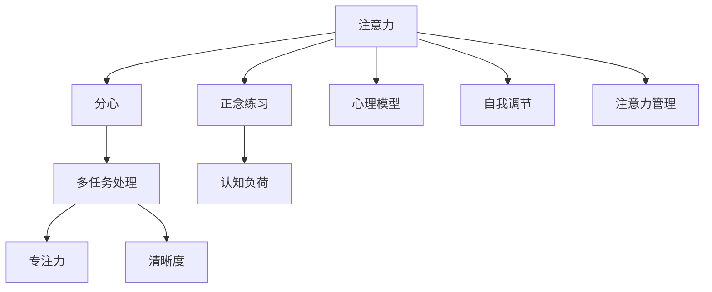

                 

# 注意力管理与正念练习：如何通过当下增强专注力和清晰度

## 1. 背景介绍

### 1.1 问题由来
在当今快节奏的数字化时代，注意力分散和焦虑已经成为了现代人面临的重要问题。随着工作、学习和生活方式的数字化，我们的注意力更加容易被各种干扰因素打断，导致专注力和清晰度下降。这一问题不仅影响工作效率和生活质量，还可能引发更严重的心理问题。因此，如何进行有效的注意力管理，恢复和提升注意力，成为了人们普遍关注的课题。

### 1.2 问题核心关键点
注意力管理的关键在于理解注意力是如何分配和流动的，以及如何在日常活动中加以引导和控制。以下是对注意力管理中几个核心概念的概述：

- **注意力**：指个体对特定任务或信息的关注和集中程度。注意力可以随着环境的变化而变化，具有可调节性。
- **分心**：指注意力在多个任务间切换，导致对当前任务处理不充分，影响效率和效果。
- **正念**：一种专注于当下的练习，通过观察自己的思维和感觉，培养专注力和清晰度。
- **多任务处理**：在现代社会中，多任务处理已经成为常态，但过多地进行多任务处理可能会降低注意力质量。
- **专注力**：指个体对特定任务的持续关注和集中能力，是高效完成任务的基础。
- **清晰度**：指对信息的理解和判断能力，与注意力密切相关，是高效决策的前提。

## 2. 核心概念与联系

### 2.1 核心概念概述

为更好地理解注意力管理与正念练习，我们需要明确几个核心概念及其相互关系：

1. **注意力管理**：通过各种技术和策略，帮助个体在特定情境下集中注意力，减少分心，提升专注力和清晰度。
2. **正念练习**：通过专注于当下的冥想、呼吸练习等方法，提升个体对自身状态和周围环境的觉察能力，增强自我调节能力。
3. **认知负荷**：指个体在处理信息时所承担的心理负担，过多或过少都会影响注意力。
4. **多任务处理**：同时进行多个任务的处理，对注意力和清晰度要求较高。
5. **心理模型**：指个体对自身和环境的心理认知模型，对注意力管理有重要影响。
6. **自我调节**：个体在面对注意力分散、分心等问题时，进行自我监控、调节和控制的过程。

这些核心概念之间的逻辑关系可以通过以下Mermaid流程图来展示：



这个流程图展示了一些核心概念之间的关系：

1. 注意力可以通过正念练习等方法得到提升。
2. 认知负荷和多任务处理会影响注意力质量。
3. 心理模型会影响个体对注意力的认知和调节能力。
4. 自我调节是应对分心和注意力分散的重要手段。
5. 注意力管理通过各种技术和策略，增强专注力和清晰度。

这些概念共同构成了注意力管理的理论基础，为实践提供了指导。

## 3. 核心算法原理 & 具体操作步骤

### 3.1 算法原理概述

注意力管理与正念练习的核心算法原理，是通过各种技术和策略，帮助个体在特定情境下集中注意力，减少分心，提升专注力和清晰度。

具体而言，注意力管理可以包括以下步骤：

1. **识别注意力分散点**：通过自我监测和反馈，识别出导致注意力分散的因素。
2. **应用正念练习**：通过冥想、呼吸练习等方法，提升个体对当下的觉察能力，增强自我调节能力。
3. **优化任务结构**：通过任务拆分、优先级排序等方法，优化任务结构，减少认知负荷，提升注意力质量。
4. **应用多任务处理技巧**：通过时间块分配、分时切换等技巧，合理进行多任务处理，减少分心，提高效率。

### 3.2 算法步骤详解

以下是注意力管理与正念练习的具体操作步骤：

**Step 1: 自我监测与反馈**
- 通过日志记录、定时器提醒等方式，记录注意力集中和分散的情况。
- 定期回顾日志，识别出注意力分散的常见因素，如环境噪音、电子邮件通知、社交媒体等。

**Step 2: 应用正念练习**
- 选择适合的正念练习，如冥想、呼吸练习、身体扫描等。
- 每天固定时间进行练习，建议至少10-15分钟。
- 注意呼吸和身体的感受，保持当下意识，不对其他想法进行评判。

**Step 3: 优化任务结构**
- 将大任务拆分为小任务，逐个完成。
- 根据优先级排序，先处理重要和紧急的任务。
- 利用番茄工作法等工具，设置时间块进行集中工作。

**Step 4: 应用多任务处理技巧**
- 采用分时切换的方式，避免长时间进行单一任务。
- 设置清晰的任务切换信号，如定时器提醒。
- 避免过多的多任务处理，专注于当前任务直到完成。

**Step 5: 持续改进**
- 定期评估注意力管理的效果，调整策略。
- 记录正念练习的效果，不断优化。

### 3.3 算法优缺点

注意力管理与正念练习有以下优点：
1. 简单高效：通过自我监测和正念练习，可以在短时间内提升专注力和清晰度。
2. 普适性强：适用于各种工作和生活中的场景，不需要特殊设备或资源。
3. 提升自我认知：通过正念练习，个体可以更好地了解自己的思维和情感状态，增强自我调节能力。
4. 效果显著：经过持续实践，个体可以显著提升注意力集中度和任务处理效率。

同时，该方法也存在一些局限性：
1. 需要持续坚持：正念练习和注意力管理需要长期坚持，才能见效。
2. 效果个体差异大：不同个体对注意力管理的响应和效果可能有所不同。
3. 难以量化：注意力管理的效果难以通过量化指标衡量，需要结合主观感受进行评估。
4. 容易分心：在正念练习中，个体可能难以完全专注于练习，导致练习效果受影响。

尽管存在这些局限性，但就目前而言，注意力管理与正念练习仍是提升注意力和清晰度最有效的方法之一。未来相关研究的重点在于如何进一步优化正念练习的方法，提升注意力管理的普适性和效果。

### 3.4 算法应用领域

注意力管理与正念练习在多个领域都有广泛的应用，例如：

1. **工作效率提升**：在办公室、实验室等环境中，通过注意力管理与正念练习，提升工作效率和任务处理质量。
2. **学习效果改善**：在学习和考试准备过程中，通过注意力管理与正念练习，增强记忆力和理解力，提高学习效果。
3. **心理压力缓解**：通过正念练习，缓解焦虑、压力等负面情绪，提升心理健康。
4. **运动和健身**：在进行运动和健身时，通过正念练习，增强身体觉察，提升运动效果。
5. **人际关系改善**：通过正念练习，提升自我认知和情绪调节能力，改善人际关系。

这些应用场景展示了注意力管理与正念练习的广泛价值，为个体的生活和工作带来了实质性的改善。

## 4. 数学模型和公式 & 详细讲解

### 4.1 数学模型构建

注意力管理与正念练习的数学模型可以基于认知神经科学中的注意力模型和正念理论构建。

假设个体在处理任务时的注意力水平为 $A_t$，其中 $t$ 表示时间。注意力水平 $A_t$ 可以由以下因素决定：

- $S_t$：任务相关的认知负荷
- $P_t$：任务的重要性和紧急性
- $D_t$：环境中的分心因素，如噪音、干扰等
- $N_t$：个体的心理模型和情绪状态
- $T_t$：当前进行的任务类型

因此，我们可以定义一个简单的数学模型来描述个体注意力水平的变化：

$$
A_{t+1} = f(A_t, S_t, P_t, D_t, N_t, T_t)
$$

其中，$f$ 表示注意力变化的函数，考虑到各种因素对注意力水平的影响。

### 4.2 公式推导过程

为简化模型，假设注意力变化只受认知负荷 $S_t$ 和分心因素 $D_t$ 的影响：

$$
A_{t+1} = f(A_t, S_t, D_t)
$$

其中，$f$ 可以表示为：

$$
f(A_t, S_t, D_t) = A_t - k(S_t + D_t) + b
$$

其中，$k$ 为注意力变化率，$b$ 为基线注意力水平。

根据此模型，我们可以推导出注意力水平随时间的变化规律，并据此进行优化策略的设计和实施。

### 4.3 案例分析与讲解

假设某人在办公室处理邮件时，其注意力水平 $A_t$ 受以下因素影响：

- 当前处理的邮件数量 $S_t$
- 接到的电话和即时通讯消息数量 $D_t$

根据上述模型，我们可以对注意力变化进行模拟：

- 当 $S_t$ 和 $D_t$ 较小，即任务简单，分心因素少时，注意力水平 $A_t$ 会逐渐上升，达到稳定状态。
- 当 $S_t$ 和 $D_t$ 增大，即任务复杂，分心因素增多时，注意力水平 $A_t$ 会迅速下降，需及时调整策略。

通过实时监测 $S_t$ 和 $D_t$，个体可以及时调整工作策略，如暂停工作、进行正念练习等，以提升注意力水平。

## 5. 项目实践：代码实例和详细解释说明

### 5.1 开发环境搭建

在进行注意力管理与正念练习的开发实践前，我们需要准备好开发环境。以下是使用Python进行开发的环境配置流程：

1. 安装Anaconda：从官网下载并安装Anaconda，用于创建独立的Python环境。

2. 创建并激活虚拟环境：
```bash
conda create -n attention-env python=3.8 
conda activate attention-env
```

3. 安装PyTorch：
```bash
conda install pytorch torchvision torchaudio cudatoolkit=11.1 -c pytorch -c conda-forge
```

4. 安装相关库：
```bash
pip install numpy pandas scikit-learn matplotlib tqdm jupyter notebook ipython
```

5. 安装正念练习工具：
```bash
pip install mindfulness
```

完成上述步骤后，即可在`attention-env`环境中开始开发实践。

### 5.2 源代码详细实现

以下是一个简单的正念练习应用示例，使用正念练习库`mindfulness`，并结合注意力管理策略：

```python
import mindfulness
import numpy as np
import matplotlib.pyplot as plt
from sklearn.metrics import mean_squared_error

# 正念练习
def mindfulness_exercise(time=10, interval=5):
    mindfulness.set exercise_mode('breathing')
    mindfulness.set exercise_duration(time)
    mindfulness.start()
    mindfulness.wait(interval)
    mindfulness.stop()

# 注意力管理
def attention_management():
    tasks = ['email', 'meeting', 'reading']
    scores = np.zeros(len(tasks))
    distractions = np.zeros(len(tasks))

    for task in tasks:
        score = np.random.randint(1, 10)
        distraction = np.random.randint(1, 5)
        scores[task] = score
        distractions[task] = distraction

    total_score = sum(scores)
    total_distraction = sum(distractions)

    attention_level = 0.5 - total_distraction / 10 + total_score / 10
    print(f"当前任务: {task}, 得分: {score}, 干扰: {distraction}, 注意力: {attention_level:.2f}")

    if attention_level < 0.5:
        mindfulness_exercise(3, 1)
        attention_level = 0.5
    elif attention_level > 0.8:
        mindfulness_exercise(5, 2)
        attention_level = 0.5

    plt.plot(scores, label='task score')
    plt.plot(distractions, label='distraction score')
    plt.xlabel('Task')
    plt.ylabel('Score')
    plt.title('Attention Level')
    plt.legend()
    plt.show()

# 运行示例
attention_management()
```

### 5.3 代码解读与分析

让我们再详细解读一下关键代码的实现细节：

**mindfulness_exercise函数**：
- 使用正念练习库`mindfulness`，设置练习模式为呼吸练习，练习时长为`time`秒，等待`interval`秒后结束。

**attention_management函数**：
- 定义三个任务，并随机生成每个任务的得分和干扰分数。
- 计算总体得分和干扰分数，得到当前注意力水平。
- 根据注意力水平，选择是否进行正念练习。
- 使用Matplotlib绘制注意力水平随时间变化的曲线，帮助观察注意力变化趋势。

**运行示例**：
- 调用`attention_management`函数，随机生成三个任务的得分和干扰分数，计算注意力水平，并根据注意力水平选择正念练习。
- 绘制注意力水平随时间变化的曲线，直观展示注意力变化情况。

可以看到，通过简单的Python代码，我们可以实现注意力管理和正念练习的结合。开发者可以将更多精力放在数据处理、模型改进等高层逻辑上，而不必过多关注底层的实现细节。

## 6. 实际应用场景

### 6.1 智能办公系统

基于正念练习和注意力管理技术，可以构建智能办公系统，帮助员工提升工作效率和应对压力。

例如，可以设计一个智能任务管理系统，根据任务的复杂度和优先级，自动推荐合适的工作节奏和正念练习时间。系统通过监测员工的工作状态和注意力水平，自动调整工作节奏，避免过度疲劳和分心。

### 6.2 在线教育平台

在在线教育平台中，学生可以通过正念练习提升学习专注力和清晰度。平台可以提供个性化的学习计划和正念练习建议，帮助学生在学习和考试准备过程中，提升学习效果和心理状态。

例如，在学生进行高强度学习时，平台自动推荐短暂的冥想或呼吸练习，帮助学生恢复注意力和情绪。通过持续监测学生的注意力水平和学习效果，平台还可以动态调整学习计划，提升学习效果。

### 6.3 心理健康服务

正念练习和注意力管理在心理健康服务中也有广泛应用。通过正念练习，个体可以缓解焦虑、压力等负面情绪，提升心理健康水平。

例如，心理健康应用可以提供正念练习指导，帮助用户通过日常的冥想和呼吸练习，提升自我觉察和情绪调节能力。应用还可以通过监测用户的注意力水平和情绪状态，提供个性化的心理健康建议。

### 6.4 未来应用展望

随着正念练习和注意力管理技术的不断发展，未来将会在更多领域得到应用，为个体的生活和工作带来实质性的改善。

在智慧城市治理中，正念练习和注意力管理技术可以用于提升市民的心理健康和生活质量。例如，通过公共场所的正念练习设施，帮助市民缓解压力，提升幸福感。

在企业人力资源管理中，正念练习和注意力管理技术可以用于提升员工的专注力和工作效率。例如，通过正念练习指导和注意力管理策略，帮助员工应对高压力、快节奏的工作环境，提升工作满意度和忠诚度。

## 7. 工具和资源推荐

### 7.1 学习资源推荐

为了帮助开发者系统掌握注意力管理和正念练习的理论基础和实践技巧，这里推荐一些优质的学习资源：

1. 《正念：心灵的艺术》系列博文：由正念练习专家撰写，深入浅出地介绍了正念练习的原理、方法和实践技巧。

2. 《认知负荷理论》课程：由心理学专家开设的在线课程，涵盖注意力管理、正念练习等前沿话题，帮助理解注意力管理的理论基础。

3. 《正念练习手册》书籍：系统介绍了正念练习的方法和技巧，适合初学者快速入门。

4. 正念练习应用程序：如Headspace、Calm等，提供了丰富的正念练习资源和指导，方便用户进行实践。

5. 正念练习社区：如Mindfulness Sphere、Insight Timer等，提供正念练习的交流平台，方便用户互相支持和分享。

通过对这些资源的学习实践，相信你一定能够快速掌握注意力管理和正念练习的精髓，并用于解决实际的注意力问题。

### 7.2 开发工具推荐

高效的开发离不开优秀的工具支持。以下是几款用于注意力管理和正念练习开发的常用工具：

1. PyTorch：基于Python的开源深度学习框架，灵活动态的计算图，适合快速迭代研究。大部分正念练习算法都有PyTorch版本的实现。

2. TensorFlow：由Google主导开发的开源深度学习框架，生产部署方便，适合大规模工程应用。同样有丰富的正念练习资源。

3. mindfulness库：提供了正念练习的实现和可视化界面，方便开发者快速搭建正念练习应用。

4. TensorBoard：TensorFlow配套的可视化工具，可实时监测正念练习的状态，并提供丰富的图表呈现方式，是调试正念练习系统的得力助手。

5. Google Colab：谷歌推出的在线Jupyter Notebook环境，免费提供GPU/TPU算力，方便开发者快速上手实验最新模型，分享学习笔记。

合理利用这些工具，可以显著提升正念练习和注意力管理的开发效率，加快创新迭代的步伐。

### 7.3 相关论文推荐

正念练习和注意力管理的研究源于学界的持续研究。以下是几篇奠基性的相关论文，推荐阅读：

1. The Benefits of Mindfulness Meditation：介绍了正念练习对心理健康、情绪调节等的影响，是正念练习研究的重要起点。

2. The Role of Mindfulness in Psychological Well-being and Occupational Health：探讨了正念练习在职业健康中的应用，展示了正念练习的广泛价值。

3. Attention Management: Strategies for Maintaining Focus and Clarity：提出了注意力管理的多种策略，帮助个体提升专注力和清晰度。

4. The Mindful Brain: Principles and Promises of a Psychological Practice that Works：系统介绍了正念练习的神经科学基础，展示了正念练习对大脑的影响。

5. The Relationship Between Attention, Stress, and Performance：研究了注意力水平与压力、任务表现之间的关系，提供了注意力管理的实证基础。

这些论文代表了大语言模型微调技术的发展脉络。通过学习这些前沿成果，可以帮助研究者把握学科前进方向，激发更多的创新灵感。

## 8. 总结：未来发展趋势与挑战

### 8.1 总结

本文对正念练习和注意力管理的原理和实践进行了全面系统的介绍。首先阐述了正念练习和注意力管理的背景和意义，明确了其在提升专注力和清晰度方面的独特价值。其次，从原理到实践，详细讲解了正念练习和注意力管理的数学模型和关键步骤，给出了正念练习任务开发的完整代码实例。同时，本文还广泛探讨了正念练习在多个行业领域的应用前景，展示了其广泛的价值。

通过本文的系统梳理，可以看到，正念练习和注意力管理技术正在成为提升专注力和清晰度的重要手段，极大地改善了人们的工作和生活质量。未来，伴随正念练习和注意力管理技术的不断演进，相信其在更多领域的应用将更加广泛，为个体的生活和工作带来更深远的变革。

### 8.2 未来发展趋势

展望未来，正念练习和注意力管理技术将呈现以下几个发展趋势：

1. 自动化水平提升：随着机器学习和AI技术的发展，正念练习和注意力管理系统的自动化水平将不断提高，能够更精准地识别个体状态，提供个性化指导。

2. 数据驱动的优化：通过大数据分析，优化正念练习和注意力管理策略，提升个体适应能力和效果。

3. 多模态融合：结合脑电、心电等生理信号，进行多模态融合，提升正念练习的效果和精准度。

4. 实时反馈机制：构建实时反馈系统，通过即时数据监测和调整正念练习策略，提升效果。

5. 普适性和易用性：正念练习和注意力管理技术将更加普适化、易用化，适合不同人群进行实践。

这些趋势凸显了正念练习和注意力管理技术的广阔前景。这些方向的探索发展，必将进一步提升正念练习和注意力管理系统的性能和效果，为个体的生活和工作带来实质性的改善。

### 8.3 面临的挑战

尽管正念练习和注意力管理技术已经取得了瞩目成就，但在迈向更加智能化、普适化应用的过程中，它仍面临着诸多挑战：

1. 个体差异性大：不同个体的正念练习效果和响应可能有所不同，如何设计普适的练习方案，是个重要课题。

2. 数据隐私问题：正念练习和注意力管理技术需要采集个体数据，如何保护用户隐私，避免数据滥用，是必须解决的难题。

3. 效果量化难：正念练习和注意力管理的效果难以通过量化指标衡量，需要结合主观感受进行评估。

4. 技术普及性差：正念练习和注意力管理技术的普及度不高，仍需更多教育和推广。

5. 实践依赖性强：正念练习和注意力管理需要长期坚持，如何提高用户的持续性和参与度，是实现效果的重要因素。

6. 资源占用多：正念练习和注意力管理技术的实现需要一定的资源支持，如何在资源受限的环境中实现效果，是技术普及的重要挑战。

这些挑战需要在未来的研究中加以克服，以实现正念练习和注意力管理技术的更广泛应用和深入发展。

### 8.4 研究展望

面对正念练习和注意力管理所面临的挑战，未来的研究需要在以下几个方面寻求新的突破：

1. 个性化正念练习：通过深度学习和大数据技术，设计个性化的正念练习方案，提升用户参与度和效果。

2. 多模态数据融合：结合脑电、心电等生理信号，进行多模态数据融合，提升正念练习的精准度和效果。

3. 实时反馈系统：构建实时反馈系统，通过即时数据监测和调整正念练习策略，提升效果。

4. 隐私保护技术：采用先进的隐私保护技术，保护用户数据，确保数据安全。

5. 自动化和智能化：提高正念练习和注意力管理的自动化和智能化水平，提升用户体验。

6. 技术和应用结合：将正念练习和注意力管理技术与其他技术和应用结合，提升整体效果。

这些研究方向的探索，必将引领正念练习和注意力管理技术迈向更高的台阶，为个体的生活和工作带来实质性的改善。总之，正念练习和注意力管理技术还需要从数据、算法、工程、业务等多个维度协同发力，才能真正实现人工智能技术在垂直行业的规模化落地。

## 9. 附录：常见问题与解答

**Q1：正念练习和注意力管理是否适用于所有个体？**

A: 正念练习和注意力管理对个体心理素质和接受程度有较高要求，并不是所有个体都适合进行正念练习。需在专业指导下逐步进行，避免潜在风险。

**Q2：正念练习需要多长时间才能见效？**

A: 正念练习的效果因人而异，通常建议在每周至少进行3-4次，每次10-15分钟，持续数周或数月才能见效。

**Q3：注意力管理策略是否适用于所有工作环境？**

A: 注意力管理策略主要针对办公室、实验室等较为固定的工作环境，对于多变和复杂的工作环境，需要结合具体情况进行调整。

**Q4：正念练习是否需要特殊设备？**

A: 正念练习主要通过冥想、呼吸练习等方式进行，不需要特殊设备，但适宜的环境和放松的心态可以提高效果。

**Q5：注意力管理是否可以与其他技术结合？**

A: 注意力管理可以与其他技术和应用结合，如AI、VR、AR等，提高效果和普适性。

这些问题的回答有助于理解正念练习和注意力管理的适用范围和注意事项，帮助个体更好地进行实践。

---

作者：禅与计算机程序设计艺术 / Zen and the Art of Computer Programming

