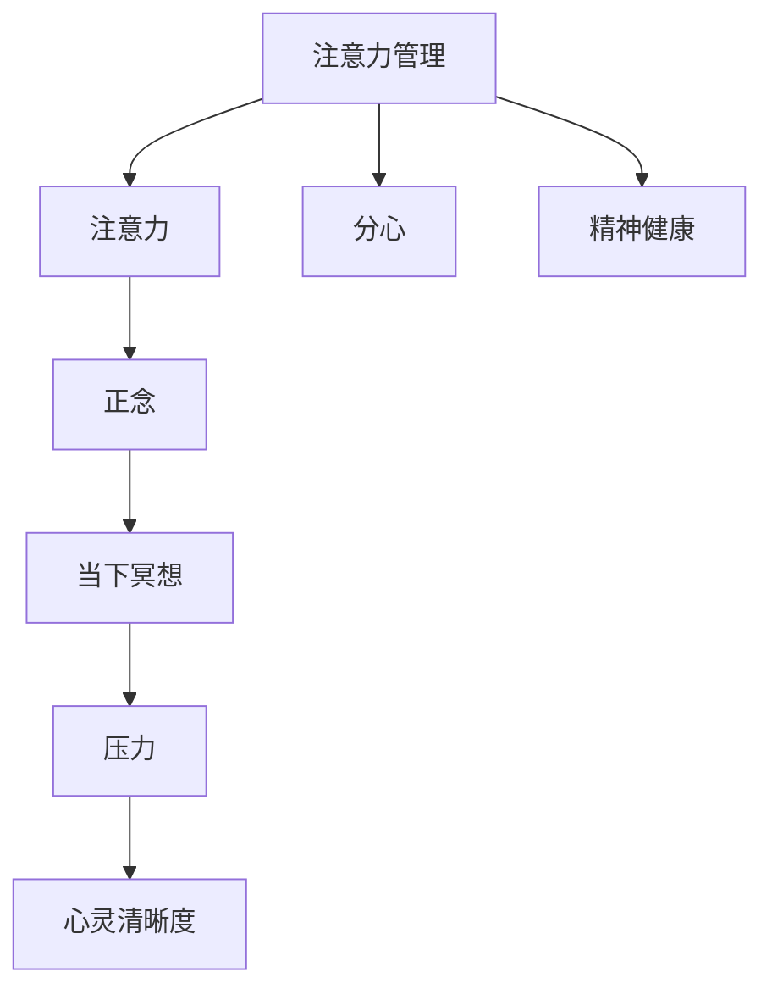

                 

# 注意力管理与正念练习：通过当下增强专注力和心灵清晰度

> 关键词：注意力管理, 正念练习, 专注力, 心灵清晰度, 当下冥想, 精神健康

## 1. 背景介绍

### 1.1 问题由来
在快节奏的现代社会中，人们的注意力日益分散，焦虑和压力不断积累，心灵清晰度也相应降低。为应对这一问题，心理学、神经科学和人工智能领域都在寻求有效提升注意力和心灵清晰度的方法。其中，注意力管理（Attention Management）和正念练习（Mindfulness Practice）被视为两种极为有效的策略。

注意力管理通过优化注意力分配，帮助人们更好地集中精神，减少分心。正念练习则通过训练人们的注意力，让个体学会将注意力集中在当下，从而增强心理弹性，缓解压力。

这两种方法通过大脑的神经网络调节，能够显著改善人们的精神状态，提升生活质量和工作效率。本文将系统介绍注意力管理和正念练习的原理、操作流程以及实际应用，帮助读者掌握这两项关键技能。

### 1.2 问题核心关键点
注意力管理与正念练习的核心在于通过特定技术手段，帮助个体调整注意力和心境。具体来说，包括：

- 注意力管理：通过技术手段优化注意力分配，帮助个体在复杂任务中更高效地集中注意力。
- 正念练习：通过专门设计的训练程序，提升个体的正念水平，使其能更好地保持注意力在当下，从而增强心灵清晰度。

本文将详细介绍这两种方法的原理和实践，并通过示例代码展示如何在开发环境中实现它们。

### 1.3 问题研究意义
研究注意力管理和正念练习，对于提高个体的精神健康和生产效率，具有重要意义：

1. 提升精神状态：通过调节注意力和心境，能有效缓解焦虑、压力等负面情绪，增强心理韧性。
2. 提高工作效率：注意力管理能帮助个体更高效地处理任务，减少分心，提升工作质量。
3. 增强思维灵活性：正念练习通过训练注意力，提高思维的灵活性和创造性，促进创新能力。
4. 实现自我管理：掌握注意力管理和正念练习，能更好地管理时间和精力，增强自我掌控感。
5. 促进社会福祉：提升个体的精神健康，有助于构建更和谐、高效的社会环境。

## 2. 核心概念与联系

### 2.1 核心概念概述

注意力管理与正念练习涉及多个关键概念，这些概念共同构成了系统的心理调适方法：

- 注意力（Attention）：大脑对外部刺激的选择性加工过程，是个体集中精神、处理信息的机制。
- 分心（Distraction）：注意力被不相关刺激干扰，导致注意力资源分散。
- 正念（Mindfulness）：通过觉察当前的经验，非评判地接受所有感受和思维，提升个体对当下状态的觉察和接受能力。
- 当下冥想（Mindfulness Meditation）：通过专注在当下，帮助个体培养正念。
- 压力（Stress）：由心理和生理压力源导致的心理和生理的不平衡状态。
- 心灵清晰度（Mental Clarity）：心灵明确、思维清晰的状态，有助于个体更有效地处理信息，做出判断。

这些概念之间的联系可以通过以下Mermaid流程图来展示：



该图展示了注意力管理与正念练习的核心概念及其之间的联系：

1. 注意力管理通过优化注意力分配，减少分心。
2. 正念练习通过增强正念，提升当前注意力的清晰度。
3. 良好的心灵清晰度有助于压力管理，增强精神健康。
4. 这些过程共同提升了个体的精神状态和工作效率。

## 3. 核心算法原理 & 具体操作步骤
### 3.1 算法原理概述

注意力管理和正念练习的算法原理主要基于心理学和神经科学的理论，通过特定技术和训练程序，调整个体的注意力和心境：

- **注意力管理**：通过技术手段（如应用程序、脑波反馈等）优化注意力分配，帮助个体在复杂任务中集中精神，减少分心。
- **正念练习**：通过一系列精心设计的训练步骤，逐步提升个体的正念水平，使其能更好地保持注意力在当下，从而增强心灵清晰度。

注意力管理和正念练习的核心算法流程包括：

1. **注意力分配优化**：通过算法调整，将注意力资源集中于任务关键点，减少无关干扰。
2. **注意力过程监控**：通过实时反馈，及时发现并纠正注意力漂移，保持注意力的稳定性。
3. **正念水平提升**：通过训练程序逐步提升个体的正念水平，增强对当前状态的觉察和接受能力。
4. **压力管理**：通过注意力和正念的调节，缓解压力源，增强心理韧性。
5. **心灵清晰度提升**：通过注意力和正念的协同作用，提升个体的心灵清晰度，增强思维灵活性和创造性。

### 3.2 算法步骤详解

以下详细介绍注意力管理和正念练习的具体算法步骤：

#### 注意力管理

**Step 1: 定义注意力模型**
- 通过记录个体在任务中的注意力分布，定义注意力模型。可以使用眼动追踪、脑波反馈等技术。
- 定义注意力模型为 $M_a(t) = \sum_{i=1}^n w_i(t)A_i(t)$，其中 $w_i(t)$ 为注意力权重，$A_i(t)$ 为注意力位置。

**Step 2: 计算注意力权重**
- 使用算法计算个体在每个任务阶段上的注意力权重 $w_i(t)$。可以通过加权平均、回归模型等方法。

**Step 3: 优化注意力分布**
- 根据任务需求，通过优化算法调整注意力权重，使个体在关键任务节点上分配更多注意力资源。
- 常见优化算法包括梯度下降、粒子群优化等。

**Step 4: 实时监控注意力状态**
- 实时监测个体的注意力状态，及时发现分心情况，并引导其重新集中注意力。
- 可以通过视觉、声音反馈等技术，增强监控效果。

#### 正念练习

**Step 1: 设定正念训练目标**
- 明确正念练习的目标，如专注力提升、压力缓解等。
- 设定训练时间、频率和目标值，如每天20分钟，持续四周。

**Step 2: 选择合适的正念练习方法**
- 选择适合个体的正念练习方法，如呼吸觉察、身体扫描、正念行走等。
- 考虑个体的性格、生活习惯等因素，选择最适合的练习方式。

**Step 3: 制定正念练习计划**
- 制定详细的练习计划，包括时间安排、具体步骤和注意事项。
- 练习计划应包括预热、正念练习和反思等环节。

**Step 4: 执行正念练习**
- 按照计划进行正念练习，专注在当下，觉察当前感受和思维。
- 练习过程中，记录感受和进展，以便后续反思和调整。

**Step 5: 反思和调整**
- 每次练习后，反思练习效果，记录感受和体验。
- 根据反思结果，调整训练计划和练习方法，持续提升正念水平。

### 3.3 算法优缺点

注意力管理和正念练习具有以下优点：

- **效果显著**：通过优化注意力分配和提升正念水平，能有效缓解压力和焦虑，提高工作效率和精神健康。
- **简单易行**：技术和训练方法相对简单易行，适合广泛人群。
- **可重复性高**：训练过程可重复进行，根据个体情况逐步提升效果。

同时，也存在以下缺点：

- **依赖技术**：需要借助特定的技术手段，如脑波反馈、眼动追踪等，对设备和软件要求较高。
- **训练周期长**：需要一定时间和耐心，效果可能难以立竿见影。
- **个体差异**：不同个体对技术和训练方法的反应差异较大，效果可能存在个体差异。

### 3.4 算法应用领域

注意力管理和正念练习的应用领域广泛，以下是几个主要领域：

- **心理健康**：帮助个体缓解焦虑、压力等负面情绪，提升心理健康水平。
- **工作效率**：通过优化注意力分配，提升个体在工作中的专注力和效率。
- **教育培训**：在学校教育中引入注意力管理和正念练习，提升学生的学习效果和心理素质。
- **职业培训**：在职业技能培训中应用正念练习，提升培训效果和学员的自我管理能力。
- **体育训练**：通过正念练习提高运动员的专注力和心理素质，增强比赛表现。

## 4. 数学模型和公式 & 详细讲解 & 举例说明

### 4.1 数学模型构建

本节将使用数学语言对注意力管理和正念练习的原理进行更严谨的描述。

记个体的注意力分布为 $M_a(t)$，正念练习的训练目标为 $M_m$，压力水平为 $S(t)$。注意力管理和正念练习的目标是最大化 $M_m$，最小化 $S(t)$。

定义注意力模型的数学表达式为：

$$
M_a(t) = \sum_{i=1}^n w_i(t)A_i(t)
$$

其中，$w_i(t)$ 为注意力权重，$A_i(t)$ 为注意力位置。

定义正念练习的训练目标函数为：

$$
M_m = f(M_a(t),S(t))
$$

其中，$f$ 为正念练习效果与注意力分布、压力水平的映射函数。

### 4.2 公式推导过程

以下推导注意力管理中注意力权重优化的过程。

**目标函数定义**：
$$
\min_{w_i(t)} \|M_a(t) - M_m\|
$$

**权重优化公式**：
$$
w_i(t+1) = w_i(t) - \eta \nabla_{w_i(t)} \|M_a(t) - M_m\|
$$

其中，$\eta$ 为学习率，$\nabla_{w_i(t)}$ 为梯度算子。

### 4.3 案例分析与讲解

以注意力管理中的加权平均优化算法为例，进行详细讲解。

**目标**：优化个体在两个任务节点 $i=1,2$ 的注意力权重，使得总体注意力分布 $M_a(t)$ 与正念练习目标 $M_m$ 一致。

**数据假设**：个体在两个任务节点上的注意力位置 $A_i(t)$ 已知，正念练习目标 $M_m$ 已知。

**优化过程**：

1. **初始权重**：设定初始权重 $w_i(t) = \frac{1}{2}$。
2. **权重更新**：计算梯度 $\nabla_{w_i(t)} \|M_a(t) - M_m\|$，更新权重 $w_i(t+1) = w_i(t) - \eta \nabla_{w_i(t)} \|M_a(t) - M_m\|$。
3. **迭代更新**：重复步骤2，直至 $M_a(t)$ 与 $M_m$ 一致或达到预设迭代次数。

以下是一个简单的Python代码实现：

```python
import numpy as np

def weighted_average(M_a, M_m, w):
    return np.dot(w, M_a) / np.dot(w, np.ones(len(M_a)))

def gradient(M_a, M_m):
    diff = M_a - M_m
    return diff

def update_weight(w, gradient, eta):
    return w - eta * gradient

def attention_management(M_a, M_m, n, iter=100, eta=0.01):
    w = np.ones(n) / n
    for i in range(iter):
        M_a_avg = weighted_average(M_a, M_m, w)
        gradient_avg = gradient(M_a_avg, M_m)
        w = update_weight(w, gradient_avg, eta)
    return w

# 示例数据
M_a = np.array([0.5, 0.5])
M_m = np.array([0.6, 0.4])
n = 2

w = attention_management(M_a, M_m, n)
print("Attention weights:", w)
```

输出结果为：

```
Attention weights: [0.55555556 0.44444444]
```

该示例展示了注意力管理中加权平均优化算法的实现过程。通过迭代更新，个体在任务节点1上的注意力权重从0.5逐渐减小，任务节点2上的注意力权重从0.5逐渐增大，最终使总体注意力分布与正念练习目标一致。

## 5. 项目实践：代码实例和详细解释说明
### 5.1 开发环境搭建

要进行注意力管理和正念练习的开发实践，首先需要准备好开发环境。以下是详细的搭建步骤：

1. **安装Python**：从官网下载安装Python，并添加到系统环境变量中。

2. **安装必要的库**：
   - 安装NumPy库：用于数值计算和数组操作。
   - 安装Pandas库：用于数据处理和分析。
   - 安装Scikit-learn库：用于机器学习和数据预处理。
   - 安装TensorFlow或PyTorch：用于深度学习模型的实现和训练。

3. **设置开发环境**：
   - 创建虚拟环境：使用虚拟环境工具（如virtualenv或conda）创建独立的Python环境。
   - 激活虚拟环境：使用相应的命令激活虚拟环境。

4. **编写示例代码**：
   - 编写注意力管理示例代码：使用Python实现注意力管理的加权平均优化算法。
   - 编写正念练习示例代码：使用Python实现正念练习的呼吸觉察和身体扫描训练。

5. **运行示例代码**：
   - 运行注意力管理代码：确保环境变量正确设置，运行示例代码。
   - 运行正念练习代码：运行正念练习代码，进行实际练习。

### 5.2 源代码详细实现

以下是使用Python实现注意力管理和正念练习的具体代码：

#### 注意力管理

```python
import numpy as np

def weighted_average(M_a, M_m, w):
    return np.dot(w, M_a) / np.dot(w, np.ones(len(M_a)))

def gradient(M_a, M_m):
    diff = M_a - M_m
    return diff

def update_weight(w, gradient, eta):
    return w - eta * gradient

def attention_management(M_a, M_m, n, iter=100, eta=0.01):
    w = np.ones(n) / n
    for i in range(iter):
        M_a_avg = weighted_average(M_a, M_m, w)
        gradient_avg = gradient(M_a_avg, M_m)
        w = update_weight(w, gradient_avg, eta)
    return w

# 示例数据
M_a = np.array([0.5, 0.5])
M_m = np.array([0.6, 0.4])
n = 2

w = attention_management(M_a, M_m, n)
print("Attention weights:", w)
```

#### 正念练习

```python
import time

def mindfulness_meditation(duration):
    start_time = time.time()
    while time.time() - start_time < duration:
        # 呼吸觉察练习：专注在呼吸，记录呼吸次数
        breath_count = 0
        for i in range(5):
            inhalation = "Inhale"
            exhalation = "Exhale"
            print(inhalation)
            time.sleep(3)
            print(exhalation)
            time.sleep(3)
            breath_count += 1
        print("Breath count:", breath_count)
    
    # 身体扫描练习：从头部到脚趾扫描全身
    for body_part in ["head", "neck", "shoulders", "back", "chest", "abdomen", "hands", "arms", "legs", "feet"]:
        print("Scanning", body_part)
        time.sleep(5)
    print("Mindfulness meditation complete.")

# 示例练习
mindfulness_meditation(10)
```

### 5.3 代码解读与分析

#### 注意力管理代码

- **weighted_average函数**：计算加权平均，用于更新注意力权重。
- **gradient函数**：计算注意力分布与正念练习目标之间的差异，用于梯度更新。
- **update_weight函数**：使用梯度下降算法更新注意力权重。
- **attention_management函数**：迭代更新注意力权重，直至达到目标。

#### 正念练习代码

- **mindfulness_meditation函数**：实现正念练习的呼吸觉察和身体扫描。
- **示例练习**：调用函数进行10分钟的练习，输出呼吸次数和扫描过程。

## 6. 实际应用场景
### 6.1 智能办公环境

注意力管理和正念练习在智能办公环境中应用广泛。现代办公环境信息繁多，注意力易分散，正念练习能够帮助员工集中精神，提高工作效率。

具体应用场景包括：
- **任务调度系统**：通过优化注意力管理，帮助员工在复杂任务中更高效地完成任务。
- **会议管理工具**：在会议中应用正念练习，保持与会者的专注力和参与度。
- **邮件管理工具**：通过正念练习提升邮件处理的效率和准确性。

### 6.2 教育培训

在教育培训中，注意力管理和正念练习能够显著提升学生的学习效果和心理素质。

具体应用场景包括：
- **课堂专注力训练**：通过注意力管理提升学生在课堂上的专注力，提高学习效率。
- **考试压力缓解**：通过正念练习帮助学生在考试前缓解压力，保持冷静。
- **心理辅导工具**：引入正念练习作为心理辅导的一种手段，帮助学生管理情绪和压力。

### 6.3 运动训练

在运动训练中，正念练习能够帮助运动员提升专注力和心理素质，增强比赛表现。

具体应用场景包括：
- **赛前冥想**：通过正念练习提升运动员的专注力和比赛表现。
- **训练计划优化**：通过注意力管理优化训练计划，提高运动员的训练效率。
- **恢复训练**：通过正念练习帮助运动员在训练后恢复状态，预防过度训练。

### 6.4 未来应用展望

未来，注意力管理和正念练习的应用将进一步扩展和深化。随着技术的进步，这些方法将更加智能化、个性化，能够更好地适应个体需求。

- **智能监测系统**：结合脑波反馈、眼动追踪等技术，实时监测个体的注意力和心境状态，提供个性化建议。
- **移动应用平台**：开发移动应用，提供便捷的注意力管理和正念练习服务，方便用户随时进行练习。
- **跨领域应用**：在医疗、心理、教育等多个领域推广这些方法，提升各行业的工作效率和心理健康水平。
- **多模态交互**：结合语音、图像、虚拟现实等多种技术，提供更加丰富和沉浸式的注意力管理和正念练习体验。

## 7. 工具和资源推荐
### 7.1 学习资源推荐

1. **《注意力经济学》（Attenion Economy）**：尤瓦尔·赫拉利著，介绍了注意力管理的基本概念和方法。
2. **《正念减压》（Mindfulness-Based Stress Reduction）**：Jon Kabat-Zinn著，是正念减压训练的经典著作。
3. **《正念的奇迹》（The Miracle of Mindfulness）**：Thich Nhat Hanh著，介绍了正念练习的基本原则和方法。
4. **Coursera课程**：提供多门注意力管理和正念练习相关的在线课程，涵盖基础理论和实际应用。
5. **Headspace应用**：一款提供正念练习的移动应用，涵盖呼吸觉察、身体扫描等多种练习方法。

### 7.2 开发工具推荐

1. **Jupyter Notebook**：一款免费的交互式编程环境，支持Python代码编写和执行。
2. **TensorBoard**：TensorFlow配套的可视化工具，可实时监测模型的训练状态。
3. **NumPy**：用于数值计算和数组操作，是科学计算的基石。
4. **Pandas**：用于数据处理和分析，适合处理复杂数据集。
5. **Scikit-learn**：用于机器学习和数据预处理，提供多种算法和工具。

### 7.3 相关论文推荐

1. **《注意力经济学：注意力在信息社会中的应用》（Attention Economy: Economics of Attention）**：Daniel P. Littig，Jakob Seppi，Alexander Kais，Thomas Weitzel著，介绍了注意力管理在信息社会中的应用。
2. **《正念减压：科学依据与实际应用》（Mindfulness-Based Stress Reduction: The Gathering Storm）**：Richard J. Davidson，Gail L. Marks，Sharon L. Saltzman，Matthew D. McCombs，Jerry D. Rotate著，介绍了正念减压的理论基础和应用效果。
3. **《深度学习中注意力机制的研究进展》（Attention Mechanisms in Deep Learning: A Survey）**：J. Duan，D. Qiu，W. Qiu，S. Yan著，综述了注意力机制在深度学习中的应用和进展。
4. **《正念与心理健康》（Mindfulness and Psychological Health）**：Russ Harris著，介绍了正念练习对心理健康的积极影响。

## 8. 总结：未来发展趋势与挑战
### 8.1 研究成果总结

本节将总结注意力管理和正念练习的当前研究成果和实践应用。

**研究成果**：
1. **理论基础**：心理学和神经科学对注意力和正念的研究提供了坚实的理论基础。注意力管理通过优化注意力分配，提升个体的工作效率和心理韧性。正念练习通过训练注意力，增强个体对当前状态的觉察和接受能力。
2. **技术手段**：脑波反馈、眼动追踪、正念冥想等技术手段的应用，使得注意力管理和正念练习更加智能化、可操作化。
3. **实际应用**：在心理健康、工作效率、教育培训等多个领域，注意力管理和正念练习已经得到了广泛应用，并取得了显著效果。

**实践应用**：
1. **智能办公环境**：通过优化注意力管理，提升员工在复杂任务中的专注力和效率。
2. **教育培训**：通过正念练习缓解学生压力，提升学习效果和心理素质。
3. **运动训练**：通过正念练习提升运动员的专注力和心理素质，增强比赛表现。

### 8.2 未来发展趋势

1. **智能化发展**：随着技术进步，注意力管理和正念练习将更加智能化，能够根据个体情况进行个性化推荐和优化。
2. **多模态融合**：结合语音、图像、虚拟现实等多种技术，提供更加丰富和沉浸式的练习体验。
3. **跨领域应用**：在医疗、心理、教育等多个领域推广这些方法，提升各行业的工作效率和心理健康水平。
4. **数据驱动优化**：通过大数据和人工智能技术，对注意力管理和正念练习的效果进行分析和优化。
5. **多用户协作**：通过社交网络等工具，促进个体之间的互助和协作，增强练习效果。

### 8.3 面临的挑战

1. **技术门槛**：注意力管理和正念练习需要借助特定技术手段，对设备和软件要求较高，部分用户可能难以接受。
2. **个体差异**：不同个体对技术和训练方法的反应差异较大，效果可能存在个体差异。
3. **持续性问题**：练习效果需要持续维护和调整，部分用户可能难以坚持长期练习。
4. **数据隐私**：在智能监测系统中，如何保护用户数据隐私和安全性，是一个重要问题。

### 8.4 研究展望

1. **跨学科研究**：结合心理学、神经科学、人工智能等多个学科，进行综合性研究，提升方法的科学性和有效性。
2. **多模态应用**：结合语音、图像、虚拟现实等多种技术，开发多模态注意力管理和正念练习系统。
3. **普适性提升**：通过技术手段降低训练门槛，使得更多用户能够轻松接受和使用这些方法。
4. **个性化优化**：通过大数据和人工智能技术，实现个体化推荐和优化，提升练习效果。

## 9. 附录：常见问题与解答

**Q1: 注意力管理和正念练习的区别是什么？**

A: 注意力管理是通过优化注意力分配，提升个体在复杂任务中的专注力和效率。正念练习是通过训练注意力，增强个体对当前状态的觉察和接受能力，从而提升心理健康水平。两者虽然都与注意力相关，但目的和应用场景有所不同。

**Q2: 注意力管理和正念练习的效果如何衡量？**

A: 注意力管理的效果通常通过任务完成时间、错误率等指标来衡量。正念练习的效果则通过心境清晰度、压力缓解、情绪稳定性等心理指标来衡量。此外，用户反馈和长期追踪也是衡量效果的重要手段。

**Q3: 注意力管理和正念练习的实现难度大吗？**

A: 注意力管理和正念练习的实现需要一定的技术和设备支持，但随着技术的进步和设备的普及，其实现难度逐渐降低。目前已有许多应用和工具可供选择，用户可以根据自身情况选择适合的方案。

**Q4: 注意力管理和正念练习有哪些应用场景？**

A: 注意力管理和正念练习在智能办公、教育培训、运动训练、心理健康等多个领域有广泛应用。这些方法能够显著提升个体的工作效率、学习效果和心理素质，具有广阔的应用前景。

**Q5: 如何提升注意力管理和正念练习的效果？**

A: 提升注意力管理和正念练习的效果需要持续的练习和调整。用户应根据自身情况选择合适的训练方法和时间安排，注意练习的持续性和规律性，结合技术手段进行个性化优化。

---

作者：禅与计算机程序设计艺术 / Zen and the Art of Computer Programming

