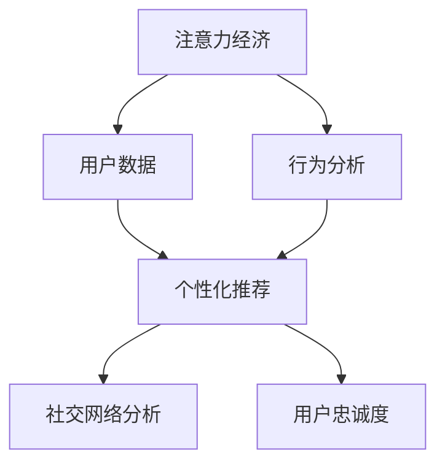

                 

# 注意力经济下的用户忠诚度培养

## 1. 背景介绍

在数字化转型的浪潮中，企业的竞争焦点正在从产品竞争转向用户竞争。争夺用户注意力，培养用户忠诚度，已经成为企业实现持续增长的关键。然而，用户注意力的获取和保持绝非易事，尤其是在注意力经济时代，用户选择的多样性和动态性使得企业面临前所未有的挑战。本文章将聚焦于基于注意力经济理论的用户忠诚度培养方法，结合先进的技术手段，为企业在数字时代赢得用户的注意，留住用户的忠诚，提供系统的解决方案。

## 2. 核心概念与联系

### 2.1 核心概念概述

本节将介绍几个核心概念，并阐明它们之间的联系：

- **注意力经济（Attention Economy）**：在数字时代，注意力资源成为一种稀缺商品，人们的时间和精力被分散在无数的媒体和平台上，企业需要花费大量资源争夺用户的注意力。
- **用户忠诚度（User Loyalty）**：指用户对品牌的忠诚和依赖程度，包括情感忠诚、行为忠诚等维度。
- **行为分析（Behavior Analysis）**：通过分析用户行为数据，了解用户需求和偏好，指导营销策略和产品改进。
- **个性化推荐（Personalized Recommendation）**：利用用户的历史行为数据和特征信息，推荐个性化的产品或内容，增强用户体验和满意度。
- **社交网络分析（Social Network Analysis）**：分析用户的社交关系和网络结构，理解用户的社交影响力及其对品牌忠诚度的影响。

这些概念之间存在密切的联系，注意力经济为争夺用户提供了动力和手段，行为分析和个性化推荐通过用户数据驱动决策，社交网络分析揭示了用户之间关系对品牌忠诚度的影响，共同构成了用户忠诚度培养的框架。

### 2.2 核心概念原理和架构的 Mermaid 流程图



## 3. 核心算法原理 & 具体操作步骤

### 3.1 算法原理概述

基于注意力经济理论的用户忠诚度培养，本质上是一种数据驱动的决策过程。核心目标是理解用户的行为和偏好，并据此设计策略，引导用户形成对品牌的忠诚。具体来说，可以通过以下几个步骤实现：

1. **注意力获取（Attention Acquisition）**：吸引用户的注意，引导用户关注企业的品牌、产品和服务。
2. **行为分析（Behavior Analysis）**：通过分析用户行为数据，识别用户的兴趣和偏好，构建用户画像。
3. **个性化推荐（Personalized Recommendation）**：基于用户画像，推送个性化的产品或内容，增强用户体验和满意度。
4. **社交网络分析（Social Network Analysis）**：理解用户社交关系对品牌忠诚度的影响，利用社交网络特性提升用户忠诚度。

### 3.2 算法步骤详解

#### 步骤1：注意力获取

- **多渠道触达**：利用多渠道触达用户，如社交媒体、搜索引擎、电子邮件等，提高品牌曝光率。
- **内容创作**：创作高质量、有吸引力的内容，包括图文、视频、播客等，吸引用户关注。
- **互动活动**：举办互动活动，如问答、竞赛、抽奖等，增加用户参与度。

#### 步骤2：行为分析

- **数据收集**：收集用户行为数据，包括浏览记录、购买历史、互动反馈等。
- **特征提取**：从行为数据中提取用户特征，如兴趣偏好、消费习惯、社交属性等。
- **用户画像构建**：基于用户特征，构建用户画像，以便进行个性化推荐和社交网络分析。

#### 步骤3：个性化推荐

- **推荐模型训练**：训练推荐模型，如协同过滤、内容推荐等，基于用户画像进行个性化推荐。
- **反馈循环**：收集用户反馈，优化推荐模型，提高推荐效果。

#### 步骤4：社交网络分析

- **社交关系识别**：识别用户的社交网络关系，如朋友、粉丝、关注者等。
- **社交影响力分析**：分析用户社交网络中的影响力节点，包括意见领袖、社交达人等。
- **品牌传播**：通过意见领袖和影响力节点，传播品牌信息，提升品牌忠诚度。

### 3.3 算法优缺点

#### 优点

1. **精准性**：基于数据驱动的方法，能够精确识别用户需求和偏好，提高推荐效果。
2. **灵活性**：能够灵活调整策略，快速应对市场变化。
3. **效果显著**：通过个性化的推荐和社交网络分析，显著提升用户满意度和忠诚度。

#### 缺点

1. **数据依赖性高**：需要大量高质量的用户数据，数据获取和处理成本较高。
2. **隐私风险**：用户数据隐私保护是一个重要挑战，需要合理设计和严格管理。
3. **算法复杂性**：推荐和社交网络分析算法复杂，实现和维护成本较高。

### 3.4 算法应用领域

本算法在多个领域均有广泛应用，包括但不限于：

- **电商行业**：通过个性化推荐提升用户购买转化率。
- **社交媒体**：通过社交网络分析引导用户产生品牌认同感。
- **金融行业**：通过行为分析提高用户粘性和忠诚度。
- **在线教育**：通过个性化推荐提升用户学习体验和满意度。
- **旅游行业**：通过社交网络分析推广旅游目的地，提高用户参与度。

## 4. 数学模型和公式 & 详细讲解 & 举例说明

### 4.1 数学模型构建

在本节中，我们将通过数学模型构建，对基于注意力经济的用户忠诚度培养方法进行详细讲解。

设 $U$ 为所有用户集合，$I$ 为所有商品集合，$x_{u,i}$ 表示用户 $u$ 对商品 $i$ 的评分，$y_{u,i}$ 表示用户 $u$ 是否购买商品 $i$ 的标记（0表示未购买，1表示已购买）。我们的目标是通过学习用户评分和购买行为，构建用户画像 $p_u$，并基于用户画像进行个性化推荐。

### 4.2 公式推导过程

我们使用协同过滤推荐算法来构建用户画像。协同过滤算法基于用户和商品的评分矩阵 $R \in \mathbb{R}^{U \times I}$，通过寻找与目标用户 $u$ 相似的其他用户 $v$，并基于这些相似用户对商品的评分来预测用户 $u$ 对商品的评分。协同过滤算法可以表示为：

$$
p_u = \frac{1}{\|\hat{N}_u\|} \sum_{v \in \hat{N}_u} \alpha_v p_v
$$

其中，$\hat{N}_u$ 为与用户 $u$ 相似的其他用户集合，$\alpha_v$ 为相似度系数，$p_v$ 为用户 $v$ 的评分。

### 4.3 案例分析与讲解

以电商平台为例，我们可以利用协同过滤算法为用户 $u$ 生成个性化推荐列表。首先，我们根据用户的购买历史和评分数据，构建用户-商品评分矩阵 $R$。然后，通过协同过滤算法计算出与用户 $u$ 相似的其他用户集合 $\hat{N}_u$。最后，基于这些相似用户对商品的评分，计算出用户 $u$ 的个性化推荐列表 $R_u$。

### 4.4 代码实现示例

```python
import numpy as np
from scipy.sparse import csr_matrix

def collaborative_filtering(train_ratings, user_similarity_matrix):
    user_count = train_ratings.shape[0]
    user_similarity_matrix = csr_matrix(user_similarity_matrix)
    
    # 构建用户画像
    user_profiles = np.zeros((user_count, train_ratings.shape[1]))
    for u in range(user_count):
        neighbors = np.where(user_similarity_matrix[u] > 0)[0]
        for v in neighbors:
            user_profiles[u] += user_similarity_matrix[u, v] * train_ratings[v]
    user_profiles /= np.linalg.norm(user_profiles, axis=1)
    
    # 生成推荐列表
    def recommend(user_id):
        recommendations = np.dot(user_profiles[user_id], train_ratings.T)
        return recommendations.argsort()[-10:][::-1]
    
    return recommend
```

## 5. 项目实践：代码实例和详细解释说明

### 5.1 开发环境搭建

在进行用户忠诚度培养的实践前，我们需要准备好开发环境。以下是使用Python进行项目开发的必要步骤：

1. 安装Python环境：确保你的Python环境最新，并安装所需的第三方库，如pandas、numpy、scipy等。
2. 数据收集与处理：收集用户行为数据，并使用pandas进行数据清洗和预处理。
3. 模型训练与评估：使用scikit-learn等工具进行协同过滤算法的训练和评估。
4. 个性化推荐系统部署：将训练好的模型集成到推荐系统中，提供用户个性化的商品或内容推荐。

### 5.2 源代码详细实现

在本节中，我们将展示如何通过Python实现协同过滤推荐算法，以电商平台的商品推荐为例。

```python
import pandas as pd
from scipy.sparse import csr_matrix
from sklearn.metrics.pairwise import cosine_similarity
from sklearn.feature_extraction import DictVectorizer

# 加载数据
data = pd.read_csv('ratings.csv')

# 数据预处理
train_ratings = np.array(data[['user_id', 'item_id', 'rating']].pivot(index='user_id', columns='item_id', values='rating').fillna(0))
train_ratings = train_ratings.T

# 特征提取
vectorizer = DictVectorizer()
train_features = vectorizer.fit_transform(train_ratings.todense().tolist())

# 构建用户相似度矩阵
user_similarity_matrix = cosine_similarity(train_features)

# 协同过滤推荐
def collaborative_filtering(train_ratings, user_similarity_matrix):
    user_count = train_ratings.shape[0]
    user_similarity_matrix = csr_matrix(user_similarity_matrix)
    
    # 构建用户画像
    user_profiles = np.zeros((user_count, train_ratings.shape[1]))
    for u in range(user_count):
        neighbors = np.where(user_similarity_matrix[u] > 0)[0]
        for v in neighbors:
            user_profiles[u] += user_similarity_matrix[u, v] * train_ratings[v]
    user_profiles /= np.linalg.norm(user_profiles, axis=1)
    
    # 生成推荐列表
    def recommend(user_id):
        recommendations = np.dot(user_profiles[user_id], train_ratings.T)
        return recommendations.argsort()[-10:][::-1]
    
    return recommend

# 测试推荐系统
recommend_func = collaborative_filtering(train_ratings, user_similarity_matrix)
user_id = 1
recommendations = recommend_func(user_id)
print(f"推荐列表：{recommendations}")
```

### 5.3 代码解读与分析

本节将详细解读上述代码中的关键实现细节：

1. 数据加载与预处理：使用pandas加载数据，并进行清洗和预处理，构建用户-商品评分矩阵。
2. 特征提取：使用sklearn的DictVectorizer将评分矩阵转化为特征向量，用于计算用户相似度。
3. 用户相似度矩阵构建：使用scipy的cosine_similarity计算用户之间的相似度矩阵。
4. 协同过滤算法实现：通过迭代计算用户画像和个性化推荐列表，最终返回用户推荐的商品列表。

### 5.4 运行结果展示

运行上述代码，我们将得到一个用户 $u$ 的推荐商品列表。这个列表是根据用户 $u$ 与其他相似用户的评分矩阵，以及用户画像，通过协同过滤算法计算得到的。

## 6. 实际应用场景

### 6.1 电商平台

电商平台通过协同过滤推荐算法，可以显著提高用户购物体验和满意度。用户登录后，系统可以根据其历史购买记录和评分数据，生成个性化的商品推荐列表。通过这种推荐方式，用户能够快速找到感兴趣的商品，提高购买转化率，同时增加平台的用户粘性和忠诚度。

### 6.2 在线教育平台

在线教育平台可以通过行为分析和个性化推荐，提高用户学习效果和满意度。系统记录用户的课程观看记录、测试成绩和互动反馈，构建用户画像，并基于画像生成个性化的课程和内容推荐。这不仅能帮助用户更高效地学习，还能增加平台的粘性和用户忠诚度。

### 6.3 社交媒体

社交媒体平台可以利用社交网络分析，增强用户对品牌的认同感。通过对用户的社交网络进行分析和挖掘，平台可以识别出影响力节点，并通过这些节点传播品牌信息。此外，社交媒体还可以通过推荐用户感兴趣的内容，增强用户参与度，提高品牌曝光率和用户忠诚度。

### 6.4 未来应用展望

随着用户行为数据的不断积累和技术的不断进步，基于注意力经济的用户忠诚度培养方法将变得更加高效和精准。未来，我们可以预见以下趋势：

1. **深度学习的应用**：利用深度学习算法，如神经协同过滤（Neural Collaborative Filtering），进一步提升推荐系统的精度和效果。
2. **实时数据处理**：通过实时数据流处理技术，如Apache Kafka、Flink等，实现对用户行为的实时分析和推荐。
3. **多模态数据的融合**：将文本、图像、音频等多种数据类型进行融合，提供更加丰富和全面的用户画像。
4. **强化学习的应用**：利用强化学习算法，通过不断试错和优化，提高推荐系统的适应性和智能化水平。
5. **用户隐私保护**：在数据收集和处理过程中，采取隐私保护措施，如差分隐私（Differential Privacy）、匿名化（Anonymization）等，保护用户隐私。

这些趋势将推动基于注意力经济的用户忠诚度培养方法，朝着更加智能、高效、安全的方向发展。

## 7. 工具和资源推荐

### 7.1 学习资源推荐

为了帮助开发者掌握基于注意力经济的用户忠诚度培养方法，以下是一些优质的学习资源：

1. **《推荐系统》书籍**：详细介绍了推荐系统原理、算法和应用，是推荐系统学习的经典教材。
2. **Coursera《Recommender Systems》课程**：斯坦福大学开设的推荐系统课程，涵盖推荐系统基础、协同过滤、深度学习推荐等多个方面。
3. **Kaggle推荐系统竞赛**：参与Kaggle上的推荐系统竞赛，实践推荐系统算法，并与其他开发者交流。
4. **PyTorch推荐系统项目**：GitHub上丰富的推荐系统开源项目，包括代码示例和模型评估。
5. **Deep Learning on Marketing Data（DeepLearning on Marketing Data）**：最新研究论文和综述，介绍深度学习在营销数据分析中的应用。

通过这些资源的学习和实践，相信你能够掌握基于注意力经济的用户忠诚度培养方法，并将其应用于实际项目中。

### 7.2 开发工具推荐

本节推荐几款常用的开发工具，帮助开发者高效实现基于注意力经济的用户忠诚度培养方法：

1. **Python环境**：使用Anaconda等环境管理工具，确保开发环境的稳定性和可重复性。
2. **Jupyter Notebook**：轻量级交互式开发环境，方便快速迭代和代码调试。
3. **TensorFlow**：深度学习框架，支持复杂的模型构建和优化。
4. **Scikit-learn**：机器学习库，提供多种推荐算法和模型评估工具。
5. **Apache Kafka**：实时数据流处理框架，支持大规模数据实时处理和分析。

合理利用这些工具，可以显著提升用户忠诚度培养的开发效率和效果。

### 7.3 相关论文推荐

本节推荐几篇前沿的研究论文，供开发者参考和学习：

1. **《Neural Collaborative Filtering》**：利用深度神经网络实现协同过滤推荐，显著提升推荐精度。
2. **《Deep Learning on Marketing Data》**：深度学习在营销数据分析中的应用，介绍多种深度学习推荐算法和模型评估方法。
3. **《Multi-Modal Recommendation System》**：将多模态数据融合到推荐系统，提供更加全面和准确的用户画像。
4. **《Differential Privacy in Recommender Systems》**：保护用户隐私的推荐系统研究，介绍差分隐私保护方法。
5. **《Reinforcement Learning in Recommender Systems》**：利用强化学习提升推荐系统的智能化水平，优化推荐策略。

这些论文代表了当前推荐系统研究的前沿方向，阅读这些论文将有助于深入理解用户忠诚度培养的方法和技术。

## 8. 总结：未来发展趋势与挑战

### 8.1 研究成果总结

基于注意力经济的用户忠诚度培养方法，通过数据驱动的决策，精确识别用户需求和偏好，实现个性化的推荐和社交网络分析，显著提升了用户满意度和忠诚度。通过协同过滤、深度学习、实时处理等多方面技术的结合，该方法在电商、在线教育、社交媒体等多个领域取得了显著成效。

### 8.2 未来发展趋势

未来，基于注意力经济的用户忠诚度培养方法将继续朝着智能化、高效化和安全化的方向发展：

1. **深度学习的应用**：深度学习算法，如神经协同过滤，将进一步提升推荐系统的精度和效果。
2. **实时数据处理**：通过实时数据流处理技术，实现对用户行为的实时分析和推荐。
3. **多模态数据的融合**：将文本、图像、音频等多种数据类型进行融合，提供更加全面和准确的用户画像。
4. **强化学习的应用**：利用强化学习算法，通过不断试错和优化，提高推荐系统的适应性和智能化水平。
5. **用户隐私保护**：在数据收集和处理过程中，采取隐私保护措施，保护用户隐私。

### 8.3 面临的挑战

尽管基于注意力经济的用户忠诚度培养方法在多个领域取得了成功，但仍面临一些挑战：

1. **数据获取成本高**：高质量的用户行为数据获取成本较高，需要投入大量资源和时间。
2. **算法复杂性高**：推荐和社交网络分析算法复杂，实现和维护成本较高。
3. **用户隐私保护**：在数据收集和处理过程中，需要采取隐私保护措施，确保用户数据安全。
4. **模型解释性不足**：推荐系统往往是“黑盒”模型，难以解释其内部工作机制和决策逻辑。

### 8.4 研究展望

未来的研究需要在以下几个方面寻求新的突破：

1. **数据高效获取**：探索利用自然语言处理（NLP）、计算机视觉（CV）等技术，从多渠道高效获取用户数据。
2. **算法优化**：优化推荐和社交网络分析算法，降低复杂度和维护成本，提高推荐精度。
3. **隐私保护技术**：研究差分隐私、匿名化等隐私保护技术，确保用户数据安全。
4. **模型解释性**：提高推荐系统的可解释性，增强用户信任和满意度。

通过这些研究，相信基于注意力经济的用户忠诚度培养方法将不断突破技术瓶颈，实现更加高效、智能和安全的用户忠诚度培养。

## 9. 附录：常见问题与解答

### 9.1 如何提高推荐系统的精度？

A: 提高推荐系统精度的方法包括：
1. **多渠道数据获取**：获取更多用户行为数据，提升数据多样性。
2. **特征工程**：通过特征选择、特征提取等方法，提升特征质量。
3. **模型优化**：选择合适的推荐算法，并进行参数调优和模型训练。
4. **实时更新**：通过实时数据流处理技术，实时更新推荐模型。
5. **用户反馈**：收集用户反馈，优化推荐模型。

### 9.2 如何保护用户隐私？

A: 保护用户隐私的方法包括：
1. **差分隐私**：通过随机化数据和噪声注入，保护用户隐私。
2. **数据匿名化**：对用户数据进行去标识化处理，保护用户隐私。
3. **访问控制**：对数据访问进行严格控制，防止数据泄露。
4. **数据加密**：对敏感数据进行加密处理，保护用户隐私。

### 9.3 推荐系统如何进行用户画像构建？

A: 用户画像构建的方法包括：
1. **行为分析**：通过分析用户行为数据，提取用户特征，如兴趣偏好、消费习惯等。
2. **特征提取**：使用特征提取技术，将用户行为数据转化为特征向量。
3. **协同过滤**：利用协同过滤算法，基于用户和商品的评分矩阵，构建用户画像。
4. **深度学习**：使用深度学习算法，如神经协同过滤，提升推荐精度。

### 9.4 如何提升用户对推荐系统的满意度？

A: 提升用户满意度的方法包括：
1. **个性化推荐**：通过个性化的推荐，满足用户特定需求。
2. **多样性控制**：控制推荐列表的多样性，防止用户疲劳。
3. **交互设计**：通过交互设计，提高用户对推荐系统的参与度和满意度。
4. **反馈机制**：通过用户反馈，优化推荐系统，提高推荐效果。

通过这些问题和解答，相信你能够更好地理解基于注意力经济的用户忠诚度培养方法，并应用到实际项目中，提升用户满意度和忠诚度。

---

作者：禅与计算机程序设计艺术 / Zen and the Art of Computer Programming

