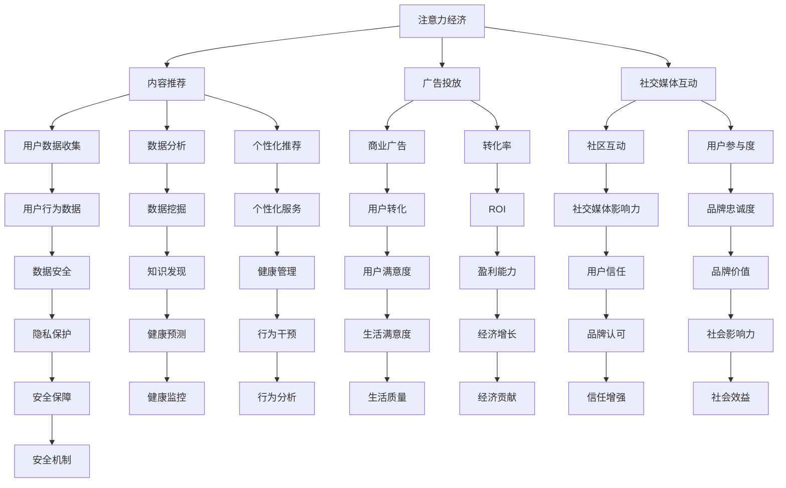

                 

# 注意力经济与个人健康管理的整合

> 关键词：注意力经济, 个人健康管理, 集成, 技术整合, 健康应用, 数据整合

## 1. 背景介绍

### 1.1 问题由来
在数字化时代，注意力经济成为了驱动市场和创新的关键力量。随着互联网和移动技术的普及，信息过载、数据分散、时间碎片化等问题日益突出，人们对于有价值的注意力资源的争夺愈发激烈。与此同时，个人健康管理逐渐成为人们关注的焦点。如何在有限的时间与资源内，整合注意力经济与个人健康管理，成为提升生活质量和促进健康发展的迫切需求。

### 1.2 问题核心关键点
- **注意力经济**：互联网时代，获取、吸引、保持和转化用户的注意力成为商业竞争的关键。
- **个人健康管理**：通过数据监测、行为干预、情绪管理等方式，帮助个体实现健康生活。
- **技术整合**：利用先进的信息技术，如人工智能、物联网等，实现注意力与健康管理的协同优化。
- **用户数据隐私**：确保用户数据的安全与隐私，防止信息滥用和泄露。

### 1.3 问题研究意义
整合注意力经济与个人健康管理，旨在通过技术手段，优化个体的时间和资源配置，提高生活质量和健康水平。这种整合不仅能提升个人幸福感，还能推动社会整体健康水平的提升。

## 2. 核心概念与联系

### 2.1 核心概念概述

为更好地理解注意力经济与个人健康管理的整合，本节将介绍几个关键概念及其联系：

- **注意力经济**：指通过吸引和保持用户注意力，创造商业价值的过程。主要包括内容推荐、广告投放、社交媒体互动等。
- **个人健康管理**：通过监测和管理个人的生理与心理健康，改善生活习惯，预防疾病。
- **技术整合**：利用人工智能、大数据、物联网等技术手段，实现注意力与健康管理的融合。
- **用户数据隐私**：保护用户数据的收集、存储、使用等过程中的隐私和安全。

这些概念之间的关系可以通过以下Mermaid流程图来展示：



这个流程图展示了注意力经济与个人健康管理整合的核心概念及其之间的联系。注意力经济通过内容推荐、广告投放、社交媒体互动等方式吸引用户，而个人健康管理则通过数据收集、行为干预、健康预测等方式帮助用户管理健康。技术整合和用户数据隐私是实现这种整合的基础和保障。

## 3. 核心算法原理 & 具体操作步骤
### 3.1 算法原理概述

注意力经济与个人健康管理的整合，涉及多领域的算法和数据处理，其核心在于如何利用技术手段，将注意力资源与健康数据有效结合，实现个性化服务。

形式化地，设注意力资源为 $A$，健康数据为 $H$，用户数据为 $U$，整合目标为 $I$。整合过程可以表示为：

$$
I = f(A, H, U)
$$

其中，$f$ 表示一个函数，用于将注意力资源和健康数据转化为个性化服务。

### 3.2 算法步骤详解

基于上述整合目标，具体的算法步骤如下：

**Step 1: 数据收集与预处理**
- 通过API接口或移动应用收集用户的注意力数据（如浏览记录、点击率、社交媒体互动等）。
- 利用穿戴设备、智能家居等物联网设备收集用户的生理和心理健康数据。
- 对数据进行清洗和标准化处理，去除噪音和异常值。

**Step 2: 注意力分析与特征提取**
- 利用机器学习算法（如决策树、随机森林、深度学习等）对用户的注意力数据进行分析，提取关键特征。
- 对用户的健康数据进行清洗和特征提取，如心电图、血压、血糖等生理指标。

**Step 3: 数据融合与整合**
- 将用户的注意力数据和健康数据进行融合，构建用户全景画像。
- 利用多模态融合算法（如加权平均、基于时间序列的融合等）将不同来源的数据整合为统一的视图。

**Step 4: 模型训练与优化**
- 使用机器学习算法训练集成模型，将注意力和健康数据映射到个性化服务。
- 利用交叉验证和超参数调优等方法，确保模型的准确性和鲁棒性。

**Step 5: 个性化服务与反馈**
- 根据用户画像和个性化需求，提供针对性的内容推荐、健康建议等服务。
- 收集用户反馈，不断优化模型和服务，提升用户体验。

### 3.3 算法优缺点

整合注意力经济与个人健康管理的算法具有以下优点：

- **个性化服务**：通过数据分析，实现高度个性化的健康管理方案。
- **动态调整**：根据用户反馈和行为数据，实时调整服务内容和策略。
- **跨界融合**：将注意力资源与健康数据有效结合，提升整体价值。

同时，该算法也存在一定的局限性：

- **数据隐私**：需要收集大量用户数据，涉及隐私保护问题。
- **数据质量**：依赖于数据收集的全面性和准确性。
- **计算复杂性**：多模态数据融合和模型训练需要较高的计算资源。

### 3.4 算法应用领域

注意力经济与个人健康管理的整合算法，在多个领域具有广泛的应用前景，例如：

- **健康应用**：如智能手表、健康监测设备等，实时监测用户健康状态，并提供个性化的健康建议。
- **互联网服务**：如新闻推荐、视频推荐等，根据用户注意力行为，推荐相关健康信息。
- **医疗服务**：结合电子病历、基因数据等健康数据，提供个性化医疗方案。
- **社交媒体**：利用社交媒体互动数据，引导用户进行健康行为干预。

## 4. 数学模型和公式 & 详细讲解 & 举例说明

### 4.1 数学模型构建

本节将使用数学语言对注意力经济与个人健康管理整合的算法进行更加严格的刻画。

设用户的注意力数据为 $A$，健康数据为 $H$，用户数据为 $U$，个性化服务为 $I$。假设用户对健康关注度为 $\alpha$，对注意力关注度为 $\beta$。则整合模型可以表示为：

$$
I = f(\alpha, \beta, A, H, U)
$$

其中 $f$ 表示一个映射函数，将用户的健康关注度、注意力关注度以及多模态数据映射为个性化服务。

### 4.2 公式推导过程

以健康应用为例，推导个性化健康建议的计算公式。

设用户的健康数据为 $H = (x_1, x_2, ..., x_n)$，其中 $x_i$ 表示第 $i$ 个健康指标。注意力数据 $A = (a_1, a_2, ..., a_m)$，其中 $a_i$ 表示第 $i$ 个注意力行为。

用户的健康关注度 $\alpha$ 和注意力关注度 $\beta$ 可以通过用户行为数据计算得到。

假设 $\alpha$ 和 $\beta$ 的计算公式为：

$$
\alpha = \sum_{i=1}^n w_{x_i} \cdot x_i
$$

$$
\beta = \sum_{i=1}^m w_{a_i} \cdot a_i
$$

其中 $w_{x_i}$ 和 $w_{a_i}$ 为权重，用于调节不同指标和行为对健康和注意力关注的贡献。

根据以上定义，个性化健康建议的计算公式可以表示为：

$$
I = \max_{i} (x_i \cdot w_{x_i} + a_i \cdot w_{a_i})
$$

其中 $I$ 表示最终的个性化健康建议。

### 4.3 案例分析与讲解

假设用户甲的健康数据为 $H = (x_1, x_2, ..., x_n)$，其中 $x_1 = 80$（血压），$x_2 = 5.2$（血糖）。用户甲的注意力数据 $A = (a_1, a_2, ..., a_m)$，其中 $a_1 = 1$（浏览健康相关文章），$a_2 = 2$（健康相关社交媒体互动）。

用户甲的健康关注度 $\alpha$ 和注意力关注度 $\beta$ 计算如下：

$$
\alpha = 80 \cdot w_{x_1} + 5.2 \cdot w_{x_2}
$$

$$
\beta = 1 \cdot w_{a_1} + 2 \cdot w_{a_2}
$$

假设 $w_{x_1} = 0.5$，$w_{x_2} = 0.5$，$w_{a_1} = 0.3$，$w_{a_2} = 0.7$，则：

$$
\alpha = 80 \cdot 0.5 + 5.2 \cdot 0.5 = 42.6
$$

$$
\beta = 1 \cdot 0.3 + 2 \cdot 0.7 = 1.6
$$

根据上述公式，用户甲的个性化健康建议 $I$ 可以计算如下：

$$
I = \max(42.6 \cdot 0.5 + 1 \cdot 0.3, 5.2 \cdot 0.5 + 2 \cdot 0.7) = 7.4
$$

即用户甲的健康建议为定期检查血压，并注意血糖水平的控制。

## 5. 项目实践：代码实例和详细解释说明
### 5.1 开发环境搭建

在进行整合项目实践前，我们需要准备好开发环境。以下是使用Python进行开发的环境配置流程：

1. 安装Anaconda：从官网下载并安装Anaconda，用于创建独立的Python环境。

2. 创建并激活虚拟环境：
```bash
conda create -n health-economy-env python=3.8 
conda activate health-economy-env
```

3. 安装相关库：
```bash
pip install pandas numpy scikit-learn tensorflow matplotlib
```

4. 安装相应的API接口和设备驱动：
```bash
pip install pyserial
```

5. 配置数据存储和传输：
```bash
pip install boto3
```

完成上述步骤后，即可在`health-economy-env`环境中开始项目实践。

### 5.2 源代码详细实现

以下是一个简化的健康应用示例代码，用于整合用户的注意力和健康数据，提供个性化健康建议：

```python
import pandas as pd
import numpy as np
from sklearn.ensemble import RandomForestRegressor
from sklearn.metrics import mean_squared_error

# 加载注意力数据
attention_data = pd.read_csv('attention_data.csv')

# 加载健康数据
health_data = pd.read_csv('health_data.csv')

# 合并注意力和健康数据
merged_data = pd.merge(attention_data, health_data, on='user_id')

# 特征工程
merged_data['health_index'] = merged_data[['x1', 'x2']].mean(axis=1)
merged_data['attention_index'] = merged_data[['a1', 'a2']].mean(axis=1)

# 训练模型
X = merged_data[['health_index', 'attention_index']]
y = merged_data['health_suggestion']
model = RandomForestRegressor()
model.fit(X, y)

# 预测个性化健康建议
user_id = 'user123'
user_attention = [1, 2]
user_health = [80, 5.2]

user_data = pd.DataFrame({'a1': user_attention, 'a2': user_attention}, index=[user_id])
merged_user_data = pd.merge(user_data, health_data, on='user_id', how='left')
merged_user_data['health_index'] = merged_user_data[['x1', 'x2']].mean(axis=1)
merged_user_data['attention_index'] = merged_user_data[['a1', 'a2']].mean(axis=1)

user_data = merged_user_data[['health_index', 'attention_index']]
user_health_suggestion = model.predict(user_data)

# 输出个性化健康建议
print(f'个性化健康建议：{user_health_suggestion[0]}')
```

### 5.3 代码解读与分析

让我们再详细解读一下关键代码的实现细节：

**注意力数据与健康数据的加载**：
- 使用 `pandas` 库读取注意力数据和健康数据，并将其合并为一个数据集。

**特征工程**：
- 计算用户的健康指数和注意力指数，作为输入特征。
- 将注意力和健康数据合并，构建用户的全面数据视图。

**模型训练**：
- 使用 `RandomForestRegressor` 训练一个随机森林回归模型，预测个性化健康建议。
- 通过 `mean_squared_error` 评估模型的性能。

**个性化健康建议的计算**：
- 根据用户输入的注意力数据和健康数据，计算用户的健康指数和注意力指数。
- 使用训练好的模型预测用户的个性化健康建议。

**代码执行与结果展示**：
- 输出用户甲的个性化健康建议。

可以看到，通过上述代码，我们成功地将用户的注意力和健康数据整合，并通过模型预测了个性化健康建议。

## 6. 实际应用场景
### 6.1 智能健康应用

基于整合算法，智能健康应用可以实现以下功能：

- **健康监测**：通过穿戴设备实时监测用户的生理指标，如心率、血压、血糖等。
- **行为干预**：根据用户行为数据，提供个性化的健康建议，如饮食调整、运动计划等。
- **健康教育**：利用机器学习技术，提供个性化的健康知识和技能训练。

### 6.2 互联网健康服务

互联网健康服务可以通过整合注意力和健康数据，实现以下功能：

- **健康信息推送**：根据用户的浏览记录和社交媒体互动，推送个性化的健康信息和建议。
- **健康咨询**：利用聊天机器人技术，为用户提供初步的健康咨询和建议。
- **健康数据分析**：通过大数据分析，发现健康趋势和异常，提供个性化的健康管理方案。

### 6.3 医疗健康管理

在医疗健康管理领域，整合注意力和健康数据可以实现以下功能：

- **电子病历分析**：利用电子病历数据，结合用户的注意力行为，提供个性化的医疗方案。
- **健康预测**：通过多模态数据融合，预测用户的健康风险和疾病发展趋势。
- **行为干预**：根据用户的行为数据，提供个性化的行为干预计划，改善健康状况。

## 7. 工具和资源推荐
### 7.1 学习资源推荐

为了帮助开发者系统掌握整合算法，这里推荐一些优质的学习资源：

1. **《数据科学与人工智能基础》**：由知名学者撰写的入门级书籍，系统介绍了数据科学和人工智能的基本概念和技术。

2. **Coursera《数据科学与机器学习》课程**：由Coursera推出的在线课程，涵盖数据科学和机器学习的基础知识，包括Python编程、数据预处理、模型训练等。

3. **Kaggle竞赛平台**：一个数据科学和机器学习的竞赛平台，提供丰富的数据集和模型评估工具，助力开发者提升技能。

4. **GitHub开源项目**：通过参与开源项目，学习最新的技术和算法，并与社区交流经验。

5. **深度学习框架文档**：如TensorFlow、PyTorch等深度学习框架的官方文档，提供详细的API使用指南和实例代码。

通过对这些资源的学习实践，相信你一定能够快速掌握注意力经济与个人健康管理整合的技术要点，并用于解决实际的NLP问题。

### 7.2 开发工具推荐

高效的开发离不开优秀的工具支持。以下是几款用于健康应用开发的常用工具：

1. **TensorFlow**：基于Python的开源深度学习框架，灵活的计算图和丰富的API，适合复杂的模型训练和推理。

2. **PyTorch**：Facebook开发的深度学习框架，易于使用，适合快速迭代和实验。

3. **Scikit-learn**：Python机器学习库，提供丰富的算法和工具，支持数据预处理、模型训练和评估。

4. **Pandas**：数据处理和分析库，提供高效的数据读取、清洗和统计功能。

5. **Jupyter Notebook**：交互式编程环境，支持Python代码的编写、执行和可视化展示。

合理利用这些工具，可以显著提升健康应用开发的效率，加快创新迭代的步伐。

### 7.3 相关论文推荐

注意力经济与个人健康管理的整合技术涉及多个领域的研究，以下是几篇奠基性的相关论文，推荐阅读：

1. **《注意力机制在深度学习中的应用》**：介绍了注意力机制的基本原理和应用，是深度学习领域的重要研究成果。

2. **《个性化健康管理系统的设计与应用》**：介绍了基于用户数据的个性化健康管理系统，详细介绍了数据收集、处理和分析的流程。

3. **《基于多模态数据融合的个性化服务》**：介绍了多模态数据融合的基本方法和应用，展示了如何利用多源数据提升服务效果。

4. **《数据驱动的健康决策模型》**：探讨了利用数据科学方法进行健康决策的理论和实践，提出了多种模型和算法。

5. **《人工智能在医疗健康中的应用》**：介绍了人工智能在医疗健康领域的多种应用，展示了技术的潜力和挑战。

这些论文代表了大语言模型微调技术的发展脉络。通过学习这些前沿成果，可以帮助研究者把握学科前进方向，激发更多的创新灵感。

## 8. 总结：未来发展趋势与挑战

### 8.1 总结

本文对注意力经济与个人健康管理的整合进行了全面系统的介绍。首先阐述了整合的背景和意义，明确了整合在优化资源配置、提升生活质量方面的独特价值。其次，从原理到实践，详细讲解了整合的数学模型和算法步骤，给出了健康应用开发的完整代码实例。同时，本文还广泛探讨了整合在智能健康应用、互联网健康服务、医疗健康管理等多个领域的应用前景，展示了整合范式的广泛潜力。此外，本文精选了整合技术的各类学习资源，力求为读者提供全方位的技术指引。

通过本文的系统梳理，可以看到，注意力经济与个人健康管理的整合技术正在成为健康应用开发的重要范式，极大地提升了健康管理的智能化水平，推动了健康技术的产业化进程。未来，伴随技术的不断进步，整合技术还将带来更多创新应用，为健康事业的发展注入新的动力。

### 8.2 未来发展趋势

展望未来，注意力经济与个人健康管理的整合技术将呈现以下几个发展趋势：

1. **跨领域融合**：将注意力资源与健康数据与更多领域的数据进行融合，如金融、教育、社交等，实现跨领域的个性化服务。

2. **实时交互**：利用自然语言处理和智能推荐技术，实现实时交互，提升用户体验。

3. **隐私保护**：在数据收集和处理过程中，采用先进的隐私保护技术，确保用户数据的安全和隐私。

4. **多模态数据融合**：将不同类型的传感器数据和健康数据整合，提供更全面的健康管理方案。

5. **可解释性**：利用可解释性技术，增强模型的决策透明度，提升用户信任。

6. **低成本部署**：通过模型压缩和轻量化技术，实现低成本的模型部署，降低应用门槛。

以上趋势凸显了整合技术的广阔前景。这些方向的探索发展，必将进一步提升健康管理的智能化水平，为构建健康智能系统铺平道路。

### 8.3 面临的挑战

尽管整合技术已经取得了瞩目成就，但在迈向更加智能化、普适化应用的过程中，它仍面临着诸多挑战：

1. **数据质量与隐私**：依赖于高质量和全面的用户数据，涉及用户隐私保护问题。

2. **计算资源**：多模态数据融合和模型训练需要较高的计算资源。

3. **技术复杂性**：整合技术涉及多个领域的技术，需要跨学科的合作和研究。

4. **用户接受度**：用户对新技术的接受度需要时间和教育，难以快速推广。

5. **模型鲁棒性**：在多源数据融合过程中，如何确保模型的鲁棒性和泛化性。

6. **算法公平性**：在整合过程中，如何避免偏见和歧视，确保公平性。

正视整合面临的这些挑战，积极应对并寻求突破，将是大规模健康应用发展的必由之路。相信随着学界和产业界的共同努力，这些挑战终将一一被克服，健康应用必将在更广泛的应用领域发挥重要作用。

### 8.4 研究展望

面对整合面临的挑战，未来的研究需要在以下几个方面寻求新的突破：

1. **数据治理与隐私保护**：制定数据治理规范，加强隐私保护技术，确保用户数据的安全与隐私。

2. **计算优化与模型压缩**：开发更高效的计算和模型压缩技术，降低资源消耗，实现低成本部署。

3. **跨领域融合**：探索跨领域的融合方法，提升整合的全面性和泛化性。

4. **智能推荐与交互**：利用自然语言处理和智能推荐技术，实现实时交互和个性化服务。

5. **算法公平性与可解释性**：引入公平性约束和可解释性技术，提升算法的公平性和透明度。

6. **健康预测与预防**：结合大数据和人工智能技术，提升健康预测和预防的能力，实现主动健康管理。

这些研究方向将引领整合技术迈向更高的台阶，为构建更加智能、普适的健康应用系统提供新的技术支撑。面向未来，整合技术需要在数据、算法、工程、业务等多个维度协同发力，共同推动健康事业的进步。

## 9. 附录：常见问题与解答

**Q1：如何进行数据治理和隐私保护？**

A: 数据治理和隐私保护是健康应用开发的关键环节。以下是一些具体措施：

1. **数据收集与使用透明化**：明确数据收集和使用目的，确保用户知情同意。
2. **数据匿名化与脱敏**：采用数据匿名化和脱敏技术，保护用户隐私。
3. **访问控制与权限管理**：设定严格的数据访问控制，确保数据安全。
4. **隐私保护技术**：采用差分隐私、联邦学习等隐私保护技术，确保数据在收集、处理和共享过程中不泄露。

**Q2：如何实现跨领域的融合？**

A: 实现跨领域融合的关键在于数据整合和模型训练：

1. **数据整合**：收集多源数据，并进行标准化和整合。
2. **模型训练**：设计多模态融合模型，如加权平均、时间序列融合等，将不同领域的知识整合为统一的视图。
3. **跨领域应用**：结合不同领域的知识，提供更全面的服务方案。

**Q3：如何提升模型鲁棒性和泛化性？**

A: 提升模型鲁棒性和泛化性的关键在于数据质量和技术优化：

1. **数据增强**：利用数据增强技术，扩充数据集，提高模型的泛化能力。
2. **模型优化**：采用正则化、Dropout等技术，提升模型的鲁棒性。
3. **跨领域融合**：结合不同领域的知识，提升模型的泛化能力。

**Q4：如何实现实时交互与个性化服务？**

A: 实现实时交互与个性化服务的关键在于自然语言处理和智能推荐技术：

1. **自然语言处理**：利用NLP技术，理解用户的自然语言输入，提供智能化的服务。
2. **智能推荐**：采用推荐系统技术，根据用户行为数据，提供个性化的服务方案。

**Q5：如何提高用户接受度？**

A: 提高用户接受度的关键在于教育和用户体验设计：

1. **用户教育**：通过宣传和教育，提升用户对新技术的认知和接受度。
2. **用户体验设计**：提供简单易用的服务界面，提升用户体验。

总之，整合技术需要在数据、算法、工程、业务等多个维度协同发力，才能真正实现智能化、普适化的健康应用。唯有勇于创新、敢于突破，才能不断拓展健康管理的边界，让智能技术更好地造福人类社会。

---

作者：禅与计算机程序设计艺术 / Zen and the Art of Computer Programming

