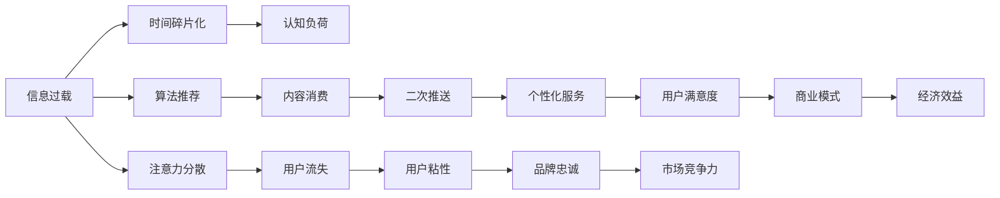

                 

# 注意力经济与个人时间价值观的转变

注意力经济（Economy of Attention），作为数字时代的产物，深刻影响着当代社会的经济结构与个人行为。随着互联网和移动互联网的普及，信息过载现象日益严重，人们如何处理和分配有限的时间资源成为一项重要课题。本文旨在探讨注意力经济对个人时间价值观的转变，分析注意力经济的运行机制，并提出若干建议以帮助个体适应这一变化。

## 1. 背景介绍

### 1.1 问题由来

在互联网早期，信息稀缺，人们只需耗费较少时间就能找到有用信息。但随着信息爆炸，用户面临的信息选择范围急剧扩大，注意力成为一种稀缺资源。据研究表明，人类注意力每3秒会分散一次，这意味着信息流必须每3秒更新一次，才能维持用户注意力的持续。

这一现象引发了诸多问题：
- **信息过载**：用户难以消化海量信息，导致选择困难。
- **分心困扰**：频繁的信息切换使得专注力受损。
- **时间碎片化**：人们的注意力分散，工作和学习时间变得零碎。
- **认知负担**：不断切换的信息流增加了用户的认知负荷。

### 1.2 问题核心关键点

注意力经济的核心在于：
- **稀缺性与价值性**：注意力作为一项稀缺资源，其价值逐渐被企业所重视。
- **分配机制**：互联网平台通过算法、推荐等手段，控制用户注意力流的分配。
- **个人时间管理**：如何在信息泛滥的环境中有效管理个人时间，成为新的挑战。

### 1.3 问题研究意义

理解注意力经济对个人时间价值观的转变，对于个体提升时间利用效率、优化生活和工作方式具有重要意义。本文将深入探讨注意力经济的内涵，以及如何通过技术手段提升个人的时间管理和注意力管理能力。

## 2. 核心概念与联系

### 2.1 核心概念概述

为更好地理解注意力经济及其对个人时间价值观的影响，本节将介绍几个关键概念：

- **注意力经济**：基于信息的经济模式，利用用户注意力资源创造价值。
- **信息过载**：在信息量远超个人处理能力的情况下，信息给用户造成的负担。
- **算法推荐**：利用数据分析和机器学习技术，推荐最符合用户兴趣的内容。
- **时间碎片化**：个人时间被分割成若干短时段，难以形成连续专注时间。
- **认知负荷**：因频繁切换任务和信息，导致心理和生理上的负担。

这些概念之间存在密切联系，共同构成了一个复杂的生态系统。我们将通过一个Mermaid流程图来展示这些概念之间的关系：



这个流程图展示了注意力经济中的各个环节及其相互关系：
- 信息过载导致用户注意力分散，进而引发时间碎片化和认知负荷。
- 算法推荐通过个性化服务提升用户满意度，增强品牌忠诚度，最终提升市场竞争力和经济效益。

## 3. 核心算法原理 & 具体操作步骤

### 3.1 算法原理概述

注意力经济的运行原理基于以下几个核心假设：
- 用户对信息的选择并非随机，而是有偏好的。
- 用户对信息的消费习惯具有高度可预测性。
- 通过精确的算法推荐，可以显著提升用户满意度和留存率。

基于上述假设，平台通过数据收集和机器学习技术，实时分析用户的行为和偏好，然后通过推荐算法向用户推送最相关的内容。推荐算法主要包括协同过滤、内容推荐、混合推荐等技术，通过这些算法，平台能够实现精准投放，提升用户的留存率和转化率。

### 3.2 算法步骤详解

以协同过滤算法为例，其基本步骤如下：

1. **数据收集**：收集用户行为数据，如浏览历史、点击行为、购买记录等。
2. **用户建模**：将用户行为转化为向量表示，用于描述用户的兴趣偏好。
3. **项目建模**：将物品特征（如标题、描述、标签等）转化为向量表示。
4. **相似度计算**：计算用户和项目之间的相似度。
5. **推荐计算**：根据用户和项目的相似度，生成推荐结果。

### 3.3 算法优缺点

协同过滤算法的优点在于：
- **个性化**：能够根据用户的历史行为，提供个性化的推荐。
- **可扩展性**：随着数据量的增加，算法的性能可以持续提升。

其缺点包括：
- **冷启动问题**：新用户或新物品没有足够的历史数据，难以进行推荐。
- **数据稀疏性**：用户行为数据稀疏，可能导致推荐准确率下降。
- **协同攻击**：存在通过攻击增加恶意物品的曝光率的可能性。

### 3.4 算法应用领域

注意力经济的应用领域非常广泛，包括但不限于：
- **电子商务**：推荐商品、优化广告投放。
- **内容平台**：推荐文章、视频等媒体内容。
- **社交媒体**：推荐好友、优化广告投放。
- **娱乐应用**：推荐游戏、音乐等。

## 4. 数学模型和公式 & 详细讲解 & 举例说明

### 4.1 数学模型构建

注意力经济的核心在于推荐算法，其中协同过滤算法最为常用。以下是一个基本的协同过滤推荐模型：

设用户集为 $U=\{u_1,u_2,...,u_m\}$，物品集为 $I=\{i_1,i_2,...,i_n\}$。设用户 $u_i$ 对物品 $i_j$ 的评分 $r_{i,j}$ 服从 $r_{i,j} \sim Normal(\mu_{i,j},\sigma_{i,j})$。

用户 $u_i$ 对物品 $i_j$ 的评分 $r_{i,j}$ 可以表示为：

$$
r_{i,j}=\alpha_i \alpha_j^T x_{i,j}
$$

其中 $\alpha_i$ 和 $\alpha_j$ 是用户 $u_i$ 和物品 $i_j$ 的特征向量，$x_{i,j}$ 是用户 $u_i$ 和物品 $i_j$ 的交互特征。

### 4.2 公式推导过程

协同过滤算法的核心是用户和物品的相似度计算。以余弦相似度为例，计算两个向量 $\alpha_i$ 和 $\alpha_j$ 的余弦相似度：

$$
\text{Sim}(\alpha_i,\alpha_j)=\frac{\alpha_i^T \alpha_j}{||\alpha_i|| \cdot ||\alpha_j||}
$$

对于用户 $u_i$ 的推荐物品 $i_j$，可以使用以下公式：

$$
\text{Top}(i_j,u_i)=\text{argmax}_{i_k \in I} (\text{Sim}(\alpha_i,\alpha_k) \cdot r_{k,j})
$$

### 4.3 案例分析与讲解

假设用户 $u_1$ 和物品 $i_1,i_2,i_3$ 的评分分别为 $r_{1,1}=4,r_{1,2}=2,r_{1,3}=1$。物品 $i_1,i_2,i_3$ 的评分分别为 $r_{1,1}=4,r_{2,2}=3,r_{3,3}=5$。

设物品 $i_1,i_2,i_3$ 的特征向量分别为 $\alpha_1=[1,1,1]^T,\alpha_2=[1,0,0]^T,\alpha_3=[0,1,1]^T$。用户 $u_1$ 的特征向量 $\alpha_1=[0.5,0.5,0]^T$。

计算 $u_1$ 对物品 $i_2,i_3$ 的评分：

$$
r_{1,2}=\alpha_1^T \alpha_2 \cdot r_{1,2}=\alpha_1^T \alpha_2 \cdot 2=1
$$

$$
r_{1,3}=\alpha_1^T \alpha_3 \cdot r_{1,3}=\alpha_1^T \alpha_3 \cdot 1=0.5
$$

因此，物品 $i_2$ 的排名高于物品 $i_3$，推荐物品 $i_2$ 给用户 $u_1$。

## 5. 项目实践：代码实例和详细解释说明

### 5.1 开发环境搭建

在进行协同过滤推荐系统开发前，我们需要准备好开发环境。以下是使用Python进行Scikit-learn开发的环境配置流程：

1. 安装Anaconda：从官网下载并安装Anaconda，用于创建独立的Python环境。

2. 创建并激活虚拟环境：
```bash
conda create -n skl-env python=3.8 
conda activate skl-env
```

3. 安装Scikit-learn：
```bash
conda install scikit-learn
```

4. 安装NumPy：
```bash
pip install numpy
```

5. 安装Pandas：
```bash
pip install pandas
```

6. 安装Matplotlib：
```bash
pip install matplotlib
```

完成上述步骤后，即可在`skl-env`环境中开始协同过滤推荐系统的开发。

### 5.2 源代码详细实现

下面是一个简单的协同过滤推荐系统示例，包括数据加载、用户建模、物品建模、相似度计算和推荐生成等步骤：

```python
import numpy as np
from sklearn.metrics.pairwise import cosine_similarity

# 加载数据
data = {
    'users': ['u1', 'u2', 'u3'],
    'items': ['i1', 'i2', 'i3'],
    'ratings': {
        'u1': {'i1': 4, 'i2': 2, 'i3': 1},
        'u2': {'i1': 1, 'i2': 3},
        'u3': {'i3': 5}
    }
}

# 用户特征向量和物品特征向量
user_features = {
    'u1': np.array([0.5, 0.5, 0]),
    'u2': np.array([0.5, 0.5, 0]),
    'u3': np.array([0, 0.5, 0.5])
}
item_features = {
    'i1': np.array([1, 1, 1]),
    'i2': np.array([1, 0, 0]),
    'i3': np.array([0, 1, 1])
}

# 相似度计算
def similarity(user, item):
    return cosine_similarity(user_features[user], item_features[item])[0][0]

# 推荐生成
def recommend(user, top_n=5):
    scores = {}
    for item, rating in data['ratings'][user].items():
        similarity_score = similarity(user, item)
        if item not in scores or similarity_score > scores[item]:
            scores[item] = similarity_score
    sorted_scores = sorted(scores.items(), key=lambda x: x[1], reverse=True)
    return sorted_scores[:top_n]

# 测试推荐系统
print(recommend('u1'))
```

以上代码实现了简单的协同过滤推荐系统，可以用于小规模的推荐测试。

### 5.3 代码解读与分析

让我们再详细解读一下关键代码的实现细节：

**数据加载**：
- 通过一个简单的字典数据结构，加载了用户、物品和评分数据。

**用户建模和物品建模**：
- 用户和物品的特征向量分别为 $[0.5, 0.5, 0]^T$ 和 $[1, 1, 1]^T$，即用户对每个物品评分都是等价的。

**相似度计算**：
- 使用余弦相似度计算用户和物品之间的相似度。

**推荐生成**：
- 通过计算每个物品的评分和相似度，生成推荐列表。

可以看到，协同过滤算法在代码实现上并不复杂，但在实际应用中，需要处理大规模数据集，并考虑多维特征空间的表示和学习。这需要进一步的技术优化和工程实践。

## 6. 实际应用场景

### 6.1 智能推荐系统

智能推荐系统是注意力经济的核心应用场景之一。通过算法推荐，电商、视频、音乐等平台能够显著提升用户满意度，增强用户粘性。

在技术实现上，平台需要收集用户的浏览、点击、购买等行为数据，构建用户和物品的特征向量，然后通过协同过滤算法或深度学习模型，生成个性化推荐列表。用户点击率、购买率等指标可以用于评估推荐系统的效果，并不断迭代优化推荐模型。

### 6.2 个性化广告

个性化广告是注意力经济的另一重要应用场景。广告主通过算法推荐，能够精准投放广告，提高广告转化率。

在广告投放过程中，需要收集用户的搜索、浏览、点击等行为数据，构建用户画像。然后通过协同过滤算法或深度学习模型，生成个性化广告内容，实现广告的精准投放。广告主可以通过广告效果分析，优化广告投放策略，提升广告ROI。

### 6.3 内容推荐平台

内容推荐平台如Netflix、YouTube等，通过算法推荐，能够提升用户体验，增加用户粘性。

在内容推荐中，需要收集用户的观看历史、评分记录等行为数据，构建用户画像。然后通过协同过滤算法或深度学习模型，推荐用户感兴趣的内容。平台可以根据用户观看行为，动态调整推荐策略，实现个性化推荐。

## 7. 工具和资源推荐

### 7.1 学习资源推荐

为了帮助开发者掌握注意力经济的原理和实践，这里推荐一些优质的学习资源：

1. 《推荐系统实践》系列博文：由业界专家撰写，详细介绍推荐算法、推荐系统架构等核心内容。

2. 《推荐系统》课程：斯坦福大学开设的在线课程，涵盖推荐系统的理论基础和实际应用。

3. 《推荐系统实战》书籍：深入浅出地介绍推荐算法的实现细节和优化方法。

4. Coursera上的《数据科学专项课程》：包括推荐系统、数据科学等核心内容，适合系统学习。

5. Kaggle上的推荐系统竞赛：通过实际比赛项目，提升推荐算法实战能力。

通过对这些资源的学习，相信你能够掌握注意力经济的原理，并应用于推荐系统开发中。

### 7.2 开发工具推荐

高效的开发离不开优秀的工具支持。以下是几款用于注意力经济应用开发的常用工具：

1. Python：基于Python的开源深度学习框架，适合快速迭代研究。许多推荐算法都有Python版本的实现。

2. Scikit-learn：简单易用的机器学习库，支持协同过滤算法等推荐算法。

3. TensorFlow：由Google主导开发的深度学习框架，适合大规模工程应用。

4. Apache Spark：适合大数据处理和分析，可用于推荐系统的数据预处理和特征计算。

5. Jupyter Notebook：支持交互式编程和数据分析，适合开发和测试推荐算法。

合理利用这些工具，可以显著提升推荐系统的开发效率，加快创新迭代的步伐。

### 7.3 相关论文推荐

注意力经济的研究源于学界的持续探索。以下是几篇奠基性的相关论文，推荐阅读：

1. 《推荐系统基础》：Ian F. King 著，详细介绍了推荐系统的理论基础和实践应用。

2. 《协同过滤推荐系统》：L. Koren 著，系统介绍协同过滤算法的设计和实现。

3. 《深度学习在推荐系统中的应用》：深度学习专家DeepLearning.AI的介绍，涵盖深度学习在推荐系统中的应用。

4. 《个性化推荐算法》：Rendong Chi 著，详细介绍个性化推荐算法的原理和实现。

这些论文代表了推荐系统的研究脉络。通过学习这些前沿成果，可以帮助研究者把握学科前进方向，激发更多的创新灵感。

## 8. 总结：未来发展趋势与挑战

### 8.1 总结

本文对注意力经济及其对个人时间价值观的转变进行了全面系统的探讨。首先阐述了注意力经济的内涵和核心假设，深入分析了其对个人时间管理和行为的影响。其次，从原理到实践，详细讲解了注意力经济的关键算法和操作步骤，给出了推荐系统开发的完整代码实例。同时，本文还广泛探讨了注意力经济在多个行业领域的应用场景，展示了其广泛的应用价值。

通过本文的系统梳理，可以看到，注意力经济正在成为数字时代的重要经济形态，其对个人时间管理的影响深远而广泛。在未来的发展中，需要更多研究者和开发者共同努力，探索新的算法和技术，提升推荐系统的精准度和用户满意度。

### 8.2 未来发展趋势

展望未来，注意力经济将呈现以下几个发展趋势：

1. **深度学习与协同过滤融合**：深度学习算法能够更好地处理大规模非结构化数据，未来将与协同过滤算法融合，提升推荐系统的精度和效果。

2. **实时推荐系统**：实时推荐系统能够更好地响应用户行为变化，提升用户体验。需要采用流计算、在线学习等技术，实现动态推荐。

3. **多模态推荐**：除了文本、图片等传统模态，未来的推荐系统将融合语音、视频等多模态信息，提供更全面、个性化的推荐。

4. **跨领域推荐**：未来的推荐系统将跨越不同领域，实现跨领域内容的推荐。如跨领域用户画像和物品特征的协同学习。

5. **推荐系统的伦理与公平性**：随着推荐系统应用的广泛，其伦理和公平性问题将日益受到关注。未来需要设计更加透明、公平的推荐算法，避免偏见和歧视。

这些趋势凸显了注意力经济技术的持续发展和演进，未来的研究将更加注重技术融合和应用伦理。

### 8.3 面临的挑战

尽管注意力经济在发展过程中取得了诸多进展，但在迈向更加智能化、普适化应用的过程中，仍然面临诸多挑战：

1. **数据隐私问题**：用户数据的收集和使用需要严格遵守隐私保护法规，如何在保护隐私的同时，实现精准推荐，仍是一大难题。

2. **算法透明性**：推荐算法的复杂性使得其决策过程难以解释，如何增强算法的透明性和可解释性，提升用户信任度，是一个重要问题。

3. **算法偏见**：推荐系统容易受到数据偏见的干扰，导致不公平的推荐结果。如何消除算法偏见，提升推荐公平性，是未来的研究方向。

4. **数据稀疏性**：新用户和物品没有足够的历史数据，难以进行有效推荐。如何处理数据稀疏性问题，是提升推荐系统性能的关键。

5. **用户疲劳**：频繁的个性化推荐可能导致用户疲劳，降低用户对推荐系统的粘性。如何缓解用户疲劳，提升用户满意度，是推荐系统优化的一个重要方向。

6. **系统可扩展性**：随着用户和物品规模的扩大，推荐系统需要具备高可扩展性，以支撑大规模数据处理。

这些挑战需要研究者和开发者共同面对，并在技术创新和应用实践中不断突破。

### 8.4 研究展望

未来的研究需要在以下几个方面寻求新的突破：

1. **多源数据融合**：将多源数据进行融合，提升推荐系统的综合能力。包括文本、图片、语音等多模态数据的融合。

2. **联邦学习**：在保障用户隐私的前提下，实现分布式协同学习，提升推荐系统的公平性和鲁棒性。

3. **因果推断**：引入因果推断方法，分析推荐系统的影响机制，提升推荐决策的科学性。

4. **可解释推荐**：设计可解释性推荐算法，帮助用户理解推荐结果的来源和逻辑，提升用户信任度。

5. **多任务推荐**：将推荐系统与其他任务（如问答、阅读理解等）相结合，实现多任务协同优化。

6. **跨领域推荐**：跨领域推荐技术将提升推荐系统的泛化能力和应用范围，推动推荐系统的创新。

这些研究方向将引领注意力经济技术的进一步发展，推动推荐系统向着更加精准、高效、公平的方向迈进。

## 9. 附录：常见问题与解答

**Q1：注意力经济如何影响个人时间管理？**

A: 注意力经济使得个人时间管理变得更加复杂和多样。一方面，用户需要在海量信息中高效筛选，优化时间利用效率。另一方面，频繁的信息切换和推荐，增加了认知负荷，导致时间管理更加分散和零碎。

**Q2：推荐算法有哪些类型？**

A: 推荐算法主要分为三大类：基于内容的推荐、协同过滤推荐和混合推荐。
- 基于内容的推荐：利用物品特征，推荐与用户偏好相似的物品。
- 协同过滤推荐：通过用户行为数据，预测用户对物品的评分。
- 混合推荐：结合多种推荐算法，提升推荐系统的精度和效果。

**Q3：如何处理数据稀疏性问题？**

A: 数据稀疏性是推荐系统面临的常见问题，主要通过以下方法解决：
- 用户画像扩展：通过多源数据融合，丰富用户画像，缓解数据稀疏性。
- 物品特征扩展：通过特征工程，增加物品特征，提升推荐效果。
- 基于深度学习的方法：利用深度学习模型，预测用户对新物品的评分，缓解数据稀疏性问题。

**Q4：推荐系统面临的伦理挑战有哪些？**

A: 推荐系统面临的伦理挑战包括：
- 数据隐私：用户数据的收集和使用需要严格遵守隐私保护法规。
- 算法透明性：推荐算法的复杂性使得其决策过程难以解释，用户难以理解推荐结果的来源。
- 算法偏见：推荐系统容易受到数据偏见的干扰，导致不公平的推荐结果。

**Q5：推荐系统如何处理用户疲劳？**

A: 用户疲劳是推荐系统面临的一个问题，主要通过以下方法解决：
- 推荐多样性：推荐多样性能够降低用户疲劳，提升用户对推荐系统的满意度。
- 推荐频率控制：通过控制推荐频率，降低用户对推荐系统的依赖。
- 推荐间隔调整：调整推荐间隔，避免频繁的推荐对用户造成干扰。

总之，注意力经济对个人时间价值观的转变带来了深远的影响。通过理解和应对这一变化，未来可以开发出更加高效、智能、公平的推荐系统，提升用户的体验和生活质量。

---

作者：禅与计算机程序设计艺术 / Zen and the Art of Computer Programming

