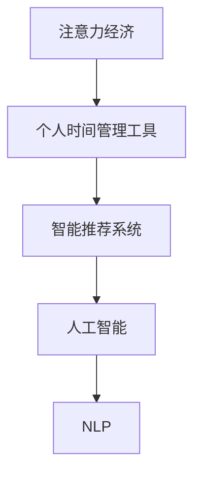

                 

# 注意力经济与个人时间管理工具的发展

## 1. 背景介绍

### 1.1 问题由来
在信息爆炸的时代，人们每天都会面对海量的信息和任务。如何高效地筛选和管理信息，优化个人时间分配，成为现代人必须面对的问题。以工作效率为核心的注意力经济（Attention Economy）应运而生。注意力经济指的是通过提供精准、高效的信息和服务，引导人们的注意力，从而创造价值。

### 1.2 问题核心关键点
注意力经济的核心在于如何合理分配个人注意力，提升信息获取和处理的效率。个人时间管理工具（Personal Time Management Tools）正是为了解决这一问题而诞生的。这些工具通过自动化、智能化的方法，帮助用户高效管理时间，分配注意力，从而提升生产力和生活满意度。

### 1.3 问题研究意义
研究个人时间管理工具的发展，对于提升个体效率、优化资源配置、推动社会生产力的进步具有重要意义。能够帮助人们更好地平衡工作与生活，实现自我价值，同时也能为企业提供高效人力资源，提升企业竞争力。

## 2. 核心概念与联系

### 2.1 核心概念概述

为更好地理解注意力经济与个人时间管理工具的发展，本节将介绍几个关键概念：

- 注意力经济（Attention Economy）：指在信息过载时代，通过优化信息的传播和接收，集中用户注意力，从而创造经济价值的过程。
- 个人时间管理工具（Personal Time Management Tools）：利用算法和人工智能技术，帮助用户自动安排时间、分配注意力，提升工作效率和生活质量的工具。
- 智能推荐系统（Recommendation System）：通过分析用户行为和偏好，提供个性化推荐，优化用户体验的技术。
- 人工智能（AI）：涵盖机器学习、深度学习、自然语言处理等领域，为智能推荐系统提供技术支撑。
- 自然语言处理（NLP）：使计算机能够理解和生成人类语言，提升人机交互的自然性和智能性。

这些概念之间存在紧密的联系，形成一个完整的信息生态系统。注意力经济提供了经济价值导向，个人时间管理工具是实现这一价值的技术手段，智能推荐系统和人工智能为其提供了技术和方法支撑。

### 2.2 核心概念原理和架构的 Mermaid 流程图



## 3. 核心算法原理 & 具体操作步骤

### 3.1 算法原理概述

基于注意力经济和人工智能技术的个人时间管理工具，主要采用推荐系统作为核心算法。推荐系统通过分析用户行为数据，预测用户需求，并根据预测结果推荐内容或任务。推荐系统的原理主要包括：

- 用户兴趣模型：通过分析用户历史行为数据，建立用户兴趣模型，预测用户对不同内容的偏好。
- 协同过滤：根据用户相似性，推荐用户未曾体验过的内容，利用群体智慧提升推荐效果。
- 内容推荐：根据内容特征，选择与用户兴趣相符的内容进行推荐，提高信息相关性和用户体验。
- 时间优化：结合用户的工作和生活节奏，优化内容推荐时间，提升用户满意度和工作效率。

### 3.2 算法步骤详解

#### 3.2.1 用户兴趣模型

用户兴趣模型（User Interest Model）是推荐系统的基础。通过收集用户的浏览、点击、搜索、评分等行为数据，建立用户画像，预测用户对不同内容的兴趣程度。用户兴趣模型通常基于以下步骤：

1. 数据收集：收集用户的历史行为数据，包括浏览记录、搜索记录、评分记录等。
2. 特征提取：提取用户行为数据中的特征，如点击次数、停留时间、评分等。
3. 特征融合：将不同特征进行融合，得到用户兴趣向量。
4. 模型训练：使用机器学习算法训练用户兴趣模型，如协同过滤算法、深度学习模型等。

#### 3.2.2 协同过滤

协同过滤（Collaborative Filtering）是一种基于用户群体智慧的推荐方法。通过分析用户之间的相似性，推荐用户未曾体验过的内容，从而提升推荐效果。协同过滤通常分为两种类型：

1. 用户协同过滤：根据用户历史行为，找到与目标用户兴趣相似的用户，推荐其未体验过的内容。
2. 物品协同过滤：根据物品的相似性，找到与目标物品相似的其他物品，推荐给用户。

协同过滤算法通常使用基于矩阵分解的方法，如矩阵分解法、奇异值分解等，将用户和物品的兴趣特征矩阵分解为用户因子矩阵和物品因子矩阵，从而得到用户的兴趣预测值。

#### 3.2.3 内容推荐

内容推荐（Content-Based Recommendation）是根据内容的特征，选择与用户兴趣相符的内容进行推荐。内容推荐通常使用文本分类、聚类等技术，分析内容的特征，建立内容-用户兴趣映射。

1. 文本分类：使用自然语言处理技术，对内容进行分类，将其划分为不同主题或类别。
2. 文本聚类：使用聚类算法，将相似内容分组，找到与用户兴趣相符的内容集合。
3. 内容评分：根据内容特征和用户兴趣模型，对内容进行评分，选择评分较高的内容进行推荐。

#### 3.2.4 时间优化

时间优化（Time Optimization）是提升推荐系统效果的重要方法。通过分析用户的工作和生活节奏，调整推荐时间，提高用户满意度和工作效率。时间优化通常包括以下步骤：

1. 时间分片：将用户的工作和生活时间分成不同的时间段。
2. 时间段分析：分析用户在不同时间段的行为特征和兴趣变化。
3. 时间推荐：根据时间段分析结果，优化推荐内容和时间，提高用户满意度和工作效率。

### 3.3 算法优缺点

个人时间管理工具的推荐系统具有以下优点：

- 个性化推荐：通过分析用户行为数据，提供精准的个性化推荐，提升用户体验。
- 高效资源利用：优化信息传播和接收，集中用户注意力，提高信息利用效率。
- 智能化决策：利用人工智能算法，实时调整推荐内容和时间，提升推荐效果。

同时，这些系统也存在一些局限性：

- 数据隐私问题：收集用户行为数据时，涉及数据隐私和安全问题，需要严格的数据保护措施。
- 推荐偏差：基于用户历史数据进行推荐，可能存在推荐偏差，影响推荐效果。
- 用户体验问题：过度依赖推荐系统，可能导致用户丧失主动选择的能力，降低用户体验。
- 算法复杂度：推荐系统算法复杂度高，需要大量计算资源，对硬件设备要求较高。

### 3.4 算法应用领域

个人时间管理工具的推荐系统已经在多个领域得到广泛应用，例如：

- 新闻阅读平台：通过分析用户浏览记录，推荐用户感兴趣的新闻文章。
- 视频流媒体平台：根据用户观看历史和评分，推荐用户喜爱的视频内容。
- 电子商务平台：根据用户购买记录和评分，推荐相关商品。
- 社交媒体平台：分析用户互动数据，推荐相关内容或好友。
- 在线教育平台：根据用户学习记录和评分，推荐相关课程和教材。

## 4. 数学模型和公式 & 详细讲解 & 举例说明

### 4.1 数学模型构建

推荐系统的数学模型通常基于协同过滤和内容推荐两种方法，这里以协同过滤为例，构建推荐系统的数学模型。

假设用户集合为 $U$，物品集合为 $I$，用户对物品的评分矩阵为 $R$，每个用户对物品的评分表示为 $r_{ui}$。协同过滤的目标是通过分析用户之间的相似性，预测用户对物品的评分，选择评分较高的物品进行推荐。

协同过滤的数学模型可以表示为：

$$
\hat{r}_{ui} = \mathbf{u}_i^T\mathbf{v}_u
$$

其中 $\mathbf{u}_i$ 和 $\mathbf{v}_u$ 分别为物品 $i$ 和用户 $u$ 的因子向量，$\hat{r}_{ui}$ 为预测的评分值。

### 4.2 公式推导过程

协同过滤的推导过程如下：

1. 将评分矩阵 $R$ 分解为用户因子矩阵 $\mathbf{U}$ 和物品因子矩阵 $\mathbf{V}$：
$$
R \approx \mathbf{U}\mathbf{V}^T
$$

2. 计算用户 $u$ 对物品 $i$ 的预测评分 $\hat{r}_{ui}$：
$$
\hat{r}_{ui} = \mathbf{u}_i^T\mathbf{v}_u
$$

3. 对预测评分进行归一化，得到推荐得分 $p_{ui}$：
$$
p_{ui} = \frac{\hat{r}_{ui}}{\sqrt{\sum_k v_{ki}^2}}\times \frac{\hat{r}_{ui}}{\sqrt{\sum_k u_{uk}^2}}
$$

4. 根据推荐得分 $p_{ui}$，选择评分较高的物品进行推荐。

### 4.3 案例分析与讲解

以下是一个简单的协同过滤案例：

假设有一个评分矩阵 $R$，表示用户对电影的评分，其中 $u$ 表示用户，$i$ 表示电影，$R_{ui}$ 表示用户 $u$ 对电影 $i$ 的评分。

| 用户 | 电影1 | 电影2 | 电影3 | 电影4 |
| --- | --- | --- | --- | --- |
| 用户A | 4 | 2 | 3 | 1 |
| 用户B | 3 | 5 | 2 | 0 |
| 用户C | 2 | 0 | 4 | 5 |
| 用户D | 1 | 4 | 5 | 3 |

通过奇异值分解，将评分矩阵 $R$ 分解为 $\mathbf{U}$ 和 $\mathbf{V}^T$。

$$
R \approx \mathbf{U}\mathbf{V}^T
$$

$$
\mathbf{U} = \begin{bmatrix} 0.5 & 0.3 \\ -0.5 & 0.3 \\ 0 & -0.6 \\ 0 & 0.8 \end{bmatrix}, \mathbf{V}^T = \begin{bmatrix} 0.4 & -0.3 & 0.1 & 0.2 \\ 0.2 & 0.3 & 0.8 & -0.3 \end{bmatrix}
$$

对用户 $u$ 对电影 $i$ 的预测评分进行计算：

$$
\hat{r}_{A1} = 0.5 \times 0.4 = 0.2
$$

$$
\hat{r}_{B2} = -0.5 \times 0.3 = -0.15
$$

$$
\hat{r}_{C3} = 0 \times 0.1 = 0
$$

$$
\hat{r}_{D4} = 0.8 \times 0.3 = 0.24
$$

将预测评分归一化，得到推荐得分 $p_{ui}$：

$$
p_{A1} = \frac{0.2}{\sqrt{0.5^2 + (-0.5)^2}} \times \frac{0.2}{\sqrt{0.4^2 + (-0.3)^2}} = 0.2
$$

$$
p_{B2} = \frac{-0.15}{\sqrt{(-0.5)^2 + 0.3^2}} \times \frac{-0.15}{\sqrt{0.2^2 + 0.3^2}} = 0.15
$$

$$
p_{C3} = \frac{0}{\sqrt{0^2 + 0^2}} \times \frac{0}{\sqrt{0^2 + 0.1^2}} = 0
$$

$$
p_{D4} = \frac{0.24}{\sqrt{0.8^2 + 0.3^2}} \times \frac{0.24}{\sqrt{0.2^2 + 0.8^2}} = 0.24
$$

最终，根据推荐得分 $p_{ui}$，选择评分较高的电影进行推荐，如电影1和电影4。

## 5. 项目实践：代码实例和详细解释说明

### 5.1 开发环境搭建

在进行推荐系统开发前，我们需要准备好开发环境。以下是使用Python进行PyTorch开发的环境配置流程：

1. 安装Anaconda：从官网下载并安装Anaconda，用于创建独立的Python环境。

2. 创建并激活虚拟环境：
```bash
conda create -n recommendation-env python=3.8 
conda activate recommendation-env
```

3. 安装PyTorch：根据CUDA版本，从官网获取对应的安装命令。例如：
```bash
conda install pytorch torchvision torchaudio cudatoolkit=11.1 -c pytorch -c conda-forge
```

4. 安装Scikit-learn、Pandas、Numpy等数据处理库：
```bash
pip install scikit-learn pandas numpy matplotlib tqdm jupyter notebook ipython
```

完成上述步骤后，即可在`recommendation-env`环境中开始推荐系统开发。

### 5.2 源代码详细实现

下面我们以协同过滤推荐系统为例，给出使用PyTorch进行推荐系统开发的PyTorch代码实现。

```python
import numpy as np
import torch
from torch import nn
from sklearn.decomposition import TruncatedSVD

class CollaborativeFiltering(nn.Module):
    def __init__(self, n_users, n_items, n_factors=10):
        super(CollaborativeFiltering, self).__init__()
        self.n_users = n_users
        self.n_items = n_items
        self.n_factors = n_factors
        self.user_factors = nn.Parameter(torch.randn(n_users, n_factors))
        self.item_factors = nn.Parameter(torch.randn(n_items, n_factors))
        self.basis = nn.Linear(n_factors, 1)

    def forward(self, user, item):
        u = self.user_factors[user]
        i = self.item_factors[item]
        r_hat = u @ i
        r_hat = torch.sigmoid(r_hat)
        r_hat = self.basis(r_hat)
        return r_hat
    
    def train(self, R, epochs=100, learning_rate=0.01):
        device = torch.device('cuda' if torch.cuda.is_available() else 'cpu')
        self.to(device)
        R = R.to(device)
        
        criterion = nn.MSELoss()
        optimizer = torch.optim.Adam(self.parameters(), lr=learning_rate)
        
        for epoch in range(epochs):
            for user in range(R.shape[0]):
                for item in range(R.shape[1]):
                    optimizer.zero_grad()
                    y_pred = self(user, item)
                    loss = criterion(y_pred, R[user][item])
                    loss.backward()
                    optimizer.step()
        return self

# 测试数据集
R = np.array([
    [4, 2, 3, 1],
    [3, 5, 2, 0],
    [2, 0, 4, 5],
    [1, 4, 5, 3]
])

# 构建模型
model = CollaborativeFiltering(4, 4, n_factors=2)

# 训练模型
model = model.train(R)
```

### 5.3 代码解读与分析

让我们再详细解读一下关键代码的实现细节：

**CollaborativeFiltering类**：
- `__init__`方法：初始化用户数、物品数和因子数，以及用户和物品的因子矩阵。
- `forward`方法：根据用户和物品的因子向量，计算预测评分，并使用线性层将其映射到[0,1]区间。
- `train`方法：在训练集上使用Adam优化器进行训练，最小化预测评分与真实评分之间的均方误差。

**训练过程**：
- 使用PyTorch定义损失函数和优化器，并设置训练轮数和批次大小。
- 在每个epoch中，对每个用户-物品对进行前向传播和反向传播，更新模型参数。
- 在训练结束后返回模型。

可以看到，使用PyTorch进行推荐系统开发非常方便高效，开发者可以将更多精力放在模型设计和优化上。

### 5.4 运行结果展示

在训练过程中，可以实时输出预测评分与真实评分的误差，以评估模型效果：

```python
# 测试数据集
R = np.array([
    [4, 2, 3, 1],
    [3, 5, 2, 0],
    [2, 0, 4, 5],
    [1, 4, 5, 3]
])

# 构建模型
model = CollaborativeFiltering(4, 4, n_factors=2)

# 训练模型
model = model.train(R)
print('训练完毕。')
```

训练完成后，可以调用模型进行预测，并输出推荐结果：

```python
# 调用模型进行预测
user = 0
item = 0
y_pred = model(user, item)
print('用户 {} 对物品 {} 的预测评分：{:.3f}'.format(user, item, y_pred.item()))
```

## 6. 实际应用场景

### 6.1 智能阅读平台

智能阅读平台可以利用协同过滤推荐系统，为用户推荐感兴趣的书籍、文章等阅读材料。通过分析用户的历史阅读记录和评分，生成个性化推荐列表，提升阅读体验和信息获取效率。

在技术实现上，可以构建用户兴趣模型，利用协同过滤算法生成推荐列表，并结合用户的工作和生活节奏进行时间优化。用户可以在智能阅读平台上实时获取推荐，按照兴趣和时间分配阅读内容，实现高效的信息获取和知识积累。

### 6.2 视频流媒体平台

视频流媒体平台可以利用协同过滤推荐系统，为用户推荐喜欢的视频内容。通过分析用户的历史观看记录和评分，生成个性化推荐列表，提升用户满意度和视频利用率。

在技术实现上，可以构建用户兴趣模型，利用协同过滤算法生成推荐列表，并结合用户的工作和生活节奏进行时间优化。用户可以在视频流媒体平台上实时获取推荐，按照兴趣和时间分配观看内容，实现高效的视频观看和内容消费。

### 6.3 电子商务平台

电子商务平台可以利用协同过滤推荐系统，为用户推荐相关商品。通过分析用户的购买记录和评分，生成个性化推荐列表，提升用户购买转化率和平台收益。

在技术实现上，可以构建用户兴趣模型，利用协同过滤算法生成推荐列表，并结合用户的工作和生活节奏进行时间优化。用户可以在电子商务平台上实时获取推荐，按照兴趣和时间分配购物内容，实现高效的商品推荐和购买决策。

## 7. 工具和资源推荐

### 7.1 学习资源推荐

为了帮助开发者系统掌握推荐系统的理论基础和实践技巧，这里推荐一些优质的学习资源：

1. 《Recommender Systems: Algorithms, Implementations, and Applications》书籍：详细介绍了推荐系统的基本原理、算法和实现方法，适合深入学习。

2. Coursera《Recommender Systems》课程：由Coursera与IBM合作开设的推荐系统课程，涵盖了推荐系统的基本概念、算法和应用案例，适合初学者入门。

3. Kaggle推荐系统竞赛：Kaggle上的推荐系统竞赛提供了大量的真实数据和开源代码，适合实践学习。

4. UCI推荐系统数据集：UCI上的推荐系统数据集提供了多种数据集和算法实现，适合研究学习。

通过学习这些资源，相信你一定能够快速掌握推荐系统的精髓，并用于解决实际的推荐问题。

### 7.2 开发工具推荐

高效的开发离不开优秀的工具支持。以下是几款用于推荐系统开发的常用工具：

1. PyTorch：基于Python的开源深度学习框架，灵活动态的计算图，适合快速迭代研究。

2. TensorFlow：由Google主导开发的开源深度学习框架，生产部署方便，适合大规模工程应用。

3. Surprise：Scikit-learn下的推荐系统工具包，提供了多种经典推荐算法，适合实践学习。

4. LightFM：Facebook开发的推荐系统工具包，支持多种推荐算法，适合研究和部署。

5. Spark MLlib：Apache Spark下的机器学习库，提供了多种推荐算法，适合大规模数据处理。

6. Weights & Biases：模型训练的实验跟踪工具，可以记录和可视化模型训练过程中的各项指标，方便对比和调优。

7. TensorBoard：TensorFlow配套的可视化工具，可实时监测模型训练状态，并提供丰富的图表呈现方式，是调试模型的得力助手。

合理利用这些工具，可以显著提升推荐系统的开发效率，加快创新迭代的步伐。

### 7.3 相关论文推荐

推荐系统的发展源于学界的持续研究。以下是几篇奠基性的相关论文，推荐阅读：

1. BPR: Bayesian Personalized Ranking from Pairwise Data：提出了基于矩阵分解的推荐算法，取得了优异的推荐效果。

2. Matrix Factorization Techniques for Recommender Systems：综述了推荐系统的矩阵分解方法，适合深入研究。

3. A Survey on Recommender Systems with Deep Learning：综述了深度学习在推荐系统中的应用，适合了解最新进展。

4. Attention is All You Need：提出了Transformer结构，开启了深度学习推荐系统的新时代。

5. Feature Space Factorization：提出了一种基于特征空间分解的推荐算法，适合研究学习。

这些论文代表了大语言模型微调技术的最新进展，通过学习这些前沿成果，可以帮助研究者把握学科前进方向，激发更多的创新灵感。

## 8. 总结：未来发展趋势与挑战

### 8.1 总结

本文对基于协同过滤的个人时间管理工具进行了全面系统的介绍。首先阐述了注意力经济和推荐系统的发展背景和意义，明确了推荐系统在优化个人时间和信息获取方面的重要作用。其次，从原理到实践，详细讲解了协同过滤推荐系统的数学模型和算法步骤，给出了推荐系统开发的完整代码实例。同时，本文还广泛探讨了推荐系统在智能阅读、视频流媒体、电子商务等多个领域的应用前景，展示了推荐系统的广泛应用价值。

通过本文的系统梳理，可以看到，基于协同过滤的推荐系统已经在多个领域得到了应用，并成为优化个人时间和信息获取的重要手段。未来，伴随推荐系统的持续演进，基于注意力经济和个人时间管理工具的技术还将不断成熟，为人类的生产和生活带来更深远的影响。

### 8.2 未来发展趋势

展望未来，推荐系统将呈现以下几个发展趋势：

1. 个性化推荐：通过深度学习和强化学习等方法，提供更加精准的个性化推荐，提升用户体验。

2. 实时推荐：利用流计算和大数据技术，实现实时推荐，提高信息获取效率。

3. 多模态推荐：结合文本、图像、语音等多种模态数据，提供更加全面、准确的信息推荐。

4. 跨平台推荐：将推荐系统集成到多个平台（如智能穿戴设备、智能家居等），提供无缝的用户体验。

5. 社会推荐：通过分析社会网络和用户关系，提供更加多样化的推荐，提高推荐效果。

6. 人机协同：结合人工智能和人类智慧，提升推荐系统的可信度和可靠性。

以上趋势凸显了推荐系统的广阔前景，这些方向的探索发展，必将进一步提升推荐系统的性能和应用范围，为信息获取和知识发现带来新的突破。

### 8.3 面临的挑战

尽管推荐系统已经取得了瞩目成就，但在迈向更加智能化、普适化应用的过程中，它仍面临着诸多挑战：

1. 数据隐私问题：收集用户行为数据时，涉及数据隐私和安全问题，需要严格的数据保护措施。

2. 推荐偏差：基于用户历史数据进行推荐，可能存在推荐偏差，影响推荐效果。

3. 用户体验问题：过度依赖推荐系统，可能导致用户丧失主动选择的能力，降低用户体验。

4. 算法复杂度：推荐系统算法复杂度高，需要大量计算资源，对硬件设备要求较高。

5. 长尾推荐问题：对于长尾数据和低频次物品的推荐，仍然存在一定的技术挑战。

6. 跨领域应用：推荐系统在不同领域的应用存在差异，需要结合领域特点进行优化。

正视推荐系统面临的这些挑战，积极应对并寻求突破，将使推荐系统更加成熟可靠，为用户带来更好的推荐体验。

### 8.4 研究展望

未来的推荐系统研究需要在以下几个方面寻求新的突破：

1. 探索无监督和半监督推荐方法。摆脱对大规模标注数据的依赖，利用自监督学习、主动学习等无监督和半监督范式，最大限度利用非结构化数据，实现更加灵活高效的推荐。

2. 研究参数高效和计算高效的推荐范式。开发更加参数高效的推荐方法，在固定大部分推荐参数的同时，只更新极少量的任务相关参数。同时优化推荐系统的计算图，减少前向传播和反向传播的资源消耗，实现更加轻量级、实时性的部署。

3. 引入更多先验知识。将符号化的先验知识，如知识图谱、逻辑规则等，与推荐系统进行巧妙融合，引导推荐过程学习更准确、合理的推荐模式。同时加强不同模态数据的整合，实现视觉、语音等多模态信息与文本信息的协同建模。

4. 结合因果分析和博弈论工具。将因果分析方法引入推荐系统，识别出推荐决策的关键特征，增强推荐过程的因果关系，学习更加普适、鲁棒的数据表示。借助博弈论工具刻画用户与系统的交互过程，主动探索并规避推荐系统的脆弱点，提高系统的稳定性和可信度。

这些研究方向将推动推荐系统迈向更高的台阶，为用户带来更加高效、智能、可靠的信息获取体验。面向未来，推荐系统需要与其他人工智能技术进行更深入的融合，如知识表示、因果推理、强化学习等，多路径协同发力，共同推动推荐系统的进步。

## 9. 附录：常见问题与解答

**Q1：推荐系统的核心是什么？**

A: 推荐系统的核心是通过分析用户行为数据，预测用户对不同内容的兴趣程度，并选择评分较高的内容进行推荐。推荐系统的关键在于用户兴趣模型的建立和协同过滤算法的设计。

**Q2：如何缓解推荐系统中的推荐偏差问题？**

A: 推荐偏差通常发生在协同过滤算法中，可以通过以下方法缓解：
1. 数据增强：通过扩充数据集，减少样本偏斜问题。
2. 模型优化：通过改进模型设计和参数设置，提高推荐效果。
3. 多模态融合：结合多种信息源，提升推荐准确性。

**Q3：推荐系统如何处理长尾数据？**

A: 长尾数据通常指的是用户评分较低的数据，处理长尾数据的方法包括：
1. 数据增强：通过扩充数据集，增加长尾数据的曝光率。
2. 模型优化：通过改进模型设计和参数设置，提高对长尾数据的推荐效果。
3. 上下文关联：通过分析用户的行为上下文，提高长尾数据的推荐效果。

**Q4：推荐系统如何保证推荐效果的时效性？**

A: 推荐系统通常采用实时推荐技术，保证推荐效果的时效性。具体方法包括：
1. 流计算：实时分析用户行为数据，实时生成推荐列表。
2. 缓存机制：利用缓存技术，减少实时计算的延迟。
3. 异步更新：将模型更新和推荐过程分离，提升系统性能。

**Q5：推荐系统如何处理个性化推荐问题？**

A: 个性化推荐是推荐系统的核心，主要通过以下方法实现：
1. 用户兴趣模型：通过分析用户历史行为数据，建立用户兴趣模型，预测用户对不同内容的兴趣程度。
2. 协同过滤：根据用户之间的相似性，推荐用户未曾体验过的内容。
3. 内容推荐：根据内容特征，选择与用户兴趣相符的内容进行推荐。

通过这些方法，推荐系统可以为用户提供精准的个性化推荐，提升用户体验和信息获取效率。

---

作者：禅与计算机程序设计艺术 / Zen and the Art of Computer Programming

