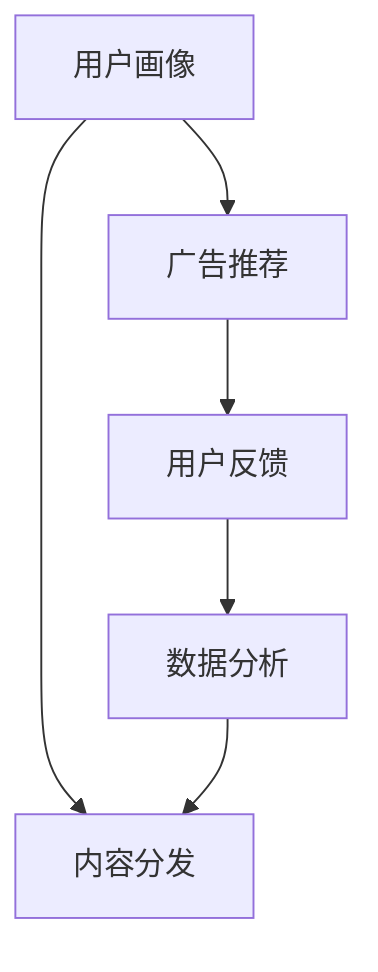

                 

# 注意力经济与个人职业发展规划的变化

## 1. 背景介绍

在数字化时代，注意力成为了一种稀缺资源。随着互联网的普及和信息技术的飞速发展，人们每天接触到海量的信息，但真正有价值的知识与信息却只占其中的一小部分。因此，如何有效地获取和利用这些有价值的信息，成为了一个重要的议题。而注意力经济正是在这种背景下兴起的，通过吸引用户的注意力来创造价值。

### 1.1 注意力经济的定义与原理

注意力经济是指通过吸引用户注意力，提供有价值的内容，从而实现商业价值的过程。在这个过程中，用户对信息的关注度和参与度是关键。通过精准定位用户需求，提供定制化的内容和服务，才能最大化地吸引和保持用户的注意力。

注意力经济的原理主要包括三个方面：
- **用户注意力**：用户对信息的关注和参与程度，可以通过点击率、停留时间等指标衡量。
- **信息价值**：信息的有用性和相关性，能够满足用户的需求和解决其问题。
- **商业价值**：通过获取用户注意力并转化为消费行为，创造经济效益。

## 2. 核心概念与联系

### 2.1 核心概念概述

为了更好地理解注意力经济，本节将介绍几个关键概念及其之间的联系：

- **用户画像**：通过收集用户的行为数据和兴趣偏好，构建用户画像，以便精准定位用户需求。
- **内容分发**：根据用户画像和内容特性，设计推荐算法，实现内容的分发。
- **广告推荐**：利用用户关注的信息和行为数据，精准投放广告，提升广告效果和用户转化率。
- **用户反馈**：收集用户对内容的反馈和评价，优化推荐算法和内容质量。
- **数据驱动**：整个注意力经济的核心在于数据驱动，通过大量数据分析和模型训练，实现对用户需求的精准匹配和内容推荐。

这些概念之间通过数据链条连接起来，形成一个闭环系统。用户画像为内容分发和广告推荐提供了基础，而用户反馈和数据分析则不断优化整个系统，形成一个动态优化的过程。

### 2.2 核心概念原理和架构的 Mermaid 流程图(Mermaid 流程节点中不要有括号、逗号等特殊字符)



这个流程图展示了注意力经济的核心流程：

1. 用户画像：通过分析用户行为数据和兴趣偏好，构建精准的用户画像。
2. 内容分发：根据用户画像和内容特性，设计推荐算法，实现内容的分发。
3. 广告推荐：利用用户关注的信息和行为数据，精准投放广告，提升广告效果和用户转化率。
4. 用户反馈：收集用户对内容的反馈和评价，优化推荐算法和内容质量。
5. 数据分析：通过数据分析不断优化整个系统，形成一个动态优化的过程。

## 3. 核心算法原理 & 具体操作步骤

### 3.1 算法原理概述

注意力经济的算法原理主要基于推荐系统。推荐系统通过分析用户的历史行为数据和兴趣偏好，预测用户对特定内容或商品的兴趣，从而实现个性化推荐。其主要目标是在海量的信息中，找出最符合用户需求的内容或商品，提升用户体验和满意度。

推荐系统的核心思想是通过构建用户和内容之间的关联矩阵，利用算法计算用户对不同内容的评分，并根据评分排序推荐。常见的推荐算法包括协同过滤、基于内容的推荐、矩阵分解等。

### 3.2 算法步骤详解

推荐系统的算法步骤主要包括：
- **数据收集**：收集用户的历史行为数据和内容特性。
- **特征提取**：从数据中提取有价值的特征，如用户画像、内容标签、用户评分等。
- **模型训练**：使用机器学习算法（如矩阵分解、协同过滤等）训练推荐模型。
- **评分预测**：使用训练好的模型预测用户对内容的评分。
- **排序推荐**：根据评分排序，向用户推荐高评分的结果。

以下以协同过滤算法为例，详细介绍推荐系统的具体实现步骤。

### 3.3 算法优缺点

协同过滤算法的优点在于能够处理大规模稀疏矩阵，不需要对物品进行预先建模。但其缺点也显而易见：
- **数据稀疏性**：协同过滤依赖用户的历史行为数据，如果用户行为数据稀疏，则推荐效果会大打折扣。
- **冷启动问题**：对于新用户和新物品，协同过滤算法无法进行推荐。
- **稳定性问题**：协同过滤算法对异常值和噪声敏感，推荐结果可能不稳定。

针对这些问题，研究者提出了许多改进方法，如矩阵分解、基于内容的推荐、深度学习等，以期提升推荐系统的性能和稳定性。

### 3.4 算法应用领域

推荐系统已经广泛应用于电子商务、内容分发、广告推荐等多个领域。以下是几个典型的应用场景：

- **电子商务推荐**：在电商平台上，推荐系统根据用户历史购买行为和评分，推荐用户可能感兴趣的商品。
- **内容分发推荐**：新闻网站、视频平台等，根据用户的历史阅读、观看记录，推荐用户可能感兴趣的文章、视频等。
- **广告推荐**：根据用户的兴趣和行为数据，精准投放广告，提升广告效果和用户转化率。
- **音乐推荐**：音乐平台根据用户历史听歌记录，推荐用户可能喜欢的歌曲。
- **视频推荐**：视频平台根据用户历史观看记录，推荐用户可能喜欢的视频。

## 4. 数学模型和公式 & 详细讲解 & 举例说明（备注：数学公式请使用latex格式，latex嵌入文中独立段落使用 $$，段落内使用 $)
### 4.1 数学模型构建

推荐系统的数学模型通常使用矩阵分解的方法来表示用户和内容之间的关联。设用户集为 $U=\{u_1,u_2,\cdots,u_M\}$，内容集为 $V=\{v_1,v_2,\cdots,v_N\}$，用户对内容的评分矩阵为 $R\in \mathbb{R}^{M\times N}$，其中 $R_{iu}$ 表示用户 $u$ 对内容 $v$ 的评分。

推荐系统的目标是通过矩阵分解，找到低秩矩阵 $P\in \mathbb{R}^{M\times N}$ 和 $Q\in \mathbb{R}^{N\times M}$，使得 $R \approx PQ^T$，即：

$$
R_{iu} \approx \sum_{j=1}^N P_{iu}Q_{ju}
$$

其中 $P_{iu}$ 和 $Q_{ju}$ 分别表示用户 $u$ 对内容 $v$ 的隐含评分。

### 4.2 公式推导过程

矩阵分解的公式推导过程如下：

设 $P=\{p_{iu}\}_{i,j=1}^{M,N}$ 和 $Q=\{q_{ju}\}_{i,j=1}^{M,N}$ 分别为用户和内容的低秩矩阵，则 $R$ 可以表示为：

$$
R_{iu} \approx \sum_{j=1}^N p_{iu}q_{ju}
$$

为了最小化 $R$ 和 $PQ^T$ 之间的误差，可以定义损失函数：

$$
L=\frac{1}{2}\sum_{i=1}^M\sum_{j=1}^N (R_{ij}-\sum_{k=1}^K p_{ik}q_{kj})^2
$$

其中 $K$ 为分解后的维度。

通过梯度下降等优化算法，求解 $P$ 和 $Q$，使得 $L$ 最小化。最终的推荐结果可以通过 $P$ 和 $Q$ 求得：

$$
R_{iu} \approx \sum_{j=1}^N p_{iu}q_{ju}
$$

### 4.3 案例分析与讲解

以下以电影推荐系统为例，说明推荐系统的实际应用。

设用户集为 $U=\{u_1,u_2,\cdots,u_M\}$，内容集为 $V=\{v_1,v_2,\cdots,v_N\}$，用户对内容的评分矩阵为 $R\in \mathbb{R}^{M\times N}$，其中 $R_{iu}$ 表示用户 $u$ 对内容 $v$ 的评分。假设 $P=\{p_{iu}\}_{i,j=1}^{M,N}$ 和 $Q=\{q_{ju}\}_{i,j=1}^{M,N}$ 分别为用户和内容的低秩矩阵，分解后的维度为 $K$。

对于用户 $u$ 对内容 $v$ 的评分，可以通过矩阵分解公式计算得到：

$$
R_{uv} \approx \sum_{j=1}^K p_{iu}q_{ju}
$$

具体实现步骤如下：
1. 收集用户的历史评分数据，构建评分矩阵 $R$。
2. 对 $R$ 进行矩阵分解，得到低秩矩阵 $P$ 和 $Q$。
3. 计算用户 $u$ 对内容 $v$ 的评分，通过公式 $R_{uv} \approx \sum_{j=1}^K p_{iu}q_{ju}$ 求得。
4. 根据评分排序，推荐高评分的内容给用户 $u$。

## 5. 项目实践：代码实例和详细解释说明
### 5.1 开发环境搭建

在进行推荐系统开发前，我们需要准备好开发环境。以下是使用Python进行TensorFlow开发的推荐系统环境配置流程：

1. 安装Anaconda：从官网下载并安装Anaconda，用于创建独立的Python环境。

2. 创建并激活虚拟环境：
```bash
conda create -n tf-env python=3.8 
conda activate tf-env
```

3. 安装TensorFlow：根据CUDA版本，从官网获取对应的安装命令。例如：
```bash
conda install tensorflow -c tf -c conda-forge
```

4. 安装Pandas、NumPy等辅助工具包：
```bash
pip install pandas numpy
```

完成上述步骤后，即可在`tf-env`环境中开始推荐系统开发。

### 5.2 源代码详细实现

我们以协同过滤算法为例，给出使用TensorFlow进行推荐系统的PyTorch代码实现。

```python
import tensorflow as tf
import numpy as np
import pandas as pd

# 数据加载
data = pd.read_csv('movie_ratings.csv')

# 数据预处理
user_ids = data['user_id'].unique()
item_ids = data['movie_id'].unique()
ratings = data[['user_id', 'movie_id', 'rating']]

# 数据转换
train_data = ratings.values.reshape(-1, 3)
train_data = train_data[:, :2] - 1

# 构建模型
user_dim = 10
item_dim = 10
K = 3
N = len(item_ids)
M = len(user_ids)

P = tf.Variable(tf.random.normal([M, user_dim]))
Q = tf.Variable(tf.random.normal([N, item_dim]))

# 训练过程
for i in range(1000):
    batch = train_data[np.random.randint(0, train_data.shape[0], 1000)]
    user = batch[:, 0]
    item = batch[:, 1]
    rating = batch[:, 2]
    
    with tf.GradientTape() as tape:
        predicted = tf.matmul(tf.matmul(P, Q), tf.transpose(Q))
        loss = tf.reduce_mean(tf.square(predicted - rating))
        
    grads = tape.gradient(loss, [P, Q])
    optimizer.apply_gradients(zip(grads, [P, Q]))

# 预测过程
test_data = pd.read_csv('movie_test.csv')
test_data = test_data[['user_id', 'movie_id']]
test_data = test_data.values.reshape(-1, 2) - 1

user = test_data[:, 0]
item = test_data[:, 1]
predictions = tf.matmul(tf.matmul(P, Q), tf.transpose(Q))
predictions = predictions.eval()

# 输出结果
print(predictions)
```

以上就是使用TensorFlow进行协同过滤算法的推荐系统实现。代码中首先读取数据，然后进行数据预处理和转换。接着构建模型，并使用TensorFlow进行训练和预测。

### 5.3 代码解读与分析

让我们再详细解读一下关键代码的实现细节：

**数据加载与预处理**：
- `pd.read_csv('movie_ratings.csv')`：从CSV文件中读取评分数据，并使用Pandas进行数据处理。
- `train_data = ratings.values.reshape(-1, 3)[:, :2] - 1`：将评分数据转换为矩阵形式，并进行预处理，将用户ID和电影ID减去1，以适应TensorFlow中的索引方式。

**模型构建**：
- `P = tf.Variable(tf.random.normal([M, user_dim]))` 和 `Q = tf.Variable(tf.random.normal([N, item_dim]))`：定义用户和内容的低秩矩阵。
- `K = 3`：定义分解后的维度。
- `N = len(item_ids)` 和 `M = len(user_ids)`：获取内容集和用户集的大小。

**训练过程**：
- `for i in range(1000)`：设置训练轮数为1000次。
- `with tf.GradientTape() as tape`：开启梯度计算，计算损失函数和梯度。
- `predicted = tf.matmul(tf.matmul(P, Q), tf.transpose(Q))`：计算用户对内容的评分预测。
- `loss = tf.reduce_mean(tf.square(predicted - rating))`：计算预测值与真实值之间的误差。
- `grads = tape.gradient(loss, [P, Q])`：计算梯度，并使用优化器更新模型参数。

**预测过程**：
- `predictions = tf.matmul(tf.matmul(P, Q), tf.transpose(Q))`：计算用户对内容的评分预测。
- `predictions = predictions.eval()`：使用TensorFlow会话计算预测结果。

**输出结果**：
- `print(predictions)`：打印预测结果。

## 6. 实际应用场景
### 6.1 电商推荐系统

在电商平台上，推荐系统能够根据用户的浏览历史、购买记录等行为数据，推荐用户可能感兴趣的商品。通过推荐系统，电商平台能够提高用户转化率和销售额，增强用户体验。

在技术实现上，可以收集用户的浏览、点击、购买等行为数据，构建用户画像，并在此基础上对商品进行评分预测和排序推荐。对于新用户和新商品，可以通过协同过滤算法进行冷启动推荐，提升推荐效果。

### 6.2 新闻推荐系统

新闻平台根据用户的历史阅读记录和兴趣偏好，推荐用户可能感兴趣的新闻。推荐系统能够提高用户停留时间，增加广告点击率，提升平台收益。

在技术实现上，可以收集用户的新闻阅读记录、点击记录等数据，构建用户画像，并在此基础上对新闻进行评分预测和排序推荐。对于新闻内容，可以进行关键词提取、情感分析等预处理，提升推荐效果。

### 6.3 视频推荐系统

视频平台根据用户的观看历史和兴趣偏好，推荐用户可能感兴趣的视频。推荐系统能够提高用户的观看时间和平台收益，提升用户满意度。

在技术实现上，可以收集用户的观看记录、点赞、分享等数据，构建用户画像，并在此基础上对视频进行评分预测和排序推荐。对于视频内容，可以进行关键词提取、情感分析等预处理，提升推荐效果。

## 7. 工具和资源推荐
### 7.1 学习资源推荐

为了帮助开发者系统掌握推荐系统的理论基础和实践技巧，这里推荐一些优质的学习资源：

1. 《推荐系统实战》书籍：系统介绍了推荐系统的基本概念、算法实现和实际应用。
2. 《Python推荐系统实战》书籍：详细介绍推荐系统的Python实现方法。
3. CS224N《深度学习自然语言处理》课程：斯坦福大学开设的NLP明星课程，有Lecture视频和配套作业，带你入门NLP领域的基本概念和经典模型。
4. Kaggle推荐系统竞赛：参与Kaggle推荐系统竞赛，锻炼算法能力和实际应用能力。
5. 论文《Deep Collaborative Filtering》：提出了基于深度学习的协同过滤算法，刷新了推荐系统效果。

通过对这些资源的学习实践，相信你一定能够快速掌握推荐系统的精髓，并用于解决实际的推荐问题。

### 7.2 开发工具推荐

高效的开发离不开优秀的工具支持。以下是几款用于推荐系统开发的常用工具：

1. TensorFlow：由Google主导开发的开源深度学习框架，生产部署方便，适合大规模工程应用。
2. PyTorch：基于Python的开源深度学习框架，灵活动态的计算图，适合快速迭代研究。
3. Scikit-learn：Python机器学习库，提供了多种机器学习算法，适合处理小规模数据。
4. Pandas：Python数据处理库，用于数据清洗、转换和分析。
5. NumPy：Python科学计算库，用于高效数学计算和数组操作。
6. Scipy：Python科学计算库，提供了各种科学计算函数和工具。

合理利用这些工具，可以显著提升推荐系统的开发效率，加快创新迭代的步伐。

### 7.3 相关论文推荐

推荐系统的发展源于学界的持续研究。以下是几篇奠基性的相关论文，推荐阅读：

1. matrix factorization techniques for recommender systems：提出了矩阵分解方法，为推荐系统提供了强大的数学基础。
2. collaborative filtering for implicit feedback：介绍了协同过滤算法的原理和实现方法。
3. practical recommendations from freebase with weighted matrix factorization：提出了基于知识图谱的推荐系统方法，提升了推荐效果和稳定性。
4. scalable matrix factorization techniques for recommendation：提出了一种高效的矩阵分解算法，提升了推荐系统的可扩展性和准确性。
5. deep collaborative filtering：提出了一种基于深度学习的协同过滤算法，刷新了推荐系统效果。

这些论文代表了大推荐系统的发展脉络。通过学习这些前沿成果，可以帮助研究者把握学科前进方向，激发更多的创新灵感。

## 8. 总结：未来发展趋势与挑战
### 8.1 总结

本文对推荐系统进行了全面系统的介绍。首先阐述了推荐系统的定义和原理，明确了推荐系统在吸引用户注意力、创造商业价值方面的独特价值。其次，从原理到实践，详细讲解了推荐系统的数学模型和算法实现。通过推荐系统的具体实现步骤，展示了推荐系统在实际应用中的广泛应用和效果。最后，本文还推荐了相关学习资源、开发工具和研究论文，力求为读者提供全方位的技术指引。

通过本文的系统梳理，可以看到，推荐系统已经在电子商务、内容分发、广告推荐等多个领域取得了显著的效果，为互联网企业带来了巨大的商业价值。未来，随着技术的不断进步，推荐系统将更加智能和精准，能够更好地满足用户需求，提升用户体验。

### 8.2 未来发展趋势

展望未来，推荐系统的未来发展趋势将包括以下几个方面：

1. **个性化推荐**：推荐系统将更加智能和个性化，能够根据用户的多维度数据，提供更加精准的推荐。
2. **实时推荐**：推荐系统将能够实时响应用户需求，快速调整推荐结果，提升用户满意度。
3. **跨域推荐**：推荐系统将能够跨域数据进行推荐，整合多源数据，提升推荐效果和系统鲁棒性。
4. **多模态推荐**：推荐系统将能够整合文本、图像、音频等多模态数据，提供更加丰富的推荐结果。
5. **交互式推荐**：推荐系统将能够通过用户交互，不断优化推荐算法和内容质量，提升用户参与度。
6. **隐私保护**：推荐系统将更加注重用户隐私保护，通过差分隐私等技术，保护用户数据安全。

以上趋势凸显了推荐系统的广阔前景。这些方向的探索发展，必将进一步提升推荐系统的性能和用户体验，为互联网企业带来更大的商业价值。

### 8.3 面临的挑战

尽管推荐系统已经取得了显著的成果，但在迈向更加智能化、个性化推荐的过程中，仍然面临诸多挑战：

1. **数据隐私保护**：推荐系统需要大量用户数据，如何保护用户隐私，防止数据泄露，是亟待解决的问题。
2. **冷启动问题**：对于新用户和新物品，推荐系统无法进行推荐，需要寻找新的解决方案。
3. **算法鲁棒性**：推荐系统对异常值和噪声敏感，推荐结果可能不稳定，需要进一步提升算法的鲁棒性。
4. **计算效率**：推荐系统需要处理大量数据，如何提高计算效率，减少延迟，是亟待解决的问题。
5. **模型解释性**：推荐系统的决策过程缺乏可解释性，难以对其推理逻辑进行分析和调试，需要进一步提升模型的透明性和可解释性。

这些挑战需要研究者不断创新和改进，才能使推荐系统更加智能、安全、可靠，满足用户需求。

### 8.4 研究展望

面向未来，推荐系统的研究需要在以下几个方面寻求新的突破：

1. **个性化推荐**：通过更加智能的推荐算法，提升个性化推荐效果。
2. **实时推荐**：利用流式计算和大数据技术，实现实时推荐。
3. **跨域推荐**：整合多源数据，提升推荐系统的鲁棒性和泛化能力。
4. **多模态推荐**：整合多模态数据，提升推荐系统的多样性和丰富度。
5. **交互式推荐**：通过用户交互，不断优化推荐算法和内容质量。
6. **隐私保护**：利用差分隐私等技术，保护用户数据安全。

这些方向的研究，将进一步提升推荐系统的性能和用户体验，为互联网企业带来更大的商业价值。

## 9. 附录：常见问题与解答

**Q1：推荐系统是否适用于所有行业？**

A: 推荐系统已经在电子商务、内容分发、广告推荐等多个领域取得了显著的效果，为互联网企业带来了巨大的商业价值。但推荐系统并不是万能的，对于一些非数据驱动的行业，如教育、医疗等，推荐系统的效果可能有限。

**Q2：推荐系统如何应对数据稀疏性问题？**

A: 数据稀疏性是推荐系统面临的一个主要问题。为了应对数据稀疏性，推荐系统可以使用协同过滤算法、矩阵分解等方法。协同过滤算法可以通过用户和内容的隐含评分，对缺失的数据进行预测。矩阵分解可以通过低秩矩阵分解，将缺失的数据填补完整。

**Q3：推荐系统如何应对冷启动问题？**

A: 冷启动问题是推荐系统面临的一个主要问题。为了应对冷启动问题，推荐系统可以使用协同过滤算法、矩阵分解等方法。协同过滤算法可以通过用户和内容的隐含评分，对新用户和新物品进行推荐。矩阵分解可以通过低秩矩阵分解，对新用户和新物品进行推荐。此外，还可以利用用户画像、内容画像等辅助信息，提高推荐效果。

**Q4：推荐系统如何应对异常值和噪声问题？**

A: 推荐系统对异常值和噪声敏感，需要进一步提升算法的鲁棒性。为了应对异常值和噪声问题，推荐系统可以使用协同过滤算法、矩阵分解等方法。协同过滤算法可以通过用户和内容的隐含评分，对异常值和噪声进行过滤。矩阵分解可以通过低秩矩阵分解，对异常值和噪声进行过滤。此外，还可以引入正则化技术、噪声过滤算法等，提高推荐系统的鲁棒性。

**Q5：推荐系统如何应对计算效率问题？**

A: 推荐系统需要处理大量数据，计算效率是一个亟待解决的问题。为了应对计算效率问题，推荐系统可以使用并行计算、分布式计算等方法。并行计算可以将任务分解成多个子任务，并行执行，提高计算效率。分布式计算可以将数据分散到多个节点上进行计算，提高计算效率。此外，还可以利用GPU、TPU等硬件设备，加速计算过程。

总之，推荐系统在吸引用户注意力、创造商业价值方面具有重要意义，但也需要应对数据隐私、冷启动、鲁棒性、计算效率等挑战。未来的研究需要在这些方面进行持续探索和改进，才能使推荐系统更加智能、安全、可靠，满足用户需求。

