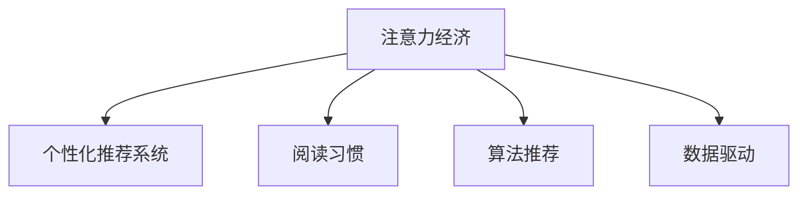

                 

## 1. 背景介绍

### 1.1 问题由来
在信息化高速发展的今天，海量的信息内容对人们的生活产生了深远影响。人们越来越依赖于通过网络获取信息，而互联网企业也逐渐将内容付费模式作为盈利的重要手段。在这种背景下，内容产业的“注意力经济”模式应运而生。

“注意力经济”指的是在信息过载的时代，个人或组织获取信息的主要方式依赖于“注意力”，而注意力是有限的，如何有效吸引和保持用户的注意力成为了内容提供商关注的重点。

### 1.2 问题核心关键点
“注意力经济”的核心在于：
1. 信息生产与传播的商业化。互联网企业通过内容付费、广告投放等方式获取收益。
2. 用户注意力价值的凸显。内容提供商通过内容创作吸引用户，从而获取用户关注，并实现商业变现。
3. 阅读习惯的转变。随着互联网技术的发展，用户的阅读习惯从传统的纸质阅读逐渐转向线上阅读，尤其是移动端阅读。
4. 个性化推荐系统的重要性。内容提供商通过算法推荐，提高内容的匹配度和用户粘性。

### 1.3 问题研究意义
研究“注意力经济”下个人阅读习惯的转变，对于理解信息消费行为、优化内容推荐系统、提升信息传播效果具有重要意义。通过对用户的阅读行为进行分析，可以更好地理解用户需求，提高内容提供商的盈利能力和用户体验，推动内容产业的繁荣发展。

## 2. 核心概念与联系

### 2.1 核心概念概述

为更好地理解“注意力经济”与个人阅读习惯的转变，本节将介绍几个核心概念：

- 注意力经济(Attention Economy)：在信息过载的时代，个人或组织获取信息的主要方式依赖于“注意力”，而注意力是有限的，如何有效吸引和保持用户的注意力成为了内容提供商关注的重点。
- 个性化推荐系统(Personalized Recommendation System)：通过分析用户的兴趣偏好，推荐相关内容，以提高用户满意度和粘性的系统。
- 阅读习惯(Reading Habit)：用户对于阅读内容的喜好、阅读时间、阅读频率等方面的习惯特征。
- 算法推荐(Algorithmic Recommendation)：利用机器学习算法，对用户行为进行建模，并基于模型预测结果为用户推荐内容的技术。
- 数据驱动(Data-Driven)：在数据分析的基础上，进行内容创作和推荐。

这些核心概念之间的逻辑关系可以通过以下Mermaid流程图来展示：



这个流程图展示了几大核心概念之间的相互关系：

1. 注意力经济促进了个性化推荐系统的发展。
2. 个性化推荐系统需要结合用户的阅读习惯，才能更好地为用户推荐内容。
3. 算法推荐是实现个性化推荐的重要手段。
4. 数据驱动是算法推荐的基础，通过对用户数据进行建模和分析，才能实现精准推荐。

## 3. 核心算法原理 & 具体操作步骤
### 3.1 算法原理概述

在“注意力经济”模式下，个性化推荐系统是提升用户注意力的重要手段。其核心思想是通过对用户行为数据的分析，建立用户兴趣模型，并基于模型为用户推荐相关内容。这一过程涉及以下关键步骤：

1. **用户行为数据收集**：收集用户在平台上的浏览、点击、收藏、评分等行为数据。
2. **用户兴趣模型构建**：通过机器学习算法，建立用户兴趣模型，描述用户对于不同内容的偏好。
3. **内容推荐**：基于用户兴趣模型，推荐与用户兴趣相符的内容。
4. **效果评估与优化**：对推荐效果进行评估，根据评估结果对推荐策略进行优化，提高推荐精度。

### 3.2 算法步骤详解

个性化推荐系统的核心算法步骤包括：

**Step 1: 数据收集与预处理**
- 收集用户在平台上的行为数据，包括浏览记录、点击行为、收藏记录、评分等。
- 对数据进行清洗、去重、归一化等预处理操作，去除噪音数据，提升数据质量。

**Step 2: 用户兴趣模型建立**
- 选择合适的机器学习算法，如协同过滤、内容过滤、混合推荐等，建立用户兴趣模型。
- 通过K-means、层次聚类、主题模型等算法，对用户进行分群，识别兴趣群体。
- 使用深度学习模型，如LightGBM、XGBoost等，对用户行为进行建模，生成用户兴趣向量。

**Step 3: 内容特征提取**
- 对推荐内容进行特征提取，包括文本特征、图像特征、标签特征等。
- 使用TF-IDF、Word2Vec、BERT等技术，将文本内容转换为向量形式，便于模型处理。

**Step 4: 推荐算法实现**
- 基于用户兴趣模型和内容特征向量，设计推荐算法。常用的算法包括基于协同过滤的矩阵分解算法、基于内容的最近邻算法、基于深度学习的神经网络推荐模型等。
- 对推荐结果进行排名和筛选，选择最相关的几篇文章推荐给用户。

**Step 5: 效果评估与优化**
- 对推荐效果进行评估，如点击率、转化率、平均点击数等指标。
- 根据评估结果，调整推荐算法和模型参数，优化推荐效果。

### 3.3 算法优缺点

个性化推荐系统的优点包括：
1. 提升用户满意度：通过精准推荐，满足用户需求，提高用户满意度。
2. 提高用户粘性：通过个性化推荐，提高用户粘性，增加平台用户留存率。
3. 促进内容消费：通过推荐系统，带动更多内容消费，增加平台收益。

同时，该方法也存在以下局限性：
1. 数据依赖性强：推荐系统的效果高度依赖于用户数据的质量和数量。
2. 推荐算法复杂：推荐算法模型复杂，需要大量计算资源和时间成本。
3. 推荐多样性不足：推荐结果过于集中，用户可能陷入信息茧房。
4. 用户隐私风险：推荐系统需要收集和分析用户行为数据，存在用户隐私风险。

尽管存在这些局限性，但就目前而言，个性化推荐系统仍然是“注意力经济”模式下提升用户注意力的重要手段。未来相关研究的重点在于如何进一步降低数据收集成本，提高算法效率，同时兼顾用户隐私和多样性等因素。

### 3.4 算法应用领域

个性化推荐系统已经在电子商务、社交网络、新闻媒体等多个领域得到广泛应用，如亚马逊、淘宝、抖音、今日头条等。这些推荐系统通过分析用户行为数据，精准推荐商品、内容等，提升了用户体验和平台收益。

除了这些经典应用场景外，个性化推荐技术也在不断拓展到更多领域，如金融理财、教育培训、医疗健康等，为相关行业的智能化转型提供技术支持。随着推荐技术的持续演进，相信其在提升用户体验、促进业务增长方面的潜力将进一步被发掘。

## 4. 数学模型和公式 & 详细讲解 & 举例说明

### 4.1 数学模型构建

本节将使用数学语言对个性化推荐系统的核心模型进行更加严格的刻画。

设用户集合为 $U=\{u_1, u_2, \cdots, u_m\}$，内容集合为 $I=\{i_1, i_2, \cdots, i_n\}$。用户 $u$ 与内容 $i$ 之间的交互记录为 $r_{ui}$，可以表示为评分、点击、浏览时间等。用户兴趣模型 $P$ 可以表示为 $P: U \rightarrow \mathbb{R}^d$，其中 $d$ 为兴趣维度的数量。推荐模型 $R$ 可以表示为 $R: I \rightarrow \mathbb{R}^d$，用于计算内容与用户兴趣的匹配度。推荐算法 $A$ 根据用户模型和内容模型计算推荐结果 $A(P, R)$，并根据评分矩阵进行排序。

### 4.2 公式推导过程

以下我们以协同过滤推荐算法为例，推导推荐过程的数学模型。

协同过滤算法基于用户行为数据，通过相似性度量方法，找到与用户 $u$ 相似的其他用户 $u'$，进而预测用户 $u$ 对未交互内容的评分 $r_{ui}$。协同过滤的数学模型可以表示为：

$$
\hat{r}_{ui} = \frac{1}{K} \sum_{u' \in N_u} \frac{r_{u'i}}{|\tilde{N}_{i}(u')|} \quad \text{if} \quad \tilde{N}_i(u') \neq \emptyset
$$

其中 $N_u$ 为与用户 $u$ 相似的其他用户集合，$|\tilde{N}_i(u')|$ 表示用户 $u'$ 对内容 $i$ 的评分数量。该公式表示用户 $u$ 对内容 $i$ 的评分预测值为，与用户 $u'$ 对内容 $i$ 的评分平均值，除以用户 $u'$ 对内容 $i$ 的评分数量。

在实际应用中，协同过滤算法还需解决冷启动问题，即对于未交互内容，可以使用用户兴趣模型 $P$ 进行预测。

协同过滤算法的优化目标是最小化预测误差：

$$
\min_{\theta} \sum_{ui} (r_{ui} - \hat{r}_{ui})^2
$$

其中 $\theta$ 为模型参数，用于优化协同过滤算法。

### 4.3 案例分析与讲解

以电商平台推荐系统为例，说明协同过滤算法的实际应用。

假设电商平台的推荐系统收集了用户 $u$ 对商品 $i$ 的评分数据，同时收集了商品 $i$ 的标签和描述信息。可以使用协同过滤算法，找到与用户 $u$ 相似的其他用户，通过相似性度量方法计算用户 $u$ 对未交互商品的评分预测值。具体步骤如下：

1. **用户相似度计算**：根据用户行为数据，使用余弦相似度或皮尔逊相关系数等方法，计算用户 $u$ 与其他用户之间的相似度。
2. **预测评分**：对于用户 $u$ 未交互的商品 $i$，计算其评分预测值。
3. **筛选推荐内容**：根据预测评分，对所有商品进行排序，选择评分预测值较高的商品进行推荐。

该推荐系统通过分析用户行为数据，实现了精准推荐，提升了用户满意度，促进了商品销售，实现了电商平台的商业价值。

## 5. 项目实践：代码实例和详细解释说明
### 5.1 开发环境搭建

在进行推荐系统开发前，我们需要准备好开发环境。以下是使用Python进行PyTorch开发的环境配置流程：

1. 安装Anaconda：从官网下载并安装Anaconda，用于创建独立的Python环境。

2. 创建并激活虚拟环境：
```bash
conda create -n recommendation-env python=3.8 
conda activate recommendation-env
```

3. 安装PyTorch：根据CUDA版本，从官网获取对应的安装命令。例如：
```bash
conda install pytorch torchvision torchaudio cudatoolkit=11.1 -c pytorch -c conda-forge
```

4. 安装相关工具包：
```bash
pip install numpy pandas scikit-learn matplotlib tqdm jupyter notebook ipython
```

完成上述步骤后，即可在`recommendation-env`环境中开始推荐系统开发。

### 5.2 源代码详细实现

这里我们以协同过滤推荐算法为例，给出使用PyTorch实现推荐系统的代码。

首先，定义协同过滤算法的核心函数：

```python
import numpy as np
from sklearn.metrics.pairwise import cosine_similarity

def collaborative_filtering(X, similarities, num_recommendations=10):
    num_users = X.shape[0]
    num_items = X.shape[1]
    
    # 计算相似度矩阵
    similarity_matrix = similarities
    
    # 获取用户未交互的内容
    unseen_items = np.setdiff1d(range(num_items), X.sum(axis=0).nonzero()[1])
    
    # 初始化推荐列表
    recommendations = np.zeros((num_users, num_recommendations), dtype=int)
    
    for i in range(num_users):
        # 找到与用户i相似的其他用户
        similar_users = np.argsort(similarity_matrix[i])[::-1]
        
        # 计算用户i对未交互内容的评分预测值
        item_scores = X[similar_users].sum(axis=0) / (similar_users.sum(axis=1) + 1e-10)
        
        # 对预测值进行排序，选择推荐内容
        recommendations[i] = np.argsort(item_scores)[::-1][:num_recommendations]
        
    return recommendations
```

然后，使用该函数进行推荐：

```python
# 加载用户行为数据
X = np.array([[5, 4, 0, 0], [0, 0, 3, 2], [0, 0, 1, 3], [0, 0, 0, 4]])

# 计算用户相似度
similarities = cosine_similarity(X)

# 进行推荐
recommendations = collaborative_filtering(X, similarities)

print(recommendations)
```

在实际应用中，还需要对数据进行清洗、特征提取、模型训练等步骤，才能实现完整的推荐系统功能。

### 5.3 代码解读与分析

让我们再详细解读一下关键代码的实现细节：

**collaborative_filtering函数**：
- `X`参数为用户行为数据矩阵，每一行表示用户对不同内容的评分，每一列表示不同内容。
- `similarities`参数为用户之间的相似度矩阵。
- 首先计算未交互内容的评分预测值。
- 根据预测值排序，选择推荐内容。

**用户行为数据矩阵**：
- `X`矩阵中的0表示用户未交互，非0值表示用户的评分。

**用户相似度计算**：
- 使用sklearn库中的cosine_similarity函数计算用户之间的余弦相似度，作为用户相似度的度量方式。

**推荐结果**：
- 返回一个推荐列表，每个用户有`num_recommendations`条推荐内容。

可以看到，协同过滤算法的代码实现相对简洁，但实际应用中还需进行更复杂的处理。例如，需要对数据进行预处理、选择相似度度量方式、优化推荐效果等。

## 6. 实际应用场景
### 6.1 电子商务推荐

在电子商务领域，推荐系统可以显著提升用户体验和销售额。用户通过搜索、浏览商品，系统通过推荐相似商品，提高用户购买的概率。例如，亚马逊的推荐系统通过分析用户行为数据，为用户推荐相关商品，大大提升了用户的购买意愿和复购率。

### 6.2 社交媒体推荐

在社交媒体平台，推荐系统可以根据用户兴趣，推荐相关内容。用户可以更高效地获取有价值的信息，提高平台的活跃度和用户留存率。例如，抖音的推荐系统通过分析用户行为数据，为用户推荐短视频，帮助用户发现更多的兴趣内容。

### 6.3 新闻媒体推荐

在新闻媒体领域，推荐系统可以根据用户兴趣，推荐相关新闻。用户可以更快速地获取感兴趣的内容，提升平台的用户体验。例如，今日头条的推荐系统通过分析用户行为数据，为用户推荐新闻文章，提高了平台的点击率和停留时间。

### 6.4 未来应用展望

随着个性化推荐技术的发展，未来推荐系统将在更多领域得到应用，为相关行业带来变革性影响。

在智慧医疗领域，推荐系统可以推荐相关医疗知识和用药建议，提升医疗服务的智能化水平，辅助医生诊疗，加速新药开发进程。

在智能教育领域，推荐系统可以推荐个性化学习内容和作业，因材施教，促进教育公平，提高教学质量。

在智慧城市治理中，推荐系统可以推荐城市事件监测、舆情分析、应急指挥等环节的内容，提高城市管理的自动化和智能化水平，构建更安全、高效的未来城市。

此外，在企业生产、社会治理、文娱传媒等众多领域，推荐技术也将不断涌现，为各行各业智能化转型提供技术支持。相信随着推荐技术的持续演进，其在提升用户体验、促进业务增长方面的潜力将进一步被发掘。

## 7. 工具和资源推荐
### 7.1 学习资源推荐

为了帮助开发者系统掌握推荐系统的理论基础和实践技巧，这里推荐一些优质的学习资源：

1. 《Recommender Systems: Text Mining, Classification, and Statistical Learning》书籍：介绍了推荐系统的主要技术和应用，适合入门和进阶阅读。
2. CS229《Machine Learning》课程：斯坦福大学开设的机器学习课程，有Lecture视频和配套作业，带你深入理解推荐系统。
3. 《Recommender Systems for Smartphone Applications》书籍：介绍了移动推荐系统的主要技术和应用，适合移动开发人员阅读。
4. Kaggle推荐系统竞赛：参与实际推荐系统竞赛，提升动手能力和项目经验。
5. GitHub推荐系统开源项目：浏览和研究开源推荐系统项目，学习他人的实现经验。

通过对这些资源的学习实践，相信你一定能够快速掌握推荐系统的精髓，并用于解决实际的推荐问题。

### 7.2 开发工具推荐

高效的开发离不开优秀的工具支持。以下是几款用于推荐系统开发的常用工具：

1. PyTorch：基于Python的开源深度学习框架，灵活动态的计算图，适合快速迭代研究。推荐系统可以使用PyTorch进行模型的训练和推理。
2. TensorFlow：由Google主导开发的开源深度学习框架，生产部署方便，适合大规模工程应用。推荐系统可以使用TensorFlow进行模型的训练和推理。
3. LightGBM：由微软开发的梯度提升决策树算法，适合处理大规模推荐数据，且计算速度快。
4. Scikit-learn：Python中的机器学习库，提供丰富的模型和算法，适合进行特征工程和数据处理。
5. Pandas：Python中的数据处理库，方便数据清洗、预处理和特征提取。

合理利用这些工具，可以显著提升推荐系统的开发效率，加快创新迭代的步伐。

### 7.3 相关论文推荐

推荐系统的发展源于学界的持续研究。以下是几篇奠基性的相关论文，推荐阅读：

1. Collaborative Filtering for Implicit Feedback Datasets（协同过滤算法）：提出了协同过滤算法的基本思想，是推荐系统的经典算法之一。
2. Top-N Recommendation as Implicit Markov Decision Processes（推荐系统作为隐式马尔科夫决策过程）：提出了推荐系统作为隐式马尔科夫决策过程的模型框架，适合动态推荐场景。
3. Neural Collaborative Filtering（基于神经网络的协同过滤）：提出了基于神经网络的协同过滤算法，适合处理大规模推荐数据。
4. Contextual Bandit Approaches to Recommender Systems（上下文带问题推荐系统）：介绍了上下文带问题推荐系统的主要技术和应用，适合实时推荐场景。
5. Deep Matrix Factorization for Recommender Systems（深度矩阵分解推荐系统）：介绍了深度矩阵分解推荐系统的主要技术和应用，适合处理高维稀疏推荐数据。

这些论文代表了大数据推荐技术的发展脉络。通过学习这些前沿成果，可以帮助研究者把握学科前进方向，激发更多的创新灵感。

## 8. 总结：未来发展趋势与挑战
### 8.1 总结

本文对个性化推荐系统的理论基础和实践应用进行了全面系统的介绍。首先阐述了个性化推荐系统的核心思想和实现步骤，明确了推荐系统在“注意力经济”模式下的重要性和应用价值。其次，从原理到实践，详细讲解了协同过滤算法的数学模型和代码实现，给出了推荐系统开发的完整代码实例。同时，本文还广泛探讨了推荐系统在电子商务、社交媒体、新闻媒体等实际应用场景中的应用前景，展示了推荐技术的广泛应用。最后，本文精选了推荐系统的各类学习资源，力求为读者提供全方位的技术指引。

通过本文的系统梳理，可以看到，个性化推荐技术正在成为“注意力经济”模式下的重要手段，极大地提升了用户满意度和平台收益。未来，伴随推荐技术的持续演进，相信其在提升用户体验、促进业务增长方面的潜力将进一步被发掘。

### 8.2 未来发展趋势

展望未来，个性化推荐系统将呈现以下几个发展趋势：

1. 深度学习推荐模型：基于深度神经网络推荐模型的性能将进一步提升，适应用户的复杂需求和多样性。
2. 多模态推荐系统：结合图像、语音、视频等多模态数据，提高推荐系统的丰富性和多样性。
3. 实时推荐系统：结合大数据和流计算技术，实现实时推荐，满足用户的即时需求。
4. 跨平台推荐系统：打破平台壁垒，实现跨平台内容推荐，提升用户体验。
5. 用户隐私保护：在推荐过程中，更加注重用户隐私保护，确保用户数据安全。
6. 个性化推荐算法：结合用户画像、社交关系等，实现更加个性化和精准的推荐。

以上趋势凸显了个性化推荐技术的发展前景。这些方向的探索发展，必将进一步提升推荐系统的性能和应用范围，为内容产业带来新的变革。

### 8.3 面临的挑战

尽管个性化推荐技术已经取得了瞩目成就，但在迈向更加智能化、普适化应用的过程中，它仍面临着诸多挑战：

1. 数据隐私和安全：推荐系统需要收集和分析用户数据，存在用户隐私风险。如何在保护用户隐私的同时，提高推荐精度，是重要的研究方向。
2. 推荐多样性：推荐结果过于集中，用户可能陷入信息茧房。如何提高推荐多样性，打破信息茧房，是亟待解决的难题。
3. 冷启动问题：新用户或新商品缺乏足够的历史数据，推荐效果较差。如何处理冷启动问题，提升推荐系统的初始性能，是推荐系统的重要挑战。
4. 实时性要求：推荐系统需要实时响应用户需求，计算复杂度和资源消耗较大。如何优化算法，提升推荐系统的实时性，是推荐系统的重要挑战。
5. 模型可解释性：推荐系统模型的黑盒特性，导致难以解释推荐结果的背后逻辑。如何在提高推荐精度的同时，提升模型的可解释性，是推荐系统的重要研究方向。

尽管存在这些挑战，但随着学界和产业界的共同努力，这些挑战终将一一被克服，推荐技术必将走向更加智能化、普适化的未来。

### 8.4 研究展望

未来，个性化推荐系统需要在以下几个方向进行深入研究：

1. 模型可解释性：结合符号化规则、因果推断等方法，提升推荐模型的可解释性，让用户理解推荐结果背后的逻辑。
2. 多模态融合：结合图像、语音、视频等多模态数据，提升推荐系统的丰富性和多样性。
3. 用户画像：结合用户画像、社交关系等，实现更加个性化和精准的推荐。
4. 冷启动问题：通过内容推荐、新用户引导等方法，处理冷启动问题，提升推荐系统的初始性能。
5. 实时推荐：结合大数据和流计算技术，实现实时推荐，满足用户的即时需求。
6. 隐私保护：在推荐过程中，更加注重用户隐私保护，确保用户数据安全。

这些研究方向将进一步推动个性化推荐系统的技术进步，提升用户体验和平台收益。

## 9. 附录：常见问题与解答

**Q1：推荐系统如何处理冷启动问题？**

A: 推荐系统处理冷启动问题的方法包括：
1. 基于内容的推荐：通过内容特征相似度，推荐与新用户或新商品相似的其他内容。
2. 协同过滤推荐：通过用户或商品的相似度，推荐其他用户或商品的内容。
3. 混合推荐：结合内容推荐和协同过滤推荐，综合提升推荐效果。
4. 引入上下文信息：通过上下文信息，提升推荐系统的初始性能。
5. 新用户引导：通过引导用户进行相关操作，增加用户历史数据。

**Q2：推荐系统如何提高推荐多样性？**

A: 推荐系统提高推荐多样性的方法包括：
1. 算法优化：通过改进推荐算法，如深度学习模型、多臂老虎机算法等，提高推荐多样性。
2. 数据增强：通过数据增强技术，增加推荐内容的多样性。
3. 多样化标签：通过多标签分类技术，增加推荐内容的种类。
4. 个性化推荐：根据用户兴趣，推荐不同类型的内容。
5. 交叉推荐：结合不同类型的内容，提高推荐多样性。

**Q3：推荐系统如何保护用户隐私？**

A: 推荐系统保护用户隐私的方法包括：
1. 数据匿名化：对用户数据进行匿名化处理，保护用户隐私。
2. 差分隐私：在推荐过程中，加入差分隐私技术，保护用户隐私。
3. 用户控制：让用户自主控制数据的收集和使用，保护用户隐私。
4. 数据加密：对用户数据进行加密处理，保护用户隐私。
5. 隐私计算：利用隐私计算技术，保护用户隐私。

这些方法可以结合使用，最大限度地保护用户隐私，提升推荐系统的可信任度。

---

作者：禅与计算机程序设计艺术 / Zen and the Art of Computer Programming

