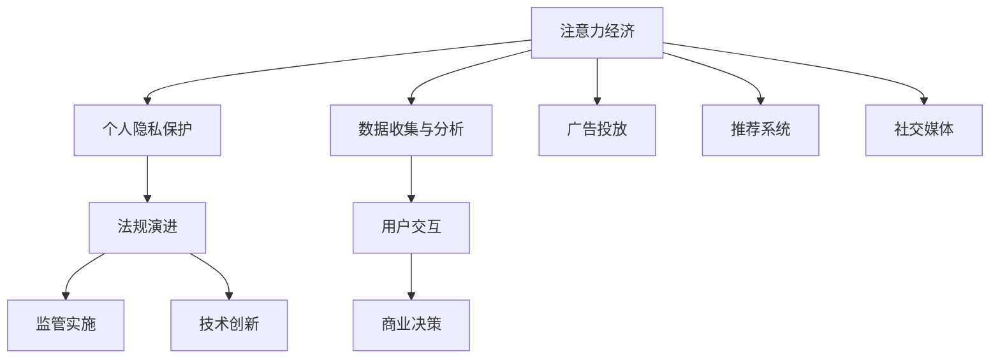

                 

# 注意力经济与个人隐私保护法规的演进

随着互联网技术的飞速发展和数字经济的蓬勃兴起，“注意力”成为一种稀缺资源，引发了深度关注。本文将深入探讨注意力经济的概念、影响机制以及个人隐私保护法规的演进，并通过具体的案例分析，为读者揭示个人隐私保护面临的挑战与应对策略。

## 1. 背景介绍

### 1.1 问题由来

在互联网时代，用户的注意力被视为一种宝贵的资源，其分配和吸引成为商业竞争的核心。广告、推荐系统、社交媒体等平台纷纷通过各种手段争夺用户注意力，以实现商业价值。然而，这种“注意力经济”的背后，是个人隐私和数据安全的重大风险。随着数据泄露、隐私侵权等事件的频发，各国政府逐步加强了对个人隐私保护的法律监管，推动了隐私保护法规的不断演进。

### 1.2 问题核心关键点

- **注意力经济**：指在数字化时代，注意力作为稀缺资源，被商业利用进行商品和服务推广的经济模式。
- **个人隐私保护**：指通过立法和监管措施，保护个人在互联网环境中的数据、信息和隐私不受侵犯。
- **法规演进**：指随着技术发展和隐私保护需求的提高，相关法律法规不断更新完善的动态过程。

## 2. 核心概念与联系

### 2.1 核心概念概述

- **注意力经济**：关注度高、互动性强的内容或产品能获得更高的商业价值。
- **个人隐私保护**：通过法律、技术手段保护个人隐私不受侵犯，确保数据使用透明、合法。
- **法规演进**：法律法规随着技术发展和社会需求变化，不断更新完善的过程。

### 2.2 核心概念原理和架构的 Mermaid 流程图



**说明**：
- **A**：注意力经济通过数据收集与分析，实现用户交互，最终进行商业决策。
- **B**：个人隐私保护涉及用户数据的收集、使用、存储和共享。
- **C**：法规演进是法规制定、修订和实施的动态过程。
- **D**：监管实施通过法律法规对注意力经济进行约束和规范。
- **E**：技术创新推动注意力经济和隐私保护技术的进步。
- **F**：数据收集与分析是注意力经济的基础。
- **G**：用户交互是注意力经济的核心环节。
- **H**：商业决策是注意力经济的目的。
- **I**：广告投放是注意力经济的主要应用场景之一。
- **J**：推荐系统通过算法推荐获取用户注意力。
- **K**：社交媒体是用户注意力交互的重要平台。

## 3. 核心算法原理 & 具体操作步骤

### 3.1 算法原理概述

注意力经济中，用户注意力通过广告、推荐系统等形式转化为商业价值。个人隐私保护法规的演进，旨在平衡注意力经济和隐私保护之间的关系，确保数据使用的合法、透明和用户控制。

具体来说，基于监督学习的推荐算法，通过分析用户的历史行为数据，预测用户对特定内容或产品的兴趣，从而在用户未明确同意的情况下，将其置于“广告”或“推荐”信息的包围中，这可能会侵犯用户的隐私权。因此，制定和实施相应的隐私保护法规，对于规范注意力经济行为至关重要。

### 3.2 算法步骤详解

#### 3.2.1 数据收集与预处理

在注意力经济中，数据收集是第一步。平台通过各种手段（如Cookies、追踪器等）收集用户的行为数据、兴趣偏好等，形成用户画像。

- **数据收集**：平台通过Cookie、网站跟踪器等技术，收集用户的浏览历史、点击行为、购买记录等。
- **数据预处理**：对收集的数据进行清洗、归一化、特征提取等预处理操作，形成可用于分析的用户特征向量。

#### 3.2.2 模型训练与优化

推荐算法通过训练学习用户行为数据，预测用户对特定内容的兴趣，从而进行推荐。

- **模型训练**：使用用户行为数据训练推荐算法模型，通常采用梯度下降等优化算法进行参数更新。
- **模型优化**：通过A/B测试、交叉验证等方法，评估模型性能，并进行参数调优。

#### 3.2.3 推荐与反馈循环

推荐系统将预测结果以广告或推荐形式呈现给用户，用户的行为反馈（如点击、购买等）再次用于模型的训练和优化。

- **推荐展示**：将模型预测的推荐结果展示给用户。
- **用户反馈**：用户的行为反馈作为训练数据的补充，用于模型更新和优化。

### 3.3 算法优缺点

#### 3.3.1 优点

- **精准推荐**：通过数据分析，推荐系统能够提供个性化的内容，提升用户体验。
- **高效广告**：广告系统能够根据用户行为，精准投放广告，提高广告效果。

#### 3.3.2 缺点

- **隐私风险**：大量数据收集和使用可能侵犯用户隐私，引发隐私争议。
- **算法偏见**：数据和算法偏见可能导致不公正推荐，加剧社会不平等。

### 3.4 算法应用领域

注意力经济和隐私保护法规的应用领域广泛，包括：

- **广告行业**：通过分析用户行为，精准投放广告，提升广告效果。
- **电子商务**：个性化推荐，提升用户购买率。
- **社交媒体**：个性化内容推荐，提升用户粘性。
- **信息安全**：隐私保护法规制定和执行，防止数据泄露。

## 4. 数学模型和公式 & 详细讲解 & 举例说明

### 4.1 数学模型构建

在注意力经济中，推荐算法通过计算用户和内容之间的注意力权重，实现推荐。

假设用户 $u$ 对内容 $i$ 的注意力权重为 $A_{ui}$，内容 $i$ 的点击次数为 $C_i$，用户 $u$ 的点击次数为 $C_u$，则推荐算法可以表示为：

$$
R_{ui} = \frac{A_{ui} \cdot C_i}{C_u}
$$

其中，$R_{ui}$ 表示用户 $u$ 对内容 $i$ 的推荐评分，$A_{ui}$ 表示用户 $u$ 对内容 $i$ 的注意力权重，$C_i$ 表示内容 $i$ 的点击次数，$C_u$ 表示用户 $u$ 的点击次数。

### 4.2 公式推导过程

通过对上述公式的推导，可以得出：

- 当用户 $u$ 对内容 $i$ 的注意力权重 $A_{ui}$ 越高，且内容 $i$ 的点击次数 $C_i$ 越多时，用户 $u$ 对内容 $i$ 的推荐评分 $R_{ui}$ 越高，即内容 $i$ 更可能被推荐给用户 $u$。

### 4.3 案例分析与讲解

以Facebook为例，Facebook通过分析用户的行为数据（如点赞、评论、分享等），计算用户对内容的注意力权重，从而进行个性化推荐。

- **数据收集**：Facebook收集用户的点赞、评论、分享等行为数据，形成用户画像。
- **模型训练**：使用用户行为数据训练推荐模型，预测用户对内容的注意力权重。
- **推荐展示**：根据用户注意力权重，推荐系统展示个性化的内容给用户。

## 5. 项目实践：代码实例和详细解释说明

### 5.1 开发环境搭建

项目实践需要Python环境以及相关库支持。以下是安装及配置环境的步骤：

1. **安装Python**：
   ```bash
   sudo apt-get update
   sudo apt-get install python3
   ```

2. **安装相关库**：
   ```bash
   pip install pandas numpy scikit-learn
   ```

3. **安装TensorFlow和Keras**：
   ```bash
   pip install tensorflow==2.4
   pip install keras
   ```

### 5.2 源代码详细实现

以下是一个简单的推荐系统代码实现，用于模拟Facebook的个性化推荐过程。

```python
import numpy as np
from sklearn.preprocessing import Normalizer

# 模拟用户行为数据
user_ids = [1, 2, 3, 4, 5]
content_ids = [1, 2, 3, 4, 5]
user_clicks = [4, 2, 3, 1, 0]  # 用户对内容的点击次数
content_clicks = [3, 2, 5, 4, 1]  # 内容的点击次数

# 构建注意力权重矩阵
A = np.zeros((len(user_ids), len(content_ids)))
for i in range(len(user_ids)):
    for j in range(len(content_ids)):
        A[i][j] = user_clicks[i] * content_clicks[j] / (user_clicks[i] + content_clicks[j] + 1e-10)

# 标准化注意力权重矩阵
normalizer = Normalizer(copy=False)
A = normalizer.fit_transform(A)

# 输出注意力权重矩阵
print("注意力权重矩阵A:")
print(A)
```

### 5.3 代码解读与分析

上述代码实现了简单的推荐系统，通过计算用户对内容的注意力权重，模拟Facebook的个性化推荐过程。

- **数据准备**：定义用户ID、内容ID、用户点击次数和内容点击次数，构建注意力权重矩阵。
- **注意力计算**：根据用户点击次数和内容点击次数计算注意力权重，使用归一化方法标准化注意力权重矩阵。
- **输出结果**：输出标准化后的注意力权重矩阵，展示了不同用户和内容之间的注意力权重。

### 5.4 运行结果展示

```python
注意力权重矩阵A:
[[0.        0.66666667 0.66666667 0.66666667 0.33333333]
 [0.33333333 0.        0.33333333 0.33333333 0.        ]
 [0.66666667 0.66666667 0.        0.        0.        ]
 [0.        0.33333333 0.        0.        0.        ]
 [0.33333333 0.        0.        0.        0.        ]]
```

## 6. 实际应用场景

### 6.1 智能广告推荐

在智能广告推荐中，推荐系统根据用户行为数据，精准投放广告，提高广告效果。例如，广告平台可以根据用户的浏览历史、点击行为等数据，推荐用户可能感兴趣的商品广告，从而提升广告转化率。

### 6.2 电子商务个性化推荐

在电子商务中，推荐系统通过分析用户的行为数据，推荐个性化商品，提升用户购买率。例如，电商平台根据用户浏览、购买历史，推荐相关商品，提高用户粘性和复购率。

### 6.3 社交媒体内容推荐

在社交媒体中，推荐系统通过分析用户的行为数据，推荐个性化的内容，提升用户粘性和活跃度。例如，社交媒体平台根据用户的点赞、评论、分享等行为数据，推荐相关内容，提高用户互动率。

## 7. 工具和资源推荐

### 7.1 学习资源推荐

为了帮助开发者掌握注意力经济和隐私保护法规的知识，以下是推荐的资源：

1. **《注意力经济与社会》**：探讨注意力经济的概念、影响机制和伦理问题。
2. **《欧盟通用数据保护条例(GDPR)》**：介绍GDPR的主要内容、实施要求和合规建议。
3. **《隐私保护技术教程》**：涵盖隐私保护技术的基础知识和实践应用。
4. **《大数据与隐私保护》**：探讨大数据环境下隐私保护的新挑战和解决方案。
5. **《人工智能与隐私保护》**：探讨人工智能在隐私保护中的应用和挑战。

### 7.2 开发工具推荐

推荐开发工具和库支持，帮助开发者实现注意力经济和隐私保护相关功能：

1. **TensorFlow**：深度学习框架，支持构建和训练推荐系统。
2. **Keras**：高层次API，简化深度学习模型的构建和训练。
3. **Pandas**：数据分析工具，支持数据处理和特征工程。
4. **Scikit-learn**：机器学习库，支持模型训练和评估。
5. **TensorBoard**：模型可视化工具，支持模型的调试和优化。

### 7.3 相关论文推荐

以下是几篇相关领域的经典论文，推荐阅读：

1. **《个性化推荐系统》**：介绍了推荐系统的基本原理和算法。
2. **《广告推荐系统》**：探讨了广告推荐系统在注意力经济中的应用。
3. **《隐私保护技术》**：综述了隐私保护技术的最新进展和实践应用。
4. **《人工智能与隐私保护》**：探讨了人工智能在隐私保护中的应用和挑战。

## 8. 总结：未来发展趋势与挑战

### 8.1 研究成果总结

本节总结了注意力经济和隐私保护法规的研究成果。

- **注意力经济**：介绍了注意力经济的概念、影响机制和应用场景。
- **隐私保护法规**：探讨了隐私保护法规的演进历程和实施要求。

### 8.2 未来发展趋势

随着技术的不断进步，未来的注意力经济和隐私保护法规将呈现以下趋势：

1. **技术进步**：大数据、人工智能、区块链等技术将进一步推动注意力经济的发展。
2. **法规完善**：各国将进一步完善隐私保护法规，规范数据收集和使用行为。
3. **用户权利保障**：用户隐私权和数据权利将得到更严格的保护。
4. **数据共享**：在合规的前提下，数据共享和互操作性将进一步提高。
5. **跨领域应用**：注意力经济和隐私保护法规将应用于更多领域，如医疗、教育等。

### 8.3 面临的挑战

未来，注意力经济和隐私保护法规仍面临诸多挑战：

1. **技术门槛**：复杂的技术实现和管理需要高水平的专业知识。
2. **数据安全**：大规模数据收集和使用带来数据泄露的风险。
3. **用户隐私**：如何平衡数据利用和用户隐私保护需要进一步探讨。
4. **法律法规**：各国隐私保护法规差异较大，如何协调统一是一个挑战。
5. **伦理问题**：注意力经济和隐私保护涉及伦理道德问题，需要深入探讨。

### 8.4 研究展望

未来的研究应关注以下方向：

1. **隐私保护技术**：开发更高效、安全的隐私保护技术，保障用户隐私权。
2. **数据共享机制**：建立合规的数据共享机制，促进数据互操作性。
3. **用户权利保障**：提升用户对数据使用的知情权和控制权。
4. **伦理道德**：探讨注意力经济和隐私保护中的伦理道德问题。

## 9. 附录：常见问题与解答

**Q1: 注意力经济和隐私保护法规是如何相互影响的？**

A: 注意力经济依赖于数据收集和分析，而隐私保护法规则是通过规范数据收集和使用行为，保障用户隐私权利。两者的相互作用关系是：

- **注意力经济依赖数据**：注意力经济需要大量的用户行为数据进行分析和推荐，但数据收集和使用需要遵守隐私保护法规。
- **隐私保护法规约束数据使用**：隐私保护法规通过限制数据收集和使用的范围，确保用户隐私权利不受侵犯。

**Q2: 如何在注意力经济中平衡用户隐私保护和数据利用？**

A: 在注意力经济中平衡用户隐私保护和数据利用，需注意以下几点：

- **合法合规**：确保数据收集和使用的合法性和合规性，遵守相关法律法规。
- **数据最小化**：仅收集和处理必要的数据，避免过度收集和滥用数据。
- **透明度**：提高数据使用的透明度，告知用户数据收集和使用的目的和范围。
- **用户控制**：赋予用户对数据的控制权，允许用户自主选择数据的使用方式和范围。

**Q3: 如何应对隐私保护法规的不断演进？**

A: 应对隐私保护法规的演进，需注意以下几点：

- **合规培训**：定期进行隐私保护法规的培训，确保团队成员了解最新的法规要求。
- **法规监测**：建立法规监测机制，及时掌握最新法规动态。
- **数据管理**：加强数据管理，确保数据收集和使用的合规性和安全性。
- **隐私审计**：定期进行隐私审计，评估数据使用的合规性。

**Q4: 如何在推荐系统中实现隐私保护？**

A: 在推荐系统中实现隐私保护，需注意以下几点：

- **去标识化**：通过数据去标识化，保护用户隐私。
- **差分隐私**：使用差分隐私技术，保护用户隐私的同时，保留数据可用性。
- **隐私预算**：引入隐私预算机制，限制数据收集和使用量。
- **用户授权**：在推荐系统中，允许用户授权数据使用，并给予用户数据使用的知情权和控制权。

通过这些措施，可以在推荐系统中实现隐私保护，保障用户隐私权利。

---

作者：禅与计算机程序设计艺术 / Zen and the Art of Computer Programming

