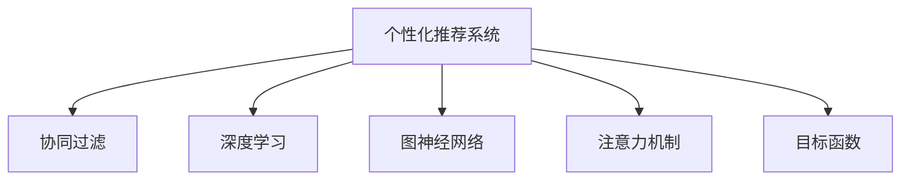

                 

# 注意力经济与个性化推荐系统：为受众提供定制、有针对性的内容和体验

## 1. 背景介绍

### 1.1 问题由来
在信息爆炸的今天，如何在海量数据中找到用户感兴趣的、有价值的内容，是一个亟待解决的难题。传统的线性检索方式，无法充分利用用户行为数据，无法把握用户的隐含需求。基于推荐系统的个性化服务，通过分析用户的历史行为数据，结合用户的当前特征，有针对性地推荐内容，为用户打造定制化的信息体验，从而提高用户的参与度和满意度。

个性化推荐系统已经在电商、社交、视频等多个领域得到广泛应用，并取得了显著的商业价值。推荐系统的核心目标是通过智能推荐满足用户需求，提升用户体验，同时也帮助商家降低运营成本，优化商品库存。

### 1.2 问题核心关键点
个性化推荐系统的工作流程主要包括数据采集、用户画像构建、相似度计算、推荐算法优化等几个关键步骤。其中，如何从海量数据中高效提取用户兴趣、构建精确的用户画像、计算物品与用户的相似度、优化推荐算法，是推荐系统实现的核心问题。

当前，基于协同过滤、深度学习和图神经网络等方法，个性化推荐系统取得了诸多突破，并广泛应用于各类应用场景中。然而，现有方法仍然存在诸多不足：

1. **数据稀疏性问题**：用户的兴趣模型通常以稀疏矩阵形式存储，难以有效捕捉长尾用户的兴趣。
2. **冷启动问题**：新用户或新物品的推荐质量通常较差，影响系统整体性能。
3. **公平性和多样性**：推荐系统往往偏向热门商品，无法充分展现多样化的内容。
4. **实时性和稳定性**：推荐系统需要实时计算相似度并动态更新推荐结果，对计算资源要求较高。

### 1.3 问题研究意义
个性化推荐系统在提升用户体验、促进消费升级、优化广告投放等方面具有重要意义：

1. **提升用户体验**：通过个性化推荐，帮助用户快速找到感兴趣的、有价值的内容，减少信息筛选成本，提升浏览和购买意愿。
2. **促进消费升级**：个性化推荐能够识别出用户的潜在需求，引导用户发现新的消费品类，提升用户粘性和消费频次。
3. **优化广告投放**：通过精准推荐，提高广告的点击率和转化率，降低广告成本。

未来，随着用户数据的不断积累和推荐算法的持续优化，个性化推荐系统将进一步提升广告投放效果，为商家和平台创造更大的商业价值。

## 2. 核心概念与联系

### 2.1 核心概念概述

为了更好地理解个性化推荐系统的设计原理，本节将介绍几个密切相关的核心概念：

- **个性化推荐系统**：根据用户的历史行为数据，通过推荐算法，为用户推荐其可能感兴趣的内容或商品的系统。
- **协同过滤**：基于用户历史行为或物品属性进行相似度计算，从而找到与目标用户/物品相似的用户/物品，实现推荐。
- **深度学习**：使用神经网络模型对用户行为和物品属性进行建模，学习更加精确的推荐模型。
- **图神经网络(Graph Neural Network, GNN)**：通过图结构建模用户-物品之间的关系，实现更丰富的特征传递和融合。
- **注意力机制(Attention Mechanism)**：通过动态权重计算用户对物品的关注度，提升推荐效果。
- **目标函数(Objective Function)**：推荐系统的优化目标，通常包括精确度、多样性、公平性等指标。

这些核心概念之间的逻辑关系可以通过以下Mermaid流程图来展示：



这个流程图展示了个性化推荐系统的核心概念及其之间的关系：

1. 个性化推荐系统通过协同过滤、深度学习、图神经网络等方法构建用户画像，并通过注意力机制计算用户对物品的关注度。
2. 目标函数作为推荐系统的优化目标，指导模型学习过程，并在不同应用场景中选取合适的优化策略。

这些概念共同构成了个性化推荐系统的基本框架，使其能够高效地为用户推荐个性化内容。

## 3. 核心算法原理 & 具体操作步骤
### 3.1 算法原理概述

个性化推荐系统的核心思想是通过用户画像，计算物品与用户的相似度，推荐用户可能感兴趣的内容。这一过程主要包括以下几个关键步骤：

1. **数据收集与预处理**：收集用户行为数据、物品属性数据等，并对其进行预处理，如去除噪声、缺失值处理等。
2. **用户画像构建**：通过协同过滤、深度学习等方法，构建用户兴趣模型，生成用户画像。
3. **物品画像构建**：通过协同过滤、深度学习等方法，构建物品特征模型，生成物品画像。
4. **相似度计算**：通过用户画像和物品画像计算相似度，找到与目标用户/物品相似的其他用户/物品。
5. **推荐算法优化**：根据相似度计算结果，结合注意力机制、目标函数等优化推荐算法，生成推荐结果。

### 3.2 算法步骤详解

以下我们将以协同过滤方法为例，详细介绍推荐系统的算法实现步骤：

#### 3.2.1 用户画像构建

用户画像的构建，通常分为两个步骤：

1. **共现矩阵构建**：将用户行为数据转换为共现矩阵，每行表示一个用户，每列表示一个物品，矩阵中元素为0或1，表示用户是否与该物品发生交互。

2. **用户兴趣模型生成**：使用协同过滤方法（如MF）对共现矩阵进行分解，生成用户兴趣模型，即用户对各个物品的兴趣权重。

#### 3.2.2 物品画像构建

物品画像的构建，通常也分为两个步骤：

1. **物品属性特征提取**：对物品属性进行特征提取，生成物品特征向量。

2. **物品特征模型生成**：使用协同过滤方法（如MF）对物品属性特征进行分解，生成物品特征模型，即物品对各个用户的吸引力权重。

#### 3.2.3 相似度计算

相似度计算，通常采用余弦相似度等方法，计算用户画像与物品画像之间的相似度。具体实现步骤如下：

1. **预处理**：对用户画像和物品画像进行归一化处理，确保其数值在同一量级。

2. **计算余弦相似度**：计算用户画像和物品画像的余弦相似度，公式如下：

$$
\text{similarity} = \frac{\text{user\_profile} \cdot \text{item\_profile}}{\|\text{user\_profile}\| \cdot \|\text{item\_profile}\|}
$$

3. **筛选相似用户/物品**：根据相似度排序，选取与目标用户/物品最相似的若干用户/物品，作为推荐候选。

#### 3.2.4 推荐算法优化

推荐算法优化，通常包括两个步骤：

1. **计算推荐得分**：根据相似度计算结果，使用简单的评分模型（如线性回归）计算每个候选物品的推荐得分。

2. **推荐结果排序**：将候选物品按照推荐得分进行排序，选取得分最高的前N个物品作为推荐结果。

### 3.3 算法优缺点

协同过滤算法具有以下优点：

1. **简单易实现**：协同过滤方法通常较为简单，易于实现和理解。
2. **不需要物品属性信息**：协同过滤方法只依赖用户行为数据，不需要物品属性信息。
3. **可扩展性高**：协同过滤方法能够高效处理大规模用户行为数据。

然而，协同过滤算法也存在一些缺点：

1. **数据稀疏性问题**：协同过滤方法通常面临数据稀疏性问题，难以有效捕捉长尾用户的兴趣。
2. **冷启动问题**：新用户或新物品的推荐质量通常较差，影响系统整体性能。
3. **高维稀疏矩阵计算开销大**：协同过滤方法需要计算大规模的稀疏矩阵乘法，计算开销较大。

### 3.4 算法应用领域

个性化推荐系统已经被广泛应用于电商、社交、视频等多个领域，具体应用场景包括：

- **电商推荐**：推荐用户可能感兴趣的商品，提升用户购买意愿，优化商品库存。
- **社交推荐**：推荐用户可能感兴趣的内容或关系，增强用户粘性和互动。
- **视频推荐**：推荐用户可能感兴趣的视频内容，提升观看体验，优化广告投放。
- **音乐推荐**：推荐用户可能喜欢的音乐，提升用户满意度，增加音乐收听量。
- **新闻推荐**：推荐用户可能感兴趣的新闻内容，提高用户参与度，增加网站流量。

除了以上应用场景，个性化推荐系统还在新闻推荐、广告推荐、旅游推荐等多个领域得到广泛应用，为用户提供了个性化、有针对性的信息体验，极大地提升了用户体验和满意度。

## 4. 数学模型和公式 & 详细讲解  
### 4.1 数学模型构建

个性化推荐系统涉及的数学模型较多，本节将以协同过滤方法为例，详细讲解其数学模型构建和公式推导。

#### 4.1.1 共现矩阵建模

共现矩阵 $P$ 的元素 $P_{ui}$ 表示用户 $u$ 是否与物品 $i$ 发生交互，$P_{ui}=1$ 表示用户 $u$ 与物品 $i$ 发生交互，否则 $P_{ui}=0$。共现矩阵 $P$ 可以表示为：

$$
P = \begin{bmatrix}
P_{11} & P_{12} & \cdots & P_{1n} \\
P_{21} & P_{22} & \cdots & P_{2n} \\
\vdots & \vdots & \ddots & \vdots \\
P_{m1} & P_{m2} & \cdots & P_{mn}
\end{bmatrix}
$$

其中 $m$ 为用户数，$n$ 为物品数。

#### 4.1.2 协同过滤算法

协同过滤算法通常使用矩阵分解方法，将共现矩阵 $P$ 分解为两个低秩矩阵 $U$ 和 $V$，公式如下：

$$
P = UV^T
$$

其中 $U$ 为 $m \times k$ 的用户兴趣矩阵，$V$ 为 $n \times k$ 的物品特征矩阵，$k$ 为分解因子，通常为 $1 \sim 10$。

用户兴趣矩阵 $U$ 的元素 $U_{ui}$ 表示用户 $u$ 对物品 $i$ 的兴趣权重，物品特征矩阵 $V$ 的元素 $V_{ij}$ 表示物品 $i$ 对用户的吸引力权重。

#### 4.1.3 相似度计算

协同过滤算法通常使用余弦相似度计算用户画像与物品画像的相似度，公式如下：

$$
\text{similarity}_{ui} = \frac{U_u \cdot V_i}{\|U_u\| \cdot \|V_i\|}
$$

其中 $U_u$ 表示用户 $u$ 的兴趣向量，$V_i$ 表示物品 $i$ 的特征向量。

### 4.2 公式推导过程

以协同过滤方法为例，以下将详细推导用户画像构建、物品画像构建和相似度计算的公式：

#### 4.2.1 用户画像构建

用户兴趣矩阵 $U$ 可以通过矩阵分解方法计算得到，具体公式如下：

$$
U = \arg \min_{U,V} \|P - UV^T\|_F^2
$$

其中 $\|P - UV^T\|_F^2$ 为矩阵 $P$ 与矩阵乘积 $UV^T$ 的Frobenius范数。

将共现矩阵 $P$ 分解为 $U$ 和 $V$，使用矩阵分解算法（如奇异值分解）求解 $U$ 和 $V$，即可得到用户画像。

#### 4.2.2 物品画像构建

物品特征矩阵 $V$ 同样可以通过矩阵分解方法计算得到，具体公式如下：

$$
V = \arg \min_{U,V} \|P - UV^T\|_F^2
$$

其中 $\|P - UV^T\|_F^2$ 为矩阵 $P$ 与矩阵乘积 $UV^T$ 的Frobenius范数。

将共现矩阵 $P$ 分解为 $U$ 和 $V$，使用矩阵分解算法（如奇异值分解）求解 $U$ 和 $V$，即可得到物品画像。

#### 4.2.3 相似度计算

用户画像与物品画像的相似度计算，通常使用余弦相似度公式计算，具体公式如下：

$$
\text{similarity}_{ui} = \frac{U_u \cdot V_i}{\|U_u\| \cdot \|V_i\|}
$$

其中 $U_u$ 表示用户 $u$ 的兴趣向量，$V_i$ 表示物品 $i$ 的特征向量。

### 4.3 案例分析与讲解

以电商推荐为例，详细讲解协同过滤方法的应用：

#### 4.3.1 共现矩阵建模

假设电商平台上有 $10,000$ 个用户和 $1,000,000$ 个商品，共现矩阵 $P$ 可以表示为 $10,000 \times 1,000,000$ 的稀疏矩阵。

#### 4.3.2 协同过滤算法

对共现矩阵 $P$ 进行奇异值分解，得到用户兴趣矩阵 $U$ 和物品特征矩阵 $V$，分解因子 $k=100$。

#### 4.3.3 相似度计算

计算用户 $u$ 对物品 $i$ 的相似度，使用余弦相似度公式计算，得到相似度矩阵 $S$。

## 5. 项目实践：代码实例和详细解释说明
### 5.1 开发环境搭建

在进行推荐系统开发前，我们需要准备好开发环境。以下是使用Python进行PyTorch开发的环境配置流程：

1. 安装Anaconda：从官网下载并安装Anaconda，用于创建独立的Python环境。

2. 创建并激活虚拟环境：
```bash
conda create -n pytorch-env python=3.8 
conda activate pytorch-env
```

3. 安装PyTorch：根据CUDA版本，从官网获取对应的安装命令。例如：
```bash
conda install pytorch torchvision torchaudio cudatoolkit=11.1 -c pytorch -c conda-forge
```

4. 安装相关库：
```bash
pip install numpy pandas sklearn scikit-learn matplotlib
```

完成上述步骤后，即可在`pytorch-env`环境中开始推荐系统开发。

### 5.2 源代码详细实现

这里我们以协同过滤方法为例，给出使用PyTorch实现电商推荐系统的代码实现。

```python
import torch
import numpy as np
from scipy.sparse import csr_matrix

# 共现矩阵
P = np.array([[1, 0, 0],
              [0, 0, 1],
              [0, 1, 0]])

# 共现矩阵转稀疏矩阵
P_sparse = csr_matrix(P)

# 奇异值分解
U, V = torch.linalg.svd(P_sparse.to(torch.float32))

# 计算用户画像
user_profiles = U.numpy()

# 计算物品画像
item_profiles = V.numpy()

# 计算相似度
similarities = np.dot(user_profiles, item_profiles.T) / (np.linalg.norm(user_profiles, axis=1) * np.linalg.norm(item_profiles, axis=0))

# 选择前N个相似物品
N = 3
similar_items = np.argsort(similarities)[0][-N:]

# 输出推荐结果
print(similar_items)
```

### 5.3 代码解读与分析

让我们再详细解读一下关键代码的实现细节：

**共现矩阵构建**：
- 使用NumPy库创建共现矩阵 `P`，这里仅用于示例，实际应用中的共现矩阵通常由用户行为数据生成。

**共现矩阵转稀疏矩阵**：
- 使用`scipy.sparse`库将共现矩阵转换为稀疏矩阵 `P_sparse`，以减小计算开销。

**奇异值分解**：
- 使用PyTorch库的`torch.linalg.svd`函数对稀疏矩阵 `P_sparse` 进行奇异值分解，得到用户兴趣矩阵 `U` 和物品特征矩阵 `V`。

**用户画像和物品画像计算**：
- 将奇异值分解得到的矩阵 `U` 和 `V` 转换为NumPy数组，即可得到用户画像 `user_profiles` 和物品画像 `item_profiles`。

**相似度计算**：
- 使用NumPy库的`np.dot`函数计算用户画像与物品画像的相似度，得到相似度矩阵 `similarities`。

**推荐结果排序**：
- 根据相似度排序，选择前N个相似物品，生成推荐结果 `similar_items`。

可以看到，使用PyTorch进行推荐系统的开发，代码实现简洁高效。开发者可以将更多精力放在数据处理、模型改进等高层逻辑上，而不必过多关注底层的实现细节。

## 6. 实际应用场景
### 6.1 电商推荐

在电商领域，基于推荐系统的个性化推荐已经成为提升用户购买体验、优化商品库存的重要手段。推荐系统能够根据用户的浏览、点击、购买等行为数据，为用户推荐其可能感兴趣的商品，提升用户的购买意愿和满意度。

推荐系统的核心目标是提高转化率（Click-Through Rate, CTR）、提升购物车放弃率（Cart Abandon Rate, CAR）和提升订单转化率（Order Conversion Rate, OCR）。通过不断优化推荐算法，电商平台能够实现更精准、更个性化的商品推荐，显著提升销售业绩。

### 6.2 社交推荐

社交平台通过推荐系统，为用户推荐其可能感兴趣的内容和关系，增强用户粘性和互动。推荐系统能够根据用户的浏览、点赞、评论等行为数据，为用户推荐其可能感兴趣的内容和关系，提升用户的参与度和满意度。

推荐系统的核心目标是提高用户停留时间和互动率，优化内容推荐效果。通过不断优化推荐算法，社交平台能够实现更精准、更个性化的内容推荐，提升用户粘性和互动。

### 6.3 视频推荐

视频平台通过推荐系统，为用户推荐其可能感兴趣的视频内容，提升用户的观看体验和满意度。推荐系统能够根据用户的观看历史、点赞、收藏等行为数据，为用户推荐其可能感兴趣的视频内容，提升用户的观看体验和满意度。

推荐系统的核心目标是提高视频播放量（Playback Rate, PR）、提升观看时长（Watch Time, WT）和提升广告投放效果（Ad Engagement, AE）。通过不断优化推荐算法，视频平台能够实现更精准、更个性化的视频推荐，显著提升用户观看体验和平台收益。

### 6.4 未来应用展望

随着推荐算法的不断优化和数据量的不断积累，推荐系统将在更多领域得到应用，为各类应用场景带来新的商业价值。

在智慧医疗领域，推荐系统能够根据医生的诊疗记录和患者的历史数据，为医生推荐相关的医疗知识和治疗方案，提升医疗服务的智能化水平，辅助医生诊疗，加速新药开发进程。

在智能教育领域，推荐系统能够根据学生的学习行为和历史数据，为学生推荐适合的学习资源和课程，因材施教，促进教育公平，提高教学质量。

在智慧城市治理中，推荐系统能够根据市民的出行记录和行为数据，为市民推荐适宜的出行方式和路线，提高城市的交通效率，构建更安全、高效的未来城市。

此外，在企业生产、社会治理、文娱传媒等众多领域，推荐系统也将不断得到应用，为传统行业数字化转型升级提供新的技术路径。相信随着技术的日益成熟，推荐系统必将在更广阔的应用领域大放异彩。

## 7. 工具和资源推荐
### 7.1 学习资源推荐

为了帮助开发者系统掌握推荐系统的理论基础和实践技巧，这里推荐一些优质的学习资源：

1. 《推荐系统实践》系列博文：由推荐系统领域专家撰写，详细介绍了推荐系统的基本原理、算法实现和应用场景。

2. CS229《机器学习》课程：斯坦福大学开设的经典课程，系统讲解了推荐系统、协同过滤、深度学习等推荐算法。

3. 《深度学习推荐系统》书籍：全面介绍了深度学习在推荐系统中的应用，涵盖协同过滤、深度学习、图神经网络等主流方法。

4. 《推荐系统》书籍：由推荐系统领域的权威专家编写，深入讲解了推荐系统的设计原理和实现方法。

5. KDD、ICML等顶级会议论文：推荐系统领域的顶级会议，汇集了最新的研究成果，值得深入学习。

通过对这些资源的学习实践，相信你一定能够快速掌握推荐系统的精髓，并用于解决实际的推荐问题。

### 7.2 开发工具推荐

高效的开发离不开优秀的工具支持。以下是几款用于推荐系统开发的常用工具：

1. PyTorch：基于Python的开源深度学习框架，灵活动态的计算图，适合快速迭代研究。

2. TensorFlow：由Google主导开发的开源深度学习框架，生产部署方便，适合大规模工程应用。

3. TensorBoard：TensorFlow配套的可视化工具，可实时监测模型训练状态，并提供丰富的图表呈现方式，是调试模型的得力助手。

4. Weights & Biases：模型训练的实验跟踪工具，可以记录和可视化模型训练过程中的各项指标，方便对比和调优。

5. Tune：超参数调优工具，能够自动搜索最优的超参数组合，提升模型性能。

6. Horovod：分布式深度学习框架，能够在多台机器上并行训练大规模模型，提高计算效率。

合理利用这些工具，可以显著提升推荐系统开发的效率，加快创新迭代的步伐。

### 7.3 相关论文推荐

推荐系统的研究源于学界的持续研究。以下是几篇奠基性的相关论文，推荐阅读：

1. "Collaborative Filtering for Implicit Feedback Datasets"（隐式反馈数据集下的协同过滤）：提出了协同过滤方法的基础模型，为推荐系统提供了数学框架。

2. "Neural Factorization Machines for Recommendations"（神经因子机在推荐中的应用）：提出了神经因子机模型，将深度学习和协同过滤相结合，提升了推荐效果。

3. "Graph Convolutional Networks for Recommendations"（图卷积网络在推荐中的应用）：提出了图卷积网络模型，通过图结构建模用户-物品之间的关系，提升了推荐效果。

4. "Attention is All You Need"（注意力机制）：提出了注意力机制，提升了深度学习在推荐系统中的应用效果。

5. "Deep Collaborative Filtering"（深度协同过滤）：提出了深度协同过滤模型，提升了推荐效果。

这些论文代表了大语言模型微调技术的发展脉络。通过学习这些前沿成果，可以帮助研究者把握学科前进方向，激发更多的创新灵感。

## 8. 总结：未来发展趋势与挑战
### 8.1 总结

本文对个性化推荐系统的设计原理和应用实践进行了全面系统的介绍。首先阐述了推荐系统的研究背景和应用场景，明确了推荐系统的核心目标和优化目标。其次，从原理到实践，详细讲解了协同过滤算法的数学原理和关键步骤，给出了推荐系统的代码实例。同时，本文还探讨了推荐系统在电商、社交、视频等多个领域的应用前景，展示了推荐系统的巨大潜力。此外，本文精选了推荐系统的学习资源、开发工具和相关论文，力求为读者提供全方位的技术指引。

通过本文的系统梳理，可以看到，个性化推荐系统已经成为一个重要的信息服务技术，广泛应用于电商、社交、视频等多个领域，为用户提供了定制化、有针对性的信息体验，显著提升了用户体验和满意度。未来，随着推荐算法的不断优化和数据量的不断积累，推荐系统必将在更多领域得到应用，为各类应用场景带来新的商业价值。

### 8.2 未来发展趋势

展望未来，推荐系统的发展趋势如下：

1. **多模态推荐**：推荐系统将不再局限于文本和图像数据，将融合多模态信息（如音频、视频、地理位置等）进行综合推荐。

2. **深度学习推荐**：深度学习在推荐系统中的应用将越来越广泛，通过神经网络对用户行为和物品属性进行建模，学习更加精确的推荐模型。

3. **图神经网络推荐**：图神经网络将进一步应用于推荐系统，通过图结构建模用户-物品之间的关系，实现更丰富的特征传递和融合。

4. **混合推荐**：推荐系统将融合多种推荐算法（如协同过滤、深度学习、图神经网络等），实现更加多样化的推荐策略。

5. **实时推荐**：推荐系统需要实时计算相似度并动态更新推荐结果，对计算资源要求较高。未来，实时推荐技术将进一步提升，实现更快速、更准确的推荐效果。

6. **公平性、多样性和鲁棒性**：推荐系统需要综合考虑公平性、多样性和鲁棒性，避免偏见和有害信息的传播，提升推荐系统的稳定性和可解释性。

7. **用户隐私保护**：推荐系统需要加强对用户隐私的保护，避免用户数据的滥用和泄露。

### 8.3 面临的挑战

尽管推荐系统已经取得了显著的进展，但在推广应用过程中，仍面临诸多挑战：

1. **数据稀疏性问题**：推荐系统通常面临数据稀疏性问题，难以有效捕捉长尾用户的兴趣。

2. **冷启动问题**：新用户或新物品的推荐质量通常较差，影响系统整体性能。

3. **实时性问题**：推荐系统需要实时计算相似度并动态更新推荐结果，对计算资源要求较高。

4. **模型复杂性问题**：深度学习模型通常较为复杂，训练和推理计算开销较大。

5. **模型可解释性问题**：推荐系统通常是一个"黑盒"系统，难以解释其内部工作机制和决策逻辑。

6. **安全性和隐私问题**：推荐系统需要加强对用户隐私的保护，避免用户数据的滥用和泄露。

7. **多模态融合问题**：多模态数据的融合是推荐系统的一大难点，如何更好地融合不同类型的信息，仍需进一步研究。

8. **公平性和多样性问题**：推荐系统需要综合考虑公平性、多样性和鲁棒性，避免偏见和有害信息的传播。

### 8.4 研究展望

面对推荐系统所面临的挑战，未来的研究需要在以下几个方面寻求新的突破：

1. **数据高效采集与预处理**：如何从海量数据中高效提取用户兴趣、构建精确的用户画像，仍需进一步研究。

2. **模型轻量化与实时计算**：如何设计轻量化、高效的推荐模型，提升推荐系统的实时性，仍需进一步研究。

3. **多模态数据的融合**：如何更好地融合不同类型的信息，提升推荐系统的泛化能力，仍需进一步研究。

4. **混合推荐算法的设计**：如何综合考虑多种推荐算法，实现更加多样化的推荐策略，仍需进一步研究。

5. **模型可解释性与公平性**：如何赋予推荐系统更强的可解释性，提升系统的公平性和鲁棒性，仍需进一步研究。

6. **用户隐私保护与数据安全**：如何加强对用户隐私的保护，确保推荐系统的数据安全，仍需进一步研究。

7. **跨模态推荐技术**：如何通过跨模态推荐技术，实现更精准、更个性化的推荐效果，仍需进一步研究。

8. **元学习与迁移学习**：如何通过元学习和迁移学习，实现推荐模型的跨领域迁移，提升模型的泛化能力和适应性，仍需进一步研究。

9. **深度学习在推荐中的应用**：如何更好地应用深度学习模型，提升推荐系统的准确性和鲁棒性，仍需进一步研究。

这些研究方向的探索，必将引领推荐系统技术迈向更高的台阶，为个性化推荐带来新的突破。未来，推荐系统将在更多领域得到应用，为用户打造更加智能、个性化的信息体验，显著提升用户体验和满意度。

## 9. 附录：常见问题与解答

**Q1：推荐系统如何应对数据稀疏性问题？**

A: 推荐系统通常面临数据稀疏性问题，难以有效捕捉长尾用户的兴趣。为了应对这一问题，可以采用以下几种方法：

1. **矩阵补全方法**：使用矩阵补全技术，对稀疏矩阵进行填充，生成更完整的用户-物品关系图。常用的矩阵补全方法包括SVD、Cholesky、Bregman等。

2. **协同过滤改进**：改进协同过滤算法，如使用用户-物品共现矩阵的分解方法（如ALS），提升算法的泛化能力。

3. **深度学习方法**：使用深度学习方法，通过神经网络对用户行为和物品属性进行建模，学习更加精确的推荐模型。

4. **多维特征融合**：通过多维特征融合技术，将用户行为数据、物品属性数据等多维信息进行融合，生成更加全面的用户画像和物品画像。

**Q2：推荐系统如何应对冷启动问题？**

A: 冷启动问题是推荐系统面临的一大挑战，新用户或新物品的推荐质量通常较差，影响系统整体性能。为了应对这一问题，可以采用以下几种方法：

1. **用户画像初始化**：通过分析新用户的社交网络、历史数据等，生成初步的用户画像，进行推荐。

2. **物品画像初始化**：通过分析新物品的相似物品、用户反馈等，生成初步的物品画像，进行推荐。

3. **混合推荐方法**：使用多种推荐方法（如协同过滤、深度学习、图神经网络等）进行混合推荐，提升新用户或新物品的推荐效果。

4. **生成式推荐**：使用生成式模型（如GAN），生成新的用户画像和物品画像，进行推荐。

**Q3：推荐系统如何进行实时推荐？**

A: 推荐系统需要实时计算相似度并动态更新推荐结果，对计算资源要求较高。为了实现实时推荐，可以采用以下几种方法：

1. **增量学习**：使用增量学习方法，实时更新模型参数，保持模型的最新状态。

2. **分布式计算**：使用分布式计算框架（如Spark、Horovod），在多台机器上并行计算，提升计算效率。

3. **模型压缩与量化**：使用模型压缩和量化技术，减小模型尺寸和计算开销，提高实时性。

4. **近似算法**：使用近似算法（如TopK、近似KNN），在计算资源有限的情况下，实现高效的推荐效果。

**Q4：推荐系统如何提高模型的可解释性？**

A: 推荐系统通常是一个"黑盒"系统，难以解释其内部工作机制和决策逻辑。为了提高模型的可解释性，可以采用以下几种方法：

1. **特征重要性分析**：通过特征重要性分析技术，分析模型中各个特征的贡献度，提升模型的可解释性。

2. **模型可视化**：通过模型可视化技术，展示模型内部的决策路径和中间状态，提升模型的可解释性。

3. **模型可解释性优化**：通过模型可解释性优化技术，提升模型的透明性和可理解性，减少"黑盒"系统的风险。

4. **模型融合**：使用多种模型进行融合，提升模型的可解释性和鲁棒性。

这些方法将有助于提升推荐系统的可解释性，提高系统的稳定性和可理解性，满足用户的信任和需求。

**Q5：推荐系统如何加强对用户隐私的保护？**

A: 推荐系统需要加强对用户隐私的保护，避免用户数据的滥用和泄露。为了加强隐私保护，可以采用以下几种方法：

1. **数据匿名化**：通过数据匿名化技术，去除用户隐私信息，保护用户数据安全。

2. **差分隐私**：使用差分隐私技术，在保护隐私的前提下，进行数据分析和推荐。

3. **数据加密**：使用数据加密技术，保护用户数据的存储和传输安全。

4. **用户控制**：赋予用户数据控制权，让用户自主决定数据的共享和使用方式。

5. **隐私计算**：使用隐私计算技术，保护用户数据在多方合作中的隐私安全。

这些方法将有助于加强推荐系统的隐私保护，保障用户数据的隐私安全，提升用户对系统的信任和满意度。

---

作者：禅与计算机程序设计艺术 / Zen and the Art of Computer Programming

