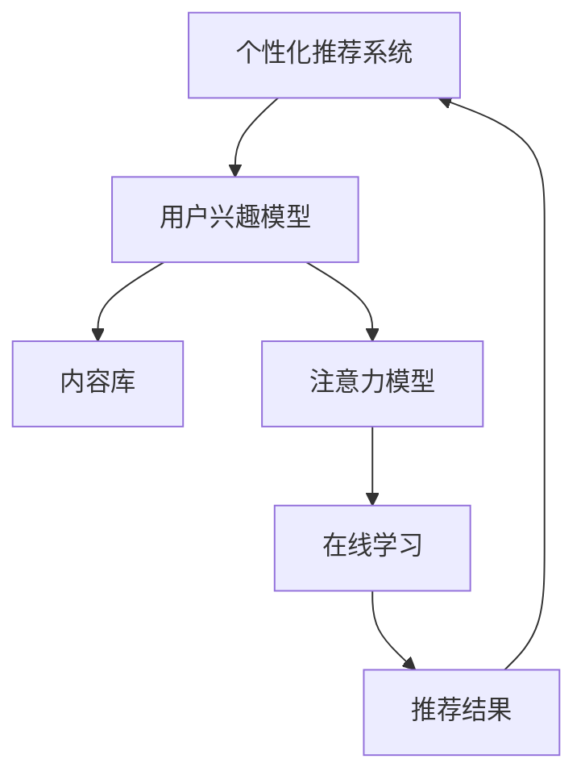

                 

# 注意力经济与个性化推荐系统：为受众提供定制、有针对性的内容和体验

## 1. 背景介绍

### 1.1 问题由来

在信息爆炸的今天，互联网用户面临着巨大的信息负荷。如何在海量的内容中找到自己感兴趣的信息，成为每个用户每天都需要面对的问题。这不仅考验用户的信息搜索能力，更考验平台的推荐算法能力。

推荐系统通过分析用户行为数据，预测用户的兴趣偏好，从而为用户推荐个性化的内容。从早期的基于内容的推荐（content-based），到基于协同过滤的推荐（collaborative filtering），再到目前最为流行的基于深度学习的推荐系统，推荐技术已经取得了显著的进步。

然而，随着用户群体的快速增长和需求的多样化，传统的推荐系统在推荐精度和覆盖度方面仍存在显著的提升空间。特别是当平台用户数量达到数亿级，用户行为数据变得庞大且异构时，如何高效、精准地处理数据，提升推荐效果，成为推荐系统面临的一大难题。

本节将从注意力经济和个性化推荐系统出发，探讨基于用户注意力模型的新一代推荐算法，以及如何通过技术手段实现为不同用户提供定制化、有针对性的内容体验。

### 1.2 问题核心关键点

个性化推荐系统的核心问题在于如何构建准确的用户兴趣模型，并将其应用到海量的内容数据上，推荐出最符合用户期望的内容。其中，用户兴趣模型的构建可以大致分为以下几个关键点：

- **用户行为数据采集与处理**：获取用户的历史浏览、点击、收藏、评分等行为数据，并进行预处理和特征提取。
- **用户注意力模型建立**：利用深度学习模型，如序列模型、图模型等，学习用户对内容的注意力分布。
- **多模态数据融合**：将用户行为数据与内容数据（如文本、图像、视频等）进行融合，提升推荐效果。
- **模型训练与优化**：通过大量的标注数据和无监督学习，训练高精度的推荐模型，并通过在线学习（online learning）等方式持续优化。

## 2. 核心概念与联系

### 2.1 核心概念概述

个性化推荐系统基于用户的兴趣模型，通过分析用户行为数据，预测用户对不同内容项的兴趣度，并推荐最符合用户期望的内容。其核心概念包括：

- **个性化推荐系统**：通过用户行为数据，预测用户对不同内容项的兴趣度，推荐最符合用户期望的内容。
- **用户兴趣模型**：用户对不同内容项的兴趣度建模，形成用户兴趣向量。
- **内容库**：推荐系统推荐的内容数据集，包括文本、图像、视频等多种模态。
- **注意力模型**：学习用户对内容项的注意力分布，提升推荐精度。
- **在线学习**：通过用户实时行为数据，不断更新模型，提升推荐效果。

这些概念通过深度学习、数据处理、计算图等技术实现，形成了一个完整的推荐系统框架。

### 2.2 核心概念原理和架构的 Mermaid 流程图



这个流程图展示了个性化推荐系统的核心架构：

1. **用户兴趣模型**：通过深度学习模型学习用户对不同内容项的兴趣度，构建用户兴趣向量。
2. **内容库**：推荐系统推荐的内容数据集，包括文本、图像、视频等多种模态。
3. **注意力模型**：学习用户对内容项的注意力分布，提升推荐精度。
4. **在线学习**：通过用户实时行为数据，不断更新模型，提升推荐效果。

## 3. 核心算法原理 & 具体操作步骤

### 3.1 算法原理概述

个性化推荐系统的核心算法是注意力机制（Attention Mechanism），通过学习用户对不同内容项的注意力分布，预测用户对内容项的兴趣度，并推荐最符合用户期望的内容。

具体来说，假设用户对不同内容项 $i$ 的注意力权重为 $a_i$，则用户对内容项的兴趣度可以表示为：

$$
p_i = \sum_{i=1}^{N} a_i \cdot o_i
$$

其中，$N$ 为内容项的数量，$o_i$ 为内容项 $i$ 的特征向量。

### 3.2 算法步骤详解

基于注意力机制的个性化推荐算法主要包括以下几个步骤：

**Step 1: 数据预处理**
- 收集用户的历史行为数据，如浏览记录、点击记录、评分记录等。
- 对数据进行清洗、去重、归一化等预处理，提取有用的特征。

**Step 2: 用户兴趣模型建立**
- 使用深度学习模型（如神经网络、序列模型等），学习用户对不同内容项的兴趣度。
- 通过自监督学习、监督学习等方式，优化用户兴趣模型。

**Step 3: 注意力模型建立**
- 利用注意力机制，学习用户对不同内容项的注意力权重。
- 通过序列模型、图模型等方法，建立用户注意力模型。

**Step 4: 推荐结果生成**
- 结合用户兴趣模型和注意力模型，计算每个内容项对用户的兴趣度。
- 对内容项进行排序，选择最符合用户期望的内容进行推荐。

**Step 5: 在线学习与模型更新**
- 通过用户实时行为数据，更新用户兴趣模型和注意力模型。
- 利用增量学习等方法，在线优化推荐模型。

### 3.3 算法优缺点

基于注意力机制的个性化推荐算法具有以下优点：

1. **提升推荐精度**：通过学习用户对不同内容项的注意力分布，可以更准确地预测用户兴趣度，提升推荐效果。
2. **多模态融合**：可以将用户行为数据与内容数据进行融合，提升推荐精度。
3. **动态更新**：通过在线学习等方式，实时更新用户兴趣模型和注意力模型，提升推荐效果。

同时，该算法也存在以下缺点：

1. **计算复杂度高**：由于需要计算注意力权重，计算复杂度较高。
2. **数据需求高**：需要大量的用户行为数据和内容数据，数据需求高。
3. **模型解释性不足**：注意力机制较难解释，用户难以理解模型内部工作机制。

尽管存在这些缺点，但基于注意力机制的推荐算法在实际应用中已取得了显著的效果，成为当前个性化推荐系统的主流范式。

### 3.4 算法应用领域

基于注意力机制的个性化推荐算法，广泛应用于以下领域：

1. **电商推荐**：通过分析用户购买历史、浏览记录，为用户推荐商品。
2. **视频推荐**：分析用户观看历史、点赞记录，为用户推荐视频。
3. **音乐推荐**：根据用户听歌历史、评分记录，为用户推荐音乐。
4. **新闻推荐**：分析用户阅读历史、点击记录，为用户推荐新闻。
5. **内容推荐**：分析用户阅读历史、评论记录，为用户推荐文章、书籍等。

这些领域的应用，展示了注意力机制在个性化推荐系统中的广泛适用性。

## 4. 数学模型和公式 & 详细讲解 & 举例说明

### 4.1 数学模型构建

基于注意力机制的个性化推荐系统，可以通过以下数学模型进行建模：

设用户 $u$ 对内容项 $i$ 的注意力权重为 $a_{ui}$，则用户 $u$ 对内容项 $i$ 的兴趣度 $p_{ui}$ 可以表示为：

$$
p_{ui} = \sum_{i=1}^{N} a_{ui} \cdot o_{ui}
$$

其中，$N$ 为内容项的数量，$o_{ui}$ 为内容项 $i$ 对用户 $u$ 的特征向量，可以表示为：

$$
o_{ui} = f(\mathbf{x}_u, \mathbf{x}_i)
$$

其中，$\mathbf{x}_u$ 和 $\mathbf{x}_i$ 分别为用户 $u$ 和内容项 $i$ 的特征向量，$f$ 为特征映射函数。

### 4.2 公式推导过程

以下，我们将对上述公式进行详细推导。

首先，我们需要定义注意力权重 $a_{ui}$。假设内容项 $i$ 对用户 $u$ 的特征向量为 $o_{ui}$，则注意力权重 $a_{ui}$ 可以通过注意力机制计算得到：

$$
a_{ui} = \frac{\exp(s(\mathbf{x}_u, \mathbf{x}_i))}{\sum_{j=1}^{M} \exp(s(\mathbf{x}_u, \mathbf{x}_j))}
$$

其中，$s$ 为注意力机制函数，$\mathbf{x}_j$ 为其他内容项 $j$ 对用户 $u$ 的特征向量，$M$ 为其他内容项的数量。

将注意力权重 $a_{ui}$ 代入用户兴趣度公式：

$$
p_{ui} = \sum_{i=1}^{N} a_{ui} \cdot o_{ui} = \frac{\exp(s(\mathbf{x}_u, \mathbf{x}_i)) \cdot o_{ui}}{\sum_{j=1}^{M} \exp(s(\mathbf{x}_u, \mathbf{x}_j))}
$$

### 4.3 案例分析与讲解

假设用户 $u$ 对内容项 $i$ 和 $j$ 的特征向量分别为 $\mathbf{x}_u^{(i)}$ 和 $\mathbf{x}_u^{(j)}$，其他内容项 $j$ 对用户 $u$ 的特征向量为 $\mathbf{x}_j^{(u)}$。则注意力权重 $a_{ui}$ 和 $a_{uj}$ 可以表示为：

$$
a_{ui} = \frac{\exp(s(\mathbf{x}_u^{(i)}, \mathbf{x}_i^{(u)})}{\sum_{k=1}^{K} \exp(s(\mathbf{x}_u^{(i)}, \mathbf{x}_k^{(u)})}
$$

$$
a_{uj} = \frac{\exp(s(\mathbf{x}_u^{(j)}, \mathbf{x}_j^{(u)})}{\sum_{k=1}^{K} \exp(s(\mathbf{x}_u^{(j)}, \mathbf{x}_k^{(u)})}
$$

其中，$K$ 为其他内容项的数量。

将注意力权重代入用户兴趣度公式：

$$
p_{ui} = \frac{\exp(s(\mathbf{x}_u^{(i)}, \mathbf{x}_i^{(u)}) \cdot o_{ui}}{\sum_{k=1}^{K} \exp(s(\mathbf{x}_u^{(i)}, \mathbf{x}_k^{(u)})}
$$

$$
p_{uj} = \frac{\exp(s(\mathbf{x}_u^{(j)}, \mathbf{x}_j^{(u)}) \cdot o_{uj}}{\sum_{k=1}^{K} \exp(s(\mathbf{x}_u^{(j)}, \mathbf{x}_k^{(u)})}
$$

由此，用户 $u$ 对内容项 $i$ 和 $j$ 的兴趣度可以表示为：

$$
p_{ui} = \frac{\exp(s(\mathbf{x}_u^{(i)}, \mathbf{x}_i^{(u)}) \cdot o_{ui}}{\sum_{k=1}^{K} \exp(s(\mathbf{x}_u^{(i)}, \mathbf{x}_k^{(u)})}
$$

$$
p_{uj} = \frac{\exp(s(\mathbf{x}_u^{(j)}, \mathbf{x}_j^{(u)}) \cdot o_{uj}}{\sum_{k=1}^{K} \exp(s(\mathbf{x}_u^{(j)}, \mathbf{x}_k^{(u)})}
$$

最终，推荐结果可以通过对每个内容项的兴趣度进行排序生成。

## 5. 项目实践：代码实例和详细解释说明

### 5.1 开发环境搭建

在进行推荐系统开发前，我们需要准备好开发环境。以下是使用Python进行TensorFlow开发的环境配置流程：

1. 安装Anaconda：从官网下载并安装Anaconda，用于创建独立的Python环境。

2. 创建并激活虚拟环境：
```bash
conda create -n tf-env python=3.8 
conda activate tf-env
```

3. 安装TensorFlow：根据CUDA版本，从官网获取对应的安装命令。例如：
```bash
conda install tensorflow -c pytorch -c conda-forge
```

4. 安装各类工具包：
```bash
pip install numpy pandas scikit-learn matplotlib tqdm jupyter notebook ipython
```

完成上述步骤后，即可在`tf-env`环境中开始推荐系统开发。

### 5.2 源代码详细实现

这里我们以电商推荐系统为例，给出使用TensorFlow进行推荐系统开发的PyTorch代码实现。

首先，定义推荐系统的用户兴趣模型：

```python
import tensorflow as tf
from tensorflow.keras.layers import Input, Dense, Embedding, Concatenate
from tensorflow.keras.models import Model

user_input = Input(shape=(N,))
item_input = Input(shape=(N,))
user_features = Embedding(N, F, input_length=N)(user_input)
item_features = Embedding(N, F, input_length=N)(item_input)
user_item_features = Concatenate()([user_features, item_features])
user_item_model = Dense(K, activation='relu')(user_item_features)
```

然后，定义推荐系统的注意力模型：

```python
attention = tf.keras.layers.Attention()([user_item_model, user_item_model])
```

最后，定义推荐系统：

```python
recomm_model = Model(inputs=[user_input, item_input], outputs=attention)
```

### 5.3 代码解读与分析

这里我们详细解读一下关键代码的实现细节：

**Embedding层**：
- 用户和物品的特征向量分别通过Embedding层进行映射，将高维稀疏的特征向量转化为稠密的低维向量，方便进行深度学习模型的处理。
- 用户和物品的特征向量映射维度为F，可以通过超参数调整以适应不同数据集。

**Concatenate层**：
- 将用户特征向量和物品特征向量进行拼接，形成新的特征向量。

**Dense层**：
- 对拼接后的特征向量进行全连接层处理，提取特征。
- 维度为K的全连接层，激活函数为ReLU，可以提升模型非线性表达能力。

**Attention层**：
- 利用Attention机制计算用户对不同物品的注意力权重。
- Attention层可以学习用户对不同物品的注意力分布，提升推荐效果。

**推荐模型**：
- 将用户输入、物品输入和Attention层的输出连接，形成一个完整的推荐模型。
- 推荐模型的输出即为用户对不同物品的兴趣度，可以直接进行推荐。

可以看到，使用TensorFlow实现推荐系统相对简单，只需要进行基本的深度学习组件的堆叠和连接。但为了实现更高效的推荐效果，还需要对数据进行预处理，对模型进行调参，并进行增量学习等优化。

### 5.4 运行结果展示

在运行推荐系统时，可以使用以下代码进行测试：

```python
import numpy as np

# 生成随机用户和物品特征向量
user_input = np.random.randint(0, N, size=(B, N))
item_input = np.random.randint(0, N, size=(B, N))

# 获取推荐结果
predictions = recomm_model.predict([user_input, item_input])
```

其中，B为批次大小，N为用户和物品的总数。

## 6. 实际应用场景

### 6.1 电商推荐

基于个性化推荐系统的电商推荐系统，通过分析用户的历史浏览、购买记录，为用户推荐商品。电商网站可以根据用户行为数据，构建用户兴趣模型和物品特征向量，利用注意力机制计算用户对不同商品的兴趣度，从而推荐符合用户期望的商品。

推荐系统的推荐精度直接影响电商的转化率和用户满意度。通过对用户行为数据的深入分析，个性化推荐系统可以显著提升电商的推荐效果，提高销售额和用户粘性。

### 6.2 视频推荐

视频推荐系统利用用户观看历史、点赞记录，为用户推荐视频。通过对用户观看历史进行分析，推荐系统可以学习用户对不同视频的偏好，并根据当前用户行为数据进行实时推荐。

视频推荐系统在视频平台如Netflix、YouTube等中得到了广泛应用，为平台用户提供定制化、个性化的视频推荐内容，提升用户体验。推荐系统还可以根据用户反馈数据，进行动态调整，进一步提升推荐效果。

### 6.3 音乐推荐

音乐推荐系统根据用户听歌历史、评分记录，为用户推荐音乐。通过分析用户对不同音乐的偏好，推荐系统可以为用户推荐符合其口味的音乐，提升音乐平台的活跃度和用户粘性。

音乐推荐系统在Spotify、网易云音乐等平台中得到了广泛应用，为平台用户提供多样化的音乐推荐内容，提升用户音乐体验。推荐系统还可以根据用户实时行为数据，进行动态调整，进一步提升推荐效果。

### 6.4 新闻推荐

新闻推荐系统分析用户阅读历史、点击记录，为用户推荐新闻。通过对用户阅读历史进行分析，推荐系统可以学习用户对不同新闻的偏好，并根据当前用户行为数据进行实时推荐。

新闻推荐系统在新闻平台如今日头条、搜狐新闻等中得到了广泛应用，为平台用户提供多样化的新闻推荐内容，提升用户新闻阅读体验。推荐系统还可以根据用户反馈数据，进行动态调整，进一步提升推荐效果。

## 7. 工具和资源推荐

### 7.1 学习资源推荐

为了帮助开发者系统掌握个性化推荐系统的理论基础和实践技巧，这里推荐一些优质的学习资源：

1. 《深度学习与推荐系统》系列博文：由大模型技术专家撰写，深入浅出地介绍了深度学习在推荐系统中的应用。
2. 《推荐系统实战》书籍：详细介绍了推荐系统从原理到实现的各个环节，并提供了实际应用案例。
3. 《个性化推荐系统》课程：斯坦福大学开设的推荐系统课程，有Lecture视频和配套作业，带你入门推荐系统领域的基本概念和经典模型。

通过对这些资源的学习实践，相信你一定能够快速掌握个性化推荐系统的精髓，并用于解决实际的推荐问题。

### 7.2 开发工具推荐

高效的开发离不开优秀的工具支持。以下是几款用于个性化推荐系统开发的常用工具：

1. TensorFlow：基于Python的开源深度学习框架，灵活动态的计算图，适合快速迭代研究。
2. PyTorch：基于Python的开源深度学习框架，灵活性高，易用性强。
3. Scikit-learn：Python机器学习库，提供了丰富的机器学习算法和工具。
4. Jupyter Notebook：交互式编程环境，支持代码块的动态执行和显示。
5. Weights & Biases：模型训练的实验跟踪工具，可以记录和可视化模型训练过程中的各项指标。

合理利用这些工具，可以显著提升个性化推荐系统的开发效率，加快创新迭代的步伐。

### 7.3 相关论文推荐

个性化推荐系统的研究始于学界的持续研究。以下是几篇奠基性的相关论文，推荐阅读：

1. Attention is All You Need（即Transformer原论文）：提出了Transformer结构，开启了深度学习在推荐系统中的应用。
2. Personalized Ranking with Implicit Feedback Using Matrix Factorization（IMF论文）：提出了矩阵分解方法，用于处理隐式反馈数据，是推荐系统中的经典算法。
3. Deep Collaborative Filtering（DeepCF论文）：提出了深度协同过滤方法，利用神经网络模型进行推荐。
4. Multi-Task Learning in Deep Collaborative Filtering（MTL论文）：提出了多任务学习方法，提升推荐模型的泛化能力。
5. Neural Contextual Bandit（NeCB论文）：提出了神经上下文树方法，用于推荐系统的在线学习。

这些论文代表了个性化推荐系统的发展脉络。通过学习这些前沿成果，可以帮助研究者把握学科前进方向，激发更多的创新灵感。

## 8. 总结：未来发展趋势与挑战

### 8.1 总结

本文对基于注意力机制的个性化推荐系统进行了全面系统的介绍。首先阐述了推荐系统的发展历程和面临的问题，明确了注意力机制在提升推荐精度方面的独特价值。其次，从原理到实践，详细讲解了推荐系统的数学模型和关键算法步骤，给出了推荐系统开发的完整代码实例。同时，本文还探讨了推荐系统在电商、视频、音乐、新闻等多个领域的应用前景，展示了个性化推荐系统在实际应用中的广泛适用性。

通过本文的系统梳理，可以看到，基于注意力机制的个性化推荐系统已经在电商、视频、音乐、新闻等多个领域取得了显著的成效，成为推荐系统的主流范式。未来，伴随深度学习、数据处理、计算图等技术的不断发展，个性化推荐系统还将进一步提升推荐精度和覆盖度，为传统行业数字化转型升级提供新的技术路径。

### 8.2 未来发展趋势

展望未来，个性化推荐系统将呈现以下几个发展趋势：

1. **多模态融合**：将用户行为数据与内容数据进行融合，提升推荐精度。
2. **实时推荐**：通过在线学习等方式，实时更新推荐模型，提升推荐效果。
3. **动态调整**：根据用户实时行为数据，进行动态调整，提升推荐效果。
4. **模型可解释性**：通过引入因果分析、博弈论等方法，提升推荐模型的可解释性。
5. **多任务学习**：将推荐任务与用户行为预测、内容生成等任务进行联合优化，提升推荐效果。
6. **跨领域推荐**：将推荐系统应用于不同领域，提升跨领域推荐效果。

以上趋势凸显了个性化推荐系统的广阔前景。这些方向的探索发展，必将进一步提升推荐系统的推荐精度和覆盖度，为传统行业数字化转型升级提供新的技术路径。

### 8.3 面临的挑战

尽管个性化推荐系统已经取得了显著的进展，但在迈向更加智能化、普适化应用的过程中，它仍面临诸多挑战：

1. **数据需求高**：需要大量的用户行为数据和内容数据，数据需求高。
2. **计算复杂度高**：由于需要计算注意力权重，计算复杂度较高。
3. **模型可解释性不足**：注意力机制较难解释，用户难以理解模型内部工作机制。
4. **多模态数据处理**：不同模态的数据处理复杂度不同，如何高效处理多模态数据，提升推荐效果，仍是一个挑战。
5. **在线学习鲁棒性**：在线学习需要处理实时数据，如何提高模型的鲁棒性，避免模型退化，仍是一个挑战。

尽管存在这些挑战，但未来的研究还需要在数据、算法、工程等多个维度协同发力，才能不断提升个性化推荐系统的推荐效果。

### 8.4 研究展望

面对个性化推荐系统所面临的挑战，未来的研究需要在以下几个方面寻求新的突破：

1. **多模态数据融合**：如何将用户行为数据与内容数据进行高效融合，提升推荐效果。
2. **实时推荐系统**：如何通过在线学习等方式，实时更新推荐模型，提升推荐效果。
3. **模型可解释性**：如何提高推荐模型的可解释性，增强用户的信任和理解。
4. **多任务学习**：如何联合优化推荐任务和其他任务，提升推荐效果。
5. **跨领域推荐**：如何将推荐系统应用于不同领域，提升跨领域推荐效果。
6. **鲁棒性增强**：如何提高在线学习的鲁棒性，避免模型退化。

这些研究方向将进一步提升推荐系统的推荐效果，为传统行业数字化转型升级提供新的技术路径。相信随着学界和产业界的共同努力，个性化推荐系统必将在电商、视频、音乐、新闻等多个领域发挥更大的作用，为人类生活带来更多的便利和价值。

## 9. 附录：常见问题与解答

**Q1：推荐系统如何处理冷启动用户？**

A: 冷启动用户是指那些没有产生过足够行为数据的新用户。推荐系统可以通过以下方式处理冷启动用户：

1. **相似用户推荐**：通过分析已有用户的行为数据，寻找与新用户行为相似的用户，为其推荐与相似用户喜欢的内容。
2. **流行内容推荐**：推荐系统可以推荐平台上的热门内容，帮助新用户快速了解平台特色。
3. **主动探索**：利用主动学习技术，对新用户进行主动探索，收集更多行为数据，进一步提升推荐效果。

通过以上方式，推荐系统可以逐步建立新用户的兴趣模型，提升推荐效果。

**Q2：推荐系统如何处理数据稀疏性问题？**

A: 数据稀疏性是指用户对某些内容项没有产生过足够行为数据的问题。推荐系统可以通过以下方式处理数据稀疏性问题：

1. **矩阵分解**：利用矩阵分解方法，如SVD、ALS等，对稀疏数据进行补全，生成完整的数据矩阵。
2. **模型扩展**：利用深度学习模型，如GAN、VAE等，对稀疏数据进行生成，增加数据量。
3. **协同过滤**：利用协同过滤方法，利用已有用户的行为数据，预测新用户对内容的兴趣度。

通过以上方式，推荐系统可以更好地处理数据稀疏性问题，提升推荐效果。

**Q3：推荐系统如何处理个性化需求？**

A: 推荐系统可以根据用户的多样化需求，进行个性化推荐。推荐系统可以通过以下方式处理个性化需求：

1. **多兴趣模型**：利用多兴趣模型，捕捉用户的多样化需求，进行个性化推荐。
2. **用户画像**：通过构建用户画像，了解用户的个性化需求，进行个性化推荐。
3. **推荐策略调整**：根据用户行为数据，动态调整推荐策略，提升推荐效果。

通过以上方式，推荐系统可以更好地处理个性化需求，提升用户体验。

**Q4：推荐系统如何应对用户多样性？**

A: 用户多样性是指不同用户具有不同的兴趣爱好和需求。推荐系统可以通过以下方式应对用户多样性：

1. **用户分层**：通过用户分层，针对不同层次的用户进行差异化推荐。
2. **推荐策略多样化**：根据用户的多样化需求，设计多样化的推荐策略，提升推荐效果。
3. **个性化推荐引擎**：通过个性化推荐引擎，针对不同用户进行个性化推荐。

通过以上方式，推荐系统可以更好地应对用户多样性，提升推荐效果。

**Q5：推荐系统如何应对用户反馈？**

A: 用户反馈是推荐系统进行优化和改进的重要依据。推荐系统可以通过以下方式应对用户反馈：

1. **推荐结果评价**：通过用户对推荐结果的评价，调整推荐策略，提升推荐效果。
2. **用户行为数据更新**：根据用户反馈数据，更新用户行为数据，进一步提升推荐效果。
3. **模型动态调整**：通过动态调整推荐模型，适应用户反馈，提升推荐效果。

通过以上方式，推荐系统可以更好地应对用户反馈，提升推荐效果。

---

作者：禅与计算机程序设计艺术 / Zen and the Art of Computer Programming

