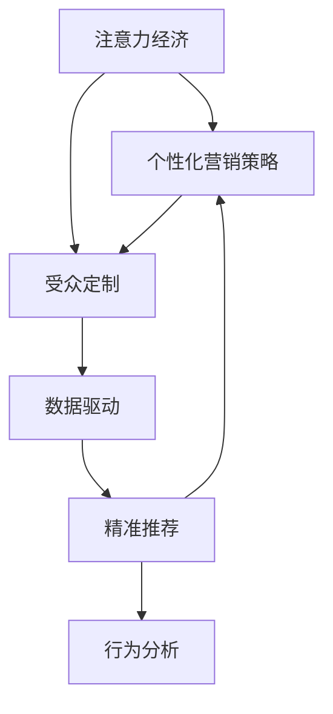

                 

# 注意力经济与个性化营销策略：为受众创建定制、有针对性的信息

> 关键词：注意力经济,个性化营销策略,受众定制,数据驱动,精准推荐,行为分析,用户画像,广告投放

## 1. 背景介绍

在当今信息爆炸的时代，用户的注意力成为最宝贵的资源。注意力经济，是指在信息过载的背景下，通过吸引和保持用户注意力来创造经济价值的一种新型经济形态。个性化营销策略则是利用数据和算法，精准地将定制化信息推送给特定用户，从而提升用户参与度和转化率。

### 1.1 问题由来
随着互联网和社交媒体的普及，用户每天被大量的信息所淹没，传统的单向广告和粗放营销方式已经不再有效。企业需要更加精准、个性化的营销策略来吸引和留住用户。与此同时，随着人工智能和大数据技术的不断发展，利用用户的在线行为数据进行个性化营销成为可能。通过深入分析用户的兴趣、偏好和行为，企业可以设计出更加有针对性的营销策略，提升用户体验和营销效果。

### 1.2 问题核心关键点
- **注意力经济**：在信息过载的时代，如何通过个性化策略吸引并保持用户注意力，创造经济价值。
- **个性化营销策略**：利用数据和算法，为用户提供定制化、有针对性的信息，提升用户参与度和转化率。
- **受众定制**：根据用户的行为数据，分析其兴趣和偏好，定制个性化的内容和服务。
- **数据驱动**：基于用户数据，进行行为分析和用户画像，指导个性化营销策略的设计。
- **精准推荐**：利用算法，为用户推荐最符合其兴趣和需求的内容。
- **行为分析**：分析用户的在线行为，包括浏览、点击、购买等，提取有价值的用户特征。

## 2. 核心概念与联系

### 2.1 核心概念概述

为更好地理解注意力经济与个性化营销策略，本节将介绍几个密切相关的核心概念：

- **注意力经济**：信息过载背景下的新型经济形态，通过吸引和保持用户注意力创造价值。
- **个性化营销策略**：利用数据和算法，为用户提供定制化、有针对性的信息，提升用户体验和转化率。
- **受众定制**：基于用户行为数据，分析其兴趣和偏好，设计定制化内容和服务。
- **数据驱动**：通过用户数据，进行行为分析和用户画像，指导个性化策略的设计。
- **精准推荐**：利用算法，为用户提供最符合其兴趣和需求的内容。
- **行为分析**：分析用户的在线行为，提取有价值的用户特征。

这些核心概念之间的逻辑关系可以通过以下Mermaid流程图来展示：



这个流程图展示了几大核心概念及其之间的关系：

1. 注意力经济通过个性化营销策略吸引和保持用户注意力，创造经济价值。
2. 个性化营销策略依赖数据驱动，通过用户画像和行为分析设计定制化内容。
3. 精准推荐利用算法，为用户提供最符合其兴趣和需求的内容。
4. 行为分析通过分析用户在线行为，提取有价值的用户特征，为数据驱动提供支持。

这些概念共同构成了注意力经济与个性化营销策略的框架，使得企业能够更好地利用用户数据，提升营销效果。

## 3. 核心算法原理 & 具体操作步骤
### 3.1 算法原理概述

注意力经济与个性化营销策略的核心在于如何精准地推送个性化信息，吸引并保持用户注意力。这一过程涉及数据驱动、用户画像、行为分析和精准推荐等技术，利用算法模型对用户行为进行分析和预测，从而设计出符合用户兴趣和需求的营销策略。

形式化地，假设用户集合为 $U$，其行为数据为 $\mathcal{D}=\{d_i\}_{i=1}^N$，其中 $d_i$ 包含用户 $i$ 的浏览记录、点击行为、购买记录等。定义行为分析模型为 $F:\mathcal{D} \rightarrow \mathcal{P}$，其中 $\mathcal{P}$ 为用户的兴趣和偏好画像。定义精准推荐模型为 $R:\mathcal{P} \times \mathcal{C} \rightarrow \mathcal{R}$，其中 $\mathcal{C}$ 为用户关注的商品或内容集合，$\mathcal{R}$ 为用户推荐的商品或内容集合。

个性化营销策略的目标是最大化推荐内容的点击率和转化率，即最大化 $\mathcal{L}(R,F,\mathcal{U},\mathcal{C})$，其中 $\mathcal{U}$ 为用户集。

### 3.2 算法步骤详解

基于注意力经济与个性化营销策略的算法过程主要包括以下几个关键步骤：

**Step 1: 数据收集与处理**
- 收集用户的行为数据，包括浏览记录、点击行为、购买记录等。
- 对数据进行预处理，如数据清洗、归一化、特征提取等，保证数据质量。

**Step 2: 用户画像构建**
- 通过行为分析模型 $F$，将用户的行为数据映射到其兴趣和偏好画像 $\mathcal{P}$。
- 利用机器学习和深度学习算法，如协同过滤、神经网络等，对用户画像进行建模和更新。

**Step 3: 精准推荐设计**
- 设计精准推荐模型 $R$，利用用户画像 $\mathcal{P}$ 和内容集合 $\mathcal{C}$ 进行推荐。
- 选择合适的推荐算法，如基于内容的推荐、协同过滤推荐、矩阵分解等。
- 利用A/B测试等方法评估推荐效果，并进行调优。

**Step 4: 个性化营销实施**
- 根据推荐结果，将个性化内容推送给目标用户。
- 监控点击率、转化率等指标，及时调整推荐策略。
- 通过用户反馈和行为数据，不断优化用户画像和推荐模型。

**Step 5: 效果评估与优化**
- 定期评估个性化营销策略的效果，如点击率、转化率、用户满意度等指标。
- 利用统计分析等方法，识别问题点并进行优化。
- 引入自动化和实时优化技术，提升推荐策略的精准度。

### 3.3 算法优缺点

基于注意力经济与个性化营销策略的算法过程具有以下优点：
1. **高效性**：通过数据驱动和精准推荐，最大化用户参与度和转化率。
2. **个性化**：针对不同用户设计定制化内容，提升用户体验。
3. **可量化**：通过行为分析和用户画像，可以量化评估个性化策略的效果。
4. **灵活性**：可以根据用户反馈和行为数据进行实时优化，灵活调整推荐策略。

同时，该方法也存在一定的局限性：
1. **数据隐私**：用户行为数据涉及隐私问题，需要严格遵守数据保护法规。
2. **数据偏差**：如果数据收集不全面或存在偏差，可能导致用户画像和推荐结果不准确。
3. **计算成本**：构建用户画像和进行精准推荐，需要大量的计算资源和时间。
4. **模型复杂性**：推荐模型的复杂性较高，需要专业知识进行设计和调优。
5. **对抗性攻击**：部分用户可能通过假行为数据进行欺诈，影响推荐效果。

尽管存在这些局限性，但就目前而言，基于注意力经济与个性化营销策略的方法仍是大规模数据驱动营销的重要手段。未来相关研究的重点在于如何进一步降低数据隐私风险，提高推荐模型的鲁棒性，优化计算效率，同时兼顾模型复杂性和实用性。

### 3.4 算法应用领域

基于注意力经济与个性化营销策略的算法过程在多个领域得到了广泛应用，例如：

- **电商零售**：通过用户行为数据分析，精准推荐商品，提升用户购买转化率。
- **内容媒体**：利用推荐算法为用户推荐个性化文章、视频等，提高用户停留时间和互动率。
- **在线广告**：针对用户兴趣和需求，设计定制化广告内容，提升广告投放效果和转化率。
- **金融服务**：通过用户行为分析，推荐个性化的理财产品和金融服务，提升用户满意度。
- **教育培训**：利用推荐算法为用户推荐个性化的学习资源和课程，提升学习效果和用户体验。
- **健康医疗**：根据用户健康数据，推荐个性化的健康咨询和医疗服务，提升健康管理水平。

除了上述这些经典应用外，个性化推荐技术也在不断拓展其应用场景，如智能客服、智能家居、社交网络等，为各行各业带来了新的业务价值。

## 4. 数学模型和公式 & 详细讲解  
### 4.1 数学模型构建

本节将使用数学语言对注意力经济与个性化营销策略的算法过程进行更加严格的刻画。

定义行为分析模型 $F$ 为：

$$
F: \mathcal{D} \rightarrow \mathcal{P}
$$

其中 $\mathcal{D}=\{d_i\}_{i=1}^N$ 为行为数据集合，$\mathcal{P}$ 为兴趣和偏好画像集合。行为分析模型通过用户的行为数据，提取其兴趣和偏好，从而构建用户画像。

定义精准推荐模型 $R$ 为：

$$
R: \mathcal{P} \times \mathcal{C} \rightarrow \mathcal{R}
$$

其中 $\mathcal{C}$ 为用户关注的商品或内容集合，$\mathcal{R}$ 为用户推荐的商品或内容集合。精准推荐模型利用用户画像和内容集合，生成推荐结果。

个性化营销策略的目标是最大化推荐内容的点击率和转化率，即最大化 $\mathcal{L}(R,F,\mathcal{U},\mathcal{C})$。

### 4.2 公式推导过程

以下我们以电商零售为例，推导推荐算法中的协同过滤公式。

假设用户 $i$ 对商品 $j$ 的评分 $r_{i,j}$，商品 $j$ 的评分向量为 $v_j = (v_{1,j},v_{2,j},\ldots,v_{N,j})$，用户 $i$ 的兴趣向量为 $u_i = (u_{1,i},u_{2,i},\ldots,u_{N,i})$。协同过滤公式为：

$$
R_{i,j} = \frac{u_i \cdot v_j}{\sqrt{\sum_k u_i^2_k \cdot \sum_k v_{k,j}^2}}
$$

其中 $u_i \cdot v_j$ 为向量点积，$\sqrt{\sum_k u_i^2_k \cdot \sum_k v_{k,j}^2}$ 为归一化因子，确保推荐值在 $[0,1]$ 之间。

通过协同过滤公式，可以将用户 $i$ 和商品 $j$ 之间的相似度转化为推荐值 $R_{i,j}$，从而为用户 $i$ 推荐最符合其兴趣的商品 $j$。

### 4.3 案例分析与讲解

考虑一个电商平台的用户行为数据，其中用户 $i$ 对商品 $j$ 的评分矩阵为：

$$
R = \begin{bmatrix}
0.5 & 0.8 & 0.2 & 0.1 \\
0.3 & 0.2 & 0.5 & 0.7 \\
0.2 & 0.7 & 0.4 & 0.1 \\
0.1 & 0.3 & 0.8 & 0.5
\end{bmatrix}
$$

假设用户 $i$ 的兴趣向量 $u_i = (0.4, 0.3, 0.2, 0.1)$，商品 $j$ 的评分向量 $v_j = (0.2, 0.5, 0.3, 0.0)$，则协同过滤公式下的推荐值为：

$$
R_{i,j} = \frac{0.4 \cdot 0.2 + 0.3 \cdot 0.5 + 0.2 \cdot 0.3 + 0.1 \cdot 0.0}{\sqrt{0.4^2 \cdot 0.2^2 + 0.3^2 \cdot 0.5^2 + 0.2^2 \cdot 0.3^2 + 0.1^2 \cdot 0.0^2 + 0.4^2 \cdot 0.3^2 + 0.4^2 \cdot 0.2^2 + 0.4^2 \cdot 0.3^2 + 0.4^2 \cdot 0.0^2 + 0.3^2 \cdot 0.5^2 + 0.3^2 \cdot 0.3^2 + 0.3^2 \cdot 0.2^2 + 0.3^2 \cdot 0.0^2 + 0.2^2 \cdot 0.7^2 + 0.2^2 \cdot 0.5^2 + 0.2^2 \cdot 0.3^2 + 0.2^2 \cdot 0.0^2 + 0.1^2 \cdot 0.3^2 + 0.1^2 \cdot 0.2^2 + 0.1^2 \cdot 0.3^2 + 0.1^2 \cdot 0.0^2 + 0.4^2 \cdot 0.4^2 + 0.3^2 \cdot 0.3^2 + 0.2^2 \cdot 0.2^2 + 0.1^2 \cdot 0.1^2}
$$

计算得到推荐值 $R_{i,j} = 0.476$，表明商品 $j$ 与用户 $i$ 的兴趣较为契合，适合推荐给用户 $i$。

## 5. 项目实践：代码实例和详细解释说明
### 5.1 开发环境搭建

在进行项目实践前，我们需要准备好开发环境。以下是使用Python进行项目开发的Python环境配置流程：

1. 安装Anaconda：从官网下载并安装Anaconda，用于创建独立的Python环境。

2. 创建并激活虚拟环境：
```bash
conda create -n pyproject-env python=3.8 
conda activate pyproject-env
```

3. 安装相关包：
```bash
conda install numpy pandas scikit-learn scikit-surpriseware
```

4. 安装TensorFlow：
```bash
pip install tensorflow
```

5. 安装其他依赖包：
```bash
pip install tensorflow-estimator tensorflow-io tensorflow-probability
```

完成上述步骤后，即可在`pyproject-env`环境中开始项目实践。

### 5.2 源代码详细实现

下面我们以电商推荐系统为例，给出使用TensorFlow进行协同过滤的代码实现。

首先，定义协同过滤模型的输入数据：

```python
import tensorflow as tf
import numpy as np

# 构建用户行为数据
user_item_ratings = np.array([[0.5, 0.8, 0.2, 0.1],
                             [0.3, 0.2, 0.5, 0.7],
                             [0.2, 0.7, 0.4, 0.1],
                             [0.1, 0.3, 0.8, 0.5]])

# 构建用户兴趣向量
user_interests = np.array([0.4, 0.3, 0.2, 0.1])

# 构建商品评分向量
item_ratings = np.array([0.2, 0.5, 0.3, 0.0])
```

然后，定义协同过滤模型的输出：

```python
# 定义协同过滤公式
def collaborative_filtering(user_interests, item_ratings):
    user_interests = tf.convert_to_tensor(user_interests)
    item_ratings = tf.convert_to_tensor(item_ratings)
    similarity = tf.reduce_sum(tf.multiply(user_interests, item_ratings)) / (tf.sqrt(tf.reduce_sum(tf.square(user_interests)) * tf.reduce_sum(tf.square(item_ratings)))
    return similarity

# 计算推荐值
recommendation_score = collaborative_filtering(user_interests, item_ratings)
```

最后，输出推荐值：

```python
print("推荐值：", recommendation_score)
```

运行代码，输出推荐值。

### 5.3 代码解读与分析

让我们再详细解读一下关键代码的实现细节：

**协同过滤模型**：
- 定义用户行为数据 `user_item_ratings` 和用户兴趣向量 `user_interests`，商品评分向量 `item_ratings`。
- 定义协同过滤公式 `collaborative_filtering`，计算推荐值。
- 使用TensorFlow计算推荐值，返回结果。

**代码执行**：
- 定义用户行为数据和商品评分向量，并计算推荐值。
- 输出推荐值。

可以看到，通过TensorFlow实现协同过滤推荐，代码简洁高效，能够快速得到推荐结果。同时，TensorFlow的强大计算能力也使得模型训练和优化变得更加容易。

当然，实际的推荐系统还需要考虑更多因素，如用户评分稀疏性、模型训练策略、推荐结果评估等。但核心的协同过滤范式基本与此类似。

## 6. 实际应用场景
### 6.1 智能客服系统

基于协同过滤的推荐技术，可以广泛应用于智能客服系统的构建。传统客服往往需要配备大量人力，高峰期响应缓慢，且一致性和专业性难以保证。而使用推荐技术，可以预测用户可能咨询的问题，提前准备答案，实现智能客服。

在技术实现上，可以收集企业内部的历史客服对话记录，构建用户行为数据集。利用协同过滤模型预测用户可能咨询的问题，并将问题与回答对应起来，训练模型进行推荐。推荐系统能够自动理解用户意图，匹配最合适的答案，提高用户满意度。

### 6.2 个性化广告推荐

广告推荐是互联网广告行业的重要应用场景。利用协同过滤技术，广告平台可以为用户推荐最符合其兴趣和需求的商品和内容，提高广告点击率和转化率。

具体而言，可以收集用户的历史浏览记录和点击行为，构建用户行为数据集。利用协同过滤模型预测用户对不同商品和内容的兴趣程度，为广告主设计个性化广告，提高广告投放效果。推荐系统能够自动为用户匹配最相关的内容，提升用户体验和广告效果。

### 6.3 个性化商品推荐

电商推荐系统是电商行业的重要应用。利用协同过滤技术，电商平台可以为用户推荐最符合其兴趣和需求的商品，提高用户购买转化率。

具体而言，可以收集用户的历史购买记录和浏览行为，构建用户行为数据集。利用协同过滤模型预测用户对不同商品的兴趣程度，为每个用户推荐最相关的商品。推荐系统能够自动为用户匹配最符合其兴趣的商品，提升购物体验和购买转化率。

### 6.4 未来应用展望

随着协同过滤技术的不断发展，基于注意力经济与个性化营销策略的推荐系统将在更多领域得到应用，为各行各业带来新的业务价值。

在智慧医疗领域，推荐系统可以推荐个性化的健康咨询和医疗服务，提升健康管理水平。在智慧城市治理中，推荐系统可以推荐个性化的城市事件和公共服务，提高城市管理效率。在教育培训领域，推荐系统可以推荐个性化的学习资源和课程，提升学习效果和用户体验。

## 7. 工具和资源推荐
### 7.1 学习资源推荐

为了帮助开发者系统掌握注意力经济与个性化营销策略的理论基础和实践技巧，这里推荐一些优质的学习资源：

1. 《推荐系统实战》：一本详细介绍推荐算法和实践的书籍，涵盖协同过滤、基于内容的推荐等主流算法。
2. 《深度学习与推荐系统》课程：由斯坦福大学开设的深度学习课程，详细讲解推荐系统的设计原理和实现方法。
3. 《机器学习实战》：一本面向实战的机器学习教材，包含推荐系统的多个案例和代码实现。
4. 《推荐系统经典算法》：一本介绍推荐系统经典算法的书籍，涵盖协同过滤、矩阵分解、混合推荐等。
5. Kaggle推荐系统竞赛：通过参加Kaggle推荐系统竞赛，实践和检验推荐算法的准确性和效果。

通过对这些资源的学习实践，相信你一定能够快速掌握注意力经济与个性化营销策略的精髓，并用于解决实际的推荐问题。

### 7.2 开发工具推荐

高效的开发离不开优秀的工具支持。以下是几款用于推荐系统开发的常用工具：

1. TensorFlow：基于Python的深度学习框架，具有强大的计算能力和灵活的编程接口。
2. Scikit-learn：Python机器学习库，包含多种经典机器学习算法和模型评估工具。
3. Scikit-surpriseware：Python推荐系统库，提供多种协同过滤算法和模型评估指标。
4. TensorFlow Estimator：TensorFlow的高层API，简化模型训练和评估流程。
5. TensorFlow Probability：TensorFlow的概率编程库，支持高级概率建模和统计分析。
6. Apache Spark：分布式计算框架，支持大规模数据处理和推荐系统的高效实现。

合理利用这些工具，可以显著提升推荐系统的开发效率，加快创新迭代的步伐。

### 7.3 相关论文推荐

注意力经济与个性化营销策略的发展源于学界的持续研究。以下是几篇奠基性的相关论文，推荐阅读：

1. Matrix Factorization Techniques for Recommender Systems：介绍矩阵分解算法，用于协同过滤推荐。
2. Collaborative Filtering for Implicit Feedback Datasets：研究基于隐式反馈数据的协同过滤算法，提升推荐效果。
3. Deep Matrix Factorization：提出深度矩阵分解算法，解决协同过滤中的冷启动问题。
4. Contextual Bandits for Recommendation Systems：研究上下文推荐算法，提升个性化推荐效果。
5. Semi-supervised Matrix Factorization：提出半监督矩阵分解算法，提高推荐系统的泛化能力。

这些论文代表了大规模数据驱动推荐技术的发展脉络。通过学习这些前沿成果，可以帮助研究者把握学科前进方向，激发更多的创新灵感。

## 8. 总结：未来发展趋势与挑战
### 8.1 总结

本文对基于注意力经济与个性化营销策略的推荐系统进行了全面系统的介绍。首先阐述了推荐系统在信息过载背景下的重要性，明确了注意力经济与个性化营销策略在吸引并保持用户注意力，创造经济价值方面的独特价值。其次，从原理到实践，详细讲解了推荐系统的数学模型和算法步骤，给出了推荐任务开发的完整代码实例。同时，本文还广泛探讨了推荐系统在智能客服、个性化广告推荐、电商推荐等多个行业领域的应用前景，展示了推荐技术的巨大潜力。此外，本文精选了推荐技术的各类学习资源，力求为读者提供全方位的技术指引。

通过本文的系统梳理，可以看到，基于注意力经济与个性化营销策略的推荐系统正在成为互联网广告和电商推荐的重要手段，极大地提升了用户体验和营销效果。未来，伴随推荐技术的不断演进，基于注意力经济与个性化营销策略的方法必将在更多领域得到应用，为各行各业带来新的业务价值。

### 8.2 未来发展趋势

展望未来，基于注意力经济与个性化营销策略的推荐系统将呈现以下几个发展趋势：

1. **深度学习与强化学习的结合**：深度学习可以提供强大的特征提取能力，而强化学习可以优化推荐策略，提升推荐效果。未来的推荐系统将结合深度学习和强化学习，进一步提升推荐准确性和鲁棒性。
2. **多模态数据融合**：推荐系统不仅限于文本数据，还将融合图像、视频、音频等多模态数据，提升推荐模型的泛化能力和表现。
3. **实时动态优化**：利用实时数据流和在线学习技术，推荐系统能够动态调整推荐策略，适应用户行为的变化。
4. **跨领域知识迁移**：推荐系统将通过知识图谱、符号知识等跨领域知识，提升推荐模型的表现和解释性。
5. **联邦学习**：利用分布式数据和模型，推荐系统能够在保护用户隐私的前提下，进行分布式推荐优化。

以上趋势凸显了基于注意力经济与个性化营销策略的推荐技术的广阔前景。这些方向的探索发展，必将进一步提升推荐系统的性能和应用范围，为各行各业带来新的业务价值。

### 8.3 面临的挑战

尽管基于注意力经济与个性化营销策略的推荐系统已经取得了瞩目成就，但在迈向更加智能化、普适化应用的过程中，它仍面临诸多挑战：

1. **数据隐私和安全**：推荐系统依赖大量用户行为数据，涉及隐私问题，需要严格遵守数据保护法规。
2. **数据质量和稀疏性**：数据质量不高或存在稀疏性，可能导致推荐模型性能下降。
3. **计算资源和存储**：推荐系统需要大量的计算资源和存储空间，成本较高。
4. **模型复杂性**：推荐模型复杂性高，需要专业知识进行设计和调优。
5. **对抗性攻击**：部分用户可能通过虚假行为数据进行欺诈，影响推荐效果。
6. **冷启动问题**：新用户或新商品缺乏足够的历史数据，难以进行个性化推荐。

尽管存在这些挑战，但随着技术的不断发展，推荐系统正逐步克服这些障碍，走向更加智能和普适化。

### 8.4 研究展望

面对推荐系统所面临的种种挑战，未来的研究需要在以下几个方面寻求新的突破：

1. **多目标优化**：结合用户满意度和平台收益，优化推荐策略，提升整体推荐效果。
2. **模型解释性**：提高推荐模型的可解释性，增强用户对推荐结果的理解和信任。
3. **自适应学习**：设计自适应推荐算法，适应用户行为变化，提升推荐效果。
4. **跨平台协同**：构建跨平台协同推荐系统，提升用户在不同平台上的体验一致性。
5. **实时推荐**：实现实时推荐系统，提升推荐的时效性和用户满意度。

这些研究方向的探索，必将引领推荐技术迈向更高的台阶，为构建更加智能和普适化的推荐系统铺平道路。面向未来，推荐技术还需要与其他人工智能技术进行更深入的融合，如知识表示、因果推理、强化学习等，多路径协同发力，共同推动推荐系统的进步。只有勇于创新、敢于突破，才能不断拓展推荐系统的边界，让推荐技术更好地服务于人类社会。

## 9. 附录：常见问题与解答

**Q1：推荐系统是如何进行个性化推荐的？**

A: 推荐系统通过分析用户的历史行为数据，构建用户画像，利用协同过滤、矩阵分解等算法，预测用户对不同商品或内容的兴趣程度，从而进行个性化推荐。用户画像包含用户的历史浏览记录、点击行为、购买记录等，推荐系统通过用户画像，预测用户对不同商品或内容的兴趣程度，为用户推荐最相关的商品或内容。

**Q2：推荐系统如何进行冷启动推荐？**

A: 冷启动推荐是推荐系统面临的挑战之一。在用户缺乏足够历史行为数据的情况下，推荐系统可以采用基于内容的推荐、协同过滤等算法，通过商品或内容的属性信息进行推荐。此外，还可以利用深度学习模型，通过用户行为数据和商品属性数据，训练出兴趣预测模型，进行冷启动推荐。同时，通过社交网络、商品关联等外部数据，也可以进行冷启动推荐。

**Q3：推荐系统如何避免过拟合？**

A: 推荐系统需要通过数据增强、正则化、对抗训练等方法，避免过拟合。数据增强可以通过对训练集进行扩充，如回译、近义替换等，丰富训练集多样性。正则化可以通过L2正则、Dropout等方法，防止模型过度拟合训练集。对抗训练可以通过引入对抗样本，提高模型的鲁棒性和泛化能力。此外，通过模型裁剪、稀疏化存储等方法，也可以降低模型复杂度，提升推荐效果。

**Q4：推荐系统如何进行实时动态优化？**

A: 推荐系统可以通过在线学习、增量学习等方法，进行实时动态优化。在线学习通过实时数据流，不断更新模型参数，适应用户行为变化。增量学习通过增量更新模型，快速适应新数据和新用户，提升推荐效果。同时，通过分布式计算和联邦学习技术，可以实现大规模数据的实时动态优化。

**Q5：推荐系统如何进行多目标优化？**

A: 推荐系统可以通过多目标优化方法，同时考虑用户满意度和平台收益，优化推荐策略。多目标优化方法包括Pareto优化、多目标进化算法等，可以根据不同目标之间的权重关系，进行优化。同时，通过结合用户反馈和行为数据，动态调整推荐策略，提升整体推荐效果。

这些问题的解答，展示了推荐系统在理论和技术上的深度和广度，相信通过这些知识，开发者可以更好地理解和实现推荐系统，提升用户的推荐体验。

