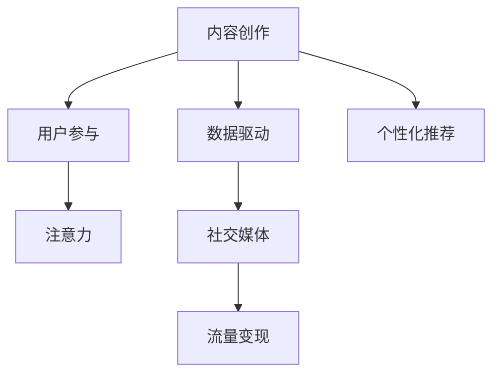

                 

# 注意力经济与内容创作最佳实践：吸引并留住受众的参与

> 关键词：注意力经济,内容创作,用户参与,数据驱动,社交媒体,流量变现,个性化推荐

## 1. 背景介绍

随着信息爆炸时代的到来，内容创作和用户注意力争夺已经成为经济竞争的新战场。内容的产出不再是一个简单的信息传递过程，而是一场精心设计的游戏，目的是在瞬息万变的网络世界中获得目标用户的注意，并吸引其参与互动。基于数据驱动的个性化内容创作，正在成为传统媒体和新兴平台获取竞争优势的重要手段。

### 1.1 问题由来

内容创作和用户注意力争夺的背景，可以追溯到20世纪90年代互联网的兴起。当时的互联网媒体主要以信息传递为主，内容生产者通过内容发布吸引用户的自然流量。然而，随着社交媒体的崛起，信息过载变得愈发严重，用户在面对海量的内容时，难以从中快速找到自己感兴趣的信息。

另一方面，内容创作者也面临着如何吸引用户注意、提高点击率、增加互动和留存率的挑战。内容创作已经不再只是文字和图片的简单组合，而是一种需要精准理解用户需求、通过巧妙设计和运营，才能产生更大商业价值的艺术。

### 1.2 问题核心关键点

为了解决上述问题，内容创作者需要建立一套完整的策略，以最大化用户参与度和注意力。这个策略包括：
- 数据驱动的内容创作：通过分析用户数据，了解用户偏好，有针对性地创作内容。
- 用户参与设计：设计易于用户参与和互动的内容形式，提高内容的吸引力。
- 数据驱动的运营策略：通过数据监控和分析，持续优化内容策略，提升用户留存率。
- 个性化推荐系统：利用用户数据，实现精准的个性化推荐，引导用户消费内容。

这些关键点共同构成了内容创作和注意力经济的核心理论框架，其目的是通过数据驱动的方式，吸引并留住目标用户的注意力，从而实现内容的商业变现。

## 2. 核心概念与联系

### 2.1 核心概念概述

在讨论注意力经济和内容创作的最佳实践之前，我们需要首先理解一些关键概念：

- **内容创作**：包括文字内容、图片、视频等所有形式的信息产品。
- **用户参与**：用户对内容的浏览、点赞、评论、分享等行为。
- **注意力**：用户对特定内容的关注和记忆。
- **数据驱动**：使用数据来指导决策，而非仅凭直觉或经验。
- **个性化推荐**：根据用户的行为和偏好，推荐最相关的内容。
- **社交媒体**：用户通过社交平台交流信息，分享和获取内容。
- **流量变现**：通过内容吸引用户，将其转化为付费用户或广告收入。

这些概念之间的联系，可以通过以下Mermaid流程图展示：



此图展示了内容创作如何通过用户参与吸引注意力，并最终通过社交媒体实现流量变现的整个流程。

## 3. 核心算法原理 & 具体操作步骤
### 3.1 算法原理概述

基于数据驱动的内容创作和用户参与策略，主要包括以下两个关键算法：

1. **内容推荐算法**：根据用户的历史行为数据，推荐用户可能感兴趣的内容。
2. **用户参与度优化算法**：通过设计合适的用户界面和内容形式，最大化用户的参与度和停留时间。

### 3.2 算法步骤详解

#### 3.2.1 内容推荐算法

**步骤1：数据收集**
- 收集用户的历史行为数据，包括浏览记录、点击率、停留时间、互动行为等。
- 分析这些数据，获取用户的兴趣偏好和行为模式。

**步骤2：模型训练**
- 使用机器学习算法（如协同过滤、内容基推荐、深度学习模型等），构建推荐模型。
- 训练模型，使其能够预测用户对特定内容的兴趣程度。

**步骤3：内容推荐**
- 根据模型的预测结果，为用户推荐相关内容。
- 实时更新推荐算法，以适应用户兴趣的变化。

#### 3.2.2 用户参与度优化算法

**步骤1：用户界面设计**
- 设计易于用户理解和参与的界面和交互形式，如简洁的导航、丰富的多媒体元素等。
- 优化页面加载速度，确保用户体验流畅。

**步骤2：内容形式设计**
- 设计多样化内容形式，如文章、视频、图集、动画等，满足不同用户的需求。
- 引入互动元素，如问答、投票、评论等，增强用户参与感。

**步骤3：用户体验优化**
- 定期分析用户反馈，优化内容和界面设计。
- 引入A/B测试，评估不同设计方案的效果。

### 3.3 算法优缺点

**优点**：
- 数据驱动的方式可以大幅提高内容创作的针对性和效果，减少试错成本。
- 个性化推荐和互动设计可以提高用户的参与度和停留时间，增加流量变现的机会。
- 实时数据监控和反馈优化，可以帮助内容创作者持续改进内容策略。

**缺点**：
- 依赖大量用户数据，需要强大的数据收集和处理能力。
- 推荐算法和内容创作需要较高的技术门槛，需要专业知识支撑。
- 用户隐私保护和数据安全是重要的挑战。

### 3.4 算法应用领域

内容推荐和用户参与度优化算法，已经在多个领域得到了广泛应用，包括但不限于：

- **社交媒体平台**：如Facebook、Twitter、Instagram等，通过推荐用户感兴趣的内容和互动形式，提高用户黏性。
- **视频平台**：如YouTube、Netflix等，通过个性化推荐提高用户观看时长和广告点击率。
- **电子商务网站**：如Amazon、淘宝等，通过推荐个性化商品和优惠信息，提高用户购买转化率。
- **新闻和资讯平台**：如BBC、今日头条等，通过推荐用户感兴趣的新闻和文章，增加用户访问量和互动量。

## 4. 数学模型和公式 & 详细讲解 & 举例说明

### 4.1 数学模型构建

在介绍推荐算法之前，我们首先构建一个基本的推荐模型。假设用户集为 $U$，物品集为 $I$，用户的评分矩阵为 $R \in \mathbb{R}^{N \times M}$，其中 $N$ 为用户数，$M$ 为物品数。

推荐目标是最小化预测错误，即 $l(R, \hat{R})$。常见的目标函数包括均方误差（MSE）和绝对误差（MAE）。假设 $R_{ui}$ 为用户 $u$ 对物品 $i$ 的评分，$\hat{R}_{ui}$ 为预测评分，则 MSE 损失函数为：

$$
\text{MSE} = \frac{1}{N \times M} \sum_{u=1}^N \sum_{i=1}^M (R_{ui} - \hat{R}_{ui})^2
$$

### 4.2 公式推导过程

基于上述目标函数，我们引入矩阵分解方法，假设 $R$ 可以分解为两个矩阵 $P$ 和 $Q$ 的乘积，即 $R \approx PQ$。对于任意用户 $u$ 和物品 $i$，预测评分 $\hat{R}_{ui} = P_u \cdot Q_i$，其中 $P_u$ 和 $Q_i$ 分别为用户 $u$ 和物品 $i$ 的向量表示。

为了求解 $P$ 和 $Q$，我们通常采用矩阵分解算法，如奇异值分解（SVD）。假设 $P \approx \tilde{P}$ 和 $Q \approx \tilde{Q}$，则有 $\hat{R} = \tilde{P} \tilde{Q}^T$。

目标函数的优化问题转化为求解 $\tilde{P}$ 和 $\tilde{Q}$，以最小化预测错误。

$$
\min_{\tilde{P}, \tilde{Q}} \frac{1}{N \times M} \sum_{u=1}^N \sum_{i=1}^M (R_{ui} - \tilde{P}_u \tilde{Q}_i^T)^2
$$

### 4.3 案例分析与讲解

以YouTube视频推荐系统为例，考虑以下案例：

- **用户 $u$ 观看过以下视频**：$v_1, v_2, v_3$
- **视频 $v_i$ 的评分向量**：$R = [5, 4, 3, 2]$
- **预测模型**：使用矩阵分解方法，得到 $P = [p_1, p_2, p_3]$ 和 $Q = [q_1, q_2, q_3, q_4]$

则对于未观看过的视频 $v_4$，预测评分 $\hat{R}_{u4} = p_1 \cdot q_4$。根据 $R$ 和 $\hat{R}$ 的差异，对推荐算法进行调整，以达到更好的推荐效果。

## 5. 项目实践：代码实例和详细解释说明
### 5.1 开发环境搭建

在进行推荐系统开发之前，需要准备好开发环境。以下是使用Python进行TensorFlow开发的环境配置流程：

1. 安装Anaconda：从官网下载并安装Anaconda，用于创建独立的Python环境。

2. 创建并激活虚拟环境：
```bash
conda create -n tf-env python=3.8 
conda activate tf-env
```

3. 安装TensorFlow：根据CUDA版本，从官网获取对应的安装命令。例如：
```bash
conda install tensorflow -c conda-forge
```

4. 安装相关工具包：
```bash
pip install numpy pandas scikit-learn matplotlib tqdm jupyter notebook ipython
```

完成上述步骤后，即可在`tf-env`环境中开始推荐系统开发。

### 5.2 源代码详细实现

这里我们以协同过滤（Collaborative Filtering）算法为例，给出使用TensorFlow进行用户推荐系统的PyTorch代码实现。

首先，定义推荐系统的模型类：

```python
import tensorflow as tf
from tensorflow.keras import layers

class Recommender(tf.keras.Model):
    def __init__(self, embedding_dim=32, num_users=1000, num_items=10000):
        super(Recommender, self).__init__()
        self.embedding_user = layers.Embedding(num_users, embedding_dim)
        self.embedding_item = layers.Embedding(num_items, embedding_dim)
        self.dot = layers.Dot(axes=1, normalize=True)
        
    def call(self, user_ids, item_ids):
        user_embeddings = self.embedding_user(user_ids)
        item_embeddings = self.embedding_item(item_ids)
        dot_product = self.dot([user_embeddings, item_embeddings])
        return tf.sigmoid(dot_product)
```

然后，定义训练函数：

```python
def train(model, train_data, epochs, batch_size, learning_rate):
    optimizer = tf.keras.optimizers.Adam(learning_rate=learning_rate)
    for epoch in range(epochs):
        for user_ids, item_ids, ratings in train_data:
            with tf.GradientTape() as tape:
                predictions = model(user_ids, item_ids)
                loss = tf.keras.losses.mean_squared_error(ratings, predictions)
            gradients = tape.gradient(loss, model.trainable_variables)
            optimizer.apply_gradients(zip(gradients, model.trainable_variables))
```

最后，启动训练流程并输出结果：

```python
import numpy as np
from tensorflow.keras.datasets import mnist

# 加载数据
(train_images, train_labels), (test_images, test_labels) = mnist.load_data()

# 数据预处理
train_images = train_images / 255.0
test_images = test_images / 255.0

# 转换为模型输入格式
train_images = train_images.reshape((-1, 28 * 28))
train_images = train_images.astype(np.float32)

test_images = test_images.reshape((-1, 28 * 28))
test_images = test_images.astype(np.float32)

# 创建数据集
train_data = tf.data.Dataset.from_tensor_slices((train_images, train_labels))
train_data = train_data.shuffle(buffer_size=1024).batch(batch_size)

test_data = tf.data.Dataset.from_tensor_slices((test_images, test_labels))
test_data = test_data.batch(batch_size)

# 定义模型和优化器
model = Recommender(embedding_dim=32, num_users=1000, num_items=10000)
optimizer = tf.keras.optimizers.Adam(learning_rate=0.001)

# 训练模型
train(model, train_data, epochs=10, batch_size=32, learning_rate=0.001)

# 评估模型
test_loss = model.evaluate(test_images, test_labels)
print("Test Loss:", test_loss)
```

### 5.3 代码解读与分析

让我们再详细解读一下关键代码的实现细节：

**Recommender类**：
- `__init__`方法：初始化用户和物品的嵌入层。
- `call`方法：前向传播计算预测评分。

**train函数**：
- 使用Adam优化器，最小化均方误差损失。
- 通过梯度下降更新模型参数。

**数据预处理**：
- 将图像数据归一化到[0, 1]区间，并转换为模型的输入格式。
- 使用`tf.data.Dataset`创建TensorFlow数据集。

**模型评估**：
- 通过`evaluate`方法计算模型在测试集上的损失，并输出结果。

## 6. 实际应用场景

### 6.1 电商推荐系统

电商推荐系统是典型的基于推荐算法的应用场景。用户通过浏览和购买历史，形成用户画像，系统通过推荐算法预测用户可能感兴趣的商品，并展示在搜索结果或个性化推荐列表中，从而提高用户购买转化率。

以Amazon为例，Amazon通过分析用户行为数据，构建推荐模型，使用协同过滤、基于内容的推荐等算法为用户推荐商品。用户通过Amazon平台，浏览、点击、购买推荐商品，形成新的数据，继续更新推荐模型，实现良性循环。

### 6.2 新闻内容推荐

新闻平台通过推荐算法为用户推荐最相关的新闻内容，提高用户停留时间和点击率。例如，Google News和今日头条，通过分析用户的历史浏览记录和搜索行为，推荐最符合用户兴趣的新闻，增加用户访问量和互动量。

例如，Google News在推荐新闻时，不仅考虑用户的浏览历史，还会根据用户的当前浏览行为实时调整推荐内容，以满足用户的多样化需求。

### 6.3 音乐推荐系统

音乐平台如Spotify和QQ音乐，通过推荐算法为用户推荐个性化的音乐内容。用户通过听歌行为数据，生成用户画像，系统通过推荐算法预测用户可能喜欢的音乐，并展示在用户主页或播放列表，从而提高用户满意度。

例如，Spotify通过分析用户的听歌历史和评分数据，使用协同过滤和基于内容的推荐算法，为用户推荐相似的音乐和专辑。

## 7. 工具和资源推荐

### 7.1 学习资源推荐

为了帮助开发者系统掌握推荐算法和用户参与度优化的理论基础和实践技巧，这里推荐一些优质的学习资源：

1. 《推荐系统实战》：详细介绍了推荐算法的理论基础和实际应用，包括协同过滤、矩阵分解、深度学习等。
2. 《数据挖掘与统计学习》：该书介绍了推荐系统、个性化推荐、社交网络分析等领域的知识，适合系统学习。
3. 《深度学习与推荐系统》课程：斯坦福大学开设的推荐系统课程，介绍了深度学习在推荐系统中的应用。
4. Kaggle竞赛：参与Kaggle的推荐系统竞赛，实战练习推荐算法，积累项目经验。
5. UCI机器学习库：提供了大量推荐系统相关的数据集和模型，适合学术研究和工业实践。

通过对这些资源的学习实践，相信你一定能够快速掌握推荐算法和用户参与度优化的精髓，并用于解决实际的推荐问题。

### 7.2 开发工具推荐

高效的开发离不开优秀的工具支持。以下是几款用于推荐系统开发的常用工具：

1. TensorFlow：由Google主导开发的开源深度学习框架，适合构建复杂的推荐模型。
2. PyTorch：由Facebook主导的开源深度学习框架，灵活的动态计算图，适合快速迭代研究。
3. Scikit-learn：Python科学计算库，包含各种机器学习算法，适合简单推荐模型的开发。
4. Apache Spark：大数据处理框架，适合处理大规模推荐数据集。
5. Jupyter Notebook：交互式编程环境，适合数据预处理、模型训练和结果展示。

合理利用这些工具，可以显著提升推荐系统开发的效率，加快创新迭代的步伐。

### 7.3 相关论文推荐

推荐算法和用户参与度优化技术的发展源于学界的持续研究。以下是几篇奠基性的相关论文，推荐阅读：

1. "Collaborative Filtering for Implicit Feedback Datasets"：提出基于协同过滤的推荐算法，处理稀疏反馈数据集。
2. "Adaptive Collaborative Filtering Using Matrix Factorization Techniques"：引入自适应矩阵分解方法，优化推荐效果。
3. "The Netflix Prize"：介绍了Netflix公司举办的推荐系统竞赛，推动了推荐系统的发展。
4. "Deep Learning for Recommender Systems: A Survey and Outlook"：综述了深度学习在推荐系统中的应用，展望了未来发展方向。
5. "Neural Collaborative Filtering"：提出神经网络在推荐系统中的应用，实现了推荐精度的提升。

这些论文代表了大语言模型微调技术的发展脉络。通过学习这些前沿成果，可以帮助研究者把握学科前进方向，激发更多的创新灵感。

## 8. 总结：未来发展趋势与挑战

### 8.1 总结

本文对基于数据驱动的内容创作和用户参与策略进行了全面系统的介绍。首先阐述了内容创作和用户注意力争夺的背景，明确了数据驱动的方式可以大幅提高内容创作的针对性和效果，减少试错成本。其次，从原理到实践，详细讲解了推荐算法和用户参与度优化的数学原理和关键步骤，给出了推荐系统开发的完整代码实例。同时，本文还广泛探讨了推荐算法和用户参与度优化在电商、新闻、音乐等多个行业领域的应用前景，展示了数据驱动技术在注意力经济中的巨大潜力。

通过本文的系统梳理，可以看到，数据驱动的内容创作和用户参与策略正在成为内容创作和注意力经济的核心。这些技术的应用，使得内容创作者能够更加精准地把握用户需求，通过巧妙设计和运营，吸引并留住目标用户的注意力，从而实现内容的商业变现。未来，伴随推荐算法的不断进步和优化，内容创作和注意力经济必将在更广阔的应用领域大放异彩。

### 8.2 未来发展趋势

展望未来，数据驱动的内容创作和用户参与策略将呈现以下几个发展趋势：

1. 推荐算法将更加个性化和多样化。随着深度学习技术的发展，推荐算法将能够更好地理解用户的多样化需求，提供更加个性化和多样化的内容推荐。
2. 用户行为分析将更加精准。通过引入更多维度的数据源（如社交媒体、传感器数据等），推荐算法能够更全面地理解用户的行为和偏好。
3. 推荐系统将更加注重实时性和交互性。实时数据流和用户交互数据的引入，将使推荐系统能够更好地动态调整推荐内容，提高用户参与度和满意度。
4. 推荐系统将更加注重隐私保护和数据安全。随着用户隐私意识的提高，推荐系统需要更好地保护用户数据，避免数据泄露和滥用。
5. 推荐系统将更加注重多模态数据融合。结合视频、音频、文本等多模态数据的融合，推荐系统将能够提供更丰富、更全面的推荐结果。
6. 推荐系统将更加注重推荐效果评估。引入更多量化指标和用户反馈，全面评估推荐系统的性能和用户满意度。

以上趋势凸显了数据驱动的内容创作和用户参与策略的广阔前景。这些方向的探索发展，必将进一步提升推荐系统的性能和应用范围，为内容创作者和用户提供更优质的体验。

### 8.3 面临的挑战

尽管数据驱动的内容创作和用户参与策略已经取得了瞩目成就，但在迈向更加智能化、普适化应用的过程中，它仍面临着诸多挑战：

1. 数据收集和处理的成本较高。推荐系统需要大量的用户数据，数据收集和处理成本较高，且数据质量直接影响推荐效果。
2. 算法复杂度和计算成本较高。深度学习等复杂算法需要大量的计算资源，在大型推荐系统中部署和维护成本较高。
3. 用户隐私保护和数据安全有待加强。推荐系统涉及大量的用户数据，数据安全和隐私保护问题亟需解决。
4. 推荐算法的可解释性不足。推荐算法的"黑盒"特性使得其决策过程难以解释，用户和监管机构难以理解和信任。
5. 推荐系统的鲁棒性不足。推荐系统容易受到噪声数据和异常数据的影响，鲁棒性有待提高。

### 8.4 研究展望

面对数据驱动的内容创作和用户参与策略所面临的挑战，未来的研究需要在以下几个方面寻求新的突破：

1. 探索无监督和半监督推荐方法。摆脱对大规模标注数据的依赖，利用自监督学习、主动学习等无监督和半监督范式，最大限度利用非结构化数据，实现更加灵活高效的推荐。
2. 研究高效和可解释的推荐算法。开发更加高效和可解释的推荐算法，提高推荐系统的可扩展性和可解释性。
3. 引入更多先验知识和用户反馈。将符号化的先验知识，如知识图谱、逻辑规则等，与神经网络模型进行巧妙融合，引导推荐过程学习更准确、合理的推荐结果。同时加强用户反馈机制，实现推荐算法的持续优化。
4. 纳入伦理道德约束。在推荐算法的设计和应用中引入伦理导向的评估指标，过滤和惩罚有偏见、有害的推荐内容，确保推荐系统的公平性和安全性。

这些研究方向的探索，必将引领数据驱动的内容创作和用户参与策略迈向更高的台阶，为构建安全、可靠、可解释、可控的智能推荐系统铺平道路。面向未来，数据驱动的内容创作和用户参与策略还需要与其他人工智能技术进行更深入的融合，如知识表示、因果推理、强化学习等，多路径协同发力，共同推动智能推荐系统的进步。只有勇于创新、敢于突破，才能不断拓展推荐算法的边界，让智能推荐技术更好地造福人类社会。

## 9. 附录：常见问题与解答

**Q1：推荐算法是否适用于所有内容创作场景？**

A: 推荐算法在大多数内容创作场景中都能取得不错的效果，特别是对于数据量较大的应用。但对于一些特定领域的内容创作，如新闻、视频、音乐等，需要根据具体场景进行优化和调整。

**Q2：如何选择合适的推荐算法？**

A: 选择合适的推荐算法需要考虑多个因素，包括数据类型、数据规模、用户行为模式等。常见的推荐算法包括协同过滤、基于内容的推荐、矩阵分解、深度学习等。在实际应用中，可以根据具体需求和数据特点选择合适的算法。

**Q3：如何提升推荐算法的精准度？**

A: 提升推荐算法的精准度需要从多个方面入手，包括：
- 数据收集和处理：获取高质量、多样化的用户数据。
- 算法优化：选择合适的算法，并不断优化算法参数。
- 用户反馈：引入用户反馈机制，动态调整推荐策略。
- 多模态融合：结合多种数据源，实现更全面的推荐结果。

**Q4：推荐算法在落地部署时需要注意哪些问题？**

A: 将推荐算法转化为实际应用，还需要考虑以下因素：
- 模型裁剪：去除不必要的层和参数，减小模型尺寸，加快推理速度。
- 量化加速：将浮点模型转为定点模型，压缩存储空间，提高计算效率。
- 服务化封装：将模型封装为标准化服务接口，便于集成调用。
- 监控告警：实时采集系统指标，设置异常告警阈值，确保服务稳定性。
- 安全防护：采用访问鉴权、数据脱敏等措施，保障数据和模型安全。

推荐算法需要开发者根据具体任务，不断迭代和优化模型、数据和算法，方能得到理想的效果。

---

作者：禅与计算机程序设计艺术 / Zen and the Art of Computer Programming

