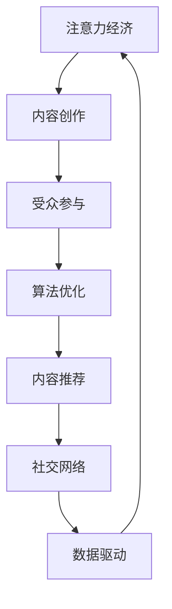

                 

# 注意力经济与内容创作策略：吸引并留住受众的参与

> 关键词：注意力经济,内容创作,受众参与,算法优化,内容推荐,社交网络,数据驱动,用户体验

## 1. 背景介绍

### 1.1 问题由来
随着互联网的普及和移动互联网的迅猛发展，信息爆炸已成为不可避免的趋势。面对海量的信息，人们的注意力资源变得稀缺，如何有效吸引和保持受众的注意力成为了互联网公司和内容创作者面临的首要问题。而“注意力经济”正是在这样的背景下应运而生，强调通过技术手段优化内容，吸引并留住受众，进而实现商业价值。

### 1.2 问题核心关键点
注意力经济的核心在于理解受众注意力流动的规律，并应用算法优化提升内容的吸引力。在注意力经济中，内容创作和用户体验息息相关，通过内容创作策略的优化，可以更好地吸引和保持受众的参与度，最终实现内容推荐、广告投放等商业目标。

### 1.3 问题研究意义
研究注意力经济与内容创作策略，有助于互联网公司和内容创作者更有效地利用注意力资源，提升用户参与度，创造更多的商业价值。通过科学的内容创作与推荐算法，可以提供更为个性化的用户体验，增强用户粘性，同时避免信息过载，提升用户满意度。

## 2. 核心概念与联系

### 2.1 核心概念概述

在探讨注意力经济与内容创作策略时，需明确以下几个核心概念：

- **注意力经济 (Attention Economy)**：指在信息过载的时代，如何通过技术手段吸引并保持受众的注意力，从而创造商业价值。
- **内容创作 (Content Creation)**：指创作具有吸引力的内容，包括文章、视频、音频等多种形式，以吸引和留住受众。
- **受众参与 (User Engagement)**：衡量内容对受众的吸引力与互动度，是注意力经济的核心指标。
- **算法优化 (Algorithm Optimization)**：通过数据分析和机器学习技术，优化内容推荐算法，提升用户参与度。
- **内容推荐 (Content Recommendation)**：基于用户行为和兴趣数据，推荐个性化的内容，提升用户体验。
- **社交网络 (Social Network)**：用户互动和内容分享的平台，是注意力经济的重要载体。
- **数据驱动 (Data-Driven)**：利用数据科学和机器学习技术，进行内容创作和用户行为的分析和预测。
- **用户体验 (User Experience)**：用户对内容的感知和反馈，直接影响用户的留存和推荐。

这些概念之间有着紧密的联系，通过优化内容创作和推荐算法，可以提升用户体验，进一步增强受众的参与度，从而实现商业价值。以下是一个简洁的Mermaid流程图，展示了这些概念之间的联系：



## 3. 核心算法原理 & 具体操作步骤
### 3.1 算法原理概述

注意力经济的实现主要依赖于以下算法：

- **协同过滤 (Collaborative Filtering)**：通过分析用户的历史行为数据，推荐与用户兴趣相似的内容。
- **基于内容的推荐 (Content-Based Recommendation)**：通过分析内容的属性和特征，推荐与用户兴趣相符的内容。
- **混合推荐系统 (Hybrid Recommendation System)**：结合协同过滤和内容推荐，提升推荐的准确性和多样性。
- **深度学习推荐系统 (Deep Learning-based Recommendation System)**：利用深度学习模型，提升推荐的精度和个性化水平。

这些算法基于用户行为数据和内容特征，通过优化推荐算法，提升内容的吸引力和用户体验。

### 3.2 算法步骤详解

以下是基于深度学习的内容推荐系统的主要算法步骤：

1. **数据收集**：收集用户行为数据和内容特征数据，包括用户对内容的浏览、点赞、评论等行为数据，以及内容的标题、标签、类别等特征数据。

2. **预处理**：对数据进行清洗、归一化等预处理操作，构建用户画像和内容画像，以便后续推荐模型的训练。

3. **特征工程**：设计并提取内容特征，如关键词、情感分析结果等，构建多维度的特征向量，用于训练推荐模型。

4. **模型训练**：利用深度学习模型，如神经网络、卷积神经网络、循环神经网络等，训练推荐模型。优化算法通常包括交叉熵损失函数、均方误差等。

5. **评估与优化**：在验证集上评估推荐模型的表现，调整超参数和模型结构，提升模型的准确性和泛化能力。

6. **部署与迭代**：将训练好的推荐模型部署到生产环境中，持续收集用户反馈，进行模型的迭代优化。

### 3.3 算法优缺点

基于深度学习的内容推荐系统有以下优点：

- **个性化推荐**：能够根据用户的历史行为和兴趣，提供个性化的推荐内容，提升用户体验。
- **高精度**：通过深度学习模型，能够捕捉到复杂的非线性关系，提高推荐的准确性。
- **实时性**：推荐模型可以实时处理用户行为数据，即时更新推荐内容。
- **可扩展性**：推荐模型可以轻松地扩展到多个平台和设备，如移动应用、网站等。

然而，这些算法也存在一些局限性：

- **数据依赖性强**：推荐模型高度依赖于用户行为数据和内容特征数据，数据稀疏性会影响推荐效果。
- **计算成本高**：深度学习模型需要大量的计算资源和训练时间，特别是在大规模数据集上。
- **可解释性不足**：推荐模型往往是“黑箱”模型，难以解释推荐结果背后的逻辑。
- **冷启动问题**：新用户或新内容缺乏历史行为数据，难以进行有效推荐。

### 3.4 算法应用领域

基于深度学习的内容推荐系统在多个领域得到了广泛应用，如电子商务、新闻媒体、视频网站等，具体如下：

- **电子商务**：通过推荐系统，电商平台能够为用户推荐感兴趣的商品，提升转化率和销售额。
- **新闻媒体**：新闻网站通过推荐系统，根据用户的阅读历史和兴趣，推荐相关的新闻文章，增加用户粘性。
- **视频网站**：视频网站通过推荐系统，为用户推荐感兴趣的视频内容，提升用户观看时长和平台留存率。
- **社交网络**：社交平台通过推荐系统，为用户推荐相关的内容和用户，提升用户互动和平台活跃度。
- **在线教育**：在线教育平台通过推荐系统，为用户推荐适合的课程和教材，提升学习效果和平台留存率。

## 4. 数学模型和公式 & 详细讲解 & 举例说明

### 4.1 数学模型构建

内容推荐系统通常基于矩阵分解或神经网络模型进行建模，以下以矩阵分解为例，构建推荐模型。

设用户集为 $U$，物品集为 $V$，用户对物品的评分矩阵为 $R \in \mathbb{R}^{m \times n}$，其中 $m$ 为物品数，$n$ 为用户数。推荐模型的目标是最小化预测评分与实际评分之间的误差。

### 4.2 公式推导过程

设用户 $u$ 对物品 $v$ 的预测评分为 $r_{uv}$，推荐模型可以通过矩阵分解的方式进行表示，假设用户 $u$ 的潜在特征为 $z_u \in \mathbb{R}^k$，物品 $v$ 的潜在特征为 $z_v \in \mathbb{R}^k$，则有：

$$
r_{uv} = z_u^T W z_v
$$

其中 $W \in \mathbb{R}^{k \times k}$ 为模型的权重矩阵。

推荐模型的目标函数为：

$$
\min_{z_u, z_v, W} \sum_{u=1}^m \sum_{v=1}^n \left( r_{uv} - z_u^T W z_v \right)^2
$$

通过对目标函数求最小化，可以优化模型的权重矩阵 $W$，得到最优的推荐模型。

### 4.3 案例分析与讲解

以亚马逊的推荐系统为例，分析其推荐算法的实现过程：

1. **数据收集**：收集用户的历史浏览、购买行为数据，商品的标题、描述、类别等特征数据。

2. **特征工程**：将用户和商品数据进行向量化处理，构建用户画像和商品画像，提取关键词、情感分析等特征。

3. **模型训练**：使用矩阵分解方法，对用户画像和商品画像进行特征映射，构建用户和物品的潜在特征矩阵 $Z$，训练权重矩阵 $W$。

4. **推荐生成**：根据用户的新行为数据和特征向量 $z_u$，生成对物品的预测评分 $r_{uv}$，并根据评分进行排序，推荐给用户。

亚马逊的推荐系统通过不断优化模型和特征工程，大幅提升了用户体验和销售额。

## 5. 项目实践：代码实例和详细解释说明

### 5.1 开发环境搭建

在进行内容推荐系统开发前，我们需要准备开发环境。以下是使用Python进行TensorFlow开发的简单环境配置流程：

1. 安装Anaconda：从官网下载并安装Anaconda，用于创建独立的Python环境。

2. 创建并激活虚拟环境：
```bash
conda create -n tf-env python=3.8 
conda activate tf-env
```

3. 安装TensorFlow：根据CUDA版本，从官网获取对应的安装命令。例如：
```bash
conda install tensorflow -c conda-forge -c pytorch
```

4. 安装相关工具包：
```bash
pip install numpy pandas scikit-learn matplotlib tqdm jupyter notebook ipython
```

完成上述步骤后，即可在`tf-env`环境中开始项目开发。

### 5.2 源代码详细实现

以下是一个基于TensorFlow的内容推荐系统的Python代码实现：

```python
import tensorflow as tf
from tensorflow.keras.layers import Input, Embedding, DotProduct
from tensorflow.keras.models import Model

# 定义用户特征和物品特征
user_input = Input(shape=(1,), name='user')
item_input = Input(shape=(1,), name='item')

# 定义用户特征向量和物品特征向量
user_vector = Embedding(input_dim=n_users, output_dim=k, name='user_vector')(user_input)
item_vector = Embedding(input_dim=n_items, output_dim=k, name='item_vector')(item_input)

# 定义模型
dot_product = DotProduct(name='dot_product')([user_vector, item_vector])
model = Model(inputs=[user_input, item_input], outputs=dot_product)

# 编译模型
model.compile(optimizer=tf.keras.optimizers.Adam(), loss='mse')

# 训练模型
model.fit(x_train, y_train, epochs=10, batch_size=64)
```

该代码实现了一个基于TensorFlow的协同过滤推荐系统，通过计算用户和物品的潜在特征向量，利用点积得到预测评分，并使用均方误差作为损失函数，训练推荐模型。

### 5.3 代码解读与分析

让我们再详细解读一下关键代码的实现细节：

**用户特征和物品特征**：
- `user_input`和`item_input`分别定义用户和物品的输入，形状为(1,)，即只输入一个特征值。

**特征向量**：
- `Embedding`层将输入的特征向量映射到指定维度 $k$ 的潜在特征向量，得到用户特征向量 `user_vector` 和物品特征向量 `item_vector`。

**模型定义**：
- `DotProduct`层计算用户特征向量和物品特征向量的点积，得到预测评分。

**模型编译与训练**：
- `compile`方法设置优化器和损失函数，`fit`方法训练模型，其中 `x_train` 和 `y_train` 分别为训练数据和标签，`epochs` 和 `batch_size` 分别表示训练轮数和批大小。

可以看到，TensorFlow提供了简单易用的API，可以快速构建和训练推荐模型，开发者可以专注于优化算法和特征工程。

### 5.4 运行结果展示

训练完成后，可以输出推荐结果。以下是一个简单的测试：

```python
# 定义新用户和新物品的特征
user_vector = model.layers['user_vector'](user_input)
item_vector = model.layers['item_vector'](item_input)

# 计算预测评分
predictions = model.predict([user_vector, item_vector])
```

## 6. 实际应用场景

### 6.1 社交媒体平台

社交媒体平台通过推荐系统，为用户推荐朋友、兴趣内容等，提升用户互动和平台留存率。如Facebook通过推荐系统，为用户推荐好友和相关内容，提升用户粘性和平台活跃度。

### 6.2 电子商务平台

电子商务平台通过推荐系统，为用户推荐感兴趣的商品，提升转化率和销售额。如淘宝通过推荐系统，根据用户浏览和购买历史，推荐相关商品，增加用户购买率。

### 6.3 新闻媒体平台

新闻媒体平台通过推荐系统，为用户推荐相关的新闻内容，提升用户阅读量和平台留存率。如今日头条通过推荐系统，根据用户阅读历史和兴趣，推荐相关的新闻文章，增加用户粘性。

### 6.4 未来应用展望

未来的内容推荐系统将向以下几个方向发展：

1. **多模态推荐**：结合文本、图像、音频等多种模态数据，提供更加丰富的推荐内容，提升用户体验。
2. **实时推荐**：通过实时处理用户行为数据，实现秒级推荐，提升推荐的时效性。
3. **个性化推荐**：通过深度学习等技术，提升推荐模型的精度和个性化水平，提供更为精准的推荐内容。
4. **增强现实推荐**：利用增强现实技术，为用户提供更加沉浸式和互动性的推荐体验。
5. **跨领域推荐**：结合不同领域的数据和知识，提供更加全面和跨领域的推荐内容，提升推荐的多样性和泛化能力。

## 7. 工具和资源推荐

### 7.1 学习资源推荐

为了帮助开发者系统掌握内容推荐技术，以下是一些优质的学习资源：

1. 《推荐系统实战》：详细介绍了推荐系统的发展历程和实现方法，提供了丰富的案例和实践指导。
2. 《深度学习与推荐系统》：讲解了深度学习在推荐系统中的应用，包含理论知识和实际案例。
3. 《推荐系统算法》：介绍了推荐系统的主要算法和优化方法，适合初学者和进阶者。
4. Coursera《Recommender Systems Specialization》：由斯坦福大学开设的推荐系统系列课程，系统讲解了推荐系统的理论基础和实现方法。
5. Kaggle推荐系统竞赛：通过实践竞赛，锻炼推荐系统的算法设计和优化能力。

通过对这些资源的学习实践，相信你一定能够快速掌握内容推荐技术的精髓，并用于解决实际的推荐问题。

### 7.2 开发工具推荐

高效的开发离不开优秀的工具支持。以下是几款用于内容推荐系统开发的常用工具：

1. TensorFlow：基于Python的开源深度学习框架，灵活便捷，适合构建复杂的推荐模型。
2. PyTorch：基于Python的科学计算库，灵活性强，适合快速迭代研究。
3. Scikit-learn：简单易用的机器学习库，适合数据预处理和特征工程。
4. NumPy：高效的科学计算库，适合数值计算和矩阵操作。
5. Pandas：强大的数据处理库，适合数据清洗和分析。
6. Weights & Biases：模型训练的实验跟踪工具，记录和可视化模型训练过程。

合理利用这些工具，可以显著提升内容推荐系统的开发效率，加快创新迭代的步伐。

### 7.3 相关论文推荐

内容推荐系统的发展得益于学界的持续研究。以下是几篇奠基性的相关论文，推荐阅读：

1. ALS: The Singular Value Decomposition Method for Recommender System：提出了基于矩阵分解的协同过滤算法，为推荐系统奠定了基础。
2. Matrix Factorization Techniques for Recommender Systems：介绍了矩阵分解等推荐算法，探讨了推荐系统的效果评估。
3. Deep Neural Networks for Collaborative Filtering：利用深度学习模型进行协同过滤推荐，提高了推荐系统的精度和泛化能力。
4. Attention Is All You Need：引入了Transformer模型，提升了推荐系统的建模能力和性能。
5. Contextual Bandits for Personalized Recommendation Systems：探索了上下文感知的推荐算法，提升推荐系统的个性化水平。

这些论文代表了大规模推荐系统的理论发展方向，帮助理解推荐系统的实现原理和优化方法。

## 8. 总结：未来发展趋势与挑战

### 8.1 总结

本文对内容推荐系统的算法原理和操作步骤进行了全面系统的介绍。通过内容推荐系统，互联网公司能够更好地吸引和留住用户，提升用户体验和商业价值。文章从理论到实践，详细讲解了推荐算法的构建和优化方法，提供了丰富的案例和代码实例，使读者能够深入理解推荐系统的工作原理和优化策略。

通过本文的系统梳理，可以看到，内容推荐系统在用户参与度提升和商业价值创造方面具有巨大的潜力和应用前景。利用深度学习等技术，通过优化推荐算法和特征工程，可以提升推荐模型的精度和个性化水平，实现高质量的推荐效果。

### 8.2 未来发展趋势

展望未来，内容推荐系统将呈现以下几个发展趋势：

1. **数据融合与多模态推荐**：结合不同类型的数据和模态，提供更为丰富和多样的推荐内容，提升用户体验。
2. **实时推荐与动态调整**：通过实时处理用户行为数据，实现秒级推荐，提升推荐的时效性和灵活性。
3. **个性化推荐与智能匹配**：利用深度学习等技术，提升推荐模型的精度和个性化水平，实现智能推荐匹配。
4. **用户反馈与智能调整**：通过用户反馈和行为数据，动态调整推荐策略，实现更加个性化的推荐。
5. **跨领域推荐与知识融合**：结合不同领域的数据和知识，提供更加全面和跨领域的推荐内容，提升推荐的多样性和泛化能力。

### 8.3 面临的挑战

尽管内容推荐系统已经取得了显著的成效，但在迈向更加智能化和个性化推荐的过程中，仍面临一些挑战：

1. **数据稀疏性与冷启动问题**：用户和物品的历史行为数据往往非常稀疏，难以构建准确的推荐模型。冷启动用户和新物品难以进行有效推荐。
2. **计算资源与时间成本**：深度学习模型需要大量的计算资源和训练时间，特别是在大规模数据集上。
3. **可解释性不足**：推荐模型往往是“黑箱”模型，难以解释推荐结果背后的逻辑。
4. **隐私与安全问题**：用户数据隐私和安全问题日益凸显，如何在推荐过程中保护用户隐私，是亟待解决的重要问题。

### 8.4 研究展望

针对上述挑战，未来的研究需要在以下几个方面寻求新的突破：

1. **数据增强与特征工程**：通过数据增强和特征工程，提升数据的多样性和质量，缓解数据稀疏性问题。
2. **轻量化模型与算法优化**：开发轻量化推荐模型，减少计算资源和时间成本，提升推荐系统的效率。
3. **可解释性与透明度**：利用可解释性技术，增强推荐模型的透明度，提升用户的信任度。
4. **隐私保护与安全机制**：研究隐私保护技术，确保用户数据的安全性，避免数据滥用。

这些研究方向和策略的探索，将推动内容推荐系统的进一步发展，提升推荐系统的质量和用户满意度。

## 9. 附录：常见问题与解答

**Q1：内容推荐系统的目标是什么？**

A: 内容推荐系统的目标是根据用户的历史行为和兴趣，推荐其可能感兴趣的内容，提升用户体验和平台留存率，从而实现商业价值。

**Q2：内容推荐算法有哪些主要类型？**

A: 内容推荐算法主要包括以下几种类型：
1. 协同过滤算法：通过分析用户的历史行为数据，推荐与用户兴趣相似的内容。
2. 基于内容的推荐算法：通过分析内容的属性和特征，推荐与用户兴趣相符的内容。
3. 混合推荐算法：结合协同过滤和基于内容的推荐，提升推荐的准确性和多样性。
4. 深度学习推荐算法：利用深度学习模型，提升推荐的精度和个性化水平。

**Q3：内容推荐系统在开发和部署中需要注意哪些问题？**

A: 内容推荐系统在开发和部署中需要注意以下问题：
1. 数据质量与预处理：确保数据的多样性和质量，进行清洗、归一化等预处理操作。
2. 特征工程与模型选择：设计合适的特征工程方法，选择合适的推荐算法和模型。
3. 模型训练与评估：使用合适的优化器和损失函数，进行模型训练和评估，调整超参数和模型结构。
4. 部署与迭代优化：将训练好的模型部署到生产环境中，持续收集用户反馈，进行模型的迭代优化。

**Q4：如何提升推荐系统的个性化水平？**

A: 提升推荐系统的个性化水平需要从以下几个方面进行优化：
1. 增加数据多样性：通过数据增强和特征工程，提升数据的多样性和质量。
2. 设计个性化特征：提取用户和内容的个性化特征，提升推荐模型的精度和泛化能力。
3. 利用深度学习：使用深度学习模型，如神经网络、卷积神经网络、循环神经网络等，提升推荐的精度和个性化水平。
4. 动态调整策略：根据用户反馈和行为数据，动态调整推荐策略，实现更加个性化的推荐。

通过上述方法和策略，可以显著提升推荐系统的个性化水平，提供更为精准和多样化的推荐内容。

**Q5：内容推荐系统在落地应用中需要注意哪些问题？**

A: 内容推荐系统在落地应用中需要注意以下问题：
1. 用户隐私与安全：确保用户数据的安全性和隐私保护，避免数据滥用。
2. 实时性与稳定性：通过实时处理用户行为数据，实现秒级推荐，确保系统的实时性和稳定性。
3. 计算资源与效率：优化模型结构和算法，减少计算资源和时间成本，提升推荐系统的效率。
4. 用户反馈与调整：通过用户反馈和行为数据，动态调整推荐策略，实现更加个性化的推荐。

通过这些优化和策略，可以确保内容推荐系统在实际应用中的高效、稳定和个性化，为用户提供更好的用户体验。

---

作者：禅与计算机程序设计艺术 / Zen and the Art of Computer Programming

