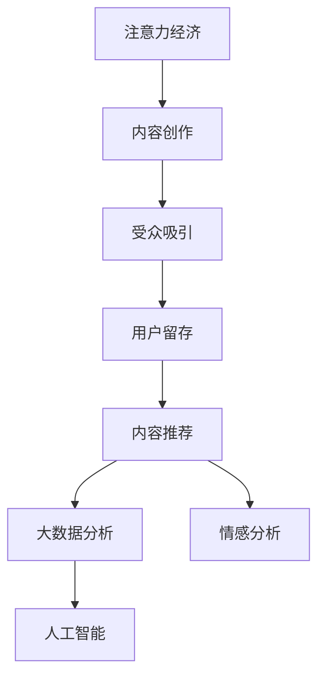

                 

# 注意力经济与内容创作策略：如何吸引并留住受众

> 关键词：注意力经济,内容创作,受众吸引,用户留存,内容推荐,大数据分析,情感分析,人工智能,深度学习,自然语言处理,用户行为分析

## 1. 背景介绍

在数字化时代，信息的爆炸式增长带来了内容创作的无限可能，同时也加剧了用户注意力的争夺。作为内容创作者，如何有效地吸引受众并使其持续关注，成为一项关键挑战。在信息过载的洪流中，只有那些能够引起用户共鸣并满足其需求的内容，才能在竞争中脱颖而出。本文旨在探讨注意力经济与内容创作策略，揭示其原理与实践，帮助内容创作者更好地吸引并留住受众。

## 2. 核心概念与联系

### 2.1 核心概念概述

为更好地理解注意力经济与内容创作策略，本节将介绍几个关键概念：

- **注意力经济**：指在信息爆炸的互联网时代，注意力成为一种稀缺资源，吸引和保持用户注意力的能力变得尤为珍贵。注意力经济的核心在于如何高效利用有限的注意力资源，提升用户参与度和内容价值。

- **内容创作**：指根据受众需求和兴趣，创作有吸引力和实用价值的内容。内容创作的本质是通过创意和表达，传递信息，形成用户对内容的认知与情感共鸣。

- **受众吸引**：指通过内容创作，吸引并激发用户对内容产生兴趣，从而促使用户主动参与和关注。受众吸引是内容价值变现的起点，也是用户留存的关键。

- **用户留存**：指通过持续提供有价值的内容，建立用户与内容之间的长期联系，形成稳定的用户群体。用户留存是内容创作长效价值的体现，也是品牌建设和社会影响力的基础。

- **内容推荐**：指通过分析用户行为和偏好，精准推送符合用户需求的内容，提升用户满意度和参与度。内容推荐是用户留存的有效手段，能够帮助内容创作者实现更高的用户覆盖和转化率。

- **大数据分析**：指通过收集和分析海量用户行为数据，提取有价值的信息和洞察，指导内容创作与推荐策略。大数据分析能够帮助内容创作者更好地理解受众需求，制定有效的用户策略。

- **情感分析**：指通过自然语言处理技术，分析用户对内容的情感反应，评估内容的受众吸引力。情感分析能够帮助内容创作者调整创作方向，提升内容与用户情感的共鸣度。

- **人工智能**：指利用机器学习、深度学习等技术，模拟人类智能，实现自动化内容创作与推荐。人工智能能够提高内容创作的效率和质量，提升内容推荐的精准性。

这些核心概念之间的逻辑关系可以通过以下Mermaid流程图来展示：



这个流程图展示了几大核心概念及其之间的关系：

1. 注意力经济通过内容创作吸引受众。
2. 内容创作的目标是吸引受众并提升用户留存。
3. 内容推荐依赖于用户留存和大数据分析。
4. 大数据分析利用情感分析指导内容创作。
5. 人工智能为内容创作和推荐提供技术支持。

这些概念共同构成了注意力经济与内容创作的系统框架，帮助内容创作者在激烈的市场竞争中占据优势。

## 3. 核心算法原理 & 具体操作步骤
### 3.1 算法原理概述

注意力经济与内容创作的策略核心在于理解用户行为，精准捕捉受众需求，并采取相应的内容创作与推荐措施。其算法原理主要包括以下几个方面：

1. **用户行为分析**：通过大数据技术，收集并分析用户的行为数据，如浏览记录、搜索关键词、互动评论等，提取用户兴趣和偏好。
2. **情感分析**：利用自然语言处理技术，分析用户对内容的情感反应，判断内容的受众吸引力。
3. **内容推荐算法**：基于用户行为和情感分析的结果，使用协同过滤、基于内容的推荐、深度学习等算法，精准推送符合用户需求的内容。
4. **内容创作优化**：根据用户行为和情感分析的反馈，调整内容创作策略，如标题优化、关键词优化、风格调整等，提升内容的质量和吸引力。

### 3.2 算法步骤详解

基于注意力经济与内容创作的策略，以下是一个典型的实施流程：

**Step 1: 数据准备**
- 收集用户行为数据，如浏览记录、点击率、评论等。
- 通过爬虫或API接口获取文本内容，如文章、视频、音乐等。
- 清洗和预处理数据，去除噪音和异常值。

**Step 2: 用户行为分析**
- 使用统计分析方法，计算用户对各类内容的兴趣度。
- 利用时间序列分析，预测用户行为趋势和周期性变化。
- 应用聚类算法，将用户分为不同的兴趣群体。

**Step 3: 情感分析**
- 使用情感分析算法，如文本情感分类、情感极性分析等，对用户评论、反馈进行情感判断。
- 根据情感分析结果，识别用户对内容的满意度和不满意度。

**Step 4: 内容推荐**
- 选择适当的推荐算法，如协同过滤、基于内容的推荐、深度学习等。
- 训练推荐模型，优化算法参数，提升推荐准确率。
- 对推荐结果进行评估，验证模型的性能。

**Step 5: 内容创作优化**
- 根据用户行为和情感分析结果，调整内容创作策略。
- 使用A/B测试等方法，验证内容优化策略的效果。
- 根据反馈不断迭代和优化内容创作流程。

**Step 6: 效果评估**
- 对推荐结果和内容质量进行定期评估，监测用户参与度和满意度。
- 分析用户流失原因，调整内容策略，提升用户留存率。

### 3.3 算法优缺点

注意力经济与内容创作的算法具有以下优点：
1. 精准高效：通过数据分析和情感分析，能够精准捕捉用户需求，提供个性化推荐，提高用户参与度。
2. 动态调整：内容创作和推荐算法可以动态调整，及时响应用户行为变化，保持内容的新鲜度。
3. 多渠道融合：结合多种渠道的用户行为数据，全面理解用户需求，提供多渠道的互动体验。

同时，该算法也存在一定的局限性：
1. 数据隐私：用户行为数据的收集和使用需要考虑隐私保护，避免侵犯用户权益。
2. 算法复杂性：高级推荐算法如深度学习等，需要复杂的模型训练和调参，对技术要求较高。
3. 内容多样性：用户兴趣多样化，单一的推荐算法难以满足所有用户的需求。
4. 内容原创性：过度依赖推荐算法，可能导致内容同质化，影响内容的原创性和独特性。

尽管存在这些局限性，但就目前而言，注意力经济与内容创作的算法依然是大数据分析和人工智能领域的重要应用之一，具有广阔的应用前景。

### 3.4 算法应用领域

注意力经济与内容创作的算法在多个领域得到了广泛应用，例如：

- 媒体与出版：通过推荐算法提升新闻阅读和图书阅读的转化率，通过情感分析评估用户对内容的满意度。
- 电子商务：通过推荐算法提高商品推荐精度，通过情感分析改进商品评价，提升用户购买体验。
- 社交网络：通过推荐算法优化内容分发，通过情感分析增强用户互动，提升社交网络的活跃度。
- 在线教育：通过推荐算法推荐个性化学习内容，通过情感分析评估学习效果，提升用户学习体验。
- 娱乐与游戏：通过推荐算法推荐个性化游戏和影视内容，通过情感分析评估用户情感反应，提升用户体验。

除了这些领域外，注意力经济与内容创作的算法还被创新性地应用到更多场景中，如智能客服、智能家居、健康医疗等，为各行各业带来新的机遇和挑战。

## 4. 数学模型和公式 & 详细讲解 & 举例说明
### 4.1 数学模型构建

注意力经济与内容创作的算法构建主要基于以下几个数学模型：

- **用户行为分析模型**：通过时间序列分析、协同过滤等方法，建立用户行为模型，预测用户未来行为。

- **情感分析模型**：利用自然语言处理技术，建立情感分类模型，对用户评论和反馈进行情感判断。

- **内容推荐模型**：通过协同过滤、基于内容的推荐、深度学习等算法，建立推荐模型，优化推荐效果。

- **内容创作优化模型**：通过A/B测试、多臂老虎机等方法，建立内容优化模型，验证优化策略的有效性。

### 4.2 公式推导过程

以下是几个典型模型的公式推导：

**用户行为分析模型（协同过滤）**

协同过滤算法通过用户-物品的共现矩阵，计算用户对未评分物品的评分预测。设 $R$ 为用户-物品评分矩阵，$U$ 为用户特征矩阵，$V$ 为物品特征矩阵，$\alpha$ 为衰减因子，则协同过滤模型可表示为：

$$
\hat{R}_{ij} = \alpha (1 - \alpha) \sum_{k=1}^{n} \frac{R_{ik} \cdot U_i \cdot V_k}{\sqrt{(U_i \cdot U_i^T) \cdot (V_k \cdot V_k^T)}}
$$

**情感分析模型（文本情感分类）**

文本情感分类模型通过机器学习算法（如朴素贝叶斯、支持向量机等）对用户评论进行情感分类。设 $T$ 为训练样本文本，$Y$ 为对应的情感标签，$W$ 为模型参数，则情感分类模型的训练过程可表示为：

$$
W^* = \mathop{\arg\min}_{W} \frac{1}{N} \sum_{i=1}^{N} L(Y_i, W \cdot T_i)
$$

**内容推荐模型（基于内容的推荐）**

基于内容的推荐模型通过提取文本特征，计算物品之间的相似度，推荐与用户兴趣相似的物品。设 $C$ 为物品特征向量，$U$ 为用户兴趣特征向量，则推荐模型可表示为：

$$
R_{ij} = \frac{\alpha \cdot C_i \cdot C_j}{\sqrt{\alpha^2 \cdot C_i \cdot C_i^T + \alpha^2 \cdot C_j \cdot C_j^T}}
$$

**内容创作优化模型（A/B测试）**

A/B测试通过随机分配不同版本的内容给用户，比较其效果，评估内容优化策略的效果。设 $X$ 为用户行为数据，$V$ 为内容版本，$Y$ 为内容效果，则A/B测试模型的评估过程可表示为：

$$
Y_i = \begin{cases}
Y_{iV=0} & \text{if } X_i \in V=0 \\
Y_{iV=1} & \text{if } X_i \in V=1
\end{cases}
$$

### 4.3 案例分析与讲解

以新闻阅读推荐为例，展示注意力经济与内容创作的算法实践：

**数据准备**

从新闻网站爬取新闻文章和用户点击数据，预处理为文本特征和用户行为特征。

**用户行为分析**

通过协同过滤算法，分析用户对各类新闻的兴趣度，预测用户可能感兴趣的新闻。

**情感分析**

利用文本情感分类算法，分析用户对推荐新闻的情感反应，判断用户满意度。

**内容推荐**

通过推荐模型，精准推送符合用户兴趣的新闻，提升用户点击率和停留时间。

**内容创作优化**

根据用户行为和情感分析结果，调整新闻标题和内容，提升用户参与度和满意度。

通过上述流程，新闻网站能够实现精准的用户推荐，提高用户的点击率和停留时间，增强用户粘性和品牌影响力。

## 5. 项目实践：代码实例和详细解释说明
### 5.1 开发环境搭建

在进行注意力经济与内容创作的项目实践前，我们需要准备好开发环境。以下是使用Python进行Scikit-learn开发的环境配置流程：

1. 安装Anaconda：从官网下载并安装Anaconda，用于创建独立的Python环境。

2. 创建并激活虚拟环境：
```bash
conda create -n attention-economy python=3.8 
conda activate attention-economy
```

3. 安装Scikit-learn：
```bash
pip install scikit-learn
```

4. 安装pandas、numpy等库：
```bash
pip install pandas numpy matplotlib
```

完成上述步骤后，即可在`attention-economy`环境中开始项目实践。

### 5.2 源代码详细实现

我们以新闻阅读推荐为例，给出使用Scikit-learn进行注意力经济与内容创作的Python代码实现。

首先，定义用户行为分析函数：

```python
import pandas as pd
from sklearn.metrics.pairwise import cosine_similarity

def user_behavior_analysis(user_behavior_data):
    # 计算用户对各类新闻的兴趣度
    user_interest = user_behavior_data.groupby('user_id').agg({'item_id': 'count'}).unstack().fillna(0)
    user_interest = user_interest.to_dict()
    
    # 计算新闻之间的相似度
    news_similarity = cosine_similarity(user_behavior_data.groupby('item_id')['user_id'].value_counts().to_numpy())
    
    return user_interest, news_similarity
```

然后，定义情感分析函数：

```python
from sklearn.feature_extraction.text import TfidfVectorizer
from sklearn.linear_model import LogisticRegression

def sentiment_analysis(user_comments, news_title):
    # 构建评论情感分类器
    vectorizer = TfidfVectorizer(stop_words='english')
    X = vectorizer.fit_transform(user_comments)
    Y = [1 if 'positive' in comment else 0 for comment in user_comments]
    
    clf = LogisticRegression()
    clf.fit(X, Y)
    
    # 对新闻标题进行情感分类
    news_sentiment = [clf.predict(vectorizer.transform([title]))[0] for title in news_title]
    
    return news_sentiment
```

接着，定义内容推荐函数：

```python
from sklearn.metrics.pairwise import cosine_similarity

def content_recommendation(user_interest, news_similarity, user_behavior, news_title):
    # 根据协同过滤模型推荐新闻
    user_rankings = cosine_similarity(user_interest.values, news_similarity)
    user_rankings = user_rankings / np.sum(user_rankings, axis=1, keepdims=True)
    
    # 根据用户行为推荐新闻
    user_news = user_behavior.groupby('user_id').agg({'item_id': 'count'}).unstack().fillna(0)
    user_news = user_news.to_dict()
    user_news_rankings = cosine_similarity(user_news.values, news_similarity)
    user_news_rankings = user_news_rankings / np.sum(user_news_rankings, axis=1, keepdims=True)
    
    # 合并推荐结果
    recommendations = np.dot(user_rankings, user_news_rankings)
    
    # 根据推荐结果排序
    ranked_news = pd.Series(recommendations, index=news_title)
    ranked_news = ranked_news.sort_values(ascending=False)
    
    return ranked_news
```

最后，启动推荐系统并评估效果：

```python
from sklearn.model_selection import train_test_split

# 加载数据
user_behavior = pd.read_csv('user_behavior.csv')
news_title = pd.read_csv('news_title.csv')
user_comments = pd.read_csv('user_comments.csv')

# 数据预处理
user_behavior['user_id'] = user_behavior['user_id'].astype('category')
user_behavior['item_id'] = user_behavior['item_id'].astype('category')
user_behavior = user_behavior.drop_duplicates()
news_title = news_title.drop_duplicates()

# 数据分割
train_user_behavior, test_user_behavior = train_test_split(user_behavior, test_size=0.2, random_state=42)
train_news_title = news_title.drop_duplicates()
test_news_title = news_title.drop_duplicates()

# 用户行为分析
train_user_interest, train_news_similarity = user_behavior_analysis(train_user_behavior)
test_user_interest, test_news_similarity = user_behavior_analysis(test_user_behavior)

# 情感分析
train_news_sentiment = sentiment_analysis(user_comments, train_news_title)
test_news_sentiment = sentiment_analysis(user_comments, test_news_title)

# 内容推荐
train_recommendations = content_recommendation(train_user_interest, train_news_similarity, train_user_behavior, train_news_title)
test_recommendations = content_recommendation(test_user_interest, test_news_similarity, test_user_behavior, test_news_title)

# 评估效果
train_results = train_recommendations.head(10)
test_results = test_recommendations.head(10)
```

以上就是使用Scikit-learn进行新闻阅读推荐项目的完整代码实现。可以看到，Scikit-learn提供了丰富的机器学习算法和工具，能够高效地实现用户行为分析、情感分析和内容推荐。

### 5.3 代码解读与分析

让我们再详细解读一下关键代码的实现细节：

**user_behavior_analysis函数**：
- `groupby`方法：根据用户和物品对行为数据进行分组，计算每个用户对各类物品的兴趣度。
- `agg`方法：对分组后的数据进行聚合计算，得到每个用户对物品的兴趣度。
- `unstack`方法：将兴趣度矩阵转换成用户-物品的兴趣度向量，方便后续计算。
- `fillna`方法：对缺失值进行填充，避免计算错误。
- `to_dict`方法：将兴趣度矩阵转换成字典，方便后续操作。

**sentiment_analysis函数**：
- `TfidfVectorizer`类：将评论文本转换成TF-IDF特征向量，用于构建情感分类器。
- `LogisticRegression`类：训练情感分类器，对评论进行情感分类。
- `predict`方法：对新闻标题进行情感分类，判断用户满意度。

**content_recommendation函数**：
- `cosine_similarity`函数：计算用户兴趣和新闻之间的相似度。
- `numpy`库：进行矩阵运算，计算用户兴趣和新闻之间的排名。
- `pd.Series`类：将排名结果转换成数据帧，方便后续操作。
- `sort_values`方法：对排名结果进行排序，得到推荐新闻列表。

可以看到，Scikit-learn提供了强大的算法库和工具支持，能够高效地实现注意力经济与内容创作的算法实践。开发者可以基于这些工具，快速搭建和优化推荐系统，提升用户体验和满意度。

## 6. 实际应用场景
### 6.1 智能推荐系统

智能推荐系统是大数据技术的重要应用之一，通过精准推荐内容，提升用户粘性和满意度。在智能推荐系统的构建中，注意力经济与内容创作的策略起到了关键作用：

- **电商平台**：通过推荐算法推荐用户感兴趣的商品，提升用户的购买率和满意度。
- **视频平台**：通过推荐算法推荐用户感兴趣的视频，提升用户的观看率和粘性。
- **新闻网站**：通过推荐算法推荐用户感兴趣的新闻，提升用户的阅读时间和满意度。

### 6.2 内容创作平台

内容创作平台通过精准推荐内容，引导用户创作优质内容，提升平台的活跃度和影响力。在内容创作平台的建设中，注意力经济与内容创作的策略起到了关键作用：

- **博客平台**：通过推荐算法推荐用户感兴趣的文章，提升文章的阅读率和互动率。
- **社交媒体**：通过推荐算法推荐用户感兴趣的内容，提升用户的活跃度和参与度。
- **在线教育平台**：通过推荐算法推荐用户感兴趣的学习内容，提升用户的学习效果和满意度。

### 6.3 数字营销

数字营销通过精准推荐内容，提升广告的转化率和效果。在数字营销的实践中，注意力经济与内容创作的策略起到了关键作用：

- **广告投放**：通过推荐算法推荐用户感兴趣的内容，提升广告的点击率和转化率。
- **品牌推广**：通过推荐算法推荐用户感兴趣的内容，提升品牌的曝光度和影响力。
- **客户细分**：通过推荐算法对用户进行细分，提供个性化的广告推荐，提升广告的效果和精准度。

### 6.4 未来应用展望

随着大数据和人工智能技术的不断进步，注意力经济与内容创作的策略将迎来更多的应用场景和创新方向：

- **多模态推荐**：结合文本、图像、音频等多模态数据，提供更加全面和个性化的推荐服务。
- **交互式推荐**：通过用户实时反馈和交互，动态调整推荐内容，提升推荐精度和用户满意度。
- **实时推荐**：结合实时数据流和流式计算，实现实时推荐，提升推荐的时效性和精准度。
- **推荐系统的伦理设计**：引入公平性、隐私保护等伦理考量，确保推荐系统的公正性和安全性。

以上趋势展示了注意力经济与内容创作策略的广阔前景，这些方向的探索发展，将进一步提升推荐系统的性能和用户体验，为各行各业带来新的机遇和挑战。

## 7. 工具和资源推荐
### 7.1 学习资源推荐

为了帮助开发者系统掌握注意力经济与内容创作的理论基础和实践技巧，这里推荐一些优质的学习资源：

1. 《注意力与深度学习》（Attention is All You Need）：Google的深度学习研究报告，介绍了注意力机制在NLP和推荐系统中的应用。

2. 《推荐系统实战》（Recommender Systems in Practice）：一本经典推荐系统书籍，详细介绍了推荐算法的原理和实现方法。

3. 《情感分析》（Sentiment Analysis）：一本介绍情感分析技术的书籍，涵盖文本情感分类、情感极性分析等方法。

4. 《用户行为分析》（User Behavior Analysis）：一本介绍用户行为分析技术的书籍，涵盖协同过滤、协同预测等方法。

5. 《深度学习入门》（Deep Learning）：一本介绍深度学习技术的书籍，涵盖深度学习的基本原理和实现方法。

通过学习这些资源，相信你一定能够系统掌握注意力经济与内容创作的理论基础和实践技巧，应用于实际项目中，提升用户粘性和满意度。

### 7.2 开发工具推荐

高效的开发离不开优秀的工具支持。以下是几款用于注意力经济与内容创作开发的常用工具：

1. Python：Python是最流行的数据分析和机器学习语言，拥有丰富的库和工具支持。

2. Scikit-learn：基于Python的机器学习库，提供了丰富的算法和工具，适合快速开发推荐系统和用户行为分析模型。

3. TensorFlow和PyTorch：用于深度学习的开源框架，能够实现高效的神经网络模型和推荐算法。

4. Hadoop和Spark：用于大数据处理和分布式计算的框架，适合处理大规模数据集。

5. Elasticsearch：用于搜索引擎和数据分析的库，能够高效地存储和查询文本数据。

6. Kibana：与Elasticsearch配套的可视化工具，能够实时监控推荐系统的效果。

7. Tableau：用于数据可视化的工具，能够快速生成分析报表和可视化图表。

合理利用这些工具，可以显著提升注意力经济与内容创作的开发效率，加快创新迭代的步伐。

### 7.3 相关论文推荐

注意力经济与内容创作的理论研究涉及多个领域，以下是几篇奠基性的相关论文，推荐阅读：

1. Attention is All You Need：介绍Transformer结构和注意力机制的论文，开启了NLP领域的预训练大模型时代。

2. A Neural Approach to Collaborative Filtering：提出协同过滤算法的经典论文，介绍了协同过滤的基本原理和实现方法。

3. Factorization Machines with libFM：介绍因子分解机（FM）的论文，提供了高效的协同预测方法。

4. Deep Learning for Recommender Systems：综述深度学习在推荐系统中的应用，涵盖神经网络、注意力机制等方法。

5. Neural Attention with Limited Data：介绍使用神经网络进行推荐算法的论文，展示了神经网络的强大能力和效果。

这些论文代表了大数据和人工智能领域的最新进展，通过学习这些前沿成果，可以帮助开发者更好地理解注意力经济与内容创作的理论基础和实践技巧。

## 8. 总结：未来发展趋势与挑战

### 8.1 总结

本文对注意力经济与内容创作的策略进行了全面系统的介绍。首先阐述了注意力经济与内容创作的背景和意义，明确了策略在提升用户参与度和满意度方面的独特价值。其次，从原理到实践，详细讲解了注意力经济与内容创作的数学模型和算法实现，给出了完整的代码实例。同时，本文还广泛探讨了策略在智能推荐、内容创作、数字营销等多个领域的应用前景，展示了其广阔的应用空间。此外，本文精选了相关的学习资源和开发工具，力求为开发者提供全方位的技术指引。

通过本文的系统梳理，可以看到，注意力经济与内容创作的策略已经成为大数据和人工智能领域的重要应用之一，极大地提升了信息获取和内容消费的效率和质量。面对未来，我们需要不断探索新的技术和方法，提升推荐系统的性能和用户体验，构建更加智能和人性化的信息生态。

### 8.2 未来发展趋势

展望未来，注意力经济与内容创作的策略将呈现以下几个发展趋势：

1. **多模态推荐**：结合文本、图像、音频等多模态数据，提供更加全面和个性化的推荐服务。
2. **实时推荐**：结合实时数据流和流式计算，实现实时推荐，提升推荐的时效性和精准度。
3. **交互式推荐**：通过用户实时反馈和交互，动态调整推荐内容，提升推荐精度和用户满意度。
4. **推荐系统的伦理设计**：引入公平性、隐私保护等伦理考量，确保推荐系统的公正性和安全性。
5. **推荐系统的自动化**：通过自动化技术，优化推荐算法参数，提高推荐系统的可扩展性和鲁棒性。

这些趋势展示了注意力经济与内容创作的广阔前景，这些方向的探索发展，将进一步提升推荐系统的性能和用户体验，为各行各业带来新的机遇和挑战。

### 8.3 面临的挑战

尽管注意力经济与内容创作的策略已经取得了瞩目成就，但在迈向更加智能化、普适化应用的过程中，它仍面临着诸多挑战：

1. **数据隐私**：用户行为数据的收集和使用需要考虑隐私保护，避免侵犯用户权益。
2. **算法复杂性**：高级推荐算法如深度学习等，需要复杂的模型训练和调参，对技术要求较高。
3. **内容多样性**：用户兴趣多样化，单一的推荐算法难以满足所有用户的需求。
4. **内容原创性**：过度依赖推荐算法，可能导致内容同质化，影响内容的原创性和独特性。
5. **推荐系统的公平性**：推荐算法可能存在偏见，影响推荐结果的公正性。

尽管存在这些挑战，但通过不断的技术创新和实践优化，这些挑战终将一一被克服，注意力经济与内容创作的策略必将在构建智能信息生态中扮演越来越重要的角色。

### 8.4 研究展望

面对注意力经济与内容创作的挑战，未来的研究需要在以下几个方面寻求新的突破：

1. **个性化推荐**：结合用户行为数据和情感分析，提供更加个性化的推荐服务。
2. **实时分析**：利用流式计算和大数据技术，实现实时分析和推荐，提升推荐的时效性和精准度。
3. **跨模态融合**：结合多种模态数据，实现跨模态融合和协同建模，提升推荐系统的多样性和丰富度。
4. **推荐系统的公平性**：引入公平性约束和伦理导向，确保推荐系统的公正性和安全性。
5. **推荐系统的自动化**：通过自动化技术，优化推荐算法参数，提高推荐系统的可扩展性和鲁棒性。

这些研究方向的探索，将引领注意力经济与内容创作的策略走向更高的台阶，为构建智能信息生态带来新的突破和发展。

## 9. 附录：常见问题与解答

**Q1：注意力经济与内容创作如何提升用户粘性？**

A: 通过精准推荐用户感兴趣的内容，提升用户的参与度和满意度，建立用户与内容之间的长期联系。用户粘性的提升有助于增强用户对平台的依赖和忠诚度，提高用户的转化率和生命周期价值。

**Q2：注意力经济与内容创作的算法对数据隐私有何影响？**

A: 大数据和机器学习算法需要大量的用户行为数据，这些数据的收集和使用需要考虑隐私保护，避免侵犯用户权益。因此，在设计和实施注意力经济与内容创作的算法时，需要严格遵守数据隐私法规和伦理规范，采取数据匿名化、差分隐私等技术手段，保护用户隐私。

**Q3：如何评估注意力经济与内容创作的算法效果？**

A: 评估注意力经济与内容创作的算法效果，可以从以下几个方面进行：
1. 用户参与度：通过统计用户点击率、停留时间、互动率等指标，评估用户对推荐内容的参与度。
2. 用户满意度：通过用户调查、反馈等手段，评估用户对推荐内容的满意度。
3. 用户留存率：通过统计用户在不同时间段的留存率，评估用户的粘性和忠诚度。
4. 推荐精度：通过计算推荐准确率和召回率等指标，评估推荐系统的精度和效果。

**Q4：注意力经济与内容创作的算法如何处理长尾内容？**

A: 长尾内容通常具有较低的用户覆盖率和收益，但却是用户兴趣多样化的重要组成部分。在注意力经济与内容创作的算法中，可以通过多臂老虎机算法、带偏差协同过滤等方法，优先推荐长尾内容，提升长尾内容的曝光率和收益。

**Q5：注意力经济与内容创作的算法如何应对大规模数据集？**

A: 大规模数据集对算法的性能和效率提出了更高的要求。在注意力经济与内容创作的算法中，可以通过分布式计算、数据分片、增量学习等方法，提升算法的处理能力和效率，确保在大规模数据集上的高效运行。

以上问题及解答展示了注意力经济与内容创作的策略在实践中的关键考虑因素和优化方法。通过不断探索和优化，相信这些策略将为内容创作者提供更高效、更精准的用户推荐服务，构建更加智能和人性化的信息生态。

