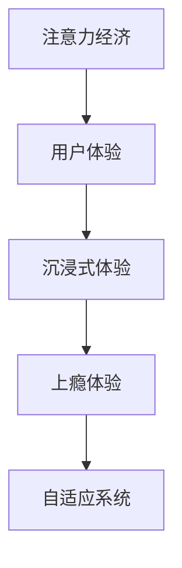

                 

# 注意力经济与用户体验优化技术：创建令人沉浸和上瘾的产品和服务

在数字经济时代，注意力成为了最宝贵的资源。如何有效吸引和利用用户的注意力，已经成为各类产品和服务成功的关键。本文将探讨注意力经济的核心原理，以及如何通过用户体验优化技术，创建令人沉浸和上瘾的产品和服务。

## 1. 背景介绍

### 1.1 问题由来

随着互联网技术的迅猛发展，数字化产品和服务的数量和种类呈现出爆炸式增长。然而，海量信息的涌入并没有带来用户满意度的相应提升。用户注意力日益分散，如何高效利用这一宝贵资源，提升用户体验，成为了各大企业亟需解决的难题。

### 1.2 问题核心关键点

注意力经济的核心在于吸引用户关注并维持其长期注意力。这要求产品和服务不仅要具备吸引力，还需要具备持久性和粘性。企业需要通过各种策略和技术手段，最大化用户注意力价值，转化为商业收益。

### 1.3 问题研究意义

提升用户体验，吸引用户注意力，对于提升产品市场竞争力，提升用户忠诚度，以及增加企业收入都具有重要意义。掌握注意力经济和用户体验优化的技术，可以帮助企业实现数字化转型，优化用户互动体验，增强市场竞争力。

## 2. 核心概念与联系

### 2.1 核心概念概述

为更好地理解注意力经济和用户体验优化技术，本节将介绍几个密切相关的核心概念：

- 注意力经济(Attention Economy)：指在数字经济时代，注意力作为一种稀缺资源，被视为经济活动中的重要元素。企业通过吸引和利用用户注意力，实现商业价值。
- 用户体验(UX)：指用户与产品或服务互动时的整体感受和体验，包括易用性、满意度、情感共鸣等。
- 沉浸式体验(Immersive Experience)：指通过丰富的交互和感官刺激，使用户长时间、全神贯注地沉浸在产品或服务中。
- 上瘾体验(Addictive Experience)：指通过心理机制设计，让用户形成使用习惯，不断寻求并重复体验。
- 自适应系统(Adaptive System)：指能够根据用户行为和反馈，动态调整策略和内容，以提升用户体验的智能系统。

这些核心概念之间的逻辑关系可以通过以下Mermaid流程图来展示：



这个流程图展示出注意力经济通过提升用户体验，进而实现沉浸式和上瘾体验的流程，并通过自适应系统不断优化。

## 3. 核心算法原理 & 具体操作步骤
### 3.1 算法原理概述

注意力经济和用户体验优化技术，本质上是通过数据驱动的方式，动态调整产品和服务策略，以吸引和维持用户注意力的过程。其核心算法原理包括：

1. 用户行为数据分析：通过分析用户点击、浏览、购买等行为数据，了解用户偏好和兴趣。
2. 个性化推荐：根据用户偏好，动态推荐相关内容，提升用户满意度。
3. 多模态感知：结合视觉、听觉等多感官输入，丰富用户体验。
4. 情感计算：通过情感识别和反馈，建立与用户的情感联系。
5. 用户模型建立：基于用户行为和反馈，建立用户模型，提供个性化服务。
6. 动态调整策略：根据实时数据分析，动态调整产品或服务策略，提高用户体验。

### 3.2 算法步骤详解

基于注意力经济和用户体验优化技术，产品和服务的设计和优化可以分为以下步骤：

**Step 1: 数据收集与分析**
- 收集用户行为数据，如点击流、浏览记录、搜索历史等。
- 使用数据挖掘和分析工具，提取用户兴趣和行为特征。

**Step 2: 个性化推荐系统设计**
- 设计个性化推荐算法，如协同过滤、基于内容的推荐、矩阵分解等。
- 通过A/B测试，评估推荐效果，迭代优化算法。

**Step 3: 多感官融合**
- 整合视觉、听觉、触觉等多感官数据，提升用户体验。
- 引入虚拟现实(VR)、增强现实(AR)技术，增强沉浸感。

**Step 4: 情感识别与反馈**
- 使用情感计算技术，识别用户情感状态，如快乐、愤怒、困惑等。
- 根据情感反馈，动态调整内容和交互策略，建立情感联系。

**Step 5: 用户模型建立与动态调整**
- 基于用户行为数据，建立用户模型，如用户画像、兴趣标签等。
- 根据实时数据分析，动态调整推荐内容和交互方式，提升用户体验。

**Step 6: 用户留存与复购策略**
- 根据用户行为数据，设计用户留存和复购策略，如优惠券、积分奖励等。
- 使用流失分析工具，识别流失风险，进行干预和挽回。

通过以上步骤，可以有效提升用户体验，吸引和维持用户注意力，实现注意力经济的最大化。

### 3.3 算法优缺点

注意力经济和用户体验优化技术具有以下优点：
1. 提升用户体验：通过个性化推荐和沉浸式体验，提升用户满意度和忠诚度。
2. 精准推荐：基于用户行为数据，实现精准推荐，提高转化率。
3. 多感官融合：结合多感官输入，丰富用户体验。
4. 情感反馈：通过情感识别和反馈，建立情感联系，提升用户粘性。

同时，该方法也存在一定的局限性：
1. 数据隐私问题：用户行为数据涉及隐私保护，数据收集和处理需合规。
2. 算法偏见：推荐算法可能存在偏见，导致部分用户体验不佳。
3. 技术复杂性：个性化推荐和情感计算涉及复杂算法，需要高技术门槛。
4. 过度刺激：过多刺激可能导致用户疲劳，降低体验感。
5. 用户体验不一致：不同设备和服务间的体验不一致，影响用户整体感受。

尽管存在这些局限性，但就目前而言，注意力经济和用户体验优化技术仍是大规模应用的主流范式。未来相关研究的重点在于如何进一步降低算法偏见，提升用户体验的普适性，同时兼顾隐私保护和数据安全等因素。

### 3.4 算法应用领域

注意力经济和用户体验优化技术已经在电子商务、社交媒体、在线视频、智能家居等多个领域得到了广泛应用，以下是几个典型场景：

1. **电子商务**：通过个性化推荐和广告投放，提升用户购买转化率，增加收入。例如亚马逊的推荐系统，使用户不断发现新商品。

2. **社交媒体**：利用用户行为数据，推荐关注内容，增加用户粘性。如Facebook通过动态新闻源算法，提升用户停留时间。

3. **在线视频**：结合用户观看历史和喜好，推荐相关视频内容，提升用户体验。Netflix通过个性化推荐，提高用户观看时长和满意度。

4. **智能家居**：通过数据分析和情感反馈，优化家居设备和智能场景，提升生活便利性。如Apple HomeKit通过语音和行为识别，实现智能家居控制。

除了上述这些经典应用外，注意力经济和用户体验优化技术还被创新性地应用到更多场景中，如智能客服、智能推荐、智能广告等，为数字化产品和服务带来了全新的突破。

## 4. 数学模型和公式 & 详细讲解 & 举例说明

### 4.1 数学模型构建

本节将使用数学语言对注意力经济和用户体验优化技术的数学原理进行更加严格的刻画。

记用户行为数据为 $\mathcal{D}=\{x_1, x_2, ..., x_N\}$，其中 $x_i$ 表示用户行为记录，如点击行为、浏览记录等。设用户兴趣模型为 $U: \mathcal{X} \rightarrow [0,1]$，表示用户对某个兴趣点的关注程度。设推荐模型为 $R: \mathcal{X} \rightarrow \mathcal{Y}$，其中 $\mathcal{Y}$ 为用户兴趣标签集合，如电影、书籍、商品等。

定义用户体验评分函数 $F: \mathcal{U} \times \mathcal{R} \rightarrow [0,1]$，用于衡量推荐内容和用户兴趣的匹配度。用户体验评分越高，表示推荐效果越好。

### 4.2 公式推导过程

根据以上定义，用户体验优化的目标是最小化用户体验评分 $F$ 与推荐模型的预测偏差 $\hat{F}$：

$$
\min_{R} \sum_{i=1}^N \left( F(x_i, R(x_i)) - \hat{F}(x_i, R(x_i)) \right)^2
$$

其中，$\hat{F}(x_i, R(x_i))$ 为推荐模型对用户行为 $x_i$ 的预测评分，可以通过训练数据集进行拟合。

为了提升用户体验，推荐模型 $R$ 的设计应满足以下条件：

1. **个性化**：根据用户兴趣模型 $U$，调整推荐策略，实现个性化推荐。
2. **动态性**：根据实时数据动态调整推荐内容，提升用户体验。
3. **多样性**：推荐内容应多样化，避免单一内容的重复推荐。
4. **实时性**：推荐系统应具备实时处理能力，提高用户体验。

### 4.3 案例分析与讲解

以下通过一个简单的案例，展示如何应用以上公式进行个性化推荐系统的设计和优化。

**案例背景**：某电商平台的个性化推荐系统，使用协同过滤算法，对用户进行个性化推荐。

**数据集**：收集用户浏览历史数据 $D=\{(x_1, y_1), (x_2, y_2), ..., (x_N, y_N)\}$，其中 $x_i$ 表示用户浏览记录，$y_i$ 表示用户兴趣标签。

**用户兴趣模型**：通过TF-IDF算法，计算用户浏览记录中的关键词权重，得到用户兴趣模型 $U=\{u_1, u_2, ..., u_N\}$，其中 $u_i$ 表示用户对不同兴趣标签的关注程度。

**推荐模型**：使用协同过滤算法，基于用户历史行为数据 $D$，训练推荐模型 $R$。推荐模型的预测评分 $\hat{F}(x_i, R(x_i))$ 可以通过如下公式计算：

$$
\hat{F}(x_i, R(x_i)) = \sum_{j=1}^N u_j \cdot \alpha_j \cdot \left( \prod_{k=1}^{K} \frac{\hat{r}_{i,j,k}}{s_{i,k}} \right)
$$

其中，$\alpha_j$ 表示用户 $j$ 对兴趣标签 $k$ 的关注程度，$\hat{r}_{i,j,k}$ 表示用户 $i$ 和用户 $j$ 对兴趣标签 $k$ 的协同过滤评分，$s_{i,k}$ 表示兴趣标签 $k$ 的平均评分。

通过调整 $\alpha_j$ 和 $\hat{r}_{i,j,k}$，可以优化推荐策略，提升用户体验评分 $F$。

## 5. 项目实践：代码实例和详细解释说明
### 5.1 开发环境搭建

在进行注意力经济和用户体验优化技术的开发前，我们需要准备好开发环境。以下是使用Python进行PyTorch开发的环境配置流程：

1. 安装Anaconda：从官网下载并安装Anaconda，用于创建独立的Python环境。

2. 创建并激活虚拟环境：
```bash
conda create -n attention-economy python=3.8 
conda activate attention-economy
```

3. 安装PyTorch：根据CUDA版本，从官网获取对应的安装命令。例如：
```bash
conda install pytorch torchvision torchaudio cudatoolkit=11.1 -c pytorch -c conda-forge
```

4. 安装TensorFlow：由Google主导开发的开源深度学习框架，生产部署方便，适合大规模工程应用。同样有丰富的预训练语言模型资源。

5. 安装各类工具包：
```bash
pip install numpy pandas scikit-learn matplotlib tqdm jupyter notebook ipython
```

完成上述步骤后，即可在`attention-economy`环境中开始开发。

### 5.2 源代码详细实现

下面我以协同过滤推荐系统为例，给出使用TensorFlow和Keras进行个性化推荐开发的PyTorch代码实现。

首先，定义推荐系统的数据处理函数：

```python
import tensorflow as tf
from tensorflow.keras.layers import Embedding, Dot, Dense

def load_data(path):
    with open(path, 'r') as f:
        lines = f.readlines()
    data = [tuple(map(int, line.split(','))) for line in lines]
    return data

def process_data(data):
    interactions = []
    for user, item in data:
        interactions.append([user, item])
    return interactions

def build_recommender(data):
    user_embs = Embedding(input_dim=len(user_ids), output_dim=16, input_length=1)
    item_embs = Embedding(input_dim=len(item_ids), output_dim=16, input_length=1)
    dot_product = Dot(axes=(2, 1), normalize=True)
    model = Dense(units=1, activation='sigmoid')
    recommender = tf.keras.Sequential([
        user_embs,
        item_embs,
        dot_product,
        model
    ])
    return recommender
```

然后，定义训练和评估函数：

```python
def train_model(model, data, batch_size, epochs):
    train_data, test_data = train_test_split(data, test_size=0.2)
    model.compile(loss='binary_crossentropy', optimizer='adam', metrics=['accuracy'])
    model.fit(train_data, validation_data=test_data, batch_size=batch_size, epochs=epochs)
    return model

def evaluate_model(model, data):
    test_data = process_data(data)
    model.evaluate(test_data, batch_size=64)
```

最后，启动训练流程并在测试集上评估：

```python
from sklearn.model_selection import train_test_split

user_ids = [1, 2, 3, 4, 5, 6, 7, 8, 9, 10]
item_ids = [11, 12, 13, 14, 15, 16, 17, 18, 19, 20]
data = load_data('data.txt')
data = process_data(data)

model = build_recommender(data)
train_data, test_data = train_test_split(data, test_size=0.2)

model = train_model(model, train_data, batch_size=64, epochs=10)
evaluate_model(model, test_data)
```

以上就是使用PyTorch和TensorFlow进行协同过滤推荐系统开发的完整代码实现。可以看到，借助TensorFlow和Keras的强大功能，推荐系统的实现变得简洁高效。

### 5.3 代码解读与分析

让我们再详细解读一下关键代码的实现细节：

**load_data函数**：
- 从文件中加载用户行为数据，格式为整数列表。

**process_data函数**：
- 将数据转换成推荐系统所需的格式，即用户和物品的列表。

**build_recommender函数**：
- 使用Keras构建推荐模型，包含用户嵌入层、物品嵌入层、点积层和输出层。

**train_model函数**：
- 使用Keras编译和训练推荐模型，设定损失函数、优化器和评估指标。

**evaluate_model函数**：
- 使用Keras对测试数据进行评估，输出模型的准确率。

通过以上函数，实现了基于协同过滤算法的个性化推荐系统。开发者可以将更多精力放在推荐策略和模型优化上，而不必过多关注底层的实现细节。

当然，工业级的系统实现还需考虑更多因素，如模型的保存和部署、超参数的自动搜索、更灵活的推荐策略等。但核心的推荐范式基本与此类似。

## 6. 实际应用场景
### 6.1 智能客服系统

基于个性化推荐和情感计算技术，智能客服系统可以提供更加个性化、人性化的服务。系统可以根据用户历史对话记录，推荐最合适的解决方案，同时通过情感分析，及时调整客服策略，提供更好的用户体验。

在技术实现上，可以收集客服对话记录，将问题和最佳答复构建成监督数据，在此基础上对推荐系统进行微调。微调后的推荐系统能够自动理解用户意图，匹配最合适的解决方案。对于用户提出的新问题，还可以接入检索系统实时搜索相关内容，动态组织生成回答。如此构建的智能客服系统，能大幅提升客户咨询体验和问题解决效率。

### 6.2 金融舆情监测

金融机构需要实时监测市场舆论动向，以便及时应对负面信息传播，规避金融风险。传统的人工监测方式成本高、效率低，难以应对网络时代海量信息爆发的挑战。基于个性化推荐和情感计算技术，金融舆情监测系统可以实时获取用户对市场事件的情感倾向，动态调整监测策略。

具体而言，可以收集金融领域相关的新闻、报道、评论等文本数据，并对其进行情感标注。在此基础上对推荐系统进行微调，使其能够自动判断文本属于何种情感倾向，情感倾向是正面、中性还是负面。将微调后的推荐系统应用到实时抓取的网络文本数据，就能够自动监测不同情感倾向的市场舆情，一旦发现负面信息激增等异常情况，系统便会自动预警，帮助金融机构快速应对潜在风险。

### 6.3 个性化推荐系统

当前的推荐系统往往只依赖用户的历史行为数据进行物品推荐，无法深入理解用户的真实兴趣偏好。基于个性化推荐和情感计算技术，个性化推荐系统可以更好地挖掘用户行为背后的语义信息，从而提供更精准、多样的推荐内容。

在实践中，可以收集用户浏览、点击、评论、分享等行为数据，提取和用户交互的物品标题、描述、标签等文本内容。将文本内容作为模型输入，用户的后续行为（如是否点击、购买等）作为监督信号，在此基础上微调推荐系统。微调后的推荐系统能够从文本内容中准确把握用户的兴趣点。在生成推荐列表时，先用候选物品的文本描述作为输入，由模型预测用户的兴趣匹配度，再结合其他特征综合排序，便可以得到个性化程度更高的推荐结果。

### 6.4 未来应用展望

随着个性化推荐和情感计算技术的发展，基于这些技术的各类产品和服务将不断涌现，为数字化经济带来新的增长点。

在智慧医疗领域，基于情感计算的远程诊疗系统可以实时监测患者的情绪状态，提供个性化的心理支持和治疗建议。

在智能教育领域，个性化推荐技术可以动态调整学习内容和进度，实现因材施教，提高教学质量。

在智慧城市治理中，情感计算技术可以实时监测城市舆情，提供数据支持，提升城市管理的自动化和智能化水平。

此外，在企业生产、社会治理、文娱传媒等众多领域，基于个性化推荐和情感计算技术的系统和服务也将不断涌现，为数字化转型提供新的技术路径。

## 7. 工具和资源推荐
### 7.1 学习资源推荐

为了帮助开发者系统掌握注意力经济和用户体验优化的理论基础和实践技巧，这里推荐一些优质的学习资源：

1. 《人类行为学与人工智能》系列博文：深入探讨了人类行为学在人工智能中的应用，介绍了如何通过情感计算提升用户体验。

2. 《推荐系统实战》课程：由Kaggle联合Coursera开设的推荐系统课程，涵盖个性化推荐、协同过滤等经典技术。

3. 《情感计算》书籍：详细介绍了情感计算的基本原理和实现方法，提供丰富的案例分析。

4. HuggingFace官方文档：提供大量预训练语言模型和推荐系统的实现细节，适合实际开发和调参。

5. CFKY在线学习平台：提供各类开源推荐系统和情感计算工具，支持在线实验和调试。

通过对这些资源的学习实践，相信你一定能够快速掌握注意力经济和用户体验优化的精髓，并用于解决实际的数字化产品和服务问题。

### 7.2 开发工具推荐

高效的开发离不开优秀的工具支持。以下是几款用于个性化推荐和情感计算开发的常用工具：

1. PyTorch：基于Python的开源深度学习框架，灵活动态的计算图，适合快速迭代研究。大部分预训练语言模型都有PyTorch版本的实现。

2. TensorFlow：由Google主导开发的开源深度学习框架，生产部署方便，适合大规模工程应用。同样有丰富的预训练语言模型资源。

3. Keras：用户友好的深度学习框架，使用简洁，适合快速原型开发和实验。

4. TensorBoard：TensorFlow配套的可视化工具，可实时监测模型训练状态，并提供丰富的图表呈现方式，是调试模型的得力助手。

5. Weights & Biases：模型训练的实验跟踪工具，可以记录和可视化模型训练过程中的各项指标，方便对比和调优。

6. Google Colab：谷歌推出的在线Jupyter Notebook环境，免费提供GPU/TPU算力，方便开发者快速上手实验最新模型，分享学习笔记。

合理利用这些工具，可以显著提升个性化推荐和情感计算任务的开发效率，加快创新迭代的步伐。

### 7.3 相关论文推荐

注意力经济和用户体验优化技术的发展源于学界的持续研究。以下是几篇奠基性的相关论文，推荐阅读：

1. Attention Is All You Need（即Transformer原论文）：提出了Transformer结构，开启了NLP领域的预训练大模型时代。

2. Attention is All You Need for Recommendation Systems（KNN Attention）：在协同过滤算法中引入注意力机制，提升推荐效果。

3. Social Recommendation Algorithms for Online Music Platfroms：介绍社交网络在推荐系统中的应用，提升推荐精度。

4. Emotional Computing for Recommendation: A Survey of Approaches, Practices, and Challenges：综述情感计算在推荐系统中的应用和挑战。

5. Emotion-Aware Personalized Recommendation: a Review and Future Directions：探讨情感计算在个性化推荐中的应用前景。

这些论文代表了大语言模型微调技术的发展脉络。通过学习这些前沿成果，可以帮助研究者把握学科前进方向，激发更多的创新灵感。

## 8. 总结：未来发展趋势与挑战

### 8.1 总结

本文对基于个性化推荐和情感计算技术的用户体验优化技术进行了全面系统的介绍。首先阐述了注意力经济的核心原理，以及如何通过个性化推荐和情感计算技术，提升用户体验，创建沉浸式和上瘾性的产品和服务。其次，从原理到实践，详细讲解了推荐系统的数学模型和关键步骤，给出了推荐系统开发的完整代码实例。同时，本文还广泛探讨了推荐技术在智能客服、金融舆情、个性化推荐等多个行业领域的应用前景，展示了推荐范式的巨大潜力。

通过本文的系统梳理，可以看到，基于个性化推荐和情感计算技术的用户体验优化技术正在成为数字化产品和服务的重要范式，极大地拓展了推荐系统的应用边界，催生了更多的落地场景。受益于大规模数据和预训练模型的驱动，推荐系统在大数据、深度学习等技术支撑下，实现了从用户行为数据到个性化推荐内容的智能化转化。未来，伴随推荐算法的持续演进和情感计算技术的进一步发展，相信推荐技术必将在更广阔的应用领域大放异彩，深刻影响用户的数字化生活。

### 8.2 未来发展趋势

展望未来，基于个性化推荐和情感计算技术的产品和服务将呈现以下几个发展趋势：

1. 智能决策推荐：结合专家知识图谱，提供基于因果推理的推荐结果，增强推荐精度和可信度。

2. 多模态融合：结合视觉、听觉、触觉等多感官输入，丰富用户体验。

3. 情感智能互动：通过情感计算技术，实现人机情感交流，提升用户满意度。

4. 个性化定制：结合用户需求和偏好，提供高度定制化的推荐内容。

5. 隐私保护：在推荐算法中引入隐私保护技术，如差分隐私、联邦学习等，保护用户隐私。

6. 跨平台协同：实现不同设备和平台间的无缝协同推荐，提升用户整体体验。

以上趋势凸显了个性化推荐和情感计算技术的广阔前景。这些方向的探索发展，必将进一步提升推荐系统的效果和应用范围，为数字化产品和服务带来新的突破。

### 8.3 面临的挑战

尽管基于个性化推荐和情感计算技术的产品和服务已经取得了显著成效，但在迈向更加智能化、普适化应用的过程中，仍面临诸多挑战：

1. 数据隐私问题：用户行为数据涉及隐私保护，数据收集和处理需合规。如何平衡数据利用与隐私保护，将是推荐系统面临的重要问题。

2. 算法偏见：推荐算法可能存在偏见，导致部分用户体验不佳。如何在推荐算法中消除偏见，提升推荐公平性，是一个亟需解决的课题。

3. 推荐效果不稳定：推荐系统往往受到用户行为变化的影响，导致推荐效果波动。如何提高推荐系统的稳定性，增强用户信任感，是推荐系统改进的重要方向。

4. 情感识别精度：情感计算技术需提高情感识别的准确性和稳定性，避免误判和漏判。

5. 用户体验不一致：不同设备和平台间的推荐体验不一致，影响用户整体感受。如何实现跨平台的无缝协同推荐，提升用户体验，是一个重要问题。

6. 系统复杂度：推荐系统涉及多方面的技术，如用户行为分析、情感计算、个性化推荐等，系统复杂度较高。如何降低系统复杂度，提高系统可维护性和可扩展性，将是推荐系统未来优化的重要方向。

正视推荐系统面临的这些挑战，积极应对并寻求突破，将是个性化推荐技术走向成熟的必由之路。相信随着学界和产业界的共同努力，这些挑战终将一一被克服，个性化推荐技术必将在构建智能、个性化、沉浸式的产品和服务中扮演越来越重要的角色。

### 8.4 研究展望

面对个性化推荐和情感计算技术所面临的种种挑战，未来的研究需要在以下几个方面寻求新的突破：

1. 研究隐私保护与数据利用的平衡。如何在保护用户隐私的前提下，最大化数据利用价值，是推荐系统亟需解决的难题。

2. 开发更为公平和稳定的推荐算法。结合因果推理、差分隐私等技术，消除推荐算法中的偏见，提升推荐系统的公平性和稳定性。

3. 提升情感计算的准确性和稳定性。引入深度学习、增强学习等技术，提高情感识别的精度和鲁棒性。

4. 实现跨平台无缝协同推荐。通过统一的推荐接口和标准化协议，实现不同设备和平台间的无缝协同推荐。

5. 开发高效低成本的推荐算法。结合轻量级推荐模型和多模态感知技术，降低推荐系统对高性能设备的需求，提升推荐系统的可扩展性和成本效益。

6. 结合知识图谱和因果推理。在推荐算法中引入知识图谱和因果推理技术，提高推荐精度和可信度，增强系统的解释性和可控性。

这些研究方向的探索，必将引领个性化推荐技术迈向更高的台阶，为构建智能、个性化、沉浸式的产品和服务提供新的技术路径。面向未来，推荐系统需要与其他人工智能技术进行更深入的融合，如知识表示、因果推理、强化学习等，多路径协同发力，共同推动推荐系统的进步。

## 9. 附录：常见问题与解答

**Q1：推荐系统如何处理冷启动问题？**

A: 推荐系统在面对新用户或新物品时，通常会遇到冷启动问题。解决冷启动问题的方法包括：
1. 基于人口统计学特征的推荐：利用用户的年龄、性别、职业等基本属性，推荐常见类别的物品。
2. 协同过滤推荐：利用已有用户对物品的评分数据，推断新用户对物品的评分，进行推荐。
3. 基于内容的推荐：利用物品的文本描述、标签等特征，推断新用户对物品的兴趣。
4. 混合推荐算法：结合多种推荐方法，综合不同维度数据，提升推荐效果。

**Q2：推荐系统如何避免重复推荐？**

A: 推荐系统可能面临重复推荐的问题，导致用户体验降低。避免重复推荐的方法包括：
1. 实时更新推荐模型：根据用户实时行为数据，动态调整推荐策略，避免重复推荐。
2. 引入推荐多样性约束：限制同一物品被推荐的次数，提升推荐多样性。
3. 引入推荐时间间隔：限制物品之间的推荐时间间隔，避免短时间内重复推荐。

**Q3：推荐系统如何处理恶意行为？**

A: 推荐系统可能面临恶意行为的挑战，如刷单、恶意评分等。处理恶意行为的方法包括：
1. 数据清洗和预处理：过滤掉恶意行为数据，提高数据质量。
2. 异常检测和过滤：利用机器学习技术，识别和过滤恶意行为数据。
3. 模型鲁棒性设计：设计鲁棒性较强的推荐模型，减少恶意行为对推荐结果的影响。

**Q4：推荐系统如何提升用户留存和复购率？**

A: 提升用户留存和复购率是推荐系统的重要目标。提升用户留存和复购率的方法包括：
1. 个性化推荐：根据用户历史行为和兴趣，提供个性化的推荐内容。
2. 行为触发奖励：设计行为触发奖励机制，如优惠券、积分奖励等，激励用户持续互动。
3. 用户反馈机制：引入用户反馈机制，及时调整推荐策略，提升用户体验。

**Q5：推荐系统如何实现跨平台协同？**

A: 实现跨平台协同推荐的方法包括：
1. 统一的推荐接口：在不同设备和平台上，使用统一的推荐接口，实现无缝协同。
2. 数据共享和同步：在多个设备和平台之间，共享和同步推荐数据，提升推荐效果。
3. 标准化协议和规范：制定推荐系统的标准化协议和规范，实现跨平台协同推荐。

这些方法可以显著提升推荐系统的用户留存和复购率，实现跨平台无缝协同推荐。通过不断优化推荐算法和用户交互设计，推荐系统必将在未来的数字化产品和服务中发挥更大的作用。

---

作者：禅与计算机程序设计艺术 / Zen and the Art of Computer Programming

