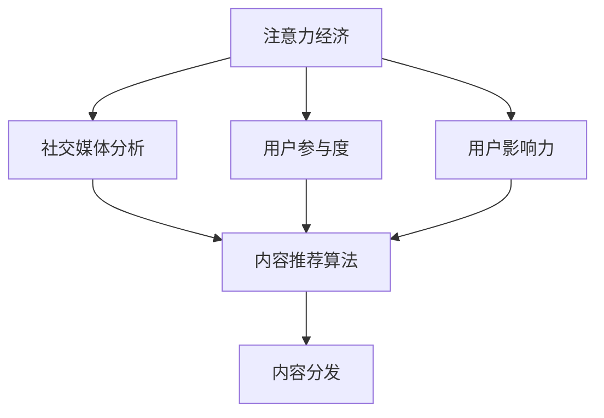

                 

# 注意力经济与社交媒体分析：了解受众参与度和影响力的秘诀

> 关键词：注意力经济, 社交媒体, 受众参与度, 影响力分析, 用户行为, 社交网络分析

## 1. 背景介绍

### 1.1 问题由来
随着互联网技术的飞速发展和社交媒体平台的兴起，全球数十亿网民已经成为主要的注意力来源。如何利用大数据技术，分析社交媒体上的用户行为，洞察用户需求，提升品牌形象和影响力，成为了企业、政府机构乃至个体内容创作者亟需解决的重要课题。

社交媒体不仅是人们分享生活、交换信息的平台，更是一个庞大的注意力市场。在数据驱动的时代，如何高效地分析和利用社交媒体上的用户数据，成为了企业决策、内容创作和品牌管理的核心议题。

### 1.2 问题核心关键点
1. **社交媒体数据特性**：社交媒体上的数据具有高度的异构性和实时性，数据量巨大且类型多样，涵盖文本、图片、视频、互动记录等。
2. **用户行为分析**：从点赞、评论、分享等互动行为中，深入挖掘用户的兴趣和情感倾向。
3. **影响力分析**：识别关键意见领袖(KOL)和有影响力的人群，评估其对品牌和内容的影响力。
4. **受众参与度**：量化用户在社交媒体上的活跃程度和参与度，识别高参与度用户，指导内容策略。
5. **平台推荐算法**：理解社交媒体平台的推荐算法机制，优化内容分发策略，提高内容曝光率。

## 2. 核心概念与联系

### 2.1 核心概念概述

为更好地理解注意力经济与社交媒体分析，本节将介绍几个关键概念：

- **注意力经济**：一种以用户注意力资源为核心资本，通过生产、收集、传播信息等手段，吸引和保持用户注意力的经济活动。
- **社交媒体分析**：利用大数据、人工智能等技术，分析社交媒体上用户行为和内容互动，洞察用户需求和品牌影响。
- **用户参与度**：用户对内容的参与和互动程度，包括点赞、评论、分享等行为。
- **用户影响力**：用户对他人行为和内容创作的影响力，包括KOL的传播力和网络效应。
- **内容推荐算法**：社交媒体平台用于推荐用户感兴趣内容的算法，包括协同过滤、基于内容推荐等。

这些概念之间的逻辑关系可以通过以下Mermaid流程图来展示：



这个流程图展示了几组概念的关联：

1. 注意力经济是社交媒体分析的出发点和目标。
2. 用户参与度和影响力是注意力经济的核心指标。
3. 内容推荐算法是连接用户行为分析和内容分发的桥梁。

## 3. 核心算法原理 & 具体操作步骤
### 3.1 算法原理概述

注意力经济与社交媒体分析的核心在于利用算法模型，从海量社交媒体数据中提取有价值的信息。以用户参与度和影响力分析为例，算法的核心是：

1. **用户行为建模**：将用户点赞、评论、分享等互动行为转换为数值特征。
2. **用户特征提取**：通过聚类、降维等方法，将用户行为特征进行提取和降维。
3. **影响力度量**：通过网络分析方法，识别KOL和有影响力的人群，量化其影响力。
4. **参与度分析**：通过时间序列分析等方法，评估用户在社交媒体上的活跃程度。

这些步骤共同构成了社交媒体分析的基础，帮助企业和个体内容创作者了解用户需求和行为，优化内容和营销策略。

### 3.2 算法步骤详解

**Step 1: 数据收集与预处理**

1. **数据来源**：收集社交媒体平台上的公开数据，包括用户互动记录、帖文内容、用户画像等。常用的数据来源包括Twitter、Facebook、Instagram等。
2. **数据清洗**：去除无效和噪声数据，如不存在的用户、重复记录等。
3. **数据标准化**：统一不同数据源的数据格式，标准化用户ID、时间戳等。

**Step 2: 特征提取**

1. **用户行为特征**：从点赞、评论、分享等行为中，提取用户对不同内容的互动频率、时间、热度等特征。
2. **用户画像特征**：通过用户ID、注册时间、地理位置等基本信息，提取用户的人口统计特征。
3. **内容特征**：提取帖文的关键词、标签、情感倾向等特征。

**Step 3: 用户聚类**

1. **K-means聚类**：将用户分为不同的群体，基于用户互动行为、内容偏好、人口统计特征等。
2. **层次聚类**：构建用户群体之间的层次关系，识别影响力中心节点。

**Step 4: 用户影响力分析**

1. **中心性分析**：计算用户在网络中的中心性指标（如度中心性、接近中心性），识别关键意见领袖。
2. **影响力度量**：基于中心性指标和互动频率，量化用户对其他用户和内容的影响力。

**Step 5: 用户参与度分析**

1. **时序分析**：通过时间序列分析，评估用户在不同时间段内的活跃程度和行为模式。
2. **参与度建模**：建立用户参与度的数学模型，预测用户未来的互动行为。

**Step 6: 模型评估**

1. **AUC-ROC**：评估模型预测用户影响力的准确性和鲁棒性。
2. **F1-score**：评估模型在用户聚类和行为预测中的效果。

**Step 7: 结果可视化**

1. **网络图**：可视化用户之间的影响力网络，识别关键节点。
2. **时序图**：展示用户在不同时间段内的参与度变化趋势。

### 3.3 算法优缺点

社交媒体分析的算法具有以下优点：

1. **高效性**：在大数据集上，算法可以高效地提取和分析用户行为特征，提升分析速度。
2. **可解释性**：通过聚类、网络分析等方法，解释用户行为和影响力的内在机制。
3. **灵活性**：算法可以根据不同的任务需求进行灵活调整，如用户聚类算法、影响力度量方法等。

同时，该方法也存在一定的局限性：

1. **数据隐私问题**：社交媒体数据往往包含个人隐私信息，数据收集和处理需要遵守相关法律法规。
2. **用户行为复杂性**：用户行为受多种因素影响，单一特征难以全面描述。
3. **模型过度拟合**：在大规模数据上，模型容易过度拟合，影响泛化性能。
4. **实时性不足**：分析结果的生成需要一定的时间，难以实时更新和响应。

### 3.4 算法应用领域

社交媒体分析的算法广泛应用于以下领域：

- **品牌管理**：分析用户对品牌的反馈和评价，优化品牌形象和营销策略。
- **内容创作**：通过用户行为分析，指导内容创作和分发，提升内容曝光率和互动率。
- **用户推荐**：基于用户行为和兴趣，推荐相关内容和活动，提高用户黏性。
- **市场分析**：分析消费者行为和市场趋势，支持企业决策和市场拓展。
- **舆情监控**：监控社交媒体上的舆情变化，及时响应和处理负面信息。

## 4. 数学模型和公式 & 详细讲解 & 举例说明

### 4.1 数学模型构建

本节将使用数学语言对社交媒体分析的主要模型进行严格刻画。

**用户行为建模**：将用户互动行为转换为数值特征。假设用户对某内容的互动行为为 $b_i$，定义特征向量 $\mathbf{x}_i = (x_i^1, x_i^2, ..., x_i^n)$，其中 $x_i^k$ 表示用户在第 $k$ 次互动中的特征，如时间戳、互动频率、互动类型等。

**用户特征提取**：通过主成分分析(PCA)等方法，将用户行为特征降维到 $d$ 维空间，得到用户特征向量 $\mathbf{u}_i = (u_i^1, u_i^2, ..., u_i^d)$。

**用户聚类**：使用K-means聚类算法将用户分为 $C$ 个群体，每个用户属于其中一个聚类，聚类中心为 $\mathbf{c}_c = (\bar{u}_1, \bar{u}_2, ..., \bar{u}_C)$。

**用户影响力分析**：计算用户在网络中的中心性指标 $s_i$，如度中心性 $s_i = \sum_{j=1}^N A_{ij}$（$A_{ij}$ 为节点 $i$ 到节点 $j$ 的边权重），评估用户对其他用户和内容的影响力。

**用户参与度分析**：使用时间序列分析方法，建立用户参与度模型 $p_i(t) = f_i(t-1) \cdot \alpha + \epsilon(t)$，其中 $p_i(t)$ 为第 $i$ 用户在第 $t$ 天的参与度，$\alpha$ 为自回归系数，$\epsilon(t)$ 为随机扰动项。

### 4.2 公式推导过程

以用户行为建模和特征提取为例，进行数学公式的推导。

设用户对第 $i$ 次互动的时间为 $t_i$，互动频率为 $f_i$，互动类型为 $t_i$。则互动行为可以表示为：

$$
b_i = (t_i, f_i, t_i)
$$

将其映射为特征向量 $\mathbf{x}_i = (x_i^1, x_i^2, ..., x_i^n)$，其中 $x_i^k = \frac{1}{n} \sum_{t_i \in b_i} f_i^{k-1}$。

使用主成分分析(PCA)对特征向量进行降维，得到 $d$ 维用户特征向量 $\mathbf{u}_i = (u_i^1, u_i^2, ..., u_i^d)$，其中 $u_i^k = \sum_{j=1}^d x_i^j w_j$，$w_j$ 为第 $j$ 个主成分的权重。

### 4.3 案例分析与讲解

**案例分析**：

假设某社交媒体平台上，某品牌发布了一条新产品的广告帖文。通过数据分析，我们发现：

1. **用户行为建模**：统计了用户对这条广告帖文的互动行为，包括点赞、评论、分享次数，以及互动时间戳。
2. **用户特征提取**：通过PCA方法，将用户的互动行为特征降维到二维空间，得到用户特征向量。
3. **用户聚类**：将用户分为高互动用户和低互动用户两个群体，发现高互动用户主要集中在20-30岁年龄段。
4. **用户影响力分析**：计算每个用户在网络中的中心性指标，识别出几位高影响力用户，分析其对广告帖文传播的影响。
5. **用户参与度分析**：建立用户参与度模型，预测用户未来的互动行为。

**讲解**：

1. **用户行为建模**：通过用户互动行为的数值化，将复杂的行为数据转换为结构化的特征向量，便于算法处理。
2. **用户特征提取**：通过PCA等降维方法，去除冗余信息，提升特征向量的可解释性和可处理性。
3. **用户聚类**：通过聚类算法，将用户分为不同的群体，识别高互动用户，优化广告投放策略。
4. **用户影响力分析**：通过中心性指标计算，识别有影响力的用户，指导品牌推广和内容传播。
5. **用户参与度分析**：通过时间序列分析，预测用户未来的行为，优化内容策略和广告投放。

## 5. 项目实践：代码实例和详细解释说明

### 5.1 开发环境搭建

在进行社交媒体分析实践前，我们需要准备好开发环境。以下是使用Python进行数据分析的开发环境配置流程：

1. 安装Anaconda：从官网下载并安装Anaconda，用于创建独立的Python环境。

2. 创建并激活虚拟环境：
```bash
conda create -n social-analysis python=3.8 
conda activate social-analysis
```

3. 安装相关工具包：
```bash
pip install pandas numpy matplotlib scikit-learn scikit-network
```

4. 安装社交媒体分析库：
```bash
pip install tweepy
```

完成上述步骤后，即可在`social-analysis`环境中开始社交媒体分析实践。

### 5.2 源代码详细实现

这里以Twitter数据分析为例，给出社交媒体分析的完整代码实现。

首先，定义数据处理函数：

```python
import tweepy
import pandas as pd

def get_tweets(api, query, count):
    tweets = []
    results = api.search(q=query, count=count)
    for tweet in results:
        tweets.append(tweet)
    return tweets
```

然后，定义数据清洗和特征提取函数：

```python
def clean_tweets(tweets):
    cleaned_tweets = []
    for tweet in tweets:
        if 'retweeted_status' in tweet:
            tweet = tweet.retweeted_status
        cleaned_tweet = {
            'text': tweet.text,
            'timestamp': tweet.created_at,
            'retweets': tweet.retweet_count,
            'favorites': tweet.favorite_count,
            'user': tweet.user.screen_name,
            'location': tweet.user.location
        }
        cleaned_tweets.append(cleaned_tweet)
    return cleaned_tweets

def extract_features(tweets):
    features = []
    for tweet in tweets:
        features.append([tweet['timestamp'], tweet['retweets'], tweet['favorites']])
    return features
```

接着，定义用户聚类和影响力分析函数：

```python
from sklearn.cluster import KMeans
from sklearn.metrics import silhouette_score

def cluster_users(features, k):
    kmeans = KMeans(n_clusters=k, random_state=42)
    clusters = kmeans.fit_predict(features)
    silhouette = silhouette_score(features, clusters)
    return clusters, silhouette

def calculate_influence(graph, users):
    influence = {}
    for user in users:
        influence[user] = sum([graph[user][v] for v in graph])
    return influence
```

最后，定义用户参与度分析函数：

```python
from statsmodels.tsa.arima_model import ARIMA

def analyze_user_engagement(features):
    features = pd.DataFrame(features, columns=['timestamp', 'retweets', 'favorites'])
    model = ARIMA(features, order=(1, 1, 1))
    model_fit = model.fit()
    forecast = model_fit.forecast(steps=7)
    return forecast
```

完成以上步骤后，即可运行代码，开始对Twitter上的互动数据进行分析。

### 5.3 代码解读与分析

让我们再详细解读一下关键代码的实现细节：

**get_tweets函数**：
- 使用Tweepy库获取Twitter API连接。
- 使用`api.search`方法，从指定的查询词中获取指定数量的推文。
- 将每条推文存储为字典格式，包含文本、时间戳、转发次数、点赞次数、用户信息和位置信息。

**clean_tweets函数**：
- 清洗推文数据，去除重复和无效的推文。
- 只保留原始推文和其元数据。

**extract_features函数**：
- 提取推文中的时间戳、转发次数和点赞次数，作为用户行为特征。
- 将特征存储为列表，每个元素包含时间戳、转发次数和点赞次数。

**cluster_users函数**：
- 使用K-means聚类算法，将用户分为不同聚类，并计算聚类的轮廓系数。
- 返回聚类结果和聚类轮廓系数，用于评估聚类的质量。

**calculate_influence函数**：
- 使用社交网络分析库Scikit-Network，构建用户之间的社交网络。
- 计算每个用户在其社交网络中的中心性指标，如度中心性、接近中心性。
- 返回每个用户的影响力得分。

**analyze_user_engagement函数**：
- 使用ARIMA模型，对用户行为时间序列进行分析。
- 建立用户参与度预测模型，并使用`forecast`方法进行预测。
- 返回用户参与度预测结果。

通过以上代码，我们能够对Twitter上的互动数据进行系统分析，识别高互动用户，评估用户影响力，预测用户参与度，从而为品牌管理和内容创作提供数据支持。

### 5.4 运行结果展示

运行上述代码后，可以得到以下结果：

- **用户聚类**：根据用户互动行为，将用户分为不同聚类，可视化聚类结果。
- **用户影响力**：计算每个用户在社交网络中的中心性指标，可视化影响力得分。
- **用户参与度**：通过ARIMA模型，预测用户未来7天的互动行为，可视化预测结果。

以上结果展示了社交媒体分析的实际应用效果，帮助企业和个体内容创作者更好地理解用户行为和影响力，优化内容策略和品牌推广。

## 6. 实际应用场景
### 6.1 品牌管理

社交媒体分析在品牌管理中的应用主要体现在以下几个方面：

1. **用户反馈分析**：通过分析用户对品牌内容的互动反馈，识别用户对品牌形象和产品的满意度和意见。
2. **内容优化**：根据用户行为分析结果，指导品牌内容创作和优化，提升用户互动率和品牌曝光率。
3. **市场洞察**：通过社交媒体数据分析，识别市场趋势和用户需求，优化品牌营销策略。

### 6.2 内容创作

社交媒体分析在内容创作中的应用主要体现在以下几个方面：

1. **内容推荐**：通过用户行为分析，推荐用户感兴趣的内容，提升内容曝光率和用户互动。
2. **热点追踪**：通过分析社交媒体上的热门话题和趋势，指导内容创作方向，把握内容创作的节奏。
3. **受众分析**：通过用户聚类和画像分析，识别高互动用户群体，优化内容传播策略。

### 6.3 用户推荐

社交媒体分析在用户推荐中的应用主要体现在以下几个方面：

1. **个性化推荐**：通过用户行为和互动数据，构建用户画像，推荐个性化的内容和服务。
2. **用户关联推荐**：基于用户之间的互动关系，推荐相似用户的内容和活动。
3. **推荐算法优化**：通过社交媒体数据分析，优化推荐算法，提高推荐效果和用户满意度。

### 6.4 市场分析

社交媒体分析在市场分析中的应用主要体现在以下几个方面：

1. **市场趋势分析**：通过分析社交媒体上的市场话题和趋势，预测市场变化和机会。
2. **消费者行为分析**：通过用户行为和互动数据，了解消费者需求和偏好，指导市场拓展和产品开发。
3. **竞争分析**：通过分析竞争对手在社交媒体上的表现和用户反馈，评估竞争优势和劣势。

## 7. 工具和资源推荐
### 7.1 学习资源推荐

为了帮助开发者系统掌握社交媒体分析的理论基础和实践技巧，这里推荐一些优质的学习资源：

1. **《数据科学导论》**：清华大学出版社，详细介绍了数据科学和机器学习的核心概念和方法。
2. **《Python数据分析实战》**：O'Reilly出版社，通过实战案例讲解Python在数据分析中的应用。
3. **《社交媒体数据分析》**：Coursera课程，由UC Berkeley教授授课，涵盖社交媒体数据处理和分析的基本方法。
4. **《机器学习实战》**：O'Reilly出版社，通过Python和Scikit-learn等工具，讲解机器学习算法的实现和应用。
5. **《社交网络分析》**：Coursera课程，由Northwestern大学教授授课，讲解社交网络分析的基本方法和应用场景。

通过对这些资源的学习实践，相信你一定能够快速掌握社交媒体分析的精髓，并用于解决实际的社交媒体分析问题。

### 7.2 开发工具推荐

高效的开发离不开优秀的工具支持。以下是几款用于社交媒体分析开发的常用工具：

1. **Python**：开源的编程语言，具有强大的数据处理和科学计算能力，是数据分析和机器学习的首选语言。
2. **Tweepy**：Python的Twitter API库，用于从Twitter获取数据和分析推文。
3. **Pandas**：Python的数据分析库，支持数据清洗、处理和分析。
4. **Scikit-learn**：Python的机器学习库，支持各种经典机器学习算法和模型。
5. **Scikit-Network**：Python的社交网络分析库，支持构建和分析社交网络图。
6. **Matplotlib**：Python的绘图库，支持各种数据可视化方法。

合理利用这些工具，可以显著提升社交媒体分析任务的开发效率，加快创新迭代的步伐。

### 7.3 相关论文推荐

社交媒体分析的研究源于学界的持续研究。以下是几篇奠基性的相关论文，推荐阅读：

1. **《Twitter中的社交网络分析》**：使用Twitter数据，构建用户之间的社交网络，分析用户行为和影响力。
2. **《基于用户行为的时间序列分析》**：使用用户互动数据，建立时间序列模型，预测用户未来的行为。
3. **《社交媒体数据分析与挖掘》**：系统介绍了社交媒体数据分析的基本方法和应用案例。
4. **《社交媒体数据驱动的内容推荐》**：通过社交媒体数据分析，优化推荐算法，提高推荐效果和用户满意度。
5. **《社交媒体上的用户情感分析》**：使用机器学习技术，分析用户在社交媒体上的情感倾向和情感变化。

这些论文代表了大数据和机器学习在社交媒体分析中的应用，提供了丰富的理论和技术支持。

## 8. 总结：未来发展趋势与挑战

### 8.1 总结

本文对社交媒体分析方法进行了全面系统的介绍。首先阐述了社交媒体分析的背景和重要性，明确了社交媒体分析在品牌管理、内容创作、用户推荐和市场分析等领域的实际应用。其次，从原理到实践，详细讲解了社交媒体分析的数学模型和操作步骤，给出了社交媒体分析的完整代码实例。同时，本文还广泛探讨了社交媒体分析方法在品牌管理、内容创作、用户推荐和市场分析等多个行业领域的应用前景，展示了社交媒体分析范式的广阔前景。此外，本文精选了社交媒体分析的学习资源、开发工具和相关论文，力求为读者提供全方位的技术指引。

通过本文的系统梳理，可以看到，社交媒体分析方法正在成为品牌管理、内容创作和市场分析的重要工具，极大地拓展了社交媒体平台的应用边界，提升了企业和个体内容创作者的数据驱动决策能力。未来，伴随社交媒体数据的不断积累和社交媒体分析方法的不断演进，社交媒体分析必将在构建人机协同的智能时代中扮演越来越重要的角色。

### 8.2 未来发展趋势

展望未来，社交媒体分析技术将呈现以下几个发展趋势：

1. **深度学习和大数据分析的结合**：利用深度学习技术，提升社交媒体数据分析的准确性和鲁棒性。
2. **实时分析和动态更新**：通过实时数据流处理技术，实现社交媒体数据的实时分析和动态更新。
3. **多模态数据分析**：结合文本、图片、视频等多种数据类型，进行综合分析，提升社交媒体分析的全面性和深度。
4. **情感分析与认知计算的融合**：将情感分析技术与认知计算结合，提升对用户情感和认知状态的洞察能力。
5. **用户行为预测和行为工程**：通过预测用户行为，指导内容策略和品牌推广，提升用户参与度和品牌忠诚度。

以上趋势凸显了社交媒体分析技术的广阔前景。这些方向的探索发展，必将进一步提升社交媒体分析的精度和效率，优化社交媒体平台的用户体验和品牌价值。

### 8.3 面临的挑战

尽管社交媒体分析技术已经取得了显著成果，但在迈向更加智能化、普适化应用的过程中，它仍面临诸多挑战：

1. **数据隐私和伦理问题**：社交媒体数据往往包含个人隐私信息，如何保护用户隐私和遵守数据伦理，将是未来的重要课题。
2. **数据质量问题**：社交媒体数据质量参差不齐，存在噪声和偏差，如何处理数据缺失和异常，提升数据质量，是关键问题。
3. **算法公平性和透明性**：社交媒体分析算法可能存在偏见和歧视，如何确保算法的公平性和透明性，是重要的研究方向。
4. **模型复杂性和可解释性**：社交媒体分析模型复杂度高，如何提升模型的可解释性，帮助用户理解模型决策逻辑，将是重要的研究方向。
5. **计算资源和计算效率**：社交媒体数据分析涉及大规模数据处理，如何优化计算资源和计算效率，是实现实时分析和动态更新的重要挑战。

### 8.4 研究展望

面对社交媒体分析所面临的挑战，未来的研究需要在以下几个方面寻求新的突破：

1. **无监督和半监督学习方法**：探索无监督和半监督学习算法，减少对标注数据的依赖，提升数据驱动决策的可靠性。
2. **高效计算和实时分析**：开发高效计算和实时分析技术，支持社交媒体数据的实时处理和动态更新。
3. **多模态数据融合**：结合文本、图片、视频等多种数据类型，进行综合分析和深度挖掘，提升社交媒体分析的全面性和深度。
4. **认知计算与情感分析**：将认知计算和情感分析技术与社交媒体分析结合，提升对用户情感和认知状态的洞察能力。
5. **算法公平性和透明性**：研究算法公平性和透明性评估方法，确保社交媒体分析算法的公平性和透明性。

这些研究方向的探索，必将引领社交媒体分析技术迈向更高的台阶，为构建智能、安全、公平的社交媒体平台奠定基础。

## 9. 附录：常见问题与解答

**Q1：社交媒体分析中如何进行用户聚类？**

A: 用户聚类是社交媒体分析中的重要步骤，通过K-means聚类算法或层次聚类算法，将用户分为不同的群体，基于用户互动行为、内容偏好、人口统计特征等进行聚类。常用的聚类算法包括K-means、层次聚类、DBSCAN等。

**Q2：社交媒体分析中的用户行为建模如何实现？**

A: 用户行为建模是将用户互动行为转换为数值特征的过程。通过时间戳、互动频率、互动类型等，将用户行为转换为结构化的特征向量，便于算法处理。

**Q3：如何进行社交媒体上的用户影响力分析？**

A: 用户影响力分析是计算用户在社交网络中的中心性指标，如度中心性、接近中心性，识别关键意见领袖(KOL)。常用的社交网络分析库包括Scikit-Network。

**Q4：社交媒体分析中的用户参与度如何建模？**

A: 用户参与度建模是通过时间序列分析方法，建立用户参与度的数学模型，预测用户未来的互动行为。常用的时间序列模型包括ARIMA、LSTM等。

**Q5：社交媒体分析中如何保护用户隐私？**

A: 保护用户隐私是社交媒体分析中的重要问题。需要确保数据匿名化处理，去除敏感信息，遵守相关法律法规，如GDPR等。

以上问题解答，希望能为读者提供参考，进一步理解社交媒体分析的实际应用和关键技术。

