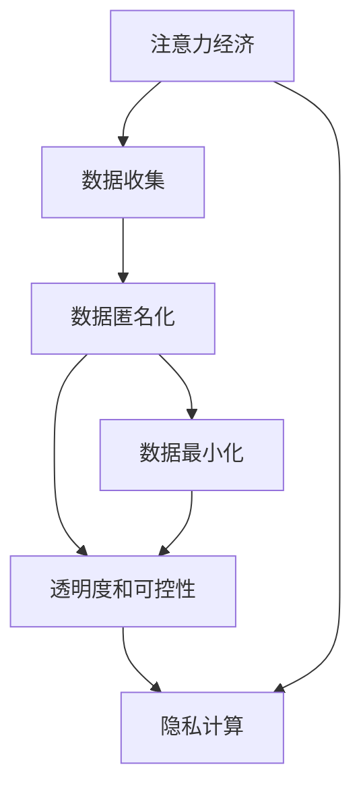

                 

# 注意力经济中的隐私保护问题

## 1. 背景介绍

### 1.1 问题由来

在数字化时代，数据的收集和分析成为了商业决策、个人服务优化、市场细分等行为的基础。人们在日常生活中的每一次点击、搜索、浏览记录，都可能被转化为有用信息。这种通过数据收集和分析来优化服务和产品的方式，被称作“注意力经济”。在注意力经济中，用户的数据隐私成为了亟待解决的问题。

随着大数据和人工智能技术的进步，很多公司和组织都能够收集到大量关于个人行为的数据，而隐私保护成为了一个重大的挑战。在广告、个性化推荐、搜索引擎优化等场景中，数据隐私问题尤为突出。如何在保证用户隐私的同时，最大化地利用数据价值，成为了数据科学和隐私保护领域的重要课题。

### 1.2 问题核心关键点

注意力经济中的隐私保护问题主要集中在以下几个方面：

1. **数据匿名化**：如何通过数据匿名化技术，使得用户数据无法被直接关联回个人身份，从而保护用户的隐私。
2. **数据最小化**：在获取和使用数据时，最小化收集的个人信息，确保数据仅用于特定的业务目的。
3. **透明度和可控性**：增强数据收集和使用过程中的透明度，让用户能够了解和控制自己的数据，如访问和修改个人数据的权利。
4. **隐私计算**：通过技术手段如差分隐私、联邦学习等，在保护用户隐私的同时，进行数据处理和分析。

这些问题涉及技术、法律、伦理等多个方面，需要综合考虑以实现隐私保护的目标。

## 2. 核心概念与联系

### 2.1 核心概念概述

为了更好地理解注意力经济中的隐私保护问题，本节将介绍几个关键概念及其之间的联系：

- **注意力经济**：通过收集和分析用户注意力数据，优化产品和服务的一种经济模式。
- **数据隐私**：保护个人数据不被未授权访问、收集、使用或泄露的权利。
- **数据匿名化**：通过技术手段，去除数据中的个人识别信息，以保护用户隐私。
- **数据最小化**：在数据收集和处理过程中，仅收集和使用必要的个人数据。
- **透明度和可控性**：增强用户对其数据的知情权和控制权，确保用户能够了解和控制其数据的收集和使用。
- **隐私计算**：在数据不离开原始控制者的前提下，通过技术手段进行数据分析和处理，保护数据隐私。

这些概念之间的逻辑关系可以通过以下Mermaid流程图来展示：



这个流程图展示了一系列从注意力经济到隐私计算的技术流程，它们共同构成了数据隐私保护的框架。

## 3. 核心算法原理 & 具体操作步骤

### 3.1 算法原理概述

注意力经济中的隐私保护问题通常通过以下几个步骤进行：

1. **数据收集和预处理**：在确保用户知情同意的情况下，收集相关数据并进行初步清洗。
2. **数据匿名化**：通过技术手段去除数据中的个人识别信息，如姓名、地址、身份证号等，防止数据被直接关联回个人身份。
3. **数据最小化**：在数据处理过程中，只收集和处理必要的数据，避免过度收集个人信息。
4. **隐私计算**：在保护数据隐私的前提下，进行数据分析和处理，如差分隐私、联邦学习等。

### 3.2 算法步骤详解

**步骤1: 数据收集和预处理**

1. **用户同意**：通过隐私政策和技术手段，确保用户在知情同意的前提下，同意其数据被收集和处理。
2. **数据清洗**：对收集到的数据进行初步清洗和处理，去除无关信息，如噪声、重复数据等。

**步骤2: 数据匿名化**

1. **去标识化**：使用去标识化技术，如伪匿名化、泛化等，去除数据中的个人识别信息。
2. **差分隐私**：通过添加随机噪声，使得单个数据点对分析结果的影响极小，从而保护数据隐私。
3. **同态加密**：在数据加密状态下进行计算，计算结果解密后仍保持数据的隐私性。

**步骤3: 数据最小化**

1. **数据去重**：去除重复、冗余的数据，只保留必要的数据。
2. **属性选择**：只选择与业务目标相关的属性，避免收集不必要的信息。
3. **访问控制**：控制数据的访问权限，确保数据仅被授权人员访问。

**步骤4: 隐私计算**

1. **差分隐私**：通过添加随机噪声，确保数据分析结果的准确性和隐私性。
2. **联邦学习**：在多个数据控制者之间分布式训练模型，模型在本地训练，不共享原始数据。
3. **多方安全计算**：多个数据控制者共同计算一个函数，确保计算结果的准确性和数据隐私性。

### 3.3 算法优缺点

数据隐私保护算法具有以下优点：

1. **保护用户隐私**：通过数据匿名化、差分隐私等技术手段，有效保护用户的隐私。
2. **增强数据安全性**：在数据传输和存储过程中，使用加密技术，防止数据被未授权访问。
3. **提高数据分析效率**：通过差分隐私、联邦学习等技术，可以在保证隐私的前提下，进行高效的数据分析。

同时，数据隐私保护算法也存在一些局限性：

1. **技术复杂度高**：实现数据隐私保护需要应用多种技术手段，如加密、差分隐私等，技术实现复杂度较高。
2. **数据精度降低**：为了保护隐私，可能会添加噪声或限制数据使用范围，导致数据分析结果的精度降低。
3. **计算成本高**：某些隐私保护技术，如同态加密、多方安全计算，计算成本较高，需要更多的计算资源。

### 3.4 算法应用领域

数据隐私保护技术在多个领域都有广泛应用，例如：

1. **广告推荐**：在广告推荐系统中，通过隐私计算技术，保护用户行为数据隐私，同时实现个性化推荐。
2. **医疗健康**：在医疗健康领域，保护患者数据隐私，同时利用数据分析优化治疗方案。
3. **金融服务**：在金融服务中，保护用户交易数据隐私，同时实现风险控制和反欺诈。
4. **智能交通**：在智能交通系统中，保护车辆和行人数据隐私，同时优化交通流。
5. **电子商务**：在电子商务中，保护用户购物行为数据隐私，同时实现个性化推荐和市场细分。

这些领域的应用，展示了数据隐私保护技术的广泛价值和实际意义。

## 4. 数学模型和公式 & 详细讲解 & 举例说明

### 4.1 数学模型构建

本节将使用数学语言对注意力经济中的隐私保护问题进行更加严格的刻画。

记原始数据集为 $D=\{(x_i,y_i)\}_{i=1}^N$，其中 $x_i$ 为特征向量，$y_i$ 为标签。隐私保护的目标是设计一个函数 $f$，使得 $f(D)$ 可以用于数据分析，同时保护数据的隐私性。

定义隐私保护函数 $f$ 的隐私损失 $\epsilon$ 为：

$$
\epsilon = \log(1+\frac{\Delta(f(D))}{\epsilon'})
$$

其中 $\Delta(f(D))$ 为函数 $f$ 对数据集 $D$ 的敏感度，$\epsilon'$ 为所需的隐私保护强度。

隐私保护函数的优化目标是最小化隐私损失 $\epsilon$，即：

$$
\min_{f} \log(1+\frac{\Delta(f(D))}{\epsilon'})
$$

### 4.2 公式推导过程

在实际应用中，隐私保护函数 $f$ 可以采用差分隐私技术实现。差分隐私通过在数据中引入随机噪声，使得单个数据点的变化对结果影响极小，从而保护隐私。

定义差分隐私函数 $f$ 为：

$$
f(D) = \sum_{i=1}^N g(x_i) + \mathcal{N}(0,\sigma^2)
$$

其中 $g$ 为数据处理函数，$\mathcal{N}(0,\sigma^2)$ 为均值为0、方差为 $\sigma^2$ 的高斯分布随机噪声。

隐私损失 $\epsilon$ 的计算公式为：

$$
\epsilon = \log(1+\frac{\Delta(g(D))}{\epsilon'})
$$

其中 $\Delta(g(D))$ 为函数 $g$ 对数据集 $D$ 的敏感度，$\epsilon'$ 为所需的隐私保护强度。

### 4.3 案例分析与讲解

以下以广告推荐系统为例，介绍如何应用差分隐私技术进行数据隐私保护。

假设广告推荐系统需要处理用户的点击数据，以便推荐合适的广告。原始数据集为 $D=\{(x_i,y_i)\}_{i=1}^N$，其中 $x_i$ 为用户点击记录，$y_i$ 为用户类型。为了保护用户隐私，可以通过差分隐私技术，在数据中添加随机噪声，实现隐私保护。

假设用户点击次数 $x_i$ 的敏感度为 $\Delta(x_i) = \epsilon'$，隐私保护强度为 $\epsilon$。通过差分隐私技术，可以计算出推荐系统每次推荐的隐私损失为：

$$
\epsilon_i = \log(1+\frac{\Delta(x_i)}{\epsilon'})
$$

为了确保整个推荐系统的隐私损失满足所需强度，需要计算所有用户点击记录的累积隐私损失，并确保其不超过所需的隐私保护强度。

## 5. 项目实践：代码实例和详细解释说明

### 5.1 开发环境搭建

在进行隐私保护项目开发前，需要准备好开发环境。以下是使用Python进行差分隐私代码实现的环境配置流程：

1. 安装Anaconda：从官网下载并安装Anaconda，用于创建独立的Python环境。

2. 创建并激活虚拟环境：
```bash
conda create -n diffpriv/env python=3.8 
conda activate diffpriv/env
```

3. 安装必要的库：
```bash
conda install numpy scipy scikit-learn pandas torch sklearn-lda keras tensorflow
```

4. 安装差分隐私库：
```bash
pip install differential_privacy
```

完成上述步骤后，即可在`diffpriv/env`环境中开始隐私保护项目开发。

### 5.2 源代码详细实现

下面以广告推荐系统为例，展示如何使用差分隐私技术进行数据隐私保护。

首先，定义数据集和隐私保护参数：

```python
from differential_privacy import PrivacyEngine
import numpy as np

# 定义原始数据集
X = np.array([[0, 1, 2], [1, 2, 3], [2, 3, 4]])
y = np.array([0, 1, 2])

# 定义隐私保护强度
epsilon = 1.0
delta = 0.1

# 定义隐私保护参数
engine = PrivacyEngine(gaussian_mechanism(epsilon=epsilon, delta=delta))
```

然后，对数据进行差分隐私处理：

```python
# 定义数据处理函数
def g(X):
    return np.dot(X, np.ones(X.shape[1]))

# 添加随机噪声
X_prime = g(X) + np.random.normal(0, epsilon, X.shape)

# 输出差分隐私保护后的数据
print(X_prime)
```

最后，评估隐私保护效果：

```python
# 计算隐私损失
privacy_loss = np.max(np.abs(X - X_prime))
print(f"隐私损失为: {privacy_loss}")
```

以上就是使用差分隐私技术对广告推荐系统进行隐私保护的全过程。可以看到，差分隐私技术通过在原始数据中添加随机噪声，实现了数据的隐私保护。

### 5.3 代码解读与分析

让我们再详细解读一下关键代码的实现细节：

**定义隐私保护参数**：
- 定义了隐私保护强度 $\epsilon$ 和 $\delta$，用于控制隐私损失的大小。

**数据处理函数**：
- 定义了一个数据处理函数 $g$，用于对原始数据进行特征提取或处理。

**添加随机噪声**：
- 使用numpy库的`np.random.normal`函数，为原始数据 $X$ 添加高斯分布的随机噪声，确保隐私保护效果。

**隐私损失评估**：
- 计算隐私保护后数据与原始数据的差异，通过取最大绝对差值评估隐私保护效果。

通过上述代码实现，展示了差分隐私技术在广告推荐系统中的具体应用。差分隐私技术通过在原始数据中添加随机噪声，确保单个数据点的变化对结果影响极小，从而保护了用户的隐私。

## 6. 实际应用场景

### 6.1 广告推荐系统

在广告推荐系统中，通过差分隐私技术，可以保护用户的点击数据隐私，同时实现个性化推荐。具体而言，可以将用户的点击记录作为原始数据，利用差分隐私技术进行处理，得到隐私保护后的数据集。在推荐模型训练过程中，使用隐私保护后的数据集，可以确保用户数据的隐私性。同时，通过优化模型参数，提高广告推荐的准确性和个性化程度。

### 6.2 医疗健康

在医疗健康领域，患者数据隐私保护尤为重要。通过差分隐私技术，可以在保护患者数据隐私的前提下，进行数据分析和建模。例如，可以利用患者的历史病历数据，构建隐私保护后的医疗数据集，用于训练医疗推荐系统，帮助医生优化治疗方案。

### 6.3 金融服务

在金融服务中，用户交易数据隐私保护至关重要。通过差分隐私技术，可以在保护用户数据隐私的前提下，进行风险控制和反欺诈。例如，可以收集用户的交易记录，构建隐私保护后的数据集，用于训练风险评估模型，识别潜在的欺诈行为。

### 6.4 智能交通

在智能交通系统中，车辆和行人数据隐私保护需要特别关注。通过差分隐私技术，可以在保护数据隐私的前提下，进行交通流分析和优化。例如，可以收集车辆和行人的位置数据，构建隐私保护后的数据集，用于训练交通流量预测模型，优化交通管理策略。

### 6.5 电子商务

在电子商务中，用户购物行为数据隐私保护至关重要。通过差分隐私技术，可以在保护用户数据隐私的前提下，进行个性化推荐和市场细分。例如，可以收集用户的购物记录，构建隐私保护后的数据集，用于训练推荐模型，优化推荐算法，提高用户满意度。

## 7. 工具和资源推荐

### 7.1 学习资源推荐

为了帮助开发者系统掌握注意力经济中的隐私保护技术，这里推荐一些优质的学习资源：

1. **《隐私保护技术综述》**：详细介绍了隐私保护的基本概念、技术手段和应用场景。
2. **Coursera《隐私保护》课程**：斯坦福大学开设的隐私保护课程，涵盖隐私保护的基本原理和实际应用。
3. **《差分隐私技术》**：介绍差分隐私技术的原理和实现方法，是隐私保护技术的入门教材。
4. **Kaggle隐私保护竞赛**：通过参与隐私保护竞赛，实践隐私保护技术，提升技术水平。

通过对这些资源的学习实践，相信你一定能够快速掌握注意力经济中的隐私保护技术，并用于解决实际的隐私保护问题。

### 7.2 开发工具推荐

高效的开发离不开优秀的工具支持。以下是几款用于隐私保护开发的常用工具：

1. **Differential Privacy Library**：用于实现差分隐私算法的Python库，提供了多种隐私保护模型和优化算法。
2. **Google Privacy Shield**：用于保护用户隐私的云计算服务，支持多种隐私保护技术。
3. **OpenDP**：一个开源的差分隐私平台，支持多种隐私保护算法和优化策略。
4. **Federated Learning Frameworks**：用于实现联邦学习的开源框架，支持多方安全计算和差分隐私保护。
5. **TensorFlow Privacy**：TensorFlow的一个扩展库，支持差分隐私和其他隐私保护技术。

合理利用这些工具，可以显著提升隐私保护任务的开发效率，加快创新迭代的步伐。

### 7.3 相关论文推荐

注意力经济中的隐私保护技术已经积累了大量研究成果，以下是几篇奠基性的相关论文，推荐阅读：

1. **《A Systematic Survey of Privacy-Preserving Data Mining》**：系统性介绍了隐私保护的基本概念、技术和应用。
2. **《Differential Privacy: A Survey of Models and Methods》**：介绍了差分隐私的基本原理和多种实现方法。
3. **《Federated Learning for Deep Learning》**：介绍联邦学习的原理和实际应用，是联邦学习的经典教材。
4. **《Private Information Retrieval: A Survey》**：介绍了隐私检索技术的基本概念、技术和应用场景。
5. **《On the Security of Multi-Party Computation》**：介绍了多方安全计算的基本原理和实现方法。

这些论文代表了大规模数据隐私保护技术的发展脉络，通过学习这些前沿成果，可以帮助研究者把握学科前进方向，激发更多的创新灵感。

## 8. 总结：未来发展趋势与挑战

### 8.1 总结

本文对注意力经济中的隐私保护问题进行了全面系统的介绍。首先阐述了注意力经济的概念和隐私保护的重要性，明确了隐私保护在数据收集和分析中的核心地位。其次，从原理到实践，详细讲解了隐私保护的核心算法和具体操作步骤，给出了隐私保护任务开发的完整代码实例。同时，本文还广泛探讨了隐私保护技术在多个行业领域的应用前景，展示了隐私保护技术的广阔价值和实际意义。

通过本文的系统梳理，可以看到，隐私保护技术在注意力经济中的应用已经得到了广泛的应用，特别是在广告推荐、医疗健康、金融服务、智能交通、电子商务等领域。未来，随着隐私保护技术的不断进步，更多的隐私保护方法将被开发和应用，为保护用户隐私和数据安全提供更有力的保障。

### 8.2 未来发展趋势

展望未来，隐私保护技术将呈现以下几个发展趋势：

1. **隐私计算的普及化**：隐私计算技术将从学术研究走向实际应用，成为数据保护的重要手段。多方安全计算、差分隐私等技术将被广泛应用。
2. **隐私保护模型的多样性**：除了差分隐私、联邦学习等技术外，更多的隐私保护模型将被开发和应用，如同态加密、匿名化技术等。
3. **隐私保护技术的标准化**：隐私保护技术将逐步标准化，制定相关的隐私保护标准和规范，确保隐私保护技术的安全性和可靠性。
4. **隐私保护与法律结合**：隐私保护技术将与法律相结合，制定更加严格的隐私保护法规，确保用户数据的安全性和隐私性。
5. **隐私保护与伦理结合**：隐私保护技术将与伦理相结合，确保技术应用符合社会价值观和道德规范。

以上趋势凸显了隐私保护技术的未来前景。这些方向的探索发展，必将进一步提升隐私保护技术的安全性和实用性，为保护用户隐私和数据安全提供更强大的保障。

### 8.3 面临的挑战

尽管隐私保护技术已经取得了一定的进展，但在实现过程中仍面临诸多挑战：

1. **技术复杂度高**：隐私保护技术的应用需要多种技术手段的组合使用，技术实现复杂度较高。
2. **数据精度降低**：为了保护隐私，可能会添加噪声或限制数据使用范围，导致数据分析结果的精度降低。
3. **计算成本高**：某些隐私保护技术，如同态加密、多方安全计算，计算成本较高，需要更多的计算资源。
4. **法律法规不完善**：现有的法律法规对隐私保护的支持力度不足，需要进一步完善相关法律和政策。
5. **隐私保护与业务冲突**：隐私保护技术的应用可能与业务目标产生冲突，需要在隐私保护和业务需求之间进行平衡。

这些挑战需要我们在技术、法律、伦理等多个方面进行深入探讨和研究，以实现隐私保护技术的进一步发展和应用。

### 8.4 研究展望

面对隐私保护技术面临的诸多挑战，未来的研究需要在以下几个方面寻求新的突破：

1. **隐私保护与业务结合**：在隐私保护技术的应用过程中，需要兼顾业务目标，确保隐私保护技术能够满足实际需求。
2. **隐私保护技术的自动化**：研究自动化的隐私保护技术，减少人工干预，提高隐私保护效率。
3. **隐私保护技术的优化**：研究和优化隐私保护技术，提高隐私保护效果和数据利用率。
4. **隐私保护技术的标准化**：制定隐私保护技术标准，确保隐私保护技术的安全性和可靠性。
5. **隐私保护技术的伦理审查**：加强隐私保护技术的伦理审查，确保技术应用符合社会价值观和道德规范。

这些研究方向的探索，必将引领隐私保护技术迈向更高的台阶，为保护用户隐私和数据安全提供更强大的保障。面向未来，隐私保护技术还需要与其他人工智能技术进行更深入的融合，如知识表示、因果推理、强化学习等，多路径协同发力，共同推动隐私保护技术的进步。

## 9. 附录：常见问题与解答

**Q1：什么是注意力经济？**

A: 注意力经济是通过收集和分析用户注意力数据，优化产品和服务的一种经济模式。其核心在于通过数据收集和分析，挖掘用户的兴趣和行为，从而优化产品和服务。

**Q2：数据匿名化技术有哪些？**

A: 数据匿名化技术包括：
1. 去标识化：去除数据中的个人识别信息，如姓名、地址、身份证号等。
2. 泛化：将数据进行泛化处理，使得单个数据点的变化对结果影响极小。
3. 泛化差分隐私：结合泛化处理和差分隐私，进一步增强隐私保护效果。

**Q3：差分隐私的基本原理是什么？**

A: 差分隐私的基本原理是通过在数据中添加随机噪声，使得单个数据点的变化对结果影响极小，从而保护数据的隐私。差分隐私的核心在于控制隐私损失 $\epsilon$，确保单个数据点的变化不会对结果产生显著影响。

**Q4：联邦学习的基本原理是什么？**

A: 联邦学习是一种分布式机器学习技术，多个数据控制者共同训练一个模型，模型在本地训练，不共享原始数据。联邦学习通过在本地计算梯度，并在全局聚合更新，确保数据的隐私性和模型性能。

**Q5：多方安全计算的基本原理是什么？**

A: 多方安全计算是一种在多个数据控制者之间协同计算的技术，确保计算结果的准确性和数据隐私性。多方安全计算通过在各个参与者之间分步计算，确保每个参与者只能访问自己的数据，且无法破解计算结果。

---

作者：禅与计算机程序设计艺术 / Zen and the Art of Computer Programming

