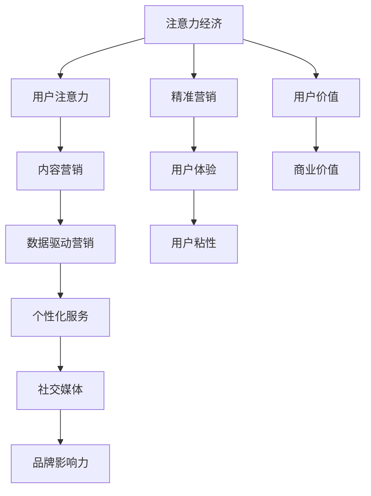

                 

## 1. 背景介绍

### 1.1 问题由来
注意力经济（Attention Economy）是伴随互联网和数字媒体的兴起而产生的经济现象。在传统经济中，商品和服务的价值主要依赖于物理形式的存在。而数字时代，信息过载的问题促使经济形态发生了深刻变化，注意力成为了稀缺资源。

### 1.2 问题核心关键点
注意力经济的本质在于，如何在海量的信息中吸引和保持用户的注意力，从而实现商业价值。在互联网和数字媒体领域，企业通过创意和内容吸引用户，将用户的注意力转化为消费行为，达到商业目的。

### 1.3 问题研究意义
研究注意力经济及其如何重塑商业模式，对于理解数字时代经济结构变化、指导企业战略制定、探索新商业模式的创新路径具有重要意义。

1. **经济结构重塑**：随着互联网普及，注意力成为新的经济资源，经济结构从以物质生产为主转向以信息服务为主。
2. **战略指导**：了解注意力经济的特点和规律，有助于企业制定以用户为中心的战略，提升品牌影响力和市场竞争力。
3. **商业模式创新**：探索新的商业模式，如内容营销、数据驱动营销、用户生成内容等，推动经济发展。

## 2. 核心概念与联系

### 2.1 核心概念概述

为更好地理解注意力经济如何重塑商业模式，本节将介绍几个密切相关的核心概念：

- **注意力经济（Attention Economy）**：以吸引和保持用户注意力为目标的经济活动。在数字媒体时代，信息过载使得注意力成为稀缺资源，企业通过创意和内容争夺用户注意力，进而创造商业价值。

- **用户注意力（User Attention）**：用户在消费信息时所投入的认知资源。用户注意力是企业在数字媒体时代获取商业价值的根本，是进行精准营销和个性化服务的基础。

- **内容营销（Content Marketing）**：通过优质内容吸引用户，提升品牌影响力和用户粘性。内容营销成为企业与用户建立联系的重要手段。

- **数据驱动营销（Data-Driven Marketing）**：利用大数据技术分析用户行为和兴趣，指导营销策略的制定和实施。数据驱动营销使营销活动更加精准高效。

- **个性化服务（Personalized Services）**：基于用户行为和偏好提供定制化服务，提升用户满意度和忠诚度。个性化服务已成为互联网企业的重要竞争优势。

- **社交媒体（Social Media）**：通过社交平台促进用户互动和分享，扩大品牌影响力。社交媒体成为内容营销和品牌传播的重要渠道。

这些核心概念之间的逻辑关系可以通过以下Mermaid流程图来展示：



这个流程图展示出注意力经济的核心概念及其之间的关系：注意力经济通过用户注意力的吸引和保持，实现内容营销、数据驱动营销和个性化服务，最终提升品牌影响力和用户粘性，创造商业价值。

## 3. 核心算法原理 & 具体操作步骤
### 3.1 算法原理概述

注意力经济的重塑主要通过以下几个关键步骤实现：

1. **注意力获取**：通过创意和内容吸引用户注意力，使注意力从海量信息中集中到特定品牌和产品上。
2. **注意力保持**：利用大数据和算法优化用户体验，增加用户对品牌的忠诚度和粘性。
3. **注意力转化**：将用户注意力转化为消费行为，实现商业价值的最大化。

### 3.2 算法步骤详解

#### 3.2.1 注意力获取

注意力获取的核心在于创意和内容的创新。创意包括独特的视觉设计、创新的广告形式、吸引人的故事叙述等。内容则包括优质的文章、视频、图片、音乐等，能够引发用户的兴趣和共鸣。

具体实现步骤：

1. **创意设计**：聘请创意团队进行品牌标识、广告文案、视频剪辑等设计，打造独特的品牌形象。
2. **内容制作**：投入资源制作高质量的内容，如深度文章、精剪视频、精美图片等。
3. **多渠道发布**：通过社交媒体、搜索引擎、内容聚合平台等多渠道发布内容，扩大受众范围。

#### 3.2.2 注意力保持

注意力保持的关键在于提升用户体验和个性化服务。通过大数据分析，企业可以了解用户偏好和行为，从而提供定制化的服务，增强用户粘性。

具体实现步骤：

1. **用户行为分析**：利用大数据技术，分析用户在平台上的行为数据，如浏览历史、搜索习惯、互动记录等。
2. **个性化推荐**：根据用户行为，使用推荐算法向用户推荐相关内容和产品，增加用户停留时间。
3. **用户互动**：通过社交媒体互动、问卷调查等方式，收集用户反馈，优化内容和体验。

#### 3.2.3 注意力转化

注意力转化为消费行为是注意力经济的核心目标。通过精准营销和高效转化策略，将用户注意力转化为实际购买。

具体实现步骤：

1. **精准营销**：利用大数据和算法分析用户需求和行为，进行精准营销，提高转化率。
2. **优惠券和促销**：提供优惠活动和促销活动，吸引用户进行购买。
3. **购买引导**：通过购物车提示、一键购买等功能，简化用户购买流程。

### 3.3 算法优缺点

注意力经济的优点：

1. **高效精准**：通过大数据和算法，实现精准营销，提升转化率。
2. **用户粘性高**：通过个性化服务和互动，增加用户粘性，提高用户复购率。
3. **成本效益高**：相比传统营销，注意力经济通过创意和内容吸引用户，成本较低。

缺点：

1. **内容质量依赖**：创意和内容是注意力获取的基础，高质量内容的制作成本高。
2. **数据隐私问题**：用户数据隐私保护问题突出，需要制定严格的数据隐私政策。
3. **用户疲劳**：大量创意和内容可能会引发用户疲劳，导致注意力流失。

### 3.4 算法应用领域

注意力经济在多个领域得到了广泛应用，包括但不限于：

- **数字媒体**：如视频网站、新闻网站、社交媒体等，通过创意和内容吸引用户，实现商业价值。
- **电子商务**：如电商平台、在线购物应用等，通过个性化推荐和精准营销，提升用户转化率。
- **旅游和旅游服务**：如旅游网站、旅游应用等，通过创意和内容展示目的地特色，吸引用户预订旅游。
- **金融服务**：如在线理财、投资应用等，通过内容营销和个性化推荐，吸引用户关注和投资。
- **健康和医疗**：如健康管理应用、在线医疗咨询等，通过创意和内容教育用户，提升用户健康意识和医疗服务体验。

## 4. 数学模型和公式 & 详细讲解 & 举例说明

### 4.1 数学模型构建

在注意力经济中，用户注意力可以被建模为一个复杂的概率分布，即用户对于不同内容的兴趣程度。模型构建如下：

1. **用户兴趣建模**：假设用户对内容的兴趣可以用向量 $u$ 表示，其中 $u_i$ 表示用户对第 $i$ 个内容的兴趣程度。
2. **内容特征建模**：假设每个内容可以用向量 $c$ 表示，其中 $c_i$ 表示第 $i$ 个内容的特征值。
3. **兴趣匹配模型**：假设用户兴趣和内容特征之间的匹配可以用线性回归模型 $w \cdot u + b$ 表示，其中 $w$ 和 $b$ 为模型参数。

### 4.2 公式推导过程

通过上述模型，我们可以推导出用户对内容的兴趣概率：

$$
P(y|u,c) = \frac{e^{w \cdot u + b}}{\sum_{j=1}^{n} e^{w \cdot u + b}}
$$

其中 $n$ 为内容的总数。根据最大似然估计，我们可以使用梯度下降法优化模型参数 $w$ 和 $b$：

$$
w \leftarrow w - \eta \frac{\partial \mathcal{L}(w)}{\partial w}, b \leftarrow b - \eta \frac{\partial \mathcal{L}(b)}{\partial b}
$$

其中 $\eta$ 为学习率，$\mathcal{L}$ 为损失函数。常用的损失函数包括交叉熵损失函数和均方误差损失函数。

### 4.3 案例分析与讲解

以电商平台为例，分析用户注意力如何转化为消费行为。

假设电商平台有 $n=1000$ 种商品，每个商品可以用向量 $c_i$ 表示其特征，如价格、评分、描述等。用户 $u$ 对每个商品的兴趣可以用向量 $u$ 表示，其中 $u_i$ 表示用户对第 $i$ 个商品的兴趣程度。

电商平台的推荐算法可以使用上述模型，首先计算用户对每个商品的兴趣概率 $P(y|u,c)$，然后根据这些概率进行个性化推荐，最终将推荐商品展示给用户，并进行购买引导和优惠券发放，实现转化。

## 5. 项目实践：代码实例和详细解释说明
### 5.1 开发环境搭建

在进行注意力经济实践前，我们需要准备好开发环境。以下是使用Python进行Scikit-learn开发的推荐系统的环境配置流程：

1. 安装Anaconda：从官网下载并安装Anaconda，用于创建独立的Python环境。

2. 创建并激活虚拟环境：
```bash
conda create -n attention-env python=3.8 
conda activate attention-env
```

3. 安装Scikit-learn：
```bash
conda install scikit-learn
```

4. 安装必要的第三方库：
```bash
pip install numpy pandas torch torchvision
```

5. 配置开发环境：
```bash
# 设置Python路径
export PYTHONPATH=$PYTHONPATH:/path/to/python/lib/site-packages
```

完成上述步骤后，即可在`attention-env`环境中开始推荐系统的开发实践。

### 5.2 源代码详细实现

以下是使用Scikit-learn构建推荐系统的完整代码实现：

```python
import pandas as pd
import numpy as np
from sklearn.model_selection import train_test_split
from sklearn.linear_model import LogisticRegression
from sklearn.metrics import mean_squared_error
from sklearn.metrics import accuracy_score
from sklearn.preprocessing import StandardScaler

# 读取数据
data = pd.read_csv('data.csv')

# 数据预处理
features = data[['price', 'rating', 'description']]
target = data['clicked']

# 标准化处理
scaler = StandardScaler()
features_scaled = scaler.fit_transform(features)

# 划分数据集
X_train, X_test, y_train, y_test = train_test_split(features_scaled, target, test_size=0.2, random_state=42)

# 构建模型
model = LogisticRegression(solver='lbfgs', max_iter=1000)
model.fit(X_train, y_train)

# 预测和评估
y_pred = model.predict(X_test)
mse = mean_squared_error(y_test, y_pred)
acc = accuracy_score(y_test, y_pred)

print(f"Mean Squared Error: {mse}")
print(f"Accuracy: {acc}")
```

### 5.3 代码解读与分析

让我们再详细解读一下关键代码的实现细节：

**数据读取与预处理**：
- `pd.read_csv('data.csv')`：从CSV文件中读取数据。
- `features = data[['price', 'rating', 'description']]`：选择特征变量，即商品的价格、评分和描述。
- `target = data['clicked']`：选择目标变量，即用户是否点击了该商品。
- `scaler = StandardScaler()`：创建标准化处理对象。
- `features_scaled = scaler.fit_transform(features)`：对特征变量进行标准化处理，以便后续模型训练。

**模型构建与训练**：
- `model = LogisticRegression(solver='lbfgs', max_iter=1000)`：构建逻辑回归模型，并设置求解器和迭代次数。
- `model.fit(X_train, y_train)`：在训练集上训练模型。

**预测与评估**：
- `y_pred = model.predict(X_test)`：在测试集上进行预测。
- `mse = mean_squared_error(y_test, y_pred)`：计算均方误差。
- `acc = accuracy_score(y_test, y_pred)`：计算准确率。
- `print(f"Mean Squared Error: {mse}")`：打印均方误差。
- `print(f"Accuracy: {acc}")`：打印准确率。

在上述代码中，我们首先读取数据并进行预处理，然后构建逻辑回归模型并训练。最后进行预测和评估，输出均方误差和准确率。这只是一个简单的例子，实际的推荐系统可能需要更复杂的模型和更精细的参数调优。

## 6. 实际应用场景
### 6.1 社交媒体

社交媒体平台通过内容吸引用户，利用用户数据和算法优化用户体验，实现广告和产品推广。例如，Facebook通过推荐算法展示个性化广告，Twitter通过话题标签和用户互动提升用户粘性。

### 6.2 电子商务

电商平台通过推荐算法和精准营销，提高用户转化率。如Amazon利用协同过滤算法推荐商品，京东通过内容推荐提升用户体验。

### 6.3 旅游服务

旅游网站和应用通过创意和内容展示目的地特色，吸引用户预订旅游。如TripAdvisor通过用户评价和图片吸引游客，携程网通过个性化推荐提升预订转化率。

### 6.4 金融服务

金融服务通过内容营销和个性化推荐，吸引用户关注和投资。如支付宝通过红包活动和产品推荐吸引用户，招商银行通过理财资讯和投顾服务提升用户体验。

### 6.5 健康和医疗

健康和医疗应用通过创意和内容教育用户，提升用户健康意识和医疗服务体验。如Keep通过健身视频和训练计划吸引用户，丁香园通过健康资讯和在线咨询提升用户健康水平。

## 7. 工具和资源推荐
### 7.1 学习资源推荐

为了帮助开发者系统掌握注意力经济及其重塑商业模式的方法，这里推荐一些优质的学习资源：

1. 《Attention is All You Need》：Transformer论文，介绍了注意力机制在深度学习中的重要性和应用。
2. 《Deep Learning for NLP》：斯坦福大学开设的NLP课程，涵盖自然语言处理的基本概念和前沿技术。
3. 《Reinforcement Learning for Recommendation Systems》：推荐系统领域的经典教材，介绍强化学习在推荐系统中的应用。
4. 《Personalized Recommendation Algorithms》：推荐系统领域的权威书籍，涵盖推荐算法、数据挖掘和用户体验设计。
5. 《Data-Driven Marketing》：数据驱动营销的入门书籍，介绍大数据技术在市场营销中的应用。

通过对这些资源的学习实践，相信你一定能够快速掌握注意力经济的精髓，并用于解决实际的商业问题。

### 7.2 开发工具推荐

高效的开发离不开优秀的工具支持。以下是几款用于注意力经济开发的常用工具：

1. Scikit-learn：Python的机器学习库，提供丰富的机器学习算法和工具。
2. TensorFlow：谷歌主导的开源机器学习框架，支持分布式计算和深度学习模型训练。
3. PyTorch：Facebook开源的深度学习框架，灵活动态的计算图，适合快速迭代研究。
4. Jupyter Notebook：交互式编程环境，支持Python、R等多种语言。
5. Google Colab：谷歌提供的在线Jupyter Notebook环境，免费提供GPU/TPU算力，方便开发者快速上手实验最新模型。

合理利用这些工具，可以显著提升注意力经济的开发效率，加快创新迭代的步伐。

### 7.3 相关论文推荐

注意力经济的研究源于学界的持续研究。以下是几篇奠基性的相关论文，推荐阅读：

1. Attention is All You Need：提出Transformer结构，开启了注意力机制在深度学习中的应用。
2. Deep Learning for NLP：介绍自然语言处理的基本概念和前沿技术，涵盖文本分类、序列建模、语言生成等。
3. Reinforcement Learning for Recommendation Systems：介绍强化学习在推荐系统中的应用，如Q-learning、深度强化学习等。
4. Personalized Recommendation Algorithms：涵盖推荐算法的理论基础和实际应用，包括协同过滤、基于内容的推荐、混合推荐等。
5. Data-Driven Marketing：介绍大数据技术在市场营销中的应用，如数据挖掘、用户行为分析、精准营销等。

这些论文代表了大数据和深度学习在注意力经济中的应用，通过学习这些前沿成果，可以帮助研究者把握学科前进方向，激发更多的创新灵感。

## 8. 总结：未来发展趋势与挑战

### 8.1 总结

本文对注意力经济及其如何重塑商业模式进行了全面系统的介绍。首先阐述了注意力经济的本质和重要性，明确了其与用户注意力、内容营销、数据驱动营销等核心概念的联系。其次，从原理到实践，详细讲解了注意力经济的技术实现过程，给出了推荐系统的代码实现。最后，探讨了注意力经济在实际应用中的多个场景，展示其广泛的应用前景。

通过本文的系统梳理，可以看到，注意力经济通过创意和内容吸引用户，通过大数据和算法保持用户注意力，最终实现商业价值的最大化。其核心在于创意和内容的质量，以及算法的优化。未来，随着技术的不断进步，注意力经济将进一步扩展应用范围，为各行业的数字化转型带来更多创新和机遇。

### 8.2 未来发展趋势

展望未来，注意力经济将呈现以下几个发展趋势：

1. **智能化提升**：随着人工智能和机器学习技术的发展，推荐算法将变得更加智能，能够实现更精准的个性化推荐。
2. **数据驱动优化**：大数据和人工智能的结合，将使广告和营销策略更加数据驱动，能够更高效地吸引和保持用户注意力。
3. **跨平台集成**：不同平台之间的用户数据互通将变得更加普遍，从而实现更完整的用户画像和跨平台推荐。
4. **用户体验优化**：个性化服务和用户体验的优化，将使注意力经济更加贴近用户需求，提升用户满意度和粘性。
5. **多模态融合**：视频、音频、图像等多模态数据的融合，将使注意力经济更加丰富多样，提升用户体验。

以上趋势凸显了注意力经济的广阔前景。这些方向的探索发展，必将进一步提升注意力经济的商业价值，为各行业的数字化转型带来新的机遇。

### 8.3 面临的挑战

尽管注意力经济已经取得了显著成果，但在迈向更加智能化和普及化的过程中，仍然面临诸多挑战：

1. **数据隐私和安全**：用户数据的隐私和安全问题突出，需要制定严格的数据隐私保护政策。
2. **算法公平性**：推荐算法可能存在偏差，导致部分用户被忽视，需要改进算法以确保公平性。
3. **用户疲劳**：大量创意和内容可能会引发用户疲劳，需要优化算法以提高用户粘性。
4. **成本和资源**：高质量内容的制作和算法优化需要大量资源投入，成本较高。
5. **多平台整合**：不同平台之间的用户数据互通和算法协作，仍然存在技术和标准上的障碍。

解决这些挑战，需要研究者、开发者和政策制定者的共同努力，推动注意力经济的持续发展和健康成长。

### 8.4 研究展望

面向未来，需要从以下几个方面进行深入研究：

1. **多模态推荐**：融合视频、音频、图像等多模态数据，提升推荐系统的丰富度和精准度。
2. **算法公平性**：研究并改进推荐算法，确保公平性，减少算法偏见。
3. **隐私保护**：开发隐私保护技术，确保用户数据的安全和隐私。
4. **成本优化**：探索低成本的创意和内容生产方法，降低高质量内容的制作成本。
5. **跨平台协作**：推动不同平台之间的数据互通和算法协作，实现多平台协同推荐。

这些研究方向将推动注意力经济的不断进步，为各行业的数字化转型带来更多创新和机遇。

## 9. 附录：常见问题与解答

**Q1：注意力经济是否适用于所有行业？**

A: 注意力经济适用于多种行业，包括数字媒体、电子商务、旅游、金融、健康和医疗等。不同行业的特点和需求不同，需要根据具体情况进行优化和调整。

**Q2：如何提高注意力经济的效果？**

A: 提高注意力经济的效果需要从多个方面入手：

1. **创意和内容质量**：高质量的创意和内容是吸引用户注意力的基础。
2. **个性化推荐**：利用大数据和算法进行个性化推荐，提升用户体验。
3. **用户互动**：通过社交媒体互动、问卷调查等方式，收集用户反馈，优化推荐和服务。
4. **算法优化**：不断优化推荐算法，提高推荐效果和用户满意度。

**Q3：注意力经济是否会引发用户疲劳？**

A: 大量创意和内容可能会引发用户疲劳，导致注意力流失。可以通过优化算法和内容，增加用户互动和反馈，减少用户疲劳。

**Q4：注意力经济如何避免数据隐私问题？**

A: 避免数据隐私问题需要制定严格的数据隐私保护政策，如数据匿名化、数据去标识化等。同时，采用加密技术和访问控制策略，确保用户数据的安全和隐私。

**Q5：注意力经济是否适用于小微企业和初创公司？**

A: 注意力经济对小微企业和初创公司同样适用，可以通过创意和内容吸引用户，利用大数据和算法提升用户体验。初创公司可以通过精准营销和个性化服务，提升品牌影响力和市场竞争力。

总之，注意力经济是数字时代的重要商业模式，通过创意和内容吸引用户，通过大数据和算法保持用户注意力，最终实现商业价值的最大化。随着技术的不断进步和应用的广泛推广，未来注意力经济必将在各行业带来更多创新和机遇。

