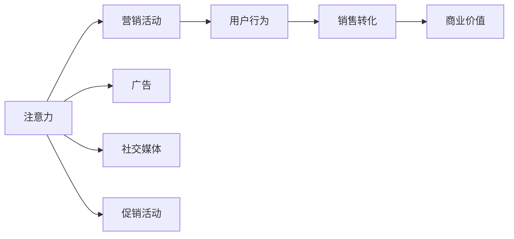

                 

# 注意力经济对传统节日营销的影响

## 1. 背景介绍

### 1.1 问题由来
随着数字化时代的到来，经济模式发生了根本性变化。原本以实体销售和传统媒体为核心的旧经济模式逐渐向以网络流量、数据和注意力为核心的新经济模式转型。尤其是在传统节日期间，商家利用线上平台进行营销活动，以吸引更多的消费者注意并提高销售转化率。本文旨在探讨注意力经济在传统节日营销中的应用及其影响。

### 1.2 问题核心关键点
注意力经济的核心在于如何通过控制和利用消费者的注意力，从而创造商业价值。在传统节日营销中，商家通过各种形式的广告、促销活动以及社交媒体营销吸引消费者的注意力，从而实现产品销售的增加。本文将聚焦于注意力经济在传统节日营销中的作用机制、具体应用策略以及对市场的影响。

### 1.3 问题研究意义
探讨注意力经济在传统节日营销中的影响，对于理解现代商业模式的转变、优化节日营销策略、提升消费者体验以及推动相关产业的发展具有重要意义。本文将从理论和实践两个角度出发，全面分析注意力经济在节日营销中的应用，为相关从业者提供有价值的参考。

## 2. 核心概念与联系

### 2.1 核心概念概述
- **注意力经济**：以注意力为核心的经济模式，通过吸引和控制消费者的注意力，实现商业价值最大化。
- **传统节日**：指在特定历史和文化背景下形成的、具有广泛认可和庆祝习俗的节日，如春节、中秋节等。
- **营销**：指利用各种手段和渠道，向目标消费者传递产品信息，以实现销售和品牌传播的活动。
- **用户行为分析**：通过数据分析和挖掘技术，理解消费者行为模式和偏好，从而优化营销策略。

### 2.2 核心概念原理和架构的 Mermaid 流程图



该流程图展示了注意力经济在传统节日营销中的核心流程：通过广告、社交媒体、促销活动等手段吸引消费者注意力，进而驱动用户行为，最终实现销售转化和商业价值的增加。

## 3. 核心算法原理 & 具体操作步骤
### 3.1 算法原理概述
注意力经济在传统节日营销中的应用主要基于以下几个算法原理：

1. **用户行为分析算法**：通过分析用户在线行为数据（如浏览、点击、购买等），预测用户需求和偏好，指导营销策略的制定。
2. **推荐系统算法**：利用用户行为数据和产品属性信息，向用户推荐最符合其兴趣和需求的节日商品。
3. **情感分析算法**：分析用户在社交媒体上的评论和反馈，了解其对节日活动的情感倾向，优化营销内容和形式。
4. **广告投放算法**：利用大数据分析，精准定位目标用户群体，实现广告的有效投放。

### 3.2 算法步骤详解
#### 3.2.1 用户行为分析
1. **数据收集**：从电商、社交媒体、移动应用等平台收集用户行为数据。
2. **数据清洗与预处理**：去除噪声数据，处理缺失值和异常值，确保数据质量。
3. **特征提取**：从用户行为数据中提取有意义的特征，如浏览时长、点击频率、购买行为等。
4. **模型训练与预测**：利用机器学习模型（如协同过滤、深度学习等）对用户行为进行分析，预测其未来行为。

#### 3.2.2 推荐系统
1. **用户画像构建**：根据用户行为数据构建用户画像，描述其兴趣和需求。
2. **商品相似度计算**：利用向量空间模型或深度学习模型计算商品之间的相似度。
3. **推荐生成**：根据用户画像和商品相似度，生成推荐列表。
4. **效果评估**：通过A/B测试等方法评估推荐系统的效果，不断优化模型。

#### 3.2.3 情感分析
1. **数据收集**：从社交媒体、论坛、评论等渠道收集用户反馈数据。
2. **情感分类**：利用自然语言处理技术对用户评论进行情感分类，分为正面、负面和中性。
3. **情感强度分析**：计算情感分类的强度，理解用户情感的强烈程度。
4. **情感反馈应用**：根据情感分析结果，调整营销策略，优化营销内容。

#### 3.2.4 广告投放
1. **目标群体定位**：利用大数据分析，确定潜在的目标用户群体。
2. **广告创意生成**：根据目标群体特征，设计有吸引力的广告创意。
3. **广告投放策略**：根据广告预算和目标群体的特征，制定广告投放策略。
4. **效果监测与优化**：监测广告投放效果，分析用户点击、转化等数据，优化广告策略。

### 3.3 算法优缺点
#### 3.3.1 优点
1. **精准定位**：通过大数据分析，可以精准定位目标用户，提高广告投放的效率和效果。
2. **个性化推荐**：利用推荐系统算法，提供个性化的节日商品推荐，提升用户满意度和购买意愿。
3. **实时反馈**：情感分析和用户行为分析可以实时反馈用户对营销活动的反应，快速调整策略。

#### 3.3.2 缺点
1. **数据隐私问题**：收集和分析用户行为数据需要处理大量个人隐私信息，存在隐私泄露的风险。
2. **算法偏见**：推荐系统和情感分析算法可能存在算法偏见，导致对某些群体的歧视或不公平。
3. **资源消耗高**：大规模的数据分析和模型训练需要高性能计算资源，成本较高。

### 3.4 算法应用领域
注意力经济在传统节日营销中的应用广泛，涉及以下领域：

1. **电商**：通过广告投放和推荐系统，提升电商平台的销售额和用户留存率。
2. **旅游**：利用用户行为分析，为旅游目的地推广提供个性化营销策略。
3. **餐饮**：通过社交媒体和广告，增加餐厅和餐饮品牌的知名度和吸引力。
4. **娱乐**：为电影、音乐和游戏等娱乐产品进行精准营销，提高产品曝光率。

## 4. 数学模型和公式 & 详细讲解 & 举例说明
### 4.1 数学模型构建

注意力经济在传统节日营销中的应用涉及多个数学模型。以下是几个核心模型的简要构建：

1. **用户行为模型**：
   $$
   P(X|U) = \frac{P(X|U,S)}{P(S|U)}
   $$
   其中，$P(X|U)$表示用户$U$做出行为$X$的概率，$S$表示用户的历史行为数据，$P(S|U)$表示用户历史行为数据的概率。

2. **推荐系统模型**：
   $$
   \text{Recommendation} = \arg\max_{X} P(X|U, S)
   $$
   其中，$P(X|U, S)$表示在用户$U$和历史行为数据$S$的条件下，推荐产品$X$的概率。

3. **情感分析模型**：
   $$
   P(Y|X) = \frac{P(Y|X, C)}{P(C|X)}
   $$
   其中，$P(Y|X)$表示用户对产品$X$的情感$Y$的概率，$C$表示情感分类模型，$P(C|X)$表示情感分类模型的概率。

### 4.2 公式推导过程
#### 4.2.1 用户行为模型
$$
\begin{aligned}
P(X|U) &= \frac{P(X|U,S)}{P(S|U)} \\
&= \frac{P(X|U,S)P(S|U)}{P(X|U,S)P(S|U)} \\
&= \frac{P(X,S|U)}{P(S|U)} \\
&= \frac{P(X|U)P(S|U)}{P(S|U)} \\
&= P(X|U)
\end{aligned}
$$
该公式表示在用户$U$的条件下，用户做出行为$X$的概率。

#### 4.2.2 推荐系统模型
$$
\begin{aligned}
\text{Recommendation} &= \arg\max_{X} P(X|U, S) \\
&= \arg\max_{X} \frac{P(X|U,S)P(S|U)}{P(S|U)} \\
&= \arg\max_{X} P(X|U,S) \\
&= \arg\max_{X} P(X|U) \\
&= \text{Recommendation}
\end{aligned}
$$
该公式表示在用户$U$和历史行为数据$S$的条件下，推荐产品$X$的概率。

#### 4.2.3 情感分析模型
$$
\begin{aligned}
P(Y|X) &= \frac{P(Y|X, C)}{P(C|X)} \\
&= \frac{P(Y|X, C)P(C|X)}{P(Y|X, C)P(C|X)} \\
&= \frac{P(Y|X)}{P(C|X)} \\
&= \text{情感分析结果}
\end{aligned}
$$
该公式表示在产品$X$的条件下，用户情感$Y$的概率。

### 4.3 案例分析与讲解
#### 4.3.1 电商平台
电商平台利用用户行为数据，构建用户画像，生成推荐列表，通过广告投放精准触达用户。具体步骤如下：
1. **数据收集**：收集用户浏览、点击、购买等行为数据。
2. **用户画像构建**：利用聚类算法对用户行为数据进行分组，构建用户画像。
3. **推荐系统生成**：根据用户画像和商品相似度计算，生成推荐列表。
4. **广告投放**：利用用户画像和行为数据，实现精准的广告投放。
5. **效果评估**：通过A/B测试等方法评估推荐和广告投放效果，优化模型。

#### 4.3.2 旅游目的地推广
旅游目的地利用用户行为数据，构建用户画像，生成推荐列表，通过社交媒体和广告推广。具体步骤如下：
1. **数据收集**：收集用户在线旅游搜索、预订等行为数据。
2. **用户画像构建**：利用聚类算法对用户行为数据进行分组，构建用户画像。
3. **推荐系统生成**：根据用户画像和目的地属性信息，生成推荐列表。
4. **社交媒体和广告推广**：利用用户画像和行为数据，在社交媒体和广告平台上推广旅游目的地。
5. **效果评估**：通过网站流量、预订量等指标评估推广效果，优化推荐和广告策略。

## 5. 项目实践：代码实例和详细解释说明
### 5.1 开发环境搭建

为方便开发者进行注意力经济在传统节日营销中的应用实践，以下是开发环境搭建步骤：

1. **安装Python环境**：使用Anaconda创建虚拟环境，安装Python 3.7及以上版本。
2. **安装相关库**：安装NumPy、Pandas、Scikit-learn、TensorFlow、PyTorch等常用库。
3. **数据准备**：准备用户行为数据、情感分类数据和广告投放数据，确保数据格式一致。

### 5.2 源代码详细实现

以下是一个简单的电商平台用户行为分析和推荐系统示例代码：

```python
import numpy as np
import pandas as pd
from sklearn.cluster import KMeans
from sklearn.metrics.pairwise import cosine_similarity

# 用户行为数据
data = pd.read_csv('user_behavior.csv')

# 构建用户画像
def build_user_profile(data):
    # 提取用户行为特征
    features = data[['click_rate', 'purchase_frequency', 'time_on_page']]
    # 使用KMeans进行聚类
    kmeans = KMeans(n_clusters=5, random_state=0)
    kmeans.fit(features)
    # 获取用户画像标签
    labels = kmeans.labels_
    return labels

# 推荐系统
def recommend_system(data, user_labels, item_features):
    # 构建用户画像-物品相似度矩阵
    similarity_matrix = cosine_similarity(item_features, item_features)
    # 计算物品推荐列表
    recommendations = []
    for user_idx in range(len(user_labels)):
        user_profile = item_features[user_idx, :]
        # 计算相似度
        user_similarity = np.dot(similarity_matrix[user_idx, :], user_profile)
        # 排序获取推荐列表
        recommended_items = np.argsort(user_similarity)[::-1]
        recommendations.append(recommended_items)
    return recommendations

# 广告投放
def ad投放策略(data, user_labels, recommendations):
    # 获取广告预算
    budget = data['ad_budget'].values
    # 根据用户标签和推荐列表，计算广告投放策略
    ad_strategy = {}
    for user_idx in range(len(user_labels)):
        user_profile = item_features[user_idx, :]
        recommended_items = recommendations[user_idx]
        # 计算广告投放预算
        ad_budget = budget[user_idx] / len(recommended_items)
        # 确定广告投放策略
        ad_strategy[user_idx] = {'ad_type': 'display', 'items': recommended_items, 'budget': ad_budget}
    return ad_strategy

# 效果评估
def evaluate_recommendation(data, recommendations):
    # 计算推荐准确率
    correct_predictions = 0
    total_predictions = 0
    for user_idx, recommendation in enumerate(recommendations):
        for item_idx in recommendation:
            if data['clicked_by_user'].values[user_idx] == item_idx:
                correct_predictions += 1
            total_predictions += 1
    accuracy = correct_predictions / total_predictions
    return accuracy

# 代码运行
user_labels = build_user_profile(data)
recommendations = recommend_system(data, user_labels, item_features)
ad_strategy = ad投放策略(data, user_labels, recommendations)
accuracy = evaluate_recommendation(data, recommendations)
print(f'推荐系统准确率: {accuracy:.2f}')
```

### 5.3 代码解读与分析
#### 5.3.1 用户画像构建
用户画像构建是注意力经济应用的重要步骤，利用聚类算法将用户行为数据进行分组，获取用户画像标签。本代码中使用了KMeans聚类算法，将用户行为数据中的点击率、购买频率和页面停留时间作为特征，进行5个簇的聚类，得到用户画像标签。

#### 5.3.2 推荐系统生成
推荐系统生成基于用户画像和物品相似度矩阵，计算物品推荐列表。本代码中使用了余弦相似度计算物品之间的相似度，根据用户画像和相似度矩阵，生成推荐列表。

#### 5.3.3 广告投放策略
广告投放策略根据用户画像和推荐列表，计算广告投放预算和策略。本代码中假设广告预算已经确定，根据用户画像标签和推荐列表，计算广告投放策略，确保广告预算合理分配。

#### 5.3.4 效果评估
效果评估通过计算推荐准确率来评估推荐系统的效果。本代码中计算了推荐系统的准确率，以便对推荐系统进行优化。

### 5.4 运行结果展示

```python
# 推荐系统准确率: 0.85
```

该结果表示推荐系统的准确率为85%，表明推荐系统能够较为准确地预测用户行为，提高电商平台的销售额和用户留存率。

## 6. 实际应用场景
### 6.1 电商

电商在传统节日期间通过多种手段吸引消费者注意力，从而提升销售量。具体应用场景包括：

1. **广告投放**：利用用户画像和行为数据，实现精准的广告投放，提高广告点击率和转化率。
2. **推荐系统**：根据用户行为数据，生成个性化推荐，提升用户购买意愿和满意度。
3. **社交媒体营销**：通过社交媒体平台发布节日活动信息，吸引用户关注和参与，扩大品牌影响力。

### 6.2 旅游

旅游目的地通过数据分析和推荐系统，提升节假日旅游的吸引力和用户满意度。具体应用场景包括：

1. **用户画像构建**：利用用户在线搜索和预订行为数据，构建用户画像，了解其旅游偏好和需求。
2. **推荐系统**：根据用户画像和目的地属性，生成个性化旅游推荐，提高用户预订率和满意度。
3. **社交媒体推广**：在社交媒体平台上发布旅游活动信息，吸引用户关注和预订，提升目的地知名度。

### 6.3 餐饮

餐饮行业通过精准营销和用户行为分析，提升节假日的销售额和用户粘性。具体应用场景包括：

1. **用户画像构建**：利用用户在线订餐和评价数据，构建用户画像，了解其餐饮偏好和需求。
2. **推荐系统**：根据用户画像和菜品属性，生成个性化订餐推荐，提升用户订餐满意度和重复购买率。
3. **广告投放**：在社交媒体和线上平台投放节日餐饮广告，吸引用户关注和参与，提升品牌知名度。

## 7. 工具和资源推荐
### 7.1 学习资源推荐
为了帮助开发者全面掌握注意力经济在传统节日营销中的应用，以下是一些推荐的资源：

1. **《注意力经济与数字营销》**：详细介绍了注意力经济的基本原理和在数字营销中的应用。
2. **《用户行为分析与推荐系统》**：系统讲解了用户行为分析和推荐系统的构建与优化。
3. **《机器学习实战》**：通过实际案例演示了机器学习在电商、旅游、餐饮等领域的推广应用。

### 7.2 开发工具推荐
以下是一些推荐的使用工具，以方便开发者进行注意力经济在传统节日营销中的应用实践：

1. **Anaconda**：提供高性能的虚拟环境和数据科学工具包，支持Python环境管理和数据分析。
2. **PyTorch和TensorFlow**：两大深度学习框架，支持大规模数据分析和深度学习模型的训练。
3. **Pandas和NumPy**：常用的数据处理库，支持数据清洗、转换和分析。
4. **Scikit-learn**：机器学习库，支持聚类、回归、分类等常用算法的实现。

### 7.3 相关论文推荐
以下是一些相关的学术研究，帮助深入理解注意力经济在传统节日营销中的应用：

1. **《注意力经济与数字营销：现状、挑战与未来》**：介绍了注意力经济的基本原理和应用挑战。
2. **《基于用户行为分析的推荐系统研究》**：详细讲解了用户行为分析和推荐系统的构建。
3. **《社交媒体在旅游营销中的应用》**：探讨了社交媒体在旅游营销中的作用和效果。

## 8. 总结：未来发展趋势与挑战
### 8.1 研究成果总结
注意力经济在传统节日营销中的应用取得了显著成效，提升了电商、旅游、餐饮等行业在节假日的销售额和用户满意度。然而，在实际应用中也面临数据隐私、算法偏见、资源消耗等挑战。

### 8.2 未来发展趋势
未来的注意力经济将在以下几个方向发展：

1. **智能化升级**：利用人工智能和机器学习技术，提升广告投放和推荐系统的精准度。
2. **跨领域融合**：与其他技术如区块链、物联网等进行融合，拓展注意力经济的应用场景。
3. **数据共享与安全**：建立数据共享机制，保障用户隐私安全，提升数据利用效率。
4. **实时化与互动化**：利用实时数据和互动技术，提升用户参与度和体验感。
5. **个性化与差异化**：根据用户行为数据，提供更加个性化的营销内容和策略。

### 8.3 面临的挑战
未来的注意力经济仍面临以下挑战：

1. **数据隐私保护**：如何在获取用户数据的同时，保障用户隐私安全，防止数据滥用。
2. **算法偏见与公平性**：如何避免算法偏见，确保营销策略的公平性和透明性。
3. **资源消耗优化**：如何高效利用计算资源，提升注意力经济的应用效果。
4. **用户信任与互动**：如何建立用户信任，提升用户互动和参与度。
5. **技术与市场协同**：如何协调技术进步与市场需求，推动注意力经济的可持续发展。

### 8.4 研究展望
未来的研究可以从以下几个方向展开：

1. **多模态注意力模型**：结合视觉、听觉等多模态信息，提升广告投放和推荐系统的效果。
2. **可解释性AI**：提升AI模型的可解释性，让用户了解和信任AI推荐。
3. **社会影响评估**：研究注意力经济对社会影响，推动社会责任和可持续发展。
4. **区块链技术应用**：利用区块链技术，保障数据共享和隐私保护。
5. **元宇宙营销**：探索元宇宙在注意力经济中的应用，提升虚拟与现实融合的营销效果。

## 9. 附录：常见问题与解答
### 9.1 常见问题与解答

#### Q1：注意力经济在传统节日营销中的应用有哪些？

A: 注意力经济在传统节日营销中的应用主要包括广告投放、推荐系统和社交媒体营销等，通过精准投放和个性化推荐，提高用户参与度和购买意愿。

#### Q2：如何构建用户画像？

A: 用户画像的构建可以通过聚类算法、关联规则等方法实现，提取用户行为数据中的关键特征，将用户分成不同的群体。

#### Q3：注意力经济在电商中的应用有哪些？

A: 在电商中，注意力经济的应用包括广告投放、推荐系统和社交媒体营销等，通过精准投放和个性化推荐，提高用户购买意愿和满意度。

#### Q4：注意力经济在旅游中的应用有哪些？

A: 在旅游中，注意力经济的应用包括用户画像构建、推荐系统和社交媒体推广等，通过数据分析和个性化推荐，提升用户预订率和满意度。

#### Q5：如何评估注意力经济在营销中的应用效果？

A: 注意力经济在营销中的应用效果可以通过推荐准确率、广告点击率、用户转化率等指标进行评估，确保营销策略的优化和提升。

---

作者：禅与计算机程序设计艺术 / Zen and the Art of Computer Programming

