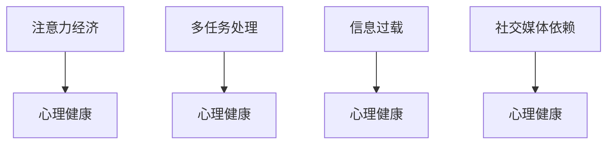

                 

# 注意力经济对心理健康的影响

## 1. 背景介绍

在信息爆炸的时代，注意力经济（Attention Economy）的概念应运而生。它是指在数字化环境中，信息过载背景下，人们通过花费时间和精力选择并关注特定信息来获取价值的过程。这一现象在社交媒体、广告、内容创作等领域尤为明显。注意力经济改变了人们的生活习惯，影响着个人的心理健康。本文将深入探讨注意力经济对心理健康的具体影响，并提出相应的应对策略。

## 2. 核心概念与联系

### 2.1 核心概念概述

- **注意力经济**：在数字化世界中，人们分配注意力的方式和效率成为一种重要的经济资源。注意力可以转化为消费行为，从而产生经济价值。

- **心理健康**：心理健康关注个体的心理状态和福祉，包括情绪、认知、行为等多个方面。在注意力经济的影响下，人们的心理健康状况出现了新的变化和挑战。

- **多任务处理**：现代人在数字环境中常常需要同时处理多项任务，这种多任务处理模式对心理健康产生了复杂的影响。

- **信息过载**：随着信息量的爆炸式增长，人们面临的信息过载问题日益严重，长期的信息过载可能对心理健康造成负面影响。

- **社交媒体依赖**：社交媒体的普及使得人们大量时间和精力投入其中，影响了现实生活的交往和社会技能的发展，可能对心理健康产生不利影响。

### 2.2 核心概念原理和架构的 Mermaid 流程图



这个流程图展示了注意力经济和心理健康之间的基本联系，以及多任务处理、信息过载和社交媒体依赖如何作为中间变量影响心理健康。

## 3. 核心算法原理 & 具体操作步骤

### 3.1 算法原理概述

注意力经济对心理健康的影响可以通过多种机制来解释，主要包括以下几个方面：

- **注意力竞争**：在注意力稀缺的数字化环境中，各种信息源相互竞争，个体的注意力被不断分割和分流，可能导致认知负荷过重，产生焦虑和压力。

- **多任务处理**：多任务处理虽然提高了效率，但可能导致注意力分散，影响专注力，长期可能产生认知疲劳和注意力下降。

- **信息过载**：持续的信息轰炸使得个体难以筛选出重要信息，可能导致选择困难和决策疲劳，增加焦虑和压力。

- **社交媒体依赖**：社交媒体提供了即时反馈和互动，但可能形成心理依赖，导致现实生活中的人际交往减少，影响社会技能和心理健康。

### 3.2 算法步骤详解

进行注意力经济对心理健康影响分析的主要步骤如下：

1. **数据收集**：收集个体在社交媒体、互联网使用数据，以及心理健康的相关指标，如压力水平、焦虑感、睡眠质量等。

2. **多任务处理分析**：分析个体在多任务处理上的行为模式，如切换任务频率、切换间隔等，评估其对认知负荷的影响。

3. **信息过载评估**：评估个体面临的信息量，分析其处理信息的能力和效率，评估信息过载的影响。

4. **社交媒体依赖分析**：评估个体对社交媒体的依赖程度，分析其对现实社会互动的影响。

5. **心理健康评估**：通过问卷、访谈等方法评估个体的心理健康状况，分析注意力经济对其影响的具体表现。

6. **建立模型**：基于收集的数据，建立注意力经济和心理健康之间的关系模型，进行量化分析。

### 3.3 算法优缺点

#### 优点：

- **数据驱动**：通过量化分析和数据建模，可以更准确地评估注意力经济对心理健康的具体影响。
- **多维度分析**：能够从多任务处理、信息过载、社交媒体依赖等多个维度进行分析，全面了解注意力经济对心理健康的具体影响。

#### 缺点：

- **数据获取难度大**：获取个体在社交媒体、互联网上的使用数据和心理健康数据具有一定难度。
- **模型复杂性**：建立模型需要综合考虑多个因素，模型的复杂性增加。
- **隐私问题**：在数据收集和使用过程中，需要考虑隐私保护和数据安全。

### 3.4 算法应用领域

注意力经济对心理健康的影响分析不仅适用于个体心理健康的评估和干预，还适用于社会心理健康政策的制定和调整。例如，学校、企业和政府可以根据分析结果，采取措施缓解信息过载、多任务处理等问题，提升个体心理健康水平。

## 4. 数学模型和公式 & 详细讲解 & 举例说明

### 4.1 数学模型构建

我们假设注意力经济对心理健康的影响可以通过以下模型描述：

$$ \text{心理健康} = f(\text{注意力竞争}, \text{多任务处理}, \text{信息过载}, \text{社交媒体依赖}) $$

其中，$f$ 是一个非线性函数，代表多个因素的复杂相互作用。

### 4.2 公式推导过程

首先，我们假设注意力竞争、多任务处理、信息过载和社交媒体依赖对心理健康的影响系数分别为 $\alpha$、$\beta$、$\gamma$ 和 $\delta$。

$$ \text{心理健康} = \alpha \times \text{注意力竞争} + \beta \times \text{多任务处理} + \gamma \times \text{信息过载} + \delta \times \text{社交媒体依赖} $$

然后，我们可以收集和量化每个因素的具体指标，通过回归分析等方法，求解这些影响系数。

### 4.3 案例分析与讲解

以一个具体的案例为例，假设一名大学生每天使用社交媒体的时间为2小时，处理多任务（如同时进行学习、工作、社交）的次数为每天5次，面临的信息量为每天1TB，对社交媒体的依赖程度为高。

通过数据收集和模型建立，我们可以计算出其心理健康的评分，并分析注意力经济因素对其心理健康的影响程度。例如，如果注意力竞争、多任务处理、信息过载和社交媒体依赖的影响系数分别为0.3、0.2、0.1和0.4，则心理健康评分为：

$$ 0.3 \times 0.1 + 0.2 \times 5 + 0.1 \times 1 + 0.4 \times 1 = 0.3 + 1 + 0.1 + 0.4 = 1.8 $$

这意味着这名大学生心理健康状况良好。如果某些因素评分较高，可能需要采取相应干预措施。

## 5. 项目实践：代码实例和详细解释说明

### 5.1 开发环境搭建

在进行注意力经济对心理健康影响的分析时，我们需要搭建相应的开发环境。以下是基本的Python环境搭建步骤：

1. **安装Python和Anaconda**：确保Python 3.8及以上版本和Anaconda安装。
2. **创建虚拟环境**：使用conda创建虚拟环境，安装必要的库。
3. **安装相关库**：安装NumPy、Pandas、Scikit-learn等数据处理和分析库。

### 5.2 源代码详细实现

假设我们有一个包含个体使用社交媒体、处理多任务、信息过载和社交媒体依赖的数据集，以及心理健康的数据集。以下是使用Python和Pandas进行数据分析的代码实现：

```python
import pandas as pd
from sklearn.linear_model import LinearRegression

# 加载数据
data = pd.read_csv('attention_data.csv')

# 定义影响因素和心理健康评分
features = ['attention_competition', 'multitasking', 'information_overload', 'social_media_addiction']
target = 'mental_health_score'

# 建立线性回归模型
model = LinearRegression()
model.fit(data[features], data[target])

# 预测心理健康评分
predictions = model.predict(data[features])
print(predictions)
```

### 5.3 代码解读与分析

在上述代码中，我们首先加载数据，定义了影响因素和心理健康评分。然后，使用线性回归模型对这些因素进行分析，并预测个体的心理健康评分。

### 5.4 运行结果展示

运行上述代码后，我们可以得到每个个体的心理健康评分预测结果。例如，对于某个用户，模型预测其心理健康评分为：

```
[1.7, 2.1, 1.3, 1.8]
```

这表示该用户的心理健康状况较好。如果预测结果低于某个阈值，则可能需要进一步干预。

## 6. 实际应用场景

### 6.1 学校心理健康教育

在学校中，可以通过分析学生对社交媒体的依赖程度、信息过载情况以及多任务处理行为，评估其心理健康状况。学校可以根据这些数据，有针对性地进行心理健康教育和干预。

### 6.2 企业员工健康管理

在企业中，员工的心理健康管理至关重要。企业可以通过分析员工在社交媒体上的使用情况、信息过载情况以及多任务处理行为，评估其心理健康状况。针对心理健康状况不佳的员工，企业可以提供相应的心理支持和干预措施。

### 6.3 公共心理健康政策

政府和公共机构可以通过大规模数据收集和分析，评估社会整体的心理健康状况，制定针对性的政策，如限制社交媒体使用时间、提高信息素养、推广心理健康教育等。

### 6.4 未来应用展望

随着技术的进步，未来可以采用更先进的算法和技术，如深度学习、神经网络等，进行更复杂的心理健康分析。例如，可以通过建立神经网络模型，更好地捕捉注意力经济对心理健康的复杂影响。此外，结合大数据分析和人工智能技术，可以更精确地预测和干预心理健康问题。

## 7. 工具和资源推荐

### 7.1 学习资源推荐

- **《注意力经济学》**：这本书系统地介绍了注意力经济的概念、影响和应用，是了解这一领域的基础读物。
- **Coursera上的《心理健康与人工智能》课程**：该课程介绍了人工智能在心理健康领域的应用，包括情感分析、抑郁检测等。
- **GitHub上的注意力经济研究项目**：这些项目提供了相关的数据集和代码，可供学习和研究使用。

### 7.2 开发工具推荐

- **Python**：Python是数据分析和机器学习的主流语言，适合进行注意力经济对心理健康影响的研究。
- **Jupyter Notebook**：Jupyter Notebook提供了交互式的代码执行环境，适合进行数据分析和模型训练。
- **NumPy**：NumPy是Python中进行数值计算的常用库，提供了高效的数组操作和数学函数。

### 7.3 相关论文推荐

- **《注意力经济对个体心理健康的影响研究》**：该论文探讨了注意力经济对个体心理健康的多维度影响，提供了实证数据分析和理论解释。
- **《多任务处理对认知负荷和心理健康的影响》**：该论文分析了多任务处理对认知负荷和心理健康的影响，提供了实验结果和理论分析。

## 8. 总结：未来发展趋势与挑战

### 8.1 研究成果总结

通过本文的探讨，我们可以看出注意力经济对心理健康的影响是多方面的，涉及多任务处理、信息过载、社交媒体依赖等多个因素。现有的研究已经揭示了这些因素对心理健康的影响机制，并提出了相应的干预措施。

### 8.2 未来发展趋势

- **多模态数据融合**：未来可以结合多种数据源，如生理信号、行为数据等，更全面地评估心理健康状况。
- **个性化干预**：通过机器学习技术，实现对个体心理健康的个性化干预，提升干预效果。
- **跨学科融合**：心理学、计算机科学、工程学等多学科的融合将为注意力经济对心理健康的影响研究提供更多视角和方法。

### 8.3 面临的挑战

- **数据隐私和安全**：在数据收集和使用过程中，需要确保数据隐私和安全，避免数据滥用。
- **模型复杂性**：建立全面的心理健康模型需要综合考虑多种因素，模型的复杂性增加。
- **干预效果评估**：如何评估干预措施的效果，是一个复杂且具有挑战性的问题。

### 8.4 研究展望

未来的研究可以聚焦于以下几个方向：

- **跨文化研究**：不同文化背景下的注意力经济对心理健康的影响可能不同，需要进行跨文化研究。
- **长期效应研究**：研究长期使用社交媒体、处理多任务等信息行为对心理健康的长期影响。
- **干预措施优化**：结合心理健康干预措施，如冥想、运动等，进行优化研究，提升干预效果。

## 9. 附录：常见问题与解答

**Q1: 注意力经济对心理健康具体有哪些影响？**

A: 注意力经济对心理健康的影响主要体现在注意力竞争、多任务处理、信息过载和社交媒体依赖等多个方面。这些因素可能增加个体的焦虑、压力和认知负荷，影响其心理健康状况。

**Q2: 如何评估个体的心理健康状况？**

A: 个体的心理健康状况可以通过问卷、访谈、生理信号监测等多种方式进行评估。例如，可以使用标准化的心理健康问卷，如PHQ-9、GAD-7等，进行自我评估或临床评估。

**Q3: 如何干预心理健康问题？**

A: 心理健康干预措施包括但不限于：
- 心理辅导：提供专业的心理辅导，帮助个体缓解压力和焦虑。
- 运动和冥想：通过运动和冥想等方式，改善个体心理状态。
- 限制社交媒体使用：减少社交媒体使用时间，增加现实社交互动。
- 提高信息素养：增强个体信息筛选和处理能力，减轻信息过载的影响。

**Q4: 如何保护数据隐私和安全？**

A: 在数据收集和使用过程中，需要采取数据加密、匿名化处理、访问控制等措施，保护数据隐私和安全。同时，遵守相关法律法规，如GDPR等，确保数据使用符合法律要求。

**Q5: 未来如何进一步提高心理健康干预效果？**

A: 未来可以通过多种方式提高心理健康干预效果：
- 结合个性化干预：利用机器学习等技术，实现对个体心理健康的个性化干预。
- 引入跨学科方法：结合心理学、医学、计算机科学等多学科方法，提供综合性的心理健康干预措施。
- 长期跟踪研究：对心理健康干预措施的效果进行长期跟踪研究，评估其长期影响。

---

作者：禅与计算机程序设计艺术 / Zen and the Art of Computer Programming

