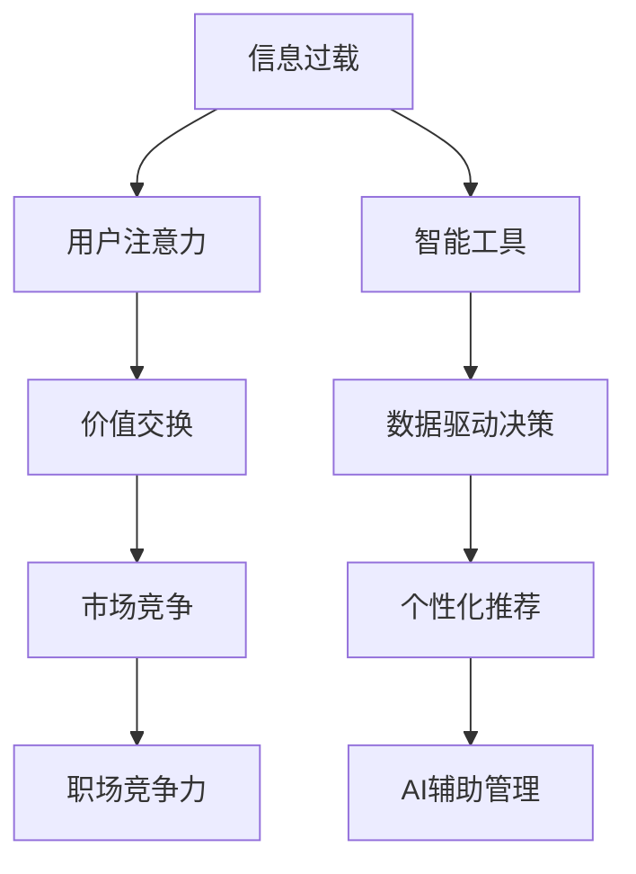

                 

# 注意力经济对职场竞争力的影响

> 关键词：注意力经济,职场竞争力,数字营销,信息过载,数据驱动决策,智能办公,个性化推荐,AI辅助管理

## 1. 背景介绍

在数字化和智能化的浪潮中，注意力经济（Economy of Attention）成为企业竞争的新焦点。随着互联网和移动设备的普及，全球信息量呈爆炸性增长，人类可获取的信息总量呈指数级增长。在这样的信息过载时代，如何在海量信息中获取并高效利用关键信息，成为企业在激烈市场竞争中的关键。

### 1.1 注意力经济的概念与起源
注意力经济（Economy of Attention）这一概念由经济学家Theodore Levitt在20世纪80年代首次提出，指的是在信息泛滥的时代，用户注意力的稀缺性日益成为一种宝贵的资源。与传统的土地、资本、劳动等生产要素不同，用户注意力作为一种“注意力资本”，正在成为驱动经济增长的重要因素。

注意力经济主要涉及以下几个关键要素：
1. **信息过载**：现代社会的信息量急剧增长，用户面临大量冗余信息，难以筛选关键信息。
2. **用户注意力**：用户注意力是一种有限的资源，决定了信息的选择和消费方式。
3. **价值交换**：通过优质内容或服务吸引用户注意力，实现商业价值交换。
4. **市场竞争**：企业之间通过争夺用户注意力，形成市场竞争格局。

### 1.2 注意力经济对职场的影响
在职场竞争中，注意力经济同样有着深远的影响：
1. **技能需求转变**：从过去的文字、数据处理等基本技能，转向信息筛选、数据分析、数字营销等高级技能。
2. **效率提升**：通过智能工具和算法优化，提升信息处理和决策效率，实现业务流程的自动化。
3. **个性化服务**：通过用户画像和智能推荐，提供个性化服务，提升用户体验和满意度。
4. **精准营销**：通过数据分析和预测，实现精准的营销和用户转化。

## 2. 核心概念与联系

### 2.1 核心概念概述
注意力经济的核心概念包括以下几个方面：

1. **信息过载（Information Overload）**：
   - 现代社会信息量爆炸式增长，用户难以处理所有信息。
   - 信息过载现象在职场中表现为员工面临海量任务和信息，导致决策困难和工作效率下降。

2. **用户注意力（User Attention）**：
   - 用户的注意力是一种有限的资源，需要在海量信息中筛选出对自身有价值的信息。
   - 在职场中，员工需通过高效的信息筛选和处理，提升工作效率和决策质量。

3. **价值交换（Value Exchange）**：
   - 通过优质内容或服务吸引用户注意力，实现商业价值交换。
   - 在职场中，企业通过提供有价值的工作环境、职业培训等，吸引和留住人才。

4. **市场竞争（Market Competition）**：
   - 企业之间通过争夺用户注意力，形成市场竞争格局。
   - 职场竞争中，员工需不断提升自身技能，保持竞争优势。

### 2.2 核心概念原理和架构的 Mermaid 流程图

上述流程图展示了注意力经济与职场竞争力之间的关系和影响路径：

1. **信息过载**通过智能工具（如数据分析、自动化系统）进行筛选和管理，从而吸引和保持用户的注意力。
2. **用户注意力**通过价值交换（如工作环境、职业培训）进行吸引和保留，形成有效的市场竞争。
3. **市场竞争**通过提供有价值的内容和服务，不断提升职场竞争力。

### 2.3 注意力经济与职场竞争力之间的关系
注意力经济与职场竞争力的关系如图示：


上图中，信息过载通过智能工具和数据驱动决策，提升用户注意力质量。用户注意力通过个性化推荐和AI辅助管理，进一步提升工作效率和决策质量，从而增强职场竞争力。同时，市场竞争促使企业不断创新和优化，保持竞争力。

## 3. 核心算法原理 & 具体操作步骤
### 3.1 算法原理概述

注意力经济的核心算法原理在于通过智能工具和算法，高效地筛选和管理信息，从而吸引和保持用户的注意力，最终实现市场竞争优势。

### 3.2 算法步骤详解

以下详细阐述基于注意力经济原理的企业职场竞争力提升操作步骤：

**Step 1: 数据收集与处理**
- 收集与业务相关的各类数据，如用户行为数据、销售数据、市场数据等。
- 对数据进行清洗和预处理，构建完整的数据仓库。

**Step 2: 用户画像构建**
- 通过数据分析技术，构建用户画像，了解用户需求和行为特征。
- 使用聚类、分类等算法，对用户进行细分，识别不同用户群体。

**Step 3: 智能推荐系统设计**
- 设计基于用户画像的智能推荐系统，推荐符合用户兴趣的内容或产品。
- 结合协同过滤、基于内容的推荐等技术，提升推荐准确度。

**Step 4: AI辅助管理**
- 引入AI技术，自动化处理日常业务流程，如客户服务、销售管理、库存管理等。
- 通过机器学习和自然语言处理技术，提升决策支持和业务优化。

**Step 5: 数据驱动决策**
- 利用数据分析和预测模型，辅助企业进行决策制定。
- 结合业务场景，构建智能决策系统，优化业务流程。

**Step 6: 反馈与优化**
- 收集用户反馈和业务数据，不断优化推荐算法和业务流程。
- 引入A/B测试等方法，验证优化效果，持续改进。

### 3.3 算法优缺点
#### 优点：
1. **提升效率**：通过智能工具和算法优化，提升信息处理和决策效率。
2. **个性化服务**：提供个性化推荐，提升用户体验和满意度。
3. **精准营销**：通过数据分析和预测，实现精准的营销和用户转化。

#### 缺点：
1. **技术门槛高**：智能工具和算法需要专业的技术支持，开发和维护成本较高。
2. **数据隐私问题**：处理大量用户数据，需要严格的数据隐私保护措施。
3. **算法偏见**：算法可能存在偏见，导致不公平的结果。

### 3.4 算法应用领域

注意力经济的应用领域非常广泛，以下是几个典型的应用场景：

1. **电商平台**：通过个性化推荐系统，提升用户购买体验和转化率。
2. **金融服务**：利用数据分析和预测，实现精准的用户风险评估和投资建议。
3. **医疗健康**：通过智能推荐系统，提供个性化健康建议和治疗方案。
4. **智能办公**：通过自动化工具和AI辅助管理，提升办公效率和决策质量。
5. **教育培训**：通过智能推荐和个性化学习路径，提升学习效果和用户满意度。

## 4. 数学模型和公式 & 详细讲解 & 举例说明

### 4.1 数学模型构建
基于注意力经济的核心算法原理，我们构建以下数学模型：

设用户集合为 $U$，商品集合为 $I$，用户的兴趣向量为 $\mathbf{u}_u \in \mathbb{R}^n$，商品的特征向量为 $\mathbf{v}_i \in \mathbb{R}^m$。用户对商品 $i$ 的评分 $r_{ui} \in [0,1]$ 可以表示为：

$$
r_{ui} = \text{sigmoid}(\mathbf{u}_u^T \mathbf{v}_i + b)
$$

其中 $\mathbf{u}_u^T \mathbf{v}_i$ 为内积，$b$ 为偏置项，$\text{sigmoid}$ 函数将内积结果映射到 $[0,1]$ 范围内。

### 4.2 公式推导过程

假设用户 $u$ 对商品 $i$ 的评分 $r_{ui}$ 已知，我们可以构建矩阵形式的用户-商品评分矩阵 $R$：

$$
R = \begin{bmatrix}
r_{11} & r_{12} & \cdots & r_{1n} \\
r_{21} & r_{22} & \cdots & r_{2n} \\
\vdots & \vdots & \ddots & \vdots \\
r_{m1} & r_{m2} & \cdots & r_{mn} 
\end{bmatrix}
$$

我们可以使用矩阵分解技术，将 $R$ 分解为用户兴趣矩阵 $U$ 和商品特征矩阵 $V$ 的乘积，即：

$$
R \approx U \cdot V
$$

其中 $U \in \mathbb{R}^{m \times k}$，$V \in \mathbb{R}^{n \times k}$，$k$ 为分解后的因子数。

通过奇异值分解（SVD），我们可以将 $R$ 分解为三个矩阵的乘积：

$$
R \approx U \cdot \Sigma \cdot V^T
$$

其中 $\Sigma = \text{diag}(\sigma_1, \sigma_2, \ldots, \sigma_k)$ 是对角矩阵，包含奇异值。

### 4.3 案例分析与讲解

假设某电商平台的商品数据和用户评分数据如下：

用户集合 $U = \{1,2,3\}$，商品集合 $I = \{a,b,c\}$，用户对商品的评分矩阵 $R$ 如下：

$$
R = \begin{bmatrix}
1 & 0.5 & 0 \\
0 & 1 & 1 \\
0.5 & 1 & 0.5 
\end{bmatrix}
$$

对 $R$ 进行奇异值分解：

$$
R \approx U \cdot \Sigma \cdot V^T = \begin{bmatrix}
0.8 & -0.6 & 0.5 \\
0.6 & 0.8 & 0.5 \\
-0.5 & 0.3 & 0.8 
\end{bmatrix} \cdot \begin{bmatrix}
2.5 & 0 & 0 \\
0 & 0.8 & 0 \\
0 & 0 & 0.5 
\end{bmatrix} \cdot \begin{bmatrix}
0.6 & 0.5 & 0 \\
-0.5 & 0.8 & 0.5 \\
0.8 & 0.3 & 0.5 
\end{bmatrix}
$$

其中 $U$、$\Sigma$、$V^T$ 分别为用户兴趣矩阵、奇异值矩阵、商品特征矩阵。

通过奇异值分解，我们可以将 $R$ 近似表示为：

$$
R \approx \begin{bmatrix}
0.8 & -0.6 & 0.5 \\
0.6 & 0.8 & 0.5 \\
-0.5 & 0.3 & 0.8 
\end{bmatrix} \cdot \begin{bmatrix}
2.5 & 0 & 0 \\
0 & 0.8 & 0 \\
0 & 0 & 0.5 
\end{bmatrix} \cdot \begin{bmatrix}
0.6 & 0.5 & 0 \\
-0.5 & 0.8 & 0.5 \\
0.8 & 0.3 & 0.5 
\end{bmatrix}
$$

通过上述矩阵分解，我们可以进一步构建智能推荐系统，推荐符合用户兴趣的商品。

## 5. 项目实践：代码实例和详细解释说明

### 5.1 开发环境搭建

在进行注意力经济相关的项目开发时，首先需要搭建合适的开发环境。以下是基于Python的开发环境搭建步骤：

1. **安装Python**：
   ```bash
   sudo apt-get update
   sudo apt-get install python3
   ```

2. **安装Pip**：
   ```bash
   sudo apt-get install python3-pip
   ```

3. **安装相关库**：
   ```bash
   pip install pandas numpy scikit-learn scikit-learn-nltk
   ```

4. **环境配置**：
   ```bash
   source activate py3env
   ```

### 5.2 源代码详细实现

以下是一个简单的基于协同过滤算法的智能推荐系统的Python代码实现：

```python
import numpy as np
from scipy.sparse import csr_matrix
from scipy.sparse.linalg import svds

# 假设用户-商品评分矩阵
R = np.array([[1, 0.5, 0], [0, 1, 1], [0.5, 1, 0.5]])

# 奇异值分解
U, S, Vt = svds(R, k=3)

# 构建推荐矩阵
rec_matrix = np.dot(U, np.dot(np.diag(S), Vt))

# 用户对商品的推荐评分
rec_matrix
```

### 5.3 代码解读与分析

上述代码实现了基于奇异值分解的协同过滤推荐系统。具体步骤如下：

1. **用户-商品评分矩阵**：将用户对商品的评分矩阵 $R$ 转化为numpy数组。
2. **奇异值分解**：使用scipy库的svds函数进行奇异值分解，得到用户兴趣矩阵 $U$、奇异值矩阵 $S$ 和商品特征矩阵 $V^T$。
3. **推荐矩阵**：通过矩阵乘法，构建推荐矩阵 $R_{rec}$，其中 $R_{rec} = U \cdot \Sigma \cdot V^T$。
4. **用户推荐评分**：通过计算 $R_{rec}$ 中用户 $u$ 对商品 $i$ 的评分，得到推荐结果。

## 6. 实际应用场景

### 6.1 电商平台的个性化推荐

电商平台利用智能推荐系统，提升用户购买体验和转化率。通过对用户历史行为和商品特征进行分析和建模，生成个性化推荐列表，帮助用户快速找到感兴趣的商品，提高用户满意度。

### 6.2 金融服务的精准营销

金融服务机构通过数据分析和预测，实现精准的用户风险评估和投资建议。利用用户行为数据和市场信息，构建用户画像，提供个性化的投资建议，帮助用户制定最优投资策略。

### 6.3 智能办公的自动化管理

智能办公系统通过AI辅助管理，提升办公效率和决策质量。利用自然语言处理和机器学习技术，自动处理日常业务流程，如客户服务、销售管理、库存管理等，减少人工干预，提高工作效率。

### 6.4 医疗健康的个性化建议

医疗健康平台通过智能推荐系统，提供个性化健康建议和治疗方案。利用用户健康数据和医疗知识，构建用户画像，推荐适合的健康建议和治疗方案，提升用户健康管理水平。

## 7. 工具和资源推荐

### 7.1 学习资源推荐

为了帮助开发者深入理解注意力经济和职场竞争力的关系，以下是一些推荐的学习资源：

1. **《注意力经济》（Attention Economy）**：经济学家Theodore Levitt的著作，全面探讨了注意力经济的概念和应用。
2. **《数据科学与人工智能》（Data Science and AI）**：斯坦福大学提供的免费课程，涵盖数据科学和人工智能的基础知识。
3. **《机器学习实战》（Python Machine Learning）**：Sebastian Raschka的著作，介绍了机器学习算法和Python实现的详细案例。
4. **《自然语言处理入门》（Natural Language Processing with Python）**：Jurgen Schmid.de的著作，介绍了自然语言处理技术和Python实现的详细案例。
5. **Kaggle竞赛**：参加Kaggle数据科学竞赛，实践机器学习和数据处理技能，提升职场竞争力。

### 7.2 开发工具推荐

在开发注意力经济相关的项目时，可以使用以下开发工具：

1. **Python**：Python是数据科学和人工智能领域的主流语言，支持丰富的数据处理和机器学习库。
2. **NumPy**：用于高效处理数组和矩阵运算。
3. **Pandas**：用于数据处理和分析。
4. **Scikit-learn**：用于机器学习算法实现。
5. **TensorFlow**：用于深度学习和神经网络实现。
6. **Keras**：用于快速搭建深度学习模型。
7. **PyTorch**：用于深度学习和神经网络实现。

### 7.3 相关论文推荐

以下是几篇关于注意力经济和职场竞争力研究的经典论文：

1. **《注意力经济的崛起》（The Rise of the Attention Economy）**：经济学家Theodore Levitt的文章，探讨了注意力经济在现代经济中的作用和挑战。
2. **《注意力经济中的用户行为分析》（User Behavior Analysis in the Attention Economy）**：分析了用户在注意力经济中的行为特征和消费模式。
3. **《智能推荐系统的算法与应用》（Algorithms and Applications of Recommendation Systems）**：介绍了协同过滤、内容过滤等推荐算法及其应用。
4. **《AI在职场中的应用》（AI Applications in the Workplace）**：探讨了AI技术在提升职场效率和竞争力方面的应用。

## 8. 总结：未来发展趋势与挑战

### 8.1 研究成果总结

注意力经济和职场竞争力之间的关系，是一个不断发展和深入研究的领域。本研究探讨了注意力经济的基本概念、核心算法原理和实际应用，系统介绍了基于注意力经济的职场竞争力提升方法。

### 8.2 未来发展趋势

未来，注意力经济和职场竞争力将继续深化发展，主要趋势包括：

1. **技术融合**：AI技术和大数据技术将更加深入融合，提升职场竞争力。
2. **个性化服务**：通过智能推荐和个性化管理，提供更加精准的用户体验。
3. **数据驱动决策**：利用数据驱动决策，优化业务流程和提升决策质量。
4. **自动化办公**：智能办公系统将更加普及，提升办公效率和资源利用率。

### 8.3 面临的挑战

尽管注意力经济和职场竞争力的研究取得了一定的进展，但仍面临以下挑战：

1. **技术复杂性**：智能工具和算法需要高水平的技术支持和维护。
2. **数据隐私**：处理大量用户数据，需要严格的数据隐私保护措施。
3. **算法偏见**：算法可能存在偏见，导致不公平的结果。

### 8.4 研究展望

未来的研究应重点关注以下方向：

1. **技术简化**：开发更加简洁易用的智能工具和算法，降低技术门槛。
2. **数据治理**：建立健全的数据治理体系，保护用户隐私和数据安全。
3. **公平性**：研究并解决算法偏见问题，确保公平性和公正性。

## 9. 附录：常见问题与解答

### Q1：如何构建用户画像？

A：构建用户画像通常需要以下步骤：
1. 收集用户行为数据，如浏览记录、购买记录、互动数据等。
2. 对数据进行清洗和预处理，去除噪声和异常值。
3. 利用聚类、分类等算法，对用户进行细分，识别不同用户群体。
4. 使用特征工程方法，提取用户的关键特征，构建用户画像。

### Q2：智能推荐系统有哪些算法？

A：智能推荐系统主要包括以下几种算法：
1. 协同过滤算法：基于用户行为数据的相似度计算，推荐相似用户喜欢的商品。
2. 基于内容的推荐算法：根据商品特征和用户兴趣，推荐相关商品。
3. 混合推荐算法：结合协同过滤和基于内容的推荐，提升推荐效果。
4. 矩阵分解算法：利用矩阵分解技术，分解用户-商品评分矩阵，推荐商品。
5. 深度学习算法：利用深度神经网络，从用户行为数据中学习推荐模型。

### Q3：注意力经济与职场竞争力之间的关系是什么？

A：注意力经济和职场竞争力之间的关系是相互影响的。通过智能工具和算法，高效利用用户注意力，提升业务效率和决策质量，从而增强职场竞争力。同时，职场竞争力提升又需要更多优质内容和服务，吸引和保留用户注意力，形成良性循环。

### Q4：如何在数据处理过程中保护用户隐私？

A：在数据处理过程中，保护用户隐私的措施包括：
1. 数据匿名化：对用户数据进行匿名化处理，去除个人标识信息。
2. 数据加密：对数据进行加密处理，防止数据泄露。
3. 访问控制：设置严格的数据访问权限，防止数据滥用。
4. 数据去标识化：对数据进行去标识化处理，确保数据无法还原个人身份。

### Q5：注意力经济的核心算法原理是什么？

A：注意力经济的核心算法原理在于通过智能工具和算法，高效地筛选和管理信息，从而吸引和保持用户的注意力，最终实现市场竞争优势。主要算法包括协同过滤、基于内容的推荐、矩阵分解等。

---

作者：禅与计算机程序设计艺术 / Zen and the Art of Computer Programming

