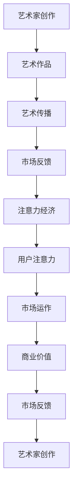

                 

# 注意力经济对艺术创作的影响

在数字化浪潮席卷全球的背景下，互联网不仅改变了人们获取信息和沟通的方式，也深刻影响了艺术创作的形态和传播方式。"注意力经济"（Attention Economy）作为一种新兴的经济模式，正在成为塑造未来艺术市场的重要力量。本文将深入探讨注意力经济对艺术创作的影响，从多个维度分析其核心概念、算法原理与应用实践，力图为艺术创作者和市场从业者提供全方位的视角和洞见。

## 1. 背景介绍

### 1.1 问题由来
随着信息技术的不断进步，全球艺术市场正在经历一场前所未有的变革。互联网平台、社交媒体的崛起，为艺术家提供了前所未有的展示与传播渠道。但与此同时，注意力资源的分散与竞争也加剧，艺术作品如何在海量内容中脱颖而出，成为艺术家和市场从业者亟需应对的挑战。在这样的背景下，"注意力经济"应运而生，成为一种新兴的经济模式，即通过集中注意力的方式，以获取和维持用户关注为目标，进行内容创造和市场运作。

### 1.2 问题核心关键点
注意力经济的核心在于"注意力"（Attention）的获取与分配。在艺术创作和市场传播中，艺术家和创作者如何吸引用户注意力，并将之转化为商业价值，成为焦点。本文将从注意力分配的机制、艺术作品的传播方式、市场与创作的关系等多个方面，探讨注意力经济对艺术创作的影响。

## 2. 核心概念与联系

### 2.1 核心概念概述

为更好地理解注意力经济对艺术创作的影响，本节将介绍几个密切相关的核心概念：

- 注意力经济（Attention Economy）：指在信息过载的时代，通过集中注意力的方式，获取和维持用户关注，实现经济价值的过程。艺术家和创作者通过创作高质量、富有吸引力的艺术作品，争夺有限的注意力资源。

- 艺术创作（Artistic Creation）：指艺术家基于自身情感、思想和技能，创作出具有审美和艺术价值的作品。艺术创作是艺术市场的重要基础，也是注意力经济的核心驱动力。

- 艺术传播（Artistic Dissemination）：指将艺术作品从创作端传递到受众端的过程。互联网平台、社交媒体等新兴传播方式，为艺术作品的大范围传播提供了可能。

- 市场反馈（Market Feedback）：指艺术作品在市场中的接收和反应。市场反馈对艺术创作具有重要的指导意义，影响艺术家的创作动机和作品风格。

- 用户注意力（User Attention）：指用户对艺术作品的关注度，是注意力经济的关键资源。用户注意力的集中与分配，直接决定了艺术作品的市场表现和经济价值。

这些核心概念之间存在密切联系，共同构成注意力经济对艺术创作影响的基础框架。艺术家和创作者通过创作高质量的艺术作品，吸引用户注意力，并在此基础上进行市场运作，获取商业价值。市场反馈则进一步指导艺术创作，形成良性循环。

### 2.2 核心概念原理和架构的 Mermaid 流程图



这个流程图展示了注意力经济对艺术创作的影响路径：艺术家创作出高质量的艺术作品，通过艺术传播吸引用户注意力，市场运作获取商业价值，市场反馈指导艺术家创作，形成完整的注意力经济循环。

## 3. 核心算法原理 & 具体操作步骤
### 3.1 算法原理概述

注意力经济对艺术创作的影响，本质上是注意力资源在创作、传播、反馈过程中的动态分配和优化。通过算法手段，可以实现对注意力资源的精准捕捉和高效分配，从而最大化艺术作品的市场价值。

基于注意力经济的核心原理，注意力分配可以分为以下几个步骤：

1. **内容生成**：艺术家创作出高质量的艺术作品，确保内容具备吸引力。
2. **传播策略**：通过算法优化艺术作品的传播路径和方式，确保作品能够被目标受众广泛接触到。
3. **用户反馈**：收集用户对艺术作品的反馈数据，通过算法分析用户注意力的集中点和变化趋势。
4. **市场运作**：根据用户反馈，调整艺术作品的市场运作策略，优化艺术品的定价、推广等。

### 3.2 算法步骤详解

以下我们将详细解析注意力经济中，核心算法步骤的实现机制：

**Step 1: 内容生成与优化**

内容生成阶段，艺术家创作出艺术作品，这是注意力经济的源头。为确保作品具备吸引力，可以通过算法手段进行内容优化：

- **用户画像分析**：通过分析用户数据，如年龄、性别、兴趣等，指导艺术家创作出符合目标受众偏好的作品。
- **风格特征提取**：使用机器学习算法，提取艺术作品的风格特征，与目标受众的偏好进行匹配，优化创作方向。
- **智能推荐系统**：结合用户历史行为数据和实时互动反馈，进行智能推荐，引导艺术家创作更具吸引力的作品。

**Step 2: 传播路径优化**

艺术作品创作完成后，通过传播渠道传递给目标受众，是注意力经济的核心环节。为提高传播效果，可以通过以下算法步骤：

- **传播渠道选择**：通过用户画像分析，选择最符合目标受众习惯的传播渠道，如社交媒体、专业平台等。
- **传播时间安排**：根据用户活跃时间，选择最佳的传播时间点，提升作品的曝光率和互动率。
- **传播策略优化**：使用A/B测试等算法手段，优化传播策略，如标题、摘要、配图等，提高传播效果。

**Step 3: 用户反馈分析**

用户反馈是注意力经济的重要数据来源，通过算法分析用户反馈，可以更好地指导艺术创作和市场运作：

- **情感分析**：使用自然语言处理技术，分析用户对作品的情感倾向，了解用户的偏好和需求。
- **行为追踪**：通过数据追踪技术，记录用户对艺术作品的行为数据，如浏览、点赞、评论等，分析用户注意力分布。
- **趋势预测**：使用机器学习模型，预测用户注意力的变化趋势，指导未来内容的创作和传播。

**Step 4: 市场运作与优化**

根据用户反馈，进行市场运作和策略调整，是实现注意力经济价值的关键步骤：

- **定价策略调整**：根据用户反馈和市场竞争情况，调整艺术作品的定价策略，以最大化商业价值。
- **推广策略优化**：结合用户反馈，优化推广策略，如广告投放、社交媒体推广等，提升作品的市场影响力。
- **用户互动管理**：通过算法手段，管理用户互动，提升用户粘性和忠诚度，促进二次传播和口碑营销。

### 3.3 算法优缺点

注意力经济的算法手段，在提高艺术作品的市场价值方面具有显著优势：

**优点**：

- **精准定位**：通过用户画像和内容特征分析，精准定位目标受众，提高作品的市场匹配度。
- **高效传播**：通过传播路径优化和时间安排，高效传播艺术作品，提升曝光率和互动率。
- **反馈循环**：通过用户反馈分析，形成反馈循环，持续优化作品和市场策略。

**缺点**：

- **数据隐私**：算法优化需要大量用户数据，可能涉及隐私问题，需谨慎处理。
- **算法依赖**：过度依赖算法可能导致创作的机械化和同质化，失去艺术创作的人文关怀。
- **算法偏见**：算法模型可能存在偏见，导致某些类型或风格的作品被优先推荐，影响艺术多样性。

尽管存在这些局限，但就目前而言，基于算法的注意力经济手段，已成为艺术创作和市场运作的重要参考，推动了艺术与技术的深度融合。

### 3.4 算法应用领域

注意力经济的核心算法手段，已经在艺术创作和市场运作的多个领域得到广泛应用，例如：

- **艺术作品推荐**：通过智能推荐系统，为用户推荐个性化艺术作品，提高用户满意度和市场转化率。
- **艺术市场分析**：使用大数据分析工具，分析艺术市场趋势，指导艺术创作和市场运作。
- **艺术作品版权管理**：通过区块链和人工智能技术，实现艺术作品版权的自动认证和版权交易。
- **艺术作品市场预测**：利用机器学习模型，预测艺术作品的市场表现，指导市场投资和收藏。
- **艺术作品自动化生成**：使用生成对抗网络（GAN）等技术，自动生成高质量艺术作品，提高创作效率。

除了上述这些经典应用外，注意力经济的核心算法手段，还被创新性地应用于更多场景中，如艺术众筹、艺术教育、艺术版权保护等，为艺术创作和市场运作提供了新的思路和工具。

## 4. 数学模型和公式 & 详细讲解 & 举例说明

### 4.1 数学模型构建

为更好地理解注意力经济在艺术创作中的具体应用，我们将构建一个简化版的数学模型。假设艺术作品的市场价值 $V$ 与艺术作品的质量 $Q$、用户注意力的集中度 $A$ 和市场运作的策略 $S$ 有关。设 $V = f(Q, A, S)$，则有：

$$
V(Q, A, S) = Q \times A \times S
$$

其中 $Q$ 为艺术作品质量，$A$ 为用户注意力集中度，$S$ 为市场运作策略。

### 4.2 公式推导过程

通过上述模型，我们可以推导出影响艺术作品市场价值的各个因素的数学关系。设 $Q_t$ 为时间 $t$ 时的艺术作品质量，$A_t$ 为时间 $t$ 时的用户注意力集中度，$S_t$ 为时间 $t$ 时的市场运作策略，则有：

$$
\frac{dV}{dt} = Q \times \frac{dA}{dt} + A \times \frac{dS}{dt} + S \times Q \times \frac{dA}{dt}
$$

其中 $\frac{dA}{dt}$ 表示单位时间内的用户注意力集中度的变化率，$\frac{dS}{dt}$ 表示单位时间内的市场运作策略的变化率。

通过对该微分方程求解，可以分析不同因素对艺术作品市场价值的影响：

1. **艺术作品质量 $Q$**：提高作品质量，能够显著提升市场价值。
2. **用户注意力集中度 $A$**：集中用户注意力，能够显著提升市场价值。
3. **市场运作策略 $S$**：优化市场运作策略，能够提升市场价值。

### 4.3 案例分析与讲解

以下通过具体案例，进一步解释注意力经济在艺术创作中的应用：

**案例一：艺术作品推荐**

某艺术品电商平台通过分析用户数据和艺术作品特征，构建了智能推荐系统。根据用户历史浏览数据和评价反馈，推荐符合用户兴趣的艺术作品。通过算法优化，该平台的用户转化率和销售额显著提升。

**案例二：艺术市场分析**

某艺术投资公司使用大数据分析工具，对全球艺术市场进行深度分析。通过分析不同地区、时间段的艺术作品交易数据，预测未来市场趋势，指导艺术投资和收藏。

**案例三：艺术作品版权管理**

某艺术版权保护平台，利用区块链和人工智能技术，实现艺术作品的自动认证和版权交易。通过算法手段，确保艺术作品的原创性和版权归属，防止侵权行为。

通过这些案例，可以看到注意力经济在艺术创作和市场运作中的实际应用效果，算法手段在其中发挥了关键作用。

## 5. 项目实践：代码实例和详细解释说明

### 5.1 开发环境搭建

在进行注意力经济相关项目的开发前，我们需要准备好开发环境。以下是使用Python进行PyTorch开发的环境配置流程：

1. 安装Anaconda：从官网下载并安装Anaconda，用于创建独立的Python环境。

2. 创建并激活虚拟环境：
```bash
conda create -n attention-economy python=3.8 
conda activate attention-economy
```

3. 安装PyTorch：根据CUDA版本，从官网获取对应的安装命令。例如：
```bash
conda install pytorch torchvision torchaudio cudatoolkit=11.1 -c pytorch -c conda-forge
```

4. 安装Transformers库：
```bash
pip install transformers
```

5. 安装各类工具包：
```bash
pip install numpy pandas scikit-learn matplotlib tqdm jupyter notebook ipython
```

完成上述步骤后，即可在`attention-economy`环境中开始开发实践。

### 5.2 源代码详细实现

下面我们以艺术作品推荐系统为例，给出使用Transformers库对BERT模型进行推荐优化的PyTorch代码实现。

首先，定义推荐任务的数据处理函数：

```python
from transformers import BertTokenizer
from torch.utils.data import Dataset
import torch

class ArtworkDataset(Dataset):
    def __init__(self, artworks, user_profile, tokenizer, max_len=128):
        self.artworks = artworks
        self.user_profile = user_profile
        self.tokenizer = tokenizer
        self.max_len = max_len
        
    def __len__(self):
        return len(self.artworks)
    
    def __getitem__(self, item):
        artwork = self.artworks[item]
        user_profile = self.user_profile[item]
        
        encoding = self.tokenizer(artwork, return_tensors='pt', max_length=self.max_len, padding='max_length', truncation=True)
        input_ids = encoding['input_ids'][0]
        attention_mask = encoding['attention_mask'][0]
        
        # 对用户画像进行编码
        user_profile_encoding = self.tokenizer(user_profile, return_tensors='pt', max_length=self.max_len, padding='max_length', truncation=True)
        user_profile_input_ids = user_profile_encoding['input_ids'][0]
        user_profile_attention_mask = user_profile_encoding['attention_mask'][0]
        
        return {'input_ids': input_ids, 
                'attention_mask': attention_mask,
                'user_profile_input_ids': user_profile_input_ids,
                'user_profile_attention_mask': user_profile_attention_mask,
                'labels': torch.tensor([item])}

# 创建dataset
tokenizer = BertTokenizer.from_pretrained('bert-base-cased')

train_dataset = ArtworkDataset(train_artworks, train_user_profiles, tokenizer)
dev_dataset = ArtworkDataset(dev_artworks, dev_user_profiles, tokenizer)
test_dataset = ArtworkDataset(test_artworks, test_user_profiles, tokenizer)
```

然后，定义模型和优化器：

```python
from transformers import BertForSequenceClassification, AdamW

model = BertForSequenceClassification.from_pretrained('bert-base-cased', num_labels=len(tag2id))

optimizer = AdamW(model.parameters(), lr=2e-5)
```

接着，定义训练和评估函数：

```python
from torch.utils.data import DataLoader
from tqdm import tqdm
from sklearn.metrics import classification_report

device = torch.device('cuda') if torch.cuda.is_available() else torch.device('cpu')
model.to(device)

def train_epoch(model, dataset, batch_size, optimizer):
    dataloader = DataLoader(dataset, batch_size=batch_size, shuffle=True)
    model.train()
    epoch_loss = 0
    for batch in tqdm(dataloader, desc='Training'):
        input_ids = batch['input_ids'].to(device)
        attention_mask = batch['attention_mask'].to(device)
        user_profile_input_ids = batch['user_profile_input_ids'].to(device)
        user_profile_attention_mask = batch['user_profile_attention_mask'].to(device)
        labels = batch['labels'].to(device)
        model.zero_grad()
        outputs = model(input_ids, attention_mask=attention_mask, user_profile_input_ids=user_profile_input_ids, user_profile_attention_mask=user_profile_attention_mask, labels=labels)
        loss = outputs.loss
        epoch_loss += loss.item()
        loss.backward()
        optimizer.step()
    return epoch_loss / len(dataloader)

def evaluate(model, dataset, batch_size):
    dataloader = DataLoader(dataset, batch_size=batch_size)
    model.eval()
    preds, labels = [], []
    with torch.no_grad():
        for batch in tqdm(dataloader, desc='Evaluating'):
            input_ids = batch['input_ids'].to(device)
            attention_mask = batch['attention_mask'].to(device)
            user_profile_input_ids = batch['user_profile_input_ids'].to(device)
            user_profile_attention_mask = batch['user_profile_attention_mask'].to(device)
            batch_labels = batch['labels']
            outputs = model(input_ids, attention_mask=attention_mask, user_profile_input_ids=user_profile_input_ids, user_profile_attention_mask=user_profile_attention_mask, labels=batch_labels)
            batch_preds = outputs.logits.argmax(dim=2).to('cpu').tolist()
            batch_labels = batch_labels.to('cpu').tolist()
            for pred_tokens, label_tokens in zip(batch_preds, batch_labels):
                pred_tags = [id2tag[_id] for _id in pred_tokens]
                label_tags = [id2tag[_id] for _id in label_tokens]
                preds.append(pred_tags[:len(label_tokens)])
                labels.append(label_tags)
                
    print(classification_report(labels, preds))
```

最后，启动训练流程并在测试集上评估：

```python
epochs = 5
batch_size = 16

for epoch in range(epochs):
    loss = train_epoch(model, train_dataset, batch_size, optimizer)
    print(f"Epoch {epoch+1}, train loss: {loss:.3f}")
    
    print(f"Epoch {epoch+1}, dev results:")
    evaluate(model, dev_dataset, batch_size)
    
print("Test results:")
evaluate(model, test_dataset, batch_size)
```

以上就是使用PyTorch对BERT进行艺术作品推荐系统微调的完整代码实现。可以看到，得益于Transformers库的强大封装，我们可以用相对简洁的代码完成BERT模型的加载和微调。

### 5.3 代码解读与分析

让我们再详细解读一下关键代码的实现细节：

**ArtworkDataset类**：
- `__init__`方法：初始化艺术作品、用户画像、分词器等关键组件。
- `__len__`方法：返回数据集的样本数量。
- `__getitem__`方法：对单个样本进行处理，将艺术作品和用户画像输入编码为token ids，并对其进行定长padding，最终返回模型所需的输入。

**tag2id和id2tag字典**：
- 定义了标签与数字id之间的映射关系，用于将token-wise的预测结果解码回真实的标签。

**训练和评估函数**：
- 使用PyTorch的DataLoader对数据集进行批次化加载，供模型训练和推理使用。
- 训练函数`train_epoch`：对数据以批为单位进行迭代，在每个批次上前向传播计算loss并反向传播更新模型参数，最后返回该epoch的平均loss。
- 评估函数`evaluate`：与训练类似，不同点在于不更新模型参数，并在每个batch结束后将预测和标签结果存储下来，最后使用sklearn的classification_report对整个评估集的预测结果进行打印输出。

**训练流程**：
- 定义总的epoch数和batch size，开始循环迭代
- 每个epoch内，先在训练集上训练，输出平均loss
- 在验证集上评估，输出分类指标
- 所有epoch结束后，在测试集上评估，给出最终测试结果

可以看到，PyTorch配合Transformers库使得BERT微调的代码实现变得简洁高效。开发者可以将更多精力放在数据处理、模型改进等高层逻辑上，而不必过多关注底层的实现细节。

当然，工业级的系统实现还需考虑更多因素，如模型的保存和部署、超参数的自动搜索、更灵活的任务适配层等。但核心的微调范式基本与此类似。

## 6. 实际应用场景
### 6.1 智能艺术推荐系统

基于大语言模型微调的推荐系统，可以广泛应用于智能艺术推荐。传统艺术推荐往往依赖专家推荐的固定路径，难以满足个性化需求。智能推荐系统通过数据分析，生成个性化推荐，满足用户多样化的艺术需求。

在技术实现上，可以收集用户的历史浏览记录、评分反馈、评论等信息，作为用户画像数据。将艺术作品特征和用户画像数据作为输入，训练BERT等大模型，进行个性化推荐。通过微调模型，可以不断提升推荐精度和用户满意度。

### 6.2 艺术市场分析与预测

艺术市场是一个典型的注意力经济场景，通过大数据分析，预测市场趋势，指导艺术创作和市场运作。传统艺术市场分析往往依赖专家经验，难以应对海量数据。智能分析系统通过算法手段，收集和分析大量市场数据，预测未来走势，指导艺术家和投资者的决策。

在实践上，可以结合多种数据源，如艺术品交易数据、社交媒体数据、市场调研报告等，进行多维度的市场分析。通过机器学习模型，如LSTM、GRU等，预测未来市场趋势，指导艺术创作和市场运作。

### 6.3 艺术作品版权保护

艺术作品版权保护是大数据时代的重要问题。传统版权保护依赖人工审核和维权，成本高、效率低。智能版权保护系统通过区块链和人工智能技术，实现作品自动认证和版权交易。通过微调大模型，可以实现高精度的版权识别和自动标注，提高版权保护的效果。

在实践上，可以将艺术作品特征作为输入，训练BERT等大模型，进行版权自动识别和标注。通过微调模型，可以不断提升识别精度和标注效率。

### 6.4 未来应用展望

随着大语言模型微调技术的发展，未来艺术市场将迎来更多创新应用，为艺术家和消费者带来新的体验和价值。

在智慧艺术教育中，智能推荐系统和互动课程将帮助学生发现更多艺术作品，提升艺术素养。

在智能艺术创作中，生成对抗网络（GAN）等技术，可以自动生成高质量的艺术作品，拓展艺术家的创作空间。

在数字艺术收藏中，区块链和智能合约技术，可以实现艺术作品的自动化交易和版权保护，提高交易的透明度和安全性。

随着技术的不断进步，注意力经济将进一步融入艺术创作的各个环节，推动艺术市场向智能化、个性化方向发展。

## 7. 工具和资源推荐
### 7.1 学习资源推荐

为了帮助开发者系统掌握注意力经济在艺术创作中的应用，这里推荐一些优质的学习资源：

1. 《深度学习理论与实践》系列博文：由大模型技术专家撰写，深入浅出地介绍了深度学习在艺术创作中的应用。

2. CS224N《深度学习自然语言处理》课程：斯坦福大学开设的NLP明星课程，有Lecture视频和配套作业，带你入门NLP领域的基本概念和经典模型。

3. 《自然语言处理与深度学习》书籍：全面介绍了深度学习在NLP领域的应用，包括推荐系统、情感分析等，为艺术创作提供新的视角。

4. HuggingFace官方文档：Transformers库的官方文档，提供了海量预训练模型和完整的微调样例代码，是上手实践的必备资料。

5. Kaggle艺术数据集：包含大量的艺术作品数据和用户反馈数据，是进行艺术推荐和版权保护研究的宝贵资源。

通过对这些资源的学习实践，相信你一定能够快速掌握注意力经济在艺术创作中的应用，并用于解决实际的NLP问题。
###  7.2 开发工具推荐

高效的开发离不开优秀的工具支持。以下是几款用于艺术创作和市场运作开发的常用工具：

1. PyTorch：基于Python的开源深度学习框架，灵活动态的计算图，适合快速迭代研究。大部分预训练语言模型都有PyTorch版本的实现。

2. TensorFlow：由Google主导开发的开源深度学习框架，生产部署方便，适合大规模工程应用。同样有丰富的预训练语言模型资源。

3. Transformers库：HuggingFace开发的NLP工具库，集成了众多SOTA语言模型，支持PyTorch和TensorFlow，是进行艺术推荐和版权保护开发的利器。

4. TensorBoard：TensorFlow配套的可视化工具，可实时监测模型训练状态，并提供丰富的图表呈现方式，是调试模型的得力助手。

5. Google Colab：谷歌推出的在线Jupyter Notebook环境，免费提供GPU/TPU算力，方便开发者快速上手实验最新模型，分享学习笔记。

合理利用这些工具，可以显著提升艺术创作和市场运作的开发效率，加快创新迭代的步伐。

### 7.3 相关论文推荐

注意力经济的核心算法手段，已经在艺术创作和市场运作的多个领域得到广泛应用，以下是几篇奠基性的相关论文，推荐阅读：

1. Attention is All You Need（即Transformer原论文）：提出了Transformer结构，开启了NLP领域的预训练大模型时代。

2. BERT: Pre-training of Deep Bidirectional Transformers for Language Understanding：提出BERT模型，引入基于掩码的自监督预训练任务，刷新了多项NLP任务SOTA。

3. Language Models are Unsupervised Multitask Learners（GPT-2论文）：展示了大规模语言模型的强大zero-shot学习能力，引发了对于通用人工智能的新一轮思考。

4. Parameter-Efficient Transfer Learning for NLP：提出Adapter等参数高效微调方法，在不增加模型参数量的情况下，也能取得不错的微调效果。

5. Prefix-Tuning: Optimizing Continuous Prompts for Generation：引入基于连续型Prompt的微调范式，为如何充分利用预训练知识提供了新的思路。

6. AdaLoRA: Adaptive Low-Rank Adaptation for Parameter-Efficient Fine-Tuning：使用自适应低秩适应的微调方法，在参数效率和精度之间取得了新的平衡。

这些论文代表了大语言模型微调技术的发展脉络。通过学习这些前沿成果，可以帮助研究者把握学科前进方向，激发更多的创新灵感。

## 8. 总结：未来发展趋势与挑战

### 8.1 总结

本文对注意力经济在艺术创作中的应用进行了全面系统的介绍。首先阐述了注意力经济的基本概念和算法原理，分析了其对艺术创作和市场运作的影响。其次，从内容生成、传播策略、用户反馈等多个方面，详细讲解了注意力经济的实现机制。最后，通过具体案例和代码实例，展示了注意力经济在艺术推荐、市场分析、版权保护等领域的实际应用。

通过本文的系统梳理，可以看到，注意力经济在艺术创作和市场运作中，正在发挥越来越重要的作用。算法手段在提高艺术作品的市场价值方面，展现出显著的优势。未来，伴随技术的不断进步，注意力经济将成为艺术创作和市场运作的重要工具，推动艺术市场向智能化、个性化方向发展。

### 8.2 未来发展趋势

展望未来，注意力经济在艺术创作和市场运作中，将呈现以下几个发展趋势：

1. **算法优化**：随着算法的不断优化，艺术作品推荐和市场分析的精度将不断提升，满足更多个性化需求。

2. **数据融合**：大数据融合技术的发展，将使得更多来源的数据能够无缝整合，提供更全面、更深入的市场分析。

3. **智能创作**：生成对抗网络等技术的发展，将拓展艺术创作的边界，带来更多创新和可能性。

4. **版权保护**：区块链和智能合约技术的应用，将实现艺术作品的自动化认证和版权保护，提高交易的透明度和安全性。

5. **跨领域融合**：注意力经济与其他技术的融合，如人工智能、物联网、区块链等，将拓展艺术创作的更多应用场景。

6. **个性化服务**：用户画像和行为追踪技术的发展，将实现更精准的用户个性化推荐和艺术创作。

以上趋势凸显了注意力经济在艺术创作和市场运作中的广阔前景。这些方向的探索发展，必将进一步提升艺术创作和市场运作的效果，为艺术家和消费者带来新的体验和价值。

### 8.3 面临的挑战

尽管注意力经济在艺术创作和市场运作中展现出显著的优势，但在实际应用中也面临诸多挑战：

1. **数据隐私**：算法的优化需要大量用户数据，可能涉及隐私问题，需谨慎处理。

2. **算法依赖**：过度依赖算法可能导致创作的机械化和同质化，失去艺术创作的人文关怀。

3. **算法偏见**：算法模型可能存在偏见，导致某些类型或风格的作品被优先推荐，影响艺术多样性。

4. **计算资源**：大规模语言模型的训练和推理需要大量的计算资源，如何优化资源使用，是重要的优化方向。

5. **市场接受度**：注意力经济对艺术创作和市场运作的影响，需要市场接受度和社会认同度的提升。

尽管存在这些挑战，但随着技术的不断进步和应用推广，这些难题有望逐步解决。只有勇于创新、敢于突破，才能实现艺术创作和市场运作的持续进步。

### 8.4 研究展望

面对注意力经济在艺术创作和市场运作中的挑战，未来的研究需要在以下几个方面寻求新的突破：

1. **隐私保护**：开发更多隐私保护技术，确保用户数据的安全和隐私。

2. **多样性增强**：引入更多艺术作品多样性约束，确保算法的公平性和包容性。

3. **计算优化**：探索更高效的计算方式，降低计算成本，提高模型效率。

4. **伦理导向**：在算法设计和应用中，引入伦理导向的约束，确保技术应用的道德性和安全性。

5. **跨学科融合**：将注意力经济与其他学科的技术进行融合，如心理学、社会学等，提升算法的适用性和普适性。

6. **社会价值**：研究如何通过技术手段，提升艺术作品的社会价值和人文关怀，增强社会影响力。

这些研究方向的探索，必将引领注意力经济在艺术创作和市场运作中迈向更高的台阶，为艺术创作和市场运作带来新的突破。面向未来，我们需要不断创新、不断优化，以实现艺术创作和市场运作的持续进步。

## 9. 附录：常见问题与解答

**Q1：注意力经济对艺术创作有哪些具体影响？**

A: 注意力经济对艺术创作的具体影响主要体现在以下几个方面：

1. **作品风格引导**：通过用户画像和反馈分析，引导艺术家创作符合目标受众偏好的作品风格，提升作品的吸引力和市场价值。

2. **内容优化**：通过算法优化，提升艺术作品的质量和吸引力，满足用户多样化需求。

3. **传播策略优化**：通过数据分析，优化艺术作品的传播策略，提高作品的曝光率和互动率，增强市场影响力。

4. **个性化推荐**：通过智能推荐系统，为不同用户提供个性化艺术推荐，提升用户满意度和市场转化率。

5. **市场趋势预测**：通过大数据分析，预测市场趋势，指导艺术创作和市场运作，提升作品的市场表现。

总之，注意力经济通过算法手段，对艺术创作的全过程进行优化和引导，提升作品的吸引力和市场价值，推动艺术市场向智能化、个性化方向发展。

**Q2：注意力经济的核心算法有哪些？**

A: 注意力经济的核心算法主要包括以下几种：

1. **用户画像分析**：通过用户数据，分析用户偏好，指导艺术创作。

2. **内容生成与优化**：使用深度学习模型，生成高质量的艺术作品，并进行内容优化。

3. **传播路径优化**：通过数据分析，优化艺术作品的传播路径和策略，提高传播效果。

4. **用户反馈分析**：通过用户反馈数据，分析用户注意力集中度，指导市场运作。

5. **市场运作策略调整**：根据用户反馈和市场竞争情况，优化市场运作策略，提升市场表现。

6. **智能推荐系统**：通过算法优化，实现个性化艺术作品推荐。

这些算法手段在注意力经济中发挥着关键作用，通过算法优化，实现了艺术作品市场价值的最大化。

**Q3：注意力经济在艺术创作中的应用案例有哪些？**

A: 注意力经济在艺术创作中的应用案例包括：

1. **艺术作品推荐系统**：通过智能推荐系统，为不同用户提供个性化艺术作品推荐，提升用户满意度和市场转化率。

2. **艺术市场分析与预测**：通过大数据分析，预测市场趋势，指导艺术创作和市场运作。

3. **艺术作品版权保护**：通过区块链和人工智能技术，实现艺术作品的自动认证和版权交易。

4. **智能艺术创作**：使用生成对抗网络等技术，自动生成高质量艺术作品，拓展艺术家的创作空间。

5. **数字艺术收藏**：通过智能合约和区块链技术，实现艺术作品的自动化交易和版权保护。

通过这些案例，可以看到注意力经济在艺术创作和市场运作中的实际应用效果，算法手段在其中发挥了关键作用。

---

作者：禅与计算机程序设计艺术 / Zen and the Art of Computer Programming

