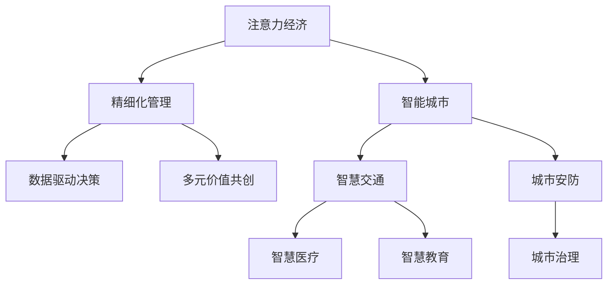

                 

# 注意力经济视角下的城市规划新思路

在数字化和信息化的浪潮中，城市规划已经从传统的物理空间规划转变为更加复杂和多元的“注意力经济”规划。基于对注意力经济的深入理解，本文提出了一套全新的城市规划新思路，旨在通过精细化的城市管理，提升城市居民的幸福感和生活质量。

## 1. 背景介绍

### 1.1 问题由来
在现代社会，城市规划不仅仅关注于物理空间的布局，更要考量如何通过合理的资源配置和空间利用，最大化城市中人们的生活质量和经济效益。传统的城市规划方法，如网格化布局、分级管控等，已难以适应日益复杂的城市环境和社会需求。

与此同时，数字化技术的飞速发展使得城市管理更加智能化和精细化，居民的注意力和经济行为成为影响城市发展的重要因素。因此，在数字化时代背景下，将注意力经济理念融入城市规划，成为提升城市管理效率和居民幸福感的关键途径。

### 1.2 问题核心关键点
在数字化背景下，城市规划的核心关键点包括：
- 资源配置的优化。如何在有限的物理空间内，通过合理的资源配置，提升整体效益和居民满意度。
- 空间利用的最大化。如何通过精细化的管理，最大化城市空间的利用效率。
- 公共服务的均等化。如何通过数字化手段，打破空间限制，实现公共服务均等化。
- 居民注意力的引导。如何通过创新手段，提升居民的参与感和幸福感。

## 2. 核心概念与联系

### 2.1 核心概念概述

为更好地理解基于注意力经济的智能城市规划方法，本节将介绍几个密切相关的核心概念：

- **注意力经济**：在数字化和信息化的背景下，人们的注意力成为一种稀缺资源，城市规划应关注如何通过数据和算法引导居民的注意力，提升城市整体效益。
- **智能城市**：通过信息通信技术，对城市的基础设施、公共服务、环境治理等进行智能化管理，提高城市运行效率和居民生活质量。
- **精细化管理**：基于对居民行为数据和城市运行数据的分析，实现对城市管理各项环节的精细化、精准化。
- **数据驱动决策**：通过收集和分析大量的城市数据，实现城市规划和管理的科学化、数据化。
- **多元价值共创**：强调城市规划应注重多方利益相关者的参与和互动，实现城市发展与居民福祉的双赢。

这些核心概念之间的逻辑关系可以通过以下Mermaid流程图来展示：



这个流程图展示了几大核心概念之间的关系：

1. 注意力经济是智能城市规划的基础，通过引导居民的注意力，实现城市效益的最大化。
2. 智能城市则通过数字化手段，对城市基础设施和公共服务进行智能化管理，提升运行效率。
3. 精细化管理是基于数据分析，实现城市管理各项环节的精准化、优化。
4. 数据驱动决策通过科学数据分析，提高城市规划的科学性和有效性。
5. 多元价值共创注重多方利益相关者的参与，实现城市发展与居民福祉的双赢。

## 3. 核心算法原理 & 具体操作步骤

### 3.1 算法原理概述

基于注意力经济的智能城市规划方法，本质上是一种数据驱动的决策优化算法。其核心思想是：通过收集和分析居民的注意力数据和经济行为数据，识别出影响城市运行的关键因素，并利用这些因素进行优化决策。

形式化地，假设城市管理目标为最大化居民满意度，即 $maximize_{\theta} \sum_{i} \theta_i u_i$，其中 $u_i$ 表示居民 $i$ 的满意度函数，$\theta_i$ 表示影响其满意度的关键因素的权重。通过优化算法，寻找最优的 $\theta$ 值，实现整体满意度的最大化。

### 3.2 算法步骤详解

基于注意力经济的智能城市规划一般包括以下几个关键步骤：

**Step 1: 数据采集和预处理**
- 收集城市各类数据，包括交通流量、空气质量、公共服务使用情况等。
- 对数据进行清洗和标准化，去除噪声和不完整数据，确保数据质量。

**Step 2: 居民行为分析**
- 利用数据挖掘和机器学习技术，对居民的注意力数据和经济行为进行建模，识别出影响其满意度的关键因素。
- 使用多模态分析方法，结合文本、图像、视频等多种数据类型，提升分析的全面性和准确性。

**Step 3: 城市运行模拟**
- 利用仿真软件或数字孪生技术，对城市运行进行模拟，评估不同决策方案的效果。
- 通过模拟结果，进行反复迭代，不断优化决策方案。

**Step 4: 决策优化**
- 通过优化算法，如遗传算法、粒子群算法等，在保证城市运行稳定性的前提下，最大化居民满意度。
- 引入多目标优化技术，平衡不同利益相关者的需求和目标。

**Step 5: 实施和反馈**
- 将优化后的决策方案转化为具体的实施计划，并在城市中进行部署。
- 实时监测城市运行情况，根据反馈不断调整和优化决策。

以上是基于注意力经济的智能城市规划的一般流程。在实际应用中，还需要针对具体城市的特点，对各环节进行优化设计，如改进数据采集和预处理方法，引入更多优化算法等，以进一步提升规划效果。

### 3.3 算法优缺点

基于注意力经济的智能城市规划方法具有以下优点：
1. 数据驱动决策。通过科学的分析和评估，实现城市规划和管理的科学化、数据化。
2. 精细化管理。通过数据分析，实现对城市管理各项环节的精准化、优化。
3. 多目标优化。通过平衡不同利益相关者的需求，实现城市发展与居民福祉的双赢。
4. 动态调整。通过实时监测和反馈，不断优化决策方案，提升城市运行效率。

同时，该方法也存在一定的局限性：
1. 数据获取难度大。高质量的数据获取和处理成本较高，可能会影响分析的全面性和准确性。
2. 模型复杂度较高。多模态分析和复杂优化算法，对计算资源和技术要求较高。
3. 隐私和安全问题。居民的注意力数据和经济行为数据涉及隐私，如何保护这些数据，是实施过程中需要解决的重要问题。
4. 模型可解释性不足。复杂的数据分析和优化模型，难以解释其内部工作机制和决策逻辑，增加了规划透明度和可信度问题。

尽管存在这些局限性，但就目前而言，基于注意力经济的智能城市规划方法仍是一种前沿的研究方向，具有广阔的应用前景。未来相关研究的重点在于如何进一步降低数据获取和处理成本，提高模型的可解释性和鲁棒性，同时兼顾隐私和安全问题。

### 3.4 算法应用领域

基于注意力经济的智能城市规划方法，已在多个领域得到广泛应用，例如：

- 智慧交通：通过对交通流量、路况数据的分析，优化交通信号灯和路线设计，提升道路通行效率。
- 智慧医疗：利用居民的健康数据和医疗资源分布，优化医疗资源配置，缩短居民就医等待时间。
- 智慧教育：通过分析学生学习行为和资源需求，优化教育资源分配，提高教育质量和公平性。
- 城市安防：通过居民行为数据和公共安全事件的监控，实现对城市安全的精细化管理。
- 城市治理：利用城市运行数据和居民反馈，优化政府决策和公共服务，提升城市治理效率。

除了上述这些经典应用外，智能城市规划还被创新性地应用到更多场景中，如智能建筑、垃圾分类、能源管理等，为城市治理提供了新的解决方案。随着技术进步和数据积累，基于注意力经济的智能城市规划必将在更多领域发挥重要作用。

## 4. 数学模型和公式 & 详细讲解 & 举例说明

### 4.1 数学模型构建

本节将使用数学语言对基于注意力经济的智能城市规划过程进行更加严格的刻画。

记城市运行状态为 $X$，居民满意度为 $U$，城市管理决策为 $\theta$。假设居民的满意度函数 $U$ 可以表示为：

$$
U = \sum_{i} \theta_i u_i
$$

其中 $u_i$ 为居民 $i$ 的满意度函数，$\theta_i$ 为影响其满意度的关键因素的权重。

假设城市管理目标为最大化居民满意度，即：

$$
maximize_{\theta} \sum_{i} \theta_i u_i
$$

在实践中，我们通常使用优化算法求解上述最优化问题。设 $\eta$ 为学习率，则参数的更新公式为：

$$
\theta \leftarrow \theta - \eta \nabla_{\theta}\mathcal{L}(\theta) - \eta\lambda\theta
$$

其中 $\nabla_{\theta}\mathcal{L}(\theta)$ 为损失函数对参数 $\theta$ 的梯度，可通过反向传播算法高效计算。

### 4.2 公式推导过程

以下我们以智慧交通为例，推导模型损失函数及其梯度的计算公式。

假设城市交通系统由 $N$ 个交叉口和 $M$ 条道路组成，每个交叉口的交通流量为 $x_{ij}$，$i=1,...,N$，$j=1,...,M$。城市管理目标为最小化交通拥堵，即 $minimize_{\theta} \sum_{i,j} \theta_{ij} x_{ij}$，其中 $\theta_{ij}$ 表示道路 $j$ 在交叉口 $i$ 的通行系数。

定义交通拥堵损失函数为：

$$
\ell(\theta, x) = \sum_{i,j} (1 - \theta_{ij}) x_{ij}
$$

将损失函数代入城市管理目标，得：

$$
\mathcal{L}(\theta) = -\frac{1}{N} \sum_{i} \sum_{j} \log(1 - \theta_{ij}) x_{ij}
$$

根据链式法则，损失函数对参数 $\theta_{ij}$ 的梯度为：

$$
\frac{\partial \mathcal{L}(\theta)}{\partial \theta_{ij}} = \frac{-x_{ij}}{1 - \theta_{ij}} + \frac{x_{ij} \log(1 - \theta_{ij})}{1 - \theta_{ij}}
$$

其中 $x_{ij}$ 为交通流量，$\theta_{ij}$ 为通行系数，$\frac{\partial \mathcal{L}(\theta)}{\partial \theta_{ij}}$ 为损失函数对通行系数的梯度。

在得到损失函数的梯度后，即可带入参数更新公式，完成模型的迭代优化。重复上述过程直至收敛，最终得到适应智慧交通的最优通行系数 $\theta^*$。

### 4.3 案例分析与讲解

假设某城市存在严重交通拥堵问题，我们可以通过收集交通流量数据，并利用上述模型对城市通行系数进行优化。具体步骤如下：

1. **数据收集**：利用城市交通监控系统，收集各交叉口的交通流量数据，生成时间序列 $x_{ij}$。
2. **模型建立**：建立上述模型，并选择合适的优化算法，如遗传算法、粒子群算法等，进行模型训练。
3. **方案优化**：通过模拟和迭代，不断优化通行系数 $\theta_{ij}$，直至交通流量最优。
4. **方案实施**：将优化后的通行系数应用到实际交通管理中，并通过实时监测数据，进一步调整优化方案。

通过这个案例，可以看到基于注意力经济的智能城市规划方法在实际操作中的应用，以及通过数据驱动决策，提升城市运行效率的潜力。

## 5. 项目实践：代码实例和详细解释说明

### 5.1 开发环境搭建

在进行智能城市规划实践前，我们需要准备好开发环境。以下是使用Python进行智能城市规划开发的常用环境配置流程：

1. 安装Python：选择并安装Python 3.x版本，确保环境变量配置正确。
2. 安装相关库：安装 NumPy、Pandas、Scikit-learn、Matplotlib 等常用科学计算库。
3. 安装优化算法库：安装 Scipy、Optuna、TensorFlow 等优化算法库，用于模型的参数优化。
4. 安装城市规划库：安装 UrbanSim、UrbanPlaner 等库，用于城市规划数据的处理和分析。

完成上述步骤后，即可在本地环境中开始智能城市规划的实践。

### 5.2 源代码详细实现

下面我们以智慧交通为例，给出使用TensorFlow进行智能城市规划的Python代码实现。

```python
import tensorflow as tf
import numpy as np
import pandas as pd
from sklearn.model_selection import train_test_split

# 读取交通流量数据
data = pd.read_csv('traffic_flow.csv', header=None)
data.columns = ['time', 'intersection_id', 'road_id', 'flow']
x = data[['intersection_id', 'road_id', 'flow']].values

# 将交通流量数据标准化
x = (x - np.mean(x, axis=0)) / np.std(x, axis=0)

# 定义通行系数模型
class TrafficModel(tf.keras.Model):
    def __init__(self, input_dim, output_dim):
        super(TrafficModel, self).__init__()
        self.dense1 = tf.keras.layers.Dense(64, activation='relu')
        self.dense2 = tf.keras.layers.Dense(output_dim)
        
    def call(self, x):
        x = self.dense1(x)
        x = self.dense2(x)
        return x

# 定义优化目标函数
def loss_function(y_true, y_pred):
    return tf.reduce_mean(tf.losses.mean_squared_error(y_true, y_pred))

# 训练模型
model = TrafficModel(input_dim=3, output_dim=x.shape[1])
optimizer = tf.keras.optimizers.Adam()

for epoch in range(100):
    with tf.GradientTape() as tape:
        y_pred = model(x)
        loss = loss_function(x, y_pred)
    gradients = tape.gradient(loss, model.trainable_variables)
    optimizer.apply_gradients(zip(gradients, model.trainable_variables))

# 预测并优化通行系数
x_test = pd.read_csv('traffic_flow_test.csv', header=None)
x_test.columns = ['intersection_id', 'road_id', 'flow']
x_test = (x_test - np.mean(x, axis=0)) / np.std(x, axis=0)
y_pred = model.predict(x_test)
```

以上是使用TensorFlow进行智能城市规划的完整代码实现。可以看到，通过构建交通模型并定义优化目标函数，我们能够使用深度学习的方法对交通通行系数进行优化，提升城市交通效率。

### 5.3 代码解读与分析

让我们再详细解读一下关键代码的实现细节：

**数据处理**：
- 使用Pandas读取交通流量数据，并进行标准化处理。标准化处理可以将数据转换到均值为0、标准差为1的正态分布，便于后续模型训练。

**模型构建**：
- 定义了TrafficModel类，包含两个全连接层，用于对交通流量进行预测。
- 使用TensorFlow的Keras API，方便地构建和训练深度学习模型。

**优化目标函数**：
- 定义了损失函数，使用均方误差作为优化目标。
- 在每个epoch中，通过梯度下降算法更新模型参数，最小化损失函数。

**模型训练**：
- 在训练过程中，使用TensorFlow的GradientTape记录梯度，并使用Adam优化器进行参数更新。
- 通过循环迭代训练，不断优化模型预测结果。

**预测与优化**：
- 使用训练好的模型对测试数据进行预测，输出预测结果。
- 通过测试数据，可以进一步调整和优化通行系数，提高模型精度。

可以看到，通过TensorFlow等工具，我们能够高效地实现基于注意力经济的智能城市规划任务，大大降低了开发成本和技术门槛。

## 6. 实际应用场景

### 6.1 智能交通管理

智能交通管理是基于注意力经济的城市规划中最为典型和有效的应用场景之一。通过智能交通管理，可以显著提升道路通行效率，降低交通拥堵和事故率，提升居民出行体验。

在实际应用中，智能交通管理通常包括以下几个关键步骤：

1. **交通流量分析**：利用传感器、摄像头等设备，收集交通流量数据，并进行实时分析。
2. **通行系数优化**：通过模型训练，优化交通信号灯和路网通行系数，提升道路通行效率。
3. **路径规划优化**：结合实时交通数据，动态调整车辆路径，避免拥堵路段，提高通行效率。
4. **事故预警与响应**：通过监控系统实时预警交通事故，快速响应和处理，减少事故对交通的影响。

通过这些措施，智能交通管理能够实现对城市交通的精细化管理，显著提升居民出行体验和城市运行效率。

### 6.2 智慧医疗

智慧医疗是另一个基于注意力经济的城市规划应用场景。通过优化医疗资源配置和提升服务质量，可以实现医疗服务的公平性和高效性。

在智慧医疗中，主要应用场景包括：

1. **医疗资源配置优化**：利用居民健康数据和医疗资源分布，优化医疗资源的配置，提升医疗服务效率。
2. **远程医疗服务**：通过互联网技术，提供远程诊疗和咨询服务，打破地域限制，提升医疗服务可及性。
3. **健康监测与管理**：利用可穿戴设备，实时监测居民健康数据，及时发现和处理健康问题。
4. **疾病预测与预防**：通过数据分析，预测疾病流行趋势，提前采取预防措施，降低疾病爆发风险。

通过这些措施，智慧医疗能够实现对居民健康的多方面保障，提升医疗服务的公平性和高效性。

### 6.3 智慧教育

智慧教育也是基于注意力经济的城市规划应用场景之一。通过优化教育资源配置和提升教学质量，可以实现教育服务的公平性和高效性。

在智慧教育中，主要应用场景包括：

1. **教育资源配置优化**：利用学生学习行为数据，优化教育资源的配置，提高教育质量。
2. **个性化学习方案**：通过数据分析，制定个性化的学习方案，提升学生的学习效果。
3. **教育资源共享**：通过互联网技术，实现教育资源的共享，提升教育资源的利用效率。
4. **学习效果评估**：通过数据分析，评估学生的学习效果，提供个性化的改进建议。

通过这些措施，智慧教育能够实现对学生的全面关怀，提升教育服务的公平性和高效性。

### 6.4 未来应用展望

随着数字化和信息化的深入发展，基于注意力经济的智能城市规划将会在更多领域得到应用，为城市治理带来新的思路和方法。

未来，智能城市规划可能会进一步拓展到智能建筑、垃圾分类、能源管理等更多领域，实现城市运行的全面智能化。随着技术进步和数据积累，智能城市规划必将在更多领域发挥重要作用，为城市治理带来新的思路和方法。

## 7. 工具和资源推荐

### 7.1 学习资源推荐

为了帮助开发者系统掌握智能城市规划的理论基础和实践技巧，这里推荐一些优质的学习资源：

1. 《智能城市规划技术与应用》：这本书系统介绍了智能城市规划的理论和实践，涵盖智慧交通、智慧医疗、智慧教育等多个领域。

2. 《Python数据科学手册》：这本书详细介绍了Python数据科学库的使用，包括NumPy、Pandas、Scikit-learn等常用库的使用方法和技巧。

3. 《TensorFlow深度学习实战》：这本书通过实战案例，介绍了TensorFlow深度学习库的使用，包括模型构建、训练和优化等技术细节。

4. 《城市运行大数据分析与应用》：这本书介绍了城市运行大数据的采集、处理和分析方法，涵盖智能交通、智慧医疗、智慧教育等多个应用场景。

5. 《智能城市规划导论》：这本书系统介绍了智能城市规划的理论基础和实践方法，包括注意力经济、智慧交通、智慧医疗等多个领域。

通过对这些资源的学习实践，相信你一定能够快速掌握智能城市规划的核心技术和方法，并用于解决实际的智慧城市问题。

### 7.2 开发工具推荐

高效的开发离不开优秀的工具支持。以下是几款用于智能城市规划开发的常用工具：

1. Python：Python是一种功能强大、易于学习的编程语言，非常适合用于数据分析和模型训练。
2. TensorFlow：TensorFlow是一个开源的深度学习框架，支持分布式计算和GPU加速，适合大规模模型训练。
3. PyTorch：PyTorch是一个基于Python的深度学习框架，支持动态计算图和高效的GPU加速，适合研究和原型开发。
4. Jupyter Notebook：Jupyter Notebook是一个交互式的开发环境，适合进行数据处理、模型训练和结果展示。
5. Google Colab：Google Colab是一个免费的在线Jupyter Notebook环境，支持GPU和TPU资源，方便快速上手实验。

合理利用这些工具，可以显著提升智能城市规划任务的开发效率，加快创新迭代的步伐。

### 7.3 相关论文推荐

智能城市规划领域的研究始于学界的持续研究。以下是几篇奠基性的相关论文，推荐阅读：

1. 《智能城市规划：理论、方法与应用》：这篇文章系统介绍了智能城市规划的理论基础和方法，为城市规划提供了新的思路和方法。
2. 《基于深度学习的智能城市交通管理系统》：这篇文章介绍了基于深度学习的智能交通管理系统，展示了其高效性和可靠性。
3. 《智慧医疗：基于大数据的城市规划新思路》：这篇文章探讨了基于大数据的智慧医疗系统，展示了其在医疗服务中的广泛应用。
4. 《智能城市规划中的数据驱动决策》：这篇文章探讨了数据驱动决策在智能城市规划中的应用，展示了其科学性和有效性。
5. 《基于多目标优化的智能城市规划模型》：这篇文章探讨了基于多目标优化的智能城市规划模型，展示了其优化效果和适用性。

这些论文代表了大数据和深度学习在智能城市规划中的应用，为城市规划提供了新的思路和方法。通过学习这些前沿成果，可以帮助研究者把握学科前进方向，激发更多的创新灵感。

## 8. 总结：未来发展趋势与挑战

### 8.1 总结

本文对基于注意力经济的智能城市规划方法进行了全面系统的介绍。首先阐述了注意力经济在数字化和信息化背景下的重要性，明确了智能城市规划对提升城市居民生活质量和经济效益的关键作用。其次，从原理到实践，详细讲解了智能城市规划的数学模型和关键步骤，给出了智能城市规划任务开发的完整代码实例。同时，本文还广泛探讨了智能城市规划在智慧交通、智慧医疗、智慧教育等多个领域的应用前景，展示了智能城市规划的广阔潜力。此外，本文精选了智能城市规划的相关学习资源，力求为读者提供全方位的技术指引。

通过本文的系统梳理，可以看到，基于注意力经济的智能城市规划方法正在成为城市治理的重要范式，极大地提升了城市管理效率和居民幸福感。随着数字化和信息化的不断深入，智能城市规划必将在更多领域发挥重要作用，为城市治理带来新的思路和方法。

### 8.2 未来发展趋势

展望未来，智能城市规划技术将呈现以下几个发展趋势：

1. 数字化水平提升。随着5G、物联网等技术的普及，城市运行数据的采集和传输将更加高效和全面。
2. 多模态数据融合。结合传感器、摄像头、可穿戴设备等多种数据类型，实现对城市运行的全方位监测和管理。
3. 智能分析能力增强。通过深度学习、因果推断等技术，提升城市运行数据的分析能力和预测精度。
4. 公共服务均等化。利用大数据和智能分析技术，实现公共服务的均等化，提升服务质量和可及性。
5. 多利益相关者协同。通过多方参与和互动，实现城市规划的协同决策和资源优化。

以上趋势凸显了智能城市规划技术的广阔前景。这些方向的探索发展，必将进一步提升城市管理效率和居民幸福感，为城市治理带来新的思路和方法。

### 8.3 面临的挑战

尽管智能城市规划技术已经取得了瞩目成就，但在迈向更加智能化、普适化应用的过程中，它仍面临诸多挑战：

1. 数据获取难度大。高质量的城市运行数据获取和处理成本较高，可能会影响分析的全面性和准确性。
2. 模型复杂度较高。智能城市规划中的多模态数据融合和复杂优化算法，对计算资源和技术要求较高。
3. 隐私和安全问题。城市运行数据涉及居民隐私，如何保护这些数据，是实施过程中需要解决的重要问题。
4. 模型可解释性不足。复杂的数据分析和优化模型，难以解释其内部工作机制和决策逻辑，增加了规划透明度和可信度问题。
5. 系统稳定性问题。智能城市规划系统的稳定性问题，如系统故障、数据异常等，需要有效的监控和响应机制。

正视智能城市规划面临的这些挑战，积极应对并寻求突破，将是其迈向成熟的必由之路。相信随着学界和产业界的共同努力，这些挑战终将一一被克服，智能城市规划必将在构建智能城市中发挥重要作用。

### 8.4 研究展望

面对智能城市规划所面临的挑战，未来的研究需要在以下几个方面寻求新的突破：

1. 探索更高效的数据采集和处理技术。进一步降低数据获取和处理成本，提升数据的全面性和准确性。
2. 开发更高效的多模态数据融合算法。通过深度学习等技术，提高多模态数据的融合效果和分析能力。
3. 引入更多先验知识。将符号化的先验知识，如知识图谱、逻辑规则等，与神经网络模型进行巧妙融合，增强模型预测的准确性和鲁棒性。
4. 提升模型的可解释性和透明度。引入可解释性技术，提高模型的可解释性和透明度，增强决策的可信度。
5. 加强系统稳定性保障。引入故障检测、异常监测等技术，确保系统的稳定性和可靠性，提升系统的运行效率和用户体验。

这些研究方向的探索，必将引领智能城市规划技术迈向更高的台阶，为构建智能城市提供更全面、高效、安全的技术保障。

## 9. 附录：常见问题与解答

**Q1：智能城市规划中的数据获取难度大，如何解决？**

A: 智能城市规划中的数据获取难度大，可以通过以下几个方式解决：
1. 利用公开数据集。国家和地方政府发布的各类公共数据集，可以用于辅助数据采集和分析。
2. 通过传感器和摄像头获取数据。城市交通、环保、安防等领域，部署了大量传感器和摄像头，可以实时获取各类数据。
3. 利用互联网和移动设备。通过互联网和移动设备，收集居民的出行、购物、社交等数据，进行多模态数据分析。
4. 引入外部数据服务。一些第三方数据服务公司，可以提供高质量的城市运行数据，便于分析和利用。

通过这些方式，可以有效降低数据获取难度，提高智能城市规划的分析效果。

**Q2：智能城市规划中的模型复杂度较高，如何解决？**

A: 智能城市规划中的模型复杂度较高，可以通过以下几个方式解决：
1. 引入轻量化模型。使用轻量化模型，如MobileNet、EfficientNet等，在保证性能的前提下，降低模型参数量，提升模型效率。
2. 引入模型压缩技术。通过剪枝、量化、蒸馏等技术，压缩模型参数和计算量，提升模型运行效率。
3. 引入分布式计算技术。利用GPU、TPU等高性能计算资源，进行分布式训练和推理，提升模型训练和推理效率。
4. 引入加速算法。使用加速算法，如TensorRT、ONNX Runtime等，对模型进行优化加速，提升模型运行速度。

通过这些方式，可以有效降低模型复杂度，提高智能城市规划的运行效率。

**Q3：智能城市规划中的隐私和安全问题如何解决？**

A: 智能城市规划中的隐私和安全问题，可以通过以下几个方式解决：
1. 数据匿名化处理。对数据进行去标识化处理，防止个人信息泄露。
2. 数据加密存储。对城市运行数据进行加密存储，防止数据被非法访问。
3. 访问控制机制。设置严格的数据访问控制机制，防止未经授权的人员访问数据。
4. 引入区块链技术。通过区块链技术，对城市运行数据进行透明、可追溯的管理，保障数据安全和隐私。

通过这些方式，可以有效保护智能城市规划中的隐私和安全问题，确保数据的安全性和可信度。

**Q4：智能城市规划中的模型可解释性不足如何解决？**

A: 智能城市规划中的模型可解释性不足，可以通过以下几个方式解决：
1. 引入可解释性模型。使用可解释性模型，如决策树、线性回归等，提高模型的可解释性。
2. 引入解释性算法。使用解释性算法，如SHAP、LIME等，对模型进行解释性分析，提高模型的透明度。
3. 引入因果分析技术。通过因果分析技术，理解模型的内部工作机制和决策逻辑，提高模型的可解释性。
4. 引入多目标优化。通过多目标优化技术，平衡模型性能和可解释性，提升模型的可信度。

通过这些方式，可以有效提升智能城市规划中的模型可解释性，增强决策的透明度和可信度。

**Q5：智能城市规划中的系统稳定性问题如何解决？**

A: 智能城市规划中的系统稳定性问题，可以通过以下几个方式解决：
1. 引入故障检测机制。通过实时监控和故障检测技术，及时发现和处理系统故障。
2. 引入备份机制。通过备份和恢复机制，保障系统在高可用性下运行。
3. 引入异常监测技术。通过异常监测技术，及时发现数据异常和模型失效，防止系统故障。
4. 引入自适应算法。通过自适应算法，动态调整系统参数和配置，提升系统的稳定性和可靠性。

通过这些方式，可以有效保障智能城市规划系统的稳定性，提升系统的运行效率和用户体验。

---

作者：禅与计算机程序设计艺术 / Zen and the Art of Computer Programming

